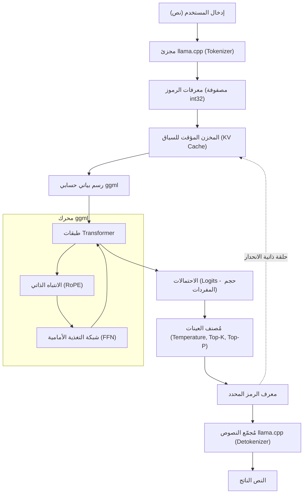

في السنوات الأخيرة، كان تطور النماذج اللغوية الكبيرة (LLMs) مذهلاً، ويتوسع نطاق تطبيقاتها يومًا بعد يوم. ومع ذلك، فإن تشغيل النماذج التي تحتوي على مليارات أو عشرات المليارات من المعلمات في بيئة محلية يتطلب عادةً وحدات معالجة رسومية (GPUs) متطورة مع ذاكرة VRAM ضخمة. لقد حطم **llama.cpp** "حاجز الأجهزة" هذا، مما أتاح استنتاجًا عمليًا لـ LLM على أجهزة الكمبيوتر الشخصية وأجهزة Mac العادية، وحتى أجهزة مثل Raspberry Pi.

في هذه المقالة، لن نقتصر على شرح كيفية استخدام أداة سطر الأوامر فقط، بل سنقدم شرحًا مفصلاً جدًا للمهندسين حول التكنولوجيا الأساسية لها، معمارية `ggml`، والخلفية الرياضية لـ Transformer والتكميم (Quantization)، وكيفية استخدام واجهة برمجة تطبيقات C++ لدمج وتخصيص LLM في تطبيقاتك الخاصة.

---

## 1. نظرة عامة على llama.cpp و ggml

`llama.cpp` هو محرك استنتاج LLM خفيف الوزن مكتوب بلغة C/C++، تم تطويره بواسطة Georgi Gerganov. في البداية، تم إنشاؤه بغرض تشغيل نماذج LLaMA من Meta بسرعات عالية على Apple Silicon (M1/M2 Mac)، ولكنه يدعم الآن مجموعة متنوعة من المعماريات والنماذج.

أكبر ميزة له هي أنه **تطبيق C/C++ نقي ولا يحتوي على تبعيات خارجية**. نظرًا لأنه لا يتطلب أنظمة بيئية ضخمة مثل Python أو PyTorch ويمكن تجميعه كملف تنفيذي واحد، فإن نشره سهل للغاية.

قلب `llama.cpp` هو مكتبة عمليات الموترات (Tensor) **ggml**. تم تصميم ggml من الصفر لتحسين عمليات المصفوفات في التعلم الآلي إلى أقصى حد على وحدات المعالجة المركزية (CPU) (وبعض وحدات المعالجة الرسومية GPU).

### 1.1 لماذا llama.cpp سريع؟

1. **الاستفادة من تعيين الذاكرة (mmap)**: عند تحميل أوزان النموذج في الذاكرة، يؤدي استخدام `mmap` الخاص بنظام التشغيل إلى تجنب التحميل الكامل في ذاكرة الوصول العشوائي (RAM)، مما يحقق بدء تشغيل سريع وتوفيرًا للذاكرة.
2. **التحسين الشامل لتعليمات SIMD**: يستفيد من مجموعات التعليمات الخاصة بوحدة المعالجة المركزية مثل AVX2 و AVX-512 و ARM NEON و Apple AMX لتسريع ضرب المصفوفات بشكل كبير.
3. **التكميم (Quantization)**: يضغط الأوزان ذات النقطة العائمة 16 بت (FP16) إلى أعداد صحيحة 4 بت، 5 بت، و 8 بت، مما يزيل اختناق عرض النطاق الترددي للذاكرة (سيتم تفصيل ذلك لاحقًا).

---

## 2. الخلفية الرياضية: Transformer والتكميم (Quantization)

لفهم llama.cpp بعمق، يجب أن تعرف الصيغ الرياضية التي يحسبها وكيف يقارب العمليات الحسابية.

### 2.1 عملية الاستنتاج في Transformer

تعتمد نماذج مثل LLaMA على معمارية Transformer Decoder ذاتية الانحدار (Auto-regressive). جوهر توليد النص هو آلية **Self-Attention**.

بالنسبة لمصفوفة الحالة المخفية المدخلة $X \in \mathbb{R}^{N \times d}$، يتم حساب الاستعلام (Query) $Q$ والمفتاح (Key) $K$ والقيمة (Value) $V$ من خلال الضرب مع مصفوفات الأوزان.

$$
Q = X W_Q, \quad K = X W_K, \quad V = X W_V
$$

هنا، يُعرَّف ناتج Attention على النحو التالي:

$$
\text{Attention}(Q, K, V) = \text{softmax}\left(\frac{QK^T}{\sqrt{d_k}}\right)V
$$

في حلقة استنتاج llama.cpp، يكمن عنق الزجاجة في ضرب مصفوفات الأوزان الضخمة هذه $W_Q, W_K, W_V$ ومصفوفات أوزان شبكة التغذية الأمامية (FFN) مع المتجه $X$ (في مرحلة التوليد $N=1$ لأنه يعالج رمزًا مميزًا (token) واحدًا في كل مرة)، أي **GEMV (General Matrix-Vector Multiplication)**.

### 2.2 الأساس الرياضي للتكميم (Quantization)

في الاستنتاج حيث يكون النطاق الترددي للوصول إلى الذاكرة هو عنق الزجاجة، فإن التكميم، الذي يمثل معلمات الوزن بعدد صغير من البتات، أمر لا غنى عنه. سنشرح المبدأ الأساسي للتكميم المعتمد على الكتل (مثل `Q4_K` أو `Q4_0`) المستخدم على نطاق واسع في llama.cpp.

على سبيل المثال، لنفترض كتلة $w = [w_1, w_2, \dots, w_B]$ بطول $B$ (عادةً 32 أو 64) وهي جزء من مصفوفة أوزان FP16 المسماة $W$. تُقارب هذه الكتلة إلى أعداد صحيحة 4 بت $q_i \in [-8, 7]$ وعامل مقياس (scaling factor) واحد $\Delta$ (إما FP16 أو FP32).

$$
w_i \approx \Delta \times q_i
$$

يتم تحديد $\Delta$ بناءً على القيمة المطلقة القصوى داخل الكتلة.

$$
\Delta = \frac{\max_i |w_i|}{7}
$$

عند حساب حاصل الضرب النقطي $y = w \cdot x$ باستخدام الأوزان المكممة، إذا قمنا أيضًا بتكميم متجه الإدخال $x$ ليصبح $x_i \approx \Delta_x \times q_{x, i}$، فإن:

$$
y = \sum_{i=1}^{B} w_i x_i \approx \Delta \Delta_x \sum_{i=1}^{B} q_i q_{x, i}
$$

الجزء الخاص بـ $\sum q_i q_{x, i}$ هو عبارة عن **عملية أعداد صحيحة نقية**، ويمكن حسابه بالتوازي بسرعة عالية جدًا باستخدام تعليمات SIMD. هذا هو السر الرياضي وراء السرعات المذهلة التي يحققها llama.cpp على وحدة المعالجة المركزية (CPU).

---

## 3. المعمارية وتدفق الاستنتاج

لفهم الأعمال الداخلية لـ llama.cpp، يُظهر مخطط Mermaid التالي بنية النظام بأكمله وتدفق البيانات.



توليد النص هو حلقة ذاتية الانحدار حيث أنه في كل مرة يتم فيها إخراج رمز مميز (Token) واحد، تتم إضافته إلى ذاكرة التخزين المؤقت KV كإدخال تالٍ ويمر عبر الرسم البياني الحسابي مرة أخرى.

---

## 4. إعداد البيئة وطريقة البناء

قبل دمج llama.cpp في مشاريع C++، دعنا نقوم أولاً ببناء الكود المصدري.

### 4.1 استنساخ المستودع

```bash
git clone https://github.com/ggerganov/llama.cpp.git
cd llama.cpp
```

### 4.2 البناء باستخدام CMake

إذا كنت تريد دمجه في تطبيقات أخرى كمشروع C++، فإن استخدام CMake هو الأكثر معيارية. من خلال تمكين المسرع (backend) الخاص بكل منصة، يمكنك تسريع العمليات الحسابية.

**وحدة المعالجة المركزية (CPU) فقط (بناء أساسي):**
```bash
mkdir build && cd build
cmake ..
cmake --build . --config Release -j 8
```

**في حالة استخدام وحدة معالجة رسومية NVIDIA GPU (CUDA):**
```bash
mkdir build && cd build
cmake .. -DGGML_CUDA=ON
cmake --build . --config Release -j 8
```

**في حالة استخدام Apple Silicon (Metal):**
```bash
mkdir build && cd build
cmake .. -DGGML_METAL=ON
cmake --build . --config Release -j 8
```

إذا نجح البناء، فسيتم إنشاء ملفات تنفيذية مثل `llama-cli` في الدليل `build/bin/`، ومكتبة `llama` (وكذلك مكتبة `ggml`) لربطها عبر واجهة برمجة تطبيقات C++ الموضحة أدناه.

---

## 5. مقدمة في التخصيص باستخدام C++: استخدام واجهة برمجة تطبيقات llama.cpp

من هنا، سنشرح الموضوع الرئيسي وهو كيفية التحكم في llama.cpp من كود C++.
لدمج LLM في تطبيقاتك الخاصة (مثل محركات الألعاب، تطبيقات سطح المكتب، الأنظمة المدمجة، إلخ) بدلاً من استخدام أداة سطر الأوامر فقط، ستحتاج إلى التفاعل مع واجهة برمجة تطبيقات C++ مباشرةً.

يوفر llama.cpp واجهة برمجة بلغة C بشكل أساسي من خلال ملف الرأس `llama.h`. حتى عند الاستدعاء من C++، يتم استخدام هذه الواجهة.

### 5.1 الحد الأدنى من التضمينات (Includes) والإعدادات

عند استخدام llama.cpp في مشروعك، قم بتضمين ما يلي:

```cpp
#include "llama.h"
#include <iostream>
#include <vector>
#include <string>
#include <stdexcept>

// ماكرو لمعالجة الأخطاء
#define LLAMA_ASSERT(x) \
    do { \
        if (!(x)) { \
            std::cerr << "Assertion failed: " << #x << std::endl; \
            std::terminate(); \
        } \
    } while (0)
```

### 5.2 تحميل النموذج وتهيئة السياق

أولاً، نقوم بتحميل ملف النموذج بصيغة `.gguf` ونخصص السياق (مساحة الذاكرة و KV Cache) للاستنتاج.

```cpp
int main(int argc, char ** argv) {
    if (argc < 2) {
        std::cerr << "Usage: " << argv[0] << " <model.gguf>" << std::endl;
        return 1;
    }
    std::string model_path = argv[1];

    // 1. تهيئة الواجهة الخلفية (إعداد بيئة CPU/GPU وغيرها)
    llama_backend_init();

    // 2. الحصول على الإعدادات الافتراضية لمعلمات النموذج
    llama_model_params model_params = llama_model_default_params();
    model_params.n_gpu_layers = 35; // عدد الطبقات التي يتم تفريغها إلى وحدة المعالجة الرسومية (GPU)

    // 3. تحميل النموذج
    llama_model * model = llama_load_model_from_file(model_path.c_str(), model_params);
    if (model == nullptr) {
        std::cerr << "Failed to load model" << std::endl;
        return 1;
    }

    // 4. إعداد معلمات السياق
    llama_context_params ctx_params = llama_context_default_params();
    ctx_params.n_ctx = 2048; // الحد الأقصى لحجم السياق (عدد الرموز)
    ctx_params.n_threads = 8; // عدد خيوط وحدة المعالجة المركزية (CPU threads) المستخدمة في الاستنتاج

    // 5. إنشاء السياق
    llama_context * ctx = llama_new_context_with_model(model, ctx_params);
    if (ctx == nullptr) {
        std::cerr << "Failed to create context" << std::endl;
        llama_free_model(model);
        return 1;
    }

    std::cout << "Model and context loaded successfully!" << std::endl;
    // ... العمليات اللاحقة
```

### 5.3 تقطيع النص الموجه إلى رموز (Tokenization)

لا تفهم نماذج LLM النصوص مباشرة، بل تعالجها كسلسلة من المعرفات الصحيحة (الرموز). يجب تحويل سلسلة الإدخال إلى رموز.

```cpp
    std::string prompt = "Q: ما هي عاصمة اليابان؟\nA:";
    std::vector<llama_token> tokens_list;
    tokens_list.resize(prompt.length() + 4); // حجم ذاكرة تخزين مؤقت به مساحة كافية

    // ما إذا كان سيتم إضافة رموز خاصة (مثل BOS: Begin of Sequence) في البداية
    bool add_special = true; 
    // تحويل السلسلة النصية إلى مصفوفة معرفات الرموز (Token IDs)
    int n_tokens = llama_tokenize(
        model, 
        prompt.c_str(), 
        prompt.length(), 
        tokens_list.data(), 
        tokens_list.size(), 
        add_special, 
        false // parse_special
    );

    if (n_tokens < 0) {
        // إذا كان المخزن المؤقت غير كافٍ، يجب إعادة تخصيصه وإعادة المحاولة (تم الحذف للتبسيط)
        std::cerr << "Failed to tokenize prompt" << std::endl;
        return 1;
    }
    tokens_list.resize(n_tokens);
```

### 5.4 حلقة الاستنتاج وأخذ العينات

تقوم بتمرير الرموز إلى النموذج، والحصول على التوزيع الاحتمالي للرمز التالي (Logits)، ثم إنشاء حلقة لأخذ عينات من تلك الاحتمالات لتحديد الرمز التالي.

```cpp
    // الحد الأقصى لعدد الرموز المراد توليدها
    const int max_gen_tokens = 100;
    
    // تهيئة الهيكل (struct) لتقييم الدُفعات (Batch evaluation)
    llama_batch batch = llama_batch_init(512, 0, 1);

    // إضافة رموز المُوجّه إلى الدُفعة
    for (size_t i = 0; i < tokens_list.size(); i++) {
        llama_batch_add(batch, tokens_list[i], i, { 0 }, false);
    }
    // إعداد لإخراج الاحتمالات (Logits - نتائج التوقع) فقط في الرمز الأخير من المُوجّه
    batch.logits[batch.n_tokens - 1] = true;

    // التقييم الأول (إطعام المُوجّه للنموذج)
    if (llama_decode(ctx, batch) != 0) {
        std::cerr << "llama_decode() failed" << std::endl;
        return 1;
    }

    int n_cur = batch.n_tokens; // طول السياق الحالي
    int n_decode = 0;

    std::cout << "\nOutput: ";

    // تهيئة سياق أخذ العينات (إعدادات Temperature, Top-K, Top-P وما إلى ذلك)
    llama_sampler * smpl = llama_sampler_chain_init(llama_sampler_chain_default_params());
    llama_sampler_chain_add_top_k(smpl, 40);
    llama_sampler_chain_add_top_p(smpl, 0.9f, 1);
    llama_sampler_chain_add_temp(smpl, 0.7f);
    llama_sampler_chain_add_dist(smpl, 1234); // قيمة البذرة (Seed)

    while (n_decode < max_gen_tokens) {
        // 1. أخذ العينات: توقع الرمز التالي بناءً على السياق الحالي
        llama_token new_token_id = llama_sampler_sample(smpl, ctx, -1);

        // 2. إنهاء الحلقة إذا كان الرمز هو EOS (End of Sequence)
        if (llama_token_is_eog(model, new_token_id)) {
            break;
        }

        // 3. فك تشفير الرمز إلى سلسلة نصية (نص) وعرضها
        char buf[128];
        int n_chars = llama_token_to_piece(model, new_token_id, buf, sizeof(buf), 0, false);
        if (n_chars > 0) {
            std::cout << std::string(buf, n_chars) << std::flush;
        }

        // 4. إعداد الرمز المولد حديثًا كدُفعة تالية
        llama_batch_clear(batch);
        llama_batch_add(batch, new_token_id, n_cur, { 0 }, true);

        // 5. تقييم النموذج (تحديث ذاكرة التخزين المؤقت KV وتوقع التالي)
        if (llama_decode(ctx, batch) != 0) {
            std::cerr << "Failed to evaluate" << std::endl;
            break;
        }

        n_cur += 1;
        n_decode += 1;
    }

    std::cout << std::endl;

    // التنظيف (Cleanup)
    llama_sampler_free(smpl);
    llama_batch_free(batch);
    llama_free(ctx);
    llama_free_model(model);
    llama_backend_free();

    return 0;
}
```

يقوم هذا الكود بتنفيذ حلقة استنتاج مخصصة باستخدام واجهة برمجة التطبيقات الأساسية لـ llama.cpp.
تتم إدارة مجموعة الرموز باستخدام هيكل `llama_batch`، ويتم تنفيذ التمرير الأمامي (الانتشار الأمامي) للشبكة العصبية بـ `llama_decode`.

---

## 6. دراسة حالة التخصيص المتقدم: معالجة Logits والتحكم في العقوبات (Penalty) عبر C++

بالإضافة إلى التوليد البسيط للنص، عندما تريد فرض إخراج بتنسيق معين (مثل JSON فقط)، أو التحكم لمنع إخراج كلمات محظورة معينة، يمكنك التحكم مباشرة في **الاحتمالات الأولية (Logits)** قبل أخذ العينات من جانب C++.

يمكنك الحصول على مصفوفة النتائج الخام (القيم قبل تحويلها إلى احتمالات) مباشرة قبل أن يخرج النموذج كل رمز.

```cpp
// الحصول على مصفوفة Logits الخام بعد الاستنتاج مباشرة، وقبل أخذ العينات
float * logits = llama_get_logits_ith(ctx, batch.n_tokens - 1);
int n_vocab = llama_n_vocab(model);

// قائمة بمعرفات الرموز المحظورة (على سبيل المثال 1234، 5678)
std::vector<llama_token> forbidden_tokens = { 1234, 5678 };

// تعيين احتمال ظهور الرموز المحظورة إلى 0 (جعل Logit سالب ما لا نهاية)
for (llama_token bad_tok : forbidden_tokens) {
    logits[bad_tok] = -INFINITY;
}
```

بهذه الطريقة، من خلال التعامل المباشر مع واجهة برمجة تطبيقات C++، يصبح **"التدخل على مستوى الميكروثانية والملي ثانية لكل دورة استنتاج"** ممكنًا، وهو أمر صعب التحقيق أو يتطلب عبئًا كبيرًا (Overhead) عند القيام به من خلال LangChain أو Python.

---

## 7. أسرار ضبط الأداء

فيما يلي بعض نقاط التحقق لزيادة السرعة إلى أقصى حد للتشغيل الفعلي بعد الانتهاء من التنفيذ في C++.

1. **تحسين معالجة الدفعات:** عند معالجة طلبات من عدة مستخدمين في نفس الوقت، يمكنك تضمين عدة تسلسلات في `llama_batch` واستدعاء `llama_decode` مرة واحدة (Continuous Batching). يتيح ذلك مشاركة الوصول إلى الذاكرة وتحسين الإنتاجية (Throughput) بشكل كبير.
2. **تفعيل Flash Attention:**
   من خلال تعيين `ctx_params.flash_attn = true;` في معلمات السياق، يمكنك تقليل استخدام الذاكرة مع تسريع حسابات Attention. هذا الإعداد ضروري عند التعامل مع سياقات طويلة (عشرات الآلاف من الرموز).
3. **دعم NUMA:**
   في بيئات الخوادم متعددة المقابس (Multi-socket)، من خلال تكوين إعدادات NUMA بشكل صحيح قبل `llama_backend_init()`، يمكنك تقليل وقت استجابة الوصول إلى الذاكرة (Latency).

---

## 8. خاتمة

في هذه المقالة، قدمنا شرحًا مفصلاً بدءًا من الخلفية الرياضية لـ `llama.cpp`، مرورًا بشرح المعمارية، ووصولاً إلى كيفية بناء محرك استنتاج مخصص باستخدام واجهة برمجة تطبيقات C++.

في حين أن النظام البيئي لـ Python ملائم للغاية للنماذج الأولية (Prototyping)، إلا أن التحكم المباشر عبر `llama.cpp` القائم على C/C++ يُظهر قوة ساحقة في بيئات الإنتاج التي تتطلب النشر على الأجهزة الطرفية (Edge devices)، والدمج في الألعاب، والمعالجة في الوقت الفعلي.

نشجعك على كتابة كود C++ بيدك وتجربة متعة التحكم بحرية في LLM في بيئتك المحلية.

> **مجموعة الروابط المرجعية**
> - [المستودع الرسمي llama.cpp](https://github.com/ggerganov/llama.cpp)
> - [ggml - مكتبة Tensor](https://github.com/ggerganov/ggml)
> - [Attention Is All You Need (Vaswani et al., 2017)](https://arxiv.org/abs/1706.03762)
