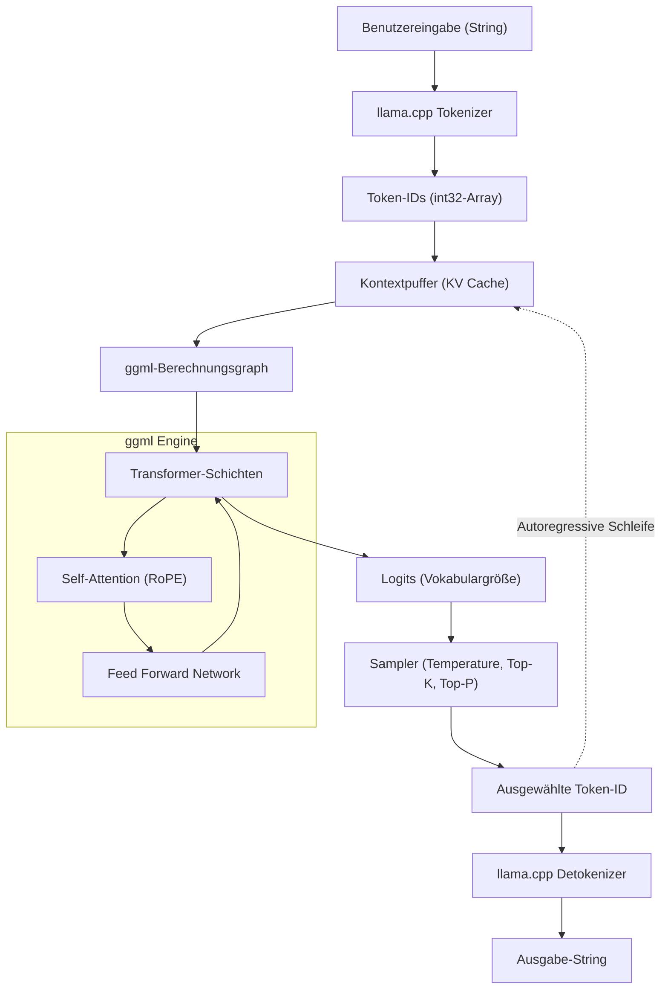

In den letzten Jahren war die Entwicklung von Large Language Models (LLMs) enorm und ihre Anwendungsbereiche erweitern sich täglich. Um jedoch Modelle mit Milliarden oder zig Milliarden Parametern in einer lokalen Umgebung auszuführen, benötigt man normalerweise eine High-End-GPU mit enorm viel VRAM. **llama.cpp** hat diese „Hardware-Barriere“ durchbrochen und ermöglicht praktische LLM-Inferenz auf gewöhnlichen PCs, Macs und sogar auf Geräten wie dem Raspberry Pi.

In diesem Artikel erklären wir nicht nur die Nutzung als reines Kommandozeilentool, sondern gehen für Entwickler äußerst detailliert auf die zugrunde liegende `ggml`-Architektur, den mathematischen Hintergrund von Transformern und Quantisierung sowie die Nutzung der C++-API ein, um LLMs in eigene Anwendungen zu integrieren und anzupassen.

---

## 1. Übersicht über llama.cpp und ggml

`llama.cpp` ist eine von Georgi Gerganov in C/C++ geschriebene, leichtgewichtige LLM-Inferenz-Engine. Ursprünglich wurde sie entwickelt, um Metas LLaMA-Modelle auf Apple Silicon (M1/M2 Macs) mit hoher Geschwindigkeit auszuführen, unterstützt aber mittlerweile verschiedene Architekturen und Modelle.

Das größte Merkmal ist, dass es sich um eine **reine C/C++-Implementierung ohne externe Abhängigkeiten** handelt. Da kein riesiges Ökosystem wie Python oder PyTorch benötigt wird und es als einzelne ausführbare Datei kompiliert werden kann, ist die Bereitstellung extrem einfach.

Das Herzstück von `llama.cpp` ist die Tensor-Berechnungsbibliothek **ggml**. ggml wurde von Grund auf neu entwickelt, um Matrixoperationen für maschinelles Lernen auf der CPU (und teilweise GPU) bis zum Äußersten zu optimieren.

### 1.1 Warum ist llama.cpp so schnell?

1. **Nutzung von Memory Mapping (mmap)**: Beim Laden der Modellgewichte in den Speicher wird durch die Nutzung der `mmap`-Funktion des Betriebssystems das vollständige Laden in den RAM vermieden, was zu einem schnellen Start und Speicherplatzeinsparungen führt.
2. **Umfassende Optimierung von SIMD-Befehlen**: CPU-spezifische Befehlssätze wie AVX2, AVX-512, ARM NEON und Apple AMX werden genutzt, um Matrixmultiplikationen extrem zu beschleunigen.
3. **Quantisierung (Quantization)**: Die Gewichte in 16-Bit-Gleitkommazahlen (FP16) werden in 4-Bit-, 5-Bit- oder 8-Bit-Ganzzahlen komprimiert, um Engpässe in der Speicherbandbreite zu beseitigen (Details siehe unten).

---

## 2. Mathematischer Hintergrund: Transformer und Quantisierung

Um llama.cpp tiefgreifend zu verstehen, muss man die mathematischen Formeln kennen, die es berechnet, und wissen, wie es diese Berechnungen annähert.

### 2.1 Transformer-Inferenzprozess

Modelle wie LLaMA verwenden eine autoregressive (Auto-regressive) Transformer-Decoder-Architektur. Der Kern der Textgenerierung ist der **Self-Attention**-Mechanismus.

Für eine Eingabematrix von verborgenen Zuständen $X \in \mathbb{R}^{N \times d}$ werden Query $Q$, Key $K$ und Value $V$ durch Multiplikation mit Gewichtsmatrizen berechnet:

$$
Q = X W_Q, \quad K = X W_K, \quad V = X W_V
$$

Hierbei ist die Ausgabe der Attention wie folgt definiert:

$$
\text{Attention}(Q, K, V) = \text{softmax}\left(\frac{QK^T}{\sqrt{d_k}}\right)V
$$

In der Inferenzschleife von llama.cpp liegt der Engpass in der Multiplikation dieser riesigen Matrizen $W_Q, W_K, W_V$ und der Gewichtsmatrizen des Feed-Forward-Networks (FFN) mit dem Vektor $X$ (da in der Generierungsphase Token für Token verarbeitet wird, ist $N=1$), also **GEMV (General Matrix-Vector Multiplication)**.

### 2.2 Mathematische Grundlagen der Quantisierung

In der Inferenz, bei der die Speicherzugriffsbandbreite der Engpass ist, ist die Quantisierung, bei der Gewichtsparameter mit einer kleinen Anzahl von Bits dargestellt werden, unerlässlich. Wir erklären das Grundprinzip der in llama.cpp weit verbreiteten blockweisen Quantisierung (z. B. `Q4_K` oder `Q4_0`).

Betrachten wir zum Beispiel einen Block $w = [w_1, w_2, \dots, w_B]$ der Länge $B$ (normalerweise 32 oder 64), der Teil der FP16-Gewichtsmatrix $W$ ist. Dieser Block wird durch eine 4-Bit-Ganzzahl $q_i \in [-8, 7]$ und einen einzelnen Skalierungsfaktor $\Delta$ (FP16 oder FP32) angenähert.

$$
w_i \approx \Delta \times q_i
$$

$\Delta$ wird basierend auf dem maximalen Absolutwert innerhalb des Blocks bestimmt.

$$
\Delta = \frac{\max_i |w_i|}{7}
$$

Wenn das Skalarprodukt $y = w \cdot x$ unter Verwendung der quantisierten Gewichte berechnet wird und der Eingabevektor $x$ ebenfalls quantisiert wird, sodass $x_i \approx \Delta_x \times q_{x, i}$, gilt:

$$
y = \sum_{i=1}^{B} w_i x_i \approx \Delta \Delta_x \sum_{i=1}^{B} q_i q_{x, i}
$$

Dieser Teil $\sum q_i q_{x, i}$ ist eine **reine Ganzzahloperation** und kann mithilfe von SIMD-Befehlen extrem schnell parallel berechnet werden. Das ist der mathematische Trick, der llama.cpp auf CPUs atemberaubende Geschwindigkeiten erreichen lässt.

---

## 3. Architektur und Inferenzfluss

Um die interne Funktionsweise von llama.cpp zu verstehen, zeigt das folgende Mermaid-Diagramm die Gesamtsystemarchitektur und den Datenfluss.



Die Textgenerierung ist eine autoregressive Schleife, bei der jedes ausgegebene Token als nächste Eingabe in den KV-Cache aufgenommen wird und den Berechnungsgraphen erneut durchläuft.

---

## 4. Einrichtung der Umgebung und Build-Methode

Bevor wir llama.cpp in ein C++-Projekt integrieren, lassen Sie uns zunächst den Quellcode kompilieren (builden).

### 4.1 Klonen des Repositorys

```bash
git clone https://github.com/ggerganov/llama.cpp.git
cd llama.cpp
```

### 4.2 Build mit CMake

Wenn Sie es als C++-Projekt in andere Anwendungen integrieren möchten, ist die Verwendung von CMake der Standardweg. Durch die Aktivierung von plattformspezifischen Beschleunigern (Backends) können Berechnungen beschleunigt werden.

**Nur CPU (Basis-Build):**
```bash
mkdir build && cd build
cmake ..
cmake --build . --config Release -j 8
```

**Bei Verwendung einer NVIDIA-GPU (CUDA):**
```bash
mkdir build && cd build
cmake .. -DGGML_CUDA=ON
cmake --build . --config Release -j 8
```

**Bei Verwendung von Apple Silicon (Metal):**
```bash
mkdir build && cd build
cmake .. -DGGML_METAL=ON
cmake --build . --config Release -j 8
```

Bei einem erfolgreichen Build werden ausführbare Dateien wie `llama-cli` und die `llama`-Bibliothek (sowie die `ggml`-Bibliothek) zur Verlinkung mit der unten beschriebenen C++-API im Verzeichnis `build/bin/` generiert.

---

## 5. Einführung in die C++-Anpassung: Nutzung der llama.cpp API

Von hier an behandeln wir das Hauptthema: die Steuerung von llama.cpp aus C++-Code.
Um ein LLM in Ihre eigenen Anwendungen (z. B. Spiel-Engines, Desktop-Apps, eingebettete Systeme usw.) zu integrieren, anstatt nur das Kommandozeilentool zu verwenden, müssen Sie die C++-API direkt aufrufen.

llama.cpp bietet hauptsächlich eine C-Schnittstelle über eine Header-Datei namens `llama.h`. Auch beim Aufruf aus C++ wird diese Schnittstelle verwendet.

### 5.1 Nötigste Includes und Einstellungen

Wenn Sie llama.cpp in Ihrem eigenen Projekt verwenden, inkludieren Sie Folgendes:

```cpp
#include "llama.h"
#include <iostream>
#include <vector>
#include <string>
#include <stdexcept>

// Makro zur Fehlerbehandlung
#define LLAMA_ASSERT(x) \
    do { \
        if (!(x)) { \
            std::cerr << "Assertion failed: " << #x << std::endl; \
            std::terminate(); \
        } \
    } while (0)
```

### 5.2 Modell laden und Kontext initialisieren

Zuerst laden wir die Modelldatei im `.gguf`-Format und reservieren den Kontext (Speicherplatz und KV-Cache) für die Inferenz.

```cpp
int main(int argc, char ** argv) {
    if (argc < 2) {
        std::cerr << "Usage: " << argv[0] << " <model.gguf>" << std::endl;
        return 1;
    }
    std::string model_path = argv[1];

    // 1. Initialisierung des Backends (Umgebungs-Setup wie CPU/GPU)
    llama_backend_init();

    // 2. Standardeinstellungen für Modellparameter abrufen
    llama_model_params model_params = llama_model_default_params();
    model_params.n_gpu_layers = 35; // Anzahl der auf die GPU ausgelagerten Schichten

    // 3. Modell laden
    llama_model * model = llama_load_model_from_file(model_path.c_str(), model_params);
    if (model == nullptr) {
        std::cerr << "Failed to load model" << std::endl;
        return 1;
    }

    // 4. Kontextparameter einstellen
    llama_context_params ctx_params = llama_context_default_params();
    ctx_params.n_ctx = 2048; // Maximale Kontextgröße (Anzahl der Tokens)
    ctx_params.n_threads = 8; // Anzahl der für die Inferenz verwendeten CPU-Threads

    // 5. Kontext erstellen
    llama_context * ctx = llama_new_context_with_model(model, ctx_params);
    if (ctx == nullptr) {
        std::cerr << "Failed to create context" << std::endl;
        llama_free_model(model);
        return 1;
    }

    std::cout << "Model and context loaded successfully!" << std::endl;
    // ... folgende Verarbeitung
```

### 5.3 Tokenisierung des Prompts (Tokenization)

LLMs verstehen Text nicht direkt, sondern verarbeiten ihn als eine Reihe von ganzzahligen IDs (Tokens). Die Eingabezeichenfolge muss in Tokens umgewandelt werden.

```cpp
    std::string prompt = "Q: Was ist die Hauptstadt von Japan?\nA:";
    std::vector<llama_token> tokens_list;
    tokens_list.resize(prompt.length() + 4); // Puffergröße mit etwas Spielraum

    // Ob spezielle Token (BOS: Begin of Sequence etc.) am Anfang hinzugefügt werden sollen
    bool add_special = true; 
    // Zeichenfolge in ein Array von Token-IDs umwandeln
    int n_tokens = llama_tokenize(
        model, 
        prompt.c_str(), 
        prompt.length(), 
        tokens_list.data(), 
        tokens_list.size(), 
        add_special, 
        false // parse_special
    );

    if (n_tokens < 0) {
        // Logik für Neuallokation und Wiederholung erforderlich, wenn der Puffer nicht ausreicht (hier zur Vereinfachung weggelassen)
        std::cerr << "Failed to tokenize prompt" << std::endl;
        return 1;
    }
    tokens_list.resize(n_tokens);
```

### 5.4 Inferenzschleife und Sampling

Wir erstellen eine Schleife, in der Tokens in das Modell eingespeist werden, die Wahrscheinlichkeitsverteilung (Logits) für das nächste Token abgerufen wird, und dann durch Sampling das nächste Token bestimmt wird.

```cpp
    // Maximale Anzahl der zu generierenden Tokens
    const int max_gen_tokens = 100;
    
    // Struktur für die Batch-Evaluierung initialisieren
    llama_batch batch = llama_batch_init(512, 0, 1);

    // Prompt-Tokens zum Batch hinzufügen
    for (size_t i = 0; i < tokens_list.size(); i++) {
        llama_batch_add(batch, tokens_list[i], i, { 0 }, false);
    }
    // So einstellen, dass Logits (Vorhersageergebnisse) nur für das letzte Token des Prompts ausgegeben werden
    batch.logits[batch.n_tokens - 1] = true;

    // Erste Evaluierung (Modell mit Prompt füttern)
    if (llama_decode(ctx, batch) != 0) {
        std::cerr << "llama_decode() failed" << std::endl;
        return 1;
    }

    int n_cur = batch.n_tokens; // Aktuelle Kontextlänge
    int n_decode = 0;

    std::cout << "\nOutput: ";

    // Sampler-Kontext initialisieren (Einstellungen wie Temperature, Top-K, Top-P etc.)
    llama_sampler * smpl = llama_sampler_chain_init(llama_sampler_chain_default_params());
    llama_sampler_chain_add_top_k(smpl, 40);
    llama_sampler_chain_add_top_p(smpl, 0.9f, 1);
    llama_sampler_chain_add_temp(smpl, 0.7f);
    llama_sampler_chain_add_dist(smpl, 1234); // Seed-Wert

    while (n_decode < max_gen_tokens) {
        // 1. Sampling: Vorhersage des nächsten Tokens basierend auf dem aktuellen Kontext
        llama_token new_token_id = llama_sampler_sample(smpl, ctx, -1);

        // 2. Wenn das Token EOS (End of Sequence) ist, Schleife beenden
        if (llama_token_is_eog(model, new_token_id)) {
            break;
        }

        // 3. Token in einen String (Text) dekodieren und anzeigen
        char buf[128];
        int n_chars = llama_token_to_piece(model, new_token_id, buf, sizeof(buf), 0, false);
        if (n_chars > 0) {
            std::cout << std::string(buf, n_chars) << std::flush;
        }

        // 4. Das neu generierte Token als nächsten Batch vorbereiten
        llama_batch_clear(batch);
        llama_batch_add(batch, new_token_id, n_cur, { 0 }, true);

        // 5. Modellevaluierung (KV-Cache aktualisieren und nächstes vorhersagen)
        if (llama_decode(ctx, batch) != 0) {
            std::cerr << "Failed to evaluate" << std::endl;
            break;
        }

        n_cur += 1;
        n_decode += 1;
    }

    std::cout << std::endl;

    // Bereinigung
    llama_sampler_free(smpl);
    llama_batch_free(batch);
    llama_free(ctx);
    llama_free_model(model);
    llama_backend_free();

    return 0;
}
```

Dieser Code implementiert eine eigene Inferenzschleife mit der Basis-API von llama.cpp.
Er verwendet die `llama_batch`-Struktur zur Verwaltung der Tokengruppen und führt mit `llama_decode` einen Forward-Pass (Vorwärtsausbreitung) des neuronalen Netzwerks aus.

---

## 6. Fortgeschrittenes Anpassungsbeispiel: Logit-Manipulation und Penalty-Steuerung mit C++

Wenn Sie nicht nur einfachen Text generieren, sondern eine Ausgabe in einem bestimmten Format (z. B. nur JSON) erzwingen oder die Ausgabe bestimmter verbotener Wörter verhindern möchten, können Sie die **Logits** vor dem Sampling direkt in C++ manipulieren.

Sie können das Array der rohen Scores (Werte vor der Umwandlung in Wahrscheinlichkeiten) kurz vor der Ausgabe jedes Tokens durch das Modell abrufen.

```cpp
// Rufen Sie das Array der rohen Logits direkt nach der Inferenz und vor dem Sampling ab
float * logits = llama_get_logits_ith(ctx, batch.n_tokens - 1);
int n_vocab = llama_n_vocab(model);

// Liste der IDs verbotener Tokens (Beispiel: 1234, 5678)
std::vector<llama_token> forbidden_tokens = { 1234, 5678 };

// Setzen Sie die Auftrittswahrscheinlichkeit verbotener Tokens auf 0 (Logit auf minus unendlich)
for (llama_token bad_tok : forbidden_tokens) {
    logits[bad_tok] = -INFINITY;
}
```

Durch die direkte Nutzung der C++-API werden **„Eingriffe im Mikrosekundenbereich pro Inferenzzyklus“** möglich, die über LangChain oder Python nur schwer zu realisieren wären oder mit großem Overhead verbunden sind.

---

## 7. Die Geheimnisse der Leistungsoptimierung (Performance Tuning)

Nach Abschluss der C++-Implementierung finden Sie hier einige Kontrollpunkte, um die Geschwindigkeit für den praktischen Einsatz auf das Maximum zu steigern.

1. **Optimierung der Batch-Verarbeitung:** Bei der gleichzeitigen Verarbeitung von Anfragen mehrerer Benutzer können Sie mehrere Sequenzen in einen `llama_batch` aufnehmen und `llama_decode` einmalig aufrufen (Continuous Batching). Dies bündelt Speicherzugriffe und kann den Durchsatz drastisch verbessern.
2. **Flash Attention aktivieren:**
   Durch Setzen von `ctx_params.flash_attn = true;` in den Kontextparametern können Sie die Attention-Berechnung beschleunigen und gleichzeitig den Speicherverbrauch reduzieren. Bei der Arbeit mit langen Kontexten (Zehntausende von Tokens) ist diese Einstellung zwingend erforderlich.
3. **NUMA-Unterstützung:**
   In Multi-Socket-Serverumgebungen kann die Speicherzugriffslatenz reduziert werden, indem NUMA vor dem Aufruf von `llama_backend_init()` entsprechend konfiguriert wird.

---

## 8. Fazit

In diesem Artikel haben wir detailliert alles vom mathematischen Hintergrund von `llama.cpp` über die Erklärung seiner Architektur bis hin zur Erstellung einer benutzerdefinierten Inferenz-Engine mithilfe der C++-API behandelt.

Während das Python-Ökosystem sehr nützlich für Prototyping ist, zeigt die direkte Steuerung des C/C++-basierten `llama.cpp` in Produktionsumgebungen, die Deployments auf Edge-Geräten, Integrationen in Spiele und Echtzeitverarbeitung erfordern, ihre überwältigende Stärke.

Wir laden Sie ein, eigenen C++-Code zu schreiben und den Spaß zu erleben, LLMs in Ihrer lokalen Umgebung frei zu steuern.

> **Referenzlinks**
> - [llama.cpp Official Repository](https://github.com/ggerganov/llama.cpp)
> - [ggml - Tensor Library](https://github.com/ggerganov/ggml)
> - [Attention Is All You Need (Vaswani et al., 2017)](https://arxiv.org/abs/1706.03762)
