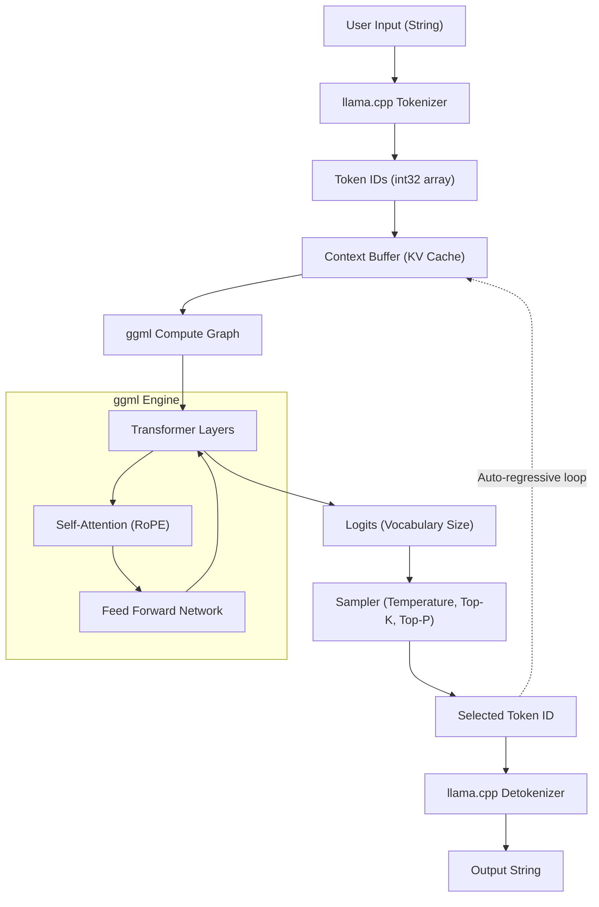

In recent years, the evolution of Large Language Models (LLMs) has been tremendous, and their scope of application is expanding daily. However, running models with billions or tens of billions of parameters locally typically requires a high-end GPU with an enormous amount of VRAM. Breaking through this "hardware barrier" and making practical LLM inference possible on everyday PCs, Macs, and even devices like the Raspberry Pi is **llama.cpp**.

This article goes beyond just explaining how to use the command-line tool. It provides an extremely detailed explanation for engineers, covering the architecture of its underlying technology `ggml`, the mathematical background of Transformers and quantization, and how to use the C++ API to integrate and customize LLMs within your own applications.

---

## 1. Overview of llama.cpp and ggml

`llama.cpp` is a lightweight LLM inference engine written in C/C++, developed by Georgi Gerganov. Originally created with the goal of running Meta's LLaMA model quickly on Apple Silicon (M1/M2 Macs), it now supports a variety of architectures and models.

Its biggest feature is that it is a **pure C/C++ implementation with no external dependencies**. Because it doesn't require a massive ecosystem like Python or PyTorch and can be compiled as a single executable, deployment is incredibly easy.

The heart of `llama.cpp` is the tensor math library **ggml**. ggml was designed from the ground up to maximally optimize matrix operations in machine learning on CPUs (and some GPUs).

### 1.1 Why is llama.cpp so fast?

1. **Leveraging Memory Mapping (mmap)**: When loading model weights into memory, it uses the OS's `mmap` to avoid loading everything into RAM, enabling fast startups and saving memory.
2. **Thorough Optimization of SIMD Instructions**: It utilizes CPU-specific instruction sets like AVX2, AVX-512, ARM NEON, and Apple AMX to perform ultra-fast matrix multiplications.
3. **Quantization**: It compresses 16-bit floating-point (FP16) weights into 4-bit, 5-bit, or 8-bit integers, resolving the memory bandwidth bottleneck (more on this later).

---

## 2. Mathematical Background: Transformers and Quantization

To deeply understand llama.cpp, you need to know the mathematical formulas it calculates and how it approximates these calculations.

### 2.1 The Inference Process of a Transformer

Models like LLaMA adopt an auto-regressive Transformer decoder architecture. The core of text generation is the **Self-Attention** mechanism.

For an input hidden state matrix $X \in \mathbb{R}^{N \times d}$, the Query $Q$, Key $K$, and Value $V$ are calculated by multiplying with weight matrices:

$$
Q = X W_Q, \quad K = X W_K, \quad V = X W_V
$$

Here, the output of Attention is defined as follows:

$$
\text{Attention}(Q, K, V) = \text{softmax}\left(\frac{QK^T}{\sqrt{d_k}}\right)V
$$

In the inference loop of llama.cpp, the bottleneck is the multiplication of these massive matrices $W_Q, W_K, W_V$ and the feed-forward network (FFN) weight matrices with the vector $X$ ($N=1$ in the generation phase because it processes one token at a time), which is **GEMV (General Matrix-Vector Multiplication)**.

### 2.2 The Mathematical Foundation of Quantization

In inference where memory access bandwidth becomes a bottleneck, quantization—representing weight parameters with a small number of bits—is essential. Here, we'll explain the basic principles of the block-wise quantization widely used in llama.cpp (e.g., `Q4_K` or `Q4_0`).

For example, consider a block $w = [w_1, w_2, \dots, w_B]$ of length $B$ (usually 32 or 64) that is part of an FP16 weight matrix $W$. This block is approximated using 4-bit integers $q_i \in [-8, 7]$ and a single scaling factor $\Delta$ (FP16 or FP32):

$$
w_i \approx \Delta \times q_i
$$

$\Delta$ is determined based on the maximum absolute value within the block:

$$
\Delta = \frac{\max_i |w_i|}{7}
$$

When calculating the dot product $y = w \cdot x$ using the quantized weights, if the input vector $x$ is similarly quantized to $x_i \approx \Delta_x \times q_{x, i}$, we get:

$$
y = \sum_{i=1}^{B} w_i x_i \approx \Delta \Delta_x \sum_{i=1}^{B} q_i q_{x, i}
$$

The $\sum q_i q_{x, i}$ part becomes a **pure integer operation**, which can be computed in parallel very quickly using SIMD instructions. This is the mathematical trick behind the astonishing speed of llama.cpp on CPUs.

---

## 3. Architecture and Inference Flow

To understand the internal workings of llama.cpp, the following Mermaid diagram shows the overall system architecture and data flow.



Text generation is an auto-regressive loop where, each time a single token is output, it is added to the KV Cache as the next input and passes through the compute graph again.

---

## 4. Environment Setup and Build Guide

Before embedding llama.cpp into a C++ project, let's first build the source code.

### 4.1 Cloning the Repository

```bash
git clone https://github.com/ggerganov/llama.cpp.git
cd llama.cpp
```

### 4.2 Building with CMake

When embedding it into other applications as a C++ project, using CMake is the most standard approach. By enabling accelerators (backends) for your specific platform, you can speed up computations.

**CPU Only (Basic Build):**
```bash
mkdir build && cd build
cmake ..
cmake --build . --config Release -j 8
```

**Using NVIDIA GPU (CUDA):**
```bash
mkdir build && cd build
cmake .. -DGGML_CUDA=ON
cmake --build . --config Release -j 8
```

**Using Apple Silicon (Metal):**
```bash
mkdir build && cd build
cmake .. -DGGML_METAL=ON
cmake --build . --config Release -j 8
```

Upon a successful build, executable files like `llama-cli` and the `llama` library (along with the `ggml` library) for linking via the C++ API discussed later will be generated in the `build/bin/` directory.

---

## 5. Introduction to C++ Customization: Using the llama.cpp API

From here on, we will discuss the main topic: controlling llama.cpp from C++ code.
To embed an LLM into your own application (e.g., a game engine, desktop app, or embedded system) rather than just using command-line tools, you need to hit the C++ API directly.

llama.cpp primarily provides a C language interface through a header file called `llama.h`. We use this interface even when calling from C++.

### 5.1 Minimal Necessary Includes and Setup

When using llama.cpp in your project, include the following:

```cpp
#include "llama.h"
#include <iostream>
#include <vector>
#include <string>
#include <stdexcept>

// Macro for error handling
#define LLAMA_ASSERT(x) \
    do { \
        if (!(x)) { \
            std::cerr << "Assertion failed: " << #x << std::endl; \
            std::terminate(); \
        } \
    } while (0)
```

### 5.2 Loading the Model and Initializing the Context

First, load a `.gguf` format model file and allocate the context (memory space and KV cache) for inference.

```cpp
int main(int argc, char ** argv) {
    if (argc < 2) {
        std::cerr << "Usage: " << argv[0] << " <model.gguf>" << std::endl;
        return 1;
    }
    std::string model_path = argv[1];

    // 1. Initialize the backend (set up environment like CPU/GPU)
    llama_backend_init();

    // 2. Get default settings for model parameters
    llama_model_params model_params = llama_model_default_params();
    model_params.n_gpu_layers = 35; // Number of layers to offload to GPU

    // 3. Load the model
    llama_model * model = llama_load_model_from_file(model_path.c_str(), model_params);
    if (model == nullptr) {
        std::cerr << "Failed to load model" << std::endl;
        return 1;
    }

    // 4. Set context parameters
    llama_context_params ctx_params = llama_context_default_params();
    ctx_params.n_ctx = 2048; // Maximum context size (number of tokens)
    ctx_params.n_threads = 8; // Number of CPU threads used for inference

    // 5. Create the context
    llama_context * ctx = llama_new_context_with_model(model, ctx_params);
    if (ctx == nullptr) {
        std::cerr << "Failed to create context" << std::endl;
        llama_free_model(model);
        return 1;
    }

    std::cout << "Model and context loaded successfully!" << std::endl;
    // ... subsequent processing
```

### 5.3 Tokenization of the Prompt

An LLM does not understand text directly; it processes strings as sequences of integer IDs (tokens). Therefore, the input string must be converted into tokens.

```cpp
    std::string prompt = "Q: What is the capital of Japan?\nA:";
    std::vector<llama_token> tokens_list;
    tokens_list.resize(prompt.length() + 4); // Buffer size with some headroom

    // Whether to prepend a special token (like BOS: Begin of Sequence)
    bool add_special = true; 
    // Convert string to an array of token IDs
    int n_tokens = llama_tokenize(
        model, 
        prompt.c_str(), 
        prompt.length(), 
        tokens_list.data(), 
        tokens_list.size(), 
        add_special, 
        false // parse_special
    );

    if (n_tokens < 0) {
        // Handling for when the buffer is insufficient, like reallocating and retrying, is necessary (omitted for brevity)
        std::cerr << "Failed to tokenize prompt" << std::endl;
        return 1;
    }
    tokens_list.resize(n_tokens);
```

### 5.4 Inference Loop and Sampling

Build a loop that feeds tokens into the model, obtains the probability distribution (Logits) of the next token, and samples from it to determine the next token.

```cpp
    // Maximum number of tokens to generate
    const int max_gen_tokens = 100;
    
    // Initialize structure for batch evaluation
    llama_batch batch = llama_batch_init(512, 0, 1);

    // Add prompt tokens to the batch
    for (size_t i = 0; i < tokens_list.size(); i++) {
        llama_batch_add(batch, tokens_list[i], i, { 0 }, false);
    }
    // Set to output logits (predictions) only for the very last token of the prompt
    batch.logits[batch.n_tokens - 1] = true;

    // Initial evaluation (feeding the prompt to the model)
    if (llama_decode(ctx, batch) != 0) {
        std::cerr << "llama_decode() failed" << std::endl;
        return 1;
    }

    int n_cur = batch.n_tokens; // Current context length
    int n_decode = 0;

    std::cout << "\nOutput: ";

    // Initialize sampler context (settings for Temperature, Top-K, Top-P, etc.)
    llama_sampler * smpl = llama_sampler_chain_init(llama_sampler_chain_default_params());
    llama_sampler_chain_add_top_k(smpl, 40);
    llama_sampler_chain_add_top_p(smpl, 0.9f, 1);
    llama_sampler_chain_add_temp(smpl, 0.7f);
    llama_sampler_chain_add_dist(smpl, 1234); // Seed value

    while (n_decode < max_gen_tokens) {
        // 1. Sampling: Predict the next token based on current context
        llama_token new_token_id = llama_sampler_sample(smpl, ctx, -1);

        // 2. If token is EOS (End of Sequence), break the loop
        if (llama_token_is_eog(model, new_token_id)) {
            break;
        }

        // 3. Decode token to string (text) and print
        char buf[128];
        int n_chars = llama_token_to_piece(model, new_token_id, buf, sizeof(buf), 0, false);
        if (n_chars > 0) {
            std::cout << std::string(buf, n_chars) << std::flush;
        }

        // 4. Prepare the newly generated token as the next batch
        llama_batch_clear(batch);
        llama_batch_add(batch, new_token_id, n_cur, { 0 }, true);

        // 5. Evaluate the model (update KV cache and predict next)
        if (llama_decode(ctx, batch) != 0) {
            std::cerr << "Failed to evaluate" << std::endl;
            break;
        }

        n_cur += 1;
        n_decode += 1;
    }

    std::cout << std::endl;

    // Cleanup
    llama_sampler_free(smpl);
    llama_batch_free(batch);
    llama_free(ctx);
    llama_free_model(model);
    llama_backend_free();

    return 0;
}
```

This code implements a custom inference loop using the basic API of llama.cpp.
It uses the `llama_batch` struct to manage token groups and executes the forward pass of the neural network using `llama_decode`.

---

## 6. Advanced Customization Examples: Logit Manipulation and Penalty Control in C++

When you want to go beyond simple text generation—such as forcing output in a specific format (e.g., JSON only) or suppressing specific forbidden words—you directly manipulate the **Logits** prior to sampling from the C++ side.

You can retrieve the array of raw scores (values before being converted to probabilities) right before the model outputs each token.

```cpp
// Retrieve the raw logits array immediately after inference, prior to sampling
float * logits = llama_get_logits_ith(ctx, batch.n_tokens - 1);
int n_vocab = llama_n_vocab(model);

// List of forbidden token IDs (for example: 1234, 5678)
std::vector<llama_token> forbidden_tokens = { 1234, 5678 };

// Set the occurrence probability of forbidden tokens to 0 (make the Logit negative infinity)
for (llama_token bad_tok : forbidden_tokens) {
    logits[bad_tok] = -INFINITY;
}
```

In this way, directly interacting with the C++ API allows for **"micro-millisecond interventions per inference cycle"** that would be difficult or incur high overhead if done via LangChain or Python.

---

## 7. The Secrets of Performance Tuning

After finishing your C++ implementation, here are a few checkpoints for maximizing speed for actual deployment.

1. **Optimizing Batch Processing:** When handling requests from multiple users concurrently, include multiple sequences in `llama_batch` and call `llama_decode` at once (Continuous Batching). This drastically improves throughput by coalescing memory access.
2. **Enabling Flash Attention:**
   By setting `ctx_params.flash_attn = true;` in the context parameters, you can speed up Attention calculations while reducing memory usage. This setting is essential when dealing with long contexts (tens of thousands of tokens).
3. **NUMA Support:**
   In multi-socket server environments, properly configuring NUMA before `llama_backend_init()` can reduce memory access latency.

---

## 8. Conclusion

In this article, we covered everything in detail, starting from the mathematical background of `llama.cpp` to an explanation of its architecture, and finally, how to build a custom inference engine fully utilizing the C++ API.

While the Python ecosystem is highly convenient for prototyping, the direct control offered by C/C++ based `llama.cpp` demonstrates overwhelming power in production environments that demand edge device deployment, game integration, and real-time processing.

By all means, try writing C++ code yourself and experience the joy of freely manipulating LLMs in a local environment.

> **Reference Links**
> - [llama.cpp Official Repository](https://github.com/ggerganov/llama.cpp)
> - [ggml - Tensor Library](https://github.com/ggerganov/ggml)
> - [Attention Is All You Need (Vaswani et al., 2017)](https://arxiv.org/abs/1706.03762)
