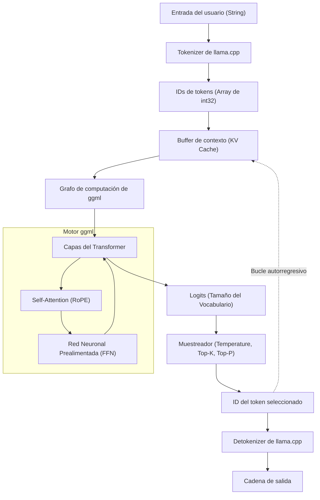

En los últimos años, la evolución de los Grandes Modelos de Lenguaje (LLM) ha sido asombrosa, y su ámbito de aplicación se expande día a día. Sin embargo, para ejecutar modelos con miles o decenas de miles de millones de parámetros en un entorno local, normalmente se requiere una GPU de gama alta con una enorme cantidad de VRAM. Quien ha derribado este "muro de hardware" y ha hecho posible la inferencia práctica de LLMs en PCs y Macs comunes, e incluso en dispositivos como Raspberry Pi, es **llama.cpp**.

En este artículo, no nos limitaremos a explicar cómo usar la herramienta de línea de comandos, sino que profundizaremos detalladamente para ingenieros en la arquitectura de su tecnología base `ggml`, el trasfondo matemático de los Transformers y la cuantización, así como la forma de integrar y personalizar LLMs en aplicaciones propias utilizando la API de C++.

---

## 1. Visión general de llama.cpp y ggml

`llama.cpp` es un motor de inferencia de LLM ligero escrito en C/C++ desarrollado por Georgi Gerganov. Originalmente nació con el objetivo de ejecutar rápidamente el modelo LLaMA de Meta en Apple Silicon (M1/M2 Mac), pero en la actualidad soporta diversas arquitecturas y modelos.

Su mayor característica es que es **una implementación pura en C/C++ sin dependencias externas**. No requiere ecosistemas gigantescos como Python o PyTorch, y dado que se puede compilar como un único archivo ejecutable, su despliegue es sumamente sencillo.

El corazón de este `llama.cpp` es la biblioteca de operaciones con tensores **ggml**. ggml está diseñada desde cero para optimizar al máximo las operaciones matriciales de aprendizaje automático en CPU (y algunas GPU).

### 1.1 ¿Por qué llama.cpp es rápido?

1. **Uso de mapeo de memoria (mmap)**: Al cargar los pesos del modelo en memoria, se utiliza la función `mmap` del sistema operativo, evitando cargar todo en la RAM y logrando un inicio rápido y un uso eficiente de la memoria.
2. **Optimización exhaustiva de instrucciones SIMD**: Se aprovechan los conjuntos de instrucciones específicos de la CPU como AVX2, AVX-512, ARM NEON y Apple AMX, acelerando exponencialmente la multiplicación de matrices.
3. **Cuantización (Quantization)**: Comprime los pesos de números de punto flotante de 16 bits (FP16) a enteros de 4, 5 u 8 bits, eliminando los cuellos de botella del ancho de banda de la memoria (se explicará en detalle más adelante).

---

## 2. Trasfondo matemático: Transformer y Cuantización (Quantization)

Para comprender profundamente llama.cpp, es necesario conocer las fórmulas matemáticas que calcula y cómo aproxima dichos cálculos.

### 2.1 Proceso de inferencia del Transformer

Modelos como LLaMA adoptan una arquitectura de decodificador Transformer de tipo autorregresivo (Auto-regressive). El núcleo de la generación de texto es el mecanismo de **Self-Attention**.

Para una matriz de estado oculto de entrada $X \in \mathbb{R}^{N \times d}$, la consulta $Q$ (Query), la clave $K$ (Key) y el valor $V$ (Value) se calculan mediante el producto con matrices de pesos.

$$
Q = X W_Q, \quad K = X W_K, \quad V = X W_V
$$

Aquí, la salida de la Attention se define de la siguiente manera:

$$
\text{Attention}(Q, K, V) = \text{softmax}\left(\frac{QK^T}{\sqrt{d_k}}\right)V
$$

En el bucle de inferencia de llama.cpp, el cuello de botella es el producto de estas enormes matrices $W_Q, W_K, W_V$ o la matriz de pesos de la red prealimentada (FFN) con el vector $X$ (en la fase de generación, como se procesa token por token, $N=1$), es decir, **GEMV (General Matrix-Vector Multiplication)**.

### 2.2 Fundamentos matemáticos de la Cuantización

En la inferencia donde el ancho de banda de acceso a memoria se convierte en el cuello de botella, la cuantización, que representa los parámetros de peso con un número reducido de bits, es indispensable. Explicaremos el principio básico de la cuantización por bloques (por ejemplo, `Q4_K` o `Q4_0`) ampliamente utilizada en llama.cpp.

Por ejemplo, consideremos un bloque $w = [w_1, w_2, \dots, w_B]$ de longitud $B$ (generalmente 32 o 64) que es parte de la matriz de pesos FP16 $W$. Este bloque se aproxima a un entero de 4 bits $q_i \in [-8, 7]$ y un único factor de escala $\Delta$ (FP16 o FP32).

$$
w_i \approx \Delta \times q_i
$$

$\Delta$ se determina en base al valor absoluto máximo dentro del bloque.

$$
\Delta = \frac{\max_i |w_i|}{7}
$$

Al calcular el producto punto $y = w \cdot x$ utilizando los pesos cuantizados, si cuantizamos el vector de entrada $x$ de la misma manera como $x_i \approx \Delta_x \times q_{x, i}$, tenemos:

$$
y = \sum_{i=1}^{B} w_i x_i \approx \Delta \Delta_x \sum_{i=1}^{B} q_i q_{x, i}
$$

Esta parte de $\sum q_i q_{x, i}$ se convierte en **aritmética puramente entera**, y se puede calcular en paralelo a una velocidad altísima utilizando instrucciones SIMD. Este es el truco matemático por el cual llama.cpp logra velocidades sorprendentes en CPU.

---

## 3. Arquitectura y flujo de inferencia

Para comprender el funcionamiento interno de llama.cpp, el siguiente diagrama de Mermaid muestra la arquitectura de todo el sistema y el flujo de datos.



La generación de texto es un bucle autorregresivo donde, cada vez que se emite un token, este se añade a la KV Cache como la siguiente entrada y pasa nuevamente por el grafo de computación.

---

## 4. Configuración del entorno y método de compilación

Antes de integrar llama.cpp en un proyecto C++, primero intentemos compilar el código fuente.

### 4.1 Clonar el repositorio

```bash
git clone https://github.com/ggerganov/llama.cpp.git
cd llama.cpp
```

### 4.2 Compilación usando CMake

Para integrarlo como un proyecto C++ en otras aplicaciones, usar CMake es lo más estándar. Al habilitar los aceleradores (backends) específicos de la plataforma, se puede acelerar el cálculo.

**Solo CPU (Compilación básica):**
```bash
mkdir build && cd build
cmake ..
cmake --build . --config Release -j 8
```

**Al usar una GPU de NVIDIA (CUDA):**
```bash
mkdir build && cd build
cmake .. -DGGML_CUDA=ON
cmake --build . --config Release -j 8
```

**Al usar Apple Silicon (Metal):**
```bash
mkdir build && cd build
cmake .. -DGGML_METAL=ON
cmake --build . --config Release -j 8
```

Si la compilación es exitosa, se generarán archivos ejecutables como `llama-cli` en el directorio `build/bin/` y la biblioteca `llama` (así como la biblioteca `ggml`) para enlazar a través de la API de C++ descrita a continuación.

---

## 5. Introducción a la personalización en C++: Uso de la API de llama.cpp

A partir de aquí, explicaremos el tema principal: el control de llama.cpp desde código en C++.
Para integrar un LLM en tu propia aplicación (por ejemplo, motores de juegos, aplicaciones de escritorio, sistemas integrados, etc.), más allá de usar la herramienta de línea de comandos, es necesario llamar directamente a la API de C++.

llama.cpp proporciona principalmente una interfaz en lenguaje C a través del archivo de cabecera `llama.h`. Esta interfaz también se utiliza cuando se llama desde C++.

### 5.1 Inclusiones y configuraciones mínimas necesarias

Al usar llama.cpp en tu propio proyecto, incluye lo siguiente:

```cpp
#include "llama.h"
#include <iostream>
#include <vector>
#include <string>
#include <stdexcept>

// Macro para el manejo de errores
#define LLAMA_ASSERT(x) \
    do { \
        if (!(x)) { \
            std::cerr << "Assertion failed: " << #x << std::endl; \
            std::terminate(); \
        } \
    } while (0)
```

### 5.2 Carga del modelo e inicialización del contexto

Primero, cargamos un archivo de modelo en formato `.gguf` y reservamos el contexto (espacio de memoria y KV cache) para la inferencia.

```cpp
int main(int argc, char ** argv) {
    if (argc < 2) {
        std::cerr << "Usage: " << argv[0] << " <model.gguf>" << std::endl;
        return 1;
    }
    std::string model_path = argv[1];

    // 1. Inicialización del backend (Configuración del entorno para CPU/GPU, etc.)
    llama_backend_init();

    // 2. Obtener la configuración por defecto de los parámetros del modelo
    llama_model_params model_params = llama_model_default_params();
    model_params.n_gpu_layers = 35; // Número de capas a descargar en la GPU

    // 3. Carga del modelo
    llama_model * model = llama_load_model_from_file(model_path.c_str(), model_params);
    if (model == nullptr) {
        std::cerr << "Failed to load model" << std::endl;
        return 1;
    }

    // 4. Configuración de los parámetros del contexto
    llama_context_params ctx_params = llama_context_default_params();
    ctx_params.n_ctx = 2048; // Tamaño máximo de contexto (número de tokens)
    ctx_params.n_threads = 8; // Número de hilos de CPU utilizados para la inferencia

    // 5. Creación del contexto
    llama_context * ctx = llama_new_context_with_model(model, ctx_params);
    if (ctx == nullptr) {
        std::cerr << "Failed to create context" << std::endl;
        llama_free_model(model);
        return 1;
    }

    std::cout << "Model and context loaded successfully!" << std::endl;
    // ... Procesamiento subsiguiente
```

### 5.3 Tokenización de la solicitud (Tokenization)

Los LLMs no entienden el texto directamente, sino que lo procesan como una secuencia de IDs enteros (tokens). Es necesario convertir la cadena de entrada en tokens.

```cpp
    std::string prompt = "Q: ¿Cuál es la capital de Japón?\nA:";
    std::vector<llama_token> tokens_list;
    tokens_list.resize(prompt.length() + 4); // Tamaño del buffer con un margen extra

    // Si añadir o no tokens especiales (BOS: Begin of Sequence, etc.) al principio
    bool add_special = true; 
    // Convertir la cadena en un array de IDs de tokens
    int n_tokens = llama_tokenize(
        model, 
        prompt.c_str(), 
        prompt.length(), 
        tokens_list.data(), 
        tokens_list.size(), 
        add_special, 
        false // parse_special
    );

    if (n_tokens < 0) {
        // Lógica necesaria para reasignar y reintentar si el buffer es insuficiente (omitido por simplicidad)
        std::cerr << "Failed to tokenize prompt" << std::endl;
        return 1;
    }
    tokens_list.resize(n_tokens);
```

### 5.4 Bucle de inferencia y muestreo

Construiremos un bucle que introduce tokens en el modelo, obtiene la distribución de probabilidades (Logits) del siguiente token, realiza el muestreo y determina el siguiente token.

```cpp
    // Número máximo de tokens a generar
    const int max_gen_tokens = 100;
    
    // Inicializar la estructura para la evaluación por lotes (batch)
    llama_batch batch = llama_batch_init(512, 0, 1);

    // Añadir los tokens del prompt al batch
    for (size_t i = 0; i < tokens_list.size(); i++) {
        llama_batch_add(batch, tokens_list[i], i, { 0 }, false);
    }
    // Configurar para emitir los logits (resultados de la predicción) solo en el último token del prompt
    batch.logits[batch.n_tokens - 1] = true;

    // Primera evaluación (alimentar el modelo con el prompt)
    if (llama_decode(ctx, batch) != 0) {
        std::cerr << "llama_decode() failed" << std::endl;
        return 1;
    }

    int n_cur = batch.n_tokens; // Longitud de contexto actual
    int n_decode = 0;

    std::cout << "\nOutput: ";

    // Inicialización del contexto del muestreador (configuración de Temperature, Top-K, Top-P, etc.)
    llama_sampler * smpl = llama_sampler_chain_init(llama_sampler_chain_default_params());
    llama_sampler_chain_add_top_k(smpl, 40);
    llama_sampler_chain_add_top_p(smpl, 0.9f, 1);
    llama_sampler_chain_add_temp(smpl, 0.7f);
    llama_sampler_chain_add_dist(smpl, 1234); // Valor semilla (seed)

    while (n_decode < max_gen_tokens) {
        // 1. Muestreo: Predecir el siguiente token basado en el contexto actual
        llama_token new_token_id = llama_sampler_sample(smpl, ctx, -1);

        // 2. Terminar el bucle si el token es EOS (End of Sequence)
        if (llama_token_is_eog(model, new_token_id)) {
            break;
        }

        // 3. Decodificar el token a una cadena (texto) para mostrarlo
        char buf[128];
        int n_chars = llama_token_to_piece(model, new_token_id, buf, sizeof(buf), 0, false);
        if (n_chars > 0) {
            std::cout << std::string(buf, n_chars) << std::flush;
        }

        // 4. Preparar el token recién generado como el siguiente lote (batch)
        llama_batch_clear(batch);
        llama_batch_add(batch, new_token_id, n_cur, { 0 }, true);

        // 5. Evaluación del modelo (Actualizar la KV cache y predecir lo siguiente)
        if (llama_decode(ctx, batch) != 0) {
            std::cerr << "Failed to evaluate" << std::endl;
            break;
        }

        n_cur += 1;
        n_decode += 1;
    }

    std::cout << std::endl;

    // Limpieza (Cleanup)
    llama_sampler_free(smpl);
    llama_batch_free(batch);
    llama_free(ctx);
    llama_free_model(model);
    llama_backend_free();

    return 0;
}
```

Este código implementa un bucle de inferencia personalizado utilizando la API básica de llama.cpp.
Utiliza la estructura `llama_batch` para gestionar el grupo de tokens y `llama_decode` para ejecutar el pase hacia adelante (forward pass) de la red neuronal.

---

## 6. Caso de personalización avanzada: Manipulación de Logits y control de penalizaciones en C++

Para no limitarse a la simple generación de texto y, en su lugar, forzar un formato de salida específico (por ejemplo, solo JSON) o evitar la aparición de ciertas palabras prohibidas, manipulamos directamente los **Logits** en C++ antes del muestreo.

Se puede obtener el array de puntuaciones en bruto (los valores antes de convertirse en probabilidades) justo antes de que el modelo emita cada token.

```cpp
// Obtener el array de logits en bruto después de la inferencia y antes de realizar el muestreo
float * logits = llama_get_logits_ith(ctx, batch.n_tokens - 1);
int n_vocab = llama_n_vocab(model);

// Lista de IDs de tokens prohibidos (por ejemplo, 1234, 5678)
std::vector<llama_token> forbidden_tokens = { 1234, 5678 };

// Establecer la probabilidad de aparición de los tokens prohibidos a 0 (Logit a menos infinito)
for (llama_token bad_tok : forbidden_tokens) {
    logits[bad_tok] = -INFINITY;
}
```

De esta manera, al interactuar directamente con la API de C++, se hace posible una **"intervención a nivel de micro o milisegundos en cada ciclo de inferencia"**, lo cual sería difícil de lograr o tendría una gran sobrecarga (overhead) si se hiciera a través de LangChain o Python.

---

## 7. Los secretos del ajuste de rendimiento (Performance Tuning)

Después de completar la implementación en C++, presentamos algunos puntos de control para llevar la velocidad al límite en un entorno de producción.

1. **Optimización del procesamiento por lotes (Batching):** Cuando se procesan simultáneamente peticiones de múltiples usuarios, se puede incluir múltiples secuencias en el `llama_batch` y llamar a `llama_decode` a la vez (Continuous Batching). Esto permite compartir el acceso a la memoria y aumentar dramáticamente el rendimiento (throughput).
2. **Habilitación de Flash Attention:**
   Configurando `ctx_params.flash_attn = true;` en los parámetros de contexto, se puede reducir el uso de memoria a la vez que se acelera el cálculo de Attention. Es una configuración indispensable cuando se manejan contextos largos (decenas de miles de tokens).
3. **Soporte NUMA:**
   En entornos de servidor de múltiples sockets, realizar una configuración NUMA adecuada antes de `llama_backend_init()` permite reducir la latencia de acceso a la memoria.

---

## 8. Conclusión

En este artículo, hemos detallado desde el trasfondo matemático de `llama.cpp` y la explicación de su arquitectura, hasta cómo construir un motor de inferencia personalizado aprovechando la API de C++.

El ecosistema de Python es muy útil para prototipos, pero en entornos de producción que requieren despliegue en dispositivos edge, integración en juegos y procesamiento en tiempo real, el control directo basado en C/C++ de `llama.cpp` muestra un poder abrumador.

Te animamos a que escribas código C++ por ti mismo y experimentes la diversión de controlar un LLM libremente en tu entorno local.

> **Enlaces de referencia**
> - [Repositorio Oficial de llama.cpp](https://github.com/ggerganov/llama.cpp)
> - [ggml - Tensor Library](https://github.com/ggerganov/ggml)
> - [Attention Is All You Need (Vaswani et al., 2017)](https://arxiv.org/abs/1706.03762)
