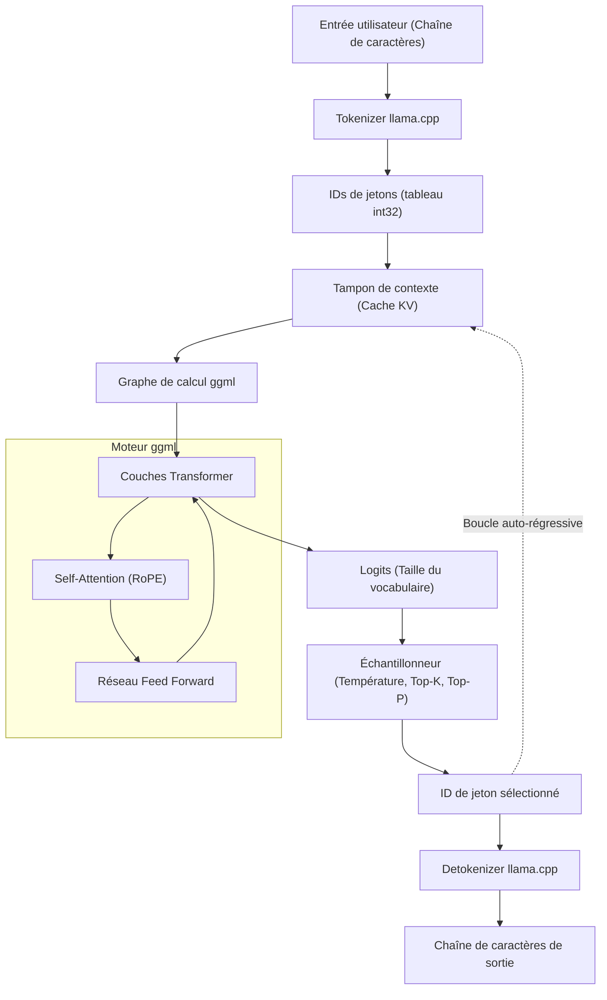

Ces dernières années, l'évolution des grands modèles de langage (LLM) a été fulgurante et leur champ d'application s'élargit chaque jour. Cependant, faire tourner localement des modèles avec des milliards, voire des dizaines de milliards de paramètres, nécessite généralement des GPU haut de gamme dotés d'une énorme quantité de VRAM. C'est **llama.cpp** qui a brisé ce « mur matériel » et a rendu possible l'inférence pratique des LLM sur des PC classiques, des Mac, ou encore des appareils comme le Raspberry Pi.

Dans cet article, nous irons au-delà de la simple utilisation de l'outil en ligne de commande. Nous expliquerons en détail, pour les ingénieurs, l'architecture de `ggml` (sa technologie sous-jacente), le contexte mathématique des Transformers et de la quantification, ainsi que les méthodes pour intégrer et personnaliser des LLM dans vos propres applications en utilisant l'API C++.

---

## 1. Vue d'ensemble de llama.cpp et ggml

`llama.cpp` est un moteur d'inférence LLM léger écrit en C/C++ et développé par Georgi Gerganov. À l'origine, il a été créé dans le but de faire fonctionner rapidement le modèle LLaMA de Meta sur Apple Silicon (Mac M1/M2), mais il prend aujourd'hui en charge une grande variété d'architectures et de modèles.

Sa plus grande caractéristique est d'être **une implémentation pure en C/C++ sans dépendances externes**. Il ne nécessite pas d'écosystèmes massifs comme Python ou PyTorch et peut être compilé en un seul fichier exécutable, ce qui rend son déploiement extrêmement facile.

Le cœur de `llama.cpp` est la bibliothèque de calcul tensoriel **ggml**. ggml a été conçue de zéro pour optimiser à l'extrême les opérations matricielles en apprentissage automatique sur CPU (et partiellement sur GPU).

### 1.1 Pourquoi llama.cpp est-il si rapide ?

1. **Utilisation du memory mapping (mmap)** : Lors du chargement des poids du modèle en mémoire, l'utilisation de `mmap` du système d'exploitation permet d'éviter un chargement complet en RAM, assurant ainsi un démarrage rapide et une économie de mémoire.
2. **Optimisation exhaustive des instructions SIMD** : Il tire parti des jeux d'instructions spécifiques aux processeurs, tels que AVX2, AVX-512, ARM NEON, et Apple AMX, pour accélérer considérablement les multiplications matricielles.
3. **Quantification (Quantization)** : Les poids en nombres à virgule flottante 16 bits (FP16) sont compressés en entiers de 4, 5 ou 8 bits, ce qui élimine les goulots d'étranglement liés à la bande passante de la mémoire (les détails seront abordés plus loin).

---

## 2. Contexte mathématique : Transformer et Quantification (Quantization)

Pour comprendre profondément llama.cpp, il est nécessaire de connaître les formules mathématiques qu'il calcule et la manière dont il approche ces calculs.

### 2.1 Processus d'inférence des Transformers

Les modèles comme LLaMA adoptent une architecture de décodeur Transformer de type autorégressif (Auto-regressive). Le cœur de la génération de texte est le mécanisme de **Self-Attention**.

Pour la matrice des états cachés d'entrée $X \in \mathbb{R}^{N \times d}$, les requêtes $Q$, les clés $K$ et les valeurs $V$ sont calculés par le produit avec des matrices de poids.

$$
Q = X W_Q, \quad K = X W_K, \quad V = X W_V
$$

Ici, la sortie de l'Attention est définie comme suit :

$$
\text{Attention}(Q, K, V) = \text{softmax}\left(\frac{QK^T}{\sqrt{d_k}}\right)V
$$

Dans la boucle d'inférence de llama.cpp, le goulot d'étranglement réside dans le produit de ces immenses matrices $W_Q, W_K, W_V$ et des matrices de poids du réseau feed-forward (FFN) avec le vecteur $X$ (lors de la phase de génération, un seul jeton est traité à la fois, donc $N=1$). C'est ce qu'on appelle la **GEMV (General Matrix-Vector Multiplication)**.

### 2.2 Bases mathématiques de la quantification (Quantization)

Dans les inférences où la bande passante de l'accès à la mémoire devient un goulot d'étranglement, la quantification, qui représente les paramètres de poids avec un petit nombre de bits, est indispensable. Voici le principe de base de la quantification par blocs (par exemple `Q4_K` ou `Q4_0`) largement utilisée dans llama.cpp.

Par exemple, considérons un bloc $w = [w_1, w_2, \dots, w_B]$ de longueur $B$ (généralement 32 ou 64) faisant partie d'une matrice de poids $W$ en FP16. Ce bloc est approximé par des entiers de 4 bits $q_i \in [-8, 7]$ et un facteur d'échelle unique $\Delta$ (FP16 ou FP32).

$$
w_i \approx \Delta \times q_i
$$

$\Delta$ est déterminé en fonction de la valeur absolue maximale dans le bloc.

$$
\Delta = \frac{\max_i |w_i|}{7}
$$

Lors du calcul du produit scalaire $y = w \cdot x$ en utilisant les poids quantifiés, si le vecteur d'entrée $x$ est également quantifié de la même manière tel que $x_i \approx \Delta_x \times q_{x, i}$, on obtient :

$$
y = \sum_{i=1}^{B} w_i x_i \approx \Delta \Delta_x \sum_{i=1}^{B} q_i q_{x, i}
$$

Cette partie $\sum q_i q_{x, i}$ devient **une opération purement entière**, ce qui permet de la calculer en parallèle de manière extrêmement rapide en utilisant des instructions SIMD. C'est le secret mathématique qui permet à llama.cpp d'atteindre des vitesses impressionnantes sur CPU.

---

## 3. Architecture et flux d'inférence

Pour comprendre le fonctionnement interne de llama.cpp, le diagramme Mermaid ci-dessous illustre l'architecture globale du système et le flux de données.



La génération de texte est une boucle auto-régressive où chaque jeton généré est ajouté au cache KV comme entrée suivante, puis passe à nouveau par le graphe de calcul.

---

## 4. Configuration de l'environnement et méthodes de build

Avant d'intégrer llama.cpp dans un projet C++, commençons par compiler le code source.

### 4.1 Clonage du dépôt

```bash
git clone https://github.com/ggerganov/llama.cpp.git
cd llama.cpp
```

### 4.2 Compilation avec CMake

Pour l'intégrer en tant que projet C++ dans d'autres applications, l'utilisation de CMake est la méthode la plus standard. En activant les accélérateurs (backends) spécifiques à chaque plateforme, vous pouvez accélérer les calculs.

**CPU uniquement (Compilation de base) :**
```bash
mkdir build && cd build
cmake ..
cmake --build . --config Release -j 8
```

**En cas d'utilisation d'un GPU NVIDIA (CUDA) :**
```bash
mkdir build && cd build
cmake .. -DGGML_CUDA=ON
cmake --build . --config Release -j 8
```

**En cas d'utilisation d'Apple Silicon (Metal) :**
```bash
mkdir build && cd build
cmake .. -DGGML_METAL=ON
cmake --build . --config Release -j 8
```

Une fois la compilation réussie, des exécutables comme `llama-cli` ainsi que la bibliothèque `llama` (et la bibliothèque `ggml`) à lier avec l'API C++ expliquée plus loin seront générés dans le répertoire `build/bin/`.

---

## 5. Introduction à la personnalisation en C++ : Utilisation de l'API llama.cpp

À partir d'ici, nous allons aborder le cœur du sujet : le contrôle de llama.cpp depuis du code C++.
Pour intégrer un LLM dans vos propres applications (par exemple, un moteur de jeu, une application de bureau, ou un système embarqué) au lieu de se contenter de l'outil en ligne de commande, il est nécessaire d'appeler directement l'API C++.

llama.cpp fournit principalement une interface en langage C via le fichier d'en-tête `llama.h`. Vous utiliserez également cette interface lors de l'appel depuis C++.

### 5.1 Inclusions et configurations minimales requises

Pour utiliser llama.cpp dans votre projet, incluez ce qui suit :

```cpp
#include "llama.h"
#include <iostream>
#include <vector>
#include <string>
#include <stdexcept>

// Macros pour la gestion des erreurs
#define LLAMA_ASSERT(x) \
    do { \
        if (!(x)) { \
            std::cerr << "Assertion failed: " << #x << std::endl; \
            std::terminate(); \
        } \
    } while (0)
```

### 5.2 Chargement du modèle et initialisation du contexte

Tout d'abord, vous chargez un fichier de modèle au format `.gguf` et allouez le contexte pour l'inférence (espace mémoire et cache KV).

```cpp
int main(int argc, char ** argv) {
    if (argc < 2) {
        std::cerr << "Usage: " << argv[0] << " <model.gguf>" << std::endl;
        return 1;
    }
    std::string model_path = argv[1];

    // 1. Initialisation du backend (Configuration de l'environnement CPU/GPU, etc.)
    llama_backend_init();

    // 2. Obtention des paramètres par défaut du modèle
    llama_model_params model_params = llama_model_default_params();
    model_params.n_gpu_layers = 35; // Nombre de couches à décharger sur le GPU

    // 3. Chargement du modèle
    llama_model * model = llama_load_model_from_file(model_path.c_str(), model_params);
    if (model == nullptr) {
        std::cerr << "Failed to load model" << std::endl;
        return 1;
    }

    // 4. Configuration des paramètres du contexte
    llama_context_params ctx_params = llama_context_default_params();
    ctx_params.n_ctx = 2048; // Taille maximale du contexte (nombre de jetons)
    ctx_params.n_threads = 8; // Nombre de threads CPU utilisés pour l'inférence

    // 5. Création du contexte
    llama_context * ctx = llama_new_context_with_model(model, ctx_params);
    if (ctx == nullptr) {
        std::cerr << "Failed to create context" << std::endl;
        llama_free_model(model);
        return 1;
    }

    std::cout << "Model and context loaded successfully!" << std::endl;
    // ... Suite du traitement
```

### 5.3 Tokenisation du prompt (Tokenization)

Les LLM ne comprennent pas directement le texte, mais le traitent comme une séquence d'identifiants entiers (jetons). Il est nécessaire de convertir la chaîne d'entrée en jetons.

```cpp
    std::string prompt = "Q: Quelle est la capitale du Japon ?\nA:";
    std::vector<llama_token> tokens_list;
    tokens_list.resize(prompt.length() + 4); // Taille du tampon avec une marge

    // Faut-il ajouter un jeton spécial (comme BOS : Begin of Sequence) au début ?
    bool add_special = true; 
    // Convertir la chaîne en un tableau d'IDs de jetons
    int n_tokens = llama_tokenize(
        model, 
        prompt.c_str(), 
        prompt.length(), 
        tokens_list.data(), 
        tokens_list.size(), 
        add_special, 
        false // parse_special
    );

    if (n_tokens < 0) {
        // En cas de tampon insuffisant, une réallocation et un nouvel essai sont nécessaires (omis pour simplifier)
        std::cerr << "Failed to tokenize prompt" << std::endl;
        return 1;
    }
    tokens_list.resize(n_tokens);
```

### 5.4 Boucle d'inférence et échantillonnage

On construit une boucle qui fournit les jetons au modèle, obtient la distribution de probabilité des prochains jetons (Logits), puis effectue un échantillonnage pour déterminer le jeton suivant.

```cpp
    // Nombre maximum de jetons à générer
    const int max_gen_tokens = 100;
    
    // Initialisation de la structure pour l'évaluation par lot (batch)
    llama_batch batch = llama_batch_init(512, 0, 1);

    // Ajout des jetons du prompt au lot
    for (size_t i = 0; i < tokens_list.size(); i++) {
        llama_batch_add(batch, tokens_list[i], i, { 0 }, false);
    }
    // Configurer pour n'émettre des logits (résultats de prédiction) que pour le dernier jeton du prompt
    batch.logits[batch.n_tokens - 1] = true;

    // Première évaluation (fournir le prompt au modèle)
    if (llama_decode(ctx, batch) != 0) {
        std::cerr << "llama_decode() failed" << std::endl;
        return 1;
    }

    int n_cur = batch.n_tokens; // Longueur actuelle du contexte
    int n_decode = 0;

    std::cout << "\nOutput: ";

    // Initialisation du contexte de l'échantillonneur (Configuration de la Température, Top-K, Top-P, etc.)
    llama_sampler * smpl = llama_sampler_chain_init(llama_sampler_chain_default_params());
    llama_sampler_chain_add_top_k(smpl, 40);
    llama_sampler_chain_add_top_p(smpl, 0.9f, 1);
    llama_sampler_chain_add_temp(smpl, 0.7f);
    llama_sampler_chain_add_dist(smpl, 1234); // Graine aléatoire (seed)

    while (n_decode < max_gen_tokens) {
        // 1. Échantillonnage : Prédire le prochain jeton basé sur le contexte actuel
        llama_token new_token_id = llama_sampler_sample(smpl, ctx, -1);

        // 2. Si le jeton est EOS (End of Sequence), terminer la boucle
        if (llama_token_is_eog(model, new_token_id)) {
            break;
        }

        // 3. Décoder le jeton en chaîne de caractères (texte) et l'afficher
        char buf[128];
        int n_chars = llama_token_to_piece(model, new_token_id, buf, sizeof(buf), 0, false);
        if (n_chars > 0) {
            std::cout << std::string(buf, n_chars) << std::flush;
        }

        // 4. Préparer le jeton nouvellement généré comme le prochain lot
        llama_batch_clear(batch);
        llama_batch_add(batch, new_token_id, n_cur, { 0 }, true);

        // 5. Évaluation du modèle (Mettre à jour le cache KV et prédire la suite)
        if (llama_decode(ctx, batch) != 0) {
            std::cerr << "Failed to evaluate" << std::endl;
            break;
        }

        n_cur += 1;
        n_decode += 1;
    }

    std::cout << std::endl;

    // Nettoyage
    llama_sampler_free(smpl);
    llama_batch_free(batch);
    llama_free(ctx);
    llama_free_model(model);
    llama_backend_free();

    return 0;
}
```

Ce code implémente une boucle d'inférence personnalisée en utilisant l'API de base de llama.cpp.
Il utilise la structure `llama_batch` pour gérer un ensemble de jetons et exécute la passe avant (forward pass) du réseau neuronal avec `llama_decode`.

---

## 6. Cas de personnalisation avancée : Manipulation des logits et contrôle des pénalités en C++

Si vous souhaitez aller au-delà de la simple génération de texte et forcer la sortie dans un format spécifique (par exemple, uniquement du JSON), ou contrôler la sortie pour empêcher certains mots interdits, vous manipulerez directement les **logits** avant l'échantillonnage du côté C++.

Vous pouvez obtenir le tableau des scores bruts (les valeurs avant conversion en probabilités) juste avant que le modèle ne sorte chaque jeton.

```cpp
// Obtenir le tableau des logits bruts juste après l'inférence et avant l'échantillonnage
float * logits = llama_get_logits_ith(ctx, batch.n_tokens - 1);
int n_vocab = llama_n_vocab(model);

// Liste des IDs des jetons interdits (par exemple 1234, 5678)
std::vector<llama_token> forbidden_tokens = { 1234, 5678 };

// Mettre la probabilité d'apparition des jetons interdits à 0 (Logit à moins l'infini)
for (llama_token bad_tok : forbidden_tokens) {
    logits[bad_tok] = -INFINITY;
}
```

De cette façon, la manipulation directe de l'API C++ rend possible une **"intervention à la microseconde pour chaque cycle d'inférence"**, ce qui serait difficile ou entraînerait une forte surcharge via LangChain ou Python.

---

## 7. Les secrets du réglage des performances (Performance Tuning)

Une fois l'implémentation en C++ terminée, voici quelques points de contrôle pour maximiser la vitesse en vue d'une utilisation en production.

1. **Optimisation du traitement par lots (Batching) :** Si vous traitez simultanément les requêtes de plusieurs utilisateurs, incluez plusieurs séquences dans `llama_batch` et appelez `llama_decode` en une seule fois (Continuous Batching). Cela permet de mutualiser les accès mémoire et d'améliorer considérablement le débit.
2. **Activation de Flash Attention :**
   En configurant `ctx_params.flash_attn = true;` dans les paramètres du contexte, vous pouvez accélérer le calcul de l'Attention tout en réduisant l'utilisation de la mémoire. C'est un paramètre indispensable lorsque vous manipulez de longs contextes (des dizaines de milliers de jetons).
3. **Prise en charge NUMA :**
   Dans un environnement de serveur multiprocesseur (multi-socket), configurer correctement NUMA avant `llama_backend_init()` permet de réduire la latence d'accès à la mémoire.

---

## 8. Conclusion

Dans cet article, nous avons détaillé les bases mathématiques de `llama.cpp`, expliqué son architecture et montré comment construire un moteur d'inférence personnalisé en exploitant l'API C++.

Si l'écosystème Python est extrêmement pratique pour le prototypage, le contrôle direct via `llama.cpp` en C/C++ montre une puissance écrasante dans des environnements de production nécessitant un déploiement sur des appareils Edge, une intégration dans des jeux ou un traitement en temps réel.

N'hésitez pas à écrire vous-même du code C++ et à faire l'expérience du plaisir de manipuler librement des LLM dans votre propre environnement local.

> **Liens de référence**
> - [llama.cpp Official Repository](https://github.com/ggerganov/llama.cpp)
> - [ggml - Tensor Library](https://github.com/ggerganov/ggml)
> - [Attention Is All You Need (Vaswani et al., 2017)](https://arxiv.org/abs/1706.03762)
