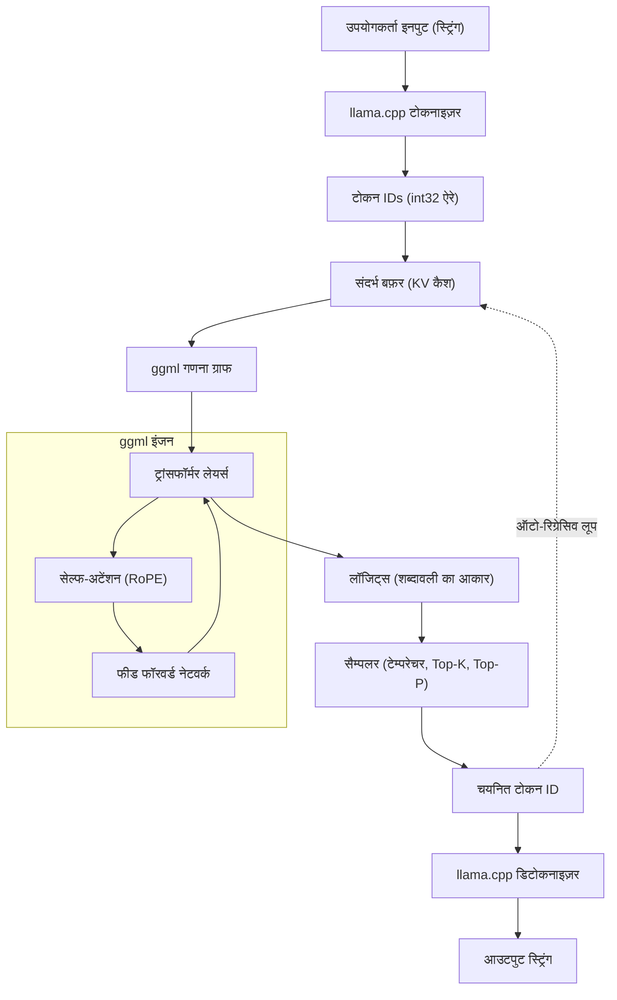

हाल के वर्षों में, बड़े भाषा मॉडल (Large Language Models या LLM) का विकास उल्लेखनीय रहा है, और उनके अनुप्रयोग का दायरा हर दिन बढ़ता जा रहा है। हालांकि, अरबों और दसियों अरबों मापदंडों (parameters) वाले मॉडल को स्थानीय वातावरण (local environment) में चलाने के लिए आमतौर पर विशाल VRAM वाले हाई-एंड GPU की आवश्यकता होती है। इस "हार्डवेयर बाधा" को तोड़ते हुए सामान्य PC, Mac और यहां तक कि Raspberry Pi जैसे उपकरणों पर LLM का व्यावहारिक अनुमान (inference) संभव बनाने वाला टूल **llama.cpp** है।

इस लेख में, हम न केवल कमांड लाइन टूल के उपयोग पर चर्चा करेंगे, बल्कि इसकी मूलभूत तकनीक `ggml` के आर्किटेक्चर, ट्रांसफॉर्मर और क्वांटाइज़ेशन (Quantization) की गणितीय पृष्ठभूमि, और C++ API का उपयोग करके अपने स्वयं के एप्लिकेशन में LLM को शामिल करने और कस्टमाइज़ करने के तरीकों के बारे में इंजीनियरों के लिए अत्यंत विस्तृत व्याख्या करेंगे।

---

## 1. llama.cpp और ggml का अवलोकन

`llama.cpp` Georgi Gerganov द्वारा विकसित C/C++ में लिखा गया एक हल्का LLM अनुमान इंजन (inference engine) है। यह मूल रूप से Meta के LLaMA मॉडल को Apple Silicon (M1/M2 Mac) पर उच्च गति से चलाने के उद्देश्य से बनाया गया था, लेकिन अब यह विभिन्न आर्किटेक्चर और मॉडलों का समर्थन करता है।

इसकी सबसे बड़ी विशेषता यह है कि यह **बाहरी निर्भरता के बिना एक शुद्ध C/C++ कार्यान्वयन (implementation)** है। चूंकि इसे Python या PyTorch जैसे विशाल इकोसिस्टम की आवश्यकता नहीं है और इसे एकल निष्पादन योग्य फ़ाइल (single executable file) के रूप में संकलित (compile) किया जा सकता है, इसलिए इसे डिप्लॉय करना बहुत आसान है।

इस `llama.cpp` का हृदय टेंसर गणितीय लाइब्रेरी **ggml** है। ggml को मशीन लर्निंग में मैट्रिक्स संचालन को CPU (और कुछ GPU) पर अत्यधिक अनुकूलित (optimize) करने के लिए शून्य से डिज़ाइन किया गया है।

### 1.1 llama.cpp इतना तेज़ क्यों है?

1. **मेमोरी मैपिंग (mmap) का उपयोग**: मॉडल के वज़न (weights) को मेमोरी में लोड करते समय, OS के `mmap` का उपयोग करके RAM में पूरा लोड करने से बचा जाता है, जिससे तेज़ स्टार्टअप और कम मेमोरी की खपत प्राप्त होती है।
2. **SIMD निर्देशों का संपूर्ण अनुकूलन (Optimization)**: AVX2, AVX-512, ARM NEON, Apple AMX जैसे CPU-विशिष्ट निर्देश सेट का लाभ उठाकर मैट्रिक्स गुणा को अत्यधिक तेज़ किया गया है।
3. **क्वांटाइज़ेशन (Quantization)**: 16-बिट फ़्लोटिंग-पॉइंट नंबर (FP16) के वज़न को 4-बिट, 5-बिट, और 8-बिट पूर्णांक (integers) में संकुचित करके मेमोरी बैंडविड्थ की बाधा को समाप्त किया गया है (विवरण नीचे दिया गया है)।

---

## 2. गणितीय पृष्ठभूमि: ट्रांसफॉर्मर (Transformer) और क्वांटाइज़ेशन (Quantization)

llama.cpp को गहराई से समझने के लिए, यह जानना आवश्यक है कि यह किन गणितीय सूत्रों (formulas) की गणना कर रहा है और यह गणनाओं का अनुमान कैसे लगाता है।

### 2.1 ट्रांसफॉर्मर अनुमान प्रक्रिया (Inference Process)

LLaMA जैसे मॉडल ऑटो-रिग्रेसिव (Auto-regressive) ट्रांसफॉर्मर डिकोडर आर्किटेक्चर को अपनाते हैं। टेक्स्ट जनरेशन का मूल **Self-Attention** तंत्र है।

इनपुट के रूप में छिपी हुई स्थिति (hidden state) के मैट्रिक्स $X \in \mathbb{R}^{N \times d}$ के लिए, क्वेरी $Q$, कुंजी $K$, और वैल्यू $V$ की गणना वज़न मैट्रिक्स (weight matrix) के गुणन से की जाती है।

$$
Q = X W_Q, \quad K = X W_K, \quad V = X W_V
$$

यहाँ, Attention का आउटपुट इस प्रकार परिभाषित किया गया है:

$$
\text{Attention}(Q, K, V) = \text{softmax}\left(\frac{QK^T}{\sqrt{d_k}}\right)V
$$

llama.cpp के अनुमान लूप (inference loop) में, अड़चन (bottleneck) यह विशाल मैट्रिक्स $W_Q, W_K, W_V$ और फीड-फॉरवर्ड नेटवर्क (FFN) के वज़न मैट्रिक्स और वेक्टर $X$ का गुणन है (क्योंकि जनरेशन चरण में प्रति टोकन संसाधित किया जाता है, $N=1$), यानी **GEMV (General Matrix-Vector Multiplication)**।

### 2.2 क्वांटाइज़ेशन (Quantization) का गणितीय आधार

मेमोरी एक्सेस बैंडविड्थ अनुमान (inference) में एक बाधा बन जाती है, इसके लिए वज़न मापदंडों (weight parameters) को छोटे बिट नंबरों में दर्शाने वाला क्वांटाइज़ेशन अनिवार्य है। हम llama.cpp में व्यापक रूप से उपयोग किए जाने वाले ब्लॉक-आधारित क्वांटाइज़ेशन (उदाहरण के लिए `Q4_K` या `Q4_0`) के मूल सिद्धांत की व्याख्या करेंगे।

मान लीजिए कि FP16 वज़न मैट्रिक्स $W$ का एक हिस्सा ब्लॉक $w = [w_1, w_2, \dots, w_B]$ है, जिसकी लंबाई $B$ (आमतौर पर 32 या 64) है। यह ब्लॉक 4-बिट पूर्णांक $q_i \in [-8, 7]$ और एकल स्केलिंग फैक्टर $\Delta$ (FP16 या FP32) के अनुमानित रूप में होता है।

$$
w_i \approx \Delta \times q_i
$$

$\Delta$ का निर्धारण ब्लॉक में अधिकतम पूर्ण मान (absolute value) के आधार पर किया जाता है।

$$
\Delta = \frac{\max_i |w_i|}{7}
$$

क्वांटाइज़्ड वज़न का उपयोग करके डॉट गुणनफल (dot product) $y = w \cdot x$ की गणना करते समय, इनपुट वेक्टर $x$ को भी उसी तरह क्वांटाइज़ करके $x_i \approx \Delta_x \times q_{x, i}$ माना जाता है:

$$
y = \sum_{i=1}^{B} w_i x_i \approx \Delta \Delta_x \sum_{i=1}^{B} q_i q_{x, i}
$$

यह $\sum q_i q_{x, i}$ भाग **शुद्ध पूर्णांक संचालन (pure integer arithmetic)** बन जाता है, जिसे SIMD निर्देशों का उपयोग करके बहुत तेज़ी से समानांतर (parallel) रूप में गणना की जा सकती है। यही वह गणितीय रहस्य है जो llama.cpp को CPU पर आश्चर्यजनक गति प्रदान करता है।

---

## 3. आर्किटेक्चर और अनुमान प्रवाह (Inference Flow)

llama.cpp के आंतरिक कामकाज को समझने के लिए, नीचे दिया गया Mermaid आरेख (diagram) पूरे सिस्टम के आर्किटेक्चर और डेटा प्रवाह को दर्शाता है।



टेक्स्ट जनरेशन एक ऑटो-रिग्रेसिव लूप है जहाँ प्रत्येक नया टोकन आउटपुट होने पर इसे KV Cache में अगले इनपुट के रूप में जोड़ा जाता है और फिर से गणना ग्राफ से गुज़रता है।

---

## 4. पर्यावरण सेटअप और बिल्ड विधि

llama.cpp को C++ प्रोजेक्ट में शामिल करने से पहले, आइए सबसे पहले सोर्स कोड को बिल्ड करें।

### 4.1 रिपॉजिटरी की क्लोनिंग

```bash
git clone https://github.com/ggerganov/llama.cpp.git
cd llama.cpp
```

### 4.2 CMake का उपयोग करके बिल्ड करना

जब C++ प्रोजेक्ट के रूप में इसे अन्य ऐप्स में शामिल किया जाता है, तो CMake का उपयोग करना सबसे मानक है। प्लेटफ़ॉर्म-विशिष्ट एक्सेलेरेटर (बैकएंड) को सक्षम करके, गणनाओं को तेज़ किया जा सकता है।

**केवल CPU (बुनियादी बिल्ड):**
```bash
mkdir build && cd build
cmake ..
cmake --build . --config Release -j 8
```

**NVIDIA GPU (CUDA) का उपयोग करते समय:**
```bash
mkdir build && cd build
cmake .. -DGGML_CUDA=ON
cmake --build . --config Release -j 8
```

**Apple Silicon (Metal) का उपयोग करते समय:**
```bash
mkdir build && cd build
cmake .. -DGGML_METAL=ON
cmake --build . --config Release -j 8
```

यदि बिल्ड सफल होता है, तो `build/bin/` निर्देशिका में `llama-cli` जैसी निष्पादन योग्य फ़ाइलें और बाद में वर्णित C++ API के साथ लिंक करने के लिए `llama` लाइब्रेरी (और `ggml` लाइब्रेरी) तैयार हो जाएँगी।

---

## 5. C++ में कस्टमाइज़ेशन परिचय: llama.cpp API का उपयोग

यहाँ से हम इस लेख के मुख्य विषय पर चर्चा करेंगे: C++ कोड के माध्यम से llama.cpp का नियंत्रण।
केवल कमांड लाइन टूल का उपयोग करने के अलावा, अपने स्वयं के एप्लिकेशन (जैसे गेम इंजन, डेस्कटॉप ऐप, एंबेडेड सिस्टम, आदि) में LLM को शामिल करने के लिए C++ API को सीधे कॉल करना आवश्यक है।

llama.cpp मुख्य रूप से `llama.h` नामक हेडर फ़ाइल के माध्यम से C भाषा इंटरफ़ेस प्रदान करता है। C++ से कॉल करते समय भी इसी इंटरफ़ेस का उपयोग किया जाता है।

### 5.1 न्यूनतम आवश्यक इन्क्लूड और सेटिंग्स

अपने प्रोजेक्ट में llama.cpp का उपयोग करते समय, निम्नलिखित शामिल करें:

```cpp
#include "llama.h"
#include <iostream>
#include <vector>
#include <string>
#include <stdexcept>

// त्रुटि प्रबंधन के लिए मैक्रो
#define LLAMA_ASSERT(x) \
    do { \
        if (!(x)) { \
            std::cerr << "Assertion failed: " << #x << std::endl; \
            std::terminate(); \
        } \
    } while (0)
```

### 5.2 मॉडल लोड करना और संदर्भ (Context) इनिशियलाइज़ करना

सबसे पहले, `.gguf` प्रारूप की मॉडल फ़ाइल लोड करें और अनुमान के लिए संदर्भ (मेमोरी स्पेस और KV कैश) सुरक्षित करें।

```cpp
int main(int argc, char ** argv) {
    if (argc < 2) {
        std::cerr << "Usage: " << argv[0] << " <model.gguf>" << std::endl;
        return 1;
    }
    std::string model_path = argv[1];

    // 1. बैकएंड का इनिशियलाइज़ेशन (CPU/GPU आदि का पर्यावरण सेटअप)
    llama_backend_init();

    // 2. मॉडल पैरामीटर्स के डिफ़ॉल्ट सेटिंग्स प्राप्त करें
    llama_model_params model_params = llama_model_default_params();
    model_params.n_gpu_layers = 35; // GPU में ऑफ़लोड करने के लिए लेयर्स की संख्या

    // 3. मॉडल को लोड करना
    llama_model * model = llama_load_model_from_file(model_path.c_str(), model_params);
    if (model == nullptr) {
        std::cerr << "Failed to load model" << std::endl;
        return 1;
    }

    // 4. संदर्भ पैरामीटर सेट करना
    llama_context_params ctx_params = llama_context_default_params();
    ctx_params.n_ctx = 2048; // अधिकतम संदर्भ आकार (टोकनों की संख्या)
    ctx_params.n_threads = 8; // अनुमान (inference) के लिए उपयोग किए जाने वाले CPU थ्रेड्स की संख्या

    // 5. संदर्भ (Context) बनाना
    llama_context * ctx = llama_new_context_with_model(model, ctx_params);
    if (ctx == nullptr) {
        std::cerr << "Failed to create context" << std::endl;
        llama_free_model(model);
        return 1;
    }

    std::cout << "Model and context loaded successfully!" << std::endl;
    // ... आगे की प्रक्रिया
```

### 5.3 प्रॉम्प्ट का टोकनाइज़ेशन (Tokenization)

LLM टेक्स्ट को सीधे नहीं समझता, बल्कि इसे इंटीजर ID (टोकन) के अनुक्रम के रूप में संसाधित करता है। इनपुट स्ट्रिंग को टोकन में बदलना आवश्यक है।

```cpp
    std::string prompt = "Q: जापान की राजधानी कहाँ है?\nA:";
    std::vector<llama_token> tokens_list;
    tokens_list.resize(prompt.length() + 4); // अतिरिक्त जगह के साथ बफ़र आकार

    // क्या शुरुआत में विशेष टोकन (BOS: Begin of Sequence आदि) जोड़ना है
    bool add_special = true; 
    // स्ट्रिंग को टोकन ID की ऐरे में बदलना
    int n_tokens = llama_tokenize(
        model, 
        prompt.c_str(), 
        prompt.length(), 
        tokens_list.data(), 
        tokens_list.size(), 
        add_special, 
        false // parse_special
    );

    if (n_tokens < 0) {
        // यदि बफ़र पर्याप्त नहीं है तो पुनः आवंटन (reallocation) करके पुनः प्रयास करना आवश्यक है (सरलता के लिए यहाँ छोड़ा गया है)
        std::cerr << "Failed to tokenize prompt" << std::endl;
        return 1;
    }
    tokens_list.resize(n_tokens);
```

### 5.4 अनुमान लूप और सैंपलिंग

टोकन को मॉडल में इनपुट करें, अगले टोकन का संभाव्यता वितरण (Probability Distribution या Logits) प्राप्त करें, और वहां से सैंपलिंग करके अगला टोकन निर्धारित करने वाला लूप बनाएँ।

```cpp
    // उत्पन्न किए जाने वाले अधिकतम टोकनों की संख्या
    const int max_gen_tokens = 100;
    
    // बैच मूल्यांकन के लिए संरचना को इनिशियलाइज़ करना
    llama_batch batch = llama_batch_init(512, 0, 1);

    // प्रॉम्प्ट के टोकन को बैच में जोड़ना
    for (size_t i = 0; i < tokens_list.size(); i++) {
        llama_batch_add(batch, tokens_list[i], i, { 0 }, false);
    }
    // केवल प्रॉम्प्ट के अंतिम टोकन पर लॉजिट्स (भविष्यवाणी परिणाम) आउटपुट करने के लिए सेट करें
    batch.logits[batch.n_tokens - 1] = true;

    // पहला मूल्यांकन (प्रॉम्प्ट को मॉडल में फीड करना)
    if (llama_decode(ctx, batch) != 0) {
        std::cerr << "llama_decode() failed" << std::endl;
        return 1;
    }

    int n_cur = batch.n_tokens; // वर्तमान संदर्भ की लंबाई
    int n_decode = 0;

    std::cout << "\nOutput: ";

    // सैम्पलर संदर्भ का इनिशियलाइज़ेशन (Temperature, Top-K, Top-P आदि की सेटिंग्स)
    llama_sampler * smpl = llama_sampler_chain_init(llama_sampler_chain_default_params());
    llama_sampler_chain_add_top_k(smpl, 40);
    llama_sampler_chain_add_top_p(smpl, 0.9f, 1);
    llama_sampler_chain_add_temp(smpl, 0.7f);
    llama_sampler_chain_add_dist(smpl, 1234); // सीड वैल्यू

    while (n_decode < max_gen_tokens) {
        // 1. सैंपलिंग: वर्तमान संदर्भ के आधार पर अगले टोकन की भविष्यवाणी
        llama_token new_token_id = llama_sampler_sample(smpl, ctx, -1);

        // 2. यदि टोकन EOS (End of Sequence) है तो लूप समाप्त करें
        if (llama_token_is_eog(model, new_token_id)) {
            break;
        }

        // 3. टोकन को स्ट्रिंग (टेक्स्ट) में डिकोड करें और प्रदर्शित करें
        char buf[128];
        int n_chars = llama_token_to_piece(model, new_token_id, buf, sizeof(buf), 0, false);
        if (n_chars > 0) {
            std::cout << std::string(buf, n_chars) << std::flush;
        }

        // 4. नए उत्पन्न टोकन को अगले बैच के रूप में तैयार करें
        llama_batch_clear(batch);
        llama_batch_add(batch, new_token_id, n_cur, { 0 }, true);

        // 5. मॉडल का मूल्यांकन (KV कैश अपडेट करें, और अगले की भविष्यवाणी करें)
        if (llama_decode(ctx, batch) != 0) {
            std::cerr << "Failed to evaluate" << std::endl;
            break;
        }

        n_cur += 1;
        n_decode += 1;
    }

    std::cout << std::endl;

    // क्लीनअप
    llama_sampler_free(smpl);
    llama_batch_free(batch);
    llama_free(ctx);
    llama_free_model(model);
    llama_backend_free();

    return 0;
}
```

### 6. उन्नत कस्टमाइज़ेशन उदाहरण: C++ के माध्यम से लॉजिट्स हेरफेर और पेनाल्टी नियंत्रण

सिर्फ सरल टेक्स्ट जनरेशन तक सीमित न रहकर, जब किसी विशेष प्रारूप (जैसे केवल JSON) में आउटपुट को बाध्य करना हो, या विशिष्ट प्रतिबंधित शब्दों के आउटपुट को रोकना हो, तो सैंपलिंग से पहले के **लॉजिट्स (Logits)** को सीधे C++ की ओर से नियंत्रित किया जाता है।

आप प्रत्येक टोकन के आउटपुट होने से ठीक पहले रॉ स्कोर की ऐरे (संभाव्यता में परिवर्तित होने से पहले का मान) प्राप्त कर सकते हैं।

```cpp
// अनुमान के तुरंत बाद, और सैंपलिंग से पहले कच्चे (raw) लॉजिट ऐरे को प्राप्त करना
float * logits = llama_get_logits_ith(ctx, batch.n_tokens - 1);
int n_vocab = llama_n_vocab(model);

// प्रतिबंधित टोकन ID सूची (उदाहरण के लिए 1234, 5678)
std::vector<llama_token> forbidden_tokens = { 1234, 5678 };

// निषिद्ध टोकन की उपस्थिति की संभावना को 0 (Logit को माइनस इन्फिनिटी) पर सेट करना
for (llama_token bad_tok : forbidden_tokens) {
    logits[bad_tok] = -INFINITY;
}
```

इस तरह, C++ API को सीधे हैंडल करके, **"अनुमान चक्र के प्रत्येक माइक्रोसेकंड-स्तर पर हस्तक्षेप"** संभव हो जाता है, जो LangChain या Python के माध्यम से प्राप्त करना मुश्किल है या जिसमें अधिक ओवरहेड होता है।

---

## 7. परफॉर्मेंस ट्यूनिंग के रहस्य

C++ में कार्यान्वयन समाप्त करने के बाद, वास्तविक संचालन (production) के लिए गति को अधिकतम सीमा तक बढ़ाने के लिए यहां कुछ जांच बिंदु (checkpoints) दिए गए हैं।

1. **बैच प्रोसेसिंग ऑप्टिमाइज़ेशन:** कई उपयोगकर्ताओं के अनुरोधों को एक साथ संसाधित करते समय, `llama_batch` में कई अनुक्रमों को शामिल करें और एक बार में `llama_decode` को कॉल करें (Continuous Batching)। इससे मेमोरी एक्सेस साझा চরম हो सकता है और थ्रूपुट में काफी सुधार हो सकता है।
2. **फ्लैश अटेंशन (Flash Attention) सक्षम करना:**
   संदर्भ पैरामीटर में `ctx_params.flash_attn = true;` सेट करके, मेमोरी उपयोग को कम करते हुए अटेंशन गणना को तेज़ किया जा सकता है। लंबे संदर्भ (हजारों टोकन) से निपटने के दौरान यह एक आवश्यक सेटिंग है।
3. **NUMA सपोर्ट:**
   मल्टी-सॉकेट सर्वर वातावरण में `llama_backend_init()` से पहले NUMA सेटिंग्स को उचित रूप से कॉन्फ़िगर करके मेमोरी एक्सेस लेटेंसी को कम किया जा सकता है।

---

## 8. निष्कर्ष

इस लेख में, हमने `llama.cpp` की गणितीय पृष्ठभूमि से शुरुआत की, इसके आर्किटेक्चर की व्याख्या की, और C++ API का पूरा उपयोग करके कस्टम अनुमान इंजन (custom inference engine) बनाने के तरीके के बारे में विस्तार से बताया।

हालांकि Python इकोसिस्टम प्रोटोटाइपिंग के लिए बहुत सुविधाजनक है, लेकिन एज डिवाइस डिप्लॉयमेंट, गेम्स में एकीकरण (integration), और उत्पादन (production) वातावरण जहां रियल-टाइम प्रोसेसिंग की आवश्यकता होती है, वहां C/C++ आधारित `llama.cpp` का प्रत्यक्ष नियंत्रण अपना अत्यधिक प्रभाव दिखाता है।

आप भी कृपया स्वयं C++ कोड लिखने का प्रयास करें, और स्थानीय वातावरण (local environment) में LLM को स्वतंत्र रूप से हेरफेर करने के आनंद का अनुभव करें।

> **संदर्भ लिंक (Reference Links)**
> - [llama.cpp Official Repository](https://github.com/ggerganov/llama.cpp)
> - [ggml - Tensor Library](https://github.com/ggerganov/ggml)
> - [Attention Is All You Need (Vaswani et al., 2017)](https://arxiv.org/abs/1706.03762)
