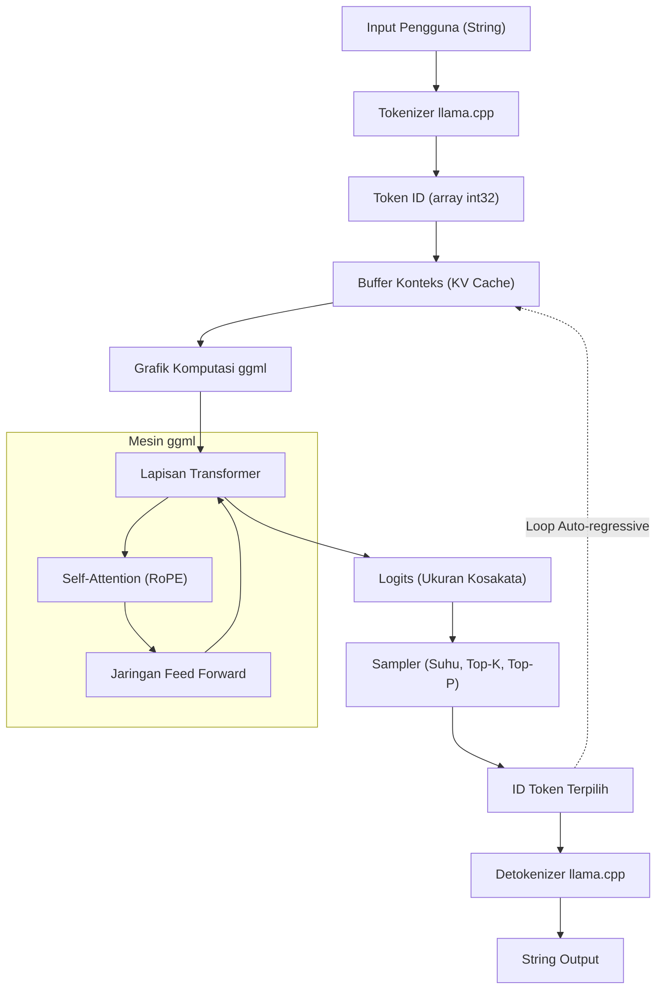

Dalam beberapa tahun terakhir, evolusi Large Language Models (LLM) sangat luar biasa, dan jangkauan aplikasinya meluas dari hari ke hari. Namun, menjalankan model dengan miliaran atau puluhan miliar parameter di lingkungan lokal biasanya membutuhkan GPU *high-end* dengan VRAM yang sangat besar. **llama.cpp** hadir untuk menerobos "dinding perangkat keras" ini, memungkinkan inferensi LLM secara praktis pada PC umum, Mac, dan bahkan perangkat seperti Raspberry Pi.

Pada artikel ini, kita tidak hanya membahas cara menggunakan alat baris perintah (CLI), tetapi juga menjelaskan secara sangat rinci bagi para *engineer* mengenai arsitektur `ggml` yang menjadi teknologi dasarnya, latar belakang matematis dari Transformer dan kuantisasi, serta cara menggunakan API C++ untuk mengintegrasikan dan menyesuaikan LLM ke dalam aplikasi Anda sendiri.

---

## 1. Ikhtisar llama.cpp dan ggml

`llama.cpp` adalah mesin inferensi LLM ringan yang ditulis dalam bahasa C/C++, dikembangkan oleh Georgi Gerganov. Awalnya dibuat dengan tujuan agar model LLaMA dari Meta dapat berjalan cepat di Apple Silicon (Mac M1/M2), tetapi kini telah mendukung berbagai arsitektur dan model.

Fitur terbesarnya adalah merupakan **implementasi murni C/C++ tanpa dependensi eksternal**. Ia tidak membutuhkan ekosistem besar seperti Python atau PyTorch, dan karena dapat dikompilasi menjadi satu file *executable*, proses *deployment* menjadi sangat mudah.

Jantung dari `llama.cpp` ini adalah *library* komputasi tensor bernama **ggml**. ggml dirancang dari nol untuk mengoptimalkan operasi matriks dalam *machine learning* ke batas maksimal di CPU (dan sebagian GPU).

### 1.1 Mengapa llama.cpp Cepat?

1. **Pemanfaatan Memory Mapping (mmap)**: Saat memuat bobot (weights) model ke memori, penggunaan `mmap` dari OS menghindari pemuatan penuh ke RAM, sehingga menghasilkan *startup* yang cepat dan hemat memori.
2. **Optimasi Ekstensif Instruksi SIMD**: Memanfaatkan set instruksi khusus CPU seperti AVX2, AVX-512, ARM NEON, dan Apple AMX untuk sangat mempercepat perkalian matriks.
3. **Kuantisasi (Quantization)**: Mengompresi bobot *floating-point* 16-bit (FP16) menjadi bilangan bulat 4-bit, 5-bit, dan 8-bit untuk mengatasi *bottleneck* pada *bandwidth* memori (detail lebih lanjut akan dijelaskan nanti).

---

## 2. Latar Belakang Matematis: Transformer dan Kuantisasi (Quantization)

Untuk memahami llama.cpp secara mendalam, kita perlu mengetahui rumus matematika yang dihitungnya dan bagaimana komputasi tersebut diaproksimasi.

### 2.1 Proses Inferensi Transformer

Model seperti LLaMA menggunakan arsitektur Transformer decoder yang bersifat *auto-regressive*. Inti dari pembuatan teks adalah mekanisme **Self-Attention**.

Untuk matriks keadaan tersembunyi (hidden state) $X \in \mathbb{R}^{N \times d}$ sebagai *input*, Query $Q$, Key $K$, dan Value $V$ dihitung dengan perkalian bersama matriks bobot (weights matrix):

$$
Q = X W_Q, \quad K = X W_K, \quad V = X W_V
$$

Di sini, keluaran dari Attention didefinisikan sebagai berikut:

$$
\text{Attention}(Q, K, V) = \text{softmax}\left(\frac{QK^T}{\sqrt{d_k}}\right)V
$$

Dalam *loop* inferensi llama.cpp, yang menjadi hambatan (bottleneck) adalah perkalian antara matriks bobot raksasa $W_Q, W_K, W_V$ atau matriks bobot Feed Forward Network (FFN) dengan vektor $X$ (pada fase generasi teks, vektor diproses token demi token sehingga $N=1$), yang juga dikenal sebagai **GEMV (General Matrix-Vector Multiplication)**.

### 2.2 Dasar Matematis Kuantisasi (Quantization)

Dalam inferensi di mana *bandwidth* akses memori menjadi hambatan, kuantisasi yang merepresentasikan parameter bobot dengan jumlah bit kecil sangatlah penting. Berikut adalah penjelasan prinsip dasar dari kuantisasi berbasis blok (seperti `Q4_K` atau `Q4_0`) yang banyak digunakan di llama.cpp.

Misalkan kita memiliki blok $w = [w_1, w_2, \dots, w_B]$ dengan panjang $B$ (biasanya 32 atau 64) yang merupakan bagian dari matriks bobot FP16 $W$. Blok ini diaproksimasikan menjadi bilangan bulat 4-bit $q_i \in [-8, 7]$ dan sebuah faktor penskalaan (scaling factor) tunggal $\Delta$ (FP16 atau FP32).

$$
w_i \approx \Delta \times q_i
$$

Nilai $\Delta$ ditentukan berdasarkan nilai absolut maksimum di dalam blok tersebut:

$$
\Delta = \frac{\max_i |w_i|}{7}
$$

Ketika menghitung perkalian titik (dot product) $y = w \cdot x$ menggunakan bobot yang telah dikuantisasi, jika vektor masukan $x$ juga dikuantisasi menjadi $x_i \approx \Delta_x \times q_{x, i}$, maka:

$$
y = \sum_{i=1}^{B} w_i x_i \approx \Delta \Delta_x \sum_{i=1}^{B} q_i q_{x, i}
$$

Bagian $\sum q_i q_{x, i}$ ini sepenuhnya merupakan **operasi bilangan bulat murni** (pure integer arithmetic), yang dapat dikomputasi secara paralel dengan sangat cepat menggunakan instruksi SIMD. Inilah rahasia matematis di balik kecepatan llama.cpp yang luar biasa di CPU.

---

## 3. Arsitektur dan Alur Inferensi

Untuk memahami operasi internal llama.cpp, diagram Mermaid berikut menunjukkan arsitektur keseluruhan sistem dan aliran datanya.



Generasi teks adalah *loop auto-regressive* di mana setiap kali satu token dihasilkan, token tersebut ditambahkan ke *KV Cache* sebagai *input* berikutnya, lalu melewati grafik komputasi lagi.

---

## 4. Pengaturan Lingkungan dan Cara Build

Sebelum mengintegrasikan llama.cpp ke dalam proyek C++, mari kita mulai dengan mem-*build* kode sumbernya.

### 4.1 Kloning Repositori

```bash
git clone https://github.com/ggerganov/llama.cpp.git
cd llama.cpp
```

### 4.2 Build Menggunakan CMake

Ketika mengintegrasikannya ke aplikasi lain sebagai proyek C++, menggunakan CMake adalah pendekatan yang paling standar. Anda dapat mempercepat komputasi dengan mengaktifkan akselerator (backend) yang sesuai dengan platform masing-masing.

**Hanya CPU (Build Dasar):**
```bash
mkdir build && cd build
cmake ..
cmake --build . --config Release -j 8
```

**Jika Menggunakan NVIDIA GPU (CUDA):**
```bash
mkdir build && cd build
cmake .. -DGGML_CUDA=ON
cmake --build . --config Release -j 8
```

**Jika Menggunakan Apple Silicon (Metal):**
```bash
mkdir build && cd build
cmake .. -DGGML_METAL=ON
cmake --build . --config Release -j 8
```

Jika proses *build* berhasil, file eksekusi seperti `llama-cli` dan pustaka `llama` (serta pustaka `ggml`) yang akan di-link melalui API C++ yang dijelaskan nanti, akan dibuat di direktori `build/bin/`.

---

## 5. Pengenalan Kustomisasi dengan C++: Menggunakan API llama.cpp

Mulai dari sini, kita akan membahas topik utama yaitu mengendalikan llama.cpp dari kode C++.
Untuk tidak sekadar menggunakan alat baris perintah (CLI), melainkan mengintegrasikan LLM ke dalam aplikasi Anda sendiri (seperti *game engine*, aplikasi *desktop*, sistem *embedded*, dll.), Anda perlu memanggil langsung API C++.

llama.cpp menyediakan antarmuka bahasa C terutama melalui *header file* bernama `llama.h`. Antarmuka ini juga digunakan ketika dipanggil dari C++.

### 5.1 Include dan Pengaturan Minimal yang Diperlukan

Jika Anda menggunakan llama.cpp di proyek Anda sendiri, masukkan pustaka berikut.

```cpp
#include "llama.h"
#include <iostream>
#include <vector>
#include <string>
#include <stdexcept>

// Makro untuk error handling
#define LLAMA_ASSERT(x) \
    do { \
        if (!(x)) { \
            std::cerr << "Assertion failed: " << #x << std::endl; \
            std::terminate(); \
        } \
    } while (0)
```

### 5.2 Memuat Model dan Inisialisasi Konteks

Pertama, kita muat file model berformat `.gguf` dan menyiapkan konteks (ruang memori dan KV Cache) untuk inferensi.

```cpp
int main(int argc, char ** argv) {
    if (argc < 2) {
        std::cerr << "Usage: " << argv[0] << " <model.gguf>" << std::endl;
        return 1;
    }
    std::string model_path = argv[1];

    // 1. Inisialisasi backend (Pengaturan lingkungan seperti CPU/GPU)
    llama_backend_init();

    // 2. Mendapatkan pengaturan default parameter model
    llama_model_params model_params = llama_model_default_params();
    model_params.n_gpu_layers = 35; // Jumlah layer yang dialihkan ke GPU

    // 3. Memuat model
    llama_model * model = llama_load_model_from_file(model_path.c_str(), model_params);
    if (model == nullptr) {
        std::cerr << "Failed to load model" << std::endl;
        return 1;
    }

    // 4. Pengaturan parameter konteks
    llama_context_params ctx_params = llama_context_default_params();
    ctx_params.n_ctx = 2048; // Ukuran konteks maksimum (jumlah token)
    ctx_params.n_threads = 8; // Jumlah thread CPU yang digunakan untuk inferensi

    // 5. Membuat konteks
    llama_context * ctx = llama_new_context_with_model(model, ctx_params);
    if (ctx == nullptr) {
        std::cerr << "Failed to create context" << std::endl;
        llama_free_model(model);
        return 1;
    }

    std::cout << "Model and context loaded successfully!" << std::endl;
    // ... Pemrosesan selanjutnya
```

### 5.3 Tokenisasi Prompt (Tokenization)

LLM tidak secara langsung memahami teks, melainkan memprosesnya sebagai urutan ID integer (token). String *input* perlu dikonversi ke token.

```cpp
    std::string prompt = "Q: Apa ibu kota Jepang?\nA:";
    std::vector<llama_token> tokens_list;
    tokens_list.resize(prompt.length() + 4); // Ukuran buffer dengan ruang ekstra

    // Apakah akan menambahkan token khusus (seperti BOS: Begin of Sequence) di awal
    bool add_special = true; 
    // Mengonversi string menjadi array ID token
    int n_tokens = llama_tokenize(
        model, 
        prompt.c_str(), 
        prompt.length(), 
        tokens_list.data(), 
        tokens_list.size(), 
        add_special, 
        false // parse_special
    );

    if (n_tokens < 0) {
        // Jika buffer tidak cukup, diperlukan proses untuk realokasi dan mencoba ulang (dihilangkan untuk penyederhanaan)
        std::cerr << "Failed to tokenize prompt" << std::endl;
        return 1;
    }
    tokens_list.resize(n_tokens);
```

### 5.4 Loop Inferensi dan Sampling

Kita membangun sebuah *loop* di mana token dimasukkan ke model untuk mendapatkan distribusi probabilitas (Logits) token berikutnya, lalu melakukan *sampling* dari sana untuk menentukan token selanjutnya.

```cpp
    // Jumlah token maksimum yang dihasilkan
    const int max_gen_tokens = 100;
    
    // Inisialisasi struktur untuk evaluasi batch
    llama_batch batch = llama_batch_init(512, 0, 1);

    // Menambahkan token prompt ke dalam batch
    for (size_t i = 0; i < tokens_list.size(); i++) {
        llama_batch_add(batch, tokens_list[i], i, { 0 }, false);
    }
    // Diatur agar hanya mengeluarkan logit (hasil prediksi) di token terakhir prompt
    batch.logits[batch.n_tokens - 1] = true;

    // Evaluasi awal (memasukkan prompt ke model)
    if (llama_decode(ctx, batch) != 0) {
        std::cerr << "llama_decode() failed" << std::endl;
        return 1;
    }

    int n_cur = batch.n_tokens; // Panjang konteks saat ini
    int n_decode = 0;

    std::cout << "\nOutput: ";

    // Inisialisasi konteks sampler (Pengaturan Temperature, Top-K, Top-P, dll.)
    llama_sampler * smpl = llama_sampler_chain_init(llama_sampler_chain_default_params());
    llama_sampler_chain_add_top_k(smpl, 40);
    llama_sampler_chain_add_top_p(smpl, 0.9f, 1);
    llama_sampler_chain_add_temp(smpl, 0.7f);
    llama_sampler_chain_add_dist(smpl, 1234); // Nilai seed

    while (n_decode < max_gen_tokens) {
        // 1. Sampling: memprediksi token berikutnya berdasarkan konteks saat ini
        llama_token new_token_id = llama_sampler_sample(smpl, ctx, -1);

        // 2. Jika token adalah EOS (End of Sequence), hentikan loop
        if (llama_token_is_eog(model, new_token_id)) {
            break;
        }

        // 3. Dekode token menjadi string (teks) untuk ditampilkan
        char buf[128];
        int n_chars = llama_token_to_piece(model, new_token_id, buf, sizeof(buf), 0, false);
        if (n_chars > 0) {
            std::cout << std::string(buf, n_chars) << std::flush;
        }

        // 4. Persiapkan token baru yang dihasilkan sebagai batch berikutnya
        llama_batch_clear(batch);
        llama_batch_add(batch, new_token_id, n_cur, { 0 }, true);

        // 5. Evaluasi model (memperbarui KV Cache dan memprediksi selanjutnya)
        if (llama_decode(ctx, batch) != 0) {
            std::cerr << "Failed to evaluate" << std::endl;
            break;
        }

        n_cur += 1;
        n_decode += 1;
    }

    std::cout << std::endl;

    // Bersihkan
    llama_sampler_free(smpl);
    llama_batch_free(batch);
    llama_free(ctx);
    llama_free_model(model);
    llama_backend_free();

    return 0;
}
```

Kode ini merupakan implementasi dari *loop* inferensi kustom yang menggunakan API dasar llama.cpp.
Kode ini menggunakan struktur `llama_batch` untuk mengelola sekumpulan token, dan menggunakan `llama_decode` untuk menjalankan *forward pass* dari jaringan saraf.

---

## 6. Contoh Kustomisasi Lanjutan: Manipulasi Logit dan Kontrol Penalti dengan C++

Jika kita tidak hanya melakukan pembuatan teks sederhana, tetapi ingin memaksakan format *output* tertentu (seperti hanya JSON), atau mencegah dihasilkannya kata-kata terlarang tertentu, kita bisa secara langsung memanipulasi **Logit** dari sisi C++ sebelum *sampling* dilakukan.

Anda bisa mendapatkan array dari skor mentah (nilai sebelum dikonversi menjadi probabilitas) yang dihasilkan model tepat sebelum setiap token dikeluarkan.

```cpp
// Dapatkan array logit mentah tepat setelah inferensi, sebelum sampling dilakukan
float * logits = llama_get_logits_ith(ctx, batch.n_tokens - 1);
int n_vocab = llama_n_vocab(model);

// Daftar ID token terlarang (sebagai contoh 1234, 5678)
std::vector<llama_token> forbidden_tokens = { 1234, 5678 };

// Mengatur probabilitas kemunculan token terlarang menjadi 0 (Logit menjadi minus tak terhingga)
for (llama_token bad_tok : forbidden_tokens) {
    logits[bad_tok] = -INFINITY;
}
```

Dengan mengelola API C++ secara langsung, **"intervensi berskala mikromilidetik pada setiap siklus inferensi"** bisa dilakukan, sesuatu yang mungkin sulit dicapai atau memakan *overhead* yang terlalu besar jika dilakukan melalui LangChain atau Python.

---

## 7. Rahasia Penyetelan Kinerja (Performance Tuning)

Setelah implementasi di C++ selesai, berikut adalah beberapa poin untuk diperiksa guna meningkatkan kecepatan hingga batas maksimal untuk produksi yang sebenarnya.

1. **Optimasi Pemrosesan Batch:** Jika Anda memproses permintaan dari beberapa pengguna secara bersamaan, sertakan beberapa *sequence* dalam `llama_batch` dan panggil `llama_decode` sekaligus (Continuous Batching). Hal ini memungkinkan akses memori untuk dibagikan sehingga dapat meningkatkan *throughput* secara dramatis.
2. **Mengaktifkan Flash Attention:**
   Dengan menetapkan `ctx_params.flash_attn = true;` pada parameter konteks, komputasi Attention bisa dipercepat sembari mengurangi penggunaan memori. Ini merupakan pengaturan yang diwajibkan bila menangani konteks yang panjang (puluhan ribu token).
3. **Dukungan NUMA:**
   Di lingkungan server multi-socket, konfigurasi NUMA yang tepat sebelum memanggil `llama_backend_init()` dapat mengurangi latensi dari akses memori.

---

## 8. Kesimpulan

Pada artikel ini, kita telah membahas secara mendalam mulai dari latar belakang matematis `llama.cpp`, penjelasan arsitektur, hingga cara membangun mesin inferensi kustom menggunakan API C++.

Ekosistem Python sangat berguna untuk pembuatan *prototype*, namun untuk *deployment* di perangkat *edge*, integrasi ke dalam *game*, atau dalam lingkungan produksi yang menuntut pemrosesan secara *real-time*, pengontrolan langsung `llama.cpp` berbasis C/C++ menunjukkan kekuatan yang luar biasa.

Kami sangat menyarankan Anda untuk mencoba menulis kode C++ dengan tangan Anda sendiri dan merasakan serunya mengendalikan LLM secara bebas di lingkungan lokal.

> **Tautan Referensi**
> - [Repositori Resmi llama.cpp](https://github.com/ggerganov/llama.cpp)
> - [ggml - Tensor Library](https://github.com/ggerganov/ggml)
> - [Attention Is All You Need (Vaswani et al., 2017)](https://arxiv.org/abs/1706.03762)
