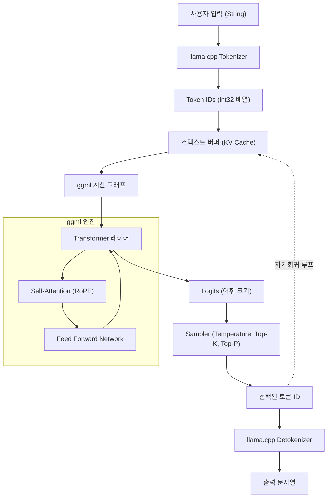

최근 대규모 언어 모델(LLM)의 진화는 매우 빠르며, 그 응용 범위는 나날이 확대되고 있습니다. 하지만 수십억, 수백억 개의 매개변수를 가진 모델을 로컬 환경에서 구동하려면 보통 방대한 VRAM을 갖춘 하이엔드 GPU가 필요합니다. 이러한 '하드웨어의 벽'을 허물고, 일반적인 PC나 Mac, 심지어 Raspberry Pi와 같은 기기 위에서 LLM의 실용적인 추론을 가능하게 한 것이 바로 **llama.cpp**입니다.

본 기사에서는 단순한 명령줄 도구의 사용법에 그치지 않고, 그 기반 기술인 `ggml`의 아키텍처, Transformer 및 양자화(Quantization)의 수학적 배경, 그리고 C++ API를 이용하여 독자적인 애플리케이션에 LLM을 통합하고 커스터마이징하는 방법까지 엔지니어를 위해 매우 상세하게 해설합니다.

---

## 1. llama.cpp 및 ggml 개요

`llama.cpp`는 Georgi Gerganov 씨가 개발한, C/C++로 작성된 경량 LLM 추론 엔진입니다. 원래는 Meta의 LLaMA 모델을 Apple Silicon(M1/M2 Mac) 위에서 고속으로 동작시키는 것을 목적으로 탄생했지만, 현재는 다양한 아키텍처와 모델을 지원하고 있습니다.

가장 큰 특징은 **외부 의존성을 가지지 않는 순수한 C/C++ 구현**이라는 점입니다. Python이나 PyTorch 등의 거대한 에코시스템을 필요로 하지 않고, 단일 실행 파일로 컴파일할 수 있기 때문에 배포가 매우 쉽습니다.

이 `llama.cpp`의 심장부 역할을 하는 것이 텐서 연산 라이브러리 **ggml**입니다. ggml은 머신러닝에서의 행렬 연산을 CPU(및 일부 GPU) 상에서 극한까지 최적화하기 위해 처음부터 설계되었습니다.

### 1.1 llama.cpp는 왜 빠른가?

1. **메모리 매핑(mmap) 활용**: 모델의 가중치를 메모리에 로드할 때 OS의 `mmap`을 이용함으로써 RAM 전체 로드를 피하고, 빠른 실행과 메모리 절약을 실현합니다.
2. **SIMD 명령의 철저한 최적화**: AVX2, AVX-512, ARM NEON, Apple AMX 등 CPU 고유의 명령 세트를 활용하여 행렬 곱을 초고속화하고 있습니다.
3. **양자화(Quantization)**: 16-bit 부동소수점(FP16) 가중치를 4-bit, 5-bit, 8-bit 정수로 압축하여 메모리 대역폭의 병목 현상을 해소합니다(자세한 내용은 후술).

---

## 2. 수학적 배경: Transformer와 양자화(Quantization)

llama.cpp를 깊이 이해하기 위해서는 그것이 계산하고 있는 수식과, 어떻게 계산을 근사화하고 있는지 알아야 합니다.

### 2.1 Transformer의 추론 프로세스

LLaMA 등의 모델은 자기회귀형(Auto-regressive) Transformer 디코더 아키텍처를 채택하고 있습니다. 텍스트 생성의 핵심이 되는 것은 **Self-Attention** 메커니즘입니다.

입력이 되는 은닉 상태의 행렬 $X \in \mathbb{R}^{N \times d}$에 대해, 쿼리 $Q$, 키 $K$, 값 $V$는 가중치 행렬과의 곱으로 계산됩니다.

$$
Q = X W_Q, \quad K = X W_K, \quad V = X W_V
$$

여기서 Attention의 출력은 다음과 같이 정의됩니다.

$$
\text{Attention}(Q, K, V) = \text{softmax}\left(\frac{QK^T}{\sqrt{d_k}}\right)V
$$

llama.cpp의 추론 루프에서 병목 현상이 발생하는 부분은 이 거대한 행렬 $W_Q, W_K, W_V$나 피드 포워드 네트워크(FFN)의 가중치 행렬과 벡터 $X$(생성 단계에서는 1토큰씩 처리하므로 $N=1$)의 곱, 즉 **GEMV (General Matrix-Vector Multiplication)**입니다.

### 2.2 양자화(Quantization)의 수학적 기초

메모리 액세스 대역이 병목이 되는 추론에 있어서, 가중치 매개변수를 작은 비트 수로 표현하는 양자화는 필수적입니다. llama.cpp에서 널리 쓰이는 블록 단위의 양자화(예: `Q4_K`나 `Q4_0`)의 기본 원리를 설명합니다.

예를 들어 FP16 가중치 행렬 $W$의 일부인 길이 $B$(보통 32나 64)의 블록 $w = [w_1, w_2, \dots, w_B]$를 생각합니다. 이 블록을 4-bit 정수 $q_i \in [-8, 7]$과 단일 스케일링 팩터 $\Delta$(FP16 또는 FP32)로 근사합니다.

$$
w_i \approx \Delta \times q_i
$$

$\Delta$는 블록 내의 최대 절댓값을 바탕으로 결정됩니다.

$$
\Delta = \frac{\max_i |w_i|}{7}
$$

양자화 후의 가중치를 이용해 내적 $y = w \cdot x$를 계산할 경우, 입력 벡터 $x$도 동일하게 양자화하여 $x_i \approx \Delta_x \times q_{x, i}$로 두면,

$$
y = \sum_{i=1}^{B} w_i x_i \approx \Delta \Delta_x \sum_{i=1}^{B} q_i q_{x, i}
$$

이 $\sum q_i q_{x, i}$ 부분은 **순수한 정수 연산**이 되며, SIMD 명령을 사용하여 매우 빠르게 병렬 계산할 수 있습니다. 이것이 llama.cpp가 CPU 상에서 경이로운 속도를 내는 수학적인 트릭입니다.

---

## 3. 아키텍처 및 추론 흐름

llama.cpp의 내부 동작을 이해하기 위해, 다음의 Mermaid 다이어그램으로 시스템 전체의 아키텍처와 데이터 흐름을 나타냅니다.



텍스트 생성은 하나의 토큰이 출력될 때마다 그것이 다음 입력으로 KV Cache에 추가되고, 다시 계산 그래프를 통과하는 자기회귀적인 루프로 되어 있습니다.

---

## 4. 환경 구축 및 빌드 방법

llama.cpp를 C++ 프로젝트에 통합하기 전에 먼저 소스 코드를 빌드해 봅시다.

### 4.1 리포지토리 클론

```bash
git clone https://github.com/ggerganov/llama.cpp.git
cd llama.cpp
```

### 4.2 CMake를 사용한 빌드

C++ 프로젝트로서 다른 앱에 통합할 경우, CMake를 이용하는 것이 가장 표준적입니다. 플랫폼별 가속기(백엔드)를 활성화함으로써 연산을 고속화할 수 있습니다.

**CPU 전용 (기본 빌드):**
```bash
mkdir build && cd build
cmake ..
cmake --build . --config Release -j 8
```

**NVIDIA GPU (CUDA)를 사용할 경우:**
```bash
mkdir build && cd build
cmake .. -DGGML_CUDA=ON
cmake --build . --config Release -j 8
```

**Apple Silicon (Metal)을 사용할 경우:**
```bash
mkdir build && cd build
cmake .. -DGGML_METAL=ON
cmake --build . --config Release -j 8
```

빌드가 성공하면 `build/bin/` 디렉터리에 `llama-cli` 등의 실행 파일과 후술할 C++ API에서 링크하기 위한 `llama` 라이브러리(및 `ggml` 라이브러리)가 생성됩니다.

---

## 5. C++ 커스터마이징 입문: llama.cpp API 활용

여기서부터는 본론인 C++ 코드를 통한 llama.cpp의 제어에 대해 해설합니다.
명령줄 도구를 사용하는 것뿐만 아니라, 자신의 애플리케이션(예: 게임 엔진, 데스크톱 앱, 임베디드 시스템 등)에 LLM을 포함시키려면 C++ API를 직접 호출해야 합니다.

llama.cpp는 주로 `llama.h`라는 헤더 파일로 C언어 인터페이스를 제공하고 있습니다. C++에서 호출할 때도 이 인터페이스를 이용합니다.

### 5.1 필요 최소한의 인클루드 및 설정

자신의 프로젝트에서 llama.cpp를 사용할 경우, 이하를 인클루드합니다.

```cpp
#include "llama.h"
#include <iostream>
#include <vector>
#include <string>
#include <stdexcept>

// 에러 핸들링을 위한 매크로
#define LLAMA_ASSERT(x) \
    do { \
        if (!(x)) { \
            std::cerr << "Assertion failed: " << #x << std::endl; \
            std::terminate(); \
        } \
    } while (0)
```

### 5.2 모델 로드 및 컨텍스트 초기화

먼저 `.gguf` 형식의 모델 파일을 로드하고, 추론을 위한 컨텍스트(메모리 공간과 KV 캐시)를 확보합니다.

```cpp
int main(int argc, char ** argv) {
    if (argc < 2) {
        std::cerr << "Usage: " << argv[0] << " <model.gguf>" << std::endl;
        return 1;
    }
    std::string model_path = argv[1];

    // 1. 백엔드 초기화(CPU/GPU 등의 환경 셋업)
    llama_backend_init();

    // 2. 모델 매개변수의 기본 설정 가져오기
    llama_model_params model_params = llama_model_default_params();
    model_params.n_gpu_layers = 35; // GPU로 오프로드할 레이어 수

    // 3. 모델 로드
    llama_model * model = llama_load_model_from_file(model_path.c_str(), model_params);
    if (model == nullptr) {
        std::cerr << "Failed to load model" << std::endl;
        return 1;
    }

    // 4. 컨텍스트 매개변수 설정
    llama_context_params ctx_params = llama_context_default_params();
    ctx_params.n_ctx = 2048; // 최대 컨텍스트 크기(토큰 수)
    ctx_params.n_threads = 8; // 추론에 사용할 CPU 스레드 수

    // 5. 컨텍스트 생성
    llama_context * ctx = llama_new_context_with_model(model, ctx_params);
    if (ctx == nullptr) {
        std::cerr << "Failed to create context" << std::endl;
        llama_free_model(model);
        return 1;
    }

    std::cout << "Model and context loaded successfully!" << std::endl;
    // ... 이후의 처리
```

### 5.3 프롬프트 토큰화 (Tokenization)

LLM은 텍스트를 직접 이해하는 것이 아니라, 정수 ID(토큰)의 나열로써 처리합니다. 입력 문자열을 토큰으로 변환할 필요가 있습니다.

```cpp
    std::string prompt = "Q: 일본의 수도는 어디인가요?\nA:";
    std::vector<llama_token> tokens_list;
    tokens_list.resize(prompt.length() + 4); // 여유를 둔 버퍼 크기

    // 특수 토큰(BOS: Begin of Sequence 등)을 맨 앞에 추가할지 여부
    bool add_special = true; 
    // 문자열을 토큰 ID의 배열로 변환
    int n_tokens = llama_tokenize(
        model, 
        prompt.c_str(), 
        prompt.length(), 
        tokens_list.data(), 
        tokens_list.size(), 
        add_special, 
        false // parse_special
    );

    if (n_tokens < 0) {
        // 버퍼가 부족한 경우는 재할당하여 재시도하는 처리가 필요(간략화를 위해 생략)
        std::cerr << "Failed to tokenize prompt" << std::endl;
        return 1;
    }
    tokens_list.resize(n_tokens);
```

### 5.4 추론 루프 및 샘플링

토큰을 모델에 입력하고, 다음 토큰의 확률 분포(Logits)를 구한 뒤 거기서 샘플링을 수행해 다음 토큰을 결정하는 루프를 구축합니다.

```cpp
    // 생성할 최대 토큰 수
    const int max_gen_tokens = 100;
    
    // 배치 평가를 위한 구조체를 초기화
    llama_batch batch = llama_batch_init(512, 0, 1);

    // 프롬프트의 토큰을 배치에 추가
    for (size_t i = 0; i < tokens_list.size(); i++) {
        llama_batch_add(batch, tokens_list[i], i, { 0 }, false);
    }
    // 프롬프트의 마지막 토큰에서만 로짓(예측 결과)을 출력하도록 설정
    batch.logits[batch.n_tokens - 1] = true;

    // 첫 번째 평가(프롬프트를 모델에 제공)
    if (llama_decode(ctx, batch) != 0) {
        std::cerr << "llama_decode() failed" << std::endl;
        return 1;
    }

    int n_cur = batch.n_tokens; // 현재의 컨텍스트 길이
    int n_decode = 0;

    std::cout << "\nOutput: ";

    // 샘플러 컨텍스트 초기화(Temperature, Top-K, Top-P 등의 설정)
    llama_sampler * smpl = llama_sampler_chain_init(llama_sampler_chain_default_params());
    llama_sampler_chain_add_top_k(smpl, 40);
    llama_sampler_chain_add_top_p(smpl, 0.9f, 1);
    llama_sampler_chain_add_temp(smpl, 0.7f);
    llama_sampler_chain_add_dist(smpl, 1234); // 시드 값

    while (n_decode < max_gen_tokens) {
        // 1. 샘플링: 현재 컨텍스트를 바탕으로 다음 토큰을 예측
        llama_token new_token_id = llama_sampler_sample(smpl, ctx, -1);

        // 2. 토큰이 EOS (End of Sequence) 라면 루프 종료
        if (llama_token_is_eog(model, new_token_id)) {
            break;
        }

        // 3. 토큰을 문자열(텍스트)로 디코드하여 표시
        char buf[128];
        int n_chars = llama_token_to_piece(model, new_token_id, buf, sizeof(buf), 0, false);
        if (n_chars > 0) {
            std::cout << std::string(buf, n_chars) << std::flush;
        }

        // 4. 새롭게 생성된 토큰을 다음 배치로 준비
        llama_batch_clear(batch);
        llama_batch_add(batch, new_token_id, n_cur, { 0 }, true);

        // 5. 모델 평가(KV 캐시를 갱신하고, 다음을 예측)
        if (llama_decode(ctx, batch) != 0) {
            std::cerr << "Failed to evaluate" << std::endl;
            break;
        }

        n_cur += 1;
        n_decode += 1;
    }

    std::cout << std::endl;

    // 정리(클린업)
    llama_sampler_free(smpl);
    llama_batch_free(batch);
    llama_free(ctx);
    llama_free_model(model);
    llama_backend_free();

    return 0;
}
```

이 코드는 llama.cpp의 기본 API를 사용하여 독자적인 추론 루프를 구현한 것입니다.
`llama_batch` 구조체를 이용해 토큰 그룹을 관리하고, `llama_decode`로 신경망의 순전파(Forward Pass)를 실행합니다.

---

## 6. 고급 커스터마이징 사례: C++에 의한 로짓 조작 및 페널티 제어

단순한 텍스트 생성에 그치지 않고, 특정 포맷(예: JSON만)의 출력을 강제하거나, 특정한 금지 단어를 출력하지 않도록 제어하는 경우 샘플링 전의 **로짓(Logits)**을 C++ 쪽에서 직접 조작합니다.

모델이 각 토큰을 출력하기 직전의 원시 점수(확률로 변환되기 전의 값) 배열을 가져올 수 있습니다.

```cpp
// 추론 직후, 샘플링을 실시하기 전에 원시 로짓 배열을 취득
float * logits = llama_get_logits_ith(ctx, batch.n_tokens - 1);
int n_vocab = llama_n_vocab(model);

// 금지 토큰의 ID 목록 (예: 1234, 5678)
std::vector<llama_token> forbidden_tokens = { 1234, 5678 };

// 금지 토큰의 출현 확률을 0(Logit을 마이너스 무한대)으로 만든다
for (llama_token bad_tok : forbidden_tokens) {
    logits[bad_tok] = -INFINITY;
}
```

이처럼 C++ API를 직접 다룸으로써 LangChain이나 Python 경유로는 실현하기 어렵거나 오버헤드가 커지는 **'추론 사이클마다 마이크로 밀리초 단위의 개입'**이 가능해집니다.

---

## 7. 성능 튜닝의 극의

C++로 구현을 마친 후, 실제 운영을 위해 속도를 한계까지 높이기 위한 체크 포인트를 몇 가지 소개합니다.

1. **배치 처리 최적화:** 여러 사용자의 요청을 동시에 처리할 경우, `llama_batch`에 여러 시퀀스를 포함하여 한 번에 `llama_decode`를 호출합니다(Continuous Batching). 이를 통해 메모리 액세스를 공유하여 처리량(스루풋)을 획기적으로 향상할 수 있습니다.
2. **Flash Attention 활성화:**
   컨텍스트 매개변수에서 `ctx_params.flash_attn = true;`를 설정함으로써, 메모리 사용량을 줄이면서 Attention 계산을 고속화할 수 있습니다. 긴 컨텍스트(수만 토큰)를 다룰 때는 필수적인 설정입니다.
3. **NUMA 지원:**
   멀티 소켓 서버 환경에서는 `llama_backend_init()` 전에 NUMA 설정을 적절히 수행함으로써 메모리 액세스 대기 시간(레이턴시)을 줄일 수 있습니다.

---

## 8. 마치며

본 기사에서는 `llama.cpp`의 수학적인 배경부터 시작해 아키텍처 해설, 그리고 C++ API를 구사한 맞춤형 추론 엔진 구축 방법까지 상세하게 해설했습니다.

Python 생태계는 프로토타이핑에는 매우 편리하지만, 엣지 디바이스로의 배포, 게임에 통합, 실시간 처리가 요구되는 프로덕션 환경에서는 C/C++ 기반의 `llama.cpp` 직접 제어가 압도적인 힘을 발휘합니다.

여러분도 꼭 직접 C++ 코드를 작성하고, 로컬 환경에서 LLM을 자유자재로 다루는 즐거움을 경험해 보시길 바랍니다.

> **참고 링크 모음**
> - [llama.cpp Official Repository](https://github.com/ggerganov/llama.cpp)
> - [ggml - Tensor Library](https://github.com/ggerganov/ggml)
> - [Attention Is All You Need (Vaswani et al., 2017)](https://arxiv.org/abs/1706.03762)
