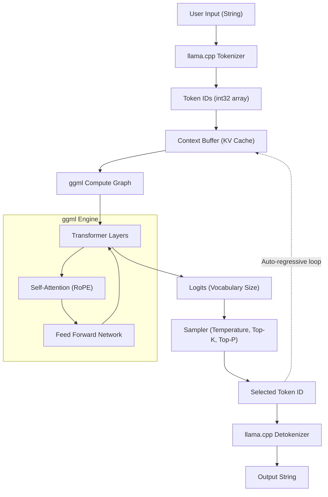

近年、大規模言語モデル (LLM) の進化は凄まじく、その応用範囲は日々拡大しています。しかし、数十億、数百億のパラメータを持つモデルをローカル環境で動かすには、通常、膨大なVRAMを持つハイエンドなGPUが必要となります。この「ハードウェアの壁」を打ち破り、一般的なPCやMac、さらにはRaspberry Piのようなデバイス上でLLMの実用的な推論を可能にしたのが、**llama.cpp** です。

本記事では、単なるコマンドラインツールの使い方にとどまらず、その基盤技術である `ggml` のアーキテクチャ、Transformerや量子化の数学的背景、そして C++ API を利用して独自アプリケーションにLLMを組み込み、カスタマイズするための方法まで、エンジニア向けに極めて詳細に解説します。

---

## 1. llama.cpp と ggml の概要

`llama.cpp` は、Georgi Gerganov氏によって開発された、C/C++ で記述された軽量なLLM推論エンジンです。元々は Meta の LLaMA モデルを Apple Silicon (M1/M2 Mac) 上で高速に動作させることを目的として誕生しましたが、現在では様々なアーキテクチャやモデルをサポートしています。

最大の特徴は、**外部依存関係を持たない純粋な C/C++ 実装** である点です。Python や PyTorch などの巨大なエコシステムを必要とせず、単一の実行ファイルとしてコンパイルできるため、デプロイが非常に容易です。

この `llama.cpp` の心臓部となっているのが、テンソル演算ライブラリ **ggml** です。ggmlは機械学習における行列演算をCPU（および一部GPU）上で極限まで最適化するためにゼロから設計されています。

### 1.1 なぜ llama.cpp は速いのか？

1. **メモリマッピング (mmap) の活用**: モデルの重みをメモリにロードする際、OSの `mmap` を利用することで、RAMへの全ロードを回避し、高速な起動と省メモリを実現します。
2. **SIMD命令の徹底的な最適化**: AVX2, AVX-512, ARM NEON, Apple AMX などのCPU固有の命令セットを活用し、行列積を超高速化しています。
3. **量子化 (Quantization)**: 16-bit 浮動小数点数 (FP16) の重みを 4-bit, 5-bit, 8-bit の整数に圧縮し、メモリ帯域幅のボトルネックを解消します（詳細は後述）。

---

## 2. 数学的背景: Transformer と量子化 (Quantization)

llama.cpp を深く理解するためには、それが計算している数式と、どのように計算を近似しているかを知る必要があります。

### 2.1 Transformer の推論プロセス

LLaMA などのモデルは、自己回帰型 (Auto-regressive) の Transformer デコーダアーキテクチャを採用しています。テキスト生成の核となるのは **Self-Attention** 機構です。

入力となる隠れ状態の行列 $X \in \mathbb{R}^{N \times d}$ に対して、クエリ $Q$、キー $K$、バリュー $V$ は重み行列との積で計算されます。

$$
Q = X W_Q, \quad K = X W_K, \quad V = X W_V
$$

ここで、Attention の出力は次のように定義されます。

$$
\text{Attention}(Q, K, V) = \text{softmax}\left(\frac{QK^T}{\sqrt{d_k}}\right)V
$$

llama.cpp の推論ループにおいて、ボトルネックとなるのはこの巨大な行列 $W_Q, W_K, W_V$ やフィードフォワードネットワーク (FFN) の重み行列とベクトル $X$（生成フェーズでは1トークンずつ処理するため $N=1$）の積、つまり **GEMV (General Matrix-Vector Multiplication)** です。

### 2.2 量子化 (Quantization) の数学的基礎

メモリアクセス帯域がボトルネックとなる推論において、重みパラメータを小さなビット数で表現する量子化は不可欠です。llama.cpp で広く使われているブロック単位の量子化（例えば `Q4_K` や `Q4_0`）の基本原理を説明します。

例えば FP16 の重み行列 $W$ の一部である長さ $B$（通常 32 や 64）のブロック $w = [w_1, w_2, \dots, w_B]$ を考えます。このブロックを 4-bit 整数 $q_i \in [-8, 7]$ と、単一のスケーリングファクタ $\Delta$（FP16 または FP32）に近似します。

$$
w_i \approx \Delta \times q_i
$$

$\Delta$ はブロック内の最大絶対値に基づいて決定されます。

$$
\Delta = \frac{\max_i |w_i|}{7}
$$

量子化後の重みを用いてドット積 $y = w \cdot x$ を計算する場合、入力ベクトル $x$ も同様に量子化して $x_i \approx \Delta_x \times q_{x, i}$ とすると、

$$
y = \sum_{i=1}^{B} w_i x_i \approx \Delta \Delta_x \sum_{i=1}^{B} q_i q_{x, i}
$$

この $\sum q_i q_{x, i}$ の部分は **純粋な整数演算** となり、SIMD 命令を用いて非常に高速に並列計算できます。これが llama.cpp が CPU 上で驚異的な速度を叩き出す数学的なカラクリです。

---

## 3. アーキテクチャと推論フロー

llama.cpp の内部動作を理解するために、以下の Mermaid ダイアグラムでシステム全体のアーキテクチャとデータの流れを示します。



テキスト生成は、1つのトークンが出力されるたびに、それが次の入力として KV Cache に追加され、再び計算グラフを通過する自己回帰的なループになっています。

---

## 4. 環境構築とビルド方法

llama.cpp を C++ のプロジェクトに組み込む前に、まずはソースコードをビルドしてみましょう。

### 4.1 リポジトリのクローン

```bash
git clone https://github.com/ggerganov/llama.cpp.git
cd llama.cpp
```

### 4.2 CMake を使用したビルド

C++ プロジェクトとして他のアプリに組み込む場合、CMake を利用するのが最も標準的です。プラットフォームごとのアクセラレータ（バックエンド）を有効化することで、計算を高速化できます。

**CPU のみ（基本的なビルド）:**
```bash
mkdir build && cd build
cmake ..
cmake --build . --config Release -j 8
```

**NVIDIA GPU (CUDA) を使用する場合:**
```bash
mkdir build && cd build
cmake .. -DGGML_CUDA=ON
cmake --build . --config Release -j 8
```

**Apple Silicon (Metal) を使用する場合:**
```bash
mkdir build && cd build
cmake .. -DGGML_METAL=ON
cmake --build . --config Release -j 8
```

ビルドが成功すると、`build/bin/` ディレクトリに `llama-cli` などの実行ファイルと、後述の C++ API でリンクするための `llama` ライブラリ（および `ggml` ライブラリ）が生成されます。

---

## 5. C++ でのカスタマイズ入門: llama.cpp API の利用

ここからは、本題である C++ コードからの llama.cpp の制御について解説します。
コマンドラインツールを使うだけでなく、自分のアプリケーション（例えばゲームエンジン、デスクトップアプリ、組み込みシステムなど）に LLM を組み込むためには、C++ API を直接叩く必要があります。

llama.cpp は主に `llama.h` というヘッダーファイルでC言語インターフェースを提供しています。C++ から呼び出す場合もこのインターフェースを利用します。

### 5.1 必要最小限のインクルードと設定

自分のプロジェクトで llama.cpp を使う場合、以下をインクルードします。

```cpp
#include "llama.h"
#include <iostream>
#include <vector>
#include <string>
#include <stdexcept>

// エラーハンドリング用のマクロ
#define LLAMA_ASSERT(x) \
    do { \
        if (!(x)) { \
            std::cerr << "Assertion failed: " << #x << std::endl; \
            std::terminate(); \
        } \
    } while (0)
```

### 5.2 モデルのロードとコンテキストの初期化

まず、`.gguf` 形式のモデルファイルをロードし、推論のためのコンテキスト（メモリ空間とKVキャッシュ）を確保します。

```cpp
int main(int argc, char ** argv) {
    if (argc < 2) {
        std::cerr << "Usage: " << argv[0] << " <model.gguf>" << std::endl;
        return 1;
    }
    std::string model_path = argv[1];

    // 1. バックエンドの初期化（CPU/GPU等の環境セットアップ）
    llama_backend_init();

    // 2. モデルパラメータのデフォルト設定を取得
    llama_model_params model_params = llama_model_default_params();
    model_params.n_gpu_layers = 35; // GPUにオフロードするレイヤー数

    // 3. モデルのロード
    llama_model * model = llama_load_model_from_file(model_path.c_str(), model_params);
    if (model == nullptr) {
        std::cerr << "Failed to load model" << std::endl;
        return 1;
    }

    // 4. コンテキストパラメータの設定
    llama_context_params ctx_params = llama_context_default_params();
    ctx_params.n_ctx = 2048; // 最大コンテキストサイズ (トークン数)
    ctx_params.n_threads = 8; // 推論に使用するCPUスレッド数

    // 5. コンテキストの作成
    llama_context * ctx = llama_new_context_with_model(model, ctx_params);
    if (ctx == nullptr) {
        std::cerr << "Failed to create context" << std::endl;
        llama_free_model(model);
        return 1;
    }

    std::cout << "Model and context loaded successfully!" << std::endl;
    // ... 以降の処理
```

### 5.3 プロンプトのトークン化 (Tokenization)

LLM はテキストを直接理解するのではなく、整数の ID（トークン）の羅列として処理します。入力文字列をトークンに変換する必要があります。

```cpp
    std::string prompt = "Q: 日本の首都はどこですか？\nA:";
    std::vector<llama_token> tokens_list;
    tokens_list.resize(prompt.length() + 4); // 余裕を持たせたバッファサイズ

    // 特殊トークン（BOS: Begin of Sequence 等）を先頭に追加するかどうか
    bool add_special = true; 
    // 文字列をトークンIDの配列に変換
    int n_tokens = llama_tokenize(
        model, 
        prompt.c_str(), 
        prompt.length(), 
        tokens_list.data(), 
        tokens_list.size(), 
        add_special, 
        false // parse_special
    );

    if (n_tokens < 0) {
        // バッファが足りない場合は再割り当てしてリトライする処理が必要（簡略化のため省略）
        std::cerr << "Failed to tokenize prompt" << std::endl;
        return 1;
    }
    tokens_list.resize(n_tokens);
```

### 5.4 推論ループとサンプリング

トークンをモデルに入力し、次のトークンの確率分布（Logits）を取得し、そこからサンプリングを行って次のトークンを決定するループを構築します。

```cpp
    // 生成する最大トークン数
    const int max_gen_tokens = 100;
    
    // バッチ評価のための構造体を初期化
    llama_batch batch = llama_batch_init(512, 0, 1);

    // プロンプトのトークンをバッチに追加
    for (size_t i = 0; i < tokens_list.size(); i++) {
        llama_batch_add(batch, tokens_list[i], i, { 0 }, false);
    }
    // プロンプトの最後のトークンでのみロジット（予測結果）を出力するように設定
    batch.logits[batch.n_tokens - 1] = true;

    // 初回の評価（プロンプトをモデルに食わせる）
    if (llama_decode(ctx, batch) != 0) {
        std::cerr << "llama_decode() failed" << std::endl;
        return 1;
    }

    int n_cur = batch.n_tokens; // 現在のコンテキスト長
    int n_decode = 0;

    std::cout << "\nOutput: ";

    // サンプラーコンテキストの初期化（Temperature, Top-K, Top-P 等の設定）
    llama_sampler * smpl = llama_sampler_chain_init(llama_sampler_chain_default_params());
    llama_sampler_chain_add_top_k(smpl, 40);
    llama_sampler_chain_add_top_p(smpl, 0.9f, 1);
    llama_sampler_chain_add_temp(smpl, 0.7f);
    llama_sampler_chain_add_dist(smpl, 1234); // シード値

    while (n_decode < max_gen_tokens) {
        // 1. サンプリング：現在のコンテキストに基づいて次のトークンを予測
        llama_token new_token_id = llama_sampler_sample(smpl, ctx, -1);

        // 2. トークンが EOS (End of Sequence) ならループ終了
        if (llama_token_is_eog(model, new_token_id)) {
            break;
        }

        // 3. トークンを文字列（テキスト）にデコードして表示
        char buf[128];
        int n_chars = llama_token_to_piece(model, new_token_id, buf, sizeof(buf), 0, false);
        if (n_chars > 0) {
            std::cout << std::string(buf, n_chars) << std::flush;
        }

        // 4. 新しく生成されたトークンを次のバッチとして準備
        llama_batch_clear(batch);
        llama_batch_add(batch, new_token_id, n_cur, { 0 }, true);

        // 5. モデルの評価（KVキャッシュを更新し、次を予測）
        if (llama_decode(ctx, batch) != 0) {
            std::cerr << "Failed to evaluate" << std::endl;
            break;
        }

        n_cur += 1;
        n_decode += 1;
    }

    std::cout << std::endl;

    // クリーンアップ
    llama_sampler_free(smpl);
    llama_batch_free(batch);
    llama_free(ctx);
    llama_free_model(model);
    llama_backend_free();

    return 0;
}
```

このコードは、llama.cpp の基本 API を用いて独自推論ループを実装したものです。
`llama_batch` 構造体を用いてトークン群を管理し、`llama_decode` でニューラルネットワークのフォワードパス（順伝播）を実行します。

---

## 6. 高度なカスタマイズ事例: C++ によるロジット操作とペナルティ制御

単純なテキスト生成にとどまらず、特定フォーマット（例えば JSON のみ）の出力を強制させたり、特定の禁止ワードを出力させないように制御したりする場合、サンプリング前の **ロジット（Logits）** を C++ 側で直接操作します。

モデルが各トークンを出力する直前の生のスコア（確率に変換される前の値）の配列を取得できます。

```cpp
// 推論直後、サンプリングを行う前に生のロジット配列を取得
float * logits = llama_get_logits_ith(ctx, batch.n_tokens - 1);
int n_vocab = llama_n_vocab(model);

// 禁止トークンのIDリスト（例として 1234, 5678）
std::vector<llama_token> forbidden_tokens = { 1234, 5678 };

// 禁止トークンの出現確率を 0 (Logitをマイナス無限大) にする
for (llama_token bad_tok : forbidden_tokens) {
    logits[bad_tok] = -INFINITY;
}
```

このように、C++ API を直接扱うことで、LangChain や Python 経由では実現が難しかったり、オーバーヘッドが大きくなるような、**「推論サイクルごとのマイクロミリ秒単位の介入」** が可能になります。

---

## 7. パフォーマンスチューニングの極意

C++ で実装を終えた後、実運用に向けて速度を限界まで高めるためのチェックポイントをいくつか紹介します。

1. **バッチ処理の最適化:** 複数のユーザーからのリクエストを同時に処理する場合、`llama_batch` に複数のシーケンスを含めて一度に `llama_decode` を呼び出す（Continuous Batching）。これによりメモリアクセスを相乗りさせ、スループットを劇的に向上できます。
2. **Flash Attention の有効化:**
   コンテキストパラメータで `ctx_params.flash_attn = true;` を設定することで、メモリ使用量を減らしながら Attention 計算を高速化できます。長いコンテキスト（数万トークン）を扱う場合には必須の設定です。
3. **Numa 対応:**
   マルチソケットのサーバー環境では `llama_backend_init()` 前に NUMA の設定を適切に行うことで、メモリアクセスのレイテンシを削減できます。

---

## 8. 終わりに

本記事では、`llama.cpp` の数学的な背景から始まり、アーキテクチャの解説、そして C++ API を駆使したカスタム推論エンジンの構築方法までを詳細に解説しました。

Python のエコシステムはプロトタイピングには非常に便利ですが、エッジデバイスへのデプロイメント、ゲームへの組み込み、リアルタイム処理が要求されるプロダクション環境においては、C/C++ ベースの `llama.cpp` の直接制御が圧倒的な力を見せます。

皆さんもぜひ、自分の手で C++ コードを書き、ローカル環境で LLM を自由に操る楽しさを体験してみてください。

> **参考リンク集**
> - [llama.cpp Official Repository](https://github.com/ggerganov/llama.cpp)
> - [ggml - Tensor Library](https://github.com/ggerganov/ggml)
> - [Attention Is All You Need (Vaswani et al., 2017)](https://arxiv.org/abs/1706.03762)
