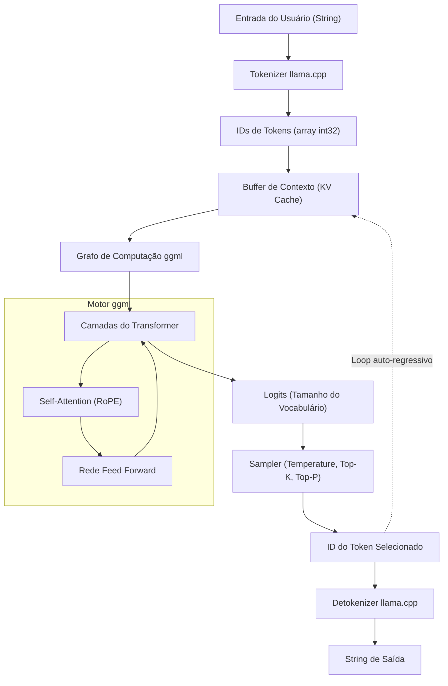

Nos últimos anos, a evolução dos Grandes Modelos de Linguagem (LLM) tem sido impressionante, e sua área de aplicação se expande dia após dia. No entanto, para executar modelos com bilhões ou dezenas de bilhões de parâmetros em um ambiente local, normalmente é necessária uma GPU de ponta com uma quantidade enorme de VRAM. O **llama.cpp** é o que quebrou essa "barreira de hardware" e tornou possível a inferência prática de LLM em PCs comuns, Macs e até dispositivos como o Raspberry Pi.

Neste artigo, explicaremos de forma extremamente detalhada para engenheiros, indo além do simples uso de ferramentas de linha de comando, para cobrir a arquitetura de sua tecnologia base `ggml`, a base matemática do Transformer e a quantização, e até mesmo métodos para incorporar e customizar LLMs em suas próprias aplicações usando a API C++.

---

## 1. Visão geral do llama.cpp e ggml

O `llama.cpp` é um motor de inferência de LLM leve escrito em C/C++, desenvolvido por Georgi Gerganov. Inicialmente criado com o propósito de rodar o modelo LLaMA da Meta rapidamente no Apple Silicon (Macs M1/M2), agora ele suporta várias arquiteturas e modelos.

Sua principal característica é ser uma **implementação pura em C/C++ sem dependências externas**. Ele não requer grandes ecossistemas como Python ou PyTorch e pode ser compilado como um único arquivo executável, o que torna o deploy extremamente fácil.

No coração deste `llama.cpp` está a biblioteca de operações tensoriais **ggml**. A ggml foi projetada do zero para otimizar operações de matriz em aprendizado de máquina no CPU (e algumas GPUs) ao limite absoluto.

### 1.1 Por que o llama.cpp é tão rápido?

1. **Utilização de mapeamento de memória (mmap)**: Ao carregar os pesos do modelo na memória, ele usa o `mmap` do SO, evitando um carregamento completo na RAM, alcançando assim uma inicialização rápida e economia de memória.
2. **Otimização exaustiva de instruções SIMD**: Ele utiliza conjuntos de instruções específicos do CPU, como AVX2, AVX-512, ARM NEON e Apple AMX para acelerar enormemente a multiplicação de matrizes.
3. **Quantização (Quantization)**: Ele comprime pesos de ponto flutuante de 16 bits (FP16) em inteiros de 4 bits, 5 bits ou 8 bits, eliminando o gargalo na largura de banda da memória (mais detalhes abaixo).

---

## 2. Base Matemática: Transformer e Quantização (Quantization)

Para entender profundamente o llama.cpp, você precisa saber quais fórmulas matemáticas ele está calculando e como ele aproxima esses cálculos.

### 2.1 O Processo de Inferência do Transformer

Modelos como o LLaMA adotam uma arquitetura de decodificador Transformer auto-regressiva (Auto-regressive). O núcleo da geração de texto é o mecanismo de **Self-Attention**.

Para uma matriz de estado oculto de entrada $X \in \mathbb{R}^{N \times d}$, as queries $Q$, keys $K$ e values $V$ são calculadas por produtos com matrizes de pesos.

$$
Q = X W_Q, \quad K = X W_K, \quad V = X W_V
$$

Aqui, a saída da Attention é definida como a seguir.

$$
\text{Attention}(Q, K, V) = \text{softmax}\left(\frac{QK^T}{\sqrt{d_k}}\right)V
$$

No loop de inferência do llama.cpp, o gargalo é o produto dessas enormes matrizes $W_Q, W_K, W_V$ ou das matrizes de pesos da rede feed-forward (FFN) com o vetor $X$ (já que processa um token por vez na fase de geração, $N=1$), isto é, **GEMV (General Matrix-Vector Multiplication)**.

### 2.2 Base Matemática da Quantização (Quantization)

Na inferência, onde a largura de banda de acesso à memória se torna um gargalo, a quantização, que expressa parâmetros de peso em um número menor de bits, é essencial. Explicaremos o princípio básico da quantização em blocos amplamente utilizada no llama.cpp (por exemplo, `Q4_K` e `Q4_0`).

Por exemplo, considere um bloco $w = [w_1, w_2, \dots, w_B]$ de comprimento $B$ (geralmente 32 ou 64) que é parte da matriz de pesos FP16 $W$. Nós aproximamos este bloco para um inteiro de 4 bits $q_i \in [-8, 7]$ e um único fator de escala $\Delta$ (FP16 ou FP32).

$$
w_i \approx \Delta \times q_i
$$

O $\Delta$ é determinado com base no valor absoluto máximo dentro do bloco.

$$
\Delta = \frac{\max_i |w_i|}{7}
$$

Ao calcular o produto escalar $y = w \cdot x$ usando os pesos quantizados, se o vetor de entrada $x$ for similarmente quantizado de modo que $x_i \approx \Delta_x \times q_{x, i}$, então

$$
y = \sum_{i=1}^{B} w_i x_i \approx \Delta \Delta_x \sum_{i=1}^{B} q_i q_{x, i}
$$

Esta parte de $\sum q_i q_{x, i}$ se torna uma **operação inteira pura**, a qual pode ser calculada em paralelo em altíssima velocidade usando instruções SIMD. Este é o truque matemático de como o llama.cpp alcança sua velocidade incrível em CPUs.

---

## 3. Arquitetura e Fluxo de Inferência

Para entender o funcionamento interno do llama.cpp, o diagrama Mermaid a seguir mostra a arquitetura de todo o sistema e o fluxo de dados.



A geração de texto é um loop auto-regressivo onde cada vez que um token é emitido, ele é adicionado ao KV Cache como a próxima entrada e passa novamente pelo grafo de computação.

---

## 4. Configuração do Ambiente e Métodos de Build

Antes de incorporar o llama.cpp ao seu projeto em C++, vamos primeiro tentar compilar o código-fonte.

### 4.1 Clonando o Repositório

```bash
git clone https://github.com/ggerganov/llama.cpp.git
cd llama.cpp
```

### 4.2 Compilando Usando CMake

Para integrá-lo em outros aplicativos como um projeto C++, usar o CMake é a abordagem mais padrão. Ativar o acelerador (backend) para cada plataforma pode aumentar a velocidade de computação.

**Apenas CPU (Build básico):**
```bash
mkdir build && cd build
cmake ..
cmake --build . --config Release -j 8
```

**Ao usar NVIDIA GPU (CUDA):**
```bash
mkdir build && cd build
cmake .. -DGGML_CUDA=ON
cmake --build . --config Release -j 8
```

**Ao usar Apple Silicon (Metal):**
```bash
mkdir build && cd build
cmake .. -DGGML_METAL=ON
cmake --build . --config Release -j 8
```

Uma vez que a compilação for bem-sucedida, arquivos executáveis como o `llama-cli`, bem como a biblioteca `llama` (e a biblioteca `ggml`) para vinculação com a API C++ descrita mais adiante, serão gerados no diretório `build/bin/`.

---

## 5. Introdução à Customização em C++: Usando a API do llama.cpp

A partir daqui, discutiremos o tema principal: controlar o llama.cpp a partir de código C++.
Para não apenas usar a ferramenta de linha de comando, mas também incorporar o LLM em sua própria aplicação (como motores de jogos, aplicativos de desktop, sistemas embarcados, etc.), você precisa chamar a API C++ diretamente.

O llama.cpp fornece uma interface de linguagem C principalmente através de um arquivo de cabeçalho chamado `llama.h`. Quando você o chama do C++, você também utilizará esta interface.

### 5.1 Includes e Configurações Mínimas Necessárias

Ao usar o llama.cpp em seu próprio projeto, você incluirá o seguinte.

```cpp
#include "llama.h"
#include <iostream>
#include <vector>
#include <string>
#include <stdexcept>

// Macro para tratamento de erros
#define LLAMA_ASSERT(x) \
    do { \
        if (!(x)) { \
            std::cerr << "Assertion failed: " << #x << std::endl; \
            std::terminate(); \
        } \
    } while (0)
```

### 5.2 Carregando o Modelo e Inicializando o Contexto

Primeiro, carregamos um arquivo de modelo no formato `.gguf` e alocamos um contexto (espaço de memória e KV cache) para inferência.

```cpp
int main(int argc, char ** argv) {
    if (argc < 2) {
        std::cerr << "Usage: " << argv[0] << " <model.gguf>" << std::endl;
        return 1;
    }
    std::string model_path = argv[1];

    // 1. Inicialização do backend (configuração do ambiente como CPU/GPU, etc.)
    llama_backend_init();

    // 2. Obter configurações padrão de parâmetros do modelo
    llama_model_params model_params = llama_model_default_params();
    model_params.n_gpu_layers = 35; // Número de camadas a descarregar para a GPU

    // 3. Carregando o modelo
    llama_model * model = llama_load_model_from_file(model_path.c_str(), model_params);
    if (model == nullptr) {
        std::cerr << "Failed to load model" << std::endl;
        return 1;
    }

    // 4. Configuração dos parâmetros de contexto
    llama_context_params ctx_params = llama_context_default_params();
    ctx_params.n_ctx = 2048; // Tamanho máximo de contexto (em tokens)
    ctx_params.n_threads = 8; // Número de threads da CPU para inferência

    // 5. Criação do contexto
    llama_context * ctx = llama_new_context_with_model(model, ctx_params);
    if (ctx == nullptr) {
        std::cerr << "Failed to create context" << std::endl;
        llama_free_model(model);
        return 1;
    }

    std::cout << "Model and context loaded successfully!" << std::endl;
    // ... Processamento subsequente
```

### 5.3 Tokenização do Prompt (Tokenization)

Um LLM não entende textos diretamente, mas sim os processa como uma sequência de IDs inteiros (tokens). A string de entrada deve ser convertida em tokens.

```cpp
    std::string prompt = "Q: Qual é a capital do Japão?\nA:";
    std::vector<llama_token> tokens_list;
    tokens_list.resize(prompt.length() + 4); // Tamanho de buffer com margem

    // Adicionar um token especial (como BOS: Begin of Sequence) ao início
    bool add_special = true; 
    // Converter a string para um array de IDs de tokens
    int n_tokens = llama_tokenize(
        model, 
        prompt.c_str(), 
        prompt.length(), 
        tokens_list.data(), 
        tokens_list.size(), 
        add_special, 
        false // parse_special
    );

    if (n_tokens < 0) {
        // Se o buffer for insuficiente, é necessário realocar e tentar novamente (omitido por simplificação)
        std::cerr << "Failed to tokenize prompt" << std::endl;
        return 1;
    }
    tokens_list.resize(n_tokens);
```

### 5.4 Loop de Inferência e Amostragem (Sampling)

Construímos um loop onde os tokens são inseridos no modelo, obtemos a distribuição de probabilidade (Logits) do próximo token e realizamos amostragem a partir dela para determinar o próximo token.

```cpp
    // Número máximo de tokens a gerar
    const int max_gen_tokens = 100;
    
    // Inicializar a estrutura para avaliação em lote (batch)
    llama_batch batch = llama_batch_init(512, 0, 1);

    // Adicionar tokens de prompt ao batch
    for (size_t i = 0; i < tokens_list.size(); i++) {
        llama_batch_add(batch, tokens_list[i], i, { 0 }, false);
    }
    // Configurar para produzir logits (resultados previstos) apenas para o último token do prompt
    batch.logits[batch.n_tokens - 1] = true;

    // Avaliação inicial (alimentando o modelo com o prompt)
    if (llama_decode(ctx, batch) != 0) {
        std::cerr << "llama_decode() failed" << std::endl;
        return 1;
    }

    int n_cur = batch.n_tokens; // Tamanho atual do contexto
    int n_decode = 0;

    std::cout << "\nOutput: ";

    // Inicialização do contexto do sampler (configurações como Temperature, Top-K, Top-P, etc.)
    llama_sampler * smpl = llama_sampler_chain_init(llama_sampler_chain_default_params());
    llama_sampler_chain_add_top_k(smpl, 40);
    llama_sampler_chain_add_top_p(smpl, 0.9f, 1);
    llama_sampler_chain_add_temp(smpl, 0.7f);
    llama_sampler_chain_add_dist(smpl, 1234); // Valor da semente (Seed)

    while (n_decode < max_gen_tokens) {
        // 1. Amostragem: Prever o próximo token com base no contexto atual
        llama_token new_token_id = llama_sampler_sample(smpl, ctx, -1);

        // 2. Se o token for EOS (End of Sequence), encerrar o loop
        if (llama_token_is_eog(model, new_token_id)) {
            break;
        }

        // 3. Decodificar o token para uma string (texto) e exibir
        char buf[128];
        int n_chars = llama_token_to_piece(model, new_token_id, buf, sizeof(buf), 0, false);
        if (n_chars > 0) {
            std::cout << std::string(buf, n_chars) << std::flush;
        }

        // 4. Preparar o token recém-gerado para o próximo batch
        llama_batch_clear(batch);
        llama_batch_add(batch, new_token_id, n_cur, { 0 }, true);

        // 5. Avaliação do modelo (atualiza a KV cache e prevê a seguir)
        if (llama_decode(ctx, batch) != 0) {
            std::cerr << "Failed to evaluate" << std::endl;
            break;
        }

        n_cur += 1;
        n_decode += 1;
    }

    std::cout << std::endl;

    // Cleanup (Limpeza)
    llama_sampler_free(smpl);
    llama_batch_free(batch);
    llama_free(ctx);
    llama_free_model(model);
    llama_backend_free();

    return 0;
}
```

Este código implementa um loop de inferência customizado usando a API básica do llama.cpp.
Ele usa a estrutura `llama_batch` para gerenciar grupos de tokens e executa um forward pass (propagação para frente) na rede neural com `llama_decode`.

---

## 6. Exemplo de Customização Avançada: Manipulação de Logits e Controle de Penalidade com C++

Se além da simples geração de texto você deseja forçar a saída de um formato específico (por exemplo, apenas JSON) ou quer controlar para evitar a geração de palavras proibidas específicas, você manipula diretamente os **Logits** antes da amostragem no lado do C++.

Você pode obter o array de pontuações brutas (valores antes de serem convertidos para probabilidades) de cada token imediatamente antes que o modelo o emita.

```cpp
// Logo após a inferência e antes de realizar a amostragem, obter o array bruto de logits
float * logits = llama_get_logits_ith(ctx, batch.n_tokens - 1);
int n_vocab = llama_n_vocab(model);

// Lista de IDs de tokens proibidos (por exemplo, 1234, 5678)
std::vector<llama_token> forbidden_tokens = { 1234, 5678 };

// Define a probabilidade de um token proibido como 0 (o Logit vai para menos infinito)
for (llama_token bad_tok : forbidden_tokens) {
    logits[bad_tok] = -INFINITY;
}
```

Dessa forma, usando a API C++ diretamente, uma **"intervenção em nível de microssegundo por ciclo de inferência"** se torna possível, a qual pode ser muito difícil ou acarretar uma alta sobrecarga se feita via LangChain ou Python.

---

## 7. Segredos para Ajuste de Desempenho

Após concluir sua implementação em C++, apresentaremos alguns pontos de verificação para aumentar a velocidade ao limite para uma operação no mundo real.

1. **Otimização de processamento em lote (Batching):** Ao processar requisições de vários usuários simultaneamente, adicione múltiplas sequências no `llama_batch` e chame `llama_decode` de uma só vez (Continuous Batching). Isso permite compartilhar os acessos de memória, melhorando dramaticamente o throughput.
2. **Ativando a Flash Attention:**
   Configurando `ctx_params.flash_attn = true;` nos parâmetros de contexto, você pode acelerar os cálculos da Attention enquanto reduz o uso de memória. Esta é uma configuração obrigatória quando lidando com contextos longos (dezenas de milhares de tokens).
3. **Suporte NUMA:**
   Em um ambiente de servidor multi-socket, você pode reduzir a latência de acesso à memória configurando corretamente as configurações NUMA antes do `llama_backend_init()`.

---

## 8. Conclusão

Neste artigo, explicamos em detalhe desde a base matemática do `llama.cpp` até a explicação de sua arquitetura, e como construir um motor de inferência customizado fazendo total uso da API em C++.

O ecossistema Python é extremamente útil para prototipagem, mas em ambientes de produção que exigem implantações em dispositivos de borda, integração em jogos e processamento em tempo real, o controle direto do `llama.cpp` baseado em C/C++ mostra um poder esmagador.

Nós encorajamos fortemente que você tente escrever seu próprio código em C++ e experiencie a alegria de controlar e operar os LLMs livremente em seu ambiente local.

> **Lista de Links de Referência**
> - [llama.cpp Official Repository](https://github.com/ggerganov/llama.cpp)
> - [ggml - Tensor Library](https://github.com/ggerganov/ggml)
> - [Attention Is All You Need (Vaswani et al., 2017)](https://arxiv.org/abs/1706.03762)
