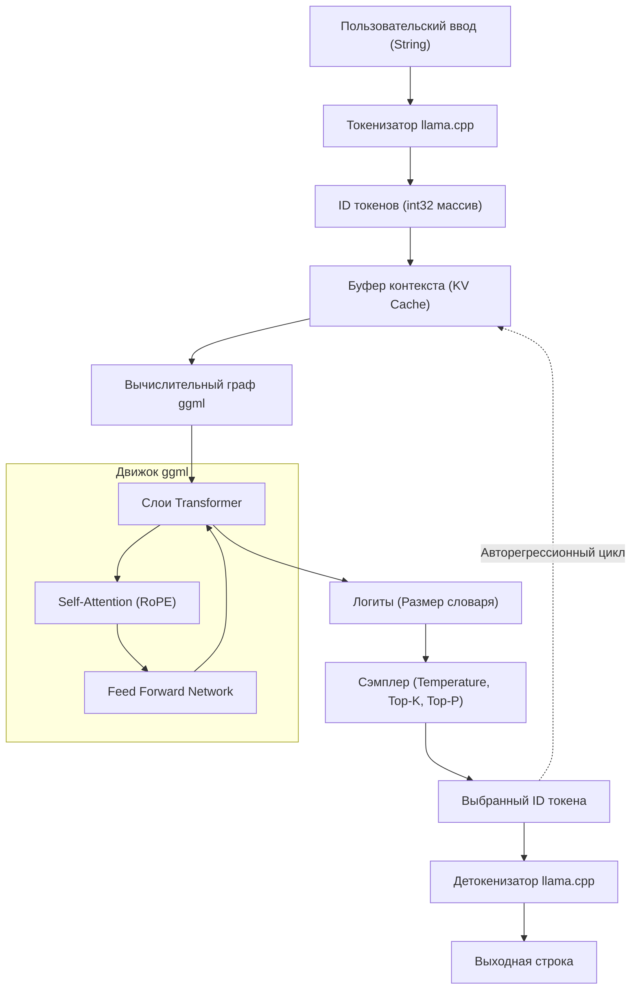

В последние годы эволюция больших языковых моделей (LLM) поражает воображение, и сфера их применения расширяется с каждым днем. Однако для запуска моделей с миллиардами и десятками миллиардов параметров в локальной среде обычно требуются высокопроизводительные GPU с огромным объемом VRAM. **llama.cpp** — это то, что разрушило эту "аппаратную стену" и сделало возможным практический инференс LLM на обычных ПК, Mac и даже устройствах вроде Raspberry Pi.

В этой статье мы не ограничимся простым использованием инструмента командной строки, а подробно, специально для инженеров, разберем архитектуру базовой технологии `ggml`, математическую основу Transformer и квантования, а также способы интеграции и кастомизации LLM в ваших собственных приложениях с использованием C++ API.

---

## 1. Обзор llama.cpp и ggml

`llama.cpp` — это легковесный движок инференса LLM, написанный на C/C++ разработчиком Георгием Гергановым. Изначально он был создан для быстрого запуска модели LLaMA от Meta на Apple Silicon (M1/M2 Mac), но теперь поддерживает различные архитектуры и модели.

Его главная особенность — это **чистая реализация на C/C++ без внешних зависимостей**. Он не требует огромных экосистем вроде Python или PyTorch и может быть скомпилирован как один исполняемый файл, что делает деплой чрезвычайно простым.

Сердцем этого `llama.cpp` является библиотека тензорных вычислений **ggml**. ggml была разработана с нуля для максимальной оптимизации матричных вычислений в машинном обучении на CPU (а также на некоторых GPU).

### 1.1 Почему llama.cpp такой быстрый?

1. **Использование отображения памяти (mmap)**: При загрузке весов модели в память используется системный вызов OS `mmap`, что позволяет избежать полной загрузки в RAM, обеспечивая быстрый запуск и экономию памяти.
2. **Тщательная оптимизация SIMD-инструкций**: Для сверхбыстрого перемножения матриц используются специфичные для CPU наборы инструкций, такие как AVX2, AVX-512, ARM NEON и Apple AMX.
3. **Квантование (Quantization)**: Веса в формате 16-битных чисел с плавающей запятой (FP16) сжимаются в 4-битные, 5-битные и 8-битные целые числа, что устраняет узкое место пропускной способности памяти (подробнее об этом ниже).

---

## 2. Математическая основа: Transformer и Квантование (Quantization)

Для глубокого понимания llama.cpp необходимо знать, какие математические формулы он вычисляет и как аппроксимирует вычисления.

### 2.1 Процесс инференса Transformer

Такие модели, как LLaMA, используют архитектуру авторегрессионного (Auto-regressive) декодера Transformer. Ядром генерации текста является механизм **Self-Attention**.

Для входной матрицы скрытых состояний $X \in \mathbb{R}^{N \times d}$, запрос (Query) $Q$, ключ (Key) $K$ и значение (Value) $V$ вычисляются как произведения с матрицами весов.

$$
Q = X W_Q, \quad K = X W_K, \quad V = X W_V
$$

Здесь выход Attention определяется следующим образом:

$$
\text{Attention}(Q, K, V) = \text{softmax}\left(\frac{QK^T}{\sqrt{d_k}}\right)V
$$

В цикле инференса llama.cpp узким местом становится произведение этих огромных матриц $W_Q, W_K, W_V$ и матриц весов сети прямого распространения (FFN) на вектор $X$ (на этапе генерации $N=1$, так как обрабатывается по одному токену), то есть **GEMV (General Matrix-Vector Multiplication)**.

### 2.2 Математические основы квантования (Quantization)

При инференсе, где узким местом является пропускная способность доступа к памяти, квантование, представляющее весовые параметры небольшим количеством бит, жизненно необходимо. Давайте объясним базовый принцип блочного квантования (например, `Q4_K` или `Q4_0`), широко используемого в llama.cpp.

Например, рассмотрим блок $w = [w_1, w_2, \dots, w_B]$ длины $B$ (обычно 32 или 64), который является частью матрицы весов $W$ в формате FP16. Этот блок аппроксимируется 4-битными целыми числами $q_i \in [-8, 7]$ и одним масштабным коэффициентом (scaling factor) $\Delta$ (FP16 или FP32).

$$
w_i \approx \Delta \times q_i
$$

$\Delta$ определяется на основе максимального абсолютного значения внутри блока.

$$
\Delta = \frac{\max_i |w_i|}{7}
$$

Если входной вектор $x$ также квантуется как $x_i \approx \Delta_x \times q_{x, i}$ при вычислении скалярного произведения $y = w \cdot x$ с использованием квантованных весов, то:

$$
y = \sum_{i=1}^{B} w_i x_i \approx \Delta \Delta_x \sum_{i=1}^{B} q_i q_{x, i}
$$

Часть $\sum q_i q_{x, i}$ становится **чисто целочисленной арифметикой** и может быть вычислена параллельно на очень высокой скорости с использованием SIMD-инструкций. Это и есть математический секрет того, как llama.cpp достигает невероятной скорости на CPU.

---

## 3. Архитектура и поток инференса

Чтобы понять внутреннее устройство llama.cpp, на следующей диаграмме Mermaid показана архитектура всей системы и потоки данных.



Генерация текста — это авторегрессионный цикл: каждый раз, когда выводится один токен, он добавляется в KV Cache как следующий вход и снова проходит через вычислительный граф.

---

## 4. Настройка окружения и сборка

Прежде чем интегрировать llama.cpp в проект C++, давайте сначала соберем исходный код.

### 4.1 Клонирование репозитория

```bash
git clone https://github.com/ggerganov/llama.cpp.git
cd llama.cpp
```

### 4.2 Сборка с использованием CMake

При интеграции в другие приложения в качестве C++ проекта использование CMake является наиболее стандартным подходом. Включение платформозависимого ускорителя (бэкенда) позволяет ускорить вычисления.

**Только CPU (базовая сборка):**
```bash
mkdir build && cd build
cmake ..
cmake --build . --config Release -j 8
```

**При использовании NVIDIA GPU (CUDA):**
```bash
mkdir build && cd build
cmake .. -DGGML_CUDA=ON
cmake --build . --config Release -j 8
```

**При использовании Apple Silicon (Metal):**
```bash
mkdir build && cd build
cmake .. -DGGML_METAL=ON
cmake --build . --config Release -j 8
```

После успешной сборки в директории `build/bin/` будут сгенерированы исполняемые файлы, такие как `llama-cli`, и библиотека `llama` (а также библиотека `ggml`) для линковки через C++ API, о котором пойдет речь ниже.

---

## 5. Введение в кастомизацию на C++: Использование API llama.cpp

С этого момента мы перейдем к главной теме — управлению llama.cpp из кода на C++.
Чтобы не просто использовать инструмент командной строки, а встроить LLM в собственное приложение (например, игровой движок, десктопное приложение, встроенную систему и т. д.), необходимо напрямую обращаться к C++ API.

llama.cpp предоставляет интерфейс на языке C в основном через заголовочный файл `llama.h`. При вызове из C++ также используется этот интерфейс.

### 5.1 Минимально необходимые инклуды и настройки

При использовании llama.cpp в собственном проекте добавьте следующие `#include`.

```cpp
#include "llama.h"
#include <iostream>
#include <vector>
#include <string>
#include <stdexcept>

// Макрос для обработки ошибок
#define LLAMA_ASSERT(x) \
    do { \
        if (!(x)) { \
            std::cerr << "Assertion failed: " << #x << std::endl; \
            std::terminate(); \
        } \
    } while (0)
```

### 5.2 Загрузка модели и инициализация контекста

Сначала загрузим файл модели в формате `.gguf` и выделим контекст (область памяти и KV-кэш) для инференса.

```cpp
int main(int argc, char ** argv) {
    if (argc < 2) {
        std::cerr << "Usage: " << argv[0] << " <model.gguf>" << std::endl;
        return 1;
    }
    std::string model_path = argv[1];

    // 1. Инициализация бэкенда (настройка окружения для CPU/GPU и т.д.)
    llama_backend_init();

    // 2. Получение настроек параметров модели по умолчанию
    llama_model_params model_params = llama_model_default_params();
    model_params.n_gpu_layers = 35; // Количество слоев, переносимых на GPU

    // 3. Загрузка модели
    llama_model * model = llama_load_model_from_file(model_path.c_str(), model_params);
    if (model == nullptr) {
        std::cerr << "Failed to load model" << std::endl;
        return 1;
    }

    // 4. Настройка параметров контекста
    llama_context_params ctx_params = llama_context_default_params();
    ctx_params.n_ctx = 2048; // Максимальный размер контекста (количество токенов)
    ctx_params.n_threads = 8; // Количество потоков CPU, используемых для инференса

    // 5. Создание контекста
    llama_context * ctx = llama_new_context_with_model(model, ctx_params);
    if (ctx == nullptr) {
        std::cerr << "Failed to create context" << std::endl;
        llama_free_model(model);
        return 1;
    }

    std::cout << "Model and context loaded successfully!" << std::endl;
    // ... дальнейшая обработка
```

### 5.3 Токенизация промпта (Tokenization)

LLM не понимают текст напрямую, а обрабатывают его как последовательность целочисленных ID (токенов). Входную строку необходимо преобразовать в токены.

```cpp
    std::string prompt = "Q: Какая столица Японии?\nA:";
    std::vector<llama_token> tokens_list;
    tokens_list.resize(prompt.length() + 4); // Размер буфера с запасом

    // Добавлять ли специальные токены (BOS: Begin of Sequence и т.д.) в начало
    bool add_special = true; 
    // Преобразование строки в массив ID токенов
    int n_tokens = llama_tokenize(
        model, 
        prompt.c_str(), 
        prompt.length(), 
        tokens_list.data(), 
        tokens_list.size(), 
        add_special, 
        false // parse_special
    );

    if (n_tokens < 0) {
        // Требуется логика для перераспределения буфера и повторной попытки, если места не хватает (опущено для простоты)
        std::cerr << "Failed to tokenize prompt" << std::endl;
        return 1;
    }
    tokens_list.resize(n_tokens);
```

### 5.4 Цикл инференса и сэмплирование

Мы построим цикл, который передает токены в модель, получает распределение вероятностей (Logits) следующего токена и выполняет сэмплирование для определения следующего токена.

```cpp
    // Максимальное количество генерируемых токенов
    const int max_gen_tokens = 100;
    
    // Инициализация структуры для пакетной обработки (batch evaluation)
    llama_batch batch = llama_batch_init(512, 0, 1);

    // Добавление токенов промпта в пакет
    for (size_t i = 0; i < tokens_list.size(); i++) {
        llama_batch_add(batch, tokens_list[i], i, { 0 }, false);
    }
    // Настройка вывода логитов (результатов предсказания) только для последнего токена промпта
    batch.logits[batch.n_tokens - 1] = true;

    // Первоначальная оценка (скармливание промпта модели)
    if (llama_decode(ctx, batch) != 0) {
        std::cerr << "llama_decode() failed" << std::endl;
        return 1;
    }

    int n_cur = batch.n_tokens; // Текущая длина контекста
    int n_decode = 0;

    std::cout << "\nOutput: ";

    // Инициализация контекста сэмплера (настройки Temperature, Top-K, Top-P и т.д.)
    llama_sampler * smpl = llama_sampler_chain_init(llama_sampler_chain_default_params());
    llama_sampler_chain_add_top_k(smpl, 40);
    llama_sampler_chain_add_top_p(smpl, 0.9f, 1);
    llama_sampler_chain_add_temp(smpl, 0.7f);
    llama_sampler_chain_add_dist(smpl, 1234); // Значение Seed

    while (n_decode < max_gen_tokens) {
        // 1. Сэмплирование: предсказание следующего токена на основе текущего контекста
        llama_token new_token_id = llama_sampler_sample(smpl, ctx, -1);

        // 2. Если токен - это EOS (End of Sequence), завершить цикл
        if (llama_token_is_eog(model, new_token_id)) {
            break;
        }

        // 3. Декодирование токена в строку (текст) и ее отображение
        char buf[128];
        int n_chars = llama_token_to_piece(model, new_token_id, buf, sizeof(buf), 0, false);
        if (n_chars > 0) {
            std::cout << std::string(buf, n_chars) << std::flush;
        }

        // 4. Подготовка только что сгенерированного токена как следующего пакета
        llama_batch_clear(batch);
        llama_batch_add(batch, new_token_id, n_cur, { 0 }, true);

        // 5. Оценка модели (обновление KV-кэша и предсказание следующего)
        if (llama_decode(ctx, batch) != 0) {
            std::cerr << "Failed to evaluate" << std::endl;
            break;
        }

        n_cur += 1;
        n_decode += 1;
    }

    std::cout << std::endl;

    // Очистка
    llama_sampler_free(smpl);
    llama_batch_free(batch);
    llama_free(ctx);
    llama_free_model(model);
    llama_backend_free();

    return 0;
}
```

Этот код реализует собственный цикл инференса с использованием базового API llama.cpp.
Группа токенов управляется с помощью структуры `llama_batch`, а прямой проход (forward pass) нейронной сети выполняется с помощью `llama_decode`.

---

## 6. Продвинутые примеры кастомизации: Управление логитами и штрафами на C++

Если вы хотите выйти за рамки простой генерации текста и принудительно задать определенный формат вывода (например, только JSON) или запретить вывод определенных слов, вы можете напрямую управлять **логитами (Logits)** на стороне C++ перед сэмплированием.

Вы можете получить массив необработанных оценок (значений до их преобразования в вероятности) непосредственно перед тем, как модель выведет каждый токен.

```cpp
// Получение массива необработанных логитов сразу после инференса и перед выполнением сэмплирования
float * logits = llama_get_logits_ith(ctx, batch.n_tokens - 1);
int n_vocab = llama_n_vocab(model);

// Список ID запрещенных токенов (например, 1234, 5678)
std::vector<llama_token> forbidden_tokens = { 1234, 5678 };

// Установка вероятности появления запрещенных токенов на 0 (логит в минус бесконечность)
for (llama_token bad_tok : forbidden_tokens) {
    logits[bad_tok] = -INFINITY;
}
```

Таким образом, работая напрямую с C++ API, становится возможным **"вмешательство на микросекундном уровне на каждом цикле инференса"**, что трудно реализовать или влечет за собой большие накладные расходы при использовании LangChain или Python.

---

## 7. Секреты настройки производительности

После завершения реализации на C++, вот несколько контрольных точек для максимизации скорости в преддверии запуска в производственную среду (production).

1. **Оптимизация пакетной обработки (Batching):** При одновременной обработке запросов от нескольких пользователей включите несколько последовательностей в `llama_batch` и вызовите `llama_decode` один раз (Continuous Batching). Это позволяет объединить обращения к памяти и значительно повысить пропускную способность.
2. **Включение Flash Attention:**
   Установив `ctx_params.flash_attn = true;` в параметрах контекста, вы можете ускорить вычисления Attention, одновременно уменьшив использование памяти. Это обязательная настройка при работе с длинными контекстами (десятки тысяч токенов).
3. **Поддержка NUMA:**
   В многопроцессорных серверных средах (multi-socket) задержку доступа к памяти можно уменьшить путем правильной настройки NUMA перед вызовом `llama_backend_init()`.

---

## 8. В заключение

В этой статье мы подробно рассмотрели всё: от математической базы `llama.cpp` и разбора его архитектуры до создания кастомного движка инференса с использованием C++ API.

Хотя экосистема Python очень удобна для прототипирования, в производственных средах, где требуется деплой на edge-устройства, интеграция в игры или обработка в реальном времени, прямое управление через `llama.cpp` на базе C/C++ демонстрирует подавляющее превосходство.

Обязательно попробуйте написать код на C++ своими руками и ощутите радость от свободного управления LLM в вашей локальной среде.

> **Полезные ссылки**
> - [llama.cpp Official Repository](https://github.com/ggerganov/llama.cpp)
> - [ggml - Tensor Library](https://github.com/ggerganov/ggml)
> - [Attention Is All You Need (Vaswani et al., 2017)](https://arxiv.org/abs/1706.03762)
