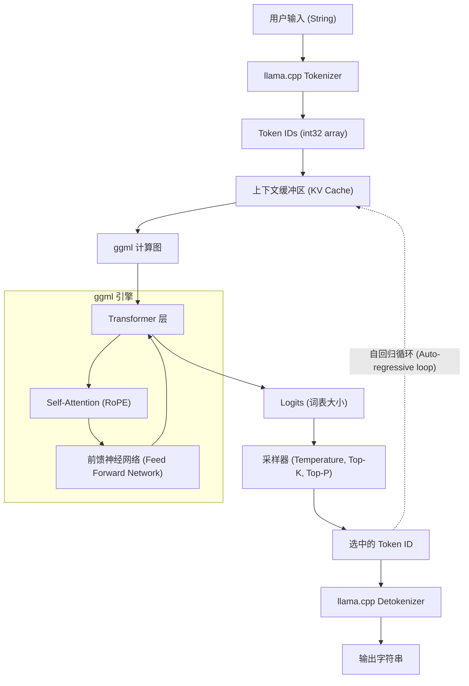

近年来，大型语言模型（LLM）的进化非常迅猛，其应用范围每天都在扩大。然而，要在本地环境中运行拥有数十亿、数百亿参数的模型，通常需要配备海量显存的高端GPU。打破这种“硬件壁垒”，让在普通PC、Mac甚至像Raspberry Pi这样的设备上进行LLM的实用推理成为可能的，就是 **llama.cpp**。

本文不仅将介绍仅仅作为命令行工具的使用方法，还将面向工程师极其详细地解析其底层技术 `ggml` 的架构、Transformer与量化的数学背景，以及如何利用 C++ API 将 LLM 嵌入到自有应用程序并进行定制。

---

## 1. llama.cpp 与 ggml 概述

`llama.cpp` 是由 Georgi Gerganov 开发的、使用 C/C++ 编写的轻量级 LLM 推理引擎。它最初的目的是为了让 Meta 的 LLaMA 模型在 Apple Silicon (M1/M2 Mac) 上高速运行，但现在已支持各种架构和模型。

它最大的特点在于**它是纯粹的 C/C++ 实现，没有外部依赖**。由于不需要 Python 或 PyTorch 这种庞大的生态系统，它可以编译为单个可执行文件，因此部署极其简单。

作为 `llama.cpp` 核心的是张量运算库 **ggml**。ggml 是从零开始设计的，旨在将机器学习中的矩阵运算在 CPU（以及部分 GPU）上优化到极致。

### 1.1 为什么 llama.cpp 这么快？

1. **利用内存映射 (mmap)**：在将模型权重加载到内存时，利用操作系统的 `mmap`，可以避免全部加载到 RAM 中，实现快速启动并节省内存。
2. **彻底的 SIMD 指令优化**：利用 AVX2, AVX-512, ARM NEON, Apple AMX 等 CPU 特有的指令集，实现了矩阵乘法的超高速化。
3. **量化 (Quantization)**：将 16-bit 浮点数 (FP16) 的权重压缩为 4-bit, 5-bit, 8-bit 的整数，从而消除内存带宽的瓶颈（详情后述）。

---

## 2. 数学背景: Transformer 与量化 (Quantization)

为了深入理解 llama.cpp，有必要了解它计算的数学公式，以及它是如何对计算进行近似的。

### 2.1 Transformer 的推理过程

LLaMA 等模型采用了自回归 (Auto-regressive) 的 Transformer 解码器架构。文本生成的核心是 **Self-Attention**（自注意力）机制。

对于作为输入的隐藏状态矩阵 $X \in \mathbb{R}^{N \times d}$，Query $Q$、Key $K$、Value $V$ 是通过与权重矩阵相乘计算得出的。

$$
Q = X W_Q, \quad K = X W_K, \quad V = X W_V
$$

这里，Attention 的输出定义如下：

$$
\text{Attention}(Q, K, V) = \text{softmax}\left(\frac{QK^T}{\sqrt{d_k}}\right)V
$$

在 llama.cpp 的推理循环中，成为瓶颈的是这些巨大的矩阵 $W_Q, W_K, W_V$ 以及前馈神经网络 (FFN) 的权重矩阵与向量 $X$（在生成阶段因为一次只处理一个 Token，所以 $N=1$）的乘积，也就是 **GEMV (General Matrix-Vector Multiplication)**。

### 2.2 量化 (Quantization) 的数学基础

在内存访问带宽成为瓶颈的推理过程中，使用较少位数来表示权重参数的量化是必不可少的。下面说明在 llama.cpp 中被广泛使用的块级量化（例如 `Q4_K` 或 `Q4_0`）的基本原理。

例如，考虑 FP16 权重矩阵 $W$ 的一部分，长度为 $B$（通常为 32 或 64）的块 $w = [w_1, w_2, \dots, w_B]$。我们将这个块近似表示为一个 4-bit 整数 $q_i \in [-8, 7]$ 与一个单一的缩放因子 $\Delta$（FP16 或 FP32）的乘积。

$$
w_i \approx \Delta \times q_i
$$

$\Delta$ 是根据块内的最大绝对值决定的。

$$
\Delta = \frac{\max_i |w_i|}{7}
$$

使用量化后的权重计算点积 $y = w \cdot x$ 时，将输入向量 $x$ 也进行同样的量化 $x_i \approx \Delta_x \times q_{x, i}$，可得：

$$
y = \sum_{i=1}^{B} w_i x_i \approx \Delta \Delta_x \sum_{i=1}^{B} q_i q_{x, i}
$$

这其中的 $\sum q_i q_{x, i}$ 部分就变成了**纯粹的整数运算**，可以使用 SIMD 指令非常高速地进行并行计算。这就是 llama.cpp 在 CPU 上创造出惊人速度的数学奥秘。

---

## 3. 架构与推理流程

为了理解 llama.cpp 的内部运作方式，下面的 Mermaid 图表展示了整个系统的架构和数据流向。



文本生成是一个自回归的循环，每输出一个 Token，它就会作为下一个输入被添加到 KV Cache 中，并再次穿过计算图。

---

## 4. 环境搭建与编译方法

在将 llama.cpp 集成到 C++ 项目中之前，让我们先尝试编译其源代码。

### 4.1 克隆仓库

```bash
git clone https://github.com/ggerganov/llama.cpp.git
cd llama.cpp
```

### 4.2 使用 CMake 编译

将其作为 C++ 项目集成到其他应用中时，使用 CMake 是最标准的方式。通过启用各平台的加速器（后端），可以加速计算。

**仅 CPU（基本编译）:**
```bash
mkdir build && cd build
cmake ..
cmake --build . --config Release -j 8
```

**使用 NVIDIA GPU (CUDA) 时:**
```bash
mkdir build && cd build
cmake .. -DGGML_CUDA=ON
cmake --build . --config Release -j 8
```

**使用 Apple Silicon (Metal) 时:**
```bash
mkdir build && cd build
cmake .. -DGGML_METAL=ON
cmake --build . --config Release -j 8
```

编译成功后，在 `build/bin/` 目录下将生成 `llama-cli` 等可执行文件，以及用于在后文所述的 C++ API 中链接的 `llama` 库（以及 `ggml` 库）。

---

## 5. C++ 定制入门: 使用 llama.cpp API

接下来，我们将讲解本文的主题，即如何通过 C++ 代码控制 llama.cpp。
如果你不仅想使用命令行工具，还想将 LLM 嵌入到你自己的应用程序（例如游戏引擎、桌面应用、嵌入式系统等）中，就需要直接调用 C++ API。

llama.cpp 主要通过一个名为 `llama.h` 的头文件提供 C 语言接口。在 C++ 中调用时，也使用此接口。

### 5.1 必要的包含与配置

在自己的项目中使用 llama.cpp 时，包含以下内容：

```cpp
#include "llama.h"
#include <iostream>
#include <vector>
#include <string>
#include <stdexcept>

// 错误处理宏
#define LLAMA_ASSERT(x) \
    do { \
        if (!(x)) { \
            std::cerr << "Assertion failed: " << #x << std::endl; \
            std::terminate(); \
        } \
    } while (0)
```

### 5.2 加载模型与初始化上下文

首先，加载 `.gguf` 格式的模型文件，并为推理分配上下文（内存空间和 KV 缓存）。

```cpp
int main(int argc, char ** argv) {
    if (argc < 2) {
        std::cerr << "Usage: " << argv[0] << " <model.gguf>" << std::endl;
        return 1;
    }
    std::string model_path = argv[1];

    // 1. 初始化后端（配置 CPU/GPU 等环境）
    llama_backend_init();

    // 2. 获取模型参数的默认设置
    llama_model_params model_params = llama_model_default_params();
    model_params.n_gpu_layers = 35; // 卸载到 GPU 的层数

    // 3. 加载模型
    llama_model * model = llama_load_model_from_file(model_path.c_str(), model_params);
    if (model == nullptr) {
        std::cerr << "Failed to load model" << std::endl;
        return 1;
    }

    // 4. 设置上下文参数
    llama_context_params ctx_params = llama_context_default_params();
    ctx_params.n_ctx = 2048; // 最大上下文大小 (Token数)
    ctx_params.n_threads = 8; // 推理使用的 CPU 线程数

    // 5. 创建上下文
    llama_context * ctx = llama_new_context_with_model(model, ctx_params);
    if (ctx == nullptr) {
        std::cerr << "Failed to create context" << std::endl;
        llama_free_model(model);
        return 1;
    }

    std::cout << "Model and context loaded successfully!" << std::endl;
    // ... 后续处理
```

### 5.3 提示词的分词 (Tokenization)

LLM 并不能直接理解文本，而是将其作为整数 ID（Token）的序列进行处理。需要将输入字符串转换为 Token。

```cpp
    std::string prompt = "Q: 日本的首都是哪里？\nA:";
    std::vector<llama_token> tokens_list;
    tokens_list.resize(prompt.length() + 4); // 预留余量的缓冲区大小

    // 是否在开头添加特殊 Token（如 BOS: Begin of Sequence 等）
    bool add_special = true; 
    // 将字符串转换为 Token ID 数组
    int n_tokens = llama_tokenize(
        model, 
        prompt.c_str(), 
        prompt.length(), 
        tokens_list.data(), 
        tokens_list.size(), 
        add_special, 
        false // parse_special
    );

    if (n_tokens < 0) {
        // 缓冲区不足时需要重新分配并重试（为简化省略）
        std::cerr << "Failed to tokenize prompt" << std::endl;
        return 1;
    }
    tokens_list.resize(n_tokens);
```

### 5.4 推理循环与采样

将 Token 输入模型，获取下一个 Token 的概率分布 (Logits)，然后从中进行采样以决定下一个 Token，构建这样的循环。

```cpp
    // 要生成的最大 Token 数
    const int max_gen_tokens = 100;
    
    // 初始化用于批处理评估的结构体
    llama_batch batch = llama_batch_init(512, 0, 1);

    // 将提示词的 Token 添加到批次中
    for (size_t i = 0; i < tokens_list.size(); i++) {
        llama_batch_add(batch, tokens_list[i], i, { 0 }, false);
    }
    // 设置为仅在提示词的最后一个 Token 处输出 Logit（预测结果）
    batch.logits[batch.n_tokens - 1] = true;

    // 首次评估（将提示词送入模型）
    if (llama_decode(ctx, batch) != 0) {
        std::cerr << "llama_decode() failed" << std::endl;
        return 1;
    }

    int n_cur = batch.n_tokens; // 当前上下文长度
    int n_decode = 0;

    std::cout << "\nOutput: ";

    // 初始化采样器上下文（设置 Temperature, Top-K, Top-P 等）
    llama_sampler * smpl = llama_sampler_chain_init(llama_sampler_chain_default_params());
    llama_sampler_chain_add_top_k(smpl, 40);
    llama_sampler_chain_add_top_p(smpl, 0.9f, 1);
    llama_sampler_chain_add_temp(smpl, 0.7f);
    llama_sampler_chain_add_dist(smpl, 1234); // 随机种子

    while (n_decode < max_gen_tokens) {
        // 1. 采样：根据当前上下文预测下一个 Token
        llama_token new_token_id = llama_sampler_sample(smpl, ctx, -1);

        // 2. 如果 Token 是 EOS (End of Sequence)，则结束循环
        if (llama_token_is_eog(model, new_token_id)) {
            break;
        }

        // 3. 将 Token 解码为字符串（文本）并显示
        char buf[128];
        int n_chars = llama_token_to_piece(model, new_token_id, buf, sizeof(buf), 0, false);
        if (n_chars > 0) {
            std::cout << std::string(buf, n_chars) << std::flush;
        }

        // 4. 将新生成的 Token 作为下一个批次准备就绪
        llama_batch_clear(batch);
        llama_batch_add(batch, new_token_id, n_cur, { 0 }, true);

        // 5. 模型评估（更新 KV 缓存，预测下一个 Token）
        if (llama_decode(ctx, batch) != 0) {
            std::cerr << "Failed to evaluate" << std::endl;
            break;
        }

        n_cur += 1;
        n_decode += 1;
    }

    std::cout << std::endl;

    // 清理资源
    llama_sampler_free(smpl);
    llama_batch_free(batch);
    llama_free(ctx);
    llama_free_model(model);
    llama_backend_free();

    return 0;
}
```

这段代码是使用 llama.cpp 的基本 API 实现的自定义推理循环。
它使用 `llama_batch` 结构体来管理 Token 群组，并通过 `llama_decode` 执行神经网络的前向传播 (Forward Pass)。

---

## 6. 高级定制案例: 使用 C++ 操作 Logit 与控制惩罚

如果不仅仅停留在简单的文本生成，而是想强制其输出特定格式（例如仅限 JSON），或者防止其输出特定的违禁词，可以在 C++ 端直接在采样前操作 **Logits**。

可以获取模型输出每个 Token 之前的原始分数（在转换为概率之前的值）数组。

```cpp
// 推理刚刚结束，在进行采样前获取原始的 logit 数组
float * logits = llama_get_logits_ith(ctx, batch.n_tokens - 1);
int n_vocab = llama_n_vocab(model);

// 违禁 Token 的 ID 列表（例如 1234, 5678）
std::vector<llama_token> forbidden_tokens = { 1234, 5678 };

// 将违禁 Token 的出现概率降为 0（将 Logit 设置为负无穷大）
for (llama_token bad_tok : forbidden_tokens) {
    logits[bad_tok] = -INFINITY;
}
```

像这样直接操作 C++ API，就可以实现 LangChain 或 Python 难以做到或者开销极大的 **“在微秒级别对每个推理周期进行干预”**。

---

## 7. 性能调优秘籍

在使用 C++ 完成实现后，为了面向实际生产环境最大程度地提升速度，下面介绍几个检查点。

1. **批处理优化:** 在同时处理来自多个用户的请求时，在 `llama_batch` 中包含多个序列并一次性调用 `llama_decode`（Continuous Batching，连续批处理）。这样可以合并内存访问，从而显著提高吞吐量。
2. **启用 Flash Attention:**
   通过在上下文参数中设置 `ctx_params.flash_attn = true;`，可以在减少内存使用量的同时加速 Attention 的计算。在处理较长上下文（数万 Token）时，这是必不可少的设置。
3. **支持 NUMA:**
   在多插槽服务器环境中，在调用 `llama_backend_init()` 之前正确配置 NUMA 设置，可以降低内存访问的延迟。

---

## 8. 结语

本文从 `llama.cpp` 的数学背景开始，详细解析了其架构，并讲解了如何运用 C++ API 构建自定义推理引擎。

虽然 Python 生态系统对于原型开发非常方便，但在要求部署到边缘设备、集成到游戏中或需要进行实时处理的生产环境中，基于 C/C++ 的 `llama.cpp` 的直接控制将展现出压倒性的优势。

希望大家也务必尝试亲手编写 C++ 代码，体验在本地环境中自由驾驭 LLM 的乐趣。

> **参考链接集**
> - [llama.cpp Official Repository](https://github.com/ggerganov/llama.cpp)
> - [ggml - Tensor Library](https://github.com/ggerganov/ggml)
> - [Attention Is All You Need (Vaswani et al., 2017)](https://arxiv.org/abs/1706.03762)
