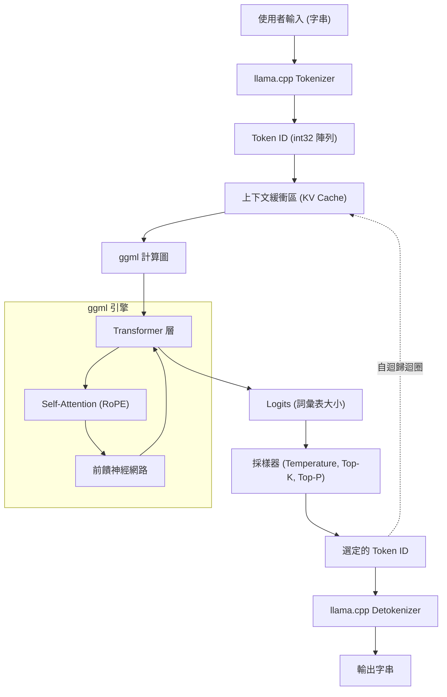

近年來，大型語言模型 (LLM) 的進化非常驚人，其應用範圍每天都在擴大。然而，要在本機環境中運行具有數十億、數百億參數的模型，通常需要配備龐大 VRAM 的高階 GPU。打破這種「硬體壁壘」，並在一般 PC、Mac 甚至 Raspberry Pi 等設備上實現 LLM 實用推理的，正是 **llama.cpp**。

本文不僅介紹單純的命令列工具用法，還將針對工程師進行極為詳細的解說，內容涵蓋其基礎技術 `ggml` 的架構、Transformer 和量化的數學背景，以及如何利用 C++ API 將 LLM 嵌入到獨立應用程式中並進行客製化。

---

## 1. llama.cpp 與 ggml 概要

`llama.cpp` 是由 Georgi Gerganov 開發，使用 C/C++ 編寫的輕量級 LLM 推理引擎。它最初是為了在 Apple Silicon (M1/M2 Mac) 上高速運行 Meta 的 LLaMA 模型而誕生的，但現在已經支援各種架構和模型。

它最大的特點是**無外部依賴的純 C/C++ 實作**。它不需要 Python 或 PyTorch 等龐大的生態系統，可以編譯為單一執行檔，因此部署非常容易。

這個 `llama.cpp` 的核心是張量運算函式庫 **ggml**。ggml 是從零開始設計的，旨在將 CPU（以及部分 GPU）上的機器學習矩陣運算優化到極致。

### 1.1 為什麼 llama.cpp 這麼快？

1. **活用記憶體映射 (mmap)**：在將模型權重載入記憶體時，透過利用作業系統的 `mmap`，可以避免全部載入 RAM，從而實現快速啟動和節省記憶體。
2. **徹底優化 SIMD 指令**：它利用了 AVX2、AVX-512、ARM NEON、Apple AMX 等 CPU 特有的指令集，實現了矩陣乘法的超高速化。
3. **量化 (Quantization)**：將 16-bit 浮點數 (FP16) 的權重壓縮為 4-bit、5-bit、8-bit 的整數，從而消除記憶體頻寬的瓶頸（詳情後述）。

---

## 2. 數學背景：Transformer 與量化 (Quantization)

為了深入理解 llama.cpp，我們需要了解它所計算的數學公式，以及它是如何對計算進行近似的。

### 2.1 Transformer 的推理過程

LLaMA 等模型採用了自迴歸型 (Auto-regressive) 的 Transformer 解碼器架構。文字生成的核心是 **Self-Attention** (自我注意力) 機制。

對於作為輸入的隱藏狀態矩陣 $X \in \mathbb{R}^{N \times d}$，查詢 $Q$、鍵 $K$、值 $V$ 都是透過與權重矩陣的乘積來計算的。

$$
Q = X W_Q, \quad K = X W_K, \quad V = X W_V
$$

在此，Attention 的輸出定義如下：

$$
\text{Attention}(Q, K, V) = \text{softmax}\left(\frac{QK^T}{\sqrt{d_k}}\right)V
$$

在 llama.cpp 的推理迴圈中，瓶頸在於這些巨大的矩陣 $W_Q, W_K, W_V$ 或前饋神經網路 (FFN) 的權重矩陣與向量 $X$（在生成階段由於每次處理一個 Token，因此 $N=1$）的乘積，也就是 **GEMV (General Matrix-Vector Multiplication)**。

### 2.2 量化 (Quantization) 的數學基礎

在記憶體存取頻寬成為瓶頸的推理中，使用較小的位元數來表示權重參數的量化是不可或缺的。在此說明 llama.cpp 中廣泛使用的區塊單位量化（例如 `Q4_K` 或 `Q4_0`）的基本原理。

舉例來說，考慮 FP16 權重矩陣 $W$ 的一部分，長度為 $B$（通常為 32 或 64）的區塊 $w = [w_1, w_2, \dots, w_B]$。我們將此區塊近似為 4-bit 整數 $q_i \in [-8, 7]$ 和單一的縮放因子 $\Delta$（FP16 或 FP32）。

$$
w_i \approx \Delta \times q_i
$$

$\Delta$ 是根據區塊內的最大絕對值決定的。

$$
\Delta = \frac{\max_i |w_i|}{7}
$$

當使用量化後的權重計算內積 $y = w \cdot x$ 時，如果將輸入向量 $x$ 也同樣量化為 $x_i \approx \Delta_x \times q_{x, i}$，則：

$$
y = \sum_{i=1}^{B} w_i x_i \approx \Delta \Delta_x \sum_{i=1}^{B} q_i q_{x, i}
$$

這個 $\sum q_i q_{x, i}$ 的部分變成了**純整數運算**，可以使用 SIMD 指令進行極為高速的平行計算。這就是 llama.cpp 能在 CPU 上達到驚人速度的數學機關。

---

## 3. 架構與推理流程

為了理解 llama.cpp 的內部運作，我們使用以下的 Mermaid 圖表來展示整體系統的架構和資料流向。



文字生成是一個自迴歸迴圈，每輸出一個 Token，它就會作為下一個輸入被加入到 KV Cache 中，然後再次通過計算圖。

---

## 4. 環境建置與編譯方法

在將 llama.cpp 嵌入到 C++ 專案之前，讓我們先嘗試編譯其原始碼。

### 4.1 複製儲存庫

```bash
git clone https://github.com/ggerganov/llama.cpp.git
cd llama.cpp
```

### 4.2 使用 CMake 進行編譯

當作為 C++ 專案嵌入到其他應用程式時，使用 CMake 是最標準的做法。透過啟用各個平台的加速器（後端），可以加快計算速度。

**僅 CPU（基本編譯）：**
```bash
mkdir build && cd build
cmake ..
cmake --build . --config Release -j 8
```

**使用 NVIDIA GPU (CUDA) 時：**
```bash
mkdir build && cd build
cmake .. -DGGML_CUDA=ON
cmake --build . --config Release -j 8
```

**使用 Apple Silicon (Metal) 時：**
```bash
mkdir build && cd build
cmake .. -DGGML_METAL=ON
cmake --build . --config Release -j 8
```

編譯成功後，會在 `build/bin/` 目錄下產生 `llama-cli` 等執行檔，以及用於後述 C++ API 連結的 `llama` 函式庫（和 `ggml` 函式庫）。

---

## 5. C++ 客製化入門：llama.cpp API 的使用

從這裡開始將解說本文的重點：如何透過 C++ 程式碼控制 llama.cpp。
如果不僅僅是使用命令列工具，而是要將 LLM 嵌入到自己的應用程式（例如遊戲引擎、桌面應用程式、嵌入式系統等），就必須直接呼叫 C++ API。

llama.cpp 主要透過名為 `llama.h` 的標頭檔提供 C 語言介面。從 C++ 呼叫時同樣使用此介面。

### 5.1 必要最少的 Include 與設定

在自己的專案中使用 llama.cpp 時，請 Include 以下內容。

```cpp
#include "llama.h"
#include <iostream>
#include <vector>
#include <string>
#include <stdexcept>

// 錯誤處理用的巨集
#define LLAMA_ASSERT(x) \
    do { \
        if (!(x)) { \
            std::cerr << "Assertion failed: " << #x << std::endl; \
            std::terminate(); \
        } \
    } while (0)
```

### 5.2 載入模型與初始化上下文

首先，載入 `.gguf` 格式的模型檔案，並分配用於推理的上下文（記憶體空間和 KV Cache）。

```cpp
int main(int argc, char ** argv) {
    if (argc < 2) {
        std::cerr << "Usage: " << argv[0] << " <model.gguf>" << std::endl;
        return 1;
    }
    std::string model_path = argv[1];

    // 1. 初始化後端（CPU/GPU 等環境設置）
    llama_backend_init();

    // 2. 獲取模型參數的預設設定
    llama_model_params model_params = llama_model_default_params();
    model_params.n_gpu_layers = 35; // 卸載到 GPU 的層數

    // 3. 載入模型
    llama_model * model = llama_load_model_from_file(model_path.c_str(), model_params);
    if (model == nullptr) {
        std::cerr << "Failed to load model" << std::endl;
        return 1;
    }

    // 4. 設定上下文參數
    llama_context_params ctx_params = llama_context_default_params();
    ctx_params.n_ctx = 2048; // 最大上下文大小 (Token 數)
    ctx_params.n_threads = 8; // 用於推理的 CPU 執行緒數

    // 5. 建立上下文
    llama_context * ctx = llama_new_context_with_model(model, ctx_params);
    if (ctx == nullptr) {
        std::cerr << "Failed to create context" << std::endl;
        llama_free_model(model);
        return 1;
    }

    std::cout << "Model and context loaded successfully!" << std::endl;
    // ... 後續的處理
```

### 5.3 提示詞的 Token 化 (Tokenization)

LLM 並不是直接理解文字，而是將其作為整數 ID（Token）的序列來處理。因此需要將輸入字串轉換為 Token。

```cpp
    std::string prompt = "Q: 日本的首都是哪裡？\nA:";
    std::vector<llama_token> tokens_list;
    tokens_list.resize(prompt.length() + 4); // 預留充裕的緩衝區大小

    // 是否在開頭加入特殊 Token（如 BOS: Begin of Sequence 等）
    bool add_special = true; 
    // 將字串轉換為 Token ID 陣列
    int n_tokens = llama_tokenize(
        model, 
        prompt.c_str(), 
        prompt.length(), 
        tokens_list.data(), 
        tokens_list.size(), 
        add_special, 
        false // parse_special
    );

    if (n_tokens < 0) {
        // 緩衝區不足時需要重新分配並重試的處理（為了簡化在此省略）
        std::cerr << "Failed to tokenize prompt" << std::endl;
        return 1;
    }
    tokens_list.resize(n_tokens);
```

### 5.4 推理迴圈與採樣

將 Token 輸入到模型中，獲取下一個 Token 的機率分佈 (Logits)，然後從中進行採樣以決定下一個 Token，如此建構一個迴圈。

```cpp
    // 要生成的最大 Token 數
    const int max_gen_tokens = 100;
    
    // 初始化批次評估用的結構體
    llama_batch batch = llama_batch_init(512, 0, 1);

    // 將提示詞的 Token 加入批次
    for (size_t i = 0; i < tokens_list.size(); i++) {
        llama_batch_add(batch, tokens_list[i], i, { 0 }, false);
    }
    // 設定僅在提示詞的最後一個 Token 輸出 Logit (預測結果)
    batch.logits[batch.n_tokens - 1] = true;

    // 初次評估（將提示詞餵給模型）
    if (llama_decode(ctx, batch) != 0) {
        std::cerr << "llama_decode() failed" << std::endl;
        return 1;
    }

    int n_cur = batch.n_tokens; // 目前的上下文長度
    int n_decode = 0;

    std::cout << "\nOutput: ";

    // 初始化採樣器上下文（Temperature, Top-K, Top-P 等設定）
    llama_sampler * smpl = llama_sampler_chain_init(llama_sampler_chain_default_params());
    llama_sampler_chain_add_top_k(smpl, 40);
    llama_sampler_chain_add_top_p(smpl, 0.9f, 1);
    llama_sampler_chain_add_temp(smpl, 0.7f);
    llama_sampler_chain_add_dist(smpl, 1234); // 種子值

    while (n_decode < max_gen_tokens) {
        // 1. 採樣：根據目前的上下文預測下一個 Token
        llama_token new_token_id = llama_sampler_sample(smpl, ctx, -1);

        // 2. 如果 Token 是 EOS (End of Sequence) 則結束迴圈
        if (llama_token_is_eog(model, new_token_id)) {
            break;
        }

        // 3. 將 Token 解碼為字串 (文字) 並顯示
        char buf[128];
        int n_chars = llama_token_to_piece(model, new_token_id, buf, sizeof(buf), 0, false);
        if (n_chars > 0) {
            std::cout << std::string(buf, n_chars) << std::flush;
        }

        // 4. 將新生成的 Token 準備為下一個批次
        llama_batch_clear(batch);
        llama_batch_add(batch, new_token_id, n_cur, { 0 }, true);

        // 5. 模型評估（更新 KV Cache 並預測下一個）
        if (llama_decode(ctx, batch) != 0) {
            std::cerr << "Failed to evaluate" << std::endl;
            break;
        }

        n_cur += 1;
        n_decode += 1;
    }

    std::cout << std::endl;

    // 清理
    llama_sampler_free(smpl);
    llama_batch_free(batch);
    llama_free(ctx);
    llama_free_model(model);
    llama_backend_free();

    return 0;
}
```

這段程式碼使用 llama.cpp 的基本 API 實作了自訂的推理迴圈。
它使用 `llama_batch` 結構體來管理 Token 群，並透過 `llama_decode` 執行神經網路的前向傳播 (Forward Pass)。

---

## 6. 進階客製化案例：透過 C++ 進行 Logit 操作與懲罰控制

如果不只是單純的文字生成，而是強制輸出特定格式（例如僅限 JSON），或是控制不輸出特定的禁止詞彙時，我們可以在 C++ 端直接操作採樣前的 **Logit (Logits)**。

可以獲取模型在輸出每個 Token 之前，原始分數（轉換為機率前的值）的陣列。

```cpp
// 在推理之後、進行採樣之前，取得原始的 Logit 陣列
float * logits = llama_get_logits_ith(ctx, batch.n_tokens - 1);
int n_vocab = llama_n_vocab(model);

// 禁止 Token 的 ID 列表（以 1234, 5678 為例）
std::vector<llama_token> forbidden_tokens = { 1234, 5678 };

// 將禁止 Token 的出現機率設為 0 (將 Logit 設為負無窮大)
for (llama_token bad_tok : forbidden_tokens) {
    logits[bad_tok] = -INFINITY;
}
```

如此一來，透過直接處理 C++ API，我們就能實現透過 LangChain 或 Python 難以做到或開銷過大的**「在每個推理週期進行微秒級的介入」**。

---

## 7. 效能調校的秘訣

在完成 C++ 實作後，這裡介紹幾個為了實際應用而將速度提升至極限的檢查點。

1. **批次處理的優化：** 當同時處理來自多個使用者的請求時，可以在 `llama_batch` 中包含多個序列，並一次呼叫 `llama_decode`（Continuous Batching）。這能讓記憶體存取共用，從而大幅提升吞吐量。
2. **啟用 Flash Attention：**
   透過在上下文參數中設定 `ctx_params.flash_attn = true;`，可以在減少記憶體使用量的同時加快 Attention 計算。在處理長上下文（數萬個 Token）時，這是必須的設定。
3. **NUMA 支援：**
   在多插槽的伺服器環境中，在 `llama_backend_init()` 之前正確設定 NUMA，可以減少記憶體存取的延遲。

---

## 8. 結語

本文從 `llama.cpp` 的數學背景開始，詳細解說了其架構，以及如何活用 C++ API 來建構自訂的推理引擎。

雖然 Python 的生態系統在製作原型時非常方便，但在部署到邊緣裝置、嵌入到遊戲或要求即時處理的正式環境中，基於 C/C++ 的 `llama.cpp` 的直接控制展現了壓倒性的優勢。

大家也務必親自動手編寫 C++ 程式碼，體驗在本機環境中自由操控 LLM 的樂趣。

> **參考連結集**
> - [llama.cpp Official Repository](https://github.com/ggerganov/llama.cpp)
> - [ggml - Tensor Library](https://github.com/ggerganov/ggml)
> - [Attention Is All You Need (Vaswani et al., 2017)](https://arxiv.org/abs/1706.03762)
