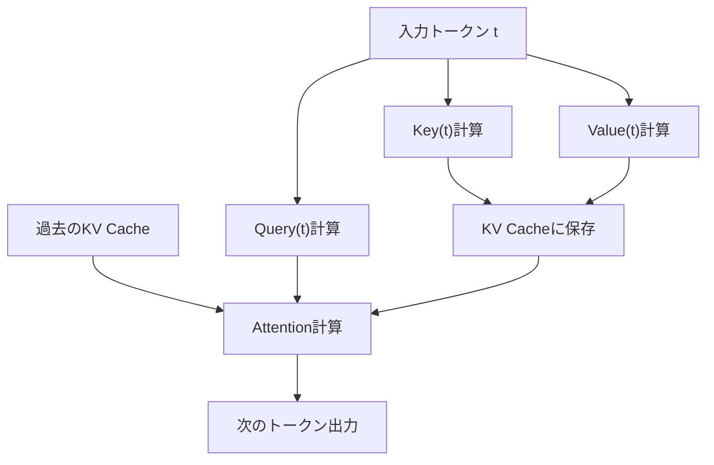
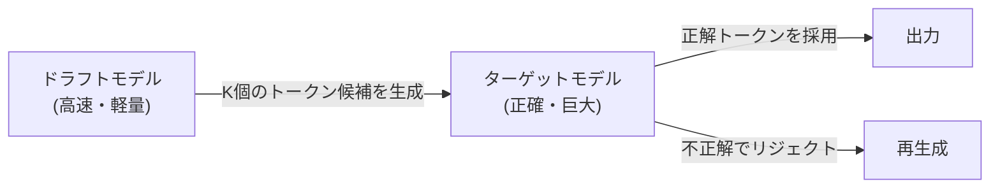

## 1. مقدمة: 'الجدار غير المرئي' في استدلال النماذج اللغوية الكبيرة (LLM)

لقد أحدث الذكاء الاصطناعي الحديث، وخاصة النماذج اللغوية الكبيرة (LLMs)، تغييراً جذرياً في تجربتنا الرقمية. ولكن عندما يحاول المطورون تشغيل النماذج الضخمة التي تعمل خلف ChatGPT أو Claude على بنيتهم التحتية الخاصة أو حواسيبهم المحلية، فإنهم يواجهون جداراً عالياً يتمثل في "بطء سرعة الاستدلال".

لماذا يعتبر استدلال LLM بطيئاً؟ يعتقد الكثيرون غالباً أنه "نحتاج إلى وحدة معالجة رسوميات (GPU) لأن القدرة الحسابية (FLOPS) غير كافية"، ولكن في الواقع، خلال مرحلة الاستدلال، خاصة عند توليد النصوص بحجم دفعة (batch size) يبلغ 1 (أو حجم صغير)، فإن **النطاق الترددي للذاكرة (Memory Bandwidth) هو عنق الزجاجة، وليس القدرة الحسابية**.

في هذا المقال، سنكشف عن حقيقة "جدار النطاق الترددي للذاكرة" في استدلال LLM، وسنتعمق في شرح آليات أحدث التقنيات للتغلب عليه، وهي **ذاكرة التخزين المؤقت KV (Key-Value Cache)**، و**PagedAttention**، و**فك التشفير التكهني (Speculative Decoding)**، و**التكميم (Quantization)**، من كل من الجانبين العتادي (الأجهزة) والبرمجي.

---

## 2. التوليد الانحداري الذاتي في Transformer وعنق الزجاجة الحسابي

### 2.1 آلية الانحدار الذاتي (Autoregressive)
تستخدم نماذج وحدة فك التشفير (Decoder) القائمة على بنية محول (Transformer)، والتي تعد التيار الرئيسي في LLMs، طريقة تسمى "الانحدار الذاتي" لتوليد النصوص. إنها عملية يتم فيها التنبؤ بالرمز (Token) الواحد التالي بناءً على جميع الرموز السابقة.

إذا تم التعبير عن ذلك رياضياً، فإن احتمال الرمز $x_t$ في خطوة معينة $t$ يتم حسابه على النحو التالي:
$P(x_t | x_1, x_2, ..., x_{t-1})$

هذه العملية متسلسلة ولا يمكن موازاتها. من أجل إجراء العمليات الحسابية للخطوة $t+1، يجب أن يكون الرمز المولد في الخطوة $t$ قد تم تحديده مسبقاً.

### 2.2 المرحلتان في وقت الاستدلال
ينقسم الاستدلال بشكل أساسي إلى المرحلتين التاليتين:

1. **مرحلة التعبئة المسبقة (Prefill)**: 
   هي المرحلة التي يتم فيها معالجة الموجه (Prompt) المُدخل بالكامل دفعة واحدة وبناء الحالة الأولية. هنا يمكن إجراء الحسابات بالتوازي، وبما أنه يمكن الاستفادة من القدرة الحسابية (FLOPS) لوحدة معالجة الرسوميات (GPU) بالكامل، فإنها تصبح **مقيدة بالقدرة الحسابية (Compute-bound)**.
2. **مرحلة فك التشفير (Decode)**: 
   هي المرحلة التي يتم فيها توليد الرموز واحداً تلو الآخر بعد اكتمال التعبئة المسبقة. هذه هي عملية الانحدار الذاتي، وفي كل مرة يتم فيها توليد رمز جديد، يجب قراءة أوزان النموذج بأكمله من الذاكرة. ولذلك، تصبح **مقيدة بالنطاق الترددي للذاكرة (Memory-bound)**.

### 2.3 جدار النطاق الترددي للذاكرة (Memory Bandwidth Wall)
على سبيل المثال، عند تشغيل نموذج بعدد معلمات (Parameters) يبلغ 70B (70 مليار) باستخدام تنسيق FP16 (أرقام الفاصلة العائمة بـ 16 بت)، فإن حجم بيانات أوزان النموذج سيكون حوالي 140 جيجابايت. في كل مرة يتم فيها توليد رمز واحد، يجب نقل هذه الـ 140 جيجابايت من البيانات من ذاكرة HBM (ذاكرة النطاق الترددي العالي) الخاصة بـ GPU إلى وحدة الحساب (SRAM/Core).

حتى لو افترضنا أن النطاق الترددي لذاكرة GPU هو 2 تيرابايت/ثانية، فإن نقل 140 جيجابايت سيستغرق $140 / 2000 = 0.07$ ثانية. بمعنى آخر، مهما كانت سرعة العمليات الحسابية، فهناك حد فيزيائي يمنع توليد أكثر من حوالي 14 رمزاً في الثانية كحد أقصى. هذا هو "جدار النطاق الترددي للذاكرة".

---

## 3. أساسيات التخزين المؤقت KV (Key-Value Cache)

### 3.1 منع إعادة الحساب في آلية الانتباه (Attention)
في التوليد الانحداري الذاتي، من غير الفعال للغاية إعادة حساب الانتباه (Attention) لجميع الرموز السابقة في كل خطوة.

في حساب الانتباه، يتم تحويل كل رمز إلى متجهات تمثل **الاستعلام (Query - Q)**، و**المفتاح (Key - K)**، و**القيمة (Value - V)**.
عند توليد رمز جديد $x_t$، تكون قيم K و V للرموز السابقة (من $x_1$ إلى $x_{t-1}$) قد تم حسابها بالفعل وهي ثابتة لا تتغير.

لذلك، تم ابتكار طريقة تعتمد على حفظ (تخزين مؤقت) قيم K و V للرموز السابقة في ذاكرة GPU، واستخدام Q للرمز الجديد مع K و V المخزنة مؤقتاً فقط لحساب الانتباه. هذا ما يسمى بـ **التخزين المؤقت KV (Key-Value Cache)**.

### 3.2 مشكلة استهلاك الذاكرة في التخزين المؤقت KV
يقلل التخزين المؤقت KV من كمية الحسابات بشكل كبير، ولكنه يستهلك قدراً هائلاً من الذاكرة في المقابل.
عندما يزداد حجم الدفعة (batch size) أو يطول طول السياق (طول التسلسل)، يزداد حجم التخزين المؤقت KV خطياً، وسرعان ما يشغل عشرات الجيجابايت من الذاكرة.

إذا وضعنا ذلك في معادلة، سيكون حجم التخزين المؤقت KV كالتالي:
`كمية الذاكرة = 2 (K و V) * حجم الدفعة * طول التسلسل * عدد الطبقات * عدد الرؤوس * أبعاد الرأس * عدد البايتات`

تشكل كيفية إدارة ذاكرة التخزين المؤقت الضخمة هذه التحدي الأكبر لخوادم استدلال LLM.

---

## 4. ابتكار إدارة الذاكرة بواسطة PagedAttention

في محركات الاستدلال التقليدية، كان يتم تخصيص مساحة ذاكرة ضخمة ومستمرة مسبقاً من أجل التخزين المؤقت KV. ومع ذلك، نظراً لأن طول النص المولد غير متوقع، تحدث **تجزئة داخلية للذاكرة (Internal Fragmentation)** و**تجزئة خارجية (External Fragmentation)**، مما يؤدي إلى إهدار ما يصل إلى 60% إلى 80% من الذاكرة.

### 4.1 التعلم من الذاكرة الافتراضية في أنظمة التشغيل (OS)
الذي حل هذه المشكلة هو **PagedAttention**، والذي تم تنفيذه في مكتبة `vLLM` التي طورها فريق بحث في جامعة كاليفورنيا في بيركلي (UC Berkeley). هذا النهج يطبق مفهوم "الترحيل" (Paging) الموجود في الذاكرة الافتراضية لأنظمة التشغيل على إدارة التخزين المؤقت KV.

في PagedAttention، يتم تقسيم التخزين المؤقت KV إلى "كتل" ذات حجم ثابت، ويتم توزيعها ووضعها في مساحات ذاكرة فعلية غير متجاورة. يتم التعامل معها على أنها كتل متجاورة افتراضياً، وتتم إدارة التعيين (Mapping) من الكتل المنطقية إلى الكتل الفعلية باستخدام جدول الكتل (Block Table).

### 4.2 مزايا PagedAttention
- **القضاء على إهدار الذاكرة**: نظراً لأنه يتم تخصيص الكتل حسب الحاجة فقط، يتم تقليل التجزئة الداخلية إلى ما يقرب من الصفر (أقل من نسبة مئوية قليلة).
- **التجميع الفعال (Batching)**: يسمح بحشر المزيد من الطلبات في ذاكرة محدودة، مما يحسن من إنتاجية (Throughput) النظام بأكمله بشكل كبير.
- **مشاركة الذاكرة**: في تقنيات فك التشفير مثل بحث الشعاع (Beam Search)، يصبح من الممكن مشاركة التخزين المؤقت KV بشكل آمن (النسخ عند الكتابة - Copy-on-Write) بين تسلسلات متعددة مشتقة من نفس الموجه.

---

## 5. فك التشفير التكهني (Speculative Decoding): نقلة نوعية نحو الموازاة

يساهم تحسين التخزين المؤقت KV في تحسين الذاكرة والإنتاجية، لكنه لا يحسن **زمن الوصول (Latency)** بشكل جذري عندما يكون حجم الدفعة 1. الخوارزمية المبتكرة لتجاوز "جدار النطاق الترددي للذاكرة" المذكور سابقاً هي **فك التشفير التكهني (Speculative Decoding)**.

### 5.1 إعادة التأكيد على سبب البطء
عند تشغيل نموذج ضخم (النموذج المستهدف)، تكون قراءة الأوزان من الذاكرة بطيئة. من ناحية أخرى، إذا كان النموذج صغيراً (نموذج المسودة - Draft Model)، فإن قراءة الأوزان تنتهي في لحظة.

### 5.2 آلية فك التشفير التكهني
يجمع فك التشفير التكهني بين خطوتين: "التخمين (Drafting)" و "التحقق (Verification)".

1. **مرحلة التخمين (Drafting)**:
   يتم استخدام نموذج مسودة صغير وسريع (مثال: بضعة مليارات من المعلمات) للتنبؤ بسرعة بـ $K$ من الرموز المستقبلية بشكل انحداري ذاتي.
   مثال: "عاصمة" "اليابان" "هي" "طوكيو"

2. **مرحلة التحقق (Verification)**:
   يتم تمرير الرموز الـ $K$ المخمنة إلى النموذج المستهدف دفعة واحدة. يقوم النموذج المستهدف بتقييم ذلك في تمريرة أمامية (Forward pass) واحدة (حساب متوازي) والتحقق مما إذا كان كل رمز صحيحاً.
   - إذا كان التخمين صحيحاً حتى "طوكيو" وكان الرمز الذي يليه خاطئاً، يتم إعادة التخمين مرة أخرى من النقطة التي حدث فيها الخطأ.

### 5.3 ضمان الدقة الرياضية
المثير للدهشة هو أن فك التشفير التكهني يضمن **توزيع احتمالات مخرجات متطابق رياضياً تماماً** مع ما لو تم استخدام التوليد الانحداري الذاتي بواسطة النموذج المستهدف وحده. إنها ليست خوارزمية تقريبية. من خلال تطبيق تقنية أخذ العينات بالرفض (Rejection Sampling)، فهي تقنية رائدة يمكنها زيادة السرعة بمقدار الضعف إلى 3 أضعاف دون أي تدهور في الجودة على الإطلاق.

---

## 6. التكميم (Quantization) وصعود نماذج LLM المحلية

هناك نهج قوي آخر لكسر جدار النطاق الترددي للذاكرة، وهو **التكميم (Quantization)**، والذي يقلل من حجم أوزان النموذج نفسه. إذا انخفض حجم الأوزان إلى النصف، فإن وقت القراءة من الذاكرة ينخفض أيضاً إلى النصف، مما يؤدي إلى تحسين سرعة الاستدلال.

### 6.1 مكتبة llama.cpp وتنسيقات GGML/GGUF
الشرارة التي أطلقت حركة تشغيل LLMs محلياً كانت `llama.cpp`. هذه المكتبة المكتوبة بلغة C/C++، تجعل نماذج LLM تعمل بسرعات مذهلة على أجهزة Mac المزودة بسلسلة شرائح Apple M، وكذلك على وحدات المعالجة المركزية (CPU) والرسومية (GPU) العامة.

في صميم ذلك يوجد تنسيق يسمى `GGUF` (المعروف سابقاً باسم GGML) وتقنية التكميم.
حيث تقوم بضغط الأوزان التي تُمثل عادةً بـ 16 بت (FP16/BF16) إلى أعداد صحيحة بـ 4 بت أو 8 بت (INT4/INT8).

### 6.2 خوارزميات التكميم المتقدمة
نظراً لأن التقريب البسيط (Rounding) يؤدي إلى تدهور دقة النموذج بشكل كبير، يتم استخدام التقنيات المتقدمة التالية:

- **GPTQ**: هي طريقة تستخدم معلومات المشتقة الثانية (مصفوفة هسيان - Hessian matrix) عند تكميم أوزان النموذج لتعويض خطأ التكميم بحيث يكون التأثير على الدقة في حده الأدنى.
- **AWQ (التكميم المدرك للتنشيط)**: لا يأخذ في الاعتبار توزيع الأوزان نفسها فحسب، بل يأخذ أيضاً في الاعتبار توزيع "التنشيط" (Activations) أثناء الاستدلال الفعلي. يتم الاحتفاظ بعدد قليل من الأوزان المهمة (حوالي 1% من الإجمالي) بدقة عالية، ويتم تكميم الباقي بشدة، مما يمنع تدهور الجودة.
- **ExLlamaV2**: هو إصدار أسرع من GPTQ يدعم معدلات البت المتغيرة (على سبيل المثال: متوسط 4.5 بت)، ويخصص عدد البتات بناءً على أهمية الطبقة.

---

## 7. الخلاصة والآفاق المستقبلية

تطور استدلال النماذج اللغوية الكبيرة (LLM) من الصورة البسيطة المتمثلة في "عمليات مصفوفات ضخمة" إلى **"هندسة نظم تعمل على تحسين النطاق الترددي للذاكرة إلى أقصى حد"**.

- **التخزين المؤقت KV** يزيل الهدر في العمليات الحسابية،
- **PagedAttention** يزيل الهدر في مساحة الذاكرة،
- **فك التشفير التكهني** يتجاوز حاجز المعالجة المتسلسلة ليجلب الموازاة،
- **التكميم** يقلل من حجم حركة البيانات المادية.

هذه التقنيات ليست مستقلة، بل تُستخدم معاً. على سبيل المثال، من خلال استخدام PagedAttention على النماذج المكممة ودمجها مع فك التشفير التكهني، وصلنا إلى عصر حيث النماذج التي كانت تتطلب أجهزة كمبيوتر عملاقة في الماضي تعمل الآن في الوقت الفعلي على أجهزة الكمبيوتر المكتبية الشخصية والأجهزة الطرفية (Edge devices).

في المستقبل، مع صعود بنى معمارية جديدة بديلة لـ Transformer (نماذج فضاء الحالة الشبيهة بـ RNN) مثل Mamba و RWKV، من الممكن أن نرى مستقبلاً تنتفي فيه الحاجة إلى التخزين المؤقت KV تماماً، أو يتطلب أشكالاً جديدة كلياً من إدارة الذاكرة. سيظل هذا المجال، الذي تتقاطع فيه تطورات الأجهزة وابتكارات الخوارزميات، محط أنظارنا ولن نرفع أعيننا عنه.
