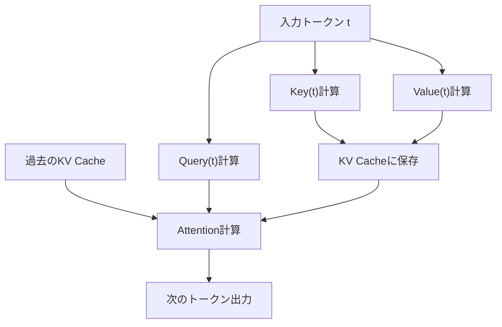
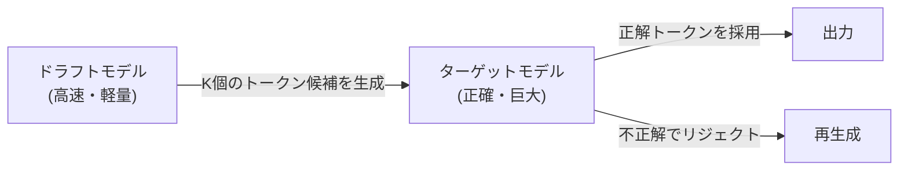

## 1. Einführung: Die 'unsichtbare Wand' bei der LLM-Inferenz

Moderne KI, insbesondere Large Language Models (LLMs), haben unsere digitale Erfahrung grundlegend verändert. Wenn jedoch viele Entwickler versuchen, die riesigen Modelle, die hinter ChatGPT oder Claude laufen, auf ihrer eigenen Infrastruktur oder lokalen PCs auszuführen, stehen sie vor der hohen Wand der 'langsamen Inferenzgeschwindigkeit'.

Warum ist die LLM-Inferenz langsam? Viele Menschen neigen zu der Annahme, dass 'eine GPU erforderlich ist, weil die Rechenleistung (FLOPS) nicht ausreicht'. Aber tatsächlich ist in der Inferenzphase, insbesondere bei der Textgenerierung mit einer Batch-Größe von 1 (oder klein), **nicht die Rechenleistung, sondern die Speicherbandbreite (Memory Bandwidth) der Engpass**.

In diesem Artikel werden wir das wahre Gesicht dieser 'Speicherbandbreiten-Wand' bei der LLM-Inferenz enthüllen und die Mechanismen modernster Technologien zu deren Überwindung - **KV-Cache (Key-Value Cache)**, **PagedAttention**, **spekulative Dekodierung (Speculative Decoding)** und **Quantisierung (Quantization)** - sowohl aus Hardware- als auch aus Softwareperspektive tiefgreifend erklären.

---

## 2. Autoregressive Generierung von Transformern und Rechenengpässe

### 2.1 Wie die Autoregression funktioniert
Transformer-basierte Decoder-Modelle, der Mainstream der LLMs, generieren Text durch eine Methode namens 'Autoregression'. Dies ist der Prozess, bei dem der nächste einzelne Token aus allen vorherigen Token vorhergesagt wird.

Mathematisch ausgedrückt wird die Wahrscheinlichkeit eines Tokens $x_t$ in einem bestimmten Schritt $t$ wie folgt berechnet:
$P(x_t | x_1, x_2, ..., x_{t-1})$

Dieser Prozess ist sequentiell und kann nicht parallelisiert werden. Um die Berechnung für Schritt $t+1$ durchzuführen, muss der in Schritt $t$ generierte Token festgelegt sein.

### 2.2 Zwei Phasen während der Inferenz
Die Inferenz lässt sich grob in die folgenden zwei Phasen unterteilen:

1. **Prefill-Phase**: 
   Eine Phase, in der der gesamte eingegebene Prompt auf einmal verarbeitet und der Anfangszustand erstellt wird. Da hier parallele Berechnungen möglich sind und die Rechenleistung (FLOPS) der GPU voll ausgenutzt werden kann, ist sie **Compute-bound (rechenbegrenzt)**.
2. **Decode-Phase**: 
   Die Phase, in der Token nach Abschluss des Prefills einzeln generiert werden. Dies ist der autoregressive Prozess, und jedes Mal, wenn ein neuer Token generiert wird, müssen die Gewichte des gesamten Modells aus dem Speicher gelesen werden. Daher ist sie **Memory-bound (speicherbandbreitenbegrenzt)**.

### 2.3 Die Wand der Speicherbandbreite (Memory Bandwidth Wall)
Wenn man beispielsweise ein Modell mit 70B (70 Milliarden) Parametern in FP16 (16-Bit-Gleitkomma) betreibt, betragen die Gewichtsdaten des Modells etwa 140 GB. Jedes Mal, wenn ein Token generiert wird, müssen diese 140 GB Daten vom HBM (High Bandwidth Memory) der GPU zur Recheneinheit (SRAM/Core) übertragen werden.

Selbst wenn die Speicherbandbreite der GPU 2 TB/s betragen würde, würde die Übertragung von 140 GB $140 / 2000 = 0,07$ Sekunden dauern. Mit anderen Worten, egal wie schnell die Berechnung ist, es gibt eine physikalische Grenze von maximal etwa 14 generierten Token pro Sekunde. Dies ist die 'Speicherbandbreiten-Wand'.

---

## 3. Grundlagen des KV-Cache (Key-Value Cache)

### 3.1 Neuberechnung des Attention-Mechanismus verhindern
Bei der autoregressiven Generierung ist es sehr ineffizient, die Attention (Aufmerksamkeit) für alle vergangenen Token in jedem Schritt neu zu berechnen.

Bei der Attention-Berechnung wird jeder Token in Vektoren für **Query (Q)**, **Key (K)** und **Value (V)** umgewandelt.
Wenn ein neuer Token $x_t$ generiert wird, sind K und V der vergangenen Token ($x_1$ bis $x_{t-1}$) bereits berechnet und unveränderlich.

Daher wurde eine Methode entwickelt, bei der K und V der vergangenen Token im Speicher der GPU gespeichert (gecached) werden und die Attention nur mit dem Q des neuen Tokens und den gecachten K und V berechnet wird. Dies ist der **KV-Cache (Key-Value Cache)**.

### 3.2 Das Speicherverbrauchsproblem des KV-Caches
Der KV-Cache reduziert den Rechenaufwand drastisch, verbraucht aber im Gegenzug enorm viel Speicher.
Wenn die Batch-Größe zunimmt oder die Kontextlänge (Sequenzlänge) länger wird, wächst die Größe des KV-Caches linear und belegt schnell zig Gigabyte an Speicher.

Als Formel ausgedrückt, sieht die Größe des KV-Caches wie folgt aus:
`Speichermenge = 2 (K und V) * Batch-Größe * Sequenzlänge * Anzahl der Schichten * Anzahl der Heads * Dimension der Heads * Anzahl der Bytes`

Wie man diesen riesigen Cache verwaltet, ist die größte Herausforderung für LLM-Inferenzserver.

---

## 4. Innovation in der Speicherverwaltung durch PagedAttention

Bei herkömmlichen Inferenz-Engines wurde im Voraus ein zusammenhängender, riesiger Speicherbereich für den KV-Cache reserviert. Da die Länge des generierten Textes jedoch unvorhersehbar ist, traten **interne Fragmentierung (Internal Fragmentation)** und **externe Fragmentierung (External Fragmentation)** des Speichers auf, wodurch bis zu 60% bis 80% des Speichers verschwendet wurden.

### 4.1 Vom virtuellen Speicher des Betriebssystems lernen
Dieses Problem wurde durch **PagedAttention** gelöst, das in `vLLM` implementiert ist, welches von einem Forschungsteam der UC Berkeley entwickelt wurde. Dabei wird das Konzept des 'Paging' aus dem virtuellen Speicher von Betriebssystemen auf die Verwaltung des KV-Caches angewendet.

Bei PagedAttention wird der KV-Cache in 'Blöcke' fester Größe unterteilt und über nicht zusammenhängende physische Speicherbereiche verteilt. Es wird logisch als fortlaufende Blöcke behandelt, und die Zuordnung von logischen Blöcken zu physischen Blöcken wird über eine Blocktabelle verwaltet.

### 4.2 Vorteile von PagedAttention
- **Beseitigung von Speicherverschwendung**: Da Blöcke nur nach Bedarf zugewiesen werden, wird die interne Fragmentierung auf fast null (weniger als wenige Prozent) reduziert.
- **Effizientes Batching**: Mehr Anfragen können in den begrenzten Speicher gepackt werden, was den Durchsatz des gesamten Systems dramatisch verbessert.
- **Speicherfreigabe**: Bei Dekodierungsmethoden wie Beam Search wird es möglich, den KV-Cache sicher zwischen mehreren Sequenzen, die vom selben Prompt abgeleitet sind, zu teilen (Copy-on-Write).

---

## 5. Spekulative Dekodierung (Speculative Decoding): Ein Paradigmenwechsel zur Parallelisierung

Obwohl die Optimierung des KV-Caches zur Verbesserung von Speicher und Durchsatz beiträgt, verbessert sie nicht grundlegend die **Latenz (Verzögerung)**, wenn die Batch-Größe 1 ist. Ein innovativer Algorithmus zur Überwindung der oben genannten 'Speicherbandbreiten-Wand' ist die **spekulative Dekodierung (Speculative Decoding)**.

### 5.1 Nochmalige Überprüfung, warum es langsam ist
Beim Ausführen eines riesigen Modells (Zielmodell) ist das Lesen der Gewichte aus dem Speicher langsam. Andererseits ist das Laden der Gewichte bei einem kleinen Modell (Entwurfsmodell) in einem Augenblick erledigt.

### 5.2 Wie spekulative Dekodierung funktioniert
Spekulative Dekodierung kombiniert zwei Schritte: 'Entwerfen (Drafting)' und 'Verifizieren (Verification)'.

1. **Entwurfsphase (Drafting)**:
   Ein kleines und schnelles Entwurfsmodell (z. B. Milliarden von Parametern) wird verwendet, um autoregressiv und schnell zukünftige $K$ Token vorherzusagen.
   Beispiel: "Japans" "Hauptstadt" "ist" "Tokio" "."

2. **Verifizierungsphase (Verification)**:
   Die vorhergesagten $K$ Token werden auf einmal an das Zielmodell übergeben. Das Zielmodell bewertet diese in einem einzigen Forward-Pass (parallele Berechnung) und verifiziert, ob jeder Token korrekt ist.
   - Wenn es bis "Tokio" richtig war und das nächste Wort falsch war, wird die Vorhersage ab der falschen Stelle neu gestartet.

### 5.3 Garantie der mathematischen Korrektheit
Erstaunlicherweise garantiert die spekulative Dekodierung **mathematisch exakt dieselbe Ausgabewahrscheinlichkeitsverteilung** wie die autoregressive Generierung mit dem Zielmodell allein. Es ist kein Näherungsalgorithmus. Durch die Anwendung der Rejection-Sampling-Technologie (Rejection Sampling) ist es eine bahnbrechende Technologie, die die Geschwindigkeit um das 2- bis 3-fache erhöhen kann, ohne die Qualität in irgendeiner Weise zu beeinträchtigen.

---

## 6. Quantisierung (Quantization) und der Aufstieg von lokalen LLMs

Ein weiterer starker Ansatz, um die Wand der Speicherbandbreite zu durchbrechen, ist die **Quantisierung (Quantization)**, die die Größe der Modellgewichte selbst verringert. Wenn die Größe der Gewichte halbiert wird, halbiert sich auch die Lesezeit aus dem Speicher, was die Inferenzgeschwindigkeit verbessert.

### 6.1 llama.cpp und GGML/GGUF
Der Auslöser für die Bewegung, LLMs lokal auszuführen, war `llama.cpp`. Diese in C/C++ geschriebene Bibliothek führt LLMs mit erstaunlicher Geschwindigkeit auf Macs der Apple M-Serie und gängigen CPUs/GPUs aus.

Im Zentrum davon stehen das Format `GGUF` (früher GGML) und die Quantisierungstechnologie.
Gewichte, die normalerweise in 16-Bit (FP16/BF16) dargestellt werden, werden in 4-Bit- oder 8-Bit-Ganzzahlen (INT4/INT8) komprimiert.

### 6.2 Fortgeschrittene Quantisierungsalgorithmen
Da ein einfaches Runden die Genauigkeit des Modells stark verschlechtern würde, werden fortschrittliche Technologien wie die folgenden eingesetzt:

- **GPTQ**: Eine Methode, die bei der Quantisierung der Modellgewichte Informationen der zweiten Ableitung (Hesse-Matrix) verwendet, um den Quantisierungsfehler so zu korrigieren, dass die Auswirkungen auf die Genauigkeit minimiert werden.
- **AWQ (Activation-aware Weight Quantization)**: Berücksichtigt nicht nur die Verteilung der Gewichte selbst, sondern auch die Verteilung der 'Aktivierungen (Activations)' während der tatsächlichen Inferenz. Einige wenige wichtige Gewichte (etwa 1% der Gesamtzahl) werden in hoher Genauigkeit belassen, und der Rest wird stark quantisiert, um eine Qualitätsverschlechterung zu verhindern.
- **ExLlamaV2**: Eine noch schnellere Version von GPTQ, die variable Bitraten (z.B. durchschnittlich 4,5 Bit) unterstützt und die Anzahl der Bits entsprechend der Wichtigkeit der Schicht zuweist.

---

## 7. Zusammenfassung und Zukunftsaussichten

Die LLM-Inferenz hat sich von der simplen Vorstellung 'riesiger Matrixoperationen' zu einer **'Systemtechnik zur extremen Optimierung der Speicherbandbreite'** entwickelt.

- **KV-Cache** eliminiert Rechenverschwendung,
- **PagedAttention** eliminiert Verschwendung von Speicherplatz,
- **Spekulative Dekodierung** überwindet die Wand der sequentiellen Verarbeitung und bringt Parallelisierung,
- **Quantisierung** hat die physikalische Datenübertragungsmenge reduziert.

Diese Technologien sind nicht unabhängig voneinander, sondern werden in Kombination verwendet. Durch die Anwendung von PagedAttention auf ein quantisiertes Modell und die zusätzliche Kombination mit spekulativer Dekodierung ist eine Ära angebrochen, in der Modelle, für die früher Supercomputer erforderlich waren, in Echtzeit auf persönlichen Desktop-PCs und Edge-Geräten laufen.

In Zukunft, mit dem Aufstieg neuer Architekturen, die Transformer ersetzen (RNN-ähnliche Zustandsraummodelle), wie Mamba und RWKV, ist auch eine Zukunft denkbar, in der der KV-Cache selbst unnötig wird oder eine völlig neue Form der Speicherverwaltung erforderlich ist. Wir müssen diesen Bereich, in dem Hardware-Evolution und algorithmische Innovation zusammentreffen, im Auge behalten.
