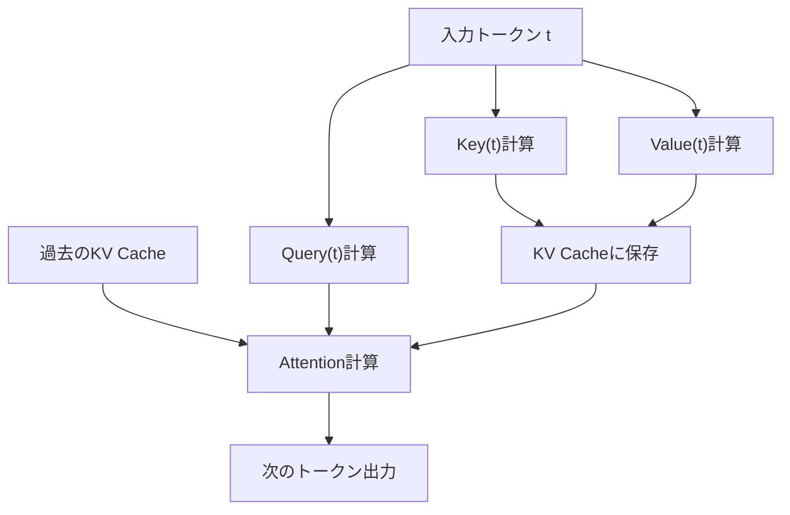
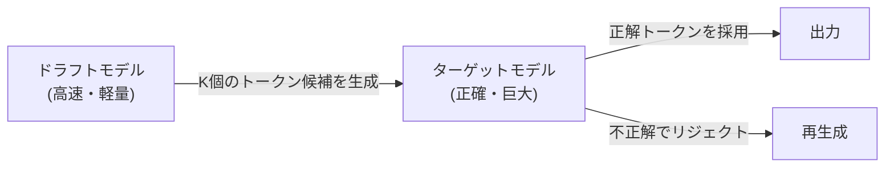

## 1. Introduction: The "Invisible Wall" in LLM Inference

Modern AI, especially Large Language Models (LLMs), has fundamentally transformed our digital experiences. However, when many developers try to run the massive models operating behind ChatGPT and Claude on their own infrastructure or local PCs, they face a high wall of "slow inference speed."

Why is LLM inference slow? Many people tend to think that "a GPU is necessary because there is not enough computing power (FLOPS)," but in reality, during the inference phase, especially in text generation with a batch size of 1 (or small), **the bottleneck is not computing capacity but memory bandwidth (Memory Bandwidth).**

In this article, we will unravel the true nature of this "memory bandwidth wall" in LLM inference, and deeply explore the mechanisms of cutting-edge technologies to overcome it—such as **KV Cache (Key-Value Cache)**, **PagedAttention**, **Speculative Decoding**, and **Quantization**—from both hardware and software perspectives.

---

## 2. Autoregressive Generation of Transformers and Computational Bottlenecks

### 2.1 How Autoregressive Works
The Transformer-based decoder models, which are the mainstream of LLMs, generate text using a method called "autoregressive." This is a process of predicting the next single token from all past tokens.

Expressed in a formula, the probability of token $x_t$ at a certain step $t$ is calculated as follows:
$P(x_t | x_1, x_2, ..., x_{t-1})$

This process is sequential and cannot be parallelized. In order to calculate step $t+1$, the token generated at step $t$ must be determined.

### 2.2 Two Phases of Inference
Inference is broadly divided into the following two phases.

1. **Prefill Phase**: 
   A phase where the entire input prompt is processed at once to build the initial state. Since parallel computation is possible here and the computing power (FLOPS) of the GPU can be fully utilized, it becomes **Compute-bound**.
2. **Decode Phase**: 
   A phase where tokens are generated one by one after the prefill is completed. This is the autoregressive process, and the entire model's weights must be read from memory every time a new token is generated. Therefore, it becomes **Memory-bound**.

### 2.3 The Memory Bandwidth Wall
For example, when running a model with 70B (70 billion) parameters in FP16 (16-bit floating point), the model's weight data will be approximately 140GB. Every time one token is generated, this 140GB of data must be transferred from the GPU's HBM (High Bandwidth Memory) to the compute units (SRAM/Core).

Even if the GPU's memory bandwidth is 2TB/s, transferring 140GB takes $140 / 2000 = 0.07$ seconds. That is, no matter how fast the computation is, there is a physical limit that only about 14 tokens per second can be generated at most. This is the "memory bandwidth wall."

---

## 3. Basics of KV Cache (Key-Value Cache)

### 3.1 Preventing Recalculation of the Attention Mechanism
In autoregressive generation, recalculating the Attention for all past tokens at each step is extremely inefficient.

In Attention calculation, each token is transformed into vectors of **Query (Q)**, **Key (K)**, and **Value (V)**.
When generating a new token $x_t$, the K and V of the past tokens ($x_1$ to $x_{t-1}$) have already been calculated and are invariable.

Therefore, a method was devised to save (cache) the K and V of past tokens in the GPU's memory, and calculate Attention using only the Q of the new token and the cached K, V. This is the **KV Cache (Key-Value Cache)**.

### 3.2 The Memory Consumption Problem of KV Cache
While the KV cache significantly reduces computational complexity, it consumes massive amounts of memory in return.
As the batch size increases or the context length (sequence length) becomes longer, the size of the KV cache increases linearly, quickly occupying tens of GBs of memory.

Expressed as a formula, the size of the KV cache is as follows:
`Memory Amount = 2 (K and V) * Batch Size * Sequence Length * Number of Layers * Number of Heads * Head Dimension * Number of Bytes`

How to manage this massive cache becomes the biggest challenge for LLM inference servers.

---

## 4. Innovation in Memory Management by PagedAttention

In conventional inference engines, huge contiguous memory areas were allocated in advance for the KV cache. However, since the length of the generated text is unpredictable, **Internal Fragmentation** and **External Fragmentation** of memory occurred, resulting in up to 60% to 80% of memory being wasted.

### 4.1 Learning from OS Virtual Memory
The solution to this problem is **PagedAttention**, implemented in `vLLM` developed by a research team at UC Berkeley. This applies the concept of "paging" in OS virtual memory to KV cache management.

In PagedAttention, the KV cache is divided into fixed-size "blocks" and distributed across non-contiguous physical memory spaces. They are treated virtually as contiguous blocks, and the mapping from logical blocks to physical blocks is managed by a block table.

### 4.2 Benefits of PagedAttention
- **Eliminating Memory Waste**: Since blocks are allocated only as needed, internal fragmentation is kept to almost zero (less than a few percent).
- **Efficient Batching**: More requests can be packed into limited memory, dramatically improving overall system throughput.
- **Memory Sharing**: In decoding methods like Beam Search, the KV cache can be safely shared (Copy-on-Write) among multiple sequences derived from the same prompt.

---

## 5. Speculative Decoding: A Paradigm Shift Towards Parallelization

While optimizing the KV cache contributes to improvements in memory and throughput, it does not fundamentally improve the **latency** when the batch size is 1. The innovative algorithm to overcome the aforementioned "memory bandwidth wall" is **Speculative Decoding**.

### 5.1 Reconfirming Why It Is Slow
When running a huge model (target model), reading the weights from memory is slow. On the other hand, for a small model (draft model), reading the weights finishes in an instant.

### 5.2 How Speculative Decoding Works
Speculative Decoding combines two steps: "Drafting" and "Verification".

1. **Drafting Phase**:
   Using a small and fast draft model (e.g., billions of parameters), it rapidly predicts the next $K$ tokens in the future autoregressively.
   Example: "Japan's", "capital", "is", "Tokyo", "."

2. **Verification Phase**:
   The $K$ speculated tokens are passed to the target model all at once. The target model evaluates this in a single Forward pass (parallel computation) and verifies whether each token is correct.
   - If it is correct up to "Tokyo" but "is" was wrong, the speculation is redone from the incorrect part.

### 5.3 Guarantee of Mathematical Exactness
Surprisingly, speculative decoding guarantees **the exact same output probability distribution mathematically** as when autoregressive generation is performed with the target model alone. It is not an approximation algorithm. By applying the technique of Rejection Sampling, it is a groundbreaking technology that can increase speed by 2 to 3 times without degrading quality at all.

---

## 6. Quantization and the Rise of Local LLMs

Another powerful approach to breaking down the memory bandwidth wall is **Quantization**, which reduces the size of the model's weights themselves. If the weight size is halved, the memory read time is also halved, improving inference speed.

### 6.1 llama.cpp and GGML/GGUF
The catalyst for the movement to run LLMs locally was `llama.cpp`. This library, implemented in C/C++, runs LLMs at astonishing speeds on Apple M-series Macs and general CPUs/GPUs.

At its core is the format and quantization technology called `GGUF` (formerly GGML).
Weights typically represented in 16-bit (FP16/BF16) are compressed into 4-bit or 8-bit integers (INT4/INT8).

### 6.2 Advanced Quantization Algorithms
Since simple rounding significantly degrades the model's accuracy, advanced technologies such as the following are used.

- **GPTQ**: A method that corrects quantization errors to minimize the impact on accuracy by utilizing second-order derivative (Hessian matrix) information when quantizing the model's weights.
- **AWQ (Activation-aware Weight Quantization)**: It considers not only the distribution of the weights themselves but also the distribution of "activations" during actual inference. It preserves a small number of important weights (about 1% of the total) in high precision and strongly quantizes the rest, thereby preventing quality degradation.
- **ExLlamaV2**: A faster version of GPTQ that supports variable bitrates (e.g., an average of 4.5 bits) and allocates the number of bits according to the importance of the layers.

---

## 7. Conclusion and Future Outlook

LLM inference is evolving from the simple image of "massive matrix operations" to **"systems engineering that optimizes memory bandwidth to the limit."**

- **KV Cache** eliminates wasted computation,
- **PagedAttention** eliminates wasted memory space,
- **Speculative Decoding** overcomes the wall of sequential processing and brings parallelization, and
- **Quantization** reduces the physical amount of data movement.

These technologies are not independent but are used in combination. For example, by using PagedAttention on a quantized model and further combining it with speculative decoding, an era has arrived where models that once required a supercomputer operate in real-time on personal desktop PCs and edge devices.

In the future, with the rise of new architectures replacing Transformers (RNN-like state space models) such as Mamba and RWKV, we can envision a future where KV cache itself becomes unnecessary, or a completely new form of memory management is required. We must keep our eyes on this field where the evolution of hardware and the innovation of algorithms intersect.
