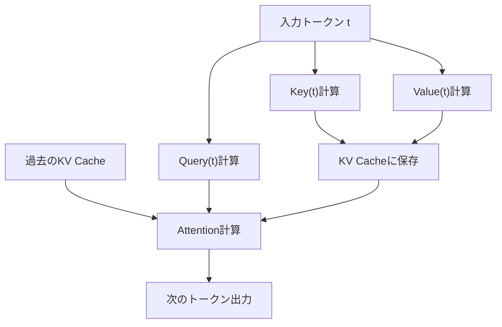
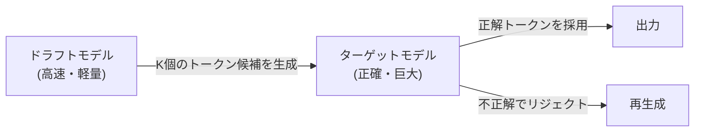

## 1. Introducción: El 'muro invisible' en la inferencia de LLM

La IA moderna, especialmente los grandes modelos de lenguaje (LLM), ha transformado fundamentalmente nuestra experiencia digital. Sin embargo, al intentar ejecutar los enormes modelos que impulsan a ChatGPT, Claude, etc., en infraestructura propia o en una PC local, muchos desarrolladores se enfrentan al gran muro de la 'lentitud de la inferencia'.

¿Por qué es lenta la inferencia de los LLM? Muchos tienden a pensar: 'Faltan operaciones de punto flotante (FLOPS), por lo que se necesita una GPU', pero en realidad, en la fase de inferencia, especialmente durante la generación de texto con un tamaño de lote (batch size) de 1 (o muy pequeño), **el cuello de botella no es la capacidad de cálculo, sino el ancho de banda de la memoria (Memory Bandwidth)**.

En este artículo, desentrañaremos la verdadera naturaleza de este 'muro del ancho de banda de memoria' en la inferencia de LLM y profundizaremos desde perspectivas de hardware y software en las tecnologías de vanguardia para superarlo: **Caché KV (Key-Value Cache)**, **PagedAttention**, **Decodificación Especulativa (Speculative Decoding)** y **Cuantización (Quantization)**.

---

## 2. Generación autorregresiva de Transformer y el cuello de botella computacional

### 2.1 El mecanismo autorregresivo (Autoregressive)
Los modelos decodificadores basados en Transformer, la corriente principal de los LLM, generan texto mediante un método llamado 'autorregresivo'. Este es un proceso en el que se predice el siguiente token único a partir de todos los tokens anteriores.

Expresado matemáticamente, la probabilidad de un token $x_t$ en un paso $t$ se calcula de la siguiente manera:
$P(x_t | x_1, x_2, ..., x_{t-1})$

Este proceso es secuencial y no puede ser paralelizado. Para realizar el cálculo del paso $t+1$, es necesario que el token generado en el paso $t$ esté completamente definido.

### 2.2 Las dos fases durante la inferencia
La inferencia se divide principalmente en las dos siguientes fases:

1. **Fase de Prefill (Relleno previo)**: 
   Fase en la que se procesa todo el prompt de entrada a la vez para construir el estado inicial. Aquí es posible la computación en paralelo y se puede aprovechar al máximo la capacidad de cálculo (FLOPS) de la GPU, por lo que se convierte en un proceso **limitado por cálculo (Compute-bound)**.
2. **Fase de Decode (Decodificación)**: 
   Fase en la que los tokens se generan uno por uno después de completar el prefill. Aquí es donde ocurre el proceso autorregresivo, y cada vez que se genera un nuevo token, es necesario leer los pesos de todo el modelo desde la memoria. Por lo tanto, esto se convierte en un proceso **limitado por el ancho de banda de memoria (Memory-bound)**.

### 2.3 El muro del ancho de banda de memoria (Memory Bandwidth Wall)
Por ejemplo, cuando se opera un modelo con 70B (70 mil millones) de parámetros en FP16 (punto flotante de 16 bits), los datos de los pesos del modelo suman aproximadamente 140 GB. Cada vez que se genera un único token, estos 140 GB de datos deben transferirse desde la HBM (Memoria de Alto Ancho de Banda) de la GPU a las unidades de cálculo (SRAM/Núcleo).

Incluso si suponemos que el ancho de banda de la memoria de la GPU es de 2 TB/s, transferir 140 GB tomará $140 / 2000 = 0.07$ segundos. En otras palabras, por muy rápidos que sean los cálculos, existe un límite físico por el cual solo se pueden generar, como máximo, unos 14 tokens por segundo. Este es el 'muro del ancho de banda de memoria'.

---

## 3. Conceptos básicos de la Caché KV (Key-Value Cache)

### 3.1 Prevenir el recálculo del mecanismo de Atención
En la generación autorregresiva, es muy ineficiente volver a calcular la Atención (Attention) para todos los tokens anteriores en cada paso.

En el cálculo de la Atención, cada token se transforma en los vectores **Query (Q)**, **Key (K)** y **Value (V)**.
Cuando se genera un nuevo token $x_t$, los K y V de los tokens pasados (de $x_1$ a $x_{t-1}$) ya se han calculado y permanecen inmutables.

Por lo tanto, se ideó una técnica en la cual los K y V de los tokens pasados se guardan (almacenan en caché) en la memoria de la GPU, y la Atención se calcula utilizando únicamente la Q del nuevo token y los K y V almacenados en caché. Esta es la **Caché KV (Key-Value Cache)**.

### 3.2 El problema del consumo de memoria de la Caché KV
La Caché KV reduce significativamente la cantidad de cálculo, pero el costo es un consumo enorme de memoria.
A medida que el tamaño del lote aumenta o la longitud del contexto (longitud de la secuencia) crece, el tamaño de la caché KV aumenta linealmente, ocupando decenas de GB de memoria en un instante.

Expresado en fórmula, el tamaño de la caché KV es el siguiente:
`Cantidad de memoria = 2 (K y V) * Tamaño del lote * Longitud de la secuencia * Número de capas * Número de cabezas * Dimensión de la cabeza * Número de bytes`

Cómo gestionar esta caché gigantesca es el mayor desafío para los servidores de inferencia de LLM.

---

## 4. Innovación en la gestión de memoria con PagedAttention

En los motores de inferencia tradicionales, se reservaba de antemano un área de memoria continua enorme para la caché KV. Sin embargo, dado que la longitud del texto generado es impredecible, se producía una **fragmentación interna (Internal Fragmentation)** y una **fragmentación externa (External Fragmentation)** de la memoria, desperdiciando hasta un 60% al 80% de la misma.

### 4.1 Aprendiendo de la memoria virtual del SO
El equipo de investigación de UC Berkeley resolvió este problema mediante **PagedAttention**, implementado en `vLLM`. Esto aplica el concepto de 'paginación' de la memoria virtual del SO a la gestión de la caché KV.

Con PagedAttention, la caché KV se divide en 'bloques' de tamaño fijo que se distribuyen en un espacio de memoria física no contiguo. Estos bloques se tratan virtualmente como bloques continuos, y el mapeo de bloques lógicos a físicos se gestiona mediante una tabla de bloques.

### 4.2 Ventajas de PagedAttention
- **Eliminación del desperdicio de memoria**: Dado que se asignan bloques solo en la medida que se necesitan, la fragmentación interna se reduce a casi cero (menos del pequeño porcentaje).
- **Lotes eficientes**: Se pueden agrupar más solicitudes en la memoria limitada, lo que mejora drásticamente el rendimiento general del sistema.
- **Uso compartido de memoria**: En técnicas de decodificación como Beam Search, se hace posible compartir de forma segura (Copy-on-Write) la caché KV entre múltiples secuencias que se derivan del mismo prompt.

---

## 5. Decodificación Especulativa (Speculative Decoding): Un cambio de paradigma hacia la paralelización

Aunque la optimización de la caché KV contribuye a mejorar la memoria y el rendimiento (throughput), no mejora fundamentalmente la **latencia (retraso)** cuando el tamaño del lote es de 1. Un algoritmo innovador para superar el mencionado 'muro del ancho de banda de memoria' es la **Decodificación Especulativa (Speculative Decoding)**.

### 5.1 Reconfirmando el motivo de la lentitud
Al operar un modelo enorme (modelo objetivo), la lectura de los pesos de la memoria es lenta. Por el contrario, si se trata de un modelo pequeño (modelo borrador), la lectura de los pesos se completa en un instante.

### 5.2 Cómo funciona la decodificación especulativa
La decodificación especulativa combina dos pasos: 'Adivinación (Drafting)' y 'Verificación (Verification)'.

1. **Fase de Adivinación (Drafting)**:
   Se utiliza un modelo borrador pequeño y rápido (ej. miles de millones de parámetros) para predecir a gran velocidad, de forma autorregresiva, los próximos $K$ tokens.
   Ejemplo: "La" "capital" "de" "Japón" "es" "Tokio"

2. **Fase de Verificación (Verification)**:
   Los $K$ tokens adivinados se pasan todos a la vez al modelo objetivo. El modelo objetivo los evalúa en un solo paso hacia adelante (cálculo paralelo) y verifica si cada token es correcto.
   - Si acierta hasta "Japón" y falla en "es", volverá a adivinar desde la parte incorrecta.

### 5.3 Garantía de exactitud matemática
Sorprendentemente, la decodificación especulativa garantiza **matemáticamente exactamente la misma distribución de probabilidad de salida** que si el modelo objetivo hubiera generado autorregresivamente por sí solo. No es un algoritmo de aproximación. Al aplicar la técnica de Muestreo de Rechazo (Rejection Sampling), es una tecnología revolucionaria que puede duplicar o triplicar únicamente la velocidad, sin reducir en absoluto la calidad.

---

## 6. Cuantización (Quantization) y el auge de los LLM locales

Otro enfoque poderoso para romper el muro del ancho de banda de la memoria es la **Cuantización (Quantization)**, que reduce el tamaño mismo de los pesos del modelo. Si el tamaño de los pesos se reduce a la mitad, el tiempo de lectura de la memoria también se reduce a la mitad y la velocidad de inferencia mejora.

### 6.1 llama.cpp y GGML/GGUF
El principal impulsor del movimiento de ejecutar LLMs localmente es `llama.cpp`. Esta biblioteca, implementada en C/C++, ejecuta LLMs a velocidades asombrosas en ordenadores Mac con chips serie M de Apple, y también en CPUs/GPUs comunes.

En su núcleo se encuentra el formato `GGUF` (antes GGML) y las tecnologías de cuantización.
Los pesos, que habitualmente se representan en 16 bits (FP16/BF16), se comprimen a enteros de 4 u 8 bits (INT4/INT8).

### 6.2 Algoritmos de cuantización avanzados
Dado que un redondeo simple degradaría significativamente la precisión del modelo, se emplean tecnologías avanzadas como las siguientes:

- **GPTQ**: Un método que, al cuantizar los pesos del modelo, utiliza información de las derivadas de segundo orden (matriz Hessiana) para compensar los errores de cuantización de modo que el impacto en la precisión sea mínimo.
- **AWQ (Activation-aware Weight Quantization)**: Toma en cuenta no solo la distribución de los propios pesos, sino también la distribución de las 'activaciones' durante la inferencia real. Deja los pocos pesos importantes (alrededor del 1% del total) en alta precisión y cuantiza fuertemente el resto, previniendo así la degradación de la calidad.
- **ExLlamaV2**: Una versión aún más rápida de GPTQ, que soporta tasas de bits variables (por ejemplo, 4.5 bits de promedio) y asigna el número de bits en función de la importancia de la capa.

---

## 7. Conclusión y perspectivas futuras

La inferencia de LLM ha evolucionado de la simple imagen de 'operaciones matriciales masivas' hacia la **'ingeniería de sistemas que optimiza el ancho de banda de memoria hasta el extremo'**.

- La **Caché KV** elimina los cálculos innecesarios,
- **PagedAttention** elimina el desperdicio del espacio de memoria,
- La **Decodificación Especulativa** supera el muro del procesamiento secuencial introduciendo la paralelización, y
- La **Cuantización** reduce el volumen de transferencia física de datos.

Estas tecnologías no son independientes, sino que se usan en combinación. Por ejemplo, al aplicar PagedAttention a un modelo cuantizado y combinarlo además con la decodificación especulativa, ha llegado una era en la que modelos que antes requerían supercomputadoras operan en tiempo real en PCs de escritorio o dispositivos de borde.

En el futuro, con el auge de las nuevas arquitecturas (modelos de espacio de estado tipo RNN) que reemplacen al Transformer, como Mamba y RWKV, es concebible un escenario en el que la caché KV misma ya no sea necesaria, o se requiera una forma de gestión de memoria completamente nueva. No podemos quitar los ojos de este campo donde el avance del hardware y la innovación de algoritmos se cruzan.
