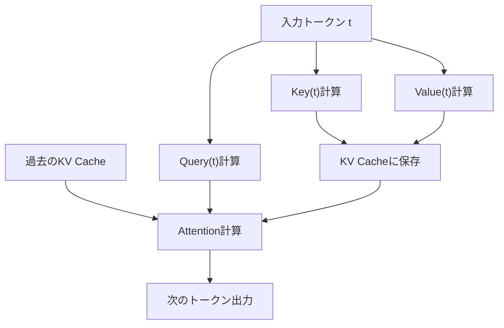
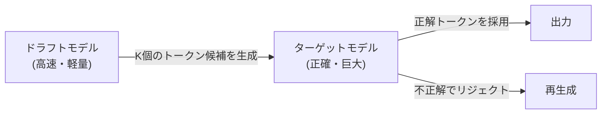

## 1. Introduction : le « mur invisible » de l'inférence des LLM

L'IA moderne, en particulier les grands modèles de langage (LLM), a fondamentalement transformé notre expérience numérique. Cependant, lorsque l'on tente de faire fonctionner les modèles gigantesques qui se cachent derrière ChatGPT ou Claude sur sa propre infrastructure ou sur un PC local, de nombreux développeurs se heurtent à un mur de taille : la « lenteur de la vitesse d'inférence ».

Pourquoi l'inférence des LLM est-elle lente ? Beaucoup ont tendance à penser que « les GPU sont nécessaires parce que la puissance de calcul (FLOPS) est insuffisante », mais en réalité, lors de la phase d'inférence, particulièrement lors de la génération de texte avec une taille de lot (batch size) de 1 (ou de petite taille), **ce n'est pas la puissance de calcul qui constitue le goulot d'étranglement, mais la bande passante mémoire (Memory Bandwidth)**.

Dans cet article, nous allons lever le voile sur ce « mur de la bande passante mémoire » dans l'inférence des LLM, et expliquer en profondeur, tant du point de vue matériel que logiciel, les mécanismes des technologies de pointe permettant de le surmonter : le **cache KV (Key-Value Cache)**, **PagedAttention**, le **décodage spéculatif (Speculative Decoding)** et la **quantification (Quantization)**.

---

## 2. Génération autorégressive de Transformer et goulots d'étranglement de calcul

### 2.1 Le mécanisme d'autorégression (Autoregressive)
Les modèles de décodeur basés sur Transformer, qui constituent le courant dominant des LLM, génèrent du texte via une méthode appelée « autorégression ». Il s'agit d'un processus qui prédit le prochain jeton (token) à partir de tous les jetons précédents.

Exprimé mathématiquement, la probabilité d'un jeton $x_t$ à une étape $t$ donnée est calculée comme suit :
$P(x_t | x_1, x_2, ..., x_{t-1})$

Ce processus est séquentiel et ne peut pas être parallélisé. Pour effectuer le calcul de l'étape $t+1$, le jeton généré à l'étape $t$ doit être finalisé.

### 2.2 Les deux phases lors de l'inférence
L'inférence se compose principalement des deux phases suivantes :

1. **Phase de Prefill (pré-remplissage)** :
   La phase où l'ensemble du prompt en entrée est traité en une seule fois pour construire l'état initial. Ici, le calcul parallèle est possible et la puissance de calcul (FLOPS) du GPU peut être pleinement exploitée, ce qui rend cette phase **limitée par le calcul (Compute-bound)**.
2. **Phase de Decode (décodage)** :
   La phase où les jetons sont générés un par un après l'achèvement du pré-remplissage. C'est ici qu'intervient le processus autorégressif, et il est nécessaire de lire les poids de l'ensemble du modèle depuis la mémoire à chaque fois qu'un nouveau jeton est généré. Par conséquent, cette phase est **limitée par la bande passante mémoire (Memory-bound)**.

### 2.3 Le mur de la bande passante mémoire (Memory Bandwidth Wall)
Par exemple, si l'on fait fonctionner un modèle ayant 70B (70 milliards) de paramètres en FP16 (virgule flottante 16 bits), les données des poids du modèle représentent environ 140 Go. À chaque génération d'un jeton, ces 140 Go de données doivent être transférés de la mémoire HBM (High Bandwidth Memory) du GPU vers l'unité de calcul (SRAM/Core).

Même si la bande passante mémoire du GPU est de 2 To/s, le transfert de 140 Go prendra $140 / 2000 = 0,07$ seconde. En d'autres termes, quelle que soit la vitesse du calcul, il existe une limite physique qui fait qu'il n'est possible de générer qu'environ 14 jetons par seconde au maximum. C'est ce qu'on appelle le « mur de la bande passante mémoire ».

---

## 3. Les bases du cache KV (Key-Value Cache)

### 3.1 Empêcher le recalcul du mécanisme d'Attention
Dans la génération autorégressive, il est extrêmement inefficace de recalculer l'Attention pour tous les jetons précédents à chaque étape.

Dans le calcul de l'Attention, chaque jeton est converti en vecteurs **Query (Q)**, **Key (K)**, et **Value (V)**.
Lors de la génération d'un nouveau jeton $x_t$, les K et V des jetons précédents (de $x_1$ à $x_{t-1}$) sont déjà calculés et restent invariables.

Par conséquent, une méthode a été conçue pour sauvegarder (mettre en cache) les K et V des jetons précédents dans la mémoire du GPU, et calculer l'Attention en n'utilisant que le Q du nouveau jeton ainsi que les K et V mis en cache. C'est ce qu'on appelle le **cache KV (Key-Value Cache)**.

### 3.2 Le problème de consommation de mémoire du cache KV
Le cache KV réduit considérablement la quantité de calculs, mais en contrepartie, il consomme une énorme quantité de mémoire.
Lorsque la taille du lot augmente ou que la longueur du contexte (longueur de séquence) s'allonge, la taille du cache KV augmente de manière linéaire et finit par occuper des dizaines de gigaoctets de mémoire en un clin d'œil.

Exprimée en formule, la taille du cache KV se présente comme suit :
`Quantité de mémoire = 2 (K et V) * taille du lot * longueur de la séquence * nombre de couches * nombre de têtes * dimension des têtes * nombre d'octets`

La manière de gérer cet énorme cache est le plus grand défi pour les serveurs d'inférence LLM.

---

## 4. L'innovation de la gestion de la mémoire grâce à PagedAttention

Dans les moteurs d'inférence traditionnels, de grandes zones de mémoire contiguës étaient allouées à l'avance pour le cache KV. Cependant, comme la longueur du texte généré est imprévisible, cela entraînait une **fragmentation interne (Internal Fragmentation)** et une **fragmentation externe (External Fragmentation)** de la mémoire, avec jusqu'à 60 % à 80 % de la mémoire gaspillée.

### 4.1 S'inspirer de la mémoire virtuelle des systèmes d'exploitation
Ce problème a été résolu par **PagedAttention**, implémenté dans `vLLM` développé par une équipe de chercheurs de l'UC Berkeley. Cela consiste à appliquer le concept de « pagination » de la mémoire virtuelle des systèmes d'exploitation à la gestion du cache KV.

Dans PagedAttention, le cache KV est divisé en « blocs » de taille fixe, qui sont distribués dans des espaces de mémoire physique non contigus. Ils sont traités virtuellement comme des blocs contigus, et le mappage des blocs logiques aux blocs physiques est géré par une table de blocs.

### 4.2 Les avantages de PagedAttention
- **Élimination du gaspillage de mémoire** : En n'allouant que les blocs nécessaires, la fragmentation interne est réduite à presque zéro (moins de quelques pourcents).
- **Traitement par lots efficace** : Il est possible de concentrer plus de requêtes dans une mémoire limitée, ce qui améliore considérablement le débit global du système.
- **Partage de la mémoire** : Dans les méthodes de décodage comme Beam Search, il devient possible de partager en toute sécurité (Copy-on-Write) le cache KV entre plusieurs séquences dérivées du même prompt.

---

## 5. Décodage spéculatif (Speculative Decoding) : un changement de paradigme vers la parallélisation

L'optimisation du cache KV contribue à l'amélioration de la mémoire et du débit, mais ne résout pas fondamentalement le problème de **latence (Latency)** lorsque la taille du lot est de 1. L'algorithme innovant pour surmonter le « mur de la bande passante mémoire » mentionné précédemment est le **décodage spéculatif (Speculative Decoding)**.

### 5.1 Rappel des raisons de la lenteur
Lorsqu'on fait tourner un grand modèle (le modèle cible), la lecture des poids depuis la mémoire est lente. En revanche, pour un petit modèle (le modèle brouillon ou draft), le chargement des poids s'effectue en un instant.

### 5.2 Le fonctionnement du décodage spéculatif
Le décodage spéculatif combine deux étapes : la « supposition (Drafting) » et la « vérification (Verification) ».

1. **Phase de Supposition (Drafting)** :
   À l'aide d'un modèle brouillon petit et rapide (ex : quelques milliards de paramètres), les prochains $K$ jetons futurs sont prédits rapidement de manière autorégressive.
   Exemple : « La », « capitale », « du », « Japon », « est »

2. **Phase de Vérification (Verification)** :
   Les $K$ jetons supposés sont transmis d'un coup au modèle cible. Le modèle cible les évalue en un seul passage (Forward pass, calcul parallèle) pour vérifier si chaque jeton est correct.
   - Si les jetons sont corrects jusqu'à « Japon » mais que « est » est incorrect, la supposition recommence à partir de l'endroit de l'erreur.

### 5.3 Garantie de l'exactitude mathématique
Étonnamment, le décodage spéculatif garantit **exactement la même distribution de probabilité de sortie mathématique** que si le modèle cible avait effectué la génération autorégressive seul. Ce n'est pas un algorithme d'approximation. En appliquant la technique de l'échantillonnage de rejet (Rejection Sampling), c'est une technologie révolutionnaire qui permet d'augmenter la vitesse par 2 ou 3 sans aucune perte de qualité.

---

## 6. La quantification (Quantization) et l'essor des LLM locaux

Une autre approche puissante pour briser le mur de la bande passante mémoire est la **quantification (Quantization)**, qui réduit la taille des poids du modèle eux-mêmes. Si la taille des poids est divisée par deux, le temps de lecture depuis la mémoire est également divisé par deux, ce qui améliore la vitesse d'inférence.

### 6.1 llama.cpp et GGML/GGUF
Le déclencheur du mouvement visant à faire fonctionner les LLM localement a été `llama.cpp`. Cette bibliothèque implémentée en C/C++ permet de faire tourner les LLM à des vitesses stupéfiantes sur les Mac de la série Apple M et sur des CPU/GPU standards.

En son cœur se trouvent le format `GGUF` (anciennement GGML) et la technologie de quantification.
Les poids, généralement représentés sur 16 bits (FP16/BF16), sont compressés en nombres entiers de 4 ou 8 bits (INT4/INT8).

### 6.2 Algorithmes de quantification avancés
Un simple arrondissement entraînerait une dégradation significative de la précision du modèle, c'est pourquoi des technologies avancées comme les suivantes sont utilisées :

- **GPTQ** : Lors de la quantification des poids du modèle, cette méthode utilise les informations de la dérivée seconde (matrice hessienne) pour corriger l'erreur de quantification afin de minimiser l'impact sur la précision.
- **AWQ (Activation-aware Weight Quantization)** : Elle prend en compte non seulement la distribution des poids eux-mêmes, mais aussi la distribution des « activations » lors de l'inférence réelle. Une petite minorité de poids importants (environ 1 % de l'ensemble) est conservée avec une grande précision, tandis que le reste est fortement quantifié, évitant ainsi la dégradation de la qualité.
- **ExLlamaV2** : Il s'agit d'une version encore plus rapide de GPTQ qui prend en charge les débits binaires variables (ex : une moyenne de 4,5 bits) et alloue le nombre de bits en fonction de l'importance des couches.

---

## 7. Conclusion et perspectives d'avenir

L'inférence des LLM a évolué d'une simple image d'« opération matricielle géante » vers **« une ingénierie des systèmes qui optimise la bande passante mémoire jusqu'à ses limites extrêmes »**.

- Le **cache KV** élimine le gaspillage dans les calculs,
- **PagedAttention** élimine le gaspillage de l'espace mémoire,
- Le **décodage spéculatif** surmonte le mur du traitement séquentiel pour apporter la parallélisation,
- Et la **quantification** a réduit la quantité physique de mouvements de données.

Ces technologies ne sont pas indépendantes, elles sont utilisées en combinaison. Par exemple, en appliquant PagedAttention à un modèle quantifié, puis en combinant le décodage spéculatif, nous sommes entrés dans une ère où des modèles qui nécessitaient autrefois des supercalculateurs fonctionnent désormais en temps réel sur des PC de bureau personnels et des appareils périphériques (edge devices).

À l'avenir, avec l'essor de nouvelles architectures (modèles d'espace d'état de type RNN) pour remplacer Transformer, telles que Mamba et RWKV, on peut envisager un futur où le cache KV lui-même deviendra inutile, ou bien où une toute nouvelle forme de gestion de la mémoire sera requise. Il faudra continuer à garder un œil attentif sur ce domaine où se croisent l'évolution du matériel et l'innovation des algorithmes.
