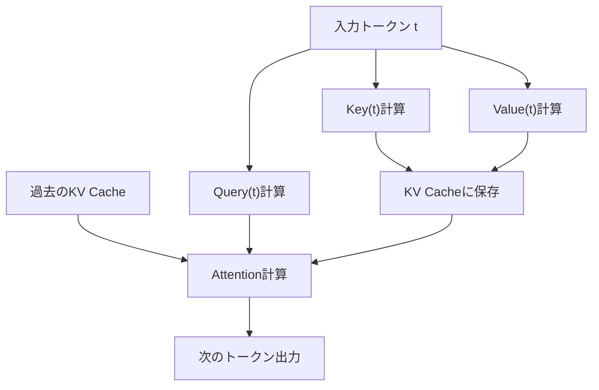
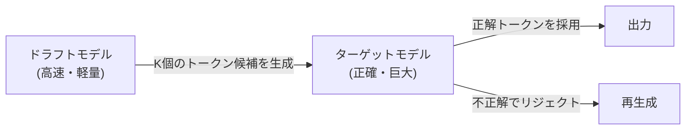

## 1. प्रस्तावना: LLM इन्फरेंस में 'अदृश्य दीवार'

आधुनिक AI, विशेष रूप से लार्ज लैंग्वेज मॉडल्स (LLM), ने हमारे डिजिटल अनुभव को मौलिक रूप से बदल दिया है। हालाँकि, जब कई डेवलपर्स अपनी स्वयं की अवसंरचना या स्थानीय पीसी पर ChatGPT या Claude के पीछे चलने वाले इन विशाल मॉडलों को चलाने का प्रयास करते हैं, तो उन्हें 'इन्फरेंस की धीमी गति' की एक ऊंची दीवार का सामना करना पड़ता है।

LLM का इन्फरेंस धीमा क्यों होता है? बहुत से लोग सोचते हैं कि "पर्याप्त कंप्यूटिंग पावर (FLOPS) नहीं है, इसलिए GPU की आवश्यकता है", लेकिन वास्तव में इन्फरेंस चरण में, विशेष रूप से जब बैच का आकार 1 (या छोटा) होता है और टेक्स्ट जनरेट किया जा रहा होता है, तो **कंप्यूटिंग क्षमता नहीं बल्कि मेमोरी बैंडविड्थ (Memory Bandwidth) बॉटलनेक** बन जाती है।

इस लेख में, हम LLM इन्फरेंस में इस 'मेमोरी बैंडविड्थ की दीवार' के वास्तविक स्वरूप को उजागर करेंगे और इसे दूर करने के लिए नवीनतम तकनीकों जैसे **KV कैश (Key-Value Cache)**, **PagedAttention**, **स्पेक्युलेटिव डिकोडिंग (Speculative Decoding)** और **क्वांटाइज़ेशन (Quantization)** के तंत्र का हार्डवेयर और सॉफ्टवेयर दोनों दृष्टिकोणों से गहराई से विश्लेषण करेंगे।

---

## 2. ट्रांसफार्मर का ऑटोरेग्रेसिव जनरेशन और कंप्यूटेशनल बॉटलनेक

### 2.1 ऑटोरेग्रेसिव (Autoregressive) तंत्र
LLM का मुख्यधारा, ट्रांसफार्मर-आधारित डिकोडर मॉडल 'ऑटोरेग्रेसिव' नामक विधि का उपयोग करके टेक्स्ट उत्पन्न करता है। यह पिछले सभी टोकन से अगले एक टोकन की भविष्यवाणी करने की प्रक्रिया है।

इसे गणितीय रूप से व्यक्त करने पर, किसी विशिष्ट स्टेप $t$ पर टोकन $x_t$ की प्रायिकता इस प्रकार जांची जाती है:
$P(x_t | x_1, x_2, ..., x_{t-1})$

यह प्रक्रिया क्रमिक है और इसे समानांतर रूप से निष्पादित नहीं किया जा सकता। स्टेप $t+1$ की गणना करने के लिए, स्टेप $t$ में उत्पन्न टोकन का निर्धारित होना आवश्यक है।

### 2.2 इन्फरेंस के 2 चरण
इन्फरेंस को मुख्य रूप से निम्नलिखित 2 चरणों में विभाजित किया जा सकता है:

1. **Prefill (प्रीफिल) चरण**: 
   पूरे इनपुट प्रॉम्प्ट को एक ही बार में प्रोसेस करने और प्रारंभिक स्थिति का निर्माण करने का चरण। यहां समानांतर गणना संभव है, और GPU की कंप्यूटिंग क्षमता (FLOPS) का पूरी तरह से उपयोग किया जा सकता है, इसलिए यह **Compute-bound (कंप्यूट-बाउंड)** होता है।
2. **Decode (डिकोड) चरण**: 
   प्रीफिल के पूरा होने के बाद, टोकन को एक-एक करके उत्पन्न करने का चरण। यही ऑटोरेग्रेसिव प्रक्रिया है, और जब भी कोई नया टोकन उत्पन्न होता है, तो पूरे मॉडल के वेट्स (weights) को मेमोरी से पढ़ने की आवश्यकता होती है। इसलिए, यह **Memory-bound (मेमोरी-बाउंड)** बन जाता है।

### 2.3 मेमोरी बैंडविड्थ की दीवार (Memory Bandwidth Wall)
उदाहरण के लिए, यदि हम 70B (70 बिलियन) पैरामीटर्स वाले एक मॉडल को FP16 (16-बिट फ्लोटिंग पॉइंट) में चलाते हैं, तो मॉडल के वेट डेटा का आकार लगभग 140GB होता है। हर बार एक टोकन उत्पन्न होने पर, यह 140GB डेटा GPU के HBM (High Bandwidth Memory) से कंप्यूटिंग यूनिट (SRAM/Core) में ट्रांसफर करना पड़ता है।

मान लीजिए कि GPU की मेमोरी बैंडविड्थ 2TB/s है, तो 140GB ट्रांसफर करने में $140 / 2000 = 0.07$ सेकंड का समय लगता है। इसका अर्थ है कि चाहे गणना कितनी भी तेज हो, अधिकतम लगभग 14 टोकन प्रति सेकंड उत्पन्न किए जा सकते हैं - यह एक भौतिक सीमा है। यही 'मेमोरी बैंडविड्थ की दीवार' है।

---

## 3. KV कैश (Key-Value Cache) के मूल सिद्धांत

### 3.1 Attention तंत्र की पुनर्गणना को रोकना
ऑटोरेग्रेसिव जनरेशन में, हर स्टेप पर पिछले सभी टोकन के लिए Attention (अटेंशन) की दोबारा गणना करना बहुत ही अक्षम है।

Attention की गणना में, प्रत्येक टोकन को **Query (Q)**, **Key (K)**, और **Value (V)** वेक्टर में परिवर्तित किया जाता है।
जब एक नया टोकन $x_t$ उत्पन्न होता है, तो पिछले टोकन ($x_1$ से $x_{t-1}$) के K और V पहले ही गिने जा चुके होते हैं और वे अपरिवर्तित रहते हैं।

इसलिए, एक तकनीक ईजाद की गई है जिसमें पिछले टोकन के K और V को GPU की मेमोरी में सेव (कैश) कर लिया जाता है, और केवल नए टोकन के Q तथा कैश किए गए K, V का उपयोग करके Attention की गणना की जाती है। यही **KV कैश (Key-Value Cache)** है।

### 3.2 KV कैश की मेमोरी खपत की समस्या
KV कैश कंप्यूटेशनल कार्यभार को काफी हद तक कम कर देता है, लेकिन इसके बदले में यह बहुत अधिक मेमोरी की खपत करता है।
जैसे-जैसे बैच का आकार बढ़ता है या कॉन्टेक्स्ट की लंबाई (अनुक्रम लंबाई) बढ़ती है, KV कैश का आकार रैखिक रूप से बढ़ता है और कुछ ही समय में यह दसियों GB मेमोरी घेर लेता है।

सूत्र रूप में, KV कैश का आकार इस प्रकार होता है:
`मेमोरी की मात्रा = 2 (K और V) * बैच का आकार * अनुक्रम लंबाई * लेयर्स की संख्या * हेड्स की संख्या * हेड का आयाम * बाइट्स की संख्या`

इस विशाल कैश को कैसे प्रबंधित किया जाए, यह LLM इन्फरेंस सर्वर की सबसे बड़ी चुनौती बन जाती है।

---

## 4. PagedAttention के साथ मेमोरी प्रबंधन में नवाचार

पारंपरिक इन्फरेंस इंजन में, KV कैश के लिए एक निरंतर और विशाल मेमोरी क्षेत्र पहले से ही आरक्षित किया जाता था। हालाँकि, चूंकि उत्पन्न होने वाले टेक्स्ट की लंबाई का अनुमान नहीं लगाया जा सकता, इसलिए मेमोरी में **Internal Fragmentation (आंतरिक विखंडन)** और **External Fragmentation (बाहरी विखंडन)** होता था, जिससे अधिकतम 60% से 80% मेमोरी बर्बाद हो जाती थी।

### 4.1 OS की वर्चुअल मेमोरी से सीखना
इस समस्या को UC Berkeley की रिसर्च टीम द्वारा विकसित `vLLM` में लागू किए गए **PagedAttention** के जरिए हल किया गया था। यह OS की वर्चुअल मेमोरी में 'पेजिंग' (paging) की अवधारणा को KV कैश प्रबंधन में लागू करने का एक तरीका है।

PagedAttention में, KV कैश को निश्चित आकार के 'ब्लॉक्स' में विभाजित किया जाता है और उन्हें असतत (non-contiguous) भौतिक मेमोरी स्पेस में वितरित किया जाता है। इन्हें वर्चुअली निरंतर ब्लॉक के रूप में माना जाता है, और लॉजिकल ब्लॉक से फिजिकल ब्लॉक तक की मैपिंग को एक ब्लॉक टेबल द्वारा प्रबंधित किया जाता है।

### 4.2 PagedAttention के फायदे
- **मेमोरी की बर्बादी को समाप्त करना**: चूंकि ब्लॉक्स केवल आवश्यकतानुसार आवंटित किए जाते हैं, आंतरिक विखंडन को लगभग शून्य (कुछ प्रतिशत से भी कम) पर रखा जाता है।
- **प्रभावी बैचिंग**: सीमित मेमोरी में अधिक रिक्वेस्ट्स को पैक किया जा सकता है, जिससे पूरे सिस्टम के थ्रूपुट में भारी सुधार होता है।
- **मेमोरी साझाकरण**: Beam Search जैसी डिकोडिंग विधियों में, एक ही प्रॉम्प्ट से उत्पन्न कई अनुक्रमों के बीच KV कैश को सुरक्षित रूप से साझा (Copy-on-Write) करना संभव हो जाता है।

---

## 5. स्पेक्युलेटिव डिकोडिंग (Speculative Decoding): समानांतरकरण की ओर एक प्रतिमान बदलाव

KV कैश का अनुकूलन मेमोरी और थ्रूपुट को सुधारने में योगदान देता है, लेकिन यह मौलिक रूप से तब **विलंबता (Latency)** में सुधार नहीं करता जब बैच का आकार 1 होता है। पहले बताई गई 'मेमोरी बैंडविड्थ की दीवार' को पार करने के लिए **स्पेक्युलेटिव डिकोडिंग (Speculative Decoding)** एक नवोन्मेषी एल्गोरिदम है।

### 5.1 यह धीमा क्यों है, इसकी पुनः पुष्टि
एक विशाल मॉडल (टारगेट मॉडल) चलाते समय, मेमोरी से वेट्स (weights) को पढ़ने में बहुत समय लगता है। दूसरी ओर, यदि यह एक छोटा मॉडल (ड्राफ्ट मॉडल) है, तो वेट्स को पढ़ना पल भर में समाप्त हो जाता है।

### 5.2 स्पेक्युलेटिव डिकोडिंग का तंत्र
स्पेक्युलेटिव डिकोडिंग में 'अनुमान (Drafting)' और 'सत्यापन (Verification)' के दो चरणों का संयोजन होता है।

1. **अनुमान (Drafting) चरण**:
   एक छोटे और तेज ड्राफ्ट मॉडल (उदा: अरबों पैरामीटर्स) का उपयोग करके, ऑटोरेग्रेसिव तरीके से भविष्य के $K$ टोकन की बहुत तेजी से भविष्यवाणी की जाती है।
   उदाहरण: "जापान", "की", "राजधानी", "टोक्यो", "है"

2. **सत्यापन (Verification) चरण**:
   अनुमानित $K$ टोकन को एक ही बार में टारगेट मॉडल में पास किया जाता है। टारगेट मॉडल इसे एक एकल फॉरवर्ड पास (समानांतर गणना) में मूल्यांकित करता है और यह सत्यापित करता है कि प्रत्येक टोकन सही है या नहीं।
   - यदि "टोक्यो" तक सब कुछ सही है और "है" गलत था, तो जहां से यह गलत था, वहां से अनुमान को फिर से शुरू किया जाता है।

### 5.3 गणितीय सटीकता की गारंटी
आश्चर्यजनक रूप से, स्पेक्युलेटिव डिकोडिंग यह गारंटी देता है कि इसका **आउटपुट प्रायिकता वितरण गणितीय रूप से बिल्कुल वैसा ही** होगा जैसा कि अकेले टारगेट मॉडल का उपयोग करके ऑटोरेग्रेसिव जनरेशन में होता है। यह कोई अनुमानित (approximate) एल्गोरिदम नहीं है। रिजेक्शन सैंपलिंग (Rejection Sampling) तकनीक को लागू करके, गुणवत्ता से समझौता किए बिना गति को 2 से 3 गुना तक बढ़ाने की यह एक क्रांतिकारी तकनीक है।

---

## 6. क्वांटाइज़ेशन (Quantization) और लोकल LLM का उदय

मेमोरी बैंडविड्थ की दीवार को तोड़ने का एक और शक्तिशाली दृष्टिकोण **क्वांटाइज़ेशन (Quantization)** है, जो स्वयं मॉडल के वेट्स (weights) के आकार को कम करता है। यदि वेट्स का आकार आधा कर दिया जाता है, तो मेमोरी से पढ़ने का समय भी आधा हो जाएगा, जिससे इन्फरेंस की गति में सुधार होगा।

### 6.1 llama.cpp और GGML/GGUF
स्थानीय रूप से LLM चलाने के आंदोलन को जन्म देने वाला मुख्य कारक `llama.cpp` है। C/C++ में लागू की गई यह लाइब्रेरी Apple की M सीरीज़ के Mac और सामान्य CPU/GPU पर अविश्वसनीय गति से LLM को चलाती है।

इसके मूल में `GGUF` (पूर्व में GGML) नामक प्रारूप और क्वांटाइज़ेशन तकनीक है।
यह आमतौर पर 16 बिट (FP16/BF16) में दर्शाए गए वेट्स को 4-बिट या 8-बिट पूर्णांक (INT4/INT8) में संपीड़ित करता है।

### 6.2 उन्नत क्वांटाइज़ेशन एल्गोरिदम
चूंकि साधारण राउंडिंग (rounding) से मॉडल की सटीकता काफी हद तक कम हो जाती है, इसलिए निम्नलिखित जैसी उन्नत तकनीकों का उपयोग किया जाता है:

- **GPTQ**: मॉडल के वेट्स को क्वांटाइज़ करते समय, दूसरे डेरिवेटिव (Hessian मैट्रिक्स) की जानकारी का उपयोग करके क्वांटाइज़ेशन त्रुटियों को इस तरह ठीक किया जाता है कि सटीकता पर प्रभाव न्यूनतम हो।
- **AWQ (Activation-aware Weight Quantization)**: यह केवल वेट्स के वितरण पर ही नहीं, बल्कि वास्तविक इन्फरेंस के दौरान 'सक्रियण (Activation)' के वितरण पर भी विचार करता है। यह महत्वपूर्ण वेट्स की एक छोटी संख्या (कुल का लगभग 1%) को उच्च सटीकता में रखता है और बाकी को दृढ़ता से क्वांटाइज़ करता है, जिससे गुणवत्ता की गिरावट रुक जाती है।
- **ExLlamaV2**: यह GPTQ का और अधिक तेज संस्करण है, जो वेरिएबल बिटरेट (उदाहरण के लिए: औसतन 4.5 बिट) का समर्थन करता है और परतों के महत्व के अनुसार बिट्स आवंटित करता है।

---

## 7. निष्कर्ष और भविष्य की संभावनाएं

LLM इन्फरेंस, "विशाल मैट्रिक्स ऑपरेशन्स" की सरल छवि से विकसित होकर **"मेमोरी बैंडविड्थ को चरम सीमा तक अनुकूलित करने वाली सिस्टम इंजीनियरिंग"** में बदल गया है।

- **KV कैश** अनावश्यक गणनाओं को कम करता है,
- **PagedAttention** मेमोरी स्पेस की बर्बादी को रोकता है,
- **स्पेक्युलेटिव डिकोडिंग** क्रमिक प्रसंस्करण की बाधा को पार करते हुए समानांतरकरण लाता है,
- **क्वांटाइज़ेशन** भौतिक डेटा मूवमेंट को कम करता है।

ये प्रौद्योगिकियां स्वतंत्र नहीं हैं, बल्कि इनका एक साथ उपयोग किया जाता है। उदाहरण के लिए, क्वांटाइज़्ड मॉडल पर PagedAttention लागू करके, और इसके साथ स्पेक्युलेटिव डिकोडिंग को जोड़कर, वह युग आ गया है जहां जिन मॉडलों के लिए पहले सुपरकंप्यूटर की आवश्यकता होती थी, अब वे व्यक्तिगत डेस्कटॉप पीसी या एज उपकरणों पर रीयल-टाइम में चलते हैं।

भविष्य में, Mamba और RWKV जैसे नए आर्किटेक्चर (RNN-जैसे स्टेट स्पेस मॉडल) के उद्भव के साथ, जो ट्रांसफार्मर की जगह ले सकते हैं, ऐसा समय आ सकता है जब KV कैश की बिल्कुल भी आवश्यकता न हो, या पूरी तरह से नए प्रकार मेमोरी प्रबंधन की आवश्यकता हो। यह वह क्षेत्र है जहां हार्डवेयर विकास और एल्गोरिथम नवाचार का प्रतिच्छेदन होता है, और हमें निश्चित रूप से आगे इस पर नज़र रखनी चाहिए।
