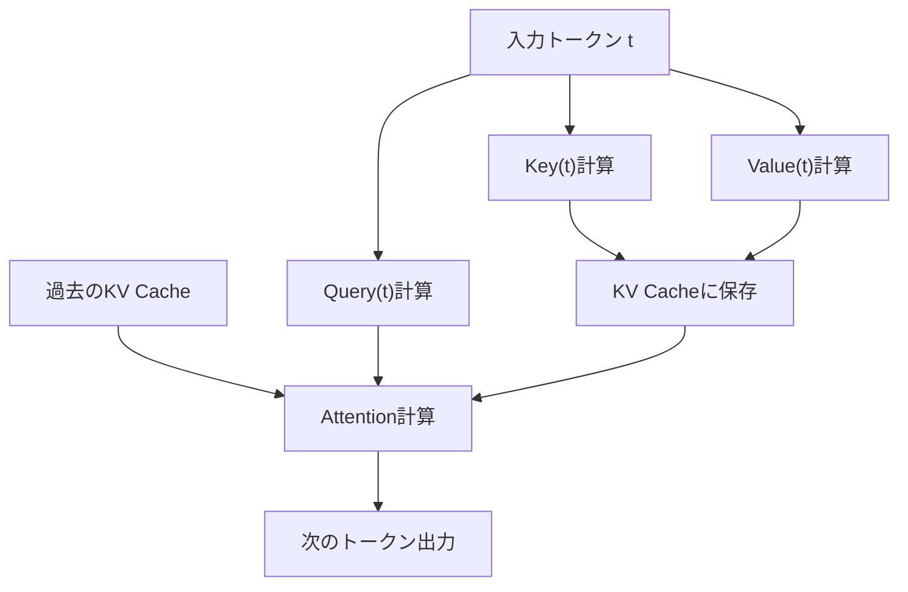
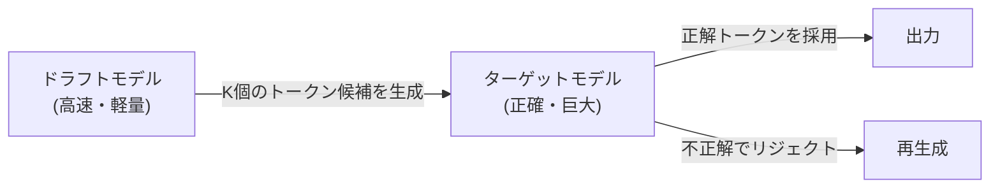

## 1. Pendahuluan: "Dinding Tak Terlihat" dalam Inferensi LLM

AI modern, terutama Large Language Models (LLM), telah mengubah pengalaman digital kita secara mendasar. Namun, ketika mencoba menjalankan model raksasa yang beroperasi di balik ChatGPT atau Claude pada infrastruktur internal atau PC lokal, banyak pengembang menghadapi hambatan besar berupa "kecepatan inferensi yang lambat".

Mengapa inferensi LLM lambat? Banyak orang cenderung berpikir, "Kita butuh GPU karena jumlah perhitungan (FLOPS) tidak cukup." Padahal, pada fase inferensi, terutama saat pembuatan teks dengan ukuran batch 1 (atau kecil), **yang menjadi hambatan (bottleneck) bukanlah kemampuan komputasi, melainkan bandwidth memori (Memory Bandwidth)**.

Dalam artikel ini, kami akan mengungkap hakikat "dinding bandwidth memori" dalam inferensi LLM, dan membahas secara mendalam mekanisme teknologi mutakhir untuk mengatasinya, baik dari sisi perangkat keras maupun perangkat lunak, seperti **KV Cache (Key-Value Cache)**, **PagedAttention**, **Speculative Decoding**, dan **Quantization (Kuantisasi)**.

---

## 2. Pembuatan Autoregressive Transformer dan Hambatan Komputasi

### 2.1 Mekanisme Autoregressive (Regresi Otomatis)
Model decoder berbasis Transformer, yang merupakan arus utama LLM, menghasilkan teks menggunakan metode yang disebut "autoregressive". Ini adalah proses memprediksi satu token berikutnya dari semua token masa lalu.

Jika dinyatakan dalam rumus, probabilitas token $x_t$ pada langkah $t$ tertentu dihitung sebagai berikut:
$P(x_t | x_1, x_2, ..., x_{t-1})$

Proses ini bersifat berurutan (sekuensial) dan tidak dapat diparalelkan. Untuk melakukan komputasi pada langkah $t+1$, token yang dihasilkan pada langkah $t$ harus sudah dipastikan.

### 2.2 Dua Fase Saat Inferensi
Inferensi secara garis besar terdiri dari dua fase berikut:

1. **Fase Prefill (Pengisian Awal)**: 
   Fase memproses seluruh prompt masukan (input) sekaligus dan membangun keadaan awal. Di sini, komputasi paralel dimungkinkan, dan karena dapat memanfaatkan kemampuan komputasi (FLOPS) GPU sepenuhnya, fase ini menjadi **Compute-bound (terbatas oleh komputasi)**.
2. **Fase Decode (Dekode)**: 
   Fase menghasilkan token satu per satu setelah prefill selesai. Ini adalah proses autoregressive, dan setiap kali token baru dihasilkan, seluruh bobot model harus dibaca dari memori. Oleh karena itu, fase ini menjadi **Memory-bound (terbatas oleh memori)**.

### 2.3 Dinding Bandwidth Memori (Memory Bandwidth Wall)
Sebagai contoh, jika kita menjalankan model dengan jumlah parameter 70B (70 miliar) dalam FP16 (floating point 16-bit), data bobot model akan menjadi sekitar 140GB. Setiap kali satu token dihasilkan, 140GB data ini harus ditransfer dari HBM (High Bandwidth Memory) GPU ke unit komputasi (SRAM/Core).

Bahkan jika bandwidth memori GPU adalah 2TB/s, mentransfer 140GB membutuhkan waktu $140 / 2000 = 0.07$ detik. Dengan kata lain, seberapa cepat pun komputasinya, terdapat batas fisik di mana maksimal hanya sekitar 14 token per detik yang dapat dihasilkan. Inilah yang disebut "dinding bandwidth memori".

---

## 3. Dasar-dasar KV Cache (Key-Value Cache)

### 3.1 Mencegah Komputasi Ulang Mekanisme Attention
Dalam pembuatan autoregressive, menghitung ulang Attention untuk semua token masa lalu di setiap langkah sangatlah tidak efisien.

Dalam komputasi Attention, setiap token diubah menjadi vektor **Query (Q)**, **Key (K)**, dan **Value (V)**.
Saat menghasilkan token baru $x_t$, nilai K dan V dari token masa lalu ($x_1$ hingga $x_{t-1}$) sudah dihitung dan tidak berubah.

Oleh karena itu, muncullah metode di mana K dan V dari token masa lalu disimpan (di-cache) di memori GPU, dan komputasi Attention hanya menggunakan Q dari token baru beserta K dan V yang di-cache. Inilah yang disebut **KV Cache (Key-Value Cache)**.

### 3.2 Masalah Konsumsi Memori KV Cache
Meskipun KV Cache secara signifikan mengurangi jumlah komputasi, sebagai gantinya ia mengonsumsi memori yang sangat besar.
Ketika ukuran batch membesar atau panjang konteks (panjang urutan) bertambah, ukuran KV Cache akan meningkat secara linier, dan dengan cepat akan menempati puluhan GB memori.

Jika dirumuskan, ukuran KV Cache adalah sebagai berikut:
`Jumlah Memori = 2 (K dan V) * Ukuran Batch * Panjang Urutan * Jumlah Lapisan * Jumlah Head * Dimensi Head * Jumlah Byte`

Bagaimana mengelola cache raksasa ini menjadi tantangan terbesar bagi server inferensi LLM.

---

## 4. Inovasi Manajemen Memori dengan PagedAttention

Pada mesin inferensi konvensional, area memori raksasa yang berdekatan dialokasikan sebelumnya untuk KV Cache. Namun, karena panjang teks yang dihasilkan tidak dapat diprediksi, hal ini menyebabkan terjadinya **fragmentasi internal (Internal Fragmentation)** dan **fragmentasi eksternal (External Fragmentation)** pada memori, sehingga hingga 60%–80% memori terbuang sia-sia.

### 4.1 Belajar dari Memori Virtual OS
Masalah ini diselesaikan oleh **PagedAttention**, yang diimplementasikan dalam `vLLM` yang dikembangkan oleh tim peneliti UC Berkeley. Metode ini menerapkan konsep "paging" dalam memori virtual OS pada manajemen KV Cache.

Dalam PagedAttention, KV Cache dibagi menjadi "blok-blok" dengan ukuran tetap, dan didistribusikan ke ruang memori fisik yang tidak berdekatan. Blok-blok ini diperlakukan sebagai blok yang berdekatan secara virtual, dan pemetaan dari blok logis ke blok fisik dikelola oleh sebuah tabel blok.

### 4.2 Keuntungan PagedAttention
- **Menghilangkan Pemborosan Memori**: Karena blok hanya dialokasikan sesuai kebutuhan, fragmentasi internal dapat ditekan hingga hampir nol (kurang dari beberapa persen).
- **Batching yang Efisien**: Lebih banyak permintaan dapat dimasukkan ke dalam memori yang terbatas, yang secara dramatis meningkatkan throughput sistem secara keseluruhan.
- **Berbagi Memori (Memory Sharing)**: Dalam metode decoding seperti Beam Search, KV Cache dapat dibagikan dengan aman (Copy-on-Write) di antara beberapa urutan yang diturunkan dari prompt yang sama.

---

## 5. Speculative Decoding: Pergeseran Paradigma Menuju Paralelisasi

Meskipun optimisasi KV Cache berkontribusi pada perbaikan memori dan throughput, hal ini pada dasarnya tidak memperbaiki **latensi** saat ukuran batch adalah 1. Algoritme inovatif untuk mengatasi "dinding bandwidth memori" yang disebutkan sebelumnya adalah **Speculative Decoding (Dekode Spekulatif)**.

### 5.1 Mengonfirmasi Kembali Mengapa Lambat
Saat menjalankan model raksasa (model target), lambatnya proses disebabkan oleh pembacaan bobot dari memori. Di sisi lain, jika menggunakan model kecil (model draft), pembacaan bobot dapat diselesaikan dalam sekejap.

### 5.2 Mekanisme Speculative Decoding
Speculative Decoding menggabungkan dua langkah: "Dugaan (Drafting)" dan "Verifikasi (Verification)".

1. **Fase Dugaan (Drafting)**:
   Menggunakan model draft yang kecil dan cepat (contoh: miliaran parameter), memprediksi $K$ token masa depan secara autoregressive dengan kecepatan tinggi.
   Contoh: "Ibu", "kota", "Jepang", "adalah", "Tokyo"

2. **Fase Verifikasi (Verification)**:
   Meneruskan $K$ token yang didugakan tersebut ke model target sekaligus. Model target mengevaluasi ini dalam 1 kali Forward pass (komputasi paralel), dan memverifikasi apakah setiap token benar.
   - Jika benar sampai "Tokyo" namun "adalah" salah, maka dugaan akan diulang dari titik yang salah.

### 5.3 Jaminan Akurasi Matematis
Yang mengejutkan, Speculative Decoding menjamin **distribusi probabilitas output yang secara matematis sama persis** dengan saat membuat secara autoregressive hanya menggunakan model target. Ini bukan algoritme perkiraan (approximation). Dengan menerapkan teknologi Rejection Sampling (Pengambilan Sampel Penolakan), ini adalah teknologi inovatif yang mampu meningkatkan kecepatan 2 hingga 3 kali lipat tanpa menurunkan kualitas sama sekali.

---

## 6. Kuantisasi (Quantization) dan Kebangkitan Local LLM

Pendekatan kuat lainnya untuk mendobrak dinding bandwidth memori adalah **Kuantisasi (Quantization)**, yaitu memperkecil ukuran bobot model itu sendiri. Jika ukuran bobot menjadi setengahnya, waktu pembacaan dari memori juga akan menjadi setengah, sehingga meningkatkan kecepatan inferensi.

### 6.1 llama.cpp dan GGML/GGUF
Pemicu utama pergerakan untuk menjalankan LLM secara lokal adalah `llama.cpp`. Pustaka yang diimplementasikan dalam C/C++ ini memungkinkan LLM berjalan dengan kecepatan luar biasa di Mac seri M Apple serta CPU/GPU umum.

Inti dari hal tersebut adalah format dan teknologi kuantisasi yang disebut `GGUF` (sebelumnya GGML).
Bobot yang biasanya direpresentasikan dalam 16-bit (FP16/BF16), dikompresi menjadi bilangan bulat 4-bit atau 8-bit (INT4/INT8).

### 6.2 Algoritme Kuantisasi Tingkat Lanjut
Karena pembulatan sederhana akan sangat menurunkan akurasi model, teknologi canggih berikut digunakan:

- **GPTQ**: Saat mengkuantisasi bobot model, metode ini menggunakan informasi turunan kedua (Matriks Hessian) untuk mengoreksi kesalahan kuantisasi sehingga dampaknya terhadap akurasi menjadi minimal.
- **AWQ (Activation-aware Weight Quantization)**: Tidak hanya distribusi bobot itu sendiri, metode ini juga mempertimbangkan distribusi "aktivasi" saat inferensi sebenarnya. Sejumlah kecil bobot penting (sekitar 1% dari total) dibiarkan dengan presisi tinggi, dan sisanya dikuantisasi dengan kuat untuk mencegah penurunan kualitas.
- **ExLlamaV2**: Versi GPTQ yang lebih cepat, yang mendukung bitrate variabel (contoh: rata-rata 4.5 bit), dan mengalokasikan jumlah bit berdasarkan tingkat kepentingan lapisan.

---

## 7. Kesimpulan dan Prospek Masa Depan

Inferensi LLM telah berevolusi dari bayangan sederhana "operasi matriks raksasa" menjadi **"rekayasa sistem yang mengoptimalkan bandwidth memori hingga batas maksimal"**.

- **KV Cache** menghilangkan pemborosan komputasi,
- **PagedAttention** menghilangkan pemborosan ruang memori,
- **Speculative Decoding** mengatasi hambatan pemrosesan sekuensial dan menghadirkan paralelisasi, dan
- **Kuantisasi** mengurangi jumlah pergerakan data secara fisik.

Teknologi-teknologi ini tidak berdiri sendiri, melainkan digunakan secara kombinasi. Misalnya, dengan menggunakan PagedAttention pada model yang telah dikuantisasi, ditambah lagi dengan Speculative Decoding, era di mana model yang dulunya membutuhkan superkomputer kini dapat berjalan secara real-time di PC desktop pribadi dan perangkat edge (edge devices) telah tiba.

Di masa depan, dengan munculnya arsitektur baru pengganti Transformer seperti Mamba dan RWKV (model ruang keadaan/State Space Model ala RNN), mungkin akan datang masa di mana KV Cache itu sendiri tidak lagi dibutuhkan, atau bentuk manajemen memori yang sama sekali baru akan diperlukan. Kita tidak bisa melepaskan pandangan dari bidang ini, di mana evolusi perangkat keras dan inovasi algoritme saling bersilangan.
