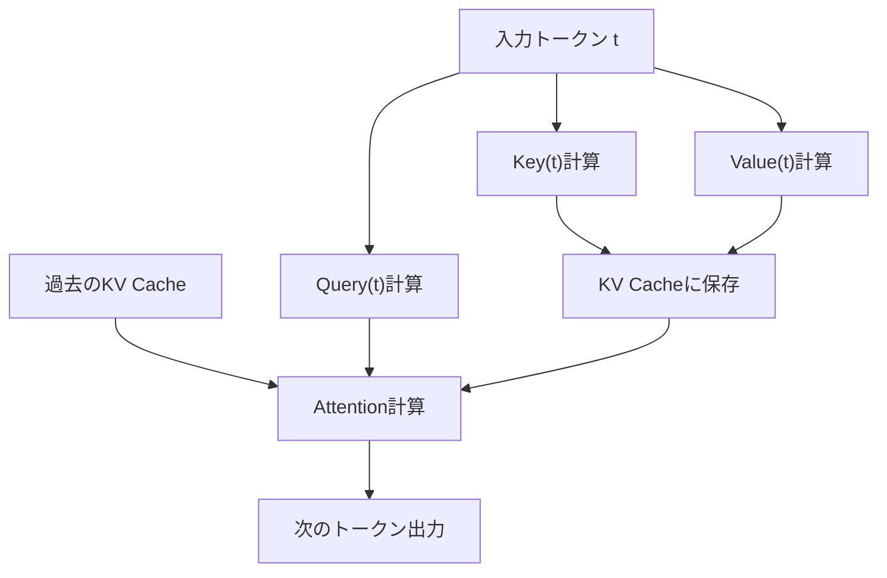
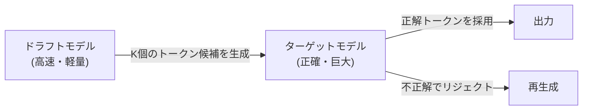

## 1. 서론: LLM 추론에 있어서의 '보이지 않는 벽'

현대의 AI, 특히 대규모 언어 모델(LLM)은 우리의 디지털 경험을 근본적으로 변혁시켰습니다. 하지만 ChatGPT나 Claude 등의 배후에서 가동되고 있는 거대한 모델을 자사 인프라나 로컬 PC에서 구동하려고 할 때, 많은 개발자는 '추론 속도의 느림'이라는 높은 벽에 직면하게 됩니다.

왜 LLM의 추론은 느린 것일까요? 많은 사람은 '계산량(FLOPS)이 부족하기 때문에 GPU가 필요하다'고 생각하기 쉽지만, 사실 추론 단계, 특히 배치 크기가 1(혹은 작은)인 텍스트 생성 시에는 **계산 능력이 아니라 메모리 대역폭(Memory Bandwidth)이 병목 현상**이 되고 있습니다.

본 기사에서는 LLM 추론에 있어서 이 '메모리 대역폭의 벽'의 정체를 밝혀내고, 이를 극복하기 위한 최첨단 기술인 **KV 캐시(Key-Value Cache)**, **PagedAttention**, **투기적 디코딩(Speculative Decoding)**, 그리고 **양자화(Quantization)**의 메커니즘에 대해 하드웨어와 소프트웨어 양면에서 깊이 파헤쳐 해설합니다.

---

## 2. Transformer의 자기회귀 생성과 계산의 병목 현상

### 2.1 자기회귀(Autoregressive)의 원리
LLM의 주류인 Transformer 기반의 디코더 모델은 '자기회귀'라는 기법으로 텍스트를 생성합니다. 이는 과거의 모든 토큰으로부터 다음 1개의 토큰을 예측하는 프로세스입니다.

수식으로 나타내면, 어느 단계 $t$에서의 토큰 $x_t$의 확률은 다음과 같이 계산됩니다.
$P(x_t | x_1, x_2, ..., x_{t-1})$

이 프로세스는 순차적이며 병렬화할 수 없습니다. 단계 $t+1$의 계산을 수행하기 위해서는 단계 $t$에서 생성된 토큰이 확정되어 있어야 합니다.

### 2.2 추론 시의 두 가지 단계
추론은 크게 나누어 다음의 두 가지 단계로 구성됩니다.

1. **Prefill(프리필) 단계**: 
   입력된 프롬프트 전체를 한 번에 처리하여 초기 상태를 구축하는 단계. 여기서는 병렬 계산이 가능하며 GPU의 계산 능력(FLOPS)을 최대한 활용할 수 있기 때문에 **Compute-bound(계산 바운드)**가 됩니다.
2. **Decode(디코드) 단계**: 
   프리필 완료 후 토큰을 하나씩 생성하는 단계. 여기가 자기회귀 프로세스이며, 새로운 토큰을 생성할 때마다 모델 전체의 가중치를 메모리에서 읽어와야 합니다. 그 때문에 **Memory-bound(메모리 대역폭 바운드)**가 됩니다.

### 2.3 메모리 대역폭의 벽(Memory Bandwidth Wall)
예를 들어, 파라미터 수가 70B(700억)인 모델을 FP16(16비트 부동소수점)으로 동작시킬 경우, 모델의 가중치 데이터는 약 140GB가 됩니다. 토큰을 1개 생성할 때마다 이 140GB의 데이터를 GPU의 HBM(High Bandwidth Memory)에서 연산기(SRAM/Core)로 전송해야 합니다.

가령 GPU의 메모리 대역폭이 2TB/s라고 하더라도, 140GB의 전송에는 $140 / 2000 = 0.07$ 초가 걸립니다. 즉, 계산이 아무리 빠르더라도 최대 초당 약 14토큰밖에 생성할 수 없다는 물리적인 한계가 존재하는 것입니다. 이것이 '메모리 대역폭의 벽'입니다.

---

## 3. KV 캐시(Key-Value Cache)의 기초

### 3.1 Attention 메커니즘의 재계산을 방지
자기회귀 생성에 있어서 각 단계마다 과거의 모든 토큰에 대한 Attention(주의)을 다시 계산하는 것은 매우 비효율적입니다.

Attention의 계산에서는 각 토큰이 **Query (Q)**, **Key (K)**, **Value (V)** 벡터로 변환됩니다.
새로운 토큰 $x_t$를 생성할 때, 과거의 토큰($x_1$부터 $x_{t-1}$까지)의 K와 V는 이미 계산이 완료되어 불변합니다.

그래서 과거 토큰의 K와 V를 GPU의 메모리에 저장(캐시)해 두고, 새로운 토큰의 Q와 캐시된 K, V만을 사용하여 Attention을 계산하는 기법이 고안되었습니다. 이것이 **KV 캐시(Key-Value Cache)**입니다.

### 3.2 KV 캐시의 메모리 소비 문제
KV 캐시는 계산량을 대폭 줄여주지만, 그 대가로 막대한 메모리를 소비합니다.
배치 크기가 커지거나 컨텍스트 길이(시퀀스 길이)가 길어지면 KV 캐시의 크기는 선형적으로 증가하여, 순식간에 수십 GB의 메모리를 점유해 버립니다.

식으로 나타내면 KV 캐시의 크기는 다음과 같습니다.
`메모리 양 = 2 (K와 V) * 배치 크기 * 시퀀스 길이 * 레이어 수 * 헤더 수 * 헤드의 차원 * 바이트 수`

이 거대한 캐시를 어떻게 관리할 것인가가 LLM 추론 서버의 가장 큰 과제가 됩니다.

---

## 4. PagedAttention에 의한 메모리 관리의 혁신

기존의 추론 엔진에서는 KV 캐시를 위해 미리 연속된 거대한 메모리 영역을 확보하고 있었습니다. 하지만 생성되는 텍스트의 길이는 예측이 불가능하기 때문에 메모리의 **내부 단편화(Internal Fragmentation)**나 **외부 단편화(External Fragmentation)**가 발생하여 최대 60%~80%의 메모리가 낭비되고 있었습니다.

### 4.1 OS의 가상 메모리에서 배우다
이 문제를 해결한 것이 UC Berkeley의 연구팀이 개발한 `vLLM`에 구현된 **PagedAttention**입니다. 이는 OS의 가상 메모리에서의 '페이징' 개념을 KV 캐시 관리에 응용한 것입니다.

PagedAttention에서는 KV 캐시를 고정된 크기의 '블록'으로 분할하여, 연속되지 않은 물리 메모리 공간에 분산하여 배치합니다. 가상적으로 연속된 블록으로 취급하고, 논리 블록에서 물리 블록으로의 매핑을 블록 테이블로 관리합니다.

### 4.2 PagedAttention의 장점
- **메모리 낭비 배제**: 필요한 만큼만 블록을 할당하기 때문에 내부 단편화를 거의 제로(수 퍼센트 미만)로 억제합니다.
- **효율적인 배칭**: 제한된 메모리에 더 많은 요청을 채워 넣을 수 있어 시스템 전체의 처리량(스루풋)이 극적으로 향상됩니다.
- **메모리 공유**: Beam Search와 같은 디코딩 기법에서, 같은 프롬프트에서 파생되는 여러 시퀀스 간에 KV 캐시를 안전하게 공유(Copy-on-Write)하는 것이 가능해집니다.

---

## 5. 투기적 디코딩(Speculative Decoding): 병렬화로의 패러다임 시프트

KV 캐시의 최적화는 메모리와 스루풋의 개선에 기여하지만, 배치 크기가 1일 때의 **지연(레이턴시)**을 근본적으로 개선하는 것은 아닙니다. 앞서 언급한 '메모리 대역폭의 벽'을 넘기 위한 혁신적인 알고리즘이 **투기적 디코딩(Speculative Decoding)**입니다.

### 5.1 왜 느린 것인지에 대한 재확인
거대한 모델(타깃 모델)을 구동할 때, 가중치를 메모리에서 읽어오는 것이 느립니다. 반면, 작은 모델(드래프트 모델)이라면 가중치를 읽어오는 것은 순식간에 끝납니다.

### 5.2 투기적 디코딩의 원리
투기적 디코딩은 '추측(Drafting)'과 '검증(Verification)'이라는 2개의 단계를 조합합니다.

1. **추측(Drafting) 단계**:
   작고 고속인 드래프트 모델(예: 수십억 파라미터)을 사용하여, 자기회귀적으로 미래의 $K$개 토큰을 고속으로 예측합니다.
   예: "일본의", "수도", "는", "도쿄", "입니다"

2. **검증(Verification) 단계**:
   추측된 $K$개의 토큰을 타깃 모델에 한 번에 전달합니다. 타깃 모델은 이를 1회의 Forward 패스(병렬 계산)로 평가하여, 각 토큰이 올바른지 여부를 검증합니다.
   - 만약 "도쿄"까지 맞고 "입니다"가 틀렸을 경우, 틀렸던 부분부터 다시 추측을 재개합니다.

### 5.3 수학적 정확성의 보장
놀랍게도, 투기적 디코딩은 타깃 모델 단독으로 자기회귀 생성을 했을 경우와 **수학적으로 완전히 동일한 출력 확률 분포**를 보장합니다. 근사 알고리즘이 아닙니다. 리젝션 샘플링(Rejection Sampling) 기술을 응용함으로써 품질을 전혀 떨어뜨리지 않고 속도만을 2배~3배로 끌어올릴 수 있는 획기적인 기술입니다.

---

## 6. 양자화(Quantization)와 로컬 LLM의 대두

메모리 대역폭의 벽을 타파하는 또 다른 강력한 접근 방식이 모델의 가중치 자체의 크기를 작게 하는 **양자화(Quantization)**입니다. 가중치의 크기가 절반이 되면 메모리에서의 읽기 시간도 절반이 되어 추론 속도가 향상됩니다.

### 6.1 llama.cpp와 GGML/GGUF
로컬에서 LLM을 구동하는 움직임의 도화선이 된 것이 `llama.cpp`입니다. C/C++로 구현된 이 라이브러리는 Apple M 시리즈의 Mac이나 일반적인 CPU/GPU 상에서 경이로운 속도로 LLM을 동작시킵니다.

그 핵심에 있는 것이 `GGUF`(구 GGML)라는 포맷과 양자화 기술입니다.
통상 16비트(FP16/BF16)로 표현되는 가중치를 4비트나 8비트 정수(INT4/INT8)로 압축합니다.

### 6.2 고도화된 양자화 알고리즘
단순한 반올림으로는 모델의 정밀도가 크게 열화되어 버리기 때문에 다음과 같은 고도화된 기술이 사용되고 있습니다.

- **GPTQ**: 모델의 가중치를 양자화할 때, 2차 미분(Hessian 행렬) 정보를 이용하여 정밀도에 미치는 영향이 최소화되도록 양자화의 오차를 보정하는 기법.
- **AWQ (Activation-aware Weight Quantization)**: 가중치 자체의 분포뿐만 아니라 실제 추론 시의 '액티베이션(발화)' 분포를 고려합니다. 소수의 중요한 가중치(전체의 1% 정도)는 고정밀도인 채로 남기고, 그 외를 강하게 양자화함으로써 품질의 열화를 방지합니다.
- **ExLlamaV2**: GPTQ를 더욱 고속화한 것으로, 가변 비트레이트(예: 평균 4.5비트 등)를 지원하며 층의 중요도에 따라 비트 수를 할당합니다.

---

## 7. 요약 및 향후 전망

LLM의 추론은 '거대한 행렬 연산'이라는 단순한 이미지에서 **'극한까지 메모리 대역폭을 최적화하는 시스템 공학'**으로 진화하고 있습니다.

- **KV 캐시**는 계산의 낭비를 줄이고,
- **PagedAttention**은 메모리 공간의 낭비를 줄이며,
- **투기적 디코딩**은 순차 처리의 벽을 넘어 병렬화를 가져오고,
- **양자화**는 물리적인 데이터 이동량을 삭감했습니다.

이러한 기술들은 독립적인 것이 아니라 조합되어 사용됩니다. 예를 들어, 양자화된 모델에 대해 PagedAttention을 사용하고, 나아가 투기적 디코딩을 조합함으로써 예전에는 슈퍼컴퓨터가 필요했던 모델이 개인 데스크탑 PC나 엣지 디바이스 상에서 실시간으로 동작하는 시대가 도래하고 있습니다.

향후에는 Mamba나 RWKV와 같은 Transformer를 대체할 새로운 아키텍처(RNN과 유사한 상태 공간 모델)의 대두로 인해 KV 캐시 자체가 불필요해지거나, 혹은 완전히 새로운 형태의 메모리 관리가 필요해질 미래도 생각해 볼 수 있습니다. 하드웨어의 진화와 알고리즘의 혁신이 교차하는 이 분야에서 앞으로도 눈을 뗄 수 없습니다.
