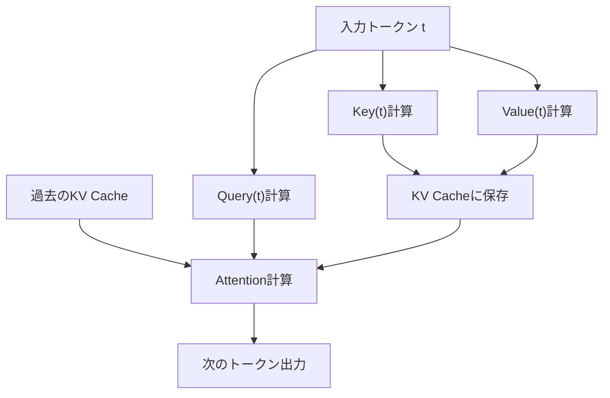
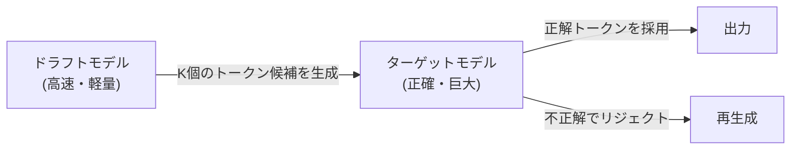

## 1. はじめに：LLM推論における「見えない壁」

現代のAI、特に大規模言語モデル（LLM）は私たちのデジタル体験を根本から変革しました。しかし、ChatGPTやClaudeなどの背後で稼働している巨大なモデルを自社インフラやローカルPCで動かそうとしたとき、多くの開発者は「推論速度の遅さ」という高い壁に直面します。

なぜLLMの推論は遅いのでしょうか？多くの人は「計算量（FLOPS）が足りないからGPUが必要だ」と考えがちですが、実は推論フェーズ、特にバッチサイズが1（あるいは小さい）のテキスト生成時においては、**計算能力ではなくメモリ帯域幅（Memory Bandwidth）がボトルネック**になっています。

本記事では、LLM推論におけるこの「メモリ帯域の壁」の正体を解き明かし、それを克服するための最先端の技術である**KVキャッシュ（Key-Value Cache）**、**PagedAttention**、**投機的デコード（Speculative Decoding）**、そして**量子化（Quantization）**のメカニズムについて、ハードウェアとソフトウェアの両面から深く掘り下げて解説します。

---

## 2. Transformerの自己回帰生成と計算のボトルネック

### 2.1 自己回帰（Autoregressive）の仕組み
LLMの主流であるTransformerベースのデコーダモデルは、「自己回帰」という手法でテキストを生成します。これは、過去のすべてのトークンから次の1つのトークンを予測するプロセスです。

数式で表すと、あるステップ $t$ におけるトークン $x_t$ の確率は以下のように計算されます。
$P(x_t | x_1, x_2, ..., x_{t-1})$

このプロセスは逐次的であり、並列化ができません。ステップ $t+1$ の計算を行うためには、ステップ $t$ で生成されたトークンが確定している必要があります。

### 2.2 推論時の2つのフェーズ
推論は大きく分けて以下の2つのフェーズで構成されます。

1. **Prefill（プレフィル）フェーズ**: 
   入力されたプロンプト全体を一度に処理し、初期状態を構築するフェーズ。ここでは並列計算が可能であり、GPUの計算能力（FLOPS）をフルに活用できるため、**Compute-bound（計算律速）**になります。
2. **Decode（デコード）フェーズ**: 
   プレフィル完了後、トークンを1つずつ生成するフェーズ。ここが自己回帰プロセスであり、新しいトークンを生成するたびにモデル全体の重みをメモリから読み出す必要があります。そのため、**Memory-bound（メモリ帯域律速）**となります。

### 2.3 メモリ帯域幅の壁（Memory Bandwidth Wall）
例えば、パラメータ数が70B（700億）のモデルをFP16（16ビット浮動小数点）で動作させる場合、モデルの重みデータは約140GBになります。トークンを1つ生成するたびに、この140GBのデータをGPUのHBM（High Bandwidth Memory）から演算器（SRAM/Core）へ転送しなければなりません。

仮にGPUのメモリ帯域幅が2TB/sだとしても、140GBの転送には $140 / 2000 = 0.07$ 秒かかります。つまり、計算がどれだけ速くても、最大で秒間約14トークンしか生成できないという物理的な限界が存在するのです。これが「メモリ帯域幅の壁」です。

---

## 3. KVキャッシュ（Key-Value Cache）の基礎

### 3.1 Attention機構の再計算を防ぐ
自己回帰生成において、各ステップで過去のすべてのトークンに対するAttention（注意）を計算し直すのは非常に非効率です。

Attentionの計算では、各トークンが **Query (Q)**、**Key (K)**、**Value (V)** のベクトルに変換されます。
新しいトークン $x_t$ を生成する際、過去のトークン（$x_1$ から $x_{t-1}$）の K と V はすでに計算済みであり、不変です。

そこで、過去のトークンの K と V をGPUのメモリに保存（キャッシュ）しておき、新しいトークンの Q と、キャッシュされた K, V のみを使ってAttentionを計算する手法が考案されました。これが **KVキャッシュ（Key-Value Cache）** です。

### 3.2 KVキャッシュのメモリ消費問題
KVキャッシュは計算量を大幅に削減しますが、代償として莫大なメモリを消費します。
バッチサイズが大きくなったり、コンテキスト長（シーケンス長）が長くなったりすると、KVキャッシュのサイズは線形に増加し、あっという間に数十GBのメモリを占有してしまいます。

式にすると、KVキャッシュのサイズは以下のようになります。
`メモリ量 = 2 (KとV) * バッチサイズ * シーケンス長 * レイヤー数 * ヘッダ数 * ヘッドの次元 * バイト数`

この巨大なキャッシュをどのように管理するかが、LLM推論サーバーの最大の課題となります。

---

## 4. PagedAttentionによるメモリ管理の革新

従来の推論エンジンでは、KVキャッシュのためにあらかじめ連続した巨大なメモリ領域を確保していました。しかし、生成されるテキストの長さは予測不可能であるため、メモリの**内部断片化（Internal Fragmentation）**や**外部断片化（External Fragmentation）**が発生し、最大で60%〜80%のメモリが無駄になっていました。

### 4.1 OSの仮想メモリに学ぶ
この問題を解決したのが、UC Berkeleyの研究チームが開発した `vLLM` に実装されている **PagedAttention** です。これは、OSの仮想メモリにおける「ページング」の概念をKVキャッシュ管理に応用したものです。

PagedAttentionでは、KVキャッシュを固定サイズの「ブロック」に分割し、連続していない物理メモリ空間に分散して配置します。仮想的に連続したブロックとして扱い、論理ブロックから物理ブロックへのマッピングをブロックテーブルで管理します。

### 4.2 PagedAttentionのメリット
- **メモリの無駄を排除**: 必要な分だけブロックを割り当てるため、内部断片化をほぼゼロ（数パーセント未満）に抑えます。
- **効率的なバッチング**: 限られたメモリにより多くのリクエストを詰め込むことができ、システム全体のスループットが劇的に向上します。
- **メモリの共有**: Beam Searchのようなデコード手法において、同じプロンプトから派生する複数のシーケンス間でKVキャッシュを安全に共有（Copy-on-Write）することが可能になります。

---

## 5. 投機的デコード（Speculative Decoding）: 並列化へのパラダイムシフト

KVキャッシュの最適化はメモリとスループットの改善に寄与しますが、バッチサイズが1の時の**遅延（レイテンシ）**を根本的に改善するものではありません。前述の「メモリ帯域幅の壁」を超えるための革新的なアルゴリズムが **投機的デコード（Speculative Decoding）** です。

### 5.1 なぜ遅いのかの再確認
巨大なモデル（ターゲットモデル）を動かす際、重みをメモリから読み出すのが遅いのです。一方、小さなモデル（ドラフトモデル）であれば、重みの読み込みは一瞬で終わります。

### 5.2 投機的デコードの仕組み
投機的デコードは、「推測（Drafting）」と「検証（Verification）」の2つのステップを組み合わせます。

1. **推測（Drafting）フェーズ**:
   小さくて高速なドラフトモデル（例: 数十億パラメータ）を使って、自己回帰的に未来の $K$ 個のトークンを高速に予測します。
   例: 「日本の」「首都」「は」「東京」「です」

2. **検証（Verification）フェーズ**:
   推測された $K$ 個のトークンをターゲットモデルに一度に渡します。ターゲットモデルはこれを1回のForwardパス（並列計算）で評価し、各トークンが正しいかどうかを検証します。
   - もし「東京」まで合っていて「です」が間違っていた場合、間違っていた箇所から再度推測をやり直します。

### 5.3 数学的な正確性の保証
驚くべきことに、投機的デコードはターゲットモデル単体で自己回帰生成した場合と**数学的に全く同じ出力確率分布**を保証します。近似アルゴリズムではありません。リジェクション・サンプリング（Rejection Sampling）の技術を応用することで、品質を一切落とさずに速度だけを2倍〜3倍に引き上げることができる画期的な技術です。

---

## 6. 量子化（Quantization）とローカルLLMの台頭

メモリ帯域幅の壁を打ち破るもう一つの強力なアプローチが、モデルの重み自体のサイズを小さくする**量子化（Quantization）**です。重みのサイズが半分になれば、メモリからの読み込み時間も半分になり、推論速度が向上します。

### 6.1 llama.cppとGGML/GGUF
ローカルでLLMを動かすムーブメントの火付け役となったのが `llama.cpp` です。C/C++で実装されたこのライブラリは、Apple MシリーズのMacや一般的なCPU/GPU上で驚異的な速度でLLMを動作させます。

その中核にあるのが `GGUF`（旧GGML）というフォーマットと量子化技術です。
通常16ビット（FP16/BF16）で表現される重みを、4ビットや8ビットの整数（INT4/INT8）に圧縮します。

### 6.2 高度な量子化アルゴリズム
単純な丸め込みではモデルの精度が大きく劣化してしまうため、以下のような高度な技術が用いられています。

- **GPTQ**: モデルの重みを量子化する際、二次微分（Hessian行列）の情報を利用して、精度への影響が最小になるように量子化の誤差を補正する手法。
- **AWQ (Activation-aware Weight Quantization)**: 重みそのものの分布だけでなく、実際の推論時における「アクティベーション（発火）」の分布を考慮します。少数の重要な重み（全体の1%程度）は高精度なまま残し、それ以外を強く量子化することで、品質の劣化を防ぎます。
- **ExLlamaV2**: GPTQをさらに高速化したもので、可変ビットレート（例: 平均4.5ビットなど）をサポートし、層の重要度に応じてビット数を割り当てます。

---

## 7. まとめと今後の展望

LLMの推論は、「巨大な行列演算」という単純なイメージから、**「極限までメモリ帯域を最適化するシステム工学」**へと進化しています。

- **KVキャッシュ**は計算の無駄を省き、
- **PagedAttention**はメモリ空間の無駄を省き、
- **投機的デコード**は逐次処理の壁を越えて並列化をもたらし、
- **量子化**は物理的なデータ移動量を削減しました。

これらの技術は独立しているわけではなく、組み合わせて使用されます。例えば、量子化されたモデルに対してPagedAttentionを用い、さらに投機的デコードを組み合わせることで、かつてはスーパーコンピュータが必要だったモデルが、個人のデスクトップPCやエッジデバイス上でリアルタイムに動作する時代が到来しています。

今後は、MambaやRWKVといったTransformerに代わる新しいアーキテクチャ（RNNライクな状態空間モデル）の台頭により、KVキャッシュそのものが不要になる、あるいは全く新しい形のメモリ管理が必要になる未来も考えられます。ハードウェアの進化とアルゴリズムのイノベーションが交差するこの分野から、今後も目が離せません。
