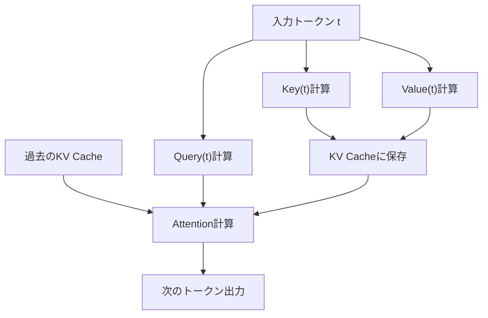
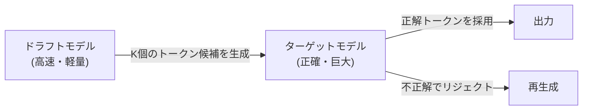

## 1. Introdução: A 'Barreira Invisível' na Inferência de LLMs

A IA moderna, especialmente os Grandes Modelos de Linguagem (LLMs), transformou fundamentalmente a nossa experiência digital. No entanto, ao tentar executar modelos gigantes que operam por trás do ChatGPT ou Claude na própria infraestrutura ou em um PC local, muitos desenvolvedores enfrentam a grande barreira da 'lentidão da velocidade de inferência'.

Por que a inferência de LLMs é lenta? Muitas pessoas tendem a pensar que 'como a quantidade de cálculo (FLOPS) é insuficiente, precisamos de uma GPU', mas na verdade, na fase de inferência, especialmente na geração de texto com um tamanho de lote (batch size) igual a 1 (ou pequeno), **o gargalo não é a capacidade de cálculo, mas a largura de banda de memória (Memory Bandwidth)**.

Neste artigo, desvendaremos a verdadeira natureza desta 'barreira da largura de banda de memória' na inferência de LLMs, e exploraremos profundamente, tanto do ponto de vista de hardware quanto de software, os mecanismos das tecnologias de ponta para superá-la: **Cache KV (Key-Value Cache)**, **PagedAttention**, **Decodificação Especulativa (Speculative Decoding)** e **Quantização (Quantization)**.

---

## 2. Geração Autorregressiva de Transformers e Gargalos Computacionais

### 2.1 O Mecanismo de Autorregressão (Autoregressive)
Os modelos de decodificador (decoder) baseados em Transformer, que são os principais LLMs, geram texto através de um método chamado 'autorregressão'. Trata-se de um processo de prever o próximo token único a partir de todos os tokens anteriores.

Expressado através de uma fórmula matemática, a probabilidade do token $x_t$ em um determinado passo $t$ é calculada da seguinte forma:
$P(x_t | x_1, x_2, ..., x_{t-1})$

Esse processo é sequencial e não pode ser paralelizado. Para realizar o cálculo do passo $t+1$, é necessário que o token gerado no passo $t$ esteja definido.

### 2.2 Duas Fases Durante a Inferência
A inferência é amplamente dividida nas seguintes duas fases:

1. **Fase de Prefill (Preenchimento)**: 
   Uma fase que processa todo o prompt de entrada de uma só vez e constrói o estado inicial. Como é possível fazer cálculos paralelos aqui, utilizando plenamente a capacidade de cálculo (FLOPS) da GPU, torna-se **limitada por computação (Compute-bound)**.
2. **Fase de Decode (Decodificação)**: 
   Uma fase onde, após a conclusão do prefill, os tokens são gerados um por um. Este é o processo autorregressivo, e a cada vez que um novo token é gerado, é necessário ler os pesos de todo o modelo da memória. Portanto, torna-se **limitada por largura de banda de memória (Memory-bound)**.

### 2.3 A Barreira da Largura de Banda de Memória (Memory Bandwidth Wall)
Por exemplo, ao operar um modelo com 70B (70 bilhões) de parâmetros em FP16 (ponto flutuante de 16 bits), os dados de peso do modelo terão cerca de 140GB. Cada vez que um token é gerado, esses 140GB de dados devem ser transferidos da HBM (High Bandwidth Memory) da GPU para a unidade de processamento (SRAM/Core).

Mesmo que a largura de banda de memória da GPU fosse de 2TB/s, a transferência de 140GB levaria $140 / 2000 = 0.07$ segundos. Ou seja, não importa o quão rápido seja o cálculo, existe um limite físico de que no máximo cerca de 14 tokens por segundo podem ser gerados. Esta é a 'barreira da largura de banda de memória'.

---

## 3. Fundamentos do Cache KV (Key-Value Cache)

### 3.1 Prevenindo Recálculos do Mecanismo de Atenção (Attention)
Na geração autorregressiva, recalcular a Atenção (Attention) para todos os tokens passados em cada passo é extremamente ineficiente.

No cálculo de Atenção, cada token é convertido em vetores de **Query (Q)**, **Key (K)** e **Value (V)**.
Ao gerar um novo token $x_t$, os K e V dos tokens passados (de $x_1$ a $x_{t-1}$) já foram calculados e são invariáveis.

Portanto, foi idealizado um método onde os K e V dos tokens passados são armazenados (em cache) na memória da GPU, e a Atenção é calculada usando apenas o Q do novo token e os K e V cacheados. Esse é o **Cache KV (Key-Value Cache)**.



### 3.2 O Problema de Consumo de Memória do Cache KV
O cache KV reduz drasticamente o custo computacional, mas, em troca, consome uma enorme quantidade de memória.
Se o tamanho do lote (batch size) se tornar grande, ou o comprimento do contexto (comprimento da sequência) se tornar longo, o tamanho do cache KV aumentará linearmente, ocupando dezenas de GB de memória em um piscar de olhos.

Expressado como uma fórmula, o tamanho do cache KV seria o seguinte:
`Quantidade de memória = 2 (K e V) * Tamanho do lote * Comprimento da sequência * Número de camadas * Número de cabeças (heads) * Dimensão da cabeça * Número de bytes`

Como gerenciar este enorme cache se torna o maior desafio dos servidores de inferência de LLM.

---

## 4. Inovação no Gerenciamento de Memória com o PagedAttention

Nos mecanismos de inferência convencionais, uma enorme área de memória contínua era alocada antecipadamente para o cache KV. No entanto, como o comprimento do texto gerado é imprevisível, ocorriam **fragmentação interna (Internal Fragmentation)** e **fragmentação externa (External Fragmentation)** de memória, desperdiçando no máximo de 60% a 80% da memória.

### 4.1 Aprendendo com a Memória Virtual do OS
O que resolveu este problema foi o **PagedAttention**, implementado no `vLLM` desenvolvido pela equipe de pesquisa da UC Berkeley. Trata-se da aplicação do conceito de 'paginação' na memória virtual de sistemas operacionais (OS) ao gerenciamento do cache KV.

No PagedAttention, o cache KV é dividido em 'blocos' de tamanho fixo, que são distribuídos e alocados de forma não contígua no espaço de memória física. Eles são tratados virtualmente como blocos contínuos, e o mapeamento de blocos lógicos para blocos físicos é gerenciado por uma tabela de blocos.

### 4.2 Vantagens do PagedAttention
- **Eliminação do desperdício de memória**: Como os blocos são alocados apenas na quantidade necessária, a fragmentação interna é mantida quase em zero (menos de alguns por cento).
- **Processamento em lote eficiente (Batching)**: Mais solicitações podem ser empacotadas em uma memória limitada, e a taxa de transferência (throughput) de todo o sistema melhora drasticamente.
- **Compartilhamento de memória**: Em métodos de decodificação como o Beam Search, torna-se possível compartilhar o cache KV com segurança (Copy-on-Write) entre várias sequências derivadas do mesmo prompt.

---

## 5. Decodificação Especulativa (Speculative Decoding): Mudança de Paradigma para Paralelização

A otimização do cache KV contribui para melhorar a memória e o throughput, mas não melhora fundamentalmente o **atraso (latência)** quando o tamanho do lote é 1. O algoritmo inovador para superar a já mencionada 'barreira da largura de banda de memória' é a **Decodificação Especulativa (Speculative Decoding)**.

### 5.1 Reconfirmando o Porquê de Ser Lento
Ao operar um modelo gigantesco (modelo alvo), o processo de ler os pesos da memória é lento. Por outro lado, para um modelo pequeno (modelo de rascunho / draft model), a leitura dos pesos termina num piscar de olhos.

### 5.2 O Mecanismo da Decodificação Especulativa
A decodificação especulativa combina dois passos: 'Suposição (Drafting)' e 'Verificação (Verification)'.

1. **Fase de Suposição (Drafting)**:
   Utilizando um modelo de rascunho rápido e pequeno (ex: bilhões de parâmetros), são previstos rapidamente $K$ tokens futuros de forma autorregressiva.
   Ex: 'A' 'capital' 'do' 'Japão' 'é' 'Tóquio'

2. **Fase de Verificação (Verification)**:
   Os $K$ tokens supostos são passados de uma vez para o modelo alvo. O modelo alvo os avalia em uma única passagem Forward (cálculo paralelo), e verifica se cada token está correto.
   - Se até 'Tóquio' estava correto e o seguinte estivesse errado, a suposição é refeita a partir do ponto incorreto.



### 5.3 Garantia de Precisão Matemática
Surpreendentemente, a decodificação especulativa garante **a exata mesma distribuição de probabilidade de saída matemática** do que quando se usa a geração autorregressiva com o modelo alvo sozinho. Não é um algoritmo de aproximação. Ao aplicar a técnica de Amostragem por Rejeição (Rejection Sampling), é uma tecnologia revolucionária que pode aumentar apenas a velocidade de 2 a 3 vezes sem degradar a qualidade de forma alguma.

---

## 6. Quantização (Quantization) e a Ascensão dos LLMs Locais

Outra abordagem poderosa para derrubar a barreira da largura de banda de memória é a **Quantização (Quantization)**, que reduz o tamanho dos próprios pesos do modelo. Se o tamanho dos pesos for cortado pela metade, o tempo de leitura da memória também é reduzido pela metade, melhorando a velocidade de inferência.

### 6.1 llama.cpp e GGML/GGUF
O que acendeu o movimento de execução de LLMs localmente foi o `llama.cpp`. Implementada em C/C++, esta biblioteca executa LLMs em velocidades fenomenais em Macs da série M da Apple e CPUs/GPUs genéricas.

No seu núcleo está um formato e tecnologia de quantização chamados `GGUF` (antigo GGML).
Os pesos, que normalmente são representados em 16 bits (FP16/BF16), são comprimidos em números inteiros de 4 ou 8 bits (INT4/INT8).

### 6.2 Algoritmos Avançados de Quantização
Como um simples arredondamento degradaria significativamente a precisão do modelo, as seguintes tecnologias avançadas são utilizadas:

- **GPTQ**: Ao quantizar os pesos do modelo, utiliza informações de derivada de segunda ordem (Matriz Hessiana) para corrigir erros de quantização de modo a que o impacto na precisão seja minimizado.
- **AWQ (Activation-aware Weight Quantization)**: Leva em conta não apenas a distribuição dos pesos em si, mas a distribuição da 'ativação' real durante a inferência. Uma pequena porcentagem de pesos importantes (cerca de 1% do total) é deixada com alta precisão, e o restante é fortemente quantizado, impedindo assim a degradação da qualidade.
- **ExLlamaV2**: Uma versão ainda mais rápida do GPTQ que suporta taxas de bits variáveis (ex: uma média de 4,5 bits, etc.) e aloca o número de bits dependendo da importância da camada.

---

## 7. Conclusão e Perspectivas Futuras

A inferência de LLMs evoluiu da simples ideia de uma 'gigantesca operação de matriz' para a **'engenharia de sistemas que otimiza ao extremo a largura de banda da memória'**.

- O **Cache KV** elimina o desperdício computacional,
- O **PagedAttention** elimina o desperdício de espaço de memória,
- A **Decodificação Especulativa** supera a barreira do processamento sequencial introduzindo o paralelismo,
- A **Quantização** reduz a quantidade de movimentação de dados físicos.

Essas tecnologias não são independentes e são usadas em combinação. Por exemplo, ao usar o PagedAttention em um modelo quantizado e depois combiná-lo com a decodificação especulativa, chegamos a uma era em que os modelos que antes precisavam de um supercomputador agora funcionam em tempo real em PCs de mesa pessoais e dispositivos edge.

No futuro, com o surgimento de novas arquiteturas para substituir o Transformer (como os modelos de espaço de estado do tipo RNN), como Mamba e RWKV, pode ser concebível um futuro em que o próprio cache KV torne-se desnecessário, ou seja necessária uma forma inteiramente nova de gerenciamento de memória. Devemos continuar acompanhando este campo onde os avanços em hardware se cruzam com as inovações em algoritmos.
```
