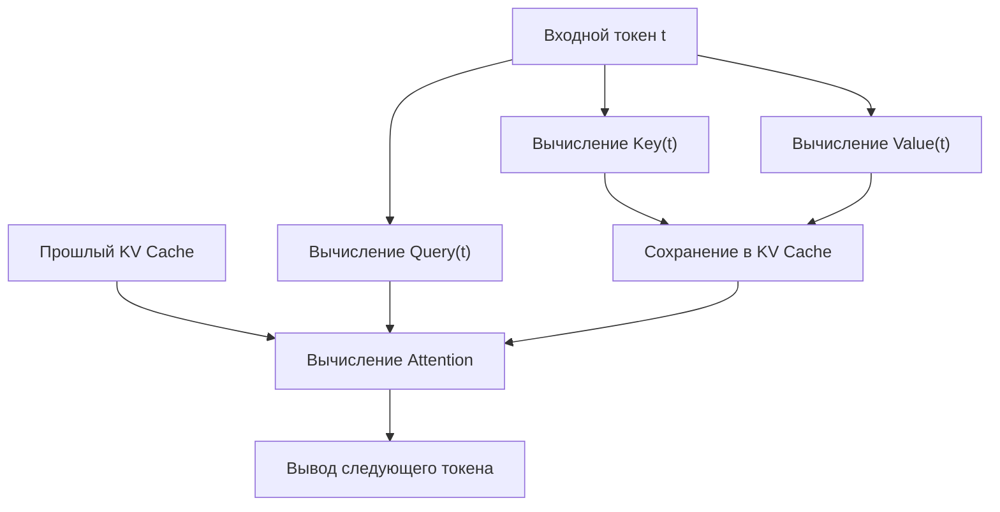
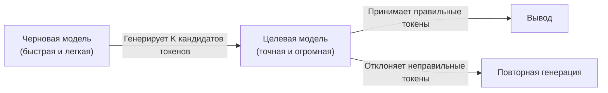

## 1. Введение: «Невидимая стена» вывода LLM

Современный ИИ, особенно большие языковые модели (LLM), в корне изменил наш цифровой опыт. Однако, когда многие разработчики пытаются запустить гигантские модели, работающие за ChatGPT или Claude, на собственной инфраструктуре или локальном ПК, они сталкиваются с высокой стеной: «медленной скоростью вывода».

Почему вывод LLM такой медленный? Многие склонны думать: «Нам нужен GPU, потому что не хватает вычислительной мощности (FLOPS)». Но на самом деле, на этапе вывода, особенно при генерации текста с размером пакета 1 (или небольшим), **узким местом является не вычислительная мощность, а пропускная способность памяти (Memory Bandwidth)**.

В этой статье мы раскроем истинную природу этой «стены пропускной способности памяти» при выводе LLM и подробно объясним механизмы передовых технологий для ее преодоления, таких как **KV-кэш (Key-Value Cache)**, **PagedAttention**, **спекулятивное декодирование (Speculative Decoding)** и **квантование (Quantization)**, как с точки зрения аппаратного, так и программного обеспечения.

---

## 2. Авторегрессионная генерация в Transformer и узкие места вычислений

### 2.1 Как работает авторегрессия (Autoregressive)
Модели-декодеры на основе Transformer, которые являются мейнстримом в LLM, генерируют текст с использованием метода, называемого «авторегрессией». Это процесс предсказания следующего одного токена на основе всех предыдущих токенов.

Математически вероятность токена $x_t$ на определенном шаге $t$ вычисляется следующим образом:
$P(x_t | x_1, x_2, ..., x_{t-1})$

Этот процесс является последовательным и не может быть распараллелен. Чтобы выполнить вычисления для шага $t+1$, токен, сгенерированный на шаге $t$, должен быть определен.

### 2.2 Две фазы во время вывода
Вывод в целом состоит из следующих двух фаз.

1. **Фаза Prefill (предварительное заполнение)**: 
   Фаза, в которой весь введенный промпт обрабатывается одновременно и создается начальное состояние. Здесь возможны параллельные вычисления, и вычислительная мощность GPU (FLOPS) может быть использована полностью, поэтому процесс ограничен вычислениями (**Compute-bound**).
2. **Фаза Decode (декодирование)**: 
   Фаза генерации токенов по одному после завершения предварительного заполнения. Это и есть авторегрессионный процесс, и каждый раз при генерации нового токена веса всей модели должны считываться из памяти. Поэтому процесс ограничен пропускной способностью памяти (**Memory-bound**).

### 2.3 Стена пропускной способности памяти (Memory Bandwidth Wall)
Например, при запуске модели с 70B (70 миллиардов) параметров в формате FP16 (16-битное число с плавающей запятой), данные весов модели составят около 140 ГБ. При генерации каждого токена эти 140 ГБ данных должны передаваться из HBM (High Bandwidth Memory) GPU в вычислительные блоки (SRAM/Core).

Даже если пропускная способность памяти GPU составляет 2 ТБ/с, передача 140 ГБ займет $140 / 2000 = 0.07$ секунды. Иными словами, независимо от того, насколько быстры вычисления, существует физический предел генерации максимума около 14 токенов в секунду. Это и есть «стена пропускной способности памяти».

---

## 3. Основы KV-кэша (Key-Value Cache)

### 3.1 Предотвращение повторных вычислений механизма Attention
В авторегрессионной генерации пересчитывать Attention (внимание) для всех предыдущих токенов на каждом шаге крайне неэффективно.

В расчете Attention каждый токен преобразуется в векторы **Query (Q)**, **Key (K)** и **Value (V)**.
При генерации нового токена $x_t$, векторы K и V для прошлых токенов (от $x_1$ до $x_{t-1}$) уже вычислены и остаются неизменными.

Поэтому был предложен метод сохранения (кэширования) векторов K и V прошлых токенов в памяти GPU и вычисления Attention только с использованием вектора Q нового токена и кэшированных векторов K и V. Это и есть **KV-кэш (Key-Value Cache)**.

### 3.2 Проблема потребления памяти KV-кэшем
KV-кэш значительно сокращает объем вычислений, но ценой потребления огромного количества памяти.
По мере увеличения размера пакета или длины контекста (длины последовательности) размер KV-кэша растет линейно, быстро занимая десятки гигабайт памяти.

Выраженный формулой, размер KV-кэша выглядит следующим образом:
`Объем памяти = 2 (K и V) * размер пакета * длина последовательности * количество слоев * количество голов * размерность головы * количество байт`

Управление этим гигантским кэшем является самой большой проблемой для серверов вывода LLM.

---

## 4. Инновации в управлении памятью с PagedAttention

В традиционных движках вывода для KV-кэша заранее выделялась большая непрерывная область памяти. Однако, поскольку длина генерируемого текста непредсказуема, возникала **внутренняя фрагментация (Internal Fragmentation)** и **внешняя фрагментация (External Fragmentation)** памяти, из-за чего до 60-80% памяти тратилось впустую.

### 4.1 Уроки виртуальной памяти ОС
Эта проблема была решена с помощью **PagedAttention**, реализованного в `vLLM`, разработанном исследовательской группой Калифорнийского университета в Беркли (UC Berkeley). Это применение концепции «подкачки» (paging) в виртуальной памяти ОС к управлению KV-кэшем.

В PagedAttention KV-кэш разбивается на блоки фиксированного размера и распределяется по несмежным участкам физической памяти. Они обрабатываются как виртуально непрерывные блоки, а отображение логических блоков на физические управляется с помощью таблицы блоков.

### 4.2 Преимущества PagedAttention
- **Устранение потерь памяти**: Поскольку блоки выделяются только в необходимом количестве, внутренняя фрагментация удерживается на уровне почти нуля (менее нескольких процентов).
- **Эффективное пакетирование**: Большее количество запросов можно уместить в ограниченной памяти, что кардинально повышает пропускную способность всей системы.
- **Совместное использование памяти**: В методах декодирования, таких как Beam Search, становится возможным безопасное совместное использование (Copy-on-Write) KV-кэша между несколькими последовательностями, полученными из одного промпта.

---

## 5. Спекулятивное декодирование (Speculative Decoding): сдвиг парадигмы к распараллеливанию

Оптимизация KV-кэша способствует улучшению использования памяти и пропускной способности, но она принципиально не решает проблему **задержки (latency)** при размере пакета равном 1. Инновационным алгоритмом для преодоления вышеупомянутой «стены пропускной способности памяти» является **спекулятивное декодирование (Speculative Decoding)**.

### 5.1 Напоминание о том, почему это работает медленно
При запуске огромной модели (целевой модели) чтение весов из памяти происходит медленно. С другой стороны, с небольшой моделью (черновой моделью) чтение весов завершается за мгновение.

### 5.2 Как работает спекулятивное декодирование
Спекулятивное декодирование объединяет два шага: «составление черновика (Drafting)» и «проверку (Verification)».

1. **Фаза составления черновика (Drafting)**:
   Используя небольшую и быструю черновую модель (например, несколько миллиардов параметров), авторегрессионно на высокой скорости предсказываются будущие $K$ токенов.
   Пример: "Японии" "столица" "-" "это" "Токио"

2. **Фаза проверки (Verification)**:
   Предсказанные $K$ токенов передаются в целевую модель все сразу. Целевая модель оценивает их за один прямой проход (Forward pass, параллельные вычисления) и проверяет, верен ли каждый токен.
   - Если предсказание до "Токио" верно, но "это" оказалось неверным, предсказание начинается заново с того места, где произошла ошибка.

### 5.3 Математическая гарантия точности
Удивительно, но спекулятивное декодирование гарантирует **математически абсолютно такое же распределение вероятностей вывода**, как и при авторегрессионной генерации только целевой моделью. Это не аппроксимирующий алгоритм. Применяя технологию выборки с отклонением (Rejection Sampling), это революционная технология, которая может увеличить скорость в 2–3 раза без малейшего снижения качества.

---

## 6. Квантование (Quantization) и подъем локальных LLM

Еще один мощный подход к преодолению стены пропускной способности памяти — **квантование (Quantization)**, которое уменьшает размер самих весов модели. Если размер весов уменьшается вдвое, время чтения из памяти также уменьшается вдвое, что повышает скорость вывода.

### 6.1 llama.cpp и GGML/GGUF
Катализатором движения за запуск LLM локально стал `llama.cpp`. Эта библиотека, реализованная на C/C++, позволяет запускать LLM на поразительной скорости на компьютерах Mac серии M от Apple или на обычных CPU/GPU.

В ее основе лежит формат `GGUF` (ранее GGML) и технология квантования.
Веса, обычно представленные в 16-битном формате (FP16/BF16), сжимаются до 4-битных или 8-битных целых чисел (INT4/INT8).

### 6.2 Продвинутые алгоритмы квантования
Поскольку простое округление сильно ухудшило бы точность модели, используются следующие передовые технологии.

- **GPTQ**: Метод, который использует информацию о второй производной (матрица Гессе) при квантовании весов модели для коррекции ошибок квантования таким образом, чтобы минимизировать влияние на точность.
- **AWQ (Activation-aware Weight Quantization)**: Учитывает не только распределение самих весов, но и распределение «активаций» во время реального вывода. Небольшое количество важных весов (около 1% от общего числа) сохраняется с высокой точностью, а остальные сильно квантуются для предотвращения ухудшения качества.
- **ExLlamaV2**: Еще более быстрая версия GPTQ, которая поддерживает переменный битрейт (например, в среднем 4.5 бита) и назначает количество битов в зависимости от важности слоя.

---

## 7. Заключение и перспективы на будущее

Вывод LLM эволюционировал от простой концепции «огромных матричных вычислений» до **«системной инженерии, оптимизирующей пропускную способность памяти до предела»**.

- **KV-кэш** устраняет излишние вычисления.
- **PagedAttention** устраняет потерю пространства памяти.
- **Спекулятивное декодирование** преодолевает барьер последовательной обработки и обеспечивает распараллеливание.
- **Квантование** уменьшает физический объем передаваемых данных.

Эти технологии не являются независимыми; они используются в комбинации. Например, применяя PagedAttention к квантованной модели и комбинируя со спекулятивным декодированием, наступила эра, когда модели, для которых раньше требовался суперкомпьютер, могут работать в реальном времени на персональных настольных ПК и периферийных устройствах.

В будущем, с появлением новых архитектур для замены Transformer (модели пространства состояний, подобные RNN), таких как Mamba или RWKV, мы можем увидеть будущее, в котором KV-кэш больше не понадобится или потребуется совершенно новая форма управления памятью. Невозможно оторвать взгляд от этой области, где пересекаются эволюция аппаратного обеспечения и инновации алгоритмов.
