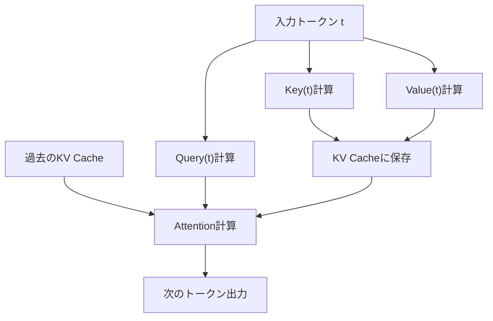
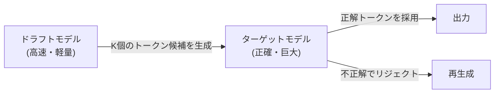

## 1. 引言：LLM推理中的“无形之墙”

现代AI，特别是大型语言模型（LLM），从根本上改变了我们的数字体验。然而，当开发者试图在自家基础设施或本地PC上运行支撑ChatGPT或Claude等服务的巨大模型时，往往会面临“推理速度缓慢”的高墙。

为什么LLM的推理会这么慢？许多人倾向于认为“因为计算量（FLOPS）不足所以需要GPU”，但实际上在推理阶段，特别是在批处理大小（Batch Size）为1（或较小）的文本生成过程中，**瓶颈并非计算能力，而是内存带宽（Memory Bandwidth）**。

本文将揭开LLM推理中这堵“内存带宽墙”的真面目，并深入解析克服该瓶颈的最前沿技术：**KV Cache（键值缓存）**、**PagedAttention**、**投机解码（Speculative Decoding）**，以及**量化（Quantization）**机制，从硬件和软件两方面进行深度剖析。

---

## 2. Transformer的自回归生成与计算瓶颈

### 2.1 自回归（Autoregressive）机制
作为LLM主流的基于Transformer的解码器模型，通过“自回归”的方式生成文本。这是一个根据过去所有词元（Token）预测下一个词元的过程。

用数学公式表示，在某个步骤 $t$，词元 $x_t$ 的概率计算如下：
$P(x_t | x_1, x_2, ..., x_{t-1})$

这个过程是顺序进行的，无法并行化。为了进行步骤 $t+1$ 的计算，步骤 $t$ 生成的词元必须已经确定。

### 2.2 推理时的两个阶段
推理过程大致可分为以下两个阶段：

1. **Prefill（预填充）阶段**: 
   一次性处理输入的完整提示词（Prompt）并构建初始状态的阶段。此阶段可以进行并行计算，能够充分利用GPU的计算能力（FLOPS），因此是**计算受限（Compute-bound）**的。
2. **Decode（解码）阶段**: 
   预填充完成后，逐个生成词元的阶段。这就是自回归过程，每次生成新词元都需要从内存中读取整个模型的权重。因此，它是**内存带宽受限（Memory-bound）**的。

### 2.3 内存带宽之墙（Memory Bandwidth Wall）
例如，如果要在FP16（16位浮点数）下运行一个拥有70B（700亿）参数的模型，模型权重数据大约为140GB。每生成一个词元，都必须将这140GB的数据从GPU的HBM（高带宽内存）传输到计算单元（SRAM/Core）。

假设GPU的内存带宽为2TB/s，传输140GB数据需要 $140 / 2000 = 0.07$ 秒。也就是说，无论计算速度多快，存在一个物理极限，即每秒最多只能生成约14个词元。这就是“内存带宽墙”。

---

## 3. KV Cache（键值缓存）基础

### 3.1 避免Attention机制的重复计算
在自回归生成中，每一步都重新计算对过去所有词元的Attention（注意力）是非常低效的。

在Attention计算中，每个词元会被转换为**Query (Q)**、**Key (K)**和**Value (V)**向量。
当生成新词元 $x_t$ 时，过去词元（从 $x_1$ 到 $x_{t-1}$）的K和V已经计算完毕，且保持不变。

因此，提出了一种将过去词元的K和V保存（缓存）在GPU内存中，仅使用新词元的Q以及缓存的K、V来计算Attention的方法。这就是**KV Cache（键值缓存）**。

### 3.2 KV Cache的内存消耗问题
虽然KV Cache大幅减少了计算量，但代价是消耗了海量的内存。
当批处理大小增加或上下文长度（序列长度）变长时，KV Cache的大小呈线性增长，瞬间就会占据数十GB的内存。

用公式表示，KV Cache的大小如下：
`内存量 = 2 (K与V) * 批处理大小 * 序列长度 * 层数 * 注意力头数 * 注意力头维度 * 字节数`

如何管理这块巨大的缓存，成为了LLM推理服务器面临的最大挑战。

---

## 4. PagedAttention带来的内存管理革新

传统的推理引擎会为KV Cache预先分配连续的巨大内存区域。然而，由于生成的文本长度是不可预测的，这会导致内存的**内部碎片（Internal Fragmentation）**和**外部碎片（External Fragmentation）**，最多会有60%到80%的内存被浪费。

### 4.1 借鉴操作系统的虚拟内存
解决这一问题的是加州大学伯克利分校研究团队开发并在`vLLM`中实现的**PagedAttention**。它将操作系统虚拟内存中的“分页”概念应用到了KV Cache管理中。

在PagedAttention中，KV Cache被划分为固定大小的“块（Block）”，并分散存储在非连续的物理内存空间中。它将其作为虚拟连续的块进行处理，并通过块表（Block Table）管理从逻辑块到物理块的映射。

### 4.2 PagedAttention的优势
- **消除内存浪费**: 按需分配块，将内部碎片控制在几乎为零（不到百分之几）。
- **高效的批处理**: 能够在有限的内存中容纳更多请求，极大地提升了系统的整体吞吐量。
- **内存共享**: 在如束搜索（Beam Search）等解码方法中，允许多个派生自同一提示词的序列之间安全地共享KV Cache（写时复制，Copy-on-Write）。

---

## 5. 投机解码（Speculative Decoding）：迈向并行化的范式转换

KV Cache的优化有助于改善内存和吞吐量，但并不能从根本上改善批处理大小为1时的**延迟（Latency）**。为了跨越前述的“内存带宽墙”，一种名为**投机解码（Speculative Decoding）**的创新算法应运而生。

### 5.1 再次确认速度缓慢的原因
在运行巨大模型（目标模型）时，从内存中读取权重的速度很慢。另一方面，如果是一个小模型（草稿模型），读取权重只需一瞬间。

### 5.2 投机解码机制
投机解码结合了“推测（Drafting）”和“验证（Verification）”两个步骤。

1. **推测（Drafting）阶段**:
   使用小且高速的草稿模型（例如：几十亿参数），以自回归方式快速预测未来的 $K$ 个词元。
   示例：“日本的”“首都”“是”“东京”“です”

2. **验证（Verification）阶段**:
   将推测出的 $K$ 个词元一次性传递给目标模型。目标模型通过一次前向传递（并行计算）对其进行评估，验证每个词元是否正确。
   - 如果直到“东京”都是正确的，但后续的词元错误，则从错误的位置重新开始推测。

### 5.3 数学上的准确性保证
令人惊讶的是，投机解码保证了与目标模型单独进行自回归生成时**在数学上完全相同的输出概率分布**。它不是一种近似算法。通过应用拒绝采样（Rejection Sampling）技术，这是一项能够在不降低任何质量的前提下，将速度提升2到3倍的突破性技术。

---

## 6. 量化（Quantization）与本地LLM的崛起

打破内存带宽墙的另一种强大方法是**量化（Quantization）**，即减小模型权重本身的大小。如果权重大小减半，从内存中的读取时间也会减半，从而提高推理速度。

### 6.1 llama.cpp与GGML/GGUF
推动本地运行LLM浪潮的先驱是 `llama.cpp`。这个用C/C++编写的库，能够在Apple M系列Mac或普通CPU/GPU上以惊人的速度运行LLM。

其核心是名为 `GGUF`（原GGML）的格式和量化技术。
通常以16位（FP16/BF16）表示的权重被压缩为4位或8位整数（INT4/INT8）。

### 6.2 高级量化算法
由于简单的四舍五入会导致模型精度大幅下降，因此使用了以下高级技术：

- **GPTQ**: 在量化模型权重时，利用二阶导数（海森矩阵，Hessian矩阵）信息，修正量化误差，使对精度的影响降至最低的方法。
- **AWQ (Activation-aware Weight Quantization)**: 不仅考虑权重本身的分布，还考虑实际推理时的“激活（Activation）”分布。保留少数重要权重（约占总体的1%）的高精度，对其余权重进行强量化，从而防止质量下降。
- **ExLlamaV2**: 对GPTQ的进一步加速，支持可变比特率（例如：平均4.5比特等），并根据层的重要性分配比特数。

---

## 7. 总结与未来展望

LLM的推理已经从“巨大的矩阵运算”这种简单概念，演变为了**“将内存带宽优化到极致的系统工程”**。

- **KV Cache** 省去了多余的计算，
- **PagedAttention** 消减了内存空间的浪费，
- **投机解码** 跨越了顺序处理的障碍，实现了并行化，
- **量化** 减少了物理数据的移动量。

这些技术并不是独立存在的，而是组合使用的。例如，对量化模型使用PagedAttention，再结合投机解码，过去需要超级计算机才能运行的模型，现在可以在个人台式电脑或边缘设备上实时运行的时代已经到来。

展望未来，随着Mamba和RWKV等替代Transformer的新架构（类RNN的状态空间模型）的崛起，未来可能会出现KV Cache本身不再被需要，或者需要全新形式的内存管理的情况。在这个硬件进化与算法创新交汇的领域，我们仍将持续关注。
