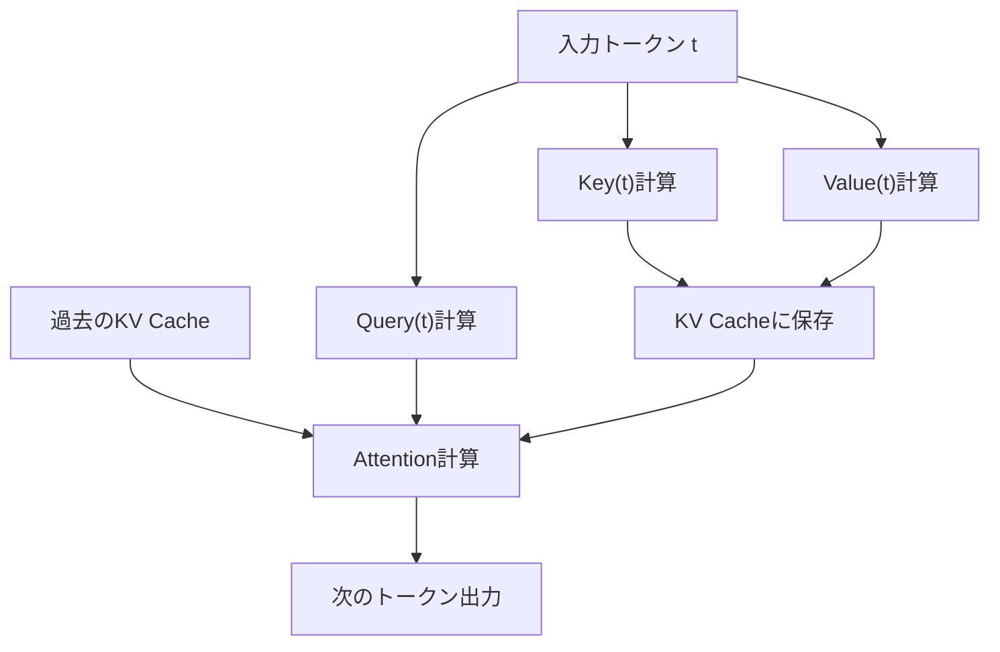
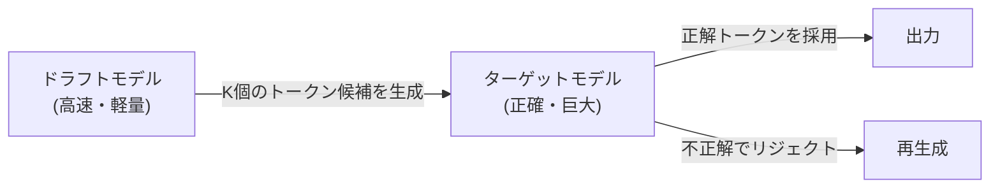

## 1. 簡介：LLM 推論中的「無形之牆」

現代 AI，特別是大型語言模型（LLM），從根本上改變了我們的數位體驗。然而，當開發者嘗試在自家基礎設施或本機電腦上執行 ChatGPT 或 Claude 背後運作的巨大模型時，往往會面臨「推論速度緩慢」這堵高牆。

為什麼 LLM 的推論會這麼慢呢？許多人傾向認為「因為運算量（FLOPS）不足，所以需要 GPU」，但實際上在推論階段，特別是在批次大小（Batch Size）為 1（或較小）的文本生成時，**瓶頸並不在於運算能力，而是記憶體頻寬（Memory Bandwidth）**。

本文將揭開 LLM 推論中這道「記憶體頻寬之牆」的真面目，並從硬體與軟體雙方面，深入探討克服此問題的最先進技術機制，包含 **KV Cache（鍵值快取）**、**PagedAttention**、**推測解碼（Speculative Decoding）** 以及 **量化（Quantization）**。

---

## 2. Transformer 的自迴歸生成與運算瓶頸

### 2.1 自迴歸（Autoregressive）的運作原理
LLM 主流的基於 Transformer 的解碼器（Decoder）模型，會透過稱為「自迴歸」的手法來生成文本。這是一個從過去所有的詞彙（Token）預測下一個詞彙的過程。

用數學公式表示，在某個步驟 $t$ 中，詞彙 $x_t$ 的機率計算方式如下：
$P(x_t | x_1, x_2, ..., x_{t-1})$

這個過程是循序漸進的，無法平行化處理。為了進行步驟 $t+1$ 的運算，必須先確認步驟 $t$ 所生成的詞彙。

### 2.2 推論時的兩個階段
推論大致可以分為以下兩個階段：

1. **Prefill（預填）階段**: 
   一次處理所有輸入的提示詞（Prompt）並建構初始狀態的階段。此處可以進行平行運算，能充分發揮 GPU 的運算能力（FLOPS），因此屬於 **Compute-bound（運算限制）**。
2. **Decode（解碼）階段**: 
   預填完成後，逐一生成詞彙的階段。這就是自迴歸過程，每次生成新的詞彙時，都需要從記憶體中讀取整個模型的權重。因此，這裡屬於 **Memory-bound（記憶體頻寬限制）**。

### 2.3 記憶體頻寬之牆（Memory Bandwidth Wall）
舉例來說，若以 FP16（16 位元浮點數）執行參數數為 70B（700 億）的模型，模型的權重資料大約會是 140GB。每生成一個詞彙，就必須將這 140GB 的資料從 GPU 的 HBM（高頻寬記憶體）傳輸到運算單元（SRAM/Core）。

假設 GPU 的記憶體頻寬為 2TB/s，傳輸 140GB 的資料仍需要 $140 / 2000 = 0.07$ 秒。也就是說，無論運算速度多快，物理極限就是每秒最多只能生成約 14 個詞彙。這就是所謂的「記憶體頻寬之牆」。

---

## 3. KV Cache（鍵值快取）的基礎

### 3.1 防止 Attention 機制的重複運算
在自迴歸生成中，每個步驟都要重新計算過去所有詞彙的 Attention（注意力），這非常沒有效率。

在 Attention 的運算中，每個詞彙都會被轉換為 **Query (Q)**、**Key (K)**、**Value (V)** 的向量。
當生成新的詞彙 $x_t$ 時，過去詞彙（從 $x_1$ 到 $x_{t-1}$）的 K 和 V 已經計算完畢，且不會改變。

因此，有人提出了一種方法：將過去詞彙的 K 和 V 儲存（快取）在 GPU 的記憶體中，只使用新詞彙的 Q 以及快取的 K、V 來計算 Attention。這就是 **KV Cache（鍵值快取）**。

### 3.2 KV Cache 的記憶體消耗問題
KV Cache 雖然大幅減少了運算量，但代價是會消耗龐大的記憶體。
當批次大小增加，或上下文長度（序列長度）變長時，KV Cache 的大小會呈線性增長，轉眼間就會佔用數十 GB 的記憶體。

轉換成公式的話，KV Cache 的大小如下：
`記憶體量 = 2 (K與V) * 批次大小 * 序列長度 * 層數 * 注意力頭數 * 頭部維度 * 位元組數`

如何管理這龐大的快取，便成為了 LLM 推論伺服器面臨的最大課題。

---

## 4. PagedAttention 帶來的記憶體管理革新

在傳統的推論引擎中，會為了 KV Cache 預先保留連續且龐大的記憶體區域。然而，由於生成的文本長度無法預測，這會導致記憶體的**內部碎裂（Internal Fragmentation）**與**外部碎裂（External Fragmentation）**，最多會造成 60% 到 80% 的記憶體浪費。

### 4.1 向作業系統的虛擬記憶體學習
解決這個問題的，是加州大學柏克萊分校研究團隊所開發的 `vLLM` 中實作的 **PagedAttention**。這項技術將作業系統虛擬記憶體中的「分頁（Paging）」概念，應用到了 KV Cache 的管理上。

在 PagedAttention 中，KV Cache 會被分割成固定大小的「區塊」，並分散配置於不連續的實體記憶體空間中。它會被視為虛擬上連續的區塊，並透過區塊表（Block Table）來管理邏輯區塊到實體區塊的對映（Mapping）。

### 4.2 PagedAttention 的優勢
- **消除記憶體浪費**: 只分配所需數量的區塊，因此能將內部碎裂抑制在幾乎為零（不到百分之幾）的程度。
- **高效率的批次處理**: 能夠將更多的請求塞入有限的記憶體中，使整體系統的吞吐量（Throughput）獲得戲劇性的提升。
- **記憶體共享**: 在如 Beam Search 這類解碼手法中，可以安全地（透過 Copy-on-Write）在衍生自相同提示詞的多個序列之間共享 KV Cache。

---

## 5. 推測解碼（Speculative Decoding）：邁向平行化的典範轉移

KV Cache 的最佳化雖然有助於改善記憶體與吞吐量，但並無法根本改善批次大小為 1 時的**延遲（Latency）**。要跨越前述的「記憶體頻寬之牆」，一項革命性的演算法就是 **推測解碼（Speculative Decoding）**。

### 5.1 再次確認為何緩慢
在執行巨大模型（目標模型）時，從記憶體中讀取權重的速度很慢。另一方面，如果是小型模型（草稿模型），讀取權重的動作只需瞬間就能完成。

### 5.2 推測解碼的運作原理
推測解碼結合了「推測（Drafting）」與「驗證（Verification）」這兩個步驟。

1. **推測（Drafting）階段**:
   使用小巧且高速的草稿模型（例如: 數十億參數），以自迴歸的方式高速預測未來 $K$ 個詞彙。
   例: 「日本的」「首都」「是」「東京」

2. **驗證（Verification）階段**:
   將推測出的 $K$ 個詞彙一次傳遞給目標模型。目標模型會透過一次 Forward Pass（前向傳遞，平行運算）進行評估，驗證每個詞彙是否正確。
   - 如果到「東京」為止都正確，但接下來的詞彙錯誤，就會從錯誤的地方重新開始推測。

### 5.3 數學上正確性的保證
令人驚訝的是，推測解碼能保證與單獨使用目標模型進行自迴歸生成時**在數學上擁有完全相同的輸出機率分佈**。這並非近似演算法。透過應用拒絕採樣（Rejection Sampling）的技術，這是一項能夠在完全不降低品質的情況下，單純將速度提升 2 到 3 倍的劃時代技術。

---

## 6. 量化（Quantization）與本機 LLM 的崛起

打破記憶體頻寬之牆的另一個強大方法，是將模型權重本身大小縮減的**量化（Quantization）**。只要權重大小減半，從記憶體讀取的時間也會減半，進而提升推論速度。

### 6.1 llama.cpp 與 GGML/GGUF
引爆在本機執行 LLM 潮流的推手就是 `llama.cpp`。這個以 C/C++ 實作的函式庫，能在 Apple M 系列的 Mac 或是普通的 CPU/GPU 上，以驚人的速度執行 LLM。

其核心就在於名為 `GGUF`（舊稱 GGML）的格式與量化技術。
它會將通常以 16 位元（FP16/BF16）表示的權重，壓縮成 4 位元或 8 位元的整數（INT4/INT8）。

### 6.2 高階量化演算法
由於單純的四捨五入會導致模型精確度大幅下降，因此採用了以下這些高階技術：

- **GPTQ**: 在對模型權重進行量化時，利用二次微分（Hessian 矩陣）的資訊，修正量化誤差以將對精確度的影響降至最低的手法。
- **AWQ (Activation-aware Weight Quantization)**: 不僅考量權重本身的分布，還考慮實際推論時「活化（Activation）」的分布。將少數重要的權重（約佔整體的 1%）保持高精確度，其餘部分則進行強烈量化，藉此防止品質下降。
- **ExLlamaV2**: 將 GPTQ 進一步加速的版本，支援可變位元率（例如: 平均 4.5 位元等），並會根據層的重要性來分配位元數。

---

## 7. 總結與未來展望

LLM 的推論已經從「巨大的矩陣運算」這種單純的印象，進化為**「將記憶體頻寬最佳化至極限的系統工程」**。

- **KV Cache** 省去了不必要的運算，
- **PagedAttention** 省去了記憶體空間的浪費，
- **推測解碼** 跨越了循序處理的障礙並帶來了平行化，
- **量化** 減少了物理性的資料移動量。

這些技術並非獨立運作，而是組合使用的。例如，對量化後的模型使用 PagedAttention，再搭配推測解碼，過去需要超級電腦才能執行的模型，現在已能於個人的桌上型電腦或邊緣裝置上即時執行，這樣的時代已經來臨。

未來，隨著如 Mamba 或 RWKV 等取代 Transformer 的新架構（類似 RNN 的狀態空間模型）崛起，或許會出現不再需要 KV Cache 本身，或者需要全新形式記憶體管理的未來。硬體進化與演算法創新交織的這個領域，往後依然令人拭目以待。
