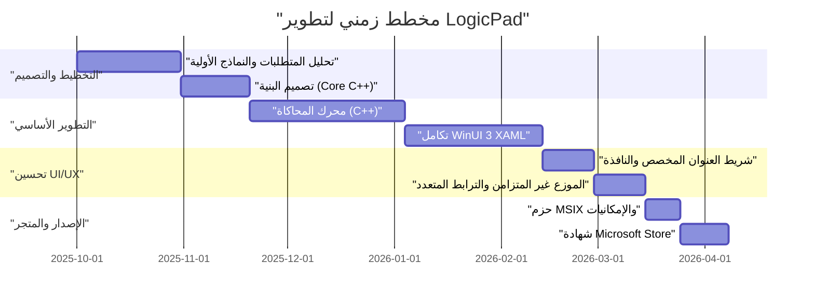
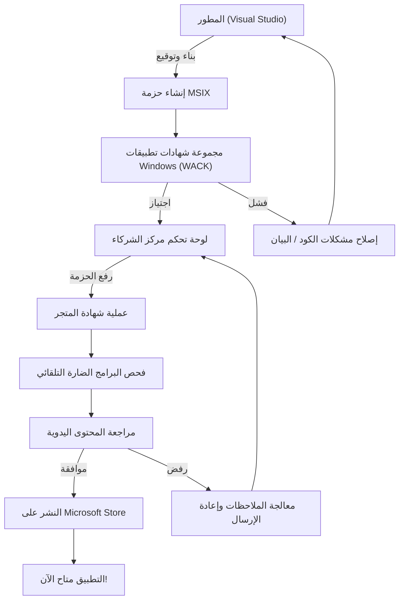

## 1. مقدمة: لماذا نجرؤ على بناء تطبيق Windows أصلي الآن

في تطوير التطبيقات الحديثة، ليس هناك شك في أن التقنيات متعددة المنصات مثل Electron، و Tauri، و React Native أصبحت سائدة. إن نهج الكتابة مرة واحدة والتشغيل في أي مكان (Write Once, Run Anywhere) باستخدام تقنيات الويب يعتبر عقلانياً جداً من وجهة نظر سرعة التطوير وقابلية الصيانة. ومع ذلك، اخترت بجرأة مسار تطوير تطبيق يُدعى "LogicPad" كتطبيق أصلي محسّن بالكامل لنظام التشغيل Windows.

LogicPad هو محاكي للدوائر المنطقية الرقمية ومحرر نصوص يستهدف مهندسي الأجهزة ومتعلمي الدوائر المنطقية. يتطلب التطبيق محاكاة عشرات الآلاف من البوابات المنطقية في الوقت الفعلي وتصيير بيانات أشكال موجية معقدة في نفس الوقت دون أي تأخير. في هذا المجال الذي يتطلب أداءً فائقاً، فإن التوقفات المؤقتة لبضعة أجزاء من الألف من الثانية (micro-stutters) الناتجة عن تجميع القمامة (Garbage Collection) وعبء التصيير الخاص بعروض الويب (WebViews) ستؤدي إلى تدهور قاتل في تجربة المستخدم.

في هذا المقال، سأستعرض المسار منذ تصور تطوير LogicPad، والتنفيذ باستخدام C++ و WinUI 3 (Windows App SDK)، وتجاوز العقبات التقنية الخاصة، وحزم MSIX، وحتى التوزيع العالمي عبر Microsoft Store، مع شرح تقني مفصل للغاية. من خلال مشاركة عملية كيفية بناء مطور فردي لتطبيق Windows أصلي بجودة مستوى المؤسسات، آمل أن يكون هذا مرشداً لأولئك الذين يواجهون تحديات التطوير الأصلي بالمثل.

## 2. المخطط الزمني للمشروع

تم تطوير LogicPad كمشروع شخصي مستفيداً من أوقات نهاية الأسبوع وفترات المساء. يمتد المخطط الزمني الإجمالي إلى حوالي نصف عام (6 أشهر). فيما يلي مخطط جانت (Gantt) الذي يوضح سير المشروع.



كما نرى، تم إنفاق معظم وقت التطوير في تحسين المحرك الأساسي ودمج المعالجة غير المتزامنة بين WinUI 3 و C++. على الرغم من أن التطوير الأصلي ينطوي على تكلفة إعداد وتعلم أولية أعلى مقارنة بالتطوير متعدد المنصات، إلا أن هذا الاستثمار يُسترد بالتأكيد في شكل الأداء النهائي.

## 3. اختيار التكنولوجيا: أعماق C++ / WinUI 3 / Windows App SDK

عند تطوير LogicPad، كان اختيار حزمة التقنيات أحد أهم القرارات. تاريخياً، كانت هناك خيارات مختلفة لأطر عمل واجهة المستخدم الأصلية على منصة Windows مثل Win32 API (User32/GDI) و MFC و Windows Forms و WPF و UWP. حالياً، التوصية التي تقدمها Microsoft لتطوير تطبيقات سطح مكتب Windows الحديثة هي **WinUI 3** المرفق ضمن **Windows App SDK**.

### 3.1. بنية Windows App SDK و WinUI 3
يعد Windows App SDK مجموعة من المكتبات لتوفير أحدث واجهات برمجة تطبيقات (APIs) لنظام Windows بغض النظر عن إصدار نظام التشغيل. في حين أن منصة UWP (Universal Windows Platform) التقليدية كانت مرتبطة بقوة بتحديثات نظام التشغيل، يتم توزيع Windows App SDK مع التطبيق، مما يضمن سلوكاً متسقاً من Windows 10 (الإصدار 1809 وما بعده) إلى Windows 11.

WinUI 3 هو إطار عمل لواجهة المستخدم الأصلية يعمل فوق Windows App SDK ويدعم بشكل كامل نظام التصميم الانسيابي (Fluent Design System). بُنيت البنية الداخلية لـ WinUI 3 باستخدام C++ و DirectX، مما يجعلها تعمل بسرعة فائقة.

### 3.2. أسباب اختيار C++ (C++/WinRT) بدلاً من C#
كلغات تطوير لـ WinUI 3، يتم دعم كل من C# و C++. في حين أن استخدام C# و .NET من شأنه أن يحسن كفاءة التطوير بشكل كبير، فقد تم اعتماد **C++/WinRT** في LogicPad للأسباب التالية:

1. **إدارة الذاكرة الحتمية**: لعدم وجود جامع القمامة (GC)، يمكنك التحكم تماماً في توقيت تخصيص الذاكرة وتحريرها. هذا يمنع حدوث التوقفات المؤقتة الناتجة عن GC أثناء حلقة المحاكاة.
2. **تحسين SIMD وذاكرة التخزين المؤقت**: في C++، يمكن تعريف التخطيط المادي للذاكرة بصرامة (مثل Struct of Arrays)، مما يزيد من معدل ضرب ذاكرة التخزين المؤقت لوحدة المعالجة المركزية (CPU Cache Hit Rate) إلى أقصى حد.
3. **حدود ABI الأصلية**: C++/WinRT عبارة عن إسقاط (projection) حديث لـ C++ لنموذج كائن المكون (COM). يسمح لك باستدعاء واجهات برمجة تطبيقات نظام التشغيل الأصلية مباشرة بدون عبء P/Invoke كما هو الحال في C#.

يوجد نموذج COM في جوهر C++/WinRT. جميع كائنات WinRT هي في الأساس كائنات COM تنفذ واجهة `IUnknown`، وتقوم المؤشرات الذكية في C++/WinRT مثل `winrt::com_ptr` بإدارة حساب المراجع (`AddRef` / `Release`) تلقائياً.

## 4. الجدار الأكبر في تطوير WinUI 3 والاختراق

تطوير WinUI 3 باستخدام C++/WinRT قوي، ولكنه يأتي بتعقيد فريد. سأشرح هنا بالتفصيل التحديين التقنيين الكبيرين اللذين واجهتهما في تطوير LogicPad والحلول لهما.

### 4.1. رعب تحديثات واجهة المستخدم غير المتزامنة في C++ والروتين المساعد (Coroutines)

القاعدة الذهبية لتطبيقات واجهة المستخدم الحديثة هي "لا يجب حظر خيط واجهة المستخدم (UI thread)". في LogicPad، يجب تنفيذ حسابات المحاكاة للدوائر الضخمة في خيط خلفي (background thread)، ويجب أن تنعكس النتائج على خيط واجهة المستخدم.

بينما يمكن كتابة هذا بسهولة نسبية في C# باستخدام `async/await` و `DispatcherQueue`، يتم تحقيقه في C++ من خلال الجمع بين إجراءات C++20 المساعدة (Coroutines) و `winrt::apartment_context`. إن فهم نموذج الشقق لـ COM (STA: شقة أحادية الخيط و MTA: شقة متعددة الخيوط) أمر ضروري.

الكود التالي هو نمط مستخرج من قاعدة كود LogicPad الفعلية للتبديل بسلاسة بين العمليات الحسابية في الخلفية والعودة إلى خيط واجهة المستخدم.

```cpp
#include <winrt/Windows.Foundation.h>
#include <winrt/Microsoft.UI.Dispatching.h>
#include <winrt/Microsoft.UI.Xaml.h>

using namespace winrt;
using namespace Microsoft::UI::Xaml;
using namespace Microsoft::UI::Dispatching;

// معالج حدث النقر على الزر
winrt::fire_and_forget MainWindow::OnRunSimulationClicked(
    IInspectable const& /* sender */, 
    RoutedEventArgs const& /* args */)
{
    // التقاط سياق الشقة لخيط واجهة المستخدم الحالي (STA)
    winrt::apartment_context ui_thread;

    try 
    {
        // تحديث حالة واجهة المستخدم (يتم التنفيذ في خيط واجهة المستخدم)
        StatusTextBlock().Text(L"جاري تشغيل المحاكاة...");
        ProgressBar().IsIndeterminate(true);

        // نقل السياق إلى تجمع الخيوط (MTA)
        co_await winrt::resume_background();

        // عملية محاكاة ثقيلة جداً (يتم التنفيذ في الخيط الخلفي)
        // خلال هذا الوقت، يتم تحرير خيط واجهة المستخدم لمنع تجمد التطبيق
        std::vector<LogicResult> results = CoreEngine::RunMassiveSimulation();
        
        // تنسيق نتائج المحاكاة إلى سلسلة نصية (يستمر في الخلفية)
        winrt::hstring outputText = FormatResults(results);

        // إعادة السياق إلى خيط واجهة المستخدم
        co_await ui_thread;

        // من هنا فصاعداً سيتم التنفيذ في خيط واجهة المستخدم، لذا يمكن الوصول بأمان إلى عناصر التحكم XAML
        ResultTextBlock().Text(outputText);
        ProgressBar().IsIndeterminate(false);
        StatusTextBlock().Text(L"اكتمل");
    }
    catch (winrt::hresult_error const& ex)
    {
        // العودة إلى خيط واجهة المستخدم حتى عند حدوث استثناء لعرض رسالة الخطأ
        co_await ui_thread;
        StatusTextBlock().Text(L"خطأ: " + ex.message());
        ProgressBar().IsIndeterminate(false);
    }
}
```

يبدو سلوك `winrt::apartment_context` هذا كالسحر، ولكنه داخلياً يعتمد على آلية C++ متقدمة تستخدم واجهة `IContextCallback` لتذكر سياق الخيط الأصلي وإرسال (إدراج في قائمة الانتظار) العملية إلى ذلك السياق عند نقطة `co_await`. يسمح لك هذا بكتابة معالجة غير متزامنة بأسلوب رمزي إجرائي دون الوقوع في جحيم الاستدعاءات (callback hell).

### 4.2. التنفيذ الكامل لشريط العنوان المخصص

في تطبيقات عصر Windows 11، يُعد "شريط العنوان المخصص" الذي يضع علامات التبويب أو مربع بحث في شريط عنوان النافذة (منطقة التسمية التوضيحية) مطلباً أساسياً لتجربة المستخدم الحديثة (UX). ومع ذلك، في حين أن تخصيص شريط العنوان في WinUI 3 يكون سهلاً إذا أردت تغيير اللون فقط، فإن صعوبة الأمر ترتفع بشكل حاد عندما تحاول تلبية متطلبات مثل "توسيع منطقة العميل إلى شريط العنوان مع الحفاظ على قدرة سحب النافذة وتخطيط الانجذاب (إعادة التحجيم التلقائي عند تحريك النافذة إلى حافة الشاشة)".

في LogicPad، استخدمنا واجهة برمجة التطبيقات `ExtendsContentIntoTitleBar` لبناء شريط العنوان بعناصر XAML الخاصة بنا. يوضح الكود التالي كيفية تخصيص شريط العنوان باستخدام فئة `AppWindow` من Windows App SDK.

```cpp
#include <winrt/Microsoft.UI.Windowing.h>
#include <winrt/Microsoft.UI.Interop.h>
#include <microsoft.ui.interop.h> // for GetWindowIdFromWindow

void MainWindow::InitializeCustomTitleBar()
{
    // الحصول على مقبض النافذة (HWND) للنافذة الحالية
    auto windowNative = this->try_as<::IWindowNative>();
    HWND hwnd{ nullptr };
    windowNative->get_WindowHandle(&hwnd);

    // تحويل HWND إلى WindowId، والحصول على مثيل AppWindow
    winrt::Microsoft::UI::WindowId windowId = 
        winrt::Microsoft::UI::GetWindowIdFromWindow(hwnd);
    auto appWindow = winrt::Microsoft::UI::Windowing::AppWindow::GetFromWindowId(windowId);

    // التحقق مما إذا كان التخصيص مدعوماً لإصدار نظام التشغيل
    if (winrt::Microsoft::UI::Windowing::AppWindowTitleBar::IsCustomizationSupported())
    {
        auto titleBar = appWindow.TitleBar();
        
        // توسيع منطقة العميل (المحتوى) إلى شريط العنوان
        titleBar.ExtendsContentIntoTitleBar(true);

        // جعل خلفية أزرار التسمية التوضيحية الافتراضية (تصغير، تكبير، إغلاق) شفافة
        titleBar.ButtonBackgroundColor(winrt::Microsoft::UI::Colors::Transparent());
        titleBar.ButtonInactiveBackgroundColor(winrt::Microsoft::UI::Colors::Transparent());
        
        // تعيين عنصر واجهة المستخدم (AppTitleBar) المحدد في XAML كمنطقة سحب
        // ※ بالنسبة لتفاصيل هذا الجزء، يجب مراقبة UIElement في XAML بواسطة موزع خيط واجهة المستخدم،
        // واستدعاء SetDragRectangles() لإخبار نظام التشغيل بالمنطقة القابلة للسحب.
    }
}
```

أكبر فخ في هذا التنفيذ هو أنه في كل مرة يتغير فيها حجم عنصر واجهة المستخدم في جانب XAML (مثل عند تغيير حجم النافذة)، يجب عليك إعادة حساب وإخطار نظام التشغيل بمنطقة اختبار الإصابة القائلة بأن "هذه منطقة يمكن سحبها" باستخدام `InputNonClientPointerSource` أو `SetDragRectangles`. إذا أهملت ذلك، فستواجه أخطاء حيث لا تتحرك النافذة حتى لو قمت بسحب شريط العنوان، أو على العكس، يتم احتساب النقر فوق زر كسحب للنافذة.

## 5. أعماق حزم MSIX و AppXManifest

لتوزيع LogicPad بعد اكتمال التطوير، من الضروري إنشاء مُثبّت (installer). بدلاً من مُثبّتات MSI أو EXE التقليدية، اعتمدت تنسيق **MSIX** الحديث. يوفر MSIX عمليات تثبيت وإلغاء تثبيت نظيفة تماماً (لا تلوث السجل) ويتضمن ميزة التحديث التلقائي، مما يجعله آمناً ومريحاً جداً للمستخدمين.

ومع ذلك، عند حزم تطبيق أصلي مكتوب بـ C++ باستخدام MSIX، فإن أهم ما يجب الانتباه إليه هو إعدادات `Package.appxmanifest` (ملف البيان).

يحتاج LogicPad إلى قراءة وكتابة ملفات المشاريع الضخمة المحفوظة في نظام الملفات المحلي (مثل مجلد المستندات الخاص بالمستخدم). في بيئة وضع الحماية (sandbox) القياسية لـ UWP، يمكنك فقط الوصول إلى مجلد بيانات التطبيق المعزول (AppContainer). للحصول على امتيازات الوصول الكامل كتطبيق سطح مكتب أصلي، يجب التصريح عن إمكانية `runFullTrust` في ملف البيان.

```xml
<?xml version="1.0" encoding="utf-8"?>
<Package
  xmlns="http://schemas.microsoft.com/appx/manifest/foundation/windows10"
  xmlns:uap="http://schemas.microsoft.com/appx/manifest/uap/windows10"
  xmlns:rescap="http://schemas.microsoft.com/appx/manifest/foundation/windows10/restrictedcapabilities"
  IgnorableNamespaces="uap rescap">

  <Identity
    Name="LogicPad.Studio"
    Publisher="CN=Kenji"
    Version="1.0.0.0" />

  <Properties>
    <DisplayName>LogicPad</DisplayName>
    <PublisherDisplayName>Kenji</PublisherDisplayName>
    <Logo>Assets\StoreLogo.png</Logo>
  </Properties>

  <Dependencies>
    <TargetDeviceFamily Name="Windows.Desktop" MinVersion="10.0.17763.0" MaxVersionTested="10.0.22621.0" />
  </Dependencies>

  <Capabilities>
    <!-- قيود عامة -->
    <Capability Name="internetClient" />
    <!-- قيود مقيدة للعمل كتطبيق سطح مكتب أصلي -->
    <rescap:Capability Name="runFullTrust" />
  </Capabilities>
</Package>
```

تُسمى هذه الإمكانية `<rescap:Capability Name="runFullTrust" />` "القدرة المقيدة" (Restricted Capability)، وعند إرسال التطبيق إلى Microsoft Store، يجب تقديم مبرر للمراجعين يشرح سبب حاجتك إلى هذا الإذن. قمت بشرح أن "هذا التطبيق هو أداة احترافية تقرأ وتكتب وتصدّر ملفات مشاريع الدوائر المنطقية التعسفية الموجودة على الأقراص المحلية للمستخدمين"، وتمت الموافقة عليه دون مشاكل.

## 6. المسار إلى Microsoft Store وعملية المراجعة

بمجرد اكتمال التطبيق وإنشاء حزمة MSIX، يحين وقت إرساله إلى Microsoft Store. بالنسبة للمطورين الأفراد، فإن التوزيع عبر المتجر يوفر مزايا لا تقدر بثمن، مثل التحديثات التلقائية، وضمان الموثوقية، والوصول إلى نظام الدفع.

تتم عملية الإرسال إلى Microsoft Store من خلال مركز الشركاء (Partner Center). يوضح المخطط الانسيابي أدناه الصورة الكاملة من البناء إلى النشر.



### 6.1. جدار WACK (مجموعة شهادات تطبيقات Windows)
قبل التحميل إلى مركز الشركاء، يجب عليك تشغيل **WACK (Windows App Certification Kit)** محلياً واجتياز الاختبارات الأولية. WACK هي أداة تختبر تلقائياً ما إذا كان التطبيق يتعطل، أو يستدعي واجهات برمجة تطبيقات غير صالحة، وما إذا كان يفي بمتطلبات الأداء.

في حالة التطبيقات الأصلية بلغة C++، فإن أهم شيء يجب الحذر منه هو خطأ "استخدام واجهات برمجة تطبيقات غير مدعومة". إذا قمت بالربط الثابت لمكتبة C++ قديمة تابعة لجهة خارجية، فقد يتم استخدام واجهات برمجة تطبيقات Win32 مهملة داخل تلك المكتبة، مما يؤدي إلى الفشل في مراجعة WACK. لتجنب هذه المشكلة، قمت بتحديث المكتبات المعتمدة إلى أحدث الإصدارات وإعادة كتابة بعض الوظائف لاستخدام واجهات برمجة التطبيقات البديلة التي يوفرها Windows App SDK.

### 6.2. المراجعة والنشر
تتضمن الإعدادات في مركز الشركاء أسعار التطبيق، وفئات العمر (تصنيف IARC)، وإدخال لقطات شاشة وصفية للمتجر. نظراً لأن LogicPad أداة تقنية، تمكنت من الحصول على تصنيف مناسب لجميع الأعمار على الفور.

استغرق الأمر حوالي 3 أيام عمل من إرسال الحزمة حتى اكتمال المراجعة. بعد الفحص التلقائي للبرامج الضارة وفحص الوظائف، قام فريق مراجعة Microsoft بإجراء اختبار تشغيل يدوي. تمت الموافقة على طلب إذن `runFullTrust` دون أي مشاكل، والشعور بالإنجاز في اللحظة التي تغيرت فيها الحالة أخيراً إلى "منشور" (In the Store) كان لا يوصف.

## 7. التطوير الشخصي كعمل تجاري: نماذج رياضية للأداء والإيرادات

بدلاً من مجرد بناء تطبيق والشعور بالرضا، من أجل تحديث LogicPad باستمرار وجعله عملاً تجارياً قابلاً للاستمرار، من الضروري تقييم كل من المقاييس التقنية والتجارية كمياً.

### 7.1. نموذج تحسين استخدام الذاكرة الذي يوفره C++
تتمثل أعظم نقاط قوة LogicPad في كونه خفيف الوزن للغاية مقارنة بالمحررين المعتمدين على Electron (مثل VSCode وما إلى ذلك). يمكن نمذجة إجمالي بصمة الذاكرة (Memory Footprint) للتطبيق $M_{total}$ على النحو التالي:

$$
M_{total} = M_{UI} + M_{engine} + M_{cache}
$$

هنا، تكون الذاكرة $M_{UI}$ الناتجة عن التصيير الأصلي لـ WinUI 3 أصغر بكثير مقارنة بـ Electron الذي يقوم بتحميل محرك متصفح (حوالي 50 ميغابايت).
علاوة على ذلك، فإن ذاكرة جزء محرك C++ $M_{engine}$ تتوسع خطياً مع عدد البوابات المنطقية $N$ بفضل الهياكل المحسنة وإلغاء المؤشرات.

$$
M_{engine} = N \times \text{sizeof(LogicNode)}
$$

من خلال تحسين محاذاة الهياكل باستخدام `#pragma pack` في C++، قمنا بتقليل الذاكرة لكل عقدة إلى الحد الأدنى المطلق.

```cpp
#pragma pack(push, 1)
// تقليل الذاكرة إلى الحد الأدنى من خلال الحزم دون الاحتفاظ بجدول وظائف افتراضي (vtable)
struct LogicNode {
    uint32_t id;         // 4 bytes
    uint16_t type;       // 2 bytes
    bool isActive;       // 1 byte
    // حجم الهيكل هو 7 bytes (لا يوجد حشو للمحاذاة)
};
#pragma pack(pop)
```

بينما تزداد الذاكرة لطبقة التخزين المؤقت $M_{cache}$ للاحتفاظ بسجل المحاكاة بالتناسب مع $\mathcal{O}(N \log N)$، إلا أن البصمة الأساسية صغيرة، وبالتالي فإن إجمالي استخدام ذاكرة الوصول العشوائي (RAM) للنظام يظل دون 200 ميغابايت حتى بالنسبة للدوائر التي تضم عشرات الآلاف من العقد.

### 7.2. LTV و CAC: حسابات التسويق
في استراتيجية تحقيق الدخل في التطوير الشخصي، التوازن بين القيمة الدائمة للعميل (LTV: Lifetime Value) وتكلفة اكتساب العميل (CAC: Customer Acquisition Cost) هو كل شيء. يتبنى LogicPad نموذج ترخيص الشراء لمرة واحدة (freemium) بدلاً من الاشتراك.

يتم حساب LTV كمجموع القيمة الحالية للاحتمال المستقبلي لشراء الترقية مخصوماً منه معدل الخصم $d$. عند اعتبار الفترة $T$، يتم التعبير عنها بالصيغة التالية:

$$
LTV = \sum_{t=1}^{T} \frac{ARPU_t \times Margin}{(1+d)^t}
$$

من ناحية أخرى، CAC هو إجمالي نفقات التسويق، مثل تدفق الزيارات من إعلانات Twitter (حالياً X) والمقالات في المدونة، مقسوماً على عدد المستخدمين الجدد.

$$
CAC = \frac{Total\ Marketing\ Spend}{Number\ of\ New\ Users}
$$

تتمثل نقطة قوة التطوير الشخصي في أنه يمكن التعامل مع تكلفة العمالة للتطوير كـ "وقت هواية" كتكلفة غارقة، مما يسمح بحساب CAC استناداً إلى تكاليف التسويق الصافية فقط. حالياً، من خلال التدفق العضوي المعتمد بشكل أساسي على التسويق الشفهي (Word of mouth) في المجتمعات التقنية المتخصصة، حققنا اقتصاديات وحدة سليمة حيث $LTV > CAC$ في حالة يكون فيها $CAC \approx 0$ تقريباً.

## 8. الخاتمة: عالم تطوير التطبيقات الأصلية الشاق والجميل

بالنظر إلى رحلة تطوير LogicPad إلى إصداره على Microsoft Store، لم تكن الطريق ممهدة بأي حال من الأحوال، بدءاً من الصراع مع أخطاء التجميع المعقدة لـ C++/WinRT، وتعقب تسريبات الذاكرة الناتجة عن أخطاء حساب المراجع لـ COM، والتحقيق في مواصفات XML لبيانات MSIX.

بالضبط بسبب تطور تقنيات الويب ودخولنا عصر "يمكنك بناء أي شيء في المتصفح"، فإن تجربة التطوير الأصلي—حيث تضرب واجهات برمجة تطبيقات نظام التشغيل مباشرة وتهتم بكل بايت من الذاكرة وكل نبضة لوحدة المعالجة المركزية—ستعزز قدرتك الأساسية كمهندس بشكل كبير.

تستمر عمليات التطوير بنشاط في WinUI 3 و Windows App SDK، وهما أفضل الأدوات لبناء تطبيقات جميلة تحقق أقصى استفادة من نموذج واجهة المستخدم في Windows 11. آمل بصدق أن تكون مقالة المدونة هذه مفيدة للمطورين الذين على وشك مواجهة تحدي تطوير تطبيقات Windows الأصلية، وأن تصطف المزيد من التطبيقات الرائعة في المتجر.

التطوير لم ينته بعد. في الإصدار التالي من LogicPad، نخطط لدمج محرك تصيير أشكال موجية مخصص خاص بنا يستخدم Direct2D. في المقالة التالية، أخطط للتعمق أكثر في إمكانية التشغيل البيني بين DirectX و WinUI 3 (استخدام SwapChainPanel). ترقبوا ذلك.
