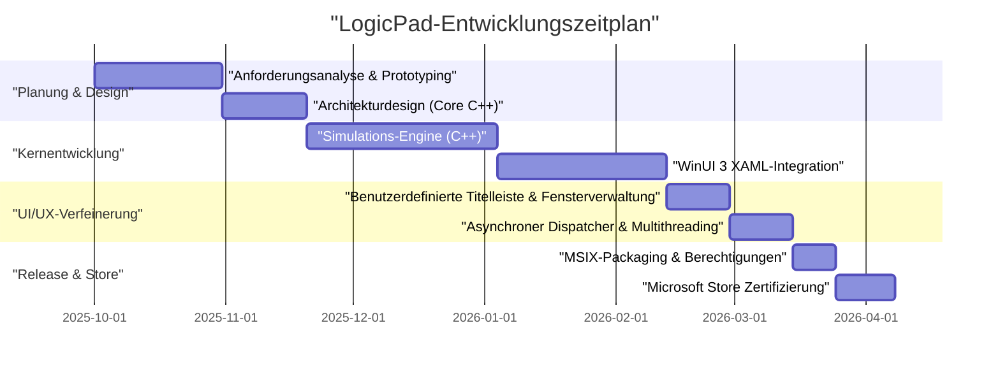
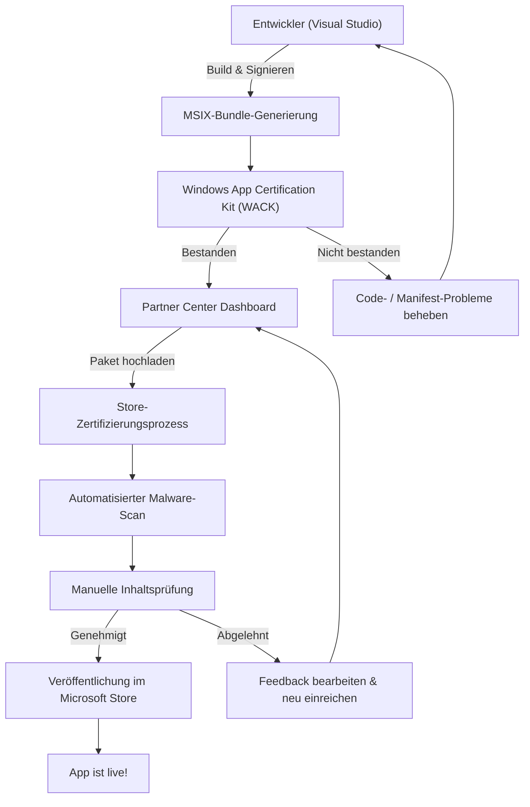

## 1. Einführung: Warum heute noch eine native Windows-App entwickeln?

In der modernen Anwendungsentwicklung besteht kein Zweifel daran, dass plattformübergreifende Technologien wie Electron, Tauri und React Native den Mainstream bilden. Der Ansatz „Write Once, Run Anywhere“ (einmal schreiben, überall ausführen) unter Verwendung von Webtechnologien ist im Hinblick auf Entwicklungsgeschwindigkeit und Wartbarkeit äußerst rational. Dennoch habe ich mich bewusst dafür entschieden, die Anwendung „LogicPad“ als vollständig auf Windows optimierte, native Anwendung zu entwickeln.

LogicPad ist ein digitaler Logikschaltungs-Simulator und Texteditor, der sich an Hardware-Ingenieure und Lernende im Bereich Logikschaltungen richtet. Es ist erforderlich, Zehntausende von Logikgattern in Echtzeit zu simulieren und gleichzeitig komplexe Wellenformdaten ohne Verzögerung zu rendern. In einem Bereich, der eine solch extreme Leistung erfordert, führen Pausen von wenigen Millisekunden (Micro-Stuttering) durch die Garbage Collection oder der Rendering-Overhead einer Web-View zu einer fatalen Verschlechterung des Benutzererlebnisses.

In diesem Artikel werde ich den Weg von der Konzeption von LogicPad über die Implementierung mit C++ und WinUI 3 (Windows App SDK), die Überwindung spezifischer technischer Hürden, das MSIX-Packaging bis hin zur weltweiten Verbreitung über den Microsoft Store mit sehr detaillierten technischen Erklärungen Revue passieren lassen. Ich hoffe, dass das Teilen dieses Prozesses – wie ein Einzelentwickler eine native Windows-App in Enterprise-Qualität erstellt – als Wegweiser für diejenigen dient, die sich ebenfalls der nativen Entwicklung stellen.

## 2. Projekt-Zeitplan

Die Entwicklung von LogicPad wurde als persönliches Projekt an Wochenenden und Abenden vorangetrieben. Der gesamte Zeitplan erstreckte sich über etwa ein halbes Jahr (6 Monate). Unten sehen Sie ein Gantt-Diagramm, das den Fortschritt des Projekts zeigt.



Wie Sie sehen können, wurde der Großteil der Entwicklungszeit für die Optimierung der Core-Engine und die Integration der asynchronen Verarbeitung zwischen WinUI 3 und C++ aufgewendet. Obwohl die native Entwicklung im Vergleich zur plattformübergreifenden Entwicklung höhere anfängliche Einrichtungs- und Lernkosten mit sich bringt, zahlt sich diese Investition in Form der endgültigen Leistung definitiv aus.

## 3. Technologieauswahl: Die Tiefen von C++ / WinUI 3 / Windows App SDK

Bei der Entwicklung von LogicPad war die Auswahl des Technologie-Stacks eine der wichtigsten Entscheidungen. Für native UI-Frameworks auf der Windows-Plattform gibt es historisch gesehen verschiedene Optionen wie die Win32 API (User32/GDI), MFC, Windows Forms, WPF und UWP. Derzeit empfiehlt Microsoft **WinUI 3**, das im **Windows App SDK** enthalten ist, für die Entwicklung moderner Windows-Desktopanwendungen.

### 3.1. Architektur des Windows App SDK und WinUI 3
Das Windows App SDK ist eine Sammlung von Bibliotheken, die aktuelle Windows-APIs unabhängig von der Betriebssystemversion bereitstellen. Während die bisherige UWP (Universal Windows Platform) stark an Betriebssystem-Updates gebunden war, wird das Windows App SDK zusammen mit der Anwendung verteilt, wodurch ein konsistentes Verhalten von Windows 10 (ab Version 1809) bis Windows 11 gewährleistet wird.

WinUI 3 ist ein natives UI-Framework, das auf diesem Windows App SDK läuft und das Fluent Design System vollständig unterstützt. Das Innere von WinUI 3 ist mit C++ und DirectX aufgebaut und arbeitet extrem schnell.

### 3.2. Warum bewusst C++ (C++/WinRT) statt C# gewählt wurde
Als Entwicklungssprachen für WinUI 3 werden C# und C++ unterstützt. Während die Entwicklungseffizienz mit C# und .NET dramatisch steigen würde, habe ich mich bei LogicPad aus folgenden Gründen für **C++/WinRT** entschieden:

1. **Deterministische Speicherverwaltung**: Da es keinen Garbage Collector (GC) gibt, kann der Zeitpunkt der Speicherzuweisung und -freigabe vollständig kontrolliert werden. Dies verhindert GC-Pausen während der Simulationsschleife.
2. **SIMD- und Cache-Optimierung**: In C++ kann das physische Layout des Speichers (z. B. Struct of Arrays) strikt definiert werden, um die CPU-Cache-Trefferrate zu maximieren.
3. **Native ABI-Grenze**: C++/WinRT ist eine moderne C++-Projektion von COM (Component Object Model). Es ermöglicht den direkten Aufruf nativer OS-APIs ohne den P/Invoke-Overhead, den man bei C# hätte.

An der Basis von C++/WinRT steht COM. Alle WinRT-Objekte sind im Wesentlichen COM-Objekte, die die `IUnknown`-Schnittstelle implementieren, und intelligente Zeiger wie `winrt::com_ptr` in C++/WinRT verwalten die Referenzzählung (`AddRef` / `Release`) automatisch.

## 4. Die größte Hürde und der Durchbruch in der WinUI 3-Entwicklung

Die WinUI 3-Entwicklung mit C++/WinRT ist zwar leistungsstark, bringt jedoch spezifische Komplexitäten mit sich. Hier werde ich zwei große technische Herausforderungen und deren Lösungen, mit denen ich bei der Entwicklung von LogicPad besonders zu kämpfen hatte, detailliert erläutern.

### 4.1. Der Schrecken asynchroner UI-Aktualisierungen in C++ und Coroutinen

Eine eiserne Regel für moderne UI-Anwendungen lautet: „Der UI-Thread darf nicht blockiert werden.“ In LogicPad ist es erforderlich, die Berechnungen für die Simulation riesiger Schaltungen in einem Hintergrund-Thread auszuführen und die Ergebnisse im UI-Thread zu reflektieren.

Mit C# ließe sich dies mithilfe von `async/await` und der `DispatcherQueue` relativ einfach umsetzen. In C++ wird dies jedoch durch die Kombination von C++20-Coroutinen (Coroutines) und `winrt::apartment_context` erreicht. Ein Verständnis des COM-Apartment-Modells (STA: Single-Threaded Apartment und MTA: Multi-Threaded Apartment) ist hierbei unerlässlich.

Der folgende Code ist ein Muster, das aus der tatsächlichen Codebasis von LogicPad extrahiert wurde, und das Berechnungen im Hintergrund und die nahtlose Rückkehr zum UI-Thread durchführt.

```cpp
#include <winrt/Windows.Foundation.h>
#include <winrt/Microsoft.UI.Dispatching.h>
#include <winrt/Microsoft.UI.Xaml.h>

using namespace winrt;
using namespace Microsoft::UI::Xaml;
using namespace Microsoft::UI::Dispatching;

// Event-Handler für den Button-Klick
winrt::fire_and_forget MainWindow::OnRunSimulationClicked(
    IInspectable const& /* sender */, 
    RoutedEventArgs const& /* args */)
{
    // Den Apartment-Kontext (STA) des aktuellen UI-Threads erfassen
    winrt::apartment_context ui_thread;

    try 
    {
        // UI-Status aktualisieren (dies wird im UI-Thread ausgeführt)
        StatusTextBlock().Text(L"Simulation läuft...");
        ProgressBar().IsIndeterminate(true);

        // Kontextwechsel zum Threadpool (MTA)
        co_await winrt::resume_background();

        // Sehr rechenintensive Simulation (wird im Hintergrund-Thread ausgeführt)
        // Währenddessen ist der UI-Thread frei und die Anwendung friert nicht ein
        std::vector<LogicResult> results = CoreEngine::RunMassiveSimulation();
        
        // Simulationsergebnisse als String formatieren (weiterhin im Hintergrund)
        winrt::hstring outputText = FormatResults(results);

        // Kontext zurück zum UI-Thread wechseln
        co_await ui_thread;

        // Ab hier wird wieder im UI-Thread ausgeführt, sicherer Zugriff auf XAML-Controls
        ResultTextBlock().Text(outputText);
        ProgressBar().IsIndeterminate(false);
        StatusTextBlock().Text(L"Abgeschlossen");
    }
    catch (winrt::hresult_error const& ex)
    {
        // Auch bei einer Ausnahme zurück zum UI-Thread, um die Fehlermeldung anzuzeigen
        co_await ui_thread;
        StatusTextBlock().Text(L"Fehler: " + ex.message());
        ProgressBar().IsIndeterminate(false);
    }
}
```

Das Verhalten von `winrt::apartment_context` wirkt wie Magie, aber intern nutzt es die `IContextCallback`-Schnittstelle, um sich den ursprünglichen Thread-Kontext zu merken. Beim `co_await` kommt ein fortschrittlicher C++-Mechanismus zum Einsatz, der die Verarbeitung an diesen Kontext delegiert (in die Warteschlange einreiht). Dadurch können asynchrone Prozesse im prozeduralen Stil geschrieben werden, ohne in der Callback-Hölle zu landen.

### 4.2. Die vollständige Implementierung einer benutzerdefinierten Titelleiste

Bei Anwendungen im Zeitalter von Windows 11 ist eine „benutzerdefinierte Titelleiste“, bei der Tabs oder eine Suchleiste im Bereich der Titelleiste (Caption-Bereich) platziert werden, eine wesentliche Anforderung für eine moderne UX. Die Anpassung der Titelleiste in WinUI 3 ist zwar einfach, wenn man nur die Farbe ändern möchte, aber wenn man die Anforderung erfüllen will, „den Client-Bereich in die Titelleiste auszudehnen und dabei das Ziehen des Fensters und die Snap-Layouts (automatisches Anpassen beim Verschieben des Fensters an den Bildschirmrand) beizubehalten“, steigt der Schwierigkeitsgrad enorm.

In LogicPad habe ich die `ExtendsContentIntoTitleBar` API verwendet, um die Titelleiste mit eigenen XAML-Elementen zu erstellen. Der folgende Code zeigt die Schritte zur Anpassung der Titelleiste mithilfe der `AppWindow`-Klasse des Windows App SDK.

```cpp
#include <winrt/Microsoft.UI.Windowing.h>
#include <winrt/Microsoft.UI.Interop.h>
#include <microsoft.ui.interop.h> // für GetWindowIdFromWindow

void MainWindow::InitializeCustomTitleBar()
{
    // HWND (Window Handle) des aktuellen Fensters abrufen
    auto windowNative = this->try_as<::IWindowNative>();
    HWND hwnd{ nullptr };
    windowNative->get_WindowHandle(&hwnd);

    // HWND in WindowId umwandeln und AppWindow-Instanz abrufen
    winrt::Microsoft::UI::WindowId windowId = 
        winrt::Microsoft::UI::GetWindowIdFromWindow(hwnd);
    auto appWindow = winrt::Microsoft::UI::Windowing::AppWindow::GetFromWindowId(windowId);

    // Prüfen, ob die OS-Version die Anpassung unterstützt
    if (winrt::Microsoft::UI::Windowing::AppWindowTitleBar::IsCustomizationSupported())
    {
        auto titleBar = appWindow.TitleBar();
        
        // Client-Bereich (Inhalt) in die Titelleiste ausdehnen
        titleBar.ExtendsContentIntoTitleBar(true);

        // Hintergrund der Standard-Caption-Buttons (Minimieren, Maximieren, Schließen) transparent machen
        titleBar.ButtonBackgroundColor(winrt::Microsoft::UI::Colors::Transparent());
        titleBar.ButtonInactiveBackgroundColor(winrt::Microsoft::UI::Colors::Transparent());
        
        // Das im XAML definierte UI-Element (AppTitleBar) als ziehbaren Bereich festlegen
        // *Für diesen Teil muss das UIElement auf der XAML-Seite vom Dispatcher des UI-Threads überwacht werden,
        // und SetDragRectangles() muss aufgerufen werden, um dem OS den ziehbaren Bereich mitzuteilen.
    }
}
```

Die größte Falle bei dieser Implementierung besteht darin, dass jedes Mal, wenn sich die Größe des XAML-UI-Elements ändert (z. B. beim Ändern der Fenstergröße), der Hit-Test-Bereich neu berechnet und das OS mithilfe von `InputNonClientPointerSource` oder `SetDragRectangles` darüber informiert werden muss: „Dies ist der Bereich, der gezogen werden kann“. Wenn man dies versäumt, treten Fehler auf, wie z. B. dass sich das Fenster beim Ziehen der Titelleiste nicht bewegt oder umgekehrt Klicks auf Schaltflächen fälschlicherweise als Fensterziehen interpretiert werden.

## 5. Die Tiefen des MSIX-Packagings und das AppXManifest

Um das fertiggestellte LogicPad zu vertreiben, muss ein Installer erstellt werden. Anstelle herkömmlicher MSI- oder EXE-Installer habe ich das moderne **MSIX**-Format gewählt. MSIX sorgt für eine absolut saubere Installation und Deinstallation (ohne die Registry zu verschmutzen) und verfügt zudem über eine automatische Update-Funktion, was es für den Benutzer sehr sicher und komfortabel macht.

Wenn man jedoch eine in C++ geschriebene native App mit MSIX verpackt, ist die Konfiguration der `Package.appxmanifest` (Manifest-Datei) der wichtigste Punkt, auf den man achten muss.

LogicPad muss große Projektdateien lesen und schreiben können, die im lokalen Dateisystem gespeichert sind (z. B. im Dokumente-Ordner des Benutzers). In der standardmäßigen UWP-Sandbox-Umgebung ist nur der Zugriff auf den isolierten Datenordner der App (AppContainer) erlaubt. Um vollen Zugriff als native Desktop-Anwendung zu erhalten, muss im Manifest die Funktion `runFullTrust` deklariert werden.

```xml
<?xml version="1.0" encoding="utf-8"?>
<Package
  xmlns="http://schemas.microsoft.com/appx/manifest/foundation/windows10"
  xmlns:uap="http://schemas.microsoft.com/appx/manifest/uap/windows10"
  xmlns:rescap="http://schemas.microsoft.com/appx/manifest/foundation/windows10/restrictedcapabilities"
  IgnorableNamespaces="uap rescap">

  <Identity
    Name="LogicPad.Studio"
    Publisher="CN=Kenji"
    Version="1.0.0.0" />

  <Properties>
    <DisplayName>LogicPad</DisplayName>
    <PublisherDisplayName>Kenji</PublisherDisplayName>
    <Logo>Assets\StoreLogo.png</Logo>
  </Properties>

  <Dependencies>
    <TargetDeviceFamily Name="Windows.Desktop" MinVersion="10.0.17763.0" MaxVersionTested="10.0.22621.0" />
  </Dependencies>

  <Capabilities>
    <!-- Allgemeine Funktionseinschränkungen -->
    <Capability Name="internetClient" />
    <!-- Eingeschränkte Funktion zum Ausführen als native Desktop-Anwendung -->
    <rescap:Capability Name="runFullTrust" />
  </Capabilities>
</Package>
```

Diese `<rescap:Capability Name="runFullTrust" />` wird als „eingeschränkte Funktion“ (Restricted Capability) bezeichnet. Bei der Einreichung im Microsoft Store muss ein Begründungsschreiben eingereicht werden, in dem dem Prüfer erklärt wird, warum diese Berechtigung erforderlich ist. Ich erklärte, dass „diese App ein professionelles Werkzeug ist, das beliebige Logikschaltungs-Projektdateien auf der lokalen Festplatte des Benutzers liest, schreibt und exportiert“, und erhielt problemlos die Genehmigung.

## 6. Der Weg zum Microsoft Store und der Zertifizierungsprozess

Sobald die Anwendung fertiggestellt und das MSIX-Paket erstellt ist, folgt schließlich die Einreichung im Microsoft Store. Für einen Einzelentwickler bietet die Verteilung über den Store unschätzbare Vorteile wie die automatische Bereitstellung von Updates, garantierte Zuverlässigkeit und die Nutzung des Zahlungssystems.

Der Einreichungsprozess im Microsoft Store erfolgt über das Partner Center. Das folgende Flussdiagramm zeigt das Gesamtbild vom Build bis zur Veröffentlichung.



### 6.1. Die Hürde des WACK (Windows App Certification Kit)
Bevor Sie in das Partner Center hochladen, müssen Sie lokal das **WACK (Windows App Certification Kit)** ausführen und den Vorabtest bestehen. WACK ist ein Tool, das automatisch testet, ob die App abstürzt, ob unzulässige APIs aufgerufen werden und ob die Leistungsanforderungen erfüllt sind.

Bei einer nativen C++-App ist insbesondere der Fehler „Verwendung nicht unterstützter APIs“ zu beachten. Wenn eine ältere C++-Bibliothek eines Drittanbieters statisch verlinkt ist, werden möglicherweise veraltete Win32-APIs innerhalb dieser Bibliothek verwendet, was dazu führen kann, dass die App bei der WACK-Prüfung abgelehnt wird. Um dieses Problem zu umgehen, habe ich die abhängigen Bibliotheken auf die neueste Version aktualisiert und einige Funktionen in Ersatz-APIs umgeschrieben, die vom Windows App SDK bereitgestellt werden.

### 6.2. Zertifizierung und Veröffentlichung
Die Konfiguration im Partner Center umfasst die Preisgestaltung der App, die Alterseinstufung (IARC-Rating), sowie Screenshots und Beschreibungen für den Store. Da LogicPad ein technisches Werkzeug ist, konnte ich sofort ein Rating für alle Altersgruppen erhalten.

Vom Einreichen des Pakets bis zum Abschluss der Prüfung dauerte es etwa drei Werktage. Nach dem automatischen Malware-Scan und der Funktionsprüfung führte das Microsoft-Prüfungsteam eine manuelle Überprüfung der Funktionalität durch. Auch die Berechtigungsanfrage für `runFullTrust` wurde problemlos genehmigt, und das Gefühl der Erfüllung in dem Moment, als der Status endlich auf „Veröffentlicht“ (In the Store) wechselte, war unersetzlich.

## 7. Persönliche Entwicklung als Business: Mathematische Modelle für Leistung und Einnahmen

Um sich nicht einfach mit der Erstellung einer App zufrieden zu geben, sondern LogicPad kontinuierlich zu aktualisieren und als Geschäft aufzubauen, ist es notwendig, sowohl technische als auch geschäftliche Kennzahlen quantitativ zu bewerten.

### 7.1. Das von C++ ermöglichte Modell zur Optimierung der Speichernutzung
Die größte Stärke von LogicPad ist seine extreme Leichtgewichtigkeit im Vergleich zu Electron-basierten Editoren (z. B. VSCode). Der Speicherbedarf der Anwendung, $M_{total}$, kann wie folgt modelliert werden:

$$
M_{total} = M_{UI} + M_{engine} + M_{cache}
$$

Hierbei ist $M_{UI}$ durch das native Rendering von WinUI 3 dramatisch kleiner als bei Electron, welches eine Browser-Engine laden muss (nur etwa 50 MB).
Darüber hinaus skaliert der Speicher der C++-Engine $M_{engine}$ linear mit der Anzahl der Logikgatter $N$, dank optimierter Strukturen und der Eliminierung von Zeigern.

$$
M_{engine} = N \times \text{sizeof(LogicNode)}
$$

Durch die Verwendung des `#pragma pack` in C++ zur Optimierung der Strukturausrichtung konnte der Speicher pro Knoten auf das absolute Minimum reduziert werden.

```cpp
#pragma pack(push, 1)
// Keine virtuelle Funktionstabelle (vtable) und Packen, um den Speicher zu minimieren
struct LogicNode {
    uint32_t id;         // 4 Bytes
    uint16_t type;       // 2 Bytes
    bool isActive;       // 1 Byte
    // Die Strukturgröße beträgt 7 Bytes (ohne Alignment-Padding)
};
#pragma pack(pop)
```

Da die Speicher-Schicht für den Cache $M_{cache}$ den Simulationsverlauf beibehält, wächst sie proportional zu $\mathcal{O}(N \log N)$. Da die Basis-Speichernutzung jedoch so gering ist, bleibt der RAM-Verbrauch des gesamten Systems selbst bei Schaltungen mit Zehntausenden von Knoten unter 200 MB.

### 7.2. LTV und CAC: Kalkulation des Marketings
Bei der Monetarisierungsstrategie in der individuellen Entwicklung ist das Gleichgewicht zwischen Customer Lifetime Value (LTV) und Customer Acquisition Cost (CAC) alles. LogicPad verwendet kein Abonnement, sondern ein Kauflizenzmodell (Freemium).

Der LTV wird berechnet als die Summe der Barwerte der Wahrscheinlichkeiten zukünftiger Upgrade-Käufe, abgewertet mit dem Abzinsungssatz $d$. Über den Zeitraum $T$ lässt sich dies mit folgender Formel ausdrücken:

$$
LTV = \sum_{t=1}^{T} \frac{ARPU_t \times Margin}{(1+d)^t}
$$

Auf der anderen Seite sind die CAC die gesamten Marketingkosten für Dinge wie Twitter-Werbung (jetzt X) oder Traffic von Blog-Beiträgen, geteilt durch die Anzahl der neuen Benutzer.

$$
CAC = \frac{Total\ Marketing\ Spend}{Number\ of\ New\ Users}
$$

Der Vorteil der persönlichen Entwicklung besteht darin, dass die für die Entwicklung aufgewendeten Personalkosten als „Hobbyzeit“ und somit als versunkene Kosten (Sunk Costs) betrachtet werden können. Daher können die CAC rein auf der Basis der tatsächlichen Marketingausgaben berechnet werden. Derzeit erzielen wir dank eines organischen Wachstums, das sich auf Mundpropaganda in Nischen-Tech-Communitys stützt, eine gesunde Unit-Economics von $LTV > CAC$ bei einem Status nahe $CAC \approx 0$.

## 8. Fazit: Die ungeschliffene, aber schöne Welt der nativen App-Entwicklung

Wenn man auf den Weg von der Entwicklung von LogicPad bis zur Veröffentlichung im Microsoft Store zurückblickt, war es sicherlich kein einfacher Weg – vom Kampf mit unverständlichen Kompilierfehlern in C++/WinRT über das Aufspüren von Speicherlecks aufgrund von COM-Referenzzählungs-Bugs bis hin zur Untersuchung der XML-Spezifikationen des MSIX-Manifests.

Aber gerade weil wir uns durch die Entwicklung der Webtechnologien in einem Zeitalter befinden, in dem „alles im Browser gemacht werden kann“, stärkt die Erfahrung der nativen Entwicklung, bei der man die OS-APIs direkt aufruft und auf jedes Byte Speicher und jeden CPU-Takt achtet, die grundlegenden Fähigkeiten eines Ingenieurs ungemein.

WinUI 3 und das Windows App SDK werden derzeit aktiv weiterentwickelt und sind die besten Werkzeuge, um schöne Anwendungen zu erstellen, die das UI-Paradigma von Windows 11 voll ausschöpfen. Ich hoffe aufrichtig, dass dieser Blogbeitrag Entwicklern, die die Entwicklung von nativen Windows-Apps in Angriff nehmen wollen, eine Hilfe sein wird und dass dadurch noch mehr großartige Apps im Store erscheinen.

Die Entwicklung ist noch nicht abgeschlossen. Für die nächste Version von LogicPad ist die Integration einer eigenen Wellenform-Rendering-Engine unter Verwendung von Direct2D geplant. Im nächsten Artikel werde ich tief in die Interoperabilität zwischen DirectX und WinUI 3 (Nutzung des SwapChainPanels) eintauchen. Bleiben Sie gespannt.
