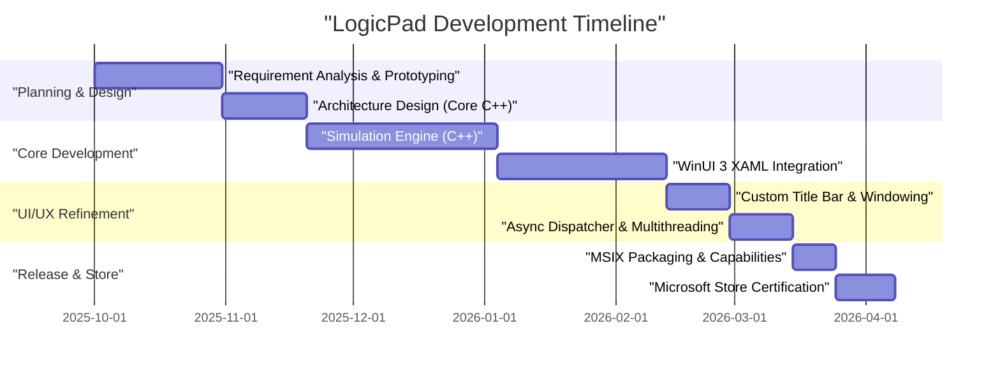
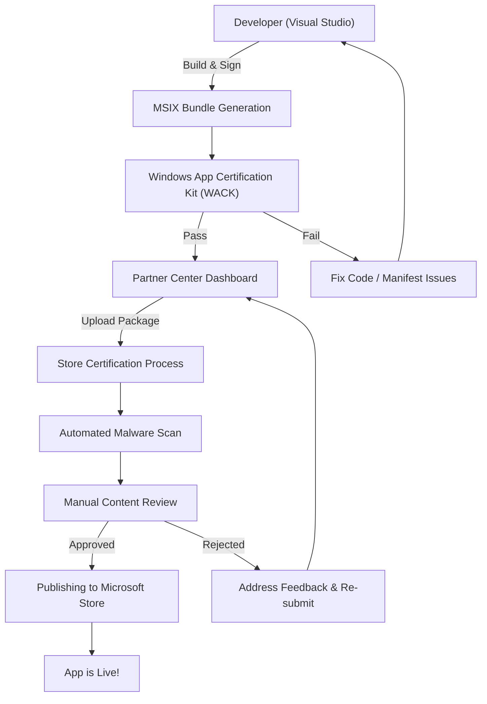

## 1. Introduction: Why build a native Windows app now?

There is no doubt that cross-platform technologies like Electron, Tauri, and React Native have become mainstream in modern application development. The "Write Once, Run Anywhere" approach using web technologies is highly rational from the perspective of development speed and maintainability. However, I deliberately chose to develop an application called "LogicPad" as a native application fully optimized for Windows.

LogicPad is a digital logic circuit simulator and text editor targeted at hardware engineers and logic circuit learners. It needs to simulate tens of thousands of logic gates in real time and simultaneously render complex waveform data without delay. In areas requiring such extreme performance, temporary pauses (micro-stuttering) of a few milliseconds caused by garbage collection or rendering overhead of a web view can lead to a fatal degradation in user experience.

In this article, I will look back on the journey from the conceptualization of LogicPad, its implementation using C++ and WinUI 3 (Windows App SDK), overcoming unique technical hurdles, MSIX packaging, and its worldwide distribution through the Microsoft Store, along with extremely detailed technical explanations. By sharing the process of how a solo developer can build an enterprise-quality native Windows app, I hope this will serve as a guide for those who are similarly undertaking native development.

## 2. Project Timeline

The development of LogicPad progressed as a personal project utilizing weekends and evenings. The overall timeline spanned about half a year (6 months). Below is a Gantt chart showing the progression of the project.



As shown, the majority of development time was spent on optimizing the core engine and integrating asynchronous processing between WinUI 3 and C++. Although native development has higher initial setup and learning costs compared to cross-platform development, that investment is definitely recovered in the form of ultimate performance.

## 3. Technology Selection: The Depths of C++ / WinUI 3 / Windows App SDK

In developing LogicPad, the selection of the technology stack was one of the most critical decisions. Historically, various native UI frameworks have existed for the Windows platform, such as the Win32 API (User32/GDI), MFC, Windows Forms, WPF, and UWP. Currently, Microsoft's recommendation for modern Windows desktop application development is **WinUI 3**, which is included in the **Windows App SDK**.

### 3.1. Architecture of Windows App SDK and WinUI 3
The Windows App SDK is a set of libraries that provides the latest Windows APIs independent of the OS version. While the traditional UWP (Universal Windows Platform) was strongly tied to OS updates, the Windows App SDK is distributed along with the application, guaranteeing consistent operation from Windows 10 (version 1809 and later) to Windows 11.

WinUI 3 is a native UI framework that runs on top of this Windows App SDK and fully supports the Fluent Design System. The internals of WinUI 3 are built with C++ and DirectX, making it run incredibly fast.

### 3.2. Why choose C++ (C++/WinRT) instead of C#?
C# and C++ are supported as development languages for WinUI 3. Using C# and .NET would dramatically improve development efficiency, but LogicPad adopted **C++/WinRT** for the following reasons:

1. **Deterministic Memory Management**: Since there is no garbage collector (GC), the timing of memory allocation and deallocation can be fully controlled. This prevents GC pauses from occurring during the simulation loop.
2. **SIMD and Cache Optimization**: In C++, physical memory layouts (such as Struct of Arrays) can be strictly defined, maximizing the CPU cache hit rate.
3. **Native ABI Boundary**: C++/WinRT is a modern C++ projection of COM (Component Object Model). It can call native OS APIs directly without the P/Invoke overhead found in C#.

COM exists at the foundation of C++/WinRT. All WinRT objects are essentially COM objects that implement the `IUnknown` interface, and C++/WinRT's smart pointers like `winrt::com_ptr` automatically manage reference counting (`AddRef` / `Release`).

## 4. The Biggest Hurdles in WinUI 3 Development and Their Breakthroughs

WinUI 3 development using C++/WinRT is powerful but comes with specific complexities. Here, I will explain in detail two major technical challenges I struggled with during the development of LogicPad and their solutions.

### 4.1. The Terror of Asynchronous UI Updates in C++ and Coroutines

The golden rule of modern UI applications is "never block the UI thread." In LogicPad, we need to run simulation calculations for huge circuits on a background thread and reflect the results on the UI thread.

In C#, this can be described relatively easily using `async/await` and `DispatcherQueue`, but in C++, this is achieved by combining C++20 Coroutines and `winrt::apartment_context`. Understanding the COM apartment model (STA: Single-Threaded Apartment and MTA: Multi-Threaded Apartment) is essential.

The following code is a pattern extracted from LogicPad's actual codebase that seamlessly transitions between background calculations and returning to the UI thread.

```cpp
#include <winrt/Windows.Foundation.h>
#include <winrt/Microsoft.UI.Dispatching.h>
#include <winrt/Microsoft.UI.Xaml.h>

using namespace winrt;
using namespace Microsoft::UI::Xaml;
using namespace Microsoft::UI::Dispatching;

// Button click event handler
winrt::fire_and_forget MainWindow::OnRunSimulationClicked(
    IInspectable const& /* sender */, 
    RoutedEventArgs const& /* args */)
{
    // Capture the apartment context of the current UI thread (STA)
    winrt::apartment_context ui_thread;

    try 
    {
        // Update UI status (executed on the UI thread)
        StatusTextBlock().Text(L"Running simulation...");
        ProgressBar().IsIndeterminate(true);

        // Transition context to the thread pool (MTA)
        co_await winrt::resume_background();

        // Extremely heavy simulation processing (executed on a background thread)
        // During this time, the UI thread is freed, preventing the application from freezing
        std::vector<LogicResult> results = CoreEngine::RunMassiveSimulation();
        
        // Format simulation results into a string (still executing in the background)
        winrt::hstring outputText = FormatResults(results);

        // Return the context to the UI thread
        co_await ui_thread;

        // From here on, execution is on the UI thread, so XAML controls can be safely accessed
        ResultTextBlock().Text(outputText);
        ProgressBar().IsIndeterminate(false);
        StatusTextBlock().Text(L"Completed");
    }
    catch (winrt::hresult_error const& ex)
    {
        // Even when an exception occurs, return to the UI thread to show the error message
        co_await ui_thread;
        StatusTextBlock().Text(L"Error: " + ex.message());
        ProgressBar().IsIndeterminate(false);
    }
}
```

The behavior of this `winrt::apartment_context` looks like magic, but internally it uses the `IContextCallback` interface to remember the original thread context, and an advanced C++ mechanism works to dispatch (enqueue) the processing to that context upon `co_await`. This allows you to write asynchronous processing with procedural-looking code without falling into callback hell.

### 4.2. Complete Implementation of a Custom Title Bar

In Windows 11 era applications, a "custom title bar" that places tabs or search boxes in the window's title bar (caption area) is a requirement for modern UX. However, customizing the title bar in WinUI 3 is easy if you are just changing colors, but the difficulty level spikes dramatically when trying to satisfy the requirement of "extending the client area into the title bar while maintaining window dragging and snap layouts (automatic resizing when snapping the window to the edge of the screen)."

In LogicPad, I used the `ExtendsContentIntoTitleBar` API to build the title bar with my own XAML elements. The following code shows the steps to customize the title bar using the `AppWindow` class of the Windows App SDK.

```cpp
#include <winrt/Microsoft.UI.Windowing.h>
#include <winrt/Microsoft.UI.Interop.h>
#include <microsoft.ui.interop.h> // for GetWindowIdFromWindow

void MainWindow::InitializeCustomTitleBar()
{
    // Get the HWND (window handle) of the current window
    auto windowNative = this->try_as<::IWindowNative>();
    HWND hwnd{ nullptr };
    windowNative->get_WindowHandle(&hwnd);

    // Convert HWND to WindowId and get the AppWindow instance
    winrt::Microsoft::UI::WindowId windowId = 
        winrt::Microsoft::UI::GetWindowIdFromWindow(hwnd);
    auto appWindow = winrt::Microsoft::UI::Windowing::AppWindow::GetFromWindowId(windowId);

    // Check if customization is supported on the OS version
    if (winrt::Microsoft::UI::Windowing::AppWindowTitleBar::IsCustomizationSupported())
    {
        auto titleBar = appWindow.TitleBar();
        
        // Extend the client area (content) into the title bar
        titleBar.ExtendsContentIntoTitleBar(true);

        // Make the background of default caption buttons (minimize, maximize, close) transparent
        titleBar.ButtonBackgroundColor(winrt::Microsoft::UI::Colors::Transparent());
        titleBar.ButtonInactiveBackgroundColor(winrt::Microsoft::UI::Colors::Transparent());
        
        // Set the UI element (AppTitleBar) defined in XAML side as the draggable area
        // * For details on this part, you need to monitor the UIElement on the XAML side with the UI thread's Dispatcher
        // and call SetDragRectangles() to inform the OS of the draggable area.
    }
}
```

The biggest pitfall in this implementation is that every time the size of the UI element on the XAML side changes (like when the window is resized), you have to recalculate and notify the OS of the hit test area saying "this area is draggable" using `InputNonClientPointerSource` or `SetDragRectangles`. If you neglect this, bugs will occur where the window won't move even if you drag the title bar, or conversely, a window drag is detected when you want to click a button.

## 5. The Depths of MSIX Packaging and AppXManifest

To distribute the completed LogicPad, you need to create an installer. Instead of a traditional MSI or EXE installer, I adopted the modern **MSIX** format. MSIX is extremely safe and comfortable for users because installations and uninstallations are completely clean (without polluting the registry) and it has automatic update capabilities.

However, when packaging a native app written in C++ with MSIX, the most important thing to watch out for is the `Package.appxmanifest` (manifest file) settings.

LogicPad needs to read and write large project files saved on the local file system (such as the user's Documents folder). In the standard UWP sandbox environment, you can only access the app's own isolated data folder (AppContainer). To gain full access privileges as a native desktop app, you must declare the `runFullTrust` capability in the manifest.

```xml
<?xml version="1.0" encoding="utf-8"?>
<Package
  xmlns="http://schemas.microsoft.com/appx/manifest/foundation/windows10"
  xmlns:uap="http://schemas.microsoft.com/appx/manifest/uap/windows10"
  xmlns:rescap="http://schemas.microsoft.com/appx/manifest/foundation/windows10/restrictedcapabilities"
  IgnorableNamespaces="uap rescap">

  <Identity
    Name="LogicPad.Studio"
    Publisher="CN=Kenji"
    Version="1.0.0.0" />

  <Properties>
    <DisplayName>LogicPad</DisplayName>
    <PublisherDisplayName>Kenji</PublisherDisplayName>
    <Logo>Assets\StoreLogo.png</Logo>
  </Properties>

  <Dependencies>
    <TargetDeviceFamily Name="Windows.Desktop" MinVersion="10.0.17763.0" MaxVersionTested="10.0.22621.0" />
  </Dependencies>

  <Capabilities>
    <!-- General capability restrictions -->
    <Capability Name="internetClient" />
    <!-- Restricted capability to run as a native desktop app -->
    <rescap:Capability Name="runFullTrust" />
  </Capabilities>
</Package>
```

This `<rescap:Capability Name="runFullTrust" />` is called a "Restricted Capability," and when submitting to the Microsoft Store, you must submit a justification explaining to the reviewers why this permission is necessary. I explained, "Because this app is a tool for professionals that reads, writes, and exports arbitrary logic circuit project files on the user's local disk," and successfully gained approval.

## 6. The Road to the Microsoft Store and the Certification Process

Once the application is complete and the MSIX package is built, it's finally time to submit it to the Microsoft Store. For solo developers, distribution through the store has immeasurable benefits, such as automatic update delivery, guaranteed reliability, and the use of payment systems.

The submission process to the Microsoft Store is done through the Partner Center. The following flowchart shows the entire picture from build to publication.



### 6.1. The Wall of WACK (Windows App Certification Kit)
Before uploading to the Partner Center, you must absolutely run the **WACK (Windows App Certification Kit)** locally and pass the pre-tests. WACK is a tool that automatically tests whether the app crashes, calls invalid APIs, or meets performance requirements.

In the case of native C++ apps, you need to be particularly careful about "Unsupported API usage" errors. If you statically link an old third-party C++ library, deprecated Win32 APIs might be used inside that library, which could be rejected during the WACK certification. To avoid this problem, I updated dependent libraries to their latest versions and rewrote some functions to alternative APIs provided by the Windows App SDK.

### 6.2. Certification and Publication
Settings in the Partner Center include app pricing, age ratings (IARC rating), store screenshots, and descriptions. Since LogicPad is a technical tool, I was able to immediately obtain an all-ages rating.

It took about 3 business days from submitting the package for certification to complete. Following an automated malware scan and capability check, a manual functional check is performed by Microsoft's review team. The request for `runFullTrust` permission passed without issue, and the sense of accomplishment the moment the status changed to "In the Store" was truly irreplaceable.

## 7. Solo Development as a Business: Mathematical Models of Performance and Revenue

To make LogicPad viable as a business and continuously update it, rather than just being satisfied with building the app, it is necessary to quantitatively evaluate both technical and business metrics.

### 7.1. Memory Usage Optimization Model Brought by C++
The greatest strength of LogicPad is its extreme lightweight nature compared to Electron-based editors (e.g., VSCode). The memory footprint of the application $M_{total}$ can be modeled as follows:

$$
M_{total} = M_{UI} + M_{engine} + M_{cache}
$$

Here, $M_{UI}$ from WinUI 3's native rendering is dramatically smaller compared to Electron which loads a browser engine (about 50MB).
Furthermore, the memory of the C++ engine part $M_{engine}$ scales linearly with respect to the number of logic gates $N$, thanks to optimized structures and elimination of pointers.

$$
M_{engine} = N \times \text{sizeof(LogicNode)}
$$

By optimizing the structure alignment using C++'s `#pragma pack`, I minimized the memory per node to the absolute limit.

```cpp
#pragma pack(push, 1)
// Minimize memory by packing and omitting the virtual function table (vtable)
struct LogicNode {
    uint32_t id;         // 4 bytes
    uint16_t type;       // 2 bytes
    bool isActive;       // 1 byte
    // Structure size is 7 bytes (no alignment padding)
};
#pragma pack(pop)
```

The memory of the cache layer $M_{cache}$ increases in proportion to $\mathcal{O}(N \log N)$ to retain the history of the simulation, but since the base footprint is small, the overall RAM usage of the system stays under 200MB even with circuits of tens of thousands of nodes.

### 7.2. LTV and CAC: The Arithmetic of Marketing
In monetization strategies for solo development, the balance between Lifetime Value (LTV) and Customer Acquisition Cost (CAC) is everything. LogicPad adopts a one-time purchase license model (freemium) rather than a subscription.

LTV is calculated as the sum of the present values of the probability of future upgrade purchases discounted by a discount rate $d$. Assuming a period $T$, it is expressed by the following formula:

$$
LTV = \sum_{t=1}^{T} \frac{ARPU_t \times Margin}{(1+d)^t}
$$

On the other hand, CAC is the total marketing expense incurred for influxes from Twitter (currently X) ads or blog posts divided by the number of new users.

$$
CAC = \frac{Total\ Marketing\ Spend}{Number\ of\ New\ Users}
$$

The strength of solo development is that labor costs for development can be considered sunk costs as "hobby time," meaning CAC can be calculated purely on marketing costs. Currently, through organic influxes centered around word-of-mouth in niche tech communities, we are achieving healthy unit economics of $LTV > CAC$ in a state close to $CAC \approx 0$.

## 8. Conclusion: The Muddy Yet Beautiful World of Native App Development

Looking back on the journey from the development of LogicPad to its release on the Microsoft Store, it was by no means a smooth road, battling with cryptic C++/WinRT compile errors, tracking down memory leaks due to COM reference counting bugs, and investigating the XML specifications of the MSIX manifest.

Precisely because the evolution of web technologies has ushered in an era where "anything can be built in a browser," the experience of native development—calling OS APIs directly and paying attention down to the single byte of memory and single clock of the CPU—overwhelmingly strengthens one's fundamental stamina as an engineer.

WinUI 3 and the Windows App SDK are still being actively developed, and they are the best tools for building beautiful applications that fully utilize the UI paradigms of Windows 11. I sincerely hope that this blog post will be of some help to developers who are about to challenge themselves with Windows native app development, and that even one more wonderful app will line the Store.

Development is not over yet. In the next version of LogicPad, I plan to integrate a custom waveform rendering engine utilizing Direct2D. In the next article, I plan to dive deep into interoperability between DirectX and WinUI 3 (utilizing SwapChainPanel). Please look forward to it.
