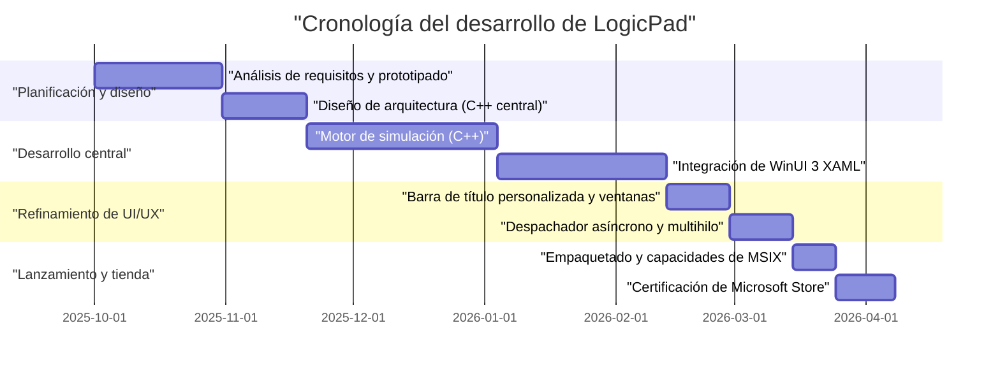
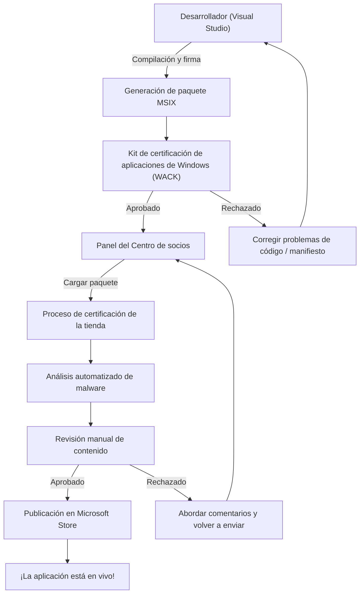

## 1. Introducción: ¿Por qué atreverse a crear una aplicación nativa de Windows ahora?

En el desarrollo de aplicaciones moderno, no hay duda de que las tecnologías multiplataforma como Electron, Tauri y React Native se han convertido en la corriente principal. El enfoque de escribir una vez usando tecnologías web y ejecutar en cualquier lugar (Write Once, Run Anywhere) es muy racional desde la perspectiva de la velocidad de desarrollo y el mantenimiento. Sin embargo, me atreví a elegir el camino de desarrollar una aplicación llamada "LogicPad" como una aplicación nativa completamente optimizada para Windows.

LogicPad es un simulador de circuitos lógicos digitales y editor de texto dirigido a ingenieros de hardware y estudiantes de circuitos lógicos. Es necesario simular decenas de miles de puertas lógicas en tiempo real y, al mismo tiempo, renderizar datos de formas de onda complejas sin demora. En dominios donde se requiere un rendimiento tan extremo, las pausas de unos pocos milisegundos debidas a la recolección de basura (micro-tartamudez) y la sobrecarga de renderizado de las vistas web provocan una degradación fatal de la experiencia del usuario.

En este artículo, repasaré la trayectoria desde el concepto de desarrollo de este LogicPad, la implementación usando C++ y WinUI 3 (Windows App SDK), la superación de barreras técnicas específicas, el empaquetado MSIX y, finalmente, la distribución mundial a través de la Microsoft Store, junto con explicaciones técnicas muy detalladas. Al compartir el proceso de cómo un desarrollador individual crea una aplicación nativa de Windows de calidad empresarial, espero que sirva de guía para aquellos que también estén asumiendo el reto del desarrollo nativo.

## 2. Cronología del proyecto

El desarrollo de LogicPad se llevó a cabo como un proyecto personal aprovechando los fines de semana y las noches. La cronología general abarcó aproximadamente medio año (6 meses). A continuación se muestra un diagrama de Gantt que ilustra el progreso del proyecto.



Como se puede ver, la mayor parte del tiempo de desarrollo se invirtió en la optimización del motor central y la integración del procesamiento asíncrono entre WinUI 3 y C++. Aunque el desarrollo nativo tiene un mayor costo de configuración y aprendizaje inicial en comparación con el desarrollo multiplataforma, esa inversión definitivamente se recupera en forma de rendimiento final.

## 3. Selección de tecnología: Las profundidades de C++ / WinUI 3 / Windows App SDK

Al desarrollar LogicPad, la selección de la pila tecnológica fue una de las decisiones más importantes. En cuanto a los marcos de interfaz de usuario (UI) nativos en la plataforma Windows, históricamente existen varias opciones como las API Win32 (User32/GDI), MFC, Windows Forms, WPF, UWP, etc. Actualmente, Microsoft recomienda **WinUI 3**, que se incluye en el **Windows App SDK**, para el desarrollo de aplicaciones de escritorio modernas de Windows.

### 3.1. Arquitectura de Windows App SDK y WinUI 3
Windows App SDK es un conjunto de bibliotecas para proporcionar las API más recientes de Windows de forma independiente a la versión del sistema operativo. Mientras que el UWP (Universal Windows Platform) tradicional estaba fuertemente vinculado a las actualizaciones del sistema operativo, Windows App SDK se distribuye con la aplicación, lo que garantiza un comportamiento consistente desde Windows 10 (versión 1809 y posteriores) hasta Windows 11.

WinUI 3 es un marco de interfaz de usuario nativo que se ejecuta sobre este Windows App SDK y es totalmente compatible con el Fluent Design System. El interior de WinUI 3 está construido con C++ y DirectX, por lo que funciona de manera extremadamente rápida.

### 3.2. Por qué atreverse a elegir C++ (C++/WinRT) en lugar de C#
Tanto C# como C++ son compatibles como lenguajes de desarrollo para WinUI 3. El uso de C# y .NET mejoraría drásticamente la eficiencia del desarrollo, pero para LogicPad adoptamos **C++/WinRT** por las siguientes razones:

1. **Gestión de memoria determinista**: Dado que no hay recolector de basura (GC), el momento de asignación y liberación de memoria se puede controlar por completo. Esto evita que ocurran pausas del GC durante los bucles de simulación.
2. **SIMD y optimización de caché**: En C++, el diseño físico de la memoria (como Estructura de Arreglos) se puede definir estrictamente, maximizando la tasa de aciertos de la caché de la CPU.
3. **Límite de la ABI nativa**: C++/WinRT es una proyección moderna de C++ de COM (Component Object Model). Permite llamadas directas a las API nativas del sistema operativo sin la sobrecarga de P/Invoke como en C#.

COM se encuentra en la base de C++/WinRT. Todos los objetos WinRT son esencialmente objetos COM que implementan la interfaz `IUnknown`, y los punteros inteligentes de C++/WinRT, como `winrt::com_ptr`, gestionan automáticamente el recuento de referencias (`AddRef` / `Release`).

## 4. Las mayores barreras y avances en el desarrollo de WinUI 3

El desarrollo con WinUI 3 utilizando C++/WinRT, si bien es poderoso, conlleva sus propias complejidades. Aquí explicaré en detalle dos grandes desafíos técnicos con los que luché particularmente durante el desarrollo de LogicPad, y sus soluciones.

### 4.1. El terror y las corrutinas de las actualizaciones de UI asíncronas en C++

La regla de oro de las aplicaciones de interfaz de usuario modernas es "nunca bloquear el hilo de la UI". En LogicPad, es necesario ejecutar cálculos masivos de simulación de circuitos en un hilo de fondo y reflejar los resultados en el hilo de la UI.

En C#, esto se puede escribir de manera relativamente simple usando `async/await` y `DispatcherQueue`, pero en C++, se logra combinando las corrutinas de C++20 y `winrt::apartment_context`. Es esencial comprender el modelo de apartamento de COM (STA: Single-Threaded Apartment y MTA: Multi-Threaded Apartment).

El siguiente código es un patrón extraído de la base de código real de LogicPad que realiza cálculos en segundo plano y regresa sin problemas al hilo de la UI.

```cpp
#include <winrt/Windows.Foundation.h>
#include <winrt/Microsoft.UI.Dispatching.h>
#include <winrt/Microsoft.UI.Xaml.h>

using namespace winrt;
using namespace Microsoft::UI::Xaml;
using namespace Microsoft::UI::Dispatching;

// Manejador de eventos del clic del botón
winrt::fire_and_forget MainWindow::OnRunSimulationClicked(
    IInspectable const& /* sender */, 
    RoutedEventArgs const& /* args */)
{
    // Captura el contexto del apartamento (STA) del hilo de la UI actual
    winrt::apartment_context ui_thread;

    try 
    {
        // Actualiza el estado de la UI (esto se ejecuta en el hilo de la UI)
        StatusTextBlock().Text(L"Ejecutando simulación...");
        ProgressBar().IsIndeterminate(true);

        // Transfiere el contexto al grupo de hilos (MTA)
        co_await winrt::resume_background();

        // Procesamiento de simulación muy pesado (ejecutado en un hilo de fondo)
        // Durante este tiempo, el hilo de la UI se libera, evitando que la aplicación se congele
        std::vector<LogicResult> results = CoreEngine::RunMassiveSimulation();
        
        // Da formato a los resultados de la simulación como una cadena (sigue ejecutándose en segundo plano)
        winrt::hstring outputText = FormatResults(results);

        // Devuelve el contexto al hilo de la UI
        co_await ui_thread;

        // A partir de aquí se ejecuta en el hilo de la UI, por lo que es seguro acceder a los controles XAML
        ResultTextBlock().Text(outputText);
        ProgressBar().IsIndeterminate(false);
        StatusTextBlock().Text(L"Completado");
    }
    catch (winrt::hresult_error const& ex)
    {
        // Incluso si ocurre una excepción, regresa al hilo de la UI para mostrar el mensaje de error
        co_await ui_thread;
        StatusTextBlock().Text(L"Error: " + ex.message());
        ProgressBar().IsIndeterminate(false);
    }
}
```

El comportamiento de este `winrt::apartment_context` parece mágico, pero internamente funciona a través de un mecanismo avanzado de C++ que utiliza la interfaz `IContextCallback` para recordar el contexto del hilo original y despacha (pone en cola) el procesamiento a ese contexto en el momento del `co_await`. Esto permite escribir procesos asíncronos con la apariencia de código procedimental sin caer en el infierno de los callbacks.

### 4.2. Implementación completa de una barra de título personalizada

En las aplicaciones de la era de Windows 11, una "barra de título personalizada" que coloca pestañas y cuadros de búsqueda en la barra de título de la ventana (área de subtítulo) es un requisito esencial para una UX moderna. Sin embargo, personalizar la barra de título en WinUI 3 es fácil si solo se cambia el color, pero si intentas cumplir con el requisito de "extender el área del cliente a la barra de título mientras mantienes el movimiento de arrastre de la ventana y los diseños de acoplamiento (cambio de tamaño automático cuando la ventana se ajusta al borde de la pantalla)", el nivel de dificultad aumenta considerablemente.

En LogicPad, construimos la barra de título con nuestros propios elementos XAML utilizando la API `ExtendsContentIntoTitleBar`. El siguiente código es el procedimiento para personalizar la barra de título usando la clase `AppWindow` de Windows App SDK.

```cpp
#include <winrt/Microsoft.UI.Windowing.h>
#include <winrt/Microsoft.UI.Interop.h>
#include <microsoft.ui.interop.h> // for GetWindowIdFromWindow

void MainWindow::InitializeCustomTitleBar()
{
    // Obtiene el HWND (manejador de ventana) de la ventana actual
    auto windowNative = this->try_as<::IWindowNative>();
    HWND hwnd{ nullptr };
    windowNative->get_WindowHandle(&hwnd);

    // Convierte el HWND a WindowId y obtiene la instancia de AppWindow
    winrt::Microsoft::UI::WindowId windowId = 
        winrt::Microsoft::UI::GetWindowIdFromWindow(hwnd);
    auto appWindow = winrt::Microsoft::UI::Windowing::AppWindow::GetFromWindowId(windowId);

    // Comprueba si es una versión del SO que admite la personalización
    if (winrt::Microsoft::UI::Windowing::AppWindowTitleBar::IsCustomizationSupported())
    {
        auto titleBar = appWindow.TitleBar();
        
        // Extiende el área del cliente (contenido) a la barra de título
        titleBar.ExtendsContentIntoTitleBar(true);

        // Hace transparente el fondo de los botones de subtítulo predeterminados (minimizar, maximizar, cerrar)
        titleBar.ButtonBackgroundColor(winrt::Microsoft::UI::Colors::Transparent());
        titleBar.ButtonInactiveBackgroundColor(winrt::Microsoft::UI::Colors::Transparent());
        
        // Establece el elemento de UI (AppTitleBar) definido en el lado XAML como área de arrastre
        // *Los detalles de esta parte requieren observar el UIElement del lado XAML en el Dispatcher del hilo de la UI,
        // y llamar a SetDragRectangles() para indicar al SO el área arrastrable.
    }
}
```

La mayor trampa en esta implementación es que cada vez que cambia el tamaño del elemento de la interfaz de usuario en el lado XAML (como cuando se cambia el tamaño de la ventana), se debe usar `InputNonClientPointerSource` y `SetDragRectangles` para recalcular el área de prueba de impacto y notificar al sistema operativo "esta es el área que se puede arrastrar". Si se descuida esto, se producirán errores en los que la ventana no se mueve incluso cuando se arrastra la barra de título, o por el contrario, intentar hacer clic en un botón se juzgará como arrastrar la ventana.

## 5. El abismo del empaquetado MSIX y AppXManifest

Para distribuir LogicPad una vez finalizado el desarrollo, es necesario crear un instalador. En lugar del instalador tradicional MSI o EXE, adopté el moderno formato **MSIX**. MSIX permite instalaciones y desinstalaciones completamente limpias (sin ensuciar el registro) y tiene capacidades de actualización automática, lo que lo hace muy seguro y cómodo para los usuarios.

Sin embargo, al empaquetar una aplicación nativa escrita en C++ con MSIX, en lo que hay que prestar más atención es a la configuración del `Package.appxmanifest` (archivo de manifiesto).

LogicPad necesita leer y escribir archivos de proyecto de circuitos enormes guardados en el sistema de archivos local (como la carpeta Documentos del usuario). En el entorno estándar de la caja de arena (sandbox) de UWP, solo se puede acceder a la propia carpeta de datos aislada de la aplicación (AppContainer). Para obtener derechos de acceso total como una aplicación de escritorio nativa, debes declarar la capacidad `runFullTrust` en el manifiesto.

```xml
<?xml version="1.0" encoding="utf-8"?>
<Package
  xmlns="http://schemas.microsoft.com/appx/manifest/foundation/windows10"
  xmlns:uap="http://schemas.microsoft.com/appx/manifest/uap/windows10"
  xmlns:rescap="http://schemas.microsoft.com/appx/manifest/foundation/windows10/restrictedcapabilities"
  IgnorableNamespaces="uap rescap">

  <Identity
    Name="LogicPad.Studio"
    Publisher="CN=Kenji"
    Version="1.0.0.0" />

  <Properties>
    <DisplayName>LogicPad</DisplayName>
    <PublisherDisplayName>Kenji</PublisherDisplayName>
    <Logo>Assets\StoreLogo.png</Logo>
  </Properties>

  <Dependencies>
    <TargetDeviceFamily Name="Windows.Desktop" MinVersion="10.0.17763.0" MaxVersionTested="10.0.22621.0" />
  </Dependencies>

  <Capabilities>
    <!-- Restricciones de características generales -->
    <Capability Name="internetClient" />
    <!-- Característica restringida para ejecutarse como una aplicación de escritorio nativa -->
    <rescap:Capability Name="runFullTrust" />
  </Capabilities>
</Package>
```

Esta `<rescap:Capability Name="runFullTrust" />` se llama "Capacidad restringida" (Restricted Capability), y cuando la envías a Microsoft Store, debes enviar una justificación a los revisores de por qué se necesita este permiso. Expliqué: "Debido a que esta aplicación es una herramienta profesional para leer, escribir y exportar archivos arbitrarios de proyectos de circuitos lógicos ubicados en el disco local del usuario", y fui aprobado sin problemas.

## 6. El camino hacia Microsoft Store y el proceso de revisión

Una vez que se completa la aplicación y se compila el paquete MSIX, finalmente es el momento de enviarlo a la Microsoft Store. Para los desarrolladores individuales, la distribución a través de la tienda tiene innumerables beneficios: distribución automática de actualizaciones, garantía de confiabilidad y el uso del sistema de pago.

El proceso de envío a Microsoft Store se realiza a través del Partner Center (Centro de socios). El siguiente diagrama de flujo muestra todo el panorama desde la compilación hasta la publicación.



### 6.1. La barrera del WACK (Kit de certificación de aplicaciones de Windows)
Antes de cargarlo en el Partner Center, siempre debes ejecutar localmente el **WACK (Windows App Certification Kit)** y pasar la prueba previa. WACK es una herramienta que prueba automáticamente si la aplicación no falla, no llama a API no válidas y cumple con los requisitos de rendimiento.

Para las aplicaciones nativas de C++, un error en el que hay que tener especial cuidado es el "Uso de API no compatibles". Si estás vinculando estáticamente una biblioteca de C++ antigua de terceros, podría estar usando API de Win32 obsoletas internamente, y la certificación WACK podría rechazarla. Para evitar este problema, actualicé las bibliotecas dependientes a las últimas versiones y reescribí algunas funciones a las API alternativas proporcionadas por el Windows App SDK.

### 6.2. Revisión y publicación
La configuración en el Partner Center incluye establecer el precio de la aplicación, la clasificación por edades (clasificación IARC) e ingresar capturas de pantalla y descripciones para la tienda. Dado que LogicPad es una herramienta técnica, pude obtener una calificación para todas las edades de inmediato.

Tomó aproximadamente 3 días hábiles desde que envié el paquete hasta que se completó la revisión. Después del análisis automatizado de malware y las verificaciones de funcionalidad, el equipo de revisión de Microsoft realiza verificaciones manuales de funcionamiento. La solicitud de permiso `runFullTrust` también pasó sin problemas, y la sensación de logro en el momento en que el estado cambió finalmente a "Publicado (In the Store)" fue irremplazable.

## 7. El desarrollo personal como negocio: Un modelo matemático de rendimiento e ingresos

Para no simplemente estar satisfecho con la creación de una aplicación, sino actualizar continuamente LogicPad y hacerlo viable como negocio, es necesario evaluar cuantitativamente tanto las métricas técnicas como las comerciales.

### 7.1. El modelo de optimización del uso de memoria que aporta C++
La mayor fortaleza de LogicPad es que es extremadamente ligero en comparación con los editores basados en Electron (por ejemplo, VSCode). La huella de memoria $M_{total}$ de la aplicación se puede modelar de la siguiente manera.

$$
M_{total} = M_{UI} + M_{engine} + M_{cache}
$$

Aquí, el $M_{UI}$ debido al renderizado nativo de WinUI 3 es drásticamente menor en comparación con Electron que carga un motor de navegador (alrededor de 50 MB).
Además, la memoria de la sección del motor C++, $M_{engine}$, escala linealmente con respecto al número de puertas lógicas $N$, mediante el uso de estructuras optimizadas y la eliminación de punteros.

$$
M_{engine} = N \times \text{sizeof(LogicNode)}
$$

Al optimizar la alineación de la estructura utilizando `#pragma pack` de C++, redujimos la memoria por nodo al límite absoluto.

```cpp
#pragma pack(push, 1)
// Minimizar la memoria empacando, sin tener una tabla de funciones virtuales (vtable)
struct LogicNode {
    uint32_t id;         // 4 bytes
    uint16_t type;       // 2 bytes
    bool isActive;       // 1 byte
    // El tamaño de la estructura es 7 bytes (sin relleno de alineación)
};
#pragma pack(pop)
```

La memoria de la capa de caché, $M_{cache}$, aumenta proporcionalmente a $\mathcal{O}(N \log N)$ para mantener el historial de simulación, pero debido a que la huella base es pequeña, el uso de RAM de todo el sistema se mantiene por debajo de 200 MB incluso para circuitos con decenas de miles de nodos.

### 7.2. LTV y CAC: Cálculos de marketing
En la estrategia de monetización para el desarrollo personal, el equilibrio entre el valor de vida del cliente (LTV: Lifetime Value) y el costo de adquisición de clientes (CAC: Customer Acquisition Cost) lo es todo. LogicPad adopta un modelo de licencia de compra única (freemium) en lugar de una suscripción.

El LTV se calcula como la suma del valor presente de la probabilidad de compras de versiones actualizadas en el futuro, descontada por la tasa de descuento $d$. Cuando el período es $T$, se expresa mediante la siguiente fórmula.

$$
LTV = \sum_{t=1}^{T} \frac{ARPU_t \times Margin}{(1+d)^t}
$$

Por otro lado, el CAC es el gasto total en marketing de los anuncios en Twitter (actualmente X) y el flujo de los artículos del blog, dividido por el número de nuevos usuarios.

$$
CAC = \frac{Total\ Marketing\ Spend}{Number\ of\ New\ Users}
$$

La fortaleza del desarrollo personal es que puedes considerar los costos laborales de desarrollo como "costos hundidos" como tiempo de pasatiempo, de modo que el CAC se puede calcular usando puramente costos de marketing. Actualmente, a través del crecimiento orgánico centrado en el boca a boca en comunidades tecnológicas de nicho, estamos logrando un modelo económico unitario saludable de $LTV > CAC$ en un estado cercano a $CAC \approx 0$.

## 8. Conclusión: El mundo complicado pero hermoso del desarrollo de aplicaciones nativas

Mirando hacia atrás en el viaje desde el desarrollo de LogicPad hasta su lanzamiento en Microsoft Store, de ninguna manera fue un camino fácil, lidiando con incomprensibles errores de compilación de C++/WinRT, rastreando fugas de memoria debido a errores de recuento de referencias COM, e investigando las especificaciones del XML del manifiesto MSIX.

Precisamente porque estamos en una era en la que "puedes construir cualquier cosa en un navegador" debido a la evolución de las tecnologías web, la experiencia del desarrollo nativo, donde llamas directamente a las API del sistema operativo y prestas atención a cada byte de memoria y cada reloj de la CPU, eleva abrumadoramente tu fuerza fundamental como ingeniero.

WinUI 3 y Windows App SDK aún se están desarrollando activamente, y son las mejores herramientas para crear aplicaciones hermosas que aprovechen al máximo el paradigma de UI de Windows 11. Espero sinceramente que este artículo de blog ayude a los desarrolladores que están a punto de asumir el reto de desarrollar aplicaciones nativas de Windows, y que se alineen aplicaciones maravillosas en la tienda.

El desarrollo aún no ha terminado. Para la próxima versión de LogicPad, planeamos integrar nuestro propio motor de renderizado de formas de onda utilizando Direct2D. En el próximo artículo, planeamos profundizar en la interoperabilidad entre DirectX y WinUI 3 (utilizando SwapChainPanel). Por favor, espérenlo.
