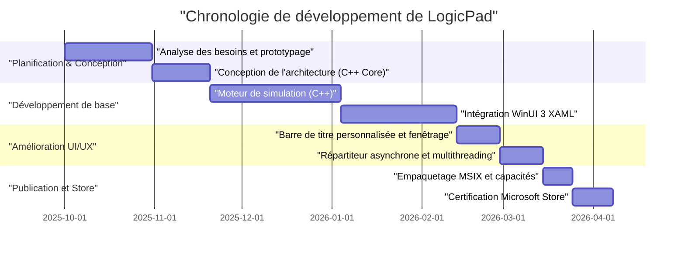
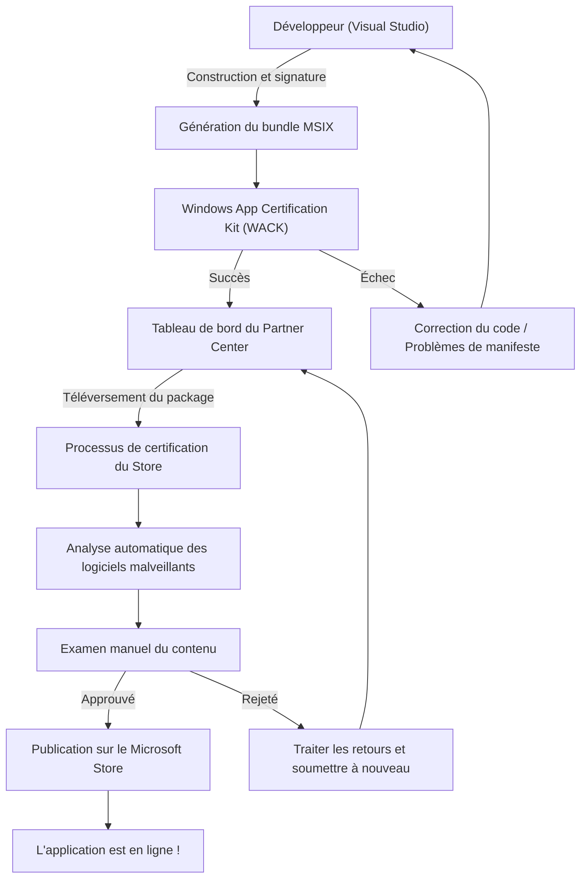

## 1. Introduction : pourquoi créer une application native Windows aujourd'hui

Il est indéniable que dans le développement d'applications modernes, les technologies multiplateformes telles qu'Electron, Tauri et React Native sont devenues la norme. L'approche consistant à utiliser les technologies web pour écrire une fois et exécuter partout (Write Once, Run Anywhere) est extrêmement rationnelle du point de vue de la vitesse de développement et de la maintenabilité. Cependant, j'ai délibérément choisi de développer "LogicPad" en tant qu'application native entièrement optimisée pour Windows.

LogicPad est un simulateur de circuits logiques numériques et un éditeur de texte ciblant les ingénieurs matériel et les étudiants en circuits logiques. Il doit simuler des dizaines de milliers de portes logiques en temps réel tout en effectuant un rendu de données de formes d'ondes complexes sans latence. Dans ce domaine nécessitant des performances extrêmes, les pauses de quelques millisecondes (micro-saccades) causées par le ramasse-miettes (garbage collection) et le surcoût de rendu des vues web entraînent une dégradation fatale de l'expérience utilisateur.

Cet article retrace le parcours du projet LogicPad, depuis sa conception jusqu'à l'implémentation en C++ et WinUI 3 (Windows App SDK), la résolution des défis techniques spécifiques, l'empaquetage MSIX et enfin la distribution mondiale via le Microsoft Store, avec des explications techniques très détaillées. J'espère qu'en partageant le processus par lequel un développeur indépendant peut créer une application Windows native de qualité professionnelle, cela servira de guide à ceux qui souhaitent également se lancer dans le développement natif.

## 2. Chronologie du projet

Le développement de LogicPad a été mené comme un projet personnel, profitant des week-ends et des soirées. La chronologie globale s'étend sur environ six mois. Voici un diagramme de Gantt illustrant l'avancement de ce projet.



Ainsi, la majeure partie du temps de développement a été consacrée à l'optimisation du moteur de base et à l'intégration du traitement asynchrone entre WinUI 3 et C++. Bien que le développement natif implique une configuration initiale et une courbe d'apprentissage plus élevées par rapport au développement multiplateforme, cet investissement est assurément rentabilisé par les performances finales.

## 3. Choix technologiques : au cœur de C++ / WinUI 3 / Windows App SDK

Lors du développement de LogicPad, le choix de la pile technologique a été l'une des décisions les plus importantes. Historiquement, il existe diverses options pour les frameworks d'interface utilisateur native sur la plateforme Windows, telles que l'API Win32 (User32/GDI), MFC, Windows Forms, WPF et UWP. Actuellement, la recommandation de Microsoft pour le développement moderne d'applications de bureau Windows est **WinUI 3**, qui est inclus dans le **Windows App SDK**.

### 3.1. Architecture du Windows App SDK et WinUI 3
Le Windows App SDK est un ensemble de bibliothèques permettant de fournir les dernières API Windows indépendamment de la version du système d'exploitation. Contrairement à l'ancienne UWP (Universal Windows Platform) qui était fortement liée aux mises à jour de l'OS, le Windows App SDK est distribué avec l'application, ce qui garantit un comportement cohérent de Windows 10 (version 1809 et ultérieures) à Windows 11.

WinUI 3 est un framework d'interface utilisateur native fonctionnant sur ce Windows App SDK et prenant entièrement en charge le Fluent Design System. L'intérieur de WinUI 3 est construit avec C++ et DirectX, ce qui le rend extrêmement rapide.

### 3.2. Pourquoi choisir délibérément C++ (C++/WinRT) plutôt que C#
C# et C++ sont tous deux pris en charge comme langages de développement pour WinUI 3. Bien que l'utilisation de C# et .NET améliore considérablement l'efficacité du développement, **C++/WinRT** a été adopté pour LogicPad pour les raisons suivantes :

1. **Gestion déterministe de la mémoire** : l'absence de ramasse-miettes (GC) permet de contrôler totalement le moment de l'allocation et de la libération de la mémoire. Cela empêche les pauses du GC pendant la boucle de simulation.
2. **SIMD et optimisation du cache** : en C++, la disposition physique de la mémoire (comme les Struct of Arrays) peut être strictement définie, maximisant ainsi le taux de réussite du cache CPU.
3. **Frontières ABI natives** : C++/WinRT est une projection C++ moderne de COM (Component Object Model). Il permet d'appeler directement les API natives de l'OS sans la surcharge du P/Invoke comme en C#.

À la base de C++/WinRT se trouve COM. Tous les objets WinRT sont intrinsèquement des objets COM implémentant l'interface `IUnknown`, et les pointeurs intelligents comme `winrt::com_ptr` de C++/WinRT gèrent automatiquement le comptage de références (`AddRef` / `Release`).

## 4. Les plus grands obstacles et percées dans le développement WinUI 3

Bien que puissant, le développement WinUI 3 utilisant C++/WinRT s'accompagne d'une complexité spécifique. J'explique ici en détail deux défis techniques majeurs rencontrés lors du développement de LogicPad, ainsi que leurs solutions.

### 4.1. La terreur des mises à jour asynchrones de l'interface utilisateur en C++ et les coroutines

La règle d'or des applications d'interface utilisateur modernes est : "ne jamais bloquer le thread de l'interface utilisateur". Dans LogicPad, d'énormes calculs de simulation de circuits doivent être exécutés dans un thread en arrière-plan, et les résultats doivent être reflétés dans le thread de l'interface utilisateur.

En C#, cela peut être écrit assez facilement en utilisant `async/await` et `DispatcherQueue`, mais en C++, cela est réalisé en combinant les coroutines C++20 avec `winrt::apartment_context`. La compréhension du modèle d'appartement de COM (STA : Single-Threaded Apartment et MTA : Multi-Threaded Apartment) est essentielle.

Le code suivant est un modèle extrait de la base de code réelle de LogicPad, effectuant de manière transparente des calculs en arrière-plan puis revenant au thread de l'interface utilisateur.

```cpp
#include <winrt/Windows.Foundation.h>
#include <winrt/Microsoft.UI.Dispatching.h>
#include <winrt/Microsoft.UI.Xaml.h>

using namespace winrt;
using namespace Microsoft::UI::Xaml;
using namespace Microsoft::UI::Dispatching;

// Gestionnaire d'événement de clic de bouton
winrt::fire_and_forget MainWindow::OnRunSimulationClicked(
    IInspectable const& /* sender */, 
    RoutedEventArgs const& /* args */)
{
    // Capturer le contexte d'appartement (STA) du thread de l'interface utilisateur actuel
    winrt::apartment_context ui_thread;

    try 
    {
        // Mettre à jour le statut de l'interface utilisateur (exécuté sur le thread UI)
        StatusTextBlock().Text(L"Simulation en cours...");
        ProgressBar().IsIndeterminate(true);

        // Déplacer le contexte vers le pool de threads (MTA)
        co_await winrt::resume_background();

        // Processus de simulation très lourd (exécuté dans un thread en arrière-plan)
        // Pendant ce temps, le thread de l'interface utilisateur est libéré, évitant le gel de l'application
        std::vector<LogicResult> results = CoreEngine::RunMassiveSimulation();
        
        // Formater le résultat de la simulation en chaîne de caractères (toujours exécuté en arrière-plan)
        winrt::hstring outputText = FormatResults(results);

        // Ramener le contexte au thread de l'interface utilisateur
        co_await ui_thread;

        // Désormais exécuté sur le thread UI, l'accès aux contrôles XAML est sûr
        ResultTextBlock().Text(outputText);
        ProgressBar().IsIndeterminate(false);
        StatusTextBlock().Text(L"Terminé");
    }
    catch (winrt::hresult_error const& ex)
    {
        // En cas d'exception, retourner au thread UI pour afficher le message d'erreur
        co_await ui_thread;
        StatusTextBlock().Text(L"Erreur : " + ex.message());
        ProgressBar().IsIndeterminate(false);
    }
}
```

Le comportement de ce `winrt::apartment_context` ressemble à de la magie, mais en interne, un mécanisme C++ avancé est à l'œuvre : il utilise l'interface `IContextCallback` pour mémoriser le contexte de thread d'origine et, lors du `co_await`, répartit (place en file d'attente) le traitement vers ce contexte. Cela permet d'écrire des processus asynchrones avec l'apparence d'un code procédural sans tomber dans l'enfer des rappels (callback hell).

### 4.2. Implémentation complète de la barre de titre personnalisée

Dans les applications de l'ère Windows 11, une "barre de titre personnalisée" (la zone de légende de la fenêtre) plaçant des onglets ou une barre de recherche est une exigence essentielle pour une UX moderne. Cependant, dans WinUI 3, changer simplement la couleur de la barre de titre est facile, mais la difficulté augmente considérablement si l'on souhaite satisfaire l'exigence "d'étendre la zone client dans la barre de titre tout en conservant le déplacement par glissement de la fenêtre et la disposition d'ancrage (redimensionnement automatique lorsqu'on colle la fenêtre au bord de l'écran)".

Dans LogicPad, j'ai utilisé l'API `ExtendsContentIntoTitleBar` pour construire la barre de titre avec des éléments XAML personnalisés. Le code suivant est la procédure de personnalisation de la barre de titre à l'aide de la classe `AppWindow` du Windows App SDK.

```cpp
#include <winrt/Microsoft.UI.Windowing.h>
#include <winrt/Microsoft.UI.Interop.h>
#include <microsoft.ui.interop.h> // for GetWindowIdFromWindow

void MainWindow::InitializeCustomTitleBar()
{
    // Obtenir le HWND (handle de la fenêtre) de la fenêtre actuelle
    auto windowNative = this->try_as<::IWindowNative>();
    HWND hwnd{ nullptr };
    windowNative->get_WindowHandle(&hwnd);

    // Convertir HWND en WindowId et obtenir l'instance AppWindow
    winrt::Microsoft::UI::WindowId windowId = 
        winrt::Microsoft::UI::GetWindowIdFromWindow(hwnd);
    auto appWindow = winrt::Microsoft::UI::Windowing::AppWindow::GetFromWindowId(windowId);

    // Vérifier si la version de l'OS prend en charge la personnalisation
    if (winrt::Microsoft::UI::Windowing::AppWindowTitleBar::IsCustomizationSupported())
    {
        auto titleBar = appWindow.TitleBar();
        
        // Étendre la zone client (contenu) dans la barre de titre
        titleBar.ExtendsContentIntoTitleBar(true);

        // Rendre l'arrière-plan des boutons de légende par défaut (minimiser, maximiser, fermer) transparent
        titleBar.ButtonBackgroundColor(winrt::Microsoft::UI::Colors::Transparent());
        titleBar.ButtonInactiveBackgroundColor(winrt::Microsoft::UI::Colors::Transparent());
        
        // Définir l'élément UI défini côté XAML (AppTitleBar) comme zone de glissement
        // *Pour les détails de cette partie, il faut surveiller le UIElement côté XAML avec le Dispatcher du thread UI,
        // et appeler SetDragRectangles() pour indiquer à l'OS la zone glissable.
    }
}
```

Le plus grand piège de cette implémentation est que chaque fois que la taille de l'élément UI côté XAML change (par exemple lors du redimensionnement de la fenêtre), il faut recalculer la zone de test d'impact à l'aide de `InputNonClientPointerSource` ou `SetDragRectangles` et notifier l'OS "voici la zone qui peut être glissée". Si l'on omet cela, des bugs surviennent, comme l'impossibilité de déplacer la fenêtre en glissant la barre de titre, ou au contraire, une tentative de cliquer sur un bouton considérée comme un glissement de fenêtre.

## 5. Les profondeurs de l'empaquetage MSIX et AppXManifest

Pour distribuer LogicPad une fois le développement terminé, il est nécessaire de créer un programme d'installation. Au lieu des installateurs traditionnels MSI ou EXE, j'ai adopté le format moderne **MSIX**. Le MSIX est très sûr et confortable pour l'utilisateur, car l'installation et la désinstallation se font proprement (sans polluer le registre) et il dispose d'une fonctionnalité de mise à jour automatique.

Cependant, lors de l'empaquetage d'une application native écrite en C++ avec MSIX, la configuration du `Package.appxmanifest` (fichier manifeste) est ce qui nécessite le plus d'attention.

LogicPad doit lire et écrire d'énormes fichiers de projets sauvegardés dans le système de fichiers local (comme le dossier Documents de l'utilisateur). Dans l'environnement sandbox standard de l'UWP, seule l'accès au dossier de données isolé de l'application (AppContainer) est possible. Pour obtenir des privilèges d'accès complets en tant qu'application de bureau native, il faut déclarer la capacité `runFullTrust` dans le manifeste.

```xml
<?xml version="1.0" encoding="utf-8"?>
<Package
  xmlns="http://schemas.microsoft.com/appx/manifest/foundation/windows10"
  xmlns:uap="http://schemas.microsoft.com/appx/manifest/uap/windows10"
  xmlns:rescap="http://schemas.microsoft.com/appx/manifest/foundation/windows10/restrictedcapabilities"
  IgnorableNamespaces="uap rescap">

  <Identity
    Name="LogicPad.Studio"
    Publisher="CN=Kenji"
    Version="1.0.0.0" />

  <Properties>
    <DisplayName>LogicPad</DisplayName>
    <PublisherDisplayName>Kenji</PublisherDisplayName>
    <Logo>Assets\StoreLogo.png</Logo>
  </Properties>

  <Dependencies>
    <TargetDeviceFamily Name="Windows.Desktop" MinVersion="10.0.17763.0" MaxVersionTested="10.0.22621.0" />
  </Dependencies>

  <Capabilities>
    <!-- Capacités générales -->
    <Capability Name="internetClient" />
    <!-- Capacité restreinte pour fonctionner comme une application de bureau native -->
    <rescap:Capability Name="runFullTrust" />
  </Capabilities>
</Package>
```

Ce `<rescap:Capability Name="runFullTrust" />` est appelé une "capacité restreinte" (Restricted Capability), et lors de la soumission au Microsoft Store, vous devez soumettre un document de justification aux examinateurs expliquant pourquoi cette autorisation est requise. J'ai expliqué que "cette application est un outil pour les professionnels qui lit, écrit et exporte des fichiers de projets de circuits logiques arbitraires sur le disque local de l'utilisateur", et elle a été approuvée sans problème.

## 6. Le chemin vers le Microsoft Store et le processus de certification

Une fois l'application terminée et le package MSIX construit, il est enfin temps de la soumettre au Microsoft Store. Pour les développeurs indépendants, la distribution via le Store présente des avantages inestimables, tels que la distribution automatique des mises à jour, la garantie de fiabilité et l'utilisation du système de paiement.

Le processus de soumission au Microsoft Store se fait via le Partner Center. L'organigramme suivant illustre l'ensemble du processus, de la construction à la publication.



### 6.1. Le mur du WACK (Windows App Certification Kit)
Avant de télécharger sur le Partner Center, vous devez exécuter le **WACK (Windows App Certification Kit)** localement pour réussir le pré-test. Le WACK est un outil qui teste automatiquement si l'application ne plante pas, n'appelle pas d'API non autorisées et répond aux exigences de performance.

Pour les applications natives C++, ce qu'il faut particulièrement surveiller, c'est l'erreur "Utilisation d'API non prises en charge". Si vous liez statiquement d'anciennes bibliothèques C++ tierces, elles peuvent utiliser des API Win32 obsolètes en interne, ce qui peut vous faire recaler lors de l'examen WACK. Pour contourner ce problème, j'ai mis à jour les bibliothèques dépendantes vers leurs dernières versions et réécrit certaines fonctions vers des API alternatives fournies par le Windows App SDK.

### 6.2. Examen et publication
La configuration dans le Partner Center comprend la tarification de l'application, les classifications par âge (notation IARC), et la saisie de captures d'écran et de descriptions pour le Store. Comme LogicPad est un outil technique, j'ai pu obtenir immédiatement une classification "pour tous les âges".

Il a fallu environ trois jours ouvrables pour que l'examen soit terminé après la soumission du package. Après l'analyse automatique des malwares et la vérification des fonctionnalités, une vérification manuelle du comportement est effectuée par l'équipe d'examen de Microsoft. La demande d'autorisation `runFullTrust` est également passée sans problème, et le sentiment d'accomplissement au moment où le statut est passé à "Publié" (In the Store) était irremplaçable.

## 7. Le développement indépendant comme entreprise : modèles mathématiques de performance et de rentabilité

Pour ne pas simplement se contenter d'avoir créé une application, mais mettre à jour continuellement LogicPad et en faire une activité viable, il est nécessaire d'évaluer quantitativement les indicateurs techniques et commerciaux.

### 7.1. Modèle d'optimisation de l'utilisation de la mémoire apporté par C++
Le plus grand atout de LogicPad est qu'il est extrêmement léger par rapport aux éditeurs basés sur Electron (ex: VSCode). L'empreinte mémoire totale de l'application $M_{total}$ peut être modélisée comme suit :

$$
M_{total} = M_{UI} + M_{engine} + M_{cache}
$$

Ici, $M_{UI}$, grâce au rendu natif de WinUI 3, est considérablement plus petit par rapport à Electron qui charge un moteur de navigation (environ 50 Mo).
De plus, la mémoire de la partie moteur C++ $M_{engine}$ évolue linéairement par rapport au nombre de portes logiques $N$, grâce à des structures optimisées et à l'élimination des pointeurs.

$$
M_{engine} = N \times \text{sizeof(LogicNode)}
$$

En utilisant `#pragma pack` en C++ pour optimiser l'alignement des structures, j'ai réduit la mémoire par nœud à son extrême limite.

```cpp
#pragma pack(push, 1)
// Minimiser la mémoire en compactant sans avoir de table de fonctions virtuelles (vtable)
struct LogicNode {
    uint32_t id;         // 4 octets
    uint16_t type;       // 2 octets
    bool isActive;       // 1 octet
    // La taille de la structure est de 7 octets (sans remplissage d'alignement)
};
#pragma pack(pop)
```

La mémoire de la couche de cache $M_{cache}$ augmente proportionnellement à $\mathcal{O}(N \log N)$ pour conserver l'historique de simulation, mais comme l'empreinte de base est petite, même avec un circuit de dizaines de milliers de nœuds, l'utilisation globale de la RAM du système reste inférieure à 200 Mo.

### 7.2. LTV et CAC : les calculs du marketing
Dans la stratégie de monétisation pour le développement indépendant, l'équilibre entre la valeur vie client (LTV : Lifetime Value) et le coût d'acquisition client (CAC : Customer Acquisition Cost) est primordial. LogicPad n'utilise pas un modèle d'abonnement, mais un modèle de licence à achat unique (Freemium).

La LTV est calculée comme la somme de la valeur actualisée de la probabilité d'acheter de futures versions de mise à niveau, actualisée par le taux d'actualisation $d$. Pour une période $T$, cela est exprimé par la formule suivante :

$$
LTV = \sum_{t=1}^{T} \frac{ARPU_t \times Margin}{(1+d)^t}
$$

D'un autre côté, le CAC est le montant total des coûts de marketing engagés via des publicités sur Twitter (actuellement X) ou le flux provenant d'articles de blog, divisé par le nombre de nouveaux utilisateurs.

$$
CAC = \frac{D\acute{e}penses\ de\ marketing\ totales}{Nombre\ de\ nouveaux\ utilisateurs}
$$

La force du développement indépendant réside dans le fait que le coût de la main-d'œuvre pour le développement peut être considéré comme des coûts irrécupérables en tant que "temps de loisir", de sorte que le CAC peut être calculé uniquement sur la base des coûts de marketing purs. Actuellement, grâce à un flux organique centré sur le bouche-à-oreille dans des communautés techniques de niche, nous atteignons une économie unitaire saine avec $LTV > CAC$ dans un état proche de $CAC \approx 0$.

## 8. Conclusion : le monde fastidieux mais magnifique du développement d'applications natives

En regardant en arrière sur le parcours depuis le développement de LogicPad jusqu'à sa sortie sur le Microsoft Store, ce ne fut en aucun cas un chemin facile, avec la lutte contre les erreurs de compilation complexes de C++/WinRT, la traque des fuites de mémoire dues aux bugs de comptage de références COM, et la recherche des spécifications XML du manifeste MSIX.

C'est précisément parce que l'évolution des technologies web a rendu possible de "tout créer dans le navigateur" que l'expérience du développement natif, qui appelle directement les API de l'OS et prête attention à chaque octet de mémoire et à chaque cycle d'horloge du CPU, améliore considérablement les capacités fondamentales en tant qu'ingénieur.

WinUI 3 et le Windows App SDK sont toujours activement développés et constituent les meilleurs outils pour créer de belles applications qui tirent pleinement parti du paradigme d'interface utilisateur de Windows 11. J'espère sincèrement que cet article de blog aidera les développeurs qui sont sur le point de relever le défi du développement d'applications Windows natives, et qu'il contribuera à l'arrivée d'encore plus d'applications fantastiques sur le Store.

Le développement n'est pas encore terminé. Dans la prochaine version de LogicPad, nous prévoyons d'intégrer notre propre moteur de rendu de formes d'ondes tirant parti de Direct2D. Dans le prochain article, nous approfondirons l'interopérabilité entre DirectX et WinUI 3 (utilisation de SwapChainPanel). Restez à l'écoute !
