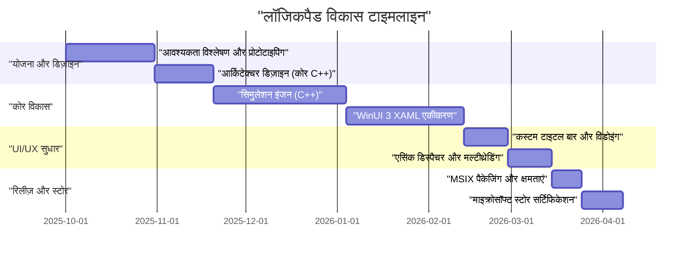
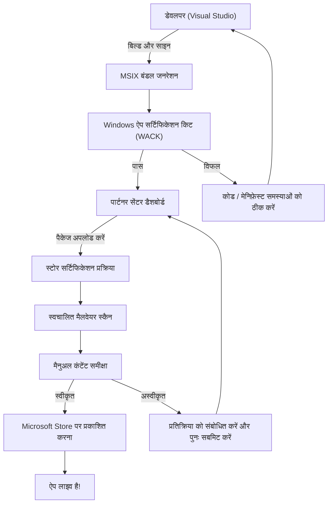

## 1. परिचय: अब जानबूझकर विंडोज़ नेटिव ऐप क्यों बनाया जाए?

इसमें कोई शक नहीं है कि आधुनिक एप्लिकेशन विकास में, इलैक्ट्रॉन (Electron), टौरी (Tauri), और रिएक्ट नेटिव (React Native) जैसी क्रॉस-प्लेटफ़ॉर्म तकनीकें मुख्यधारा बन गई हैं। वेब तकनीकों का उपयोग करके "एक बार लिखें, कहीं भी चलाएं" (Write Once, Run Anywhere) का दृष्टिकोण विकास की गति और रखरखाव के दृष्टिकोण से बहुत ही तर्कसंगत है। हालाँकि, मैंने जानबूझकर "LogicPad" नामक एप्लिकेशन को पूरी तरह से Windows के लिए अनुकूलित नेटिव एप्लिकेशन के रूप में विकसित करने का मार्ग चुना।

LogicPad एक डिजिटल लॉजिक सर्किट सिम्युलेटर और टेक्स्ट एडिटर है, जिसका लक्ष्य हार्डवेयर इंजीनियरों और लॉजिक सर्किट सीखने वालों के लिए है। इसे वास्तविक समय में हजारों लॉजिक गेट्स का अनुकरण करने और एक ही समय में बिना किसी देरी के जटिल वेवफॉर्म डेटा को रेंडर करने की आवश्यकता होती है। ऐसे क्षेत्रों में जहां इस तरह के अत्यधिक प्रदर्शन की आवश्यकता होती है, गारबेज कलेक्शन (Garbage Collection) के कारण कुछ मिलीसेकंड का ठहराव (माइक्रो-स्टटर) या वेब-व्यू का रेंडरिंग ओवरहेड उपयोगकर्ता अनुभव में घातक गिरावट का कारण बनता है।

इस लेख में, हम LogicPad की विकास अवधारणा से लेकर C++ और WinUI 3 (Windows App SDK) का उपयोग करके इसके कार्यान्वयन, विशिष्ट तकनीकी बाधाओं को दूर करने, MSIX पैकेजिंग, और Microsoft Store के माध्यम से इसके विश्वव्यापी वितरण तक की यात्रा पर अत्यंत विस्तृत तकनीकी स्पष्टीकरण के साथ नज़र डालेंगे। एक व्यक्तिगत डेवलपर कैसे एंटरप्राइज़-गुणवत्ता वाला नेटिव विंडोज़ ऐप बनाता है, इस प्रक्रिया को साझा करके, मुझे उम्मीद है कि यह उन लोगों के लिए एक मार्गदर्शक के रूप में काम करेगा जो इसी तरह नेटिव विकास को चुनौती दे रहे हैं।

## 2. प्रोजेक्ट की टाइमलाइन (Project Timeline)

LogicPad का विकास सप्ताहांत और रात के समय का उपयोग करते हुए एक व्यक्तिगत प्रोजेक्ट के रूप में किया गया था। कुल टाइमलाइन लगभग आधा वर्ष (6 महीने) तक फैली हुई है। नीचे एक गैंट (Gantt) चार्ट है जो प्रोजेक्ट की प्रगति को दर्शाता है।



इस प्रकार, विकास के समय का अधिकांश भाग कोर इंजन के अनुकूलन और WinUI 3 और C++ के बीच एसिंक्रोनस (asynchronous) प्रोसेसिंग के एकीकरण में व्यतीत हुआ। यद्यपि क्रॉस-प्लेटफ़ॉर्म विकास की तुलना में नेटिव विकास में प्रारंभिक सेटअप और सीखने की लागत अधिक होती है, लेकिन यह निवेश अंतिम प्रदर्शन के रूप में निश्चित रूप से वापस मिल जाता है।

## 3. तकनीकी चयन: C++ / WinUI 3 / Windows App SDK की गहराई

LogicPad के विकास के लिए, तकनीकी स्टैक का चयन सबसे महत्वपूर्ण निर्णयों में से एक था। विंडोज़ प्लेटफ़ॉर्म पर नेटिव UI फ़्रेमवर्क के लिए ऐतिहासिक रूप से Win32 API (User32/GDI), MFC, Windows Forms, WPF और UWP जैसे कई विकल्प मौजूद हैं। वर्तमान में, माइक्रोसॉफ्ट आधुनिक विंडोज़ डेस्कटॉप एप्लिकेशन विकास के लिए **Windows App SDK** के साथ बंडल किए गए **WinUI 3** की सिफारिश करता है।

### 3.1. Windows App SDK और WinUI 3 का आर्किटेक्चर
Windows App SDK लाइब्रेरीज़ का एक सेट है जो OS संस्करण पर निर्भर किए बिना नवीनतम विंडोज़ API प्रदान करता है। पारंपरिक UWP (Universal Windows Platform) OS अपडेट के साथ मजबूती से जुड़ा हुआ था, जबकि Windows App SDK एप्लिकेशन के साथ वितरित किया जाता है, जिससे Windows 10 (संस्करण 1809 और बाद के) से लेकर Windows 11 तक निरंतर संचालन सुनिश्चित होता है।

WinUI 3 एक नेटिव UI फ़्रेमवर्क है जो इस Windows App SDK पर चलता है, और यह Fluent Design System का पूरी तरह से समर्थन करता है। WinUI 3 के इंटर्नल C++ और DirectX के साथ बनाए गए हैं, और यह बहुत तेज़ी से काम करता है।

### 3.2. C# के बजाय जानबूझकर C++ (C++/WinRT) को चुनने का कारण
WinUI 3 के लिए विकास भाषाओं के रूप में C# और C++ समर्थित हैं। यदि आप C# और .NET का उपयोग करते हैं तो विकास दक्षता में काफी सुधार होता है, लेकिन LogicPad ने निम्नलिखित कारणों से **C++/WinRT** को अपनाया:

1. **नियतात्मक मेमोरी प्रबंधन (Deterministic Memory Management)**: चूंकि कोई गारबेज कलेक्टर (GC) नहीं है, इसलिए आप मेमोरी आवंटन और डी-एलोकेशन के समय को पूरी तरह से नियंत्रित कर सकते हैं। यह सिमुलेशन लूप के दौरान GC पॉज़ को होने से रोकता है।
2. **SIMD और कैश ऑप्टिमाइज़ेशन**: C++ में, आप मेमोरी के भौतिक लेआउट (जैसे Struct of Arrays) को सख्ती से परिभाषित कर सकते हैं, जिससे CPU कैश हिट दर अधिकतम हो जाती है।
3. **नेटिव ABI सीमा**: C++/WinRT, COM (Component Object Model) का एक आधुनिक C++ प्रोजेक्शन है। यह आपको C# के P/Invoke ओवरहेड के बिना सीधे OS के नेटिव API को कॉल करने की अनुमति देता है।

COM, C++/WinRT के मूल में मौजूद है। सभी WinRT ऑब्जेक्ट अनिवार्य रूप से COM ऑब्जेक्ट होते हैं जो `IUnknown` इंटरफ़ेस को लागू करते हैं, और C++/WinRT के स्मार्ट पॉइंटर्स जैसे कि `winrt::com_ptr` स्वचालित रूप से संदर्भ गणना (Reference Counting - `AddRef` / `Release`) का प्रबंधन करते हैं।

## 4. WinUI 3 विकास में सबसे बड़ी बाधाएं और सफलताएं

C++/WinRT का उपयोग करके WinUI 3 विकास यद्यपि शक्तिशाली है, इसके साथ ही यह विशिष्ट जटिलताएँ भी लाता है। यहां, मैं उन दो प्रमुख तकनीकी चुनौतियों और उनके समाधानों के बारे में विस्तार से बताऊंगा जिनसे LogicPad के विकास के दौरान मुझे विशेष रूप से संघर्ष करना पड़ा था।

### 4.1. C++ में एसिंक्रोनस UI अपडेट्स का डर और कोरूटीन (Coroutines)

आधुनिक UI एप्लिकेशन का एक सख्त नियम यह है कि "UI थ्रेड को ब्लॉक नहीं किया जाना चाहिए"। LogicPad में, विशाल सर्किटों के सिमुलेशन गणनाओं को बैकग्राउंड थ्रेड पर निष्पादित करना और परिणामों को UI थ्रेड पर प्रतिबिंबित करना आवश्यक है।

C# में, इसे `async/await` और `DispatcherQueue` का उपयोग करके अपेक्षाकृत आसानी से लिखा जा सकता है, लेकिन C++ में, इसे C++20 कोरूटीन (Coroutines) और `winrt::apartment_context` के संयोजन से प्राप्त किया जाता है। COM के अपार्टमेंट मॉडल (STA: Single-Threaded Apartment और MTA: Multi-Threaded Apartment) की समझ आवश्यक है।

निम्नलिखित कोड LogicPad के वास्तविक कोडबेस से निकाला गया एक पैटर्न है जो निर्बाध रूप से बैकग्राउंड गणनाएं करता है और फिर UI थ्रेड पर वापस आ जाता है।

```cpp
#include <winrt/Windows.Foundation.h>
#include <winrt/Microsoft.UI.Dispatching.h>
#include <winrt/Microsoft.UI.Xaml.h>

using namespace winrt;
using namespace Microsoft::UI::Xaml;
using namespace Microsoft::UI::Dispatching;

// बटन क्लिक का इवेंट हैंडलर
winrt::fire_and_forget MainWindow::OnRunSimulationClicked(
    IInspectable const& /* sender */, 
    RoutedEventArgs const& /* args */)
{
    // वर्तमान UI थ्रेड के अपार्टमेंट कॉन्टेक्स्ट (STA) को कैप्चर करें
    winrt::apartment_context ui_thread;

    try 
    {
        // UI का स्टेटस अपडेट करें (यह UI थ्रेड पर निष्पादित होता है)
        StatusTextBlock().Text(L"सिमुलेशन चल रहा है...");
        ProgressBar().IsIndeterminate(true);

        // थ्रेड पूल (MTA) में कॉन्टेक्स्ट को माइग्रेट करें
        co_await winrt::resume_background();

        // बहुत भारी सिमुलेशन प्रोसेसिंग (बैकग्राउंड थ्रेड पर निष्पादित)
        // इस बीच, UI थ्रेड मुक्त हो जाता है, जिससे एप्लिकेशन को फ़्रीज़ होने से रोका जा सकता है
        std::vector<LogicResult> results = CoreEngine::RunMassiveSimulation();
        
        // सिमुलेशन परिणामों को स्ट्रिंग में फ़ॉर्मेट करें (बैकग्राउंड में चलना जारी है)
        winrt::hstring outputText = FormatResults(results);

        // कॉन्टेक्स्ट को वापस UI थ्रेड पर लौटाएं
        co_await ui_thread;

        // चूँकि इसके बाद यह UI थ्रेड पर निष्पादित होता है, XAML कंट्रोल्स को सुरक्षित रूप से एक्सेस किया जा सकता है
        ResultTextBlock().Text(outputText);
        ProgressBar().IsIndeterminate(false);
        StatusTextBlock().Text(L"पूरा हुआ");
    }
    catch (winrt::hresult_error const& ex)
    {
        // अपवाद (exception) होने पर भी त्रुटि संदेश प्रदर्शित करने के लिए UI थ्रेड पर वापस लौटें
        co_await ui_thread;
        StatusTextBlock().Text(L"त्रुटि: " + ex.message());
        ProgressBar().IsIndeterminate(false);
    }
}
```

इस `winrt::apartment_context` का व्यवहार जादुई लग सकता है, लेकिन आंतरिक रूप से, यह `IContextCallback` इंटरफ़ेस का उपयोग करके मूल थ्रेड कॉन्टेक्स्ट को याद रखने और `co_await` के दौरान उस कॉन्टेक्स्ट पर प्रोसेसिंग को डिस्पैच (एनक्यू) करने के लिए एक उन्नत C++ तंत्र को नियोजित करता है। यह आपको कॉलबैक हेल (callback hell) में गिरे बिना प्रक्रियात्मक कोड की तरह दिखने वाले एसिंक्रोनस प्रोसेसिंग को लिखने की अनुमति देता है।

### 4.2. कस्टम टाइटल बार का पूर्ण कार्यान्वयन

Windows 11 युग के एप्लिकेशन्स में, विंडो के टाइटल बार (कैप्शन एरिया) में टैब या सर्च बॉक्स रखने वाला "कस्टम टाइटल बार" आधुनिक UX (उपयोगकर्ता अनुभव) के लिए एक आवश्यक आवश्यकता है। हालाँकि, WinUI 3 में टाइटल बार को कस्टमाइज़ करना आसान है यदि आप केवल रंग बदलना चाहते हैं, लेकिन "विंडो को ड्रैग करने और स्नैप लेआउट (जब विंडो स्क्रीन के किनारे पर जाती है तो ऑटोमैटिक रीसाइज़िंग) को बनाए रखते हुए क्लाइंट एरिया को टाइटल बार तक विस्तारित करने" की आवश्यकता को पूरा करने का प्रयास करते समय कठिनाई स्तर एकदम से बढ़ जाता है।

LogicPad में, मैंने `ExtendsContentIntoTitleBar` API का उपयोग करके कस्टम XAML तत्वों के साथ टाइटल बार बनाया। नीचे दिया गया कोड Windows App SDK की `AppWindow` क्लास का उपयोग करके टाइटल बार को कस्टमाइज़ करने के लिए एक चरण-दर-चरण मार्गदर्शिका है।

```cpp
#include <winrt/Microsoft.UI.Windowing.h>
#include <winrt/Microsoft.UI.Interop.h>
#include <microsoft.ui.interop.h> // for GetWindowIdFromWindow

void MainWindow::InitializeCustomTitleBar()
{
    // वर्तमान विंडो का HWND (विंडो हैंडल) प्राप्त करें
    auto windowNative = this->try_as<::IWindowNative>();
    HWND hwnd{ nullptr };
    windowNative->get_WindowHandle(&hwnd);

    // HWND से WindowId में कनवर्ट करें और AppWindow इंस्टेंस प्राप्त करें
    winrt::Microsoft::UI::WindowId windowId = 
        winrt::Microsoft::UI::GetWindowIdFromWindow(hwnd);
    auto appWindow = winrt::Microsoft::UI::Windowing::AppWindow::GetFromWindowId(windowId);

    // जांचें कि क्या कस्टमाइज़ेशन समर्थित OS संस्करण है
    if (winrt::Microsoft::UI::Windowing::AppWindowTitleBar::IsCustomizationSupported())
    {
        auto titleBar = appWindow.TitleBar();
        
        // क्लाइंट एरिया (कंटेंट) को टाइटल बार तक विस्तारित करें
        titleBar.ExtendsContentIntoTitleBar(true);

        // डिफ़ॉल्ट कैप्शन बटन (मिनिमाइज़, मैक्सिमाइज़, क्लोज़) के बैकग्राउंड को पारदर्शी बनाएं
        titleBar.ButtonBackgroundColor(winrt::Microsoft::UI::Colors::Transparent());
        titleBar.ButtonInactiveBackgroundColor(winrt::Microsoft::UI::Colors::Transparent());
        
        // XAML साइड पर परिभाषित UI तत्व (AppTitleBar) को ड्रैग क्षेत्र के रूप में सेट करें
        // ※ इस भाग के विवरण के लिए, XAML साइड पर UIElement को UI थ्रेड के Dispatcher के साथ मॉनिटर करना आवश्यक है, 
        // और OS को ड्रैगेबल क्षेत्र बताने के लिए SetDragRectangles() को कॉल करना होगा।
    }
}
```

इस कार्यान्वयन में सबसे बड़ा जाल यह है कि हर बार जब XAML साइड पर UI तत्व का आकार बदलता है (जैसे कि जब विंडो का आकार बदला जाता है), तो आपको `InputNonClientPointerSource` और `SetDragRectangles` का उपयोग करके हिट-टेस्ट क्षेत्र की फिर से गणना करके OS को सूचित करना होगा कि "यह एक ड्रैगेबल क्षेत्र है"। यदि आप ऐसा करने में विफल रहते हैं, तो कीड़े (bugs) होंगे जैसे कि जब आप टाइटल बार को ड्रैग करते हैं तो विंडो हिलती नहीं है, या इसके विपरीत, जब आप किसी बटन पर क्लिक करना चाहते हैं, तो यह विंडो ड्रैग के रूप में निर्धारित होता है।

## 5. MSIX पैकेजिंग और AppXManifest की गहराई

विकास पूरा होने के बाद LogicPad को वितरित करने के लिए एक इंस्टॉलर बनाना आवश्यक है। पारंपरिक MSI या EXE इंस्टॉलरों के बजाय, मैंने आधुनिक **MSIX** प्रारूप को अपनाया। MSIX पूरी तरह से साफ इंस्टॉलेशन और अनइंस्टॉलेशन (रजिस्ट्री को प्रदूषित किए बिना) प्रदान करता है, और इसमें स्वचालित अपडेट भी शामिल हैं, जिससे यह उपयोगकर्ताओं के लिए बहुत सुरक्षित और आरामदायक हो जाता है।

हालाँकि, C++ में लिखे गए नेटिव ऐप को MSIX के साथ पैकेज करते समय, जिस चीज़ पर सबसे ज़्यादा ध्यान देने की ज़रूरत है, वह है `Package.appxmanifest` (मेनिफ़ेस्ट फ़ाइल) की सेटिंग।

LogicPad को स्थानीय फ़ाइल सिस्टम (जैसे उपयोगकर्ता का दस्तावेज़ फ़ोल्डर) में सहेजी गई बड़ी प्रोजेक्ट फ़ाइलों को पढ़ने और लिखने की आवश्यकता होती है। एक मानक UWP सैंडबॉक्स वातावरण में, ऐप केवल अपने स्वयं के पृथक डेटा फ़ोल्डर (AppContainer) तक ही पहुंच सकता है। नेटिव डेस्कटॉप ऐप के रूप में पूर्ण पहुँच विशेषाधिकार प्राप्त करने के लिए, आपको मेनिफ़ेस्ट में `runFullTrust` क्षमता (capability) घोषित करनी होगी।

```xml
<?xml version="1.0" encoding="utf-8"?>
<Package
  xmlns="http://schemas.microsoft.com/appx/manifest/foundation/windows10"
  xmlns:uap="http://schemas.microsoft.com/appx/manifest/uap/windows10"
  xmlns:rescap="http://schemas.microsoft.com/appx/manifest/foundation/windows10/restrictedcapabilities"
  IgnorableNamespaces="uap rescap">

  <Identity
    Name="LogicPad.Studio"
    Publisher="CN=Kenji"
    Version="1.0.0.0" />

  <Properties>
    <DisplayName>LogicPad</DisplayName>
    <PublisherDisplayName>Kenji</PublisherDisplayName>
    <Logo>Assets\StoreLogo.png</Logo>
  </Properties>

  <Dependencies>
    <TargetDeviceFamily Name="Windows.Desktop" MinVersion="10.0.17763.0" MaxVersionTested="10.0.22621.0" />
  </Dependencies>

  <Capabilities>
    <!-- सामान्य कार्य प्रतिबंध -->
    <Capability Name="internetClient" />
    <!-- नेटिव डेस्कटॉप ऐप के रूप में चलने के लिए प्रतिबंधित क्षमता -->
    <rescap:Capability Name="runFullTrust" />
  </Capabilities>
</Package>
```

इस `<rescap:Capability Name="runFullTrust" />` को "प्रतिबंधित क्षमता (Restricted Capability)" कहा जाता है, और जब आप इसे Microsoft Store में सबमिट करते हैं, तो आपको एक औचित्य (justification) सबमिट करना होगा जो समीक्षकों को समझाता है कि इस अनुमति की आवश्यकता क्यों है। मैंने समझाया कि "यह ऐप एक पेशेवर उपकरण है जो उपयोगकर्ता के स्थानीय डिस्क पर किसी भी लॉजिक सर्किट प्रोजेक्ट फ़ाइल को पढ़ता, लिखता और एक्सपोर्ट करता है," और इसे बिना किसी समस्या के मंजूरी मिल गई।

## 6. माइक्रोसॉफ्ट स्टोर का रास्ता और समीक्षा प्रक्रिया (Microsoft Store Journey and Certification Process)

एप्लिकेशन के पूरा होने और MSIX पैकेज के निर्माण के बाद, यह अंततः Microsoft Store में प्रस्तुत करने का समय है। एक व्यक्तिगत डेवलपर के लिए, स्टोर के माध्यम से वितरण के अथाह लाभ हैं, जैसे कि स्वचालित अपडेट वितरण, विश्वसनीयता की गारंटी और भुगतान प्रणाली का उपयोग।

Microsoft Store में सबमिशन प्रक्रिया Partner Center (पार्टनर सेंटर) के माध्यम से की जाती है। नीचे दिया गया फ़्लोचार्ट बिल्ड से लेकर प्रकाशन तक की पूरी तस्वीर दिखाता है।



### 6.1. WACK (Windows App Certification Kit) की बाधा
Partner Center पर अपलोड करने से पहले, आपको स्थानीय रूप से **WACK (Windows App Certification Kit)** चलाना होगा और पूर्व-परीक्षण (pre-test) पास करना होगा। WACK एक ऐसा टूल है जो स्वचालित रूप से परीक्षण करता है कि क्या ऐप क्रैश तो नहीं होता, अवैध APIs को कॉल तो नहीं करता, या प्रदर्शन आवश्यकताओं को पूरा करता है या नहीं।

C++ नेटिव ऐप्स के मामले में, जिस चीज़ से आपको विशेष रूप से सावधान रहने की आवश्यकता है वह है "असमर्थित API का उपयोग (Use of unsupported APIs)" त्रुटि। यदि आप स्थिर रूप से (statically link) पुराने थर्ड-पार्टी C++ लाइब्रेरीज़ को लिंक करते हैं, तो उस लाइब्रेरी के अंदर बहिष्कृत (deprecated) Win32 API का उपयोग किया जा सकता है, जिसे WACK समीक्षा के दौरान अस्वीकार किया जा सकता है। इस समस्या से बचने के लिए, मैंने निर्भर लाइब्रेरीज़ (dependent libraries) को नवीनतम संस्करणों में अपडेट किया, और कुछ फ़ंक्शन्स को Windows App SDK द्वारा प्रदान किए गए वैकल्पिक API से फिर से लिखा।

### 6.2. समीक्षा और प्रकाशन
Partner Center की सेटिंग्स में ऐप की कीमत, आयु वर्गीकरण (IARC रेटिंग), स्टोर के लिए स्क्रीनशॉट और विवरण इनपुट करना शामिल है। चूंकि LogicPad एक तकनीकी टूल है, इसलिए मैं तुरंत सभी उम्र वालों के लिए रेटिंग प्राप्त करने में सक्षम हो गया।

पैकेज सबमिट करने के बाद समीक्षा पूरी होने में लगभग 3 कार्य दिवस (business days) लगे। स्वचालित मैलवेयर स्कैन और फीचर चेक के बाद, माइक्रोसॉफ्ट की समीक्षा टीम द्वारा एक मैनुअल ऑपरेशन चेक किया जाता है। `runFullTrust` अनुमति अनुरोध भी बिना किसी समस्या के पारित हो गया, और जिस क्षण स्टेटस "प्रकाशन पूर्ण (In the Store)" में बदल गया, तब जो उपलब्धि की भावना महसूस हुई, वह किसी भी चीज़ से बेजोड़ थी।

## 7. एक व्यवसाय के रूप में व्यक्तिगत विकास: प्रदर्शन और राजस्व का गणितीय मॉडल

केवल एक ऐप बनाने से संतुष्ट होने के बजाय, LogicPad को लगातार अपडेट करने और इसे एक व्यवहार्य व्यवसाय बनाने के लिए, तकनीकी और व्यावसायिक दोनों मेट्रिक्स का मात्रात्मक रूप से (quantitatively) मूल्यांकन करना आवश्यक है।

### 7.1. C++ द्वारा लाया गया मेमोरी उपयोग अनुकूलन मॉडल
LogicPad की सबसे बड़ी ताकत यह है कि यह Electron-आधारित संपादकों (जैसे VSCode) की तुलना में बहुत हल्का है। एप्लिकेशन के मेमोरी फ़ुटप्रिंट $M_{total}$ को निम्नानुसार मॉडल किया जा सकता है:

$$
M_{total} = M_{UI} + M_{engine} + M_{cache}
$$

यहां, WinUI 3 के नेटिव रेंडरिंग के कारण $M_{UI}$ Electron की तुलना में नाटकीय रूप से छोटा (लगभग 50MB) है, जो एक ब्राउज़र इंजन लोड करता है। इसके अलावा, C++ इंजन वाले हिस्से की मेमोरी $M_{engine}$ लॉजिक गेट्स की संख्या $N$ के सापेक्ष, अनुकूलित संरचनाओं (optimized structures) और पॉइंटर्स के निष्कासन के कारण रैखिक (linearly) रूप से स्केल होती है।

$$
M_{engine} = N \times \text{sizeof(LogicNode)}
$$

C++ के `#pragma pack` का उपयोग करके संरचना के अलाइनमेंट (alignment) को अनुकूलित करके, मैंने प्रति नोड मेमोरी को उसकी सीमा तक कम कर दिया है।

```cpp
#pragma pack(push, 1)
// वर्चुअल फ़ंक्शन टेबल (vtable) के बिना इसे पैक करके मेमोरी को छोटा करें
struct LogicNode {
    uint32_t id;         // 4 bytes
    uint16_t type;       // 2 bytes
    bool isActive;       // 1 byte
    // संरचना (struct) का आकार 7 bytes है (अलाइनमेंट पैडिंग के बिना)
};
#pragma pack(pop)
```

कैश लेयर की मेमोरी $M_{cache}$, सिमुलेशन इतिहास को बनाए रखने के लिए $\mathcal{O}(N \log N)$ के अनुपात में बढ़ जाती है, लेकिन चूँकि बेस फ़ुटप्रिंट छोटा है, यहां तक कि हजारों नोड्स वाले सर्किट के साथ भी, पूरे सिस्टम का RAM उपयोग 200MB से कम रहता है।

### 7.2. LTV और CAC: मार्केटिंग की गणना
व्यक्तिगत विकास के लिए मुद्रीकरण (monetization) रणनीति में, ग्राहक आजीवन मूल्य (LTV: Lifetime Value) और ग्राहक अधिग्रहण लागत (CAC: Customer Acquisition Cost) का संतुलन ही सब कुछ है। LogicPad सदस्यता (subscription) के बजाय, वन-टाइम परचेस लाइसेंस मॉडल (Freemium) का उपयोग करता है।

LTV की गणना डिस्काउंट रेट $d$ द्वारा भविष्य के अपग्रेड खरीदारी की संभावना को छूट देकर, वर्तमान मूल्य के योग के रूप में की जाती है। यदि अवधि $T$ है, तो इसे निम्नलिखित सूत्र द्वारा व्यक्त किया जा सकता है:

$$
LTV = \sum_{t=1}^{T} \frac{ARPU_t \times Margin}{(1+d)^t}
$$

दूसरी ओर, CAC मार्केटिंग खर्च की कुल राशि (जैसे Twitter (अब X) विज्ञापन या ब्लॉग पोस्ट से ट्रैफ़िक) को नए उपयोगकर्ताओं की संख्या से विभाजित करके प्राप्त किया जाता है।

$$
CAC = \frac{Total\ Marketing\ Spend}{Number\ of\ New\ Users}
$$

व्यक्तिगत विकास का फायदा यह है कि विकास से जुड़ी श्रम लागत को "शौक के समय" के रूप में एक डूबी हुई लागत (sunk cost) में बदला जा सकता है, जिससे CAC की गणना केवल शुद्ध विपणन (marketing) लागत के साथ की जा सकती है। वर्तमान में, विशिष्ट तकनीकी समुदायों में वर्ड-ऑफ़-माउथ पर केंद्रित ऑर्गेनिक ट्रैफ़िक के साथ, हम $CAC \approx 0$ की निकट-शून्य स्थिति में $LTV > CAC$ के स्वस्थ यूनिट अर्थशास्त्र (unit economics) को प्राप्त कर रहे हैं।

## 8. निष्कर्ष: नेटिव ऐप विकास की गंदी लेकिन खूबसूरत दुनिया

LogicPad के विकास से लेकर Microsoft Store पर इसके रिलीज़ होने तक की यात्रा को पीछे मुड़कर देखें, तो यह कोई आसान रास्ता नहीं था, जिसमें C++/WinRT की कठिन कंपाइल त्रुटियों से जूझना, COM संदर्भ गणना (reference counting) बग्स के कारण मेमोरी लीक को ट्रैक करना और MSIX मैनिफेस्ट के XML विनिर्देशों की जांच करना शामिल था।

ठीक इसलिए क्योंकि वेब प्रौद्योगिकी का विकास उस युग में आ गया है जहाँ "ब्राउज़र में कुछ भी बनाया जा सकता है," नेटिव विकास का अनुभव - जो सीधे OS APIs को कॉल करता है और मेमोरी के एक बाइट और CPU के allocation पर भी ध्यान देता है - एक इंजीनियर के रूप में आपकी बुनियादी ताकत को अत्यधिक बढ़ा देता है।

WinUI 3 और Windows App SDK अभी भी सक्रिय विकास में हैं और Windows 11 के UI प्रतिमान का अधिकतम लाभ उठाने वाले सुंदर एप्लिकेशन बनाने के लिए सर्वोत्तम उपकरण हैं। मुझे पूरी उम्मीद है कि यह ब्लॉग पोस्ट उन डेवलपर्स की मदद करेगा जो विंडोज़ नेटिव ऐप विकास को चुनौती देने वाले हैं, और स्टोर में अधिक से अधिक बेहतरीन ऐप्स कतार में होंगे।

विकास अभी ख़त्म नहीं हुआ है। LogicPad के अगले संस्करण में, हम Direct2D का उपयोग करके एक कस्टम वेवफॉर्म रेंडरिंग इंजन को एकीकृत करने की योजना बना रहे हैं। अगले लेख में, हम DirectX और WinUI 3 के बीच इंटरऑपरेबिलिटी (SwapChainPanel का उपयोग) में गहराई से उतरेंगे। कृपया इसके लिए बने रहें।
