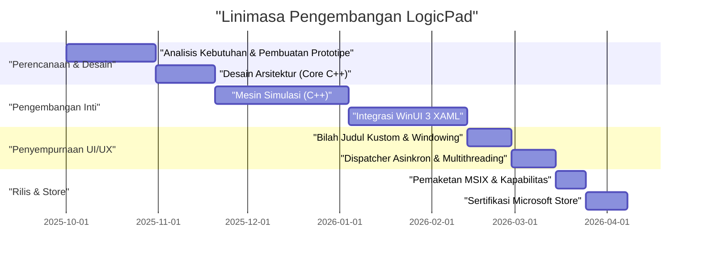
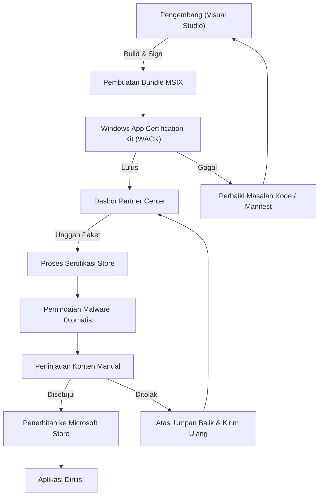

## 1. Pendahuluan: Mengapa Memilih Membangun Aplikasi Native Windows Saat Ini

Dalam pengembangan aplikasi modern, tidak diragukan lagi bahwa teknologi lintas platform (cross-platform) seperti Electron, Tauri, dan React Native telah menjadi arus utama. Pendekatan "tulis sekali, jalankan di mana saja" (Write Once, Run Anywhere) yang menggunakan teknologi web sangatlah rasional dari sudut pandang kecepatan pengembangan dan pemeliharaan. Namun, saya dengan sengaja memilih jalur untuk mengembangkan aplikasi yang disebut "LogicPad" sebagai aplikasi native yang sepenuhnya dioptimalkan untuk Windows.

LogicPad adalah simulator sirkuit logika digital sekaligus editor teks yang ditargetkan untuk insinyur perangkat keras (hardware) dan pelajar sirkuit logika. Aplikasi ini perlu menyimulasikan puluhan ribu gerbang logika secara real-time, dan pada saat yang sama, merender data gelombang yang kompleks tanpa penundaan (delay). Dalam ranah yang menuntut performa ekstrem seperti ini, jeda sementara beberapa milidetik (micro-stutter) akibat pengumpulan sampah (garbage collection) atau overhead perenderan dari web view akan menyebabkan penurunan pengalaman pengguna yang fatal.

Dalam artikel ini, saya akan menelusuri kembali perjalanan pengembangan LogicPad, mulai dari konsep pengembangan, implementasi spesifik menggunakan C++ dan WinUI 3 (Windows App SDK), menerobos hambatan teknis, pemaketan MSIX, hingga pendistribusiannya ke seluruh dunia melalui Microsoft Store, disertai dengan penjelasan teknis yang mendetail. Dengan membagikan proses tentang bagaimana seorang pengembang individu dapat membangun aplikasi Windows native berkualitas perusahaan (enterprise), saya berharap artikel ini dapat menjadi panduan bagi mereka yang juga ingin mengambil tantangan dalam pengembangan native.

## 2. Linimasa Proyek

Pengembangan LogicPad dilakukan sebagai proyek pribadi yang memanfaatkan waktu di akhir pekan dan malam hari. Keseluruhan linimasanya memakan waktu sekitar setengah tahun (6 bulan). Berikut adalah bagan Gantt yang menunjukkan kemajuan proyek tersebut.



Seperti yang bisa dilihat, sebagian besar waktu pengembangan dihabiskan untuk mengoptimalkan mesin inti (core engine) dan mengintegrasikan pemrosesan asinkron antara WinUI 3 dan C++. Meskipun pengembangan native memiliki biaya persiapan awal dan kurva pembelajaran yang lebih tinggi dibandingkan dengan pengembangan lintas platform, investasi tersebut pasti akan terbayar lunas dalam bentuk performa pada hasil akhirnya.

## 3. Pemilihan Teknologi: Kedalaman C++ / WinUI 3 / Windows App SDK

Dalam pengembangan LogicPad, pemilihan tumpukan teknologi (technology stack) merupakan salah satu keputusan terpenting. Untuk kerangka kerja antarmuka pengguna native di platform Windows, secara historis terdapat berbagai pilihan seperti Win32 API (User32/GDI), MFC, Windows Forms, WPF, dan UWP. Saat ini, Microsoft merekomendasikan **WinUI 3**, yang dibundel dengan **Windows App SDK**, untuk pengembangan aplikasi desktop Windows modern.

### 3.1. Arsitektur Windows App SDK dan WinUI 3
Windows App SDK adalah sekumpulan pustaka (library) yang menyediakan API Windows terbaru tanpa bergantung pada versi OS. Berbeda dengan UWP (Universal Windows Platform) tradisional yang terikat sangat erat dengan pembaruan sistem operasi (OS), Windows App SDK didistribusikan bersama aplikasinya, sehingga menjamin pengoperasian yang konsisten dari Windows 10 (versi 1809 dan yang lebih baru) hingga Windows 11.

WinUI 3 adalah kerangka kerja UI native yang berjalan di atas Windows App SDK dan sepenuhnya mendukung Fluent Design System. Bagian internal WinUI 3 dibangun dengan C++ dan DirectX, sehingga berjalan dengan performa yang sangat cepat.

### 3.2. Alasan Mengapa Memilih C++ (C++/WinRT) Dibandingkan C#
WinUI 3 mendukung bahasa C# dan C++ sebagai bahasa pengembangannya. Memang, penggunaan C# dan .NET dapat meningkatkan efisiensi proses pengembangan secara dramatis, akan tetapi LogicPad mengadopsi **C++/WinRT** karena mempertimbangkan beberapa alasan berikut:

1. **Manajemen Memori yang Deterministik**: Dikarenakan tidak ada pengumpul sampah (Garbage Collector), waktu alokasi dan pelepasan memori dapat dikontrol sepenuhnya. Hal ini mencegah terjadinya jeda sementara GC di tengah loop simulasi.
2. **SIMD dan Optimasi Cache**: Di C++, tata letak fisik memori (seperti Struct of Arrays) dapat didefinisikan secara sangat ketat untuk memaksimalkan rasio cache CPU.
3. **Batas ABI Native**: C++/WinRT adalah proyeksi modern bahasa C++ untuk COM (Component Object Model). API native dari OS dapat dipanggil secara langsung tanpa overhead P/Invoke layaknya di C#.

Fondasi dasar C++/WinRT adalah COM. Semua objek WinRT pada dasarnya adalah objek COM yang mengimplementasikan antarmuka `IUnknown`, dan smart pointer dari C++/WinRT seperti `winrt::com_ptr` secara otomatis akan mengelola perhitungan jumlah rujukannya atau reference count (`AddRef` / `Release`).

## 4. Hambatan Terbesar dan Terobosan dalam Pengembangan WinUI 3

Meskipun tangguh, melakukan pengembangan antarmuka WinUI 3 menggunakan C++/WinRT turut dibayangi dengan kerumitan tersendiri. Pada bagian ini, saya akan menerangkan secara detail perihal dua tantangan teknis utama dan paling merepotkan selama pengembangan LogicPad, beserta dengan kunci solusinya.

### 4.1. Kengerian Pembaruan UI Asinkron di C++ dan Coroutines

Satu aturan mutlak dalam aplikasi UI modern adalah "Jangan pernah memblokir thread UI". Di aplikasi LogicPad, operasi simulasi sirkuit raksasa harus dieksekusi melalui thread latar belakang (background thread), dan hasilnya wajib direfleksikan kembali ke thread UI untuk ditampilkan.

Jika Anda memakai C#, persoalan ini bisa relatif mudah ditanggulangi dengan `async/await` dan `DispatcherQueue`. Namun, di C++, masalah semacam ini diwujudkan dengan merangkai perpaduan antara Coroutines bawaan C++20 beserta perintah `winrt::apartment_context`. Pemahaman wawasan terkait permodelan apartemen COM (STA: Single-Threaded Apartment dan MTA: Multi-Threaded Apartment) sangatlah penting.

Cuplikan kode di bawah merupakan ekstrak dari basis kode LogicPad yang menunjukkan pola eksekusi sinkronisasi dari operasi background kembali ke thread UI tanpa hambatan:

```cpp
#include <winrt/Windows.Foundation.h>
#include <winrt/Microsoft.UI.Dispatching.h>
#include <winrt/Microsoft.UI.Xaml.h>

using namespace winrt;
using namespace Microsoft::UI::Xaml;
using namespace Microsoft::UI::Dispatching;

// Event handler untuk klik tombol
winrt::fire_and_forget MainWindow::OnRunSimulationClicked(
    IInspectable const& /* sender */, 
    RoutedEventArgs const& /* args */)
{
    // Menangkap konteks apartemen thread UI saat ini (STA)
    winrt::apartment_context ui_thread;

    try 
    {
        // Memperbarui status UI (dieksekusi di thread UI)
        StatusTextBlock().Text(L"Sedang menjalankan simulasi...");
        ProgressBar().IsIndeterminate(true);

        // Memindahkan konteks ke pool thread (MTA)
        co_await winrt::resume_background();

        // Proses simulasi yang sangat berat (dieksekusi di thread latar belakang)
        // Selama waktu ini, thread UI dibebaskan sehingga mencegah aplikasi membeku (freeze)
        std::vector<LogicResult> results = CoreEngine::RunMassiveSimulation();
        
        // Memformat hasil simulasi menjadi string (terus dieksekusi di latar belakang)
        winrt::hstring outputText = FormatResults(results);

        // Mengembalikan konteks ke thread UI
        co_await ui_thread;

        // Proses setelah ini dieksekusi di thread UI, sehingga aman untuk mengakses kontrol XAML
        ResultTextBlock().Text(outputText);
        ProgressBar().IsIndeterminate(false);
        StatusTextBlock().Text(L"Selesai");
    }
    catch (winrt::hresult_error const& ex)
    {
        // Bahkan saat terjadi exception (pengecualian), kembali ke thread UI untuk menampilkan pesan kesalahan
        co_await ui_thread;
        StatusTextBlock().Text(L"Kesalahan: " + ex.message());
        ProgressBar().IsIndeterminate(false);
    }
}
```

Meskipun perilaku dari `winrt::apartment_context` terkesan seperti tipuan sulap, secara internal ia bekerja berdasarkan sistem C++ tingkat lanjut yang mendispatch eksekusi ke antarmuka `IContextCallback` yang bertugas untuk mengingat konteks thread asalnya, lalu menjalankan proses ke konteks tersebut manakala perintah `co_await` tereksekusi. Inilah alasan mengapa kita dapat menulis pemrosesan asinkron memakai gaya prosedural lazim tanpa khawatir harus jatuh ke dalam "callback hell".

### 4.2. Implementasi Lengkap Bilah Judul Kustom

Untuk aplikasi era Windows 11, "bilah judul kustom" yang dapat menempatkan tab maupun kotak pencarian langsung pada bilah judul (caption bar) merupakan salah satu persyaratan UX yang modern. Meskipun sangat gampang jika kita berniat mengganti tampilan warnanya di WinUI 3, tantangannya bakal berubah sangat dramatis jika kita bermaksud "memperluas area klien ke bilah judul dengan tetap mempertahankan penarikan jendela (drag) dan snap layout otomatis saat diseret ke tepi layar".

Di LogicPad, area bilah judul tersebut kami bangun dengan elemen UI XAML menggunakan API `ExtendsContentIntoTitleBar`. Kode di bawah menjabarkan langkah teknis untuk mengkustomisasi bilah judul menggunakan utilitas `AppWindow` dari Windows App SDK.

```cpp
#include <winrt/Microsoft.UI.Windowing.h>
#include <winrt/Microsoft.UI.Interop.h>
#include <microsoft.ui.interop.h> // untuk GetWindowIdFromWindow

void MainWindow::InitializeCustomTitleBar()
{
    // Mengambil HWND (handle jendela) dari jendela saat ini
    auto windowNative = this->try_as<::IWindowNative>();
    HWND hwnd{ nullptr };
    windowNative->get_WindowHandle(&hwnd);

    // Mengonversi HWND ke WindowId dan memperoleh instans AppWindow
    winrt::Microsoft::UI::WindowId windowId = 
        winrt::Microsoft::UI::GetWindowIdFromWindow(hwnd);
    auto appWindow = winrt::Microsoft::UI::Windowing::AppWindow::GetFromWindowId(windowId);

    // Memeriksa apakah versi OS mendukung kustomisasi
    if (winrt::Microsoft::UI::Windowing::AppWindowTitleBar::IsCustomizationSupported())
    {
        auto titleBar = appWindow.TitleBar();
        
        // Memperluas area klien (konten) ke dalam bilah judul
        titleBar.ExtendsContentIntoTitleBar(true);

        // Mengatur latar belakang tombol keterangan bawaan (minimize, maximize, close) menjadi transparan
        titleBar.ButtonBackgroundColor(winrt::Microsoft::UI::Colors::Transparent());
        titleBar.ButtonInactiveBackgroundColor(winrt::Microsoft::UI::Colors::Transparent());
        
        // Mengonfigurasi elemen UI (AppTitleBar) yang ditentukan dalam XAML sebagai area seret (drag)
        // ※ Untuk detail pada bagian ini, Anda perlu memantau UIElement di sisi XAML dengan Dispatcher thread UI,
        // lalu memanggil SetDragRectangles() untuk memberitahukan kepada OS ihwal area yang bisa ditarik.
    }
}
```

Jebakan ranjau paling fatal pada implementasi ini adalah setiap kali ukuran elemen UI di sisi XAML berubah (seperti ketika ukuran jendela diubah pengguna), kita diwajibkan untuk melaporkan pengujian kalkulasi titik koordinat (Hit Test Area), dengan memanggil fungsi `InputNonClientPointerSource` atau `SetDragRectangles` untuk mencatatkan ke OS bahwa "koordinat ini masih merupakan wilayah operasional untuk menarik aplikasi". Jika hal ini diabaikan, niscaya akan memancing berbagai bug, seperti macetnya fungsi jendela yang enggan digeser meskipun ditarik dari bilah judul, atau sebaliknya, klik pada suatu tombol kontrol justru salah ditafsirkan sebagai gestur penarikan bingkai jendela.

## 5. Kedalaman Pemaketan MSIX dan AppXManifest

Untuk mendistribusikan LogicPad setelah proyeknya selesai, saya harus membuat installer. Ketimbang mengandalkan model installer format lama seperti MSI atau EXE, saya mengadopsi format instalasi modern **MSIX**. MSIX memberikan rasa aman bagi pengguna karena proses instalasi dan penghapusan aplikasi (uninstall) terlaksana secara sangat bersih (tanpa mengotori registry), dan dilengkapi dengan sistem pembaruan otomatis.

Akan tetapi, poin utama di antara hal krusial saat memaketkan aplikasi native C++ menjadi paket MSIX terletak di dalam file manifest yaitu `Package.appxmanifest`.

LogicPad perlu membaca dan menulis file proyek sirkuit berskala raksasa pada sistem file lokal pengguna (misalnya dokumen lokal). Dalam standar isolasi (sandbox) platform UWP, aplikasi hanya diberi akses membaca data pada bilik terisolasinya sendiri (AppContainer). Maka sebab itu, demi mendapatkan hak akses penuh selayaknya aplikasi desktop native, pengembang harus mendaftarkan perizinan `runFullTrust` di dalam file manifest.

```xml
<?xml version="1.0" encoding="utf-8"?>
<Package
  xmlns="http://schemas.microsoft.com/appx/manifest/foundation/windows10"
  xmlns:uap="http://schemas.microsoft.com/appx/manifest/uap/windows10"
  xmlns:rescap="http://schemas.microsoft.com/appx/manifest/foundation/windows10/restrictedcapabilities"
  IgnorableNamespaces="uap rescap">

  <Identity
    Name="LogicPad.Studio"
    Publisher="CN=Kenji"
    Version="1.0.0.0" />

  <Properties>
    <DisplayName>LogicPad</DisplayName>
    <PublisherDisplayName>Kenji</PublisherDisplayName>
    <Logo>Assets\StoreLogo.png</Logo>
  </Properties>

  <Dependencies>
    <TargetDeviceFamily Name="Windows.Desktop" MinVersion="10.0.17763.0" MaxVersionTested="10.0.22621.0" />
  </Dependencies>

  <Capabilities>
    <!-- Kapabilitas umum -->
    <Capability Name="internetClient" />
    <!-- Kapabilitas terbatas agar dapat berjalan sebagai aplikasi desktop native -->
    <rescap:Capability Name="runFullTrust" />
  </Capabilities>
</Package>
```

Baris kode `<rescap:Capability Name="runFullTrust" />` ini disebut fitur "Kapabilitas Terbatas (Restricted Capability)", dan ketika mengirimkannya ke Microsoft Store, pembuat harus menyertakan dokumen alasan untuk membenarkan tuntutan hak khusus tersebut kepada peninjau. Saya menjelaskan, "Aplikasi ini adalah alat untuk profesional guna membaca, menulis, dan mengekspor proyek sirkuit logika sembarang di dalam penyimpanan lokal pengguna," dan dari situ persetujuan pun didapat tanpa kendala.

## 6. Jalan Menuju Microsoft Store dan Proses Peninjauan

Usai sesi kompilasi dan pemaketan bundle MSIX selesai dikerjakan, tiba saatnya menyerahkan aplikasi ke Microsoft Store. Dari kacamata pengembang individu, distribusi melalui wadah resmi Store memberikan keuntungan tidak ternilai, meliputi pembaruan otomatis yang andal, jaminan kualitas pada kredibilitas aplikasi, dan sokongan sistem pembayaran yang praktis.

Proses penyerahan ke Microsoft Store diselenggarakan lewat rute portal "Partner Center". Diagram di bawah menunjukkan gambaran kasar dari awal kompilasi hingga rilis publik.



### 6.1. Dinding WACK (Windows App Certification Kit)
Sebelum mengunggah berkas ke Partner Center, kita diwajibkan melaksanakan serangkaian pengujian lokal yakni **WACK (Windows App Certification Kit)**. Peranti utilitas ini mengemban tugas otonom demi memindai secara otomatis apakah program yang dirilis bebas dari crash, terhindar dari panggilan yang tak didukung melalui sistem API, serta memenuhi persyaratan kinerja minimal.

Kala berhadapan dengan aplikasi berarsitektur C++ native, hal yang sangat perlu mendapat perhatian khusus adalah notifikasi error "Penggunaan API yang tidak didukung". Saat kita memaksakan integrasi (statically link) pustaka lawas usang produksi pihak ketiga C++, pustaka ini sering ketahuan menggunakan panggilan Win32 API kuno di dalam sistemnya yang akan ditolak oleh sistem WACK. Untuk menghindari masalah ini, saya sigap memperbarui pustaka dependensi dengan rilis terbarunya dan memodifikasi sebagian fungsi ke alternatif API pada Windows App SDK.

### 6.2. Peninjauan dan Penerbitan
Dalam pengaturan Partner Center, ini mencakup penetapan nominal biaya aplikasi, rating klasifikasi penggolongan rentang usia (rating IARC), menyertakan tangkapan gambar layar (screenshot) dan penulisan catatan deskripsi ke dalam etalase Store. Mengingat LogicPad murni dibuat sebagai alat teknis, secara serta-merta ia memperoleh izin rating untuk semua umur (All Ages).

Selang beberapa hari kalender semenjak pengajuan, proses rilis ini rampung direview dalam durasi tiga hari kerja. Sesudah melewati pemindaian malware dan pengetesan fungsionalitas otomatis, perwakilan Microsoft memeriksa aplikasi secara manual. Permintaan kapabilitas `runFullTrust` berhasil disetujui tanpa ada kendala. Rasa sukacita meluap tak tertahankan sesaat melihat rentetan tulisan status rilis telah mencapai status "Dipublikasikan (In the Store)", kepuasan dari pencapaian yang tidak dapat digantikan oleh nilai apa pun.

## 7. Pengembangan Individu Sebagai Bisnis: Model Matematis Kinerja dan Pendapatan

Alih-alih sekadar merasa puas setelah membuat sebuah aplikasi, untuk terus menghadirkan pembaruan LogicPad dan menjadikannya bisnis mandiri, diperlukan langkah pengukuran mengevaluasi spesifikasi secara teknis dan juga model komersialisasi secara kuantitatif.

### 7.1. Model Optimalisasi Penggunaan Memori Berkat Bahasa C++
Keunggulan utama LogicPad terletak pada aspeknya yang sangat luar biasa ringan bila dibandingkan dengan aplikasi editor bersenjatakan mesin Electron (contohnya: VSCode). Skema rumus matematika rasio jejak pemakaian memori aplikasi (Memory Footprint), $M_{total}$, dapat dijabarkan seperti model formula berikut:

$$
M_{total} = M_{UI} + M_{engine} + M_{cache}
$$

Di sini, alokasi memori pada antarmuka $M_{UI}$, berkat bantuan sistem native rendering bawaan dari WinUI 3, sukses menghasilkan penghematan ukuran dimensi memori yang luar biasa drastis menyusut, jauh lebih efisien dibandingkan mesin Electron yang memakan beban untuk memuat engine peramban (kira-kira di batas 50MB saja).
Tambahan lagi, kapasitas memori untuk engine C++, $M_{engine}$, bertumbuh dengan skala ekuivalen linear sejajar terhadap akumulasi kuantitas komponen gerbang logikanya $N$, ini semua diraih dari optimasi struct dan meminimalisasi sistem alokasi pointer di dalamnya.

$$
M_{engine} = N \times \text{sizeof(LogicNode)}
$$

Dengan mendayagunakan kemampuan sintaks `#pragma pack` C++ guna memadatkan penjajaran struktur ruang memori (struct alignment), sayapun mengukir kemampuan mumpuni dalam memangkas pemakaian sisa batas ketersediaan kuota memori per simpul (node) ke batas yang sekecil-kecilnya.

```cpp
#pragma pack(push, 1)
// Meminimalkan memori dengan memaketkan tanpa tabel fungsi virtual (vtable)
struct LogicNode {
    uint32_t id;         // 4 bytes
    uint16_t type;       // 2 bytes
    bool isActive;       // 1 byte
    // Ukuran struktur adalah 7 byte (tanpa padding alignment)
};
#pragma pack(pop)
```

Sedangkan memori pada lapisan cache $M_{cache}$ bertugas menampung riwayat simulasi, yang jejak pembengkakannya wajib naik eksponensial sebanding $\mathcal{O}(N \log N)$, namun terlepas dari itu, karena jejak dasar awal memory footprint asalnya memang sangat ringan, konsumsi puncak batas memori pada RAM dari aplikasi ini dapat dikunci dalam nilai aman di bawah batas 200MB, sungguhpun meski dalam keadaan diuji menampung simulasi masif dari puluhan ribu struktur nodus logika sirkuit.

### 7.2. LTV dan CAC: Rencana Pemasaran
Dalam strategi monetisasi untuk pengembangan individu, keseimbangan antara Nilai Seumur Hidup Pelanggan (LTV: Lifetime Value) dan Biaya Akuisisi Pelanggan (CAC: Customer Acquisition Cost) adalah segalanya. LogicPad mengadopsi model lisensi pembelian sekali bayar (freemium), alih-alih langganan (subscription).

LTV dihitung sebagai jumlah nilai sekarang dari probabilitas pembelian versi pemutakhiran (upgrade) di masa depan yang didiskon dengan rasio diskon $d$. Jika periode adalah $T$, itu dapat dinyatakan dengan rumus berikut:

$$
LTV = \sum_{t=1}^{T} \frac{ARPU_t \times Margin}{(1+d)^t}
$$

Di sisi lain, CAC adalah total biaya pemasaran, seperti iklan di Twitter (sekarang X) dan kunjungan dari artikel blog, dibagi dengan jumlah pengguna baru.

$$
CAC = \frac{Total\ Marketing\ Spend}{Number\ of\ New\ Users}
$$

Kekuatan dari pengembangan individu adalah biaya tenaga kerja pengembangan dapat dianggap sebagai biaya hangus (sunk cost) untuk "waktu hobi", sehingga CAC murni hanya bergantung pada perhitungan biaya pemasaran saja. Saat ini, berkat aliran organik yang terutama bersumber dari rekomendasi mulut ke mulut pada komunitas ceruk teknologi (niche), ekonomi unit LTV > CAC yang sehat dapat diwujudkan di mana nilai CAC mendekati $CAC \approx 0$.

## 8. Penutup: Dunia Pengembangan Aplikasi Native yang Kasar Namun Indah

Saat mengenang kembali perjalanan mulai dari perancangan LogicPad hingga peluncurannya di Microsoft Store, ini bukanlah jalan yang mulus. Terus-menerus bergelut dengan pesan galat (error) kompilasi C++/WinRT yang rumit, melacak kebocoran memori (memory leak) yang diakibatkan oleh bug penghitungan referensi pada COM, serta meneliti spesifikasi XML pada manifest MSIX.

Justru di era ketika teknologi web kian canggih di mana "apa pun bisa dibangun di dalam browser", pengalaman pengembangan native dengan secara langsung menyentuh perintah OS API serta mencermati alokasi ruang memori per 1 byte dan merawat efisiensi clock CPU 1 siklus, mampu meroketkan kekuatan pemahaman dasar seseorang sebagai engineer secara amat drastis.

WinUI 3 dan Windows App SDK saat ini sedang dikembangkan secara aktif dan masih merupakan alat terhebat guna membangun sebuah aplikasi native desktop Windows yang mempesona, secara maksimal memanfaatkan paradigma antarmuka Windows 11. Besar sekali harapan dan impian saya bahwa artikel blog teknis ini nantinya mampu menjadi panduan bagi para pengembang yang ingin menantang diri dalam pengembangan aplikasi Windows native, supaya ke depannya akan kian lahir melimpah ruah ragam variasi perangkat hebat di Store.

Pengembangan belumlah selesai. Di versi LogicPad selanjutnya, saya merencanakan untuk menggabungkan fungsi mesin perenderan bentuk gelombang kustom yang memanfaatkan fitur Direct2D. Pada artikel sekuel selanjutnya, saya akan membahas sisi interoperabilitas integrasi perpaduan antara DirectX dan utilitas WinUI 3 (penggunaan SwapChainPanel). Harap nantikan.
