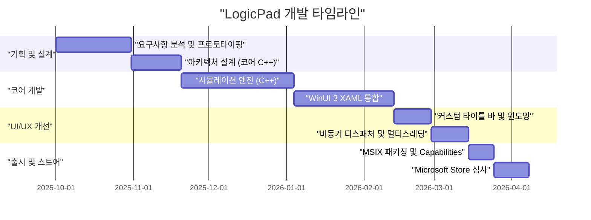
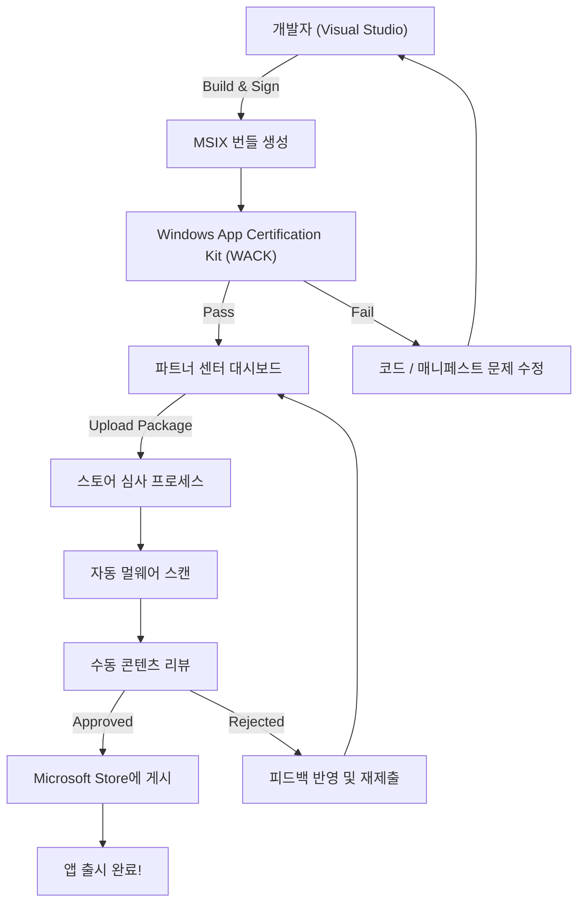

## 1. 머리말: 왜 지금, 굳이 Windows 네이티브 앱을 만드는가

현대 애플리케이션 개발에 있어 Electron이나 Tauri, React Native 등의 크로스 플랫폼 기술이 주류가 된 것은 틀림없는 사실입니다. 웹 기술을 사용해 한 번 작성하면 어디서든 동작하는(Write Once, Run Anywhere) 접근 방식은 개발 속도와 유지보수성 측면에서 매우 합리적입니다. 하지만 저는 굳이 'LogicPad'라는 애플리케이션을 Windows에 완전히 최적화된 네이티브 애플리케이션으로 개발하는 길을 선택했습니다.

LogicPad는 하드웨어 엔지니어나 논리 회로 학습자를 대상으로 한 디지털 논리 회로 시뮬레이터 겸 텍스트 에디터입니다. 수만 개의 논리 게이트를 실시간으로 시뮬레이션하고, 동시에 복잡한 파형 데이터를 지연 없이 렌더링해야 합니다. 이처럼 극한의 성능이 요구되는 영역에서는 가비지 컬렉션으로 인한 수 밀리초의 일시 정지(마이크로 스터터)나 웹 뷰의 렌더링 오버헤드가 치명적인 사용자 경험 저하를 초래합니다.

본 기사에서는 이 LogicPad의 개발 구상부터 C++와 WinUI 3(Windows App SDK)를 사용한 구현, 특유의 기술적 장벽 돌파, MSIX 패키징, 그리고 Microsoft Store를 통한 전 세계 배포에 이르기까지의 궤적을 매우 상세한 기술적 해설과 함께 돌아봅니다. 개인 개발자가 어떻게 엔터프라이즈 품질의 네이티브 Windows 앱을 만들어내는지 그 과정을 공유함으로써, 동일하게 네이티브 개발에 도전하는 분들에게 이정표가 되기를 바랍니다.

## 2. 프로젝트 타임라인

LogicPad 개발은 주말과 야간 시간을 활용한 개인 프로젝트로 진행되었습니다. 전체 타임라인은 약 반년(6개월)에 걸쳐 있습니다. 다음은 그 프로젝트의 진행을 보여주는 간트 차트입니다.



이와 같이 개발 시간의 대부분은 코어 엔진의 최적화와 WinUI 3 및 C++ 간의 비동기 처리 통합에 소요되었습니다. 네이티브 개발은 크로스 플랫폼 개발에 비해 초기 설정이나 학습 비용이 높지만, 최종적인 성능이라는 형태로 그 투자는 확실히 회수됩니다.

## 3. 기술 스택 선정: C++ / WinUI 3 / Windows App SDK의 심연

LogicPad를 개발함에 있어 기술 스택의 선정은 가장 중요한 결정 중 하나였습니다. Windows 플랫폼의 네이티브 UI 프레임워크에는 역사적으로 Win32 API(User32/GDI), MFC, Windows Forms, WPF, UWP 등 다양한 선택지가 존재합니다. 현재 Microsoft가 모던 Windows 데스크톱 애플리케이션 개발에 권장하는 것이 **Windows App SDK**에 동봉된 **WinUI 3**입니다.

### 3.1. Windows App SDK와 WinUI 3 아키텍처
Windows App SDK는 OS 버전에 의존하지 않고 최신 Windows API를 제공하기 위한 라이브러리 제품군입니다. 기존의 UWP(Universal Windows Platform)가 OS 업데이트와 강하게 결합되어 있던 반면, Windows App SDK는 애플리케이션과 함께 배포되므로 Windows 10(버전 1809 이후)부터 Windows 11까지 일관된 동작을 보장합니다.

WinUI 3는 이 Windows App SDK 위에서 동작하는 네이티브 UI 프레임워크이며, Fluent Design System을 완벽하게 지원합니다. WinUI 3의 내부는 C++와 DirectX로 구축되어 있어 매우 빠르게 동작합니다.

### 3.2. C#이 아닌, 굳이 C++(C++/WinRT)를 선택한 이유
WinUI 3의 개발 언어로는 C#과 C++가 지원됩니다. C#과 .NET을 사용하면 개발 효율이 비약적으로 향상되지만, LogicPad에서는 다음과 같은 이유로 **C++/WinRT**를 채택했습니다.

1. **결정론적 메모리 관리**: 가비지 컬렉터(GC)가 존재하지 않기 때문에 메모리 할당과 해제 타이밍을 완전히 제어할 수 있습니다. 시뮬레이션 루프 중 GC로 인한 일시 정지가 발생하는 것을 방지합니다.
2. **SIMD 및 캐시 최적화**: C++에서는 메모리의 물리적 레이아웃(Struct of Arrays 등)을 엄격하게 정의할 수 있어 CPU 캐시 적중률을 극대화할 수 있습니다.
3. **네이티브 ABI 경계**: C++/WinRT는 COM(Component Object Model)의 모던 C++ 프로젝션입니다. C#의 P/Invoke 같은 오버헤드 없이 OS의 네이티브 API를 직접 호출할 수 있습니다.

C++/WinRT의 근저에는 COM이 존재합니다. 모든 WinRT 객체는 본질적으로 `IUnknown` 인터페이스를 구현한 COM 객체이며, C++/WinRT의 `winrt::com_ptr` 등의 스마트 포인터가 참조 카운트(`AddRef` / `Release`)를 자동으로 관리합니다.

## 4. WinUI 3 개발에 있어서 가장 큰 장벽과 돌파구

C++/WinRT를 사용한 WinUI 3 개발은 강력한 반면 특유의 복잡성을 동반합니다. 여기서는 LogicPad 개발 과정에서 특히 고생했던 두 가지 큰 기술적 과제와 그 해결책에 대해 자세히 설명합니다.

### 4.1. C++에서의 비동기 UI 업데이트의 공포와 코루틴

모던 UI 애플리케이션의 철칙은 "UI 스레드를 차단해서는 안 된다"는 것입니다. LogicPad에서는 거대한 회로의 시뮬레이션 계산을 백그라운드 스레드에서 실행하고, 그 결과를 UI 스레드에 반영해야 합니다.

C#이라면 `async/await`와 `DispatcherQueue`를 사용하여 비교적 쉽게 작성할 수 있지만, C++에서는 C++20의 코루틴(Coroutines)과 `winrt::apartment_context`를 조합하여 구현합니다. COM의 아파트먼트 모델(STA: Single-Threaded Apartment와 MTA: Multi-Threaded Apartment)에 대한 이해가 필수적입니다.

다음 코드는 LogicPad의 실제 코드베이스에서 추출한, 백그라운드 계산과 UI 스레드로의 복귀를 원활하게 수행하는 패턴입니다.

```cpp
#include <winrt/Windows.Foundation.h>
#include <winrt/Microsoft.UI.Dispatching.h>
#include <winrt/Microsoft.UI.Xaml.h>

using namespace winrt;
using namespace Microsoft::UI::Xaml;
using namespace Microsoft::UI::Dispatching;

// 버튼 클릭 이벤트 핸들러
winrt::fire_and_forget MainWindow::OnRunSimulationClicked(
    IInspectable const& /* sender */, 
    RoutedEventArgs const& /* args */)
{
    // 현재 UI 스레드의 아파트먼트 컨텍스트(STA)를 캡처한다
    winrt::apartment_context ui_thread;

    try 
    {
        // UI 상태 업데이트 (이 부분은 UI 스레드에서 실행됨)
        StatusTextBlock().Text(L"시뮬레이션 실행 중...");
        ProgressBar().IsIndeterminate(true);

        // 스레드 풀(MTA)로 컨텍스트 전환
        co_await winrt::resume_background();

        // 매우 무거운 시뮬레이션 처리 (백그라운드 스레드에서 실행)
        // 이 동안 UI 스레드는 해제되어 애플리케이션의 프리징을 방지함
        std::vector<LogicResult> results = CoreEngine::RunMassiveSimulation();
        
        // 시뮬레이션 결과를 문자열로 포맷 (계속해서 백그라운드에서 실행)
        winrt::hstring outputText = FormatResults(results);

        // UI 스레드로 컨텍스트 복귀
        co_await ui_thread;

        // 이후부터는 UI 스레드에서 실행되므로 XAML 컨트롤에 안전하게 접근 가능
        ResultTextBlock().Text(outputText);
        ProgressBar().IsIndeterminate(false);
        StatusTextBlock().Text(L"완료되었습니다");
    }
    catch (winrt::hresult_error const& ex)
    {
        // 예외 발생 시에도 UI 스레드로 돌아와 에러 메시지 표시
        co_await ui_thread;
        StatusTextBlock().Text(L"에러: " + ex.message());
        ProgressBar().IsIndeterminate(false);
    }
}
```

이 `winrt::apartment_context`의 동작은 마법처럼 보이지만, 내부적으로는 `IContextCallback` 인터페이스를 이용하여 원래의 스레드 컨텍스트를 기억하고, `co_await` 시에 해당 컨텍스트로 처리를 디스패치(엔큐)하는 고도의 C++ 메커니즘이 작동하고 있습니다. 이를 통해 콜백 지옥에 빠지지 않고 절차적 코드 형태를 유지하며 비동기 처리를 작성할 수 있습니다.

### 4.2. 커스텀 타이틀 바의 완벽한 구현

Windows 11 시대의 애플리케이션에서 창의 타이틀 바(캡션 영역)에 탭이나 검색 상자를 배치하는 '커스텀 타이틀 바'는 모던 UX의 필수 요건입니다. 하지만 WinUI 3에서 타이틀 바를 커스터마이즈하는 것은 단순히 색상을 바꾸는 정도라면 간단하지만, "클라이언트 영역을 타이틀 바까지 확장하면서 창의 드래그 이동이나 스냅 레이아웃(창을 화면 끝으로 가져갔을 때의 자동 크기 조절)을 유지한다"는 요구사항을 충족시키려 하면 난이도가 단숨에 뛰어오릅니다.

LogicPad에서는 `ExtendsContentIntoTitleBar` API를 사용하여 타이틀 바를 자체 XAML 요소로 구축했습니다. 다음 코드는 Windows App SDK의 `AppWindow` 클래스를 이용해 타이틀 바를 커스터마이즈하는 과정입니다.

```cpp
#include <winrt/Microsoft.UI.Windowing.h>
#include <winrt/Microsoft.UI.Interop.h>
#include <microsoft.ui.interop.h> // for GetWindowIdFromWindow

void MainWindow::InitializeCustomTitleBar()
{
    // 현재 창의 HWND(윈도우 핸들)를 가져온다
    auto windowNative = this->try_as<::IWindowNative>();
    HWND hwnd{ nullptr };
    windowNative->get_WindowHandle(&hwnd);

    // HWND를 WindowId로 변환하고 AppWindow 인스턴스를 가져온다
    winrt::Microsoft::UI::WindowId windowId = 
        winrt::Microsoft::UI::GetWindowIdFromWindow(hwnd);
    auto appWindow = winrt::Microsoft::UI::Windowing::AppWindow::GetFromWindowId(windowId);

    // 커스터마이즈가 지원되는 OS 버전인지 확인
    if (winrt::Microsoft::UI::Windowing::AppWindowTitleBar::IsCustomizationSupported())
    {
        auto titleBar = appWindow.TitleBar();
        
        // 클라이언트 영역(콘텐츠)을 타이틀 바까지 확장
        titleBar.ExtendsContentIntoTitleBar(true);

        // 기본 캡션 버튼(최소화, 최대화, 닫기)의 배경을 투명하게 설정
        titleBar.ButtonBackgroundColor(winrt::Microsoft::UI::Colors::Transparent());
        titleBar.ButtonInactiveBackgroundColor(winrt::Microsoft::UI::Colors::Transparent());
        
        // XAML 측에서 정의한 UI 요소(AppTitleBar)를 드래그 영역으로 설정
        // ※ 이 부분의 세부 사항은 XAML 측의 UIElement를 UI 스레드의 Dispatcher로 모니터링하여,
        // SetDragRectangles()를 호출해 드래그 가능 영역을 OS에 알려주어야 합니다.
    }
}
```

이 구현에서 가장 큰 함정은 XAML 측 UI 요소의 크기가 변할 때마다(창 크기 조절 시 등) `InputNonClientPointerSource`나 `SetDragRectangles`를 사용하여 OS에 "여기가 드래그할 수 있는 영역이다"라는 히트 테스트 영역의 재계산 및 알림을 수행해야 한다는 점입니다. 이를 게을리하면 타이틀 바를 드래그해도 창이 움직이지 않거나 반대로 버튼을 클릭하려는데 창 드래그로 판정되는 버그가 발생합니다.

## 5. MSIX 패키징의 심연과 AppXManifest

개발이 완료된 LogicPad를 배포하기 위해서는 인스톨러를 만들어야 합니다. 기존의 MSI나 EXE 인스톨러 대신 저는 모던 **MSIX** 포맷을 채택했습니다. MSIX는 설치 및 제거가 완전히 깔끔하게 이루어지고(레지스트리를 더럽히지 않음), 자동 업데이트 기능도 갖추고 있어 사용자에게 매우 안전하고 쾌적합니다.

하지만 C++로 작성된 네이티브 앱을 MSIX로 패키징할 때 가장 주의해야 할 것은 `Package.appxmanifest`(매니페스트 파일)의 설정입니다.

LogicPad는 로컬 파일 시스템(사용자의 문서 폴더 등)에 저장된 거대한 프로젝트 파일을 읽고 써야 합니다. 표준 UWP의 샌드박스 환경에서는 앱 자체의 격리된 데이터 폴더(AppContainer)에만 접근할 수 있습니다. 네이티브 데스크톱 앱으로서 전체 접근 권한을 얻기 위해서는 매니페스트에 `runFullTrust` 기능을 선언해야 합니다.

```xml
<?xml version="1.0" encoding="utf-8"?>
<Package
  xmlns="http://schemas.microsoft.com/appx/manifest/foundation/windows10"
  xmlns:uap="http://schemas.microsoft.com/appx/manifest/uap/windows10"
  xmlns:rescap="http://schemas.microsoft.com/appx/manifest/foundation/windows10/restrictedcapabilities"
  IgnorableNamespaces="uap rescap">

  <Identity
    Name="LogicPad.Studio"
    Publisher="CN=Kenji"
    Version="1.0.0.0" />

  <Properties>
    <DisplayName>LogicPad</DisplayName>
    <PublisherDisplayName>Kenji</PublisherDisplayName>
    <Logo>Assets\StoreLogo.png</Logo>
  </Properties>

  <Dependencies>
    <TargetDeviceFamily Name="Windows.Desktop" MinVersion="10.0.17763.0" MaxVersionTested="10.0.22621.0" />
  </Dependencies>

  <Capabilities>
    <!-- 일반적인 기능 제한 -->
    <Capability Name="internetClient" />
    <!-- 네이티브 데스크톱 앱으로 동작하기 위한 제한된 기능 -->
    <rescap:Capability Name="runFullTrust" />
  </Capabilities>
</Package>
```

이 `<rescap:Capability Name="runFullTrust" />`는 '제한된 기능(Restricted Capability)'이라고 불리며, Microsoft Store에 제출할 때 왜 이 권한이 필요한지를 심사 담당자에게 정당화하는 사유서를 제출해야 합니다. 저는 "본 앱은 사용자의 로컬 디스크에 있는 임의의 논리 회로 프로젝트 파일을 읽고 쓰며 내보내는 전문가용 도구이기 때문"이라고 설명하여 무사히 승인을 받았습니다.

## 6. Microsoft Store로 향하는 길과 심사 프로세스

애플리케이션 완성 및 MSIX 패키지 빌드가 끝나면 드디어 Microsoft Store에 제출할 차례입니다. 개인 개발자에게 스토어를 통한 배포는 업데이트의 자동 배포, 신뢰성 보장, 그리고 결제 시스템 이용이라는 헤아릴 수 없는 장점이 있습니다.

Microsoft Store 제출 프로세스는 Partner Center(파트너 센터)를 통해 진행됩니다. 다음 순서도는 빌드부터 공개까지의 전체적인 흐름을 보여줍니다.



### 6.1. WACK(Windows App Certification Kit)의 장벽
Partner Center에 업로드하기 전에 반드시 로컬에서 **WACK (Windows App Certification Kit)**을 실행하여 사전 테스트를 통과해야 합니다. WACK는 앱이 크래시되지 않는지, 잘못된 API를 호출하지 않는지, 성능 요구사항을 충족하는지를 자동으로 테스트하는 도구입니다.

C++ 네이티브 앱의 경우, 특히 주의해야 할 것은 "지원되지 않는 API 사용" 오류입니다. 서드파티의 오래된 C++ 라이브러리를 정적으로 링크하면 해당 라이브러리 내부에서 비권장 Win32 API가 사용되어 WACK 심사에서 거부될 수 있습니다. 저는 이 문제를 피하기 위해 의존하는 라이브러리를 최신 버전으로 업데이트하고, 일부 함수는 Windows App SDK가 제공하는 대체 API로 다시 작성했습니다.

### 6.2. 심사 및 공개
Partner Center에서의 설정에는 앱의 가격 설정, 연령 등급(IARC 레이팅), 스토어용 스크린샷 및 설명 입력이 포함됩니다. LogicPad는 기술 도구이기 때문에 전체 연령 대상 레이팅을 즉시 획득할 수 있었습니다.

패키지를 제출하고 심사가 완료되기까지 약 3영업일이 걸렸습니다. 자동 멀웨어 스캔과 기능 체크 후, Microsoft 심사 팀에 의한 수동 동작 확인이 진행됩니다. `runFullTrust` 권한 요청도 문제없이 통과되었고, 마침내 상태가 '공개됨(In the Store)'으로 바뀌었을 때의 성취감은 무엇과도 바꿀 수 없는 것이었습니다.

## 7. 비즈니스로서의 개인 개발: 성능과 수익의 수학적 모델

단순히 앱을 만들고 만족하는 것이 아니라 LogicPad를 지속적으로 업데이트하며 사업으로서 성립시키기 위해서는 기술적인 지표와 비즈니스적인 지표 모두를 정량적으로 평가해야 합니다.

### 7.1. C++가 가져다주는 메모리 사용량 최적화 모델
LogicPad의 가장 큰 강점은 Electron 기반 에디터(예: VSCode 등)와 비교할 때 매우 가볍다는 점입니다. 애플리케이션의 메모리 풋프린트 $M_{total}$은 다음과 같이 모델링할 수 있습니다.

$$
M_{total} = M_{UI} + M_{engine} + M_{cache}
$$

여기서 WinUI 3의 네이티브 렌더링에 의한 $M_{UI}$는 브라우저 엔진을 로드하는 Electron에 비해 극적으로 작아집니다(약 50MB 정도).
또한 C++ 엔진 부분의 메모리 $M_{engine}$은 최적화된 구조체와 포인터 제거를 통해 논리 게이트의 수 $N$에 선형적으로 확장됩니다.

$$
M_{engine} = N \times \text{sizeof(LogicNode)}
$$

C++의 `#pragma pack`을 사용하여 구조체의 정렬(Alignment)을 최적화함으로써 1노드당 메모리를 극한까지 줄였습니다.

```cpp
#pragma pack(push, 1)
// 가상 함수 테이블(vtable)을 가지지 않고 팩킹하여 메모리 최소화
struct LogicNode {
    uint32_t id;         // 4 bytes
    uint16_t type;       // 2 bytes
    bool isActive;       // 1 byte
    // 구조체 크기는 7 bytes (정렬에 의한 패딩 없음)
};
#pragma pack(pop)
```

캐시 계층의 메모리 $M_{cache}$는 시뮬레이션 이력을 유지하기 위해 $\mathcal{O}(N \log N)$에 비례하여 증가하지만, 기반이 되는 풋프린트가 작기 때문에 수만 노드의 회로에서도 시스템 전체의 RAM 사용량은 200MB 이하로 유지되고 있습니다.

### 7.2. LTV와 CAC: 마케팅 계산
개인 개발의 수익화 전략에 있어 고객 생애 가치(LTV: Lifetime Value)와 고객 획득 비용(CAC: Customer Acquisition Cost)의 균형이 모든 것입니다. LogicPad는 구독 방식이 아니라 영구 라이선스 모델(부분 유료화)을 채택하고 있습니다.

LTV는 향후 업그레이드 버전 구매 확률을 할인율 $d$로 할인한 현재 가치의 총합으로 계산합니다. 기간을 $T$로 두었을 때, 다음 수식으로 표현됩니다.

$$
LTV = \sum_{t=1}^{T} \frac{ARPU_t \times Margin}{(1+d)^t}
$$

반면 CAC는 Twitter(현 X) 광고나 블로그 기사를 통한 유입 등에 드는 마케팅 비용 총액을 신규 사용자 수로 나눈 것입니다.

$$
CAC = \frac{Total\ Marketing\ Spend}{Number\ of\ New\ Users}
$$

개인 개발의 강점은 개발에 드는 인건비를 '취미 시간'으로서 매몰 비용화할 수 있기 때문에, 순수하게 마케팅 비용만으로 CAC를 계산할 수 있다는 점입니다. 현재 니치한 기술 커뮤니티의 입소문을 중심으로 한 오가닉 유입을 통해 $CAC \approx 0$에 가까운 상태에서 $LTV > CAC$의 건전한 유닛 이코노믹스를 실현하고 있습니다.

## 8. 맺음말: 진흙투성이지만 아름다운 네이티브 앱 개발의 세계

LogicPad의 개발부터 Microsoft Store 출시까지의 궤적을 돌아보면, C++/WinRT의 난해한 컴파일 에러와의 사투, COM의 참조 카운트 버그로 인한 메모리 누수 추적, 그리고 MSIX 매니페스트의 XML 사양 조사 등 결코 평탄한 길이 아니었습니다.

웹 기술의 발전으로 '무엇이든 브라우저로 만들 수 있는' 시대가 되었기 때문에 오히려 OS API를 직접 다루고 메모리의 1바이트, CPU의 1클럭까지 신경 쓰는 네이티브 개발의 경험은 엔지니어로서의 기초 체력을 압도적으로 높여줍니다.

WinUI 3와 Windows App SDK는 현재도 활발하게 개발이 진행되고 있으며, Windows 11의 UI 패러다임을 최대한 살린 아름다운 애플리케이션을 만들기 위한 최고의 도구입니다. 이 블로그 기사가 앞으로 Windows 네이티브 앱 개발에 도전하려는 개발자들에게 도움이 되어 Store에 훌륭한 앱이 하나라도 더 늘어나기를 진심으로 바랍니다.

개발은 아직 끝나지 않았습니다. LogicPad의 다음 버전에서는 Direct2D를 활용한 자체 파형 렌더링 엔진의 통합을 예정하고 있습니다. 다음 기사에서는 DirectX와 WinUI 3의 상호 운용(SwapChainPanel 활용)에 대해 깊이 파헤쳐 볼 예정입니다. 기대해 주세요.
