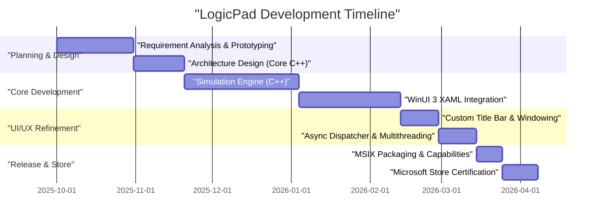
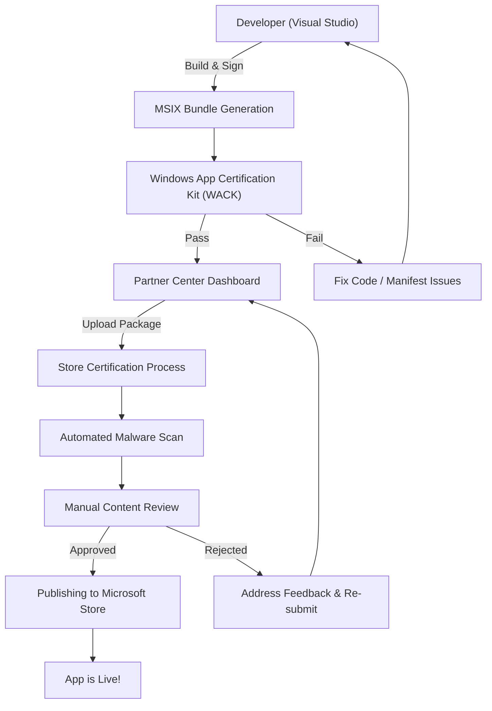

## 1. はじめに：なぜ今、あえてWindowsネイティブアプリを作るのか

現代のアプリケーション開発において、ElectronやTauri、React Nativeなどのクロスプラットフォーム技術が主流となっていることは間違いありません。ウェブ技術を用いて一度書けばどこでも動く（Write Once, Run Anywhere）というアプローチは、開発スピードと保守性の観点から非常に合理的です。しかし、私はあえて「LogicPad」というアプリケーションを、Windowsに完全に最適化されたネイティブアプリケーションとして開発する道を選びました。

LogicPadは、ハードウェアエンジニアや論理回路の学習者をターゲットとした、デジタル論理回路のシミュレーター兼テキストエディタです。数万個の論理ゲートをリアルタイムでシミュレーションし、同時に複雑な波形データを遅延なくレンダリングする必要があります。このような極限のパフォーマンスが求められる領域では、ガベージコレクションによる数ミリ秒の一時停止（マイクロスタッター）や、ウェブビューのレンダリングオーバーヘッドが致命的なユーザー体験の低下を招きます。

本記事では、このLogicPadの開発構想から、C++とWinUI 3（Windows App SDK）を用いた実装、特有の技術的壁の突破、MSIXパッケージング、そしてMicrosoft Storeを通じた全世界への配信に至るまでの軌跡を、非常に詳細な技術的解説とともに振り返ります。個人開発者がどのようにしてエンタープライズ品質のネイティブWindowsアプリを作り上げるのか、そのプロセスを共有することで、同じようにネイティブ開発に挑む方々の道標となれば幸いです。

## 2. プロジェクトのタイムライン

LogicPadの開発は、週末と夜間の時間を活用した個人プロジェクトとして進められました。全体のタイムラインは約半年（6ヶ月）に及びます。以下は、そのプロジェクトの進行を示すGanttチャートです。



このように、開発時間の大部分はコアエンジンの最適化と、WinUI 3とC++間の非同期処理の統合に費やされました。ネイティブ開発はクロスプラットフォーム開発に比べて初期のセットアップや学習コストが高いものの、最終的なパフォーマンスという形でその投資は確実に回収されます。

## 3. 技術選定：C++ / WinUI 3 / Windows App SDK の深淵

LogicPadの開発にあたり、技術スタックの選定は最も重要な決定の一つでした。WindowsプラットフォームにおけるネイティブUIフレームワークには、歴史的にWin32 API（User32/GDI）、MFC、Windows Forms、WPF、UWPなど様々な選択肢が存在します。現在、MicrosoftがモダンなWindowsデスクトップアプリケーション開発の推奨としているのが、**Windows App SDK**に同梱されている**WinUI 3**です。

### 3.1. Windows App SDKとWinUI 3のアーキテクチャ
Windows App SDKは、OSのバージョンに依存せずに最新のWindows APIを提供するためのライブラリ群です。従来のUWP（Universal Windows Platform）がOSのアップデートと強く結びついていたのに対し、Windows App SDKはアプリケーションと共に配布されるため、Windows 10（バージョン1809以降）からWindows 11まで、一貫した動作を保証します。

WinUI 3は、このWindows App SDK上で動作するネイティブUIフレームワークであり、Fluent Design Systemを完全にサポートしています。WinUI 3の内部はC++とDirectXで構築されており、非常に高速に動作します。

### 3.2. C#ではなく、あえてC++（C++/WinRT）を選ぶ理由
WinUI 3の開発言語としてはC#とC++がサポートされています。C#と.NETを使用すれば開発効率は飛躍的に向上しますが、LogicPadでは以下の理由から**C++/WinRT**を採用しました。

1. **決定論的メモリ管理**: ガベージコレクタ（GC）が存在しないため、メモリの確保と解放のタイミングを完全にコントロールできます。シミュレーションループ中にGCの一時停止が発生することを防ぎます。
2. **SIMDとキャッシュの最適化**: C++ではメモリの物理的なレイアウト（Struct of Arrays等）を厳密に定義でき、CPUキャッシュのヒット率を最大化できます。
3. **ネイティブのABI境界**: C++/WinRTは、COM（Component Object Model）のモダンなC++プロジェクションです。C#のようなP/Invokeのオーバーヘッドなしに、OSのネイティブAPIを直接呼び出すことができます。

C++/WinRTの根底にはCOMが存在します。すべてのWinRTオブジェクトは本質的に `IUnknown` インターフェースを実装したCOMオブジェクトであり、C++/WinRTの `winrt::com_ptr` などのスマートポインタが参照カウント（`AddRef` / `Release`）を自動的に管理します。

## 4. WinUI 3開発における最大の壁と突破口

C++/WinRTを用いたWinUI 3開発は、強力である反面、特有の複雑さを伴います。ここでは、LogicPadの開発において特に苦労した2つの大きな技術的課題とその解決策について詳しく解説します。

### 4.1. C++における非同期UI更新の恐怖とコルーチン

モダンなUIアプリケーションの鉄則は、「UIスレッドをブロックしてはならない」ということです。LogicPadでは、巨大な回路のシミュレーション計算をバックグラウンドスレッドで実行し、その結果をUIスレッドに反映させる必要があります。

C#であれば `async/await` と `DispatcherQueue` を使って比較的簡単に記述できますが、C++においてはC++20のコルーチン（Coroutines）と `winrt::apartment_context` を組み合わせて実現します。COMのアパートメントモデル（STA: Single-Threaded Apartment と MTA: Multi-Threaded Apartment）の理解が不可欠です。

以下のコードは、LogicPadの実際のコードベースから抽出した、バックグラウンドでの計算とUIスレッドへの復帰をシームレスに行うパターンです。

```cpp
#include <winrt/Windows.Foundation.h>
#include <winrt/Microsoft.UI.Dispatching.h>
#include <winrt/Microsoft.UI.Xaml.h>

using namespace winrt;
using namespace Microsoft::UI::Xaml;
using namespace Microsoft::UI::Dispatching;

// ボタンクリックのイベントハンドラ
winrt::fire_and_forget MainWindow::OnRunSimulationClicked(
    IInspectable const& /* sender */, 
    RoutedEventArgs const& /* args */)
{
    // 現在のUIスレッドのアパートメントコンテキスト（STA）をキャプチャする
    winrt::apartment_context ui_thread;

    try 
    {
        // UIのステータスを更新（ここはUIスレッドで実行される）
        StatusTextBlock().Text(L"シミュレーション実行中...");
        ProgressBar().IsIndeterminate(true);

        // スレッドプール（MTA）へコンテキストを移行
        co_await winrt::resume_background();

        // 非常に重いシミュレーション処理（バックグラウンドスレッドで実行）
        // この間、UIスレッドは解放され、アプリケーションのフリーズを防ぐ
        std::vector<LogicResult> results = CoreEngine::RunMassiveSimulation();
        
        // シミュレーション結果を文字列にフォーマット（引き続きバックグラウンドで実行）
        winrt::hstring outputText = FormatResults(results);

        // UIスレッドへコンテキストを戻す
        co_await ui_thread;

        // 以降はUIスレッドで実行されるため、XAMLのコントロールに安全にアクセス可能
        ResultTextBlock().Text(outputText);
        ProgressBar().IsIndeterminate(false);
        StatusTextBlock().Text(L"完了しました");
    }
    catch (winrt::hresult_error const& ex)
    {
        // 例外発生時もUIスレッドに戻ってエラーメッセージを表示
        co_await ui_thread;
        StatusTextBlock().Text(L"エラー: " + ex.message());
        ProgressBar().IsIndeterminate(false);
    }
}
```

この `winrt::apartment_context` の挙動は魔法のように見えますが、内部的には `IContextCallback` インターフェースを利用して元のスレッドコンテキストを記憶し、`co_await` 時にそのコンテキストに対して処理をディスパッチ（エンキュー）するという高度なC++の仕組みが働いています。これにより、コールバック地獄に陥ることなく、手続き的なコードの見た目で非同期処理を記述できます。

### 4.2. カスタムタイトルバーの完全な実装

Windows 11時代のアプリケーションにおいて、ウィンドウのタイトルバー（キャプション領域）にタブや検索ボックスを配置する「カスタムタイトルバー」は、モダンなUXの必須要件です。しかし、WinUI 3におけるタイトルバーのカスタマイズは、単に色を変えるだけなら簡単ですが、「クライアント領域をタイトルバーに拡張しつつ、ウィンドウのドラッグ移動やスナップレイアウト（ウィンドウを画面端に寄せた時の自動リサイズ）を維持する」という要件を満たそうとすると、一気に難易度が跳ね上がります。

LogicPadでは、`ExtendsContentIntoTitleBar` APIを使用して、タイトルバーを自前のXAML要素で構築しました。以下のコードは、Windows App SDKの `AppWindow` クラスを利用してタイトルバーをカスタマイズする手順です。

```cpp
#include <winrt/Microsoft.UI.Windowing.h>
#include <winrt/Microsoft.UI.Interop.h>
#include <microsoft.ui.interop.h> // for GetWindowIdFromWindow

void MainWindow::InitializeCustomTitleBar()
{
    // 現在のウィンドウのHWND（ウィンドウハンドル）を取得
    auto windowNative = this->try_as<::IWindowNative>();
    HWND hwnd{ nullptr };
    windowNative->get_WindowHandle(&hwnd);

    // HWNDからWindowIdに変換し、AppWindowインスタンスを取得
    winrt::Microsoft::UI::WindowId windowId = 
        winrt::Microsoft::UI::GetWindowIdFromWindow(hwnd);
    auto appWindow = winrt::Microsoft::UI::Windowing::AppWindow::GetFromWindowId(windowId);

    // カスタマイズがサポートされているOSバージョンかチェック
    if (winrt::Microsoft::UI::Windowing::AppWindowTitleBar::IsCustomizationSupported())
    {
        auto titleBar = appWindow.TitleBar();
        
        // クライアント領域（コンテンツ）をタイトルバーまで拡張
        titleBar.ExtendsContentIntoTitleBar(true);

        // デフォルトのキャプションボタン（最小化・最大化・閉じる）の背景を透明にする
        titleBar.ButtonBackgroundColor(winrt::Microsoft::UI::Colors::Transparent());
        titleBar.ButtonInactiveBackgroundColor(winrt::Microsoft::UI::Colors::Transparent());
        
        // XAML側で定義したUI要素（AppTitleBar）をドラッグ領域として設定
        // ※この部分の詳細はXAML側のUIElementをUIスレッドのDispatcherで監視し、
        // SetDragRectangles() を呼び出してドラッグ可能領域をOSに教える必要があります。
    }
}
```

この実装における最大の罠は、XAML側のUI要素のサイズが変わるたび（ウィンドウのリサイズ時など）に、`InputNonClientPointerSource` や `SetDragRectangles` を用いて、OSに対して「ここはドラッグできる領域である」というヒットテスト領域の再計算と通知を行わなければならない点です。これを怠ると、タイトルバーをドラッグしてもウィンドウが動かなくなったり、逆にボタンをクリックしたいのにウィンドウドラッグと判定されたりするバグが発生します。

## 5. MSIXパッケージングの深淵とAppXManifest

開発が完了したLogicPadを配布するためには、インストーラを作成する必要があります。従来のMSIやEXEのインストーラではなく、私はモダンな **MSIX** フォーマットを採用しました。MSIXは、インストールとアンインストールが完全にクリーンに行われ（レジストリを汚さない）、自動アップデート機能も備えているため、ユーザーにとって非常に安全で快適です。

しかし、C++で記述されたネイティブアプリをMSIXでパッケージングする際、最も注意すべきなのが `Package.appxmanifest`（マニフェストファイル）の設定です。

LogicPadはローカルのファイルシステム（ユーザーのドキュメントフォルダ等）に保存された巨大なプロジェクトファイルを読み書きする必要があります。標準のUWPのサンドボックス環境では、アプリ自身の隔離されたデータフォルダ（AppContainer）しかアクセスできません。ネイティブデスクトップアプリとしてフルアクセス権限を得るためには、マニフェストで `runFullTrust` 機能を宣言する必要があります。

```xml
<?xml version="1.0" encoding="utf-8"?>
<Package
  xmlns="http://schemas.microsoft.com/appx/manifest/foundation/windows10"
  xmlns:uap="http://schemas.microsoft.com/appx/manifest/uap/windows10"
  xmlns:rescap="http://schemas.microsoft.com/appx/manifest/foundation/windows10/restrictedcapabilities"
  IgnorableNamespaces="uap rescap">

  <Identity
    Name="LogicPad.Studio"
    Publisher="CN=Kenji"
    Version="1.0.0.0" />

  <Properties>
    <DisplayName>LogicPad</DisplayName>
    <PublisherDisplayName>Kenji</PublisherDisplayName>
    <Logo>Assets\StoreLogo.png</Logo>
  </Properties>

  <Dependencies>
    <TargetDeviceFamily Name="Windows.Desktop" MinVersion="10.0.17763.0" MaxVersionTested="10.0.22621.0" />
  </Dependencies>

  <Capabilities>
    <!-- 一般的な機能制限 -->
    <Capability Name="internetClient" />
    <!-- ネイティブデスクトップアプリとして動作するための制限付き機能 -->
    <rescap:Capability Name="runFullTrust" />
  </Capabilities>
</Package>
```

この `<rescap:Capability Name="runFullTrust" />` は「制限付き機能（Restricted Capability）」と呼ばれ、Microsoft Storeに提出する際に、なぜこの権限が必要なのかを審査担当者に正当化する理由書を提出する必要があります。私は「本アプリはユーザーのローカルディスクにある任意の論理回路プロジェクトファイルを読み書き・エクスポートするプロフェッショナル向けツールであるため」と説明し、無事に承認を得ました。

## 6. Microsoft Storeへの道のりと審査プロセス

アプリケーションの完成とMSIXパッケージのビルドが終われば、いよいよMicrosoft Storeへの提出です。個人開発者にとって、ストアを通じた配布は、アップデートの自動配信、信頼性の担保、そして決済システムの利用という計り知れないメリットがあります。

Microsoft Storeへの提出プロセスは、Partner Center（パートナーセンター）を通じて行われます。以下のフローチャートは、ビルドから公開までの全体像を示しています。



### 6.1. WACK（Windows App Certification Kit）の壁
Partner Centerにアップロードする前に、必ずローカルで **WACK (Windows App Certification Kit)** を実行し、事前テストを通過させる必要があります。WACKは、アプリがクラッシュしないか、不正なAPIを呼び出していないか、パフォーマンス要件を満たしているかを自動でテストするツールです。

C++のネイティブアプリの場合、特に注意すべきは「サポートされていないAPIの使用」エラーです。サードパーティ製の古いC++ライブラリを静的リンクしていると、そのライブラリ内部で非推奨のWin32 APIが使われており、WACKの審査で弾かれることがあります。私はこの問題を回避するために、依存するライブラリを最新バージョンに更新し、一部の関数はWindows App SDKが提供する代替APIに書き換えました。

### 6.2. 審査と公開
Partner Centerでの設定には、アプリの価格設定、年齢区分（IARCレーティング）、ストア用のスクリーンショットや説明文の入力が含まれます。LogicPadは技術ツールであるため、全年齢対象のレーティングを即座に取得できました。

パッケージを提出してから審査が完了するまで、およそ3営業日かかりました。自動のマルウェアスキャンと機能チェックの後、Microsoftの審査チームによる手動の動作確認が行われます。`runFullTrust` の権限要求も問題なく通過し、ついにステータスが「公開済み（In the Store）」に変わった瞬間の達成感は、何物にも代えがたいものでした。

## 7. ビジネスとしての個人開発：パフォーマンスと収益の数学的モデル

単にアプリを作って満足するのではなく、LogicPadを継続的にアップデートし、事業として成り立たせるためには、技術的な指標とビジネス的な指標の両方を定量的に評価する必要があります。

### 7.1. C++がもたらすメモリ使用量の最適化モデル
LogicPadの最大の強みは、Electronベースのエディタ（例: VSCodeなど）と比較して、極めて軽量である点です。アプリケーションのメモリフットプリント $M_{total}$ は、次のようにモデル化できます。

$$
M_{total} = M_{UI} + M_{engine} + M_{cache}
$$

ここで、WinUI 3のネイティブレンダリングによる $M_{UI}$ は、ブラウザエンジンをロードするElectronに比べて劇的に小さくなります（約50MB程度）。
さらに、C++エンジン部のメモリ $M_{engine}$ は、論理ゲートの数 $N$ に対して、最適化された構造体とポインタの排除により線形にスケーリングします。

$$
M_{engine} = N \times \text{sizeof(LogicNode)}
$$

C++の `#pragma pack` を用いて構造体のアライメントを最適化することで、1ノードあたりのメモリを極限まで削りました。

```cpp
#pragma pack(push, 1)
// 仮想関数テーブル(vtable)を持たせず、パックすることでメモリを最小化
struct LogicNode {
    uint32_t id;         // 4 bytes
    uint16_t type;       // 2 bytes
    bool isActive;       // 1 byte
    // 構造体サイズは 7 bytes（アライメントのパディングなし）
};
#pragma pack(pop)
```

キャッシュレイヤーのメモリ $M_{cache}$ はシミュレーションの履歴を保持するため、$\mathcal{O}(N \log N)$ に比例して増加しますが、ベースとなるフットプリントが小さいため、数万ノードの回路でもシステム全体のRAM使用量は200MB以下に収まっています。

### 7.2. LTVとCAC：マーケティングの算段
個人開発におけるマネタイズ戦略において、顧客生涯価値（LTV: Lifetime Value）と顧客獲得単価（CAC: Customer Acquisition Cost）のバランスが全てです。LogicPadはサブスクリプションではなく、買い切り型のライセンスモデル（フリーミアム）を採用しています。

LTVは、将来のアップグレード版購入の確率を割引率 $d$ で割り引いた現在価値の総和として計算します。期間を $T$ とした時、以下の数式で表されます。

$$
LTV = \sum_{t=1}^{T} \frac{ARPU_t \times Margin}{(1+d)^t}
$$

一方、CACはTwitter（現X）の広告やブログ記事からの流入などにかかるマーケティング費用の総額を、新規ユーザー数で割ったものです。

$$
CAC = \frac{Total\ Marketing\ Spend}{Number\ of\ New\ Users}
$$

個人開発の強みは、開発にかかる人件費を「趣味の時間」としてサンクコスト化できるため、純粋なマーケティングコストのみでCACを計算できる点です。現在、ニッチな技術系コミュニティへの口コミを中心としたオーガニックな流入により、$CAC \approx 0$ に近い状態で $LTV > CAC$ の健全なユニットエコノミクスを実現しています。

## 8. おわりに：泥臭くも美しいネイティブアプリ開発の世界

LogicPadの開発からMicrosoft Storeへのリリースまでの軌跡を振り返ると、C++/WinRTの難解なコンパイルエラーとの格闘、COMの参照カウントバグによるメモリリークの追跡、そしてMSIXマニフェストのXMLの仕様調査など、決して平坦な道ではありませんでした。

ウェブ技術の進化により「何でもブラウザで作れる」時代になったからこそ、OSのAPIを直接叩き、メモリの1バイト、CPUの1クロックまで気を配るネイティブ開発の経験は、エンジニアとしての基礎体力を圧倒的に高めてくれます。

WinUI 3とWindows App SDKは、現在も活発に開発が進められており、Windows 11のUIパラダイムを最大限に活かした美しいアプリケーションを作るための最高のツールです。このブログ記事が、これからWindowsネイティブアプリ開発に挑戦しようとしている開発者の一助となり、Storeに素晴らしいアプリが一つでも多く並ぶことを心から願っています。

開発はまだ終わっていません。LogicPadの次のバージョンでは、Direct2Dを活用した独自の波形レンダリングエンジンの統合を予定しています。次回の記事では、DirectXとWinUI 3の相互運用（SwapChainPanelの活用）について深く掘り下げる予定です。ご期待ください。
