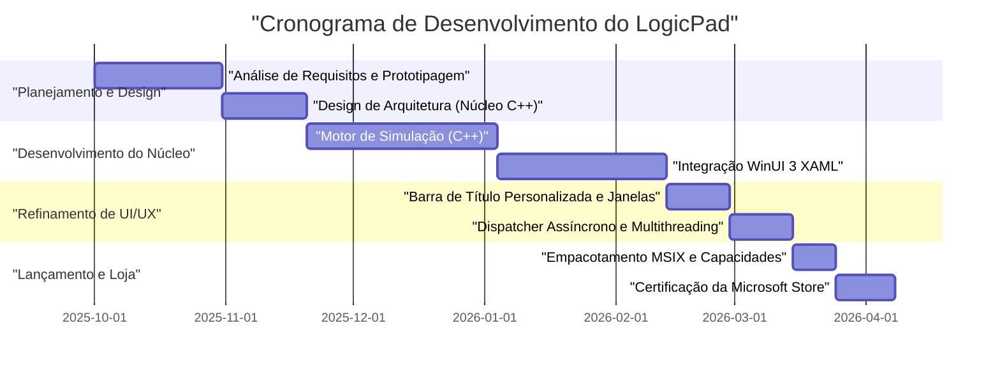
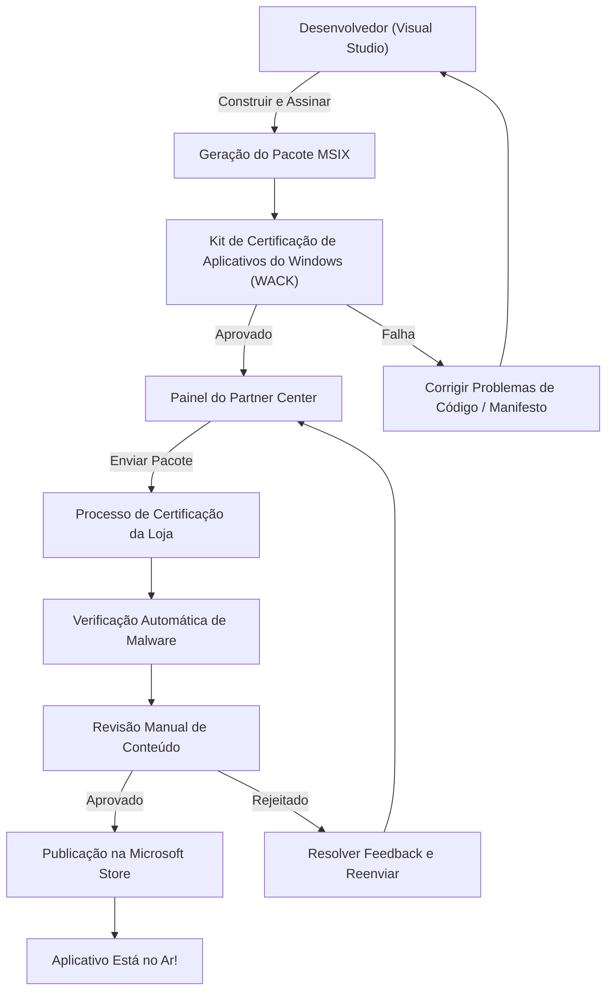

## 1. Introdução: Por que ousar criar um aplicativo nativo para Windows hoje em dia?

No desenvolvimento moderno de aplicativos, não há dúvida de que as tecnologias multiplataforma, como Electron, Tauri e React Native, se tornaram a norma. A abordagem "escreva uma vez, rode em qualquer lugar" (Write Once, Run Anywhere) usando tecnologias web é muito racional do ponto de vista da velocidade de desenvolvimento e facilidade de manutenção. No entanto, decidi ousar e escolher o caminho do desenvolvimento de um aplicativo chamado "LogicPad" como um aplicativo nativo totalmente otimizado para o Windows.

O LogicPad é um simulador de circuitos lógicos digitais e editor de texto voltado para engenheiros de hardware e estudantes de circuitos lógicos. Ele precisa simular dezenas de milhares de portas lógicas em tempo real e, simultaneamente, renderizar dados complexos de forma de onda sem nenhum atraso. Em um domínio que exige essa performance extrema, uma pausa de alguns milissegundos causada pela coleta de lixo (micro-stutter) ou a sobrecarga de renderização de um web view levam a uma degradação fatal da experiência do usuário.

Neste artigo, vou relembrar a trajetória, junto com uma explicação técnica bastante detalhada, desde a concepção do desenvolvimento do LogicPad, a implementação usando C++ e WinUI 3 (Windows App SDK), a superação de barreiras técnicas específicas, o empacotamento MSIX, até a distribuição mundial por meio da Microsoft Store. Ao compartilhar o processo de como um desenvolvedor individual pode criar um aplicativo nativo do Windows com qualidade corporativa, espero que isso sirva de guia para aqueles que também desejam enfrentar o desafio do desenvolvimento nativo.

## 2. Cronograma do Projeto

O desenvolvimento do LogicPad prosseguiu como um projeto pessoal, aproveitando os fins de semana e as noites. O cronograma geral durou cerca de meio ano (6 meses). Abaixo está um gráfico de Gantt que mostra o progresso do projeto.



Como pode ser visto, a maior parte do tempo de desenvolvimento foi gasta na otimização do motor principal e na integração do processamento assíncrono entre o WinUI 3 e o C++. Embora o desenvolvimento nativo tenha uma configuração inicial e curva de aprendizado maiores em comparação com o desenvolvimento multiplataforma, esse investimento certamente tem retorno garantido na forma do desempenho final.

## 3. Seleção de Tecnologia: As Profundezas do C++ / WinUI 3 / Windows App SDK

Ao desenvolver o LogicPad, a seleção da pilha de tecnologia foi uma das decisões mais importantes. Historicamente, existem várias opções para frameworks de UI nativos na plataforma Windows, como Win32 API (User32/GDI), MFC, Windows Forms, WPF e UWP. Atualmente, a Microsoft recomenda o **WinUI 3**, que está incluído no **Windows App SDK**, para o desenvolvimento moderno de aplicativos de desktop do Windows.

### 3.1. Arquitetura do Windows App SDK e WinUI 3
O Windows App SDK é um conjunto de bibliotecas para fornecer as APIs mais recentes do Windows, independentemente da versão do sistema operacional. Ao contrário da antiga UWP (Universal Windows Platform), que estava fortemente vinculada às atualizações do sistema operacional, o Windows App SDK é distribuído junto com o aplicativo, garantindo uma operação consistente desde o Windows 10 (versão 1809 e posterior) até o Windows 11.

O WinUI 3 é um framework de interface de usuário nativo que funciona sobre este Windows App SDK e suporta totalmente o Fluent Design System. Os componentes internos do WinUI 3 são construídos em C++ e DirectX, operando com extrema rapidez.

### 3.2. Por que ousar escolher C++ (C++/WinRT) em vez de C#
O WinUI 3 suporta C# e C++ como linguagens de desenvolvimento. Se você usar C# e .NET, a eficiência de desenvolvimento melhorará drasticamente, mas eu adotei **C++/WinRT** no LogicPad pelas seguintes razões:

1. **Gerenciamento de memória determinístico**: Como não há coletor de lixo (GC), você pode controlar totalmente o tempo de alocação e liberação de memória. Isso evita pausas do GC durante o loop de simulação.
2. **Otimização de SIMD e cache**: Em C++, o layout físico da memória (como Struct of Arrays) pode ser estritamente definido, permitindo maximizar a taxa de acertos de cache da CPU.
3. **Fronteira ABI nativa**: O C++/WinRT é uma projeção C++ moderna do COM (Component Object Model). Ele permite chamar APIs nativas do sistema operacional diretamente sem a sobrecarga do P/Invoke encontrado em C#.

A base do C++/WinRT é o COM. Todos os objetos WinRT são essencialmente objetos COM que implementam a interface `IUnknown`, e os ponteiros inteligentes do C++/WinRT, como `winrt::com_ptr`, gerenciam automaticamente a contagem de referências (`AddRef` / `Release`).

## 4. A Maior Barreira no Desenvolvimento do WinUI 3 e sua Solução

O desenvolvimento do WinUI 3 usando C++/WinRT é poderoso, mas traz suas próprias complexidades. Aqui, explicarei detalhadamente os dois maiores desafios técnicos enfrentados durante o desenvolvimento do LogicPad e suas respectivas soluções.

### 4.1. O Terror das Atualizações de UI Assíncronas e as Corrotinas no C++

A regra de ouro dos aplicativos de UI modernos é: "Você não deve bloquear a thread da UI". No LogicPad, é necessário realizar cálculos massivos de simulação de circuitos em uma thread em segundo plano e refletir esses resultados na thread da UI.

No C#, isso poderia ser descrito com relativa facilidade usando `async/await` e `DispatcherQueue`, mas no C++ isso é alcançado combinando corrotinas (Coroutines) do C++20 com o `winrt::apartment_context`. Compreender os modelos de apartment do COM (STA: Single-Threaded Apartment e MTA: Multi-Threaded Apartment) é essencial.

O código abaixo é extraído da base de código real do LogicPad e demonstra o padrão de execução suave para executar processos em segundo plano e retornar para a thread da UI.

```cpp
#include <winrt/Windows.Foundation.h>
#include <winrt/Microsoft.UI.Dispatching.h>
#include <winrt/Microsoft.UI.Xaml.h>

using namespace winrt;
using namespace Microsoft::UI::Xaml;
using namespace Microsoft::UI::Dispatching;

// Manipulador de evento de clique de botão
winrt::fire_and_forget MainWindow::OnRunSimulationClicked(
    IInspectable const& /* sender */, 
    RoutedEventArgs const& /* args */)
{
    // Captura o contexto do apartment (STA) da thread da UI atual
    winrt::apartment_context ui_thread;

    try 
    {
        // Atualiza o status da UI (isso é executado na thread da UI)
        StatusTextBlock().Text(L"Simulação em execução...");
        ProgressBar().IsIndeterminate(true);

        // Migra o contexto para o pool de threads (MTA)
        co_await winrt::resume_background();

        // Processo de simulação muito pesado (executado na thread em segundo plano)
        // Durante esse tempo, a thread da UI é liberada, o que evita o congelamento do aplicativo
        std::vector<LogicResult> results = CoreEngine::RunMassiveSimulation();
        
        // Formata os resultados da simulação para uma string (continua em segundo plano)
        winrt::hstring outputText = FormatResults(results);

        // Retorna o contexto para a thread da UI
        co_await ui_thread;

        // Como o restante será executado na thread da UI, os controles XAML podem ser acessados com segurança
        ResultTextBlock().Text(outputText);
        ProgressBar().IsIndeterminate(false);
        StatusTextBlock().Text(L"Concluído");
    }
    catch (winrt::hresult_error const& ex)
    {
        // Se ocorrer uma exceção, retorne para a thread da UI e mostre uma mensagem de erro
        co_await ui_thread;
        StatusTextBlock().Text(L"Erro: " + ex.message());
        ProgressBar().IsIndeterminate(false);
    }
}
```

O comportamento deste `winrt::apartment_context` parece mágico, mas internamente, um mecanismo avançado de C++ está em ação onde a interface `IContextCallback` é usada para lembrar o contexto da thread original e enfileirar (despachar) o processamento nesse contexto no momento do `co_await`. Dessa forma, os processos assíncronos podem ser descritos de maneira procedimental, sem cair no "inferno do callback" (callback hell).

### 4.2. Implementação Perfeita da Barra de Título Personalizada

Na era dos aplicativos do Windows 11, uma "barra de título personalizada" que pode hospedar guias ou uma caixa de pesquisa dentro da área da barra de título da janela (área de legenda) é um requisito crítico para uma experiência de usuário (UX) moderna. No entanto, no WinUI 3, a customização da barra de título não se trata apenas de mudar a cor; o nível de dificuldade aumenta imensamente se o requisito for "estender a área do cliente até a barra de título e manter a movimentação de arraste da janela e o suporte ao snap layout (redimensionamento automático quando a janela é levada para as bordas da tela)".

No LogicPad, a API `ExtendsContentIntoTitleBar` foi usada para construir a barra de título utilizando meus próprios elementos XAML. O código a seguir demonstra como usar a classe `AppWindow` do Windows App SDK para personalizar a barra de título.

```cpp
#include <winrt/Microsoft.UI.Windowing.h>
#include <winrt/Microsoft.UI.Interop.h>
#include <microsoft.ui.interop.h> // for GetWindowIdFromWindow

void MainWindow::InitializeCustomTitleBar()
{
    // Obtém o HWND (identificador de janela) da janela atual
    auto windowNative = this->try_as<::IWindowNative>();
    HWND hwnd{ nullptr };
    windowNative->get_WindowHandle(&hwnd);

    // Converte HWND em WindowId e obtém a instância do AppWindow
    winrt::Microsoft::UI::WindowId windowId = 
        winrt::Microsoft::UI::GetWindowIdFromWindow(hwnd);
    auto appWindow = winrt::Microsoft::UI::Windowing::AppWindow::GetFromWindowId(windowId);

    // Verifica se a versão do SO oferece suporte à personalização
    if (winrt::Microsoft::UI::Windowing::AppWindowTitleBar::IsCustomizationSupported())
    {
        auto titleBar = appWindow.TitleBar();
        
        // Estende a área do cliente (conteúdo) para a barra de título
        titleBar.ExtendsContentIntoTitleBar(true);

        // Torna o fundo dos botões de legenda padrão (minimizar, maximizar, fechar) transparente
        titleBar.ButtonBackgroundColor(winrt::Microsoft::UI::Colors::Transparent());
        titleBar.ButtonInactiveBackgroundColor(winrt::Microsoft::UI::Colors::Transparent());
        
        // Define o elemento da UI definido no XAML (AppTitleBar) como a área que pode ser arrastada
        // * Para os detalhes desta parte, é necessário monitorar o UIElement do lado do XAML com o
        // Dispatcher da thread da UI, e chamar SetDragRectangles() para comunicar a área de arrasto ao sistema operacional.
    }
}
```

A maior armadilha dessa implementação é que toda vez que o tamanho do elemento da interface do usuário do lado XAML muda (como ao redimensionar a janela), o sistema operacional deve ser notificado e a área de verificação de clique (hit test) deve ser recalculada usando `InputNonClientPointerSource` ou `SetDragRectangles`, declarando: "esta é uma área que pode ser arrastada". Caso contrário, bugs surgirão, como a janela não se mover ao arrastar a barra de título, ou o sistema entender como um arraste de janela quando o que você pretendia fazer era clicar num botão.

## 5. O Abismo do Empacotamento MSIX e o AppXManifest

Para distribuir a versão final do LogicPad, é necessário criar um instalador. Em vez dos instaladores convencionais MSI ou EXE, adotei o moderno formato **MSIX**. O MSIX garante que a instalação e a desinstalação sejam feitas de forma completamente limpa (sem sujar o registro) e conta com um recurso de atualização automática, tornando-o incrivelmente seguro e conveniente para os usuários.

No entanto, ao empacotar um aplicativo nativo escrito em C++ no formato MSIX, a coisa mais crítica a observar é a configuração do arquivo `Package.appxmanifest` (arquivo de manifesto).

O LogicPad precisa ler e gravar enormes arquivos de projetos de circuitos lógicos salvos no sistema de arquivos local (como na pasta Documentos do usuário). O ambiente sandbox normal de UWP pode acessar somente a pasta de dados do próprio aplicativo (AppContainer). Para obter direitos totais de acesso como um aplicativo de desktop nativo, a capacidade `runFullTrust` deve ser declarada no manifesto.

```xml
<?xml version="1.0" encoding="utf-8"?>
<Package
  xmlns="http://schemas.microsoft.com/appx/manifest/foundation/windows10"
  xmlns:uap="http://schemas.microsoft.com/appx/manifest/uap/windows10"
  xmlns:rescap="http://schemas.microsoft.com/appx/manifest/foundation/windows10/restrictedcapabilities"
  IgnorableNamespaces="uap rescap">

  <Identity
    Name="LogicPad.Studio"
    Publisher="CN=Kenji"
    Version="1.0.0.0" />

  <Properties>
    <DisplayName>LogicPad</DisplayName>
    <PublisherDisplayName>Kenji</PublisherDisplayName>
    <Logo>Assets\StoreLogo.png</Logo>
  </Properties>

  <Dependencies>
    <TargetDeviceFamily Name="Windows.Desktop" MinVersion="10.0.17763.0" MaxVersionTested="10.0.22621.0" />
  </Dependencies>

  <Capabilities>
    <!-- Restrições gerais de funcionalidade -->
    <Capability Name="internetClient" />
    <!-- Funcionalidade restrita para execução como um aplicativo de desktop nativo -->
    <rescap:Capability Name="runFullTrust" />
  </Capabilities>
</Package>
```

Este `<rescap:Capability Name="runFullTrust" />` é denominado "Capacidade Restrita" (Restricted Capability). Ao enviar para a Microsoft Store, é necessário enviar uma declaração de justificação explicando aos avaliadores o motivo pelo qual essas permissões são necessárias. Eu expliquei: "Como este aplicativo é uma ferramenta profissional para exportar, ler e gravar arquivos arbitrários de projeto de circuito lógico contidos no disco local do usuário" e recebi a aprovação sem incidentes.

## 6. O Caminho até a Microsoft Store e o Processo de Certificação

Assim que o aplicativo for concluído e o pacote MSIX tiver sido compilado, finalmente é a hora do envio para a Microsoft Store. Para os desenvolvedores individuais, a distribuição por meio da loja tem benefícios incontáveis: entrega automatizada de atualizações, garantia de confiabilidade e a utilidade do sistema de pagamentos.

O processo de envio para a Microsoft Store se dá através do Partner Center (Centro de Parceiros). O fluxograma a seguir ilustra todo o processo desde a compilação até a publicação.



### 6.1. A Barreira do WACK (Windows App Certification Kit)
Antes de enviar o aplicativo ao Partner Center, você deve sempre executar o **WACK (Windows App Certification Kit)** localmente e ser aprovado no teste prévio. O WACK é uma ferramenta que testa automaticamente se o aplicativo não vai travar, se não chama APIs não autorizadas e se atende aos requisitos de desempenho.

Para aplicativos nativos C++, o erro a se prestar mais atenção é o "Uso de APIs não suportadas". Quando você vincula estaticamente uma biblioteca C++ antiga de terceiros, ela pode usar internamente as obsoletas Win32 APIs, o que faz com que seja rejeitada na análise do WACK. Para evitar esse problema, atualizei as bibliotecas dependentes para as versões mais recentes e reescrevi algumas funções usando APIs alternativas fornecidas pelo Windows App SDK.

### 6.2. Avaliação e Publicação
A configuração no Partner Center inclui a definição do preço do aplicativo, restrição de idade (classificação IARC) e o preenchimento de capturas de tela e descrições para a loja. Como o LogicPad é uma ferramenta técnica, obteve rapidamente a classificação livre para todas as idades.

Levou cerca de 3 dias úteis desde a submissão do pacote até a conclusão da revisão. Após a varredura automática de malware e a verificação de funcionalidade, há uma verificação manual de funcionamento pela equipe de aprovação da Microsoft. O pedido de permissão para `runFullTrust` passou sem problemas, e a sensação de realização no momento em que o status finalmente mudou para "Publicado (In the Store)" foi insubstituível.

## 7. Desenvolvimento Pessoal como Negócio: Modelos Matemáticos de Desempenho e Lucro

Para que não seja apenas a satisfação de criar um aplicativo, mas sim transformar o LogicPad em um projeto atualizado continuamente e viável como um negócio, é necessário avaliar quantitativamente tanto os indicadores técnicos quanto os comerciais.

### 7.1. O Modelo de Otimização do Uso de Memória Proporcionado pelo C++
O maior ponto forte do LogicPad é ser extremamente leve em comparação aos editores baseados em Electron (por exemplo, VSCode). O uso total de memória (footprint) do aplicativo, $M_{total}$, pode ser modelado da seguinte forma:

$$
M_{total} = M_{UI} + M_{engine} + M_{cache}
$$

Aqui, o $M_{UI}$ devido à renderização nativa do WinUI 3, é drasticamente menor (cerca de 50MB) se comparado com o Electron, que carrega um motor de navegador completo.
Além disso, a memória do motor C++, $M_{engine}$, escala linearmente em relação ao número de portas lógicas $N$, graças à estruturas otimizadas e eliminação de ponteiros.

$$
M_{engine} = N \times \text{sizeof(LogicNode)}
$$

Otimizando o alinhamento das estruturas usando `#pragma pack` no C++, cortei a memória por nó até o limite absoluto.

```cpp
#pragma pack(push, 1)
// Não possui tabela de função virtual (vtable) e empacota para minimizar a memória
struct LogicNode {
    uint32_t id;         // 4 bytes
    uint16_t type;       // 2 bytes
    bool isActive;       // 1 byte
    // O tamanho da estrutura é de 7 bytes (sem preenchimento/padding de alinhamento)
};
#pragma pack(pop)
```

A memória da camada de cache $M_{cache}$ retém o histórico da simulação, portanto, aumenta proporcionalmente a $\mathcal{O}(N \log N)$, mas devido ao uso base ser pequeno, o uso total de RAM do sistema para um circuito com dezenas de milhares de nós permanece abaixo de 200 MB.

### 7.2. LTV e CAC: Matemática de Marketing
Na estratégia de monetização para o desenvolvimento pessoal, o equilíbrio entre o Valor do Tempo de Vida do Cliente (LTV: Lifetime Value) e o Custo de Aquisição de Clientes (CAC: Customer Acquisition Cost) é tudo. O LogicPad não adota o modelo de assinatura, mas um modelo de licença de compra única (freemium).

O LTV é calculado como a soma do valor presente descontado (usando a taxa de desconto $d$) da probabilidade de futuras compras de atualização. Para um período $T$, ele é expresso pela seguinte fórmula:

$$
LTV = \sum_{t=1}^{T} \frac{ARPU_t \times Margin}{(1+d)^t}
$$

Por outro lado, o CAC é o custo total de marketing, como anúncios no Twitter (atual X) e tráfego gerado por artigos de blog, dividido pelo número de novos usuários.

$$
CAC = \frac{Total\ Marketing\ Spend}{Number\ of\ New\ Users}
$$

A vantagem do desenvolvimento individual é que o custo de mão de obra para o desenvolvimento pode ser considerado como "tempo de hobby" (custo irrecuperável/sunk cost), permitindo que o CAC seja calculado apenas com base no custo puro de marketing. Atualmente, devido a um tráfego orgânico impulsionado principalmente pelo boca a boca em comunidades de tecnologia de nicho, um estado próximo a $CAC \approx 0$ foi atingido, realizando uma economia unitária saudável de $LTV > CAC$.

## 8. Conclusão: O Mundo Árduo, Porém Belo, do Desenvolvimento de Aplicativos Nativos

Ao olhar para trás na jornada desde o desenvolvimento do LogicPad até seu lançamento na Microsoft Store, fica claro que não foi um caminho plano. Lutar contra erros de compilação obscuros em C++/WinRT, rastrear vazamentos de memória devido a bugs de contagem de referência COM e investigar as especificações de XML dos manifestos MSIX não foi tarefa fácil.

É precisamente porque a evolução da tecnologia web nos trouxe para a era em que "você pode construir qualquer coisa em um navegador", que a experiência de desenvolvimento nativo - atingindo diretamente as APIs do sistema operacional e prestando atenção a cada byte de memória e cada ciclo de clock do processador - aprimora esmagadoramente os músculos fundamentais de engenharia.

O WinUI 3 e o Windows App SDK continuam sendo desenvolvidos ativamente e são as melhores ferramentas para a construção de aplicativos lindos que aproveitam ao máximo o paradigma da interface do usuário do Windows 11. Eu sinceramente espero que este artigo de blog sirva como um guia para desenvolvedores que estejam prestes a embarcar na criação de aplicativos nativos do Windows e que veremos cada vez mais aplicativos excepcionais ocupando as prateleiras da loja digital.

O desenvolvimento ainda não acabou. Para a próxima versão do LogicPad, planejo integrar um mecanismo de renderização de forma de onda proprietário usando Direct2D. No próximo artigo, exploraremos profundamente a interoperabilidade do DirectX e WinUI 3 (utilizando o SwapChainPanel). Fique ligado!
