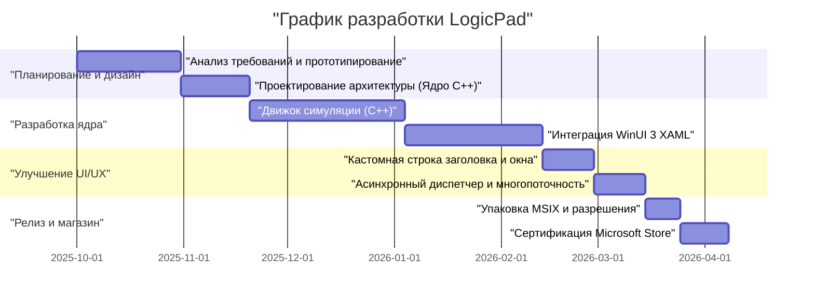
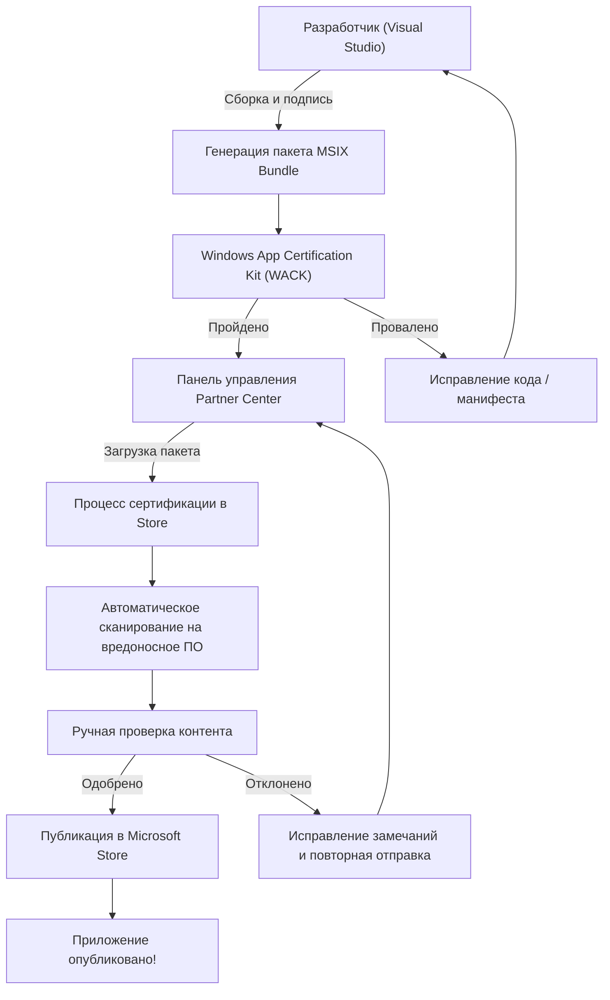

## 1. Введение: почему именно сейчас стоит создавать нативные приложения для Windows

В современной разработке приложений кроссплатформенные технологии, такие как Electron, Tauri и React Native, несомненно стали мейнстримом. Подход «написал один раз, работает везде» (Write Once, Run Anywhere) с использованием веб-технологий весьма рационален с точки зрения скорости разработки и простоты поддержки. Однако я намеренно выбрал путь создания «LogicPad» как нативного приложения, полностью оптимизированного под Windows.

LogicPad — это симулятор цифровых логических схем и текстовый редактор, целевой аудиторией которого являются инженеры по аппаратному обеспечению и те, кто изучает логические схемы. Приложению необходимо моделировать десятки тысяч логических вентилей в реальном времени, одновременно отображая сложные волновые данные без задержек. В области, где требуется такая экстремальная производительность, паузы на сборку мусора длительностью в несколько миллисекунд (микрофризы) или накладные расходы на рендеринг веб-представления (WebView) приводят к фатальному ухудшению пользовательского опыта.

В этой статье я подробно рассмотрю весь путь: от концепции разработки LogicPad, реализации на C++ и WinUI 3 (Windows App SDK), преодоления специфических технических барьеров, упаковки в формат MSIX, и до публикации для всего мира через Microsoft Store, сопровождая это глубокими техническими объяснениями. Я надеюсь, что мой опыт того, как независимый разработчик может создать нативное Windows-приложение корпоративного качества, станет ориентиром для тех, кто также решил бросить вызов нативной разработке.

## 2. График проекта

Разработка LogicPad велась как личный проект в выходные дни и по вечерам. Весь проект занял около полугода (6 месяцев). Ниже представлена диаграмма Ганта, показывающая ход выполнения проекта.



Как видно, большая часть времени разработки была потрачена на оптимизацию базового движка и интеграцию асинхронной обработки между WinUI 3 и C++. Несмотря на то, что нативная разработка имеет более высокие затраты на начальную настройку и обучение по сравнению с кроссплатформенной разработкой, эти инвестиции определенно окупаются в виде конечной производительности.

## 3. Выбор технологий: Глубины C++ / WinUI 3 / Windows App SDK

При разработке LogicPad выбор технологического стека был одним из самых важных решений. Исторически на платформе Windows существовали различные варианты нативных UI-фреймворков, такие как Win32 API (User32/GDI), MFC, Windows Forms, WPF, UWP и др. В настоящее время Microsoft рекомендует для разработки современных настольных приложений Windows использовать **WinUI 3**, который входит в состав **Windows App SDK**.

### 3.1. Архитектура Windows App SDK и WinUI 3
Windows App SDK — это набор библиотек для предоставления новейших Windows API независимо от версии ОС. В то время как традиционная UWP (Universal Windows Platform) была тесно связана с обновлениями ОС, Windows App SDK распространяется вместе с приложением, что гарантирует стабильную работу от Windows 10 (начиная с версии 1809) до Windows 11.

WinUI 3 — это нативный UI-фреймворк, работающий поверх Windows App SDK, полностью поддерживающий Fluent Design System. Внутреннее устройство WinUI 3 реализовано на C++ и DirectX, что обеспечивает очень высокую скорость работы.

### 3.2. Почему был выбран C++ (C++/WinRT), а не C#
Для разработки на WinUI 3 поддерживаются языки C# и C++. Использование C# и .NET значительно повысило бы скорость разработки, но в LogicPad я выбрал **C++/WinRT** по следующим причинам:

1. **Детерминированное управление памятью**: Отсутствие сборщика мусора (GC) позволяет полностью контролировать время выделения и освобождения памяти. Это предотвращает паузы GC во время цикла симуляции.
2. **Оптимизация SIMD и кэша**: В C++ можно строго определить физическую структуру данных в памяти (например, Struct of Arrays), чтобы максимизировать процент попадания в кэш процессора.
3. **Нативные ABI-границы**: C++/WinRT — это современная проекция C++ для COM (Component Object Model). Это позволяет вызывать нативные API ОС напрямую, без накладных расходов P/Invoke, как в C#.

В основе C++/WinRT лежит COM. Все объекты WinRT по сути являются COM-объектами, реализующими интерфейс `IUnknown`, а умные указатели C++/WinRT, такие как `winrt::com_ptr`, автоматически управляют подсчетом ссылок (`AddRef` / `Release`).

## 4. Главные препятствия и прорывы в разработке на WinUI 3

Разработка WinUI 3 с использованием C++/WinRT очень мощная, но при этом сопряжена со специфической сложностью. Здесь я подробно объясню две основные технические проблемы, с которыми я столкнулся при разработке LogicPad, и пути их решения.

### 4.1. Ужас асинхронного обновления UI в C++ и корутины

Золотое правило современных UI-приложений — «не блокировать поток пользовательского интерфейса (UI-поток)». В LogicPad необходимо выполнять симуляцию огромных схем в фоновом потоке, а затем отображать результаты в UI-потоке.

В C# это можно довольно просто описать с помощью `async/await` и `DispatcherQueue`, но в C++ это реализуется путем комбинирования корутин C++20 (Coroutines) и `winrt::apartment_context`. Здесь необходимо понимание квартирной модели COM (STA: Single-Threaded Apartment и MTA: Multi-Threaded Apartment).

Следующий код из реальной кодовой базы LogicPad демонстрирует паттерн бесшовного перехода между фоновыми вычислениями и возвратом в UI-поток.

```cpp
#include <winrt/Windows.Foundation.h>
#include <winrt/Microsoft.UI.Dispatching.h>
#include <winrt/Microsoft.UI.Xaml.h>

using namespace winrt;
using namespace Microsoft::UI::Xaml;
using namespace Microsoft::UI::Dispatching;

// Обработчик события нажатия кнопки
winrt::fire_and_forget MainWindow::OnRunSimulationClicked(
    IInspectable const& /* sender */, 
    RoutedEventArgs const& /* args */)
{
    // Захват контекста квартиры (STA) текущего UI-потока
    winrt::apartment_context ui_thread;

    try 
    {
        // Обновление статуса UI (выполняется в UI-потоке)
        StatusTextBlock().Text(L"Идет симуляция...");
        ProgressBar().IsIndeterminate(true);

        // Переход контекста в пул потоков (MTA)
        co_await winrt::resume_background();

        // Очень тяжелый процесс симуляции (выполняется в фоновом потоке)
        // В это время UI-поток освобождается, предотвращая зависание приложения
        std::vector<LogicResult> results = CoreEngine::RunMassiveSimulation();
        
        // Форматирование результатов симуляции в строку (продолжается в фоне)
        winrt::hstring outputText = FormatResults(results);

        // Возврат контекста в UI-поток
        co_await ui_thread;

        // Дальнейший код выполняется в UI-потоке, поэтому можно безопасно обращаться к элементам управления XAML
        ResultTextBlock().Text(outputText);
        ProgressBar().IsIndeterminate(false);
        StatusTextBlock().Text(L"Завершено");
    }
    catch (winrt::hresult_error const& ex)
    {
        // При возникновении исключения также возвращаемся в UI-поток для отображения сообщения об ошибке
        co_await ui_thread;
        StatusTextBlock().Text(L"Ошибка: " + ex.message());
        ProgressBar().IsIndeterminate(false);
    }
}
```

Поведение `winrt::apartment_context` выглядит как магия, но внутренне он использует интерфейс `IContextCallback` для запоминания исходного контекста потока, и во время `co_await` ставит в очередь (отправляет) выполнение обратно в этот контекст — это продвинутый механизм C++. Это позволяет писать асинхронный код в процедурном стиле, избегая ада коллбеков.

### 4.2. Идеальная реализация кастомной строки заголовка

В приложениях эпохи Windows 11 «кастомная строка заголовка» (область caption), где размещаются вкладки или строка поиска, является обязательным требованием современного UX. В WinUI 3 просто изменить цвет строки заголовка легко, но попытка удовлетворить требование «расширить клиентскую область на строку заголовка, сохранив при этом возможность перемещения окна и функции Snap Layouts (автоматическое изменение размера при перетаскивании к краю экрана)», резко повышает уровень сложности.

В LogicPad я использовал API `ExtendsContentIntoTitleBar`, чтобы создать строку заголовка из собственных XAML-элементов. Ниже приведен код настройки строки заголовка с использованием класса `AppWindow` из Windows App SDK.

```cpp
#include <winrt/Microsoft.UI.Windowing.h>
#include <winrt/Microsoft.UI.Interop.h>
#include <microsoft.ui.interop.h> // for GetWindowIdFromWindow

void MainWindow::InitializeCustomTitleBar()
{
    // Получение HWND (дескриптор окна) текущего окна
    auto windowNative = this->try_as<::IWindowNative>();
    HWND hwnd{ nullptr };
    windowNative->get_WindowHandle(&hwnd);

    // Преобразование HWND в WindowId и получение экземпляра AppWindow
    winrt::Microsoft::UI::WindowId windowId = 
        winrt::Microsoft::UI::GetWindowIdFromWindow(hwnd);
    auto appWindow = winrt::Microsoft::UI::Windowing::AppWindow::GetFromWindowId(windowId);

    // Проверка, поддерживает ли версия ОС кастомизацию
    if (winrt::Microsoft::UI::Windowing::AppWindowTitleBar::IsCustomizationSupported())
    {
        auto titleBar = appWindow.TitleBar();
        
        // Расширение клиентской области (контента) на строку заголовка
        titleBar.ExtendsContentIntoTitleBar(true);

        // Делаем фон стандартных кнопок заголовка (свернуть/развернуть/закрыть) прозрачным
        titleBar.ButtonBackgroundColor(winrt::Microsoft::UI::Colors::Transparent());
        titleBar.ButtonInactiveBackgroundColor(winrt::Microsoft::UI::Colors::Transparent());
        
        // Установка UI-элемента (AppTitleBar), определенного в XAML, как области перетаскивания
        // *Для этого необходимо отслеживать UIElement на стороне XAML с помощью Dispatcher в UI-потоке,
        // и вызывать SetDragRectangles(), чтобы сообщить ОС об областях, доступных для перетаскивания.
    }
}
```

Самая большая ловушка в этой реализации заключается в том, что каждый раз, когда размер элемента пользовательского интерфейса со стороны XAML меняется (например, при изменении размера окна), необходимо пересчитывать и уведомлять ОС об области hit-test со словами «здесь можно перетаскивать», используя `InputNonClientPointerSource` или `SetDragRectangles`. Если этого не сделать, возникнут ошибки: окно не будет двигаться при перетаскивании за заголовок, или нажатие на кнопку будет распознаваться как перетаскивание окна.

## 5. Глубины упаковки MSIX и AppXManifest

Для распространения завершенного LogicPad необходимо создать установщик. Вместо традиционных установщиков MSI или EXE я выбрал современный формат **MSIX**. MSIX обеспечивает абсолютно чистую установку и удаление (не засоряет реестр) и включает функцию автоматического обновления, что очень безопасно и удобно для пользователей.

Однако при упаковке нативного приложения, написанного на C++, в формат MSIX самое важное, на что следует обратить внимание — это настройки `Package.appxmanifest` (файла манифеста).

LogicPad должен читать и писать огромные файлы проектов, сохраненные в локальной файловой системе (например, в папке «Документы» пользователя). В стандартной изолированной среде (AppContainer) UWP приложение имеет доступ только к собственной изолированной папке данных. Чтобы получить права полного доступа как у нативного десктопного приложения, необходимо объявить возможность `runFullTrust` в манифесте.

```xml
<?xml version="1.0" encoding="utf-8"?>
<Package
  xmlns="http://schemas.microsoft.com/appx/manifest/foundation/windows10"
  xmlns:uap="http://schemas.microsoft.com/appx/manifest/uap/windows10"
  xmlns:rescap="http://schemas.microsoft.com/appx/manifest/foundation/windows10/restrictedcapabilities"
  IgnorableNamespaces="uap rescap">

  <Identity
    Name="LogicPad.Studio"
    Publisher="CN=Kenji"
    Version="1.0.0.0" />

  <Properties>
    <DisplayName>LogicPad</DisplayName>
    <PublisherDisplayName>Kenji</PublisherDisplayName>
    <Logo>Assets\StoreLogo.png</Logo>
  </Properties>

  <Dependencies>
    <TargetDeviceFamily Name="Windows.Desktop" MinVersion="10.0.17763.0" MaxVersionTested="10.0.22621.0" />
  </Dependencies>

  <Capabilities>
    <!-- Обычные ограничения возможностей -->
    <Capability Name="internetClient" />
    <!-- Ограниченная возможность для работы в качестве нативного десктопного приложения -->
    <rescap:Capability Name="runFullTrust" />
  </Capabilities>
</Package>
```

Это `<rescap:Capability Name="runFullTrust" />` называется «ограниченной возможностью» (Restricted Capability). При отправке в Microsoft Store вам нужно будет предоставить письменное обоснование рецензентам, почему требуется это разрешение. Я объяснил, что «это приложение является инструментом для профессионалов, которое читает, записывает и экспортирует любые файлы проектов логических схем на локальном диске пользователя», и успешно прошел проверку.

## 6. Путь к Microsoft Store и процесс проверки

После завершения работы над приложением и сборки пакета MSIX наступает время для отправки в Microsoft Store. Для независимого разработчика распространение через магазин дает неоценимые преимущества: автоматическая доставка обновлений, гарантия надежности и использование платежной системы.

Процесс отправки в Microsoft Store осуществляется через Partner Center (Центр партнеров). Блок-схема ниже показывает весь путь от сборки до публикации.



### 6.1. Барьер WACK (Windows App Certification Kit)
Перед загрузкой в Partner Center вы должны локально запустить **WACK (Windows App Certification Kit)** и пройти предварительное тестирование. WACK — это инструмент, который автоматически проверяет приложение на наличие сбоев, вызовы недопустимых API и соответствие требованиям производительности.

Для нативных приложений на C++ особую осторожность следует проявлять с ошибками «использование неподдерживаемого API». Если вы статически компонуете старую стороннюю C++ библиотеку, то внутри нее могут использоваться устаревшие Win32 API, из-за чего проверка WACK не будет пройдена. Чтобы обойти эту проблему, я обновил зависимости до последних версий и переписал некоторые функции на альтернативные API, предоставляемые Windows App SDK.

### 6.2. Проверка и публикация
Настройки в Partner Center включают ценообразование приложения, возрастные ограничения (рейтинг IARC), а также ввод скриншотов и описаний для магазина. Поскольку LogicPad — это технический инструмент, я моментально получил рейтинг для всех возрастов.

С момента отправки пакета до завершения проверки прошло около 3 рабочих дней. После автоматического сканирования на вирусы и проверки функциональности, команда рецензентов Microsoft проводит ручную проверку. Запрос на разрешение `runFullTrust` прошел без проблем, и чувство достижения, когда статус наконец изменился на «Опубликовано» (In the Store), было ни с чем не сравнимым.

## 7. Личная разработка как бизнес: Математическая модель производительности и дохода

Чтобы не просто создать приложение и быть довольным, а постоянно обновлять LogicPad и превратить его в успешный бизнес, необходимо количественно оценивать как технические, так и бизнес-показатели.

### 7.1. Модель оптимизации потребления памяти благодаря C++
Главное преимущество LogicPad заключается в его невероятной легковесности по сравнению с редакторами на базе Electron (например, VSCode). След памяти (memory footprint) приложения $M_{total}$ можно смоделировать следующим образом:

$$
M_{total} = M_{UI} + M_{engine} + M_{cache}
$$

Здесь затраты памяти на нативный рендеринг WinUI 3 $M_{UI}$ кардинально меньше по сравнению с Electron, который загружает браузерный движок (около 50 МБ).
Кроме того, память C++ движка $M_{engine}$ линейно масштабируется относительно количества логических вентилей $N$, благодаря оптимизированным структурам и устранению указателей.

$$
M_{engine} = N \times \text{sizeof(LogicNode)}
$$

Используя `#pragma pack` в C++ для оптимизации выравнивания структуры, я минимизировал потребление памяти на каждый узел до предела.

```cpp
#pragma pack(push, 1)
// Отказ от таблицы виртуальных функций (vtable) и упаковка для минимизации памяти
struct LogicNode {
    uint32_t id;         // 4 байта
    uint16_t type;       // 2 байта
    bool isActive;       // 1 байт
    // Размер структуры — 7 байт (без выравнивающего паддинга)
};
#pragma pack(pop)
```

Память кэш-слоя $M_{cache}$ для хранения истории симуляции увеличивается пропорционально $\mathcal{O}(N \log N)$, но поскольку базовый след памяти небольшой, даже для схем из десятков тысяч узлов потребление ОЗУ всей системы остается в пределах 200 МБ.

### 7.2. LTV и CAC: Расчеты маркетинга
В стратегии монетизации личных проектов баланс между пожизненной ценностью клиента (LTV: Lifetime Value) и стоимостью привлечения клиента (CAC: Customer Acquisition Cost) решает все. LogicPad использует не подписку, а модель лицензии с разовой покупкой (freemium).

LTV рассчитывается как сумма текущей стоимости вероятности будущих покупок обновлений, дисконтированная по ставке $d$. За период $T$ это выражается следующей формулой:

$$
LTV = \sum_{t=1}^{T} \frac{ARPU_t \times Margin}{(1+d)^t}
$$

С другой стороны, CAC — это общая сумма маркетинговых затрат, таких как реклама в Twitter (ныне X) или привлечение через статьи в блогах, разделенная на количество новых пользователей.

$$
CAC = \frac{Total\ Marketing\ Spend}{Number\ of\ New\ Users}
$$

Преимущество индивидуальной разработки в том, что затраты на рабочее время можно считать безвозвратными как «время на хобби», и CAC можно рассчитывать только на основе чистых маркетинговых расходов. В настоящее время благодаря органическому трафику, в основном основанному на рекомендациях в нишевых технических сообществах, мы достигаем здоровой юнит-экономики $LTV > CAC$ в состоянии, когда $CAC \approx 0$.

## 8. Заключение: суровый, но прекрасный мир нативной разработки

Оглядываясь на путь разработки LogicPad и его выпуск в Microsoft Store, могу сказать, что это был далеко не простой путь: борьба с запутанными ошибками компиляции C++/WinRT, отслеживание утечек памяти из-за ошибок подсчета ссылок COM, а также изучение XML-спецификаций манифеста MSIX.

Именно потому, что с развитием веб-технологий наступила эпоха, когда «в браузере можно сделать всё что угодно», опыт нативной разработки, когда вы напрямую обращаетесь к API ОС и заботитесь о каждом байте памяти и такте процессора, в подавляющей степени повышает базовую квалификацию инженера.

WinUI 3 и Windows App SDK продолжают активно развиваться и являются лучшими инструментами для создания красивых приложений, максимально использующих парадигму пользовательского интерфейса Windows 11. Я искренне надеюсь, что этот пост в блоге поможет разработчикам, которые собираются попробовать свои силы в нативной разработке для Windows, и что в Store появится еще больше отличных приложений.

Разработка еще не закончена. В следующей версии LogicPad планируется интеграция собственного движка рендеринга волновых форм на базе Direct2D. В следующей статье мы планируем углубиться во взаимодействие DirectX и WinUI 3 (использование SwapChainPanel). Оставайтесь с нами.
