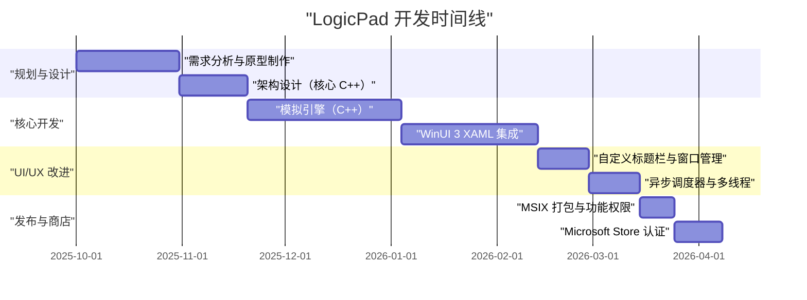
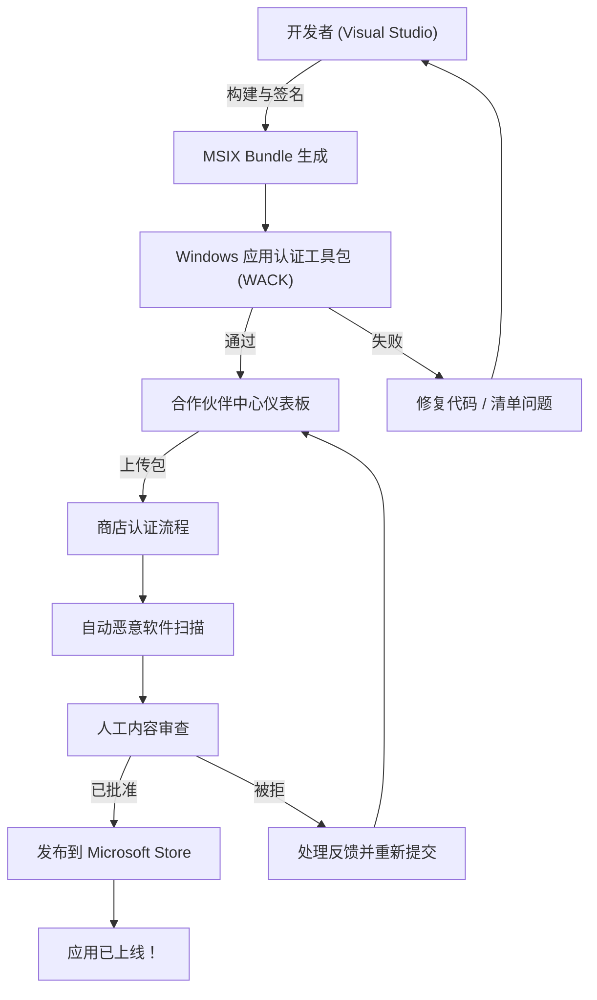

## 1. 引言：为什么现在还要执意开发Windows原生应用

在现代应用开发中，Electron、Tauri、React Native等跨平台技术毫无疑问已经成为主流。使用Web技术“一次编写，到处运行”（Write Once, Run Anywhere）的方法，从开发速度和可维护性的角度来看是非常合理的。然而，我却偏偏选择将“LogicPad”这款应用开发为完全针对Windows优化的原生应用。

LogicPad是一款面向硬件工程师和逻辑电路学习者的数字逻辑电路模拟器兼文本编辑器。它需要实时模拟数以万计的逻辑门，并同时无延迟地渲染复杂的波形数据。在这样追求极限性能的领域，垃圾回收（GC）造成的几毫秒停顿（微卡顿）或Web视图的渲染开销，都会导致用户体验的致命下降。

本文将通过非常详细的技术解说，回顾LogicPad从开发构想，到使用C++和WinUI 3（Windows App SDK）进行实现，突破特有的技术壁垒，进行MSIX打包，最终通过Microsoft Store向全世界发布的全过程。通过分享个人开发者如何打造企业级原生Windows应用的过程，希望能为同样挑战原生开发的开发者们提供一些指引。

## 2. 项目时间线

LogicPad的开发是利用周末和晚上的时间作为个人项目推进的。整体时间线长达约半年（6个月）。以下是展示该项目进展的甘特图。



如上所示，大部分开发时间都花在了核心引擎的优化，以及WinUI 3和C++之间异步处理的集成上。虽然原生开发相比跨平台开发初期的设置和学习成本更高，但这些投入最终都会以性能的形式切实地得到回报。

## 3. 技术选型：C++ / WinUI 3 / Windows App SDK 的深渊

在开发LogicPad时，技术栈的选型是最重要的决定之一。在Windows平台的原生UI框架中，历史上有Win32 API（User32/GDI）、MFC、Windows Forms、WPF、UWP等各种选择。目前，Microsoft推荐的用于现代Windows桌面应用开发的是包含在**Windows App SDK**中的**WinUI 3**。

### 3.1. Windows App SDK 与 WinUI 3 的架构
Windows App SDK是一组提供最新Windows API且不依赖OS版本的库。传统的UWP（通用Windows平台）与OS的更新紧密绑定，而Windows App SDK则是随应用程序一起分发，因此能保证从Windows 10（版本1809及以上）到Windows 11的一致运行。

WinUI 3是在这个Windows App SDK上运行的原生UI框架，完全支持Fluent Design System。WinUI 3的内部由C++和DirectX构建，运行速度非常快。

### 3.2. 为什么不选C#，而偏偏选择C++（C++/WinRT）
WinUI 3支持C#和C++作为开发语言。如果使用C#和.NET，开发效率会有飞跃性的提升，但LogicPad出于以下原因采用了**C++/WinRT**。

1. **确定性的内存管理**: 因为不存在垃圾回收器（GC），所以可以完全控制内存的分配和释放时机。这防止了在模拟循环中发生GC停顿。
2. **SIMD 与缓存优化**: 在C++中，可以严格定义内存的物理布局（如Struct of Arrays等），从而最大化CPU缓存的命中率。
3. **原生 ABI 边界**: C++/WinRT是COM（组件对象模型）的现代C++投影。它可以直接调用OS的原生API，而没有像C#中P/Invoke那样的开销。

C++/WinRT的基础是COM。所有的WinRT对象本质上都是实现了 `IUnknown` 接口的COM对象，C++/WinRT的 `winrt::com_ptr` 等智能指针会自动管理引用计数（`AddRef` / `Release`）。

## 4. WinUI 3 开发中的最大壁垒与突破口

使用C++/WinRT进行WinUI 3开发虽然强大，但也伴随着特有的复杂性。在这里，我将详细解说在LogicPad开发中尤为艰难的两个主要技术挑战及其解决方案。

### 4.1. C++ 中异步 UI 更新的恐惧与协程

现代UI应用的一条铁律是“绝不能阻塞UI线程”。在LogicPad中，需要在后台线程执行庞大电路的模拟计算，并将结果反映到UI线程上。

如果是C#，使用 `async/await` 和 `DispatcherQueue` 就能比较简单地编写出来，但在C++中，则是通过结合C++20的协程（Coroutines）和 `winrt::apartment_context` 来实现的。理解COM的套间模型（STA: 单线程套间 和 MTA: 多线程套间）是必不可少的。

以下代码是从LogicPad实际代码库中提取的，展示了无缝地在后台进行计算并返回UI线程的模式。

```cpp
#include <winrt/Windows.Foundation.h>
#include <winrt/Microsoft.UI.Dispatching.h>
#include <winrt/Microsoft.UI.Xaml.h>

using namespace winrt;
using namespace Microsoft::UI::Xaml;
using namespace Microsoft::UI::Dispatching;

// 按钮点击的事件处理程序
winrt::fire_and_forget MainWindow::OnRunSimulationClicked(
    IInspectable const& /* sender */, 
    RoutedEventArgs const& /* args */)
{
    // 捕获当前UI线程的套间上下文（STA）
    winrt::apartment_context ui_thread;

    try 
    {
        // 更新UI状态（在此处由UI线程执行）
        StatusTextBlock().Text(L"模拟运行中...");
        ProgressBar().IsIndeterminate(true);

        // 将上下文转移到线程池（MTA）
        co_await winrt::resume_background();

        // 非常繁重的模拟处理（在后台线程执行）
        // 在此期间，UI线程被释放，防止应用冻结
        std::vector<LogicResult> results = CoreEngine::RunMassiveSimulation();
        
        // 将模拟结果格式化为字符串（继续在后台执行）
        winrt::hstring outputText = FormatResults(results);

        // 将上下文切回UI线程
        co_await ui_thread;

        // 之后由UI线程执行，因此可以安全地访问XAML控件
        ResultTextBlock().Text(outputText);
        ProgressBar().IsIndeterminate(false);
        StatusTextBlock().Text(L"已完成");
    }
    catch (winrt::hresult_error const& ex)
    {
        // 发生异常时也返回UI线程显示错误信息
        co_await ui_thread;
        StatusTextBlock().Text(L"错误: " + ex.message());
        ProgressBar().IsIndeterminate(false);
    }
}
```

这个 `winrt::apartment_context` 的行为看起来像魔法一样，但其内部是利用 `IContextCallback` 接口记住原始线程上下文，并在 `co_await` 时将处理分发（入队）给该上下文，这是C++中一种高级的机制。得益于此，我们可以在不陷入回调地狱的情况下，以过程式代码的外观编写异步处理。

### 4.2. 自定义标题栏的完美实现

在Windows 11时代的应用中，在窗口标题栏（标题区域）放置标签页或搜索框的“自定义标题栏”是现代UX的基本要求。然而，在WinUI 3中自定义标题栏，如果仅仅是改变颜色很容易，但如果要满足“将客户区扩展到标题栏，同时保持窗口的拖拽移动和吸附布局（将窗口移到屏幕边缘时的自动调整大小）”的要求，难度就会直线上升。

在LogicPad中，我使用了 `ExtendsContentIntoTitleBar` API，用自己的XAML元素构建了标题栏。以下代码是利用Windows App SDK的 `AppWindow` 类自定义标题栏的步骤。

```cpp
#include <winrt/Microsoft.UI.Windowing.h>
#include <winrt/Microsoft.UI.Interop.h>
#include <microsoft.ui.interop.h> // 针对 GetWindowIdFromWindow

void MainWindow::InitializeCustomTitleBar()
{
    // 获取当前窗口的HWND（窗口句柄）
    auto windowNative = this->try_as<::IWindowNative>();
    HWND hwnd{ nullptr };
    windowNative->get_WindowHandle(&hwnd);

    // 从HWND转换为WindowId，并获取AppWindow实例
    winrt::Microsoft::UI::WindowId windowId = 
        winrt::Microsoft::UI::GetWindowIdFromWindow(hwnd);
    auto appWindow = winrt::Microsoft::UI::Windowing::AppWindow::GetFromWindowId(windowId);

    // 检查OS版本是否支持自定义
    if (winrt::Microsoft::UI::Windowing::AppWindowTitleBar::IsCustomizationSupported())
    {
        auto titleBar = appWindow.TitleBar();
        
        // 将客户区（内容）扩展至标题栏
        titleBar.ExtendsContentIntoTitleBar(true);

        // 将默认的标题按钮（最小化、最大化、关闭）的背景设为透明
        titleBar.ButtonBackgroundColor(winrt::Microsoft::UI::Colors::Transparent());
        titleBar.ButtonInactiveBackgroundColor(winrt::Microsoft::UI::Colors::Transparent());
        
        // 将XAML端定义的UI元素（AppTitleBar）设置为拖拽区域
        // ※此部分的细节需要通过UI线程的Dispatcher监视XAML端的UIElement，
        // 并调用 SetDragRectangles() 来告知OS可拖拽区域。
    }
}
```

此实现中最大的陷阱在于，每当XAML端的UI元素大小发生变化时（如窗口调整大小时），都必须使用 `InputNonClientPointerSource` 或 `SetDragRectangles` 向OS重新计算并通知命中测试区域：“这里是可拖拽区域”。如果忽略了这一点，就会出现拖拽标题栏但窗口不动，或者想点击按钮却被判定为窗口拖拽等bug。

## 5. MSIX 打包的深渊与 AppXManifest

为了分发开发完成的LogicPad，必须创建安装程序。我没有采用传统的MSI或EXE安装程序，而是采用了现代的 **MSIX** 格式。MSIX能够极其干净地进行安装和卸载（不污染注册表），并具备自动更新功能，对用户来说非常安全和舒适。

然而，在使用MSIX打包用C++编写的原生应用时，最需要注意的是 `Package.appxmanifest`（清单文件）的设置。

LogicPad需要读写保存在本地文件系统（如用户的文档文件夹）中的庞大项目文件。在标准UWP的沙盒环境中，只能访问应用自身隔离的数据文件夹（AppContainer）。为了作为原生桌面应用获得完全访问权限，必须在清单中声明 `runFullTrust` 功能。

```xml
<?xml version="1.0" encoding="utf-8"?>
<Package
  xmlns="http://schemas.microsoft.com/appx/manifest/foundation/windows10"
  xmlns:uap="http://schemas.microsoft.com/appx/manifest/uap/windows10"
  xmlns:rescap="http://schemas.microsoft.com/appx/manifest/foundation/windows10/restrictedcapabilities"
  IgnorableNamespaces="uap rescap">

  <Identity
    Name="LogicPad.Studio"
    Publisher="CN=Kenji"
    Version="1.0.0.0" />

  <Properties>
    <DisplayName>LogicPad</DisplayName>
    <PublisherDisplayName>Kenji</PublisherDisplayName>
    <Logo>Assets\StoreLogo.png</Logo>
  </Properties>

  <Dependencies>
    <TargetDeviceFamily Name="Windows.Desktop" MinVersion="10.0.17763.0" MaxVersionTested="10.0.22621.0" />
  </Dependencies>

  <Capabilities>
    <!-- 一般功能限制 -->
    <Capability Name="internetClient" />
    <!-- 作为原生桌面应用运行的受限功能 -->
    <rescap:Capability Name="runFullTrust" />
  </Capabilities>
</Package>
```

这个 `<rescap:Capability Name="runFullTrust" />` 被称为“受限功能”（Restricted Capability），在提交到Microsoft Store时，必须向审查人员提交一份说明书，证明为何需要该权限。我解释说：“因为本应用是面向专业人士的工具，需要读写和导出用户本地磁盘上的任意逻辑电路项目文件”，最终顺利获得了批准。

## 6. 通往 Microsoft Store 之路与审查流程

当应用程序完成和MSIX包构建结束后，终于要提交到Microsoft Store了。对于个人开发者而言，通过商店分发有着不可估量的好处，如自动分发更新、保证可靠性以及可以使用支付系统。

向Microsoft Store提交的过程是通过Partner Center（合作伙伴中心）进行的。以下流程图展示了从构建到发布的整个过程。



### 6.1. WACK（Windows App Certification Kit）的壁垒
在上传到Partner Center之前，务必在本地运行 **WACK (Windows App Certification Kit)** 并通过预先测试。WACK是一款自动测试应用是否会崩溃、是否调用了非法API、是否满足性能要求的工具。

对于C++原生应用，尤其需要注意的是“使用了不支持的API”错误。如果静态链接了旧的第三方C++库，该库内部可能使用了被弃用的Win32 API，从而在WACK审查时被拒。为了规避这个问题，我将依赖的库更新到了最新版本，并将部分函数重写为Windows App SDK提供的替代API。

### 6.2. 审查与发布
在Partner Center的设置中，包括应用的定价、年龄分级（IARC评级）、商店使用的截图和说明文本的输入。因为LogicPad是一款技术工具，所以我立刻就获得了全年龄段的评级。

从提交包到审查完成，大约花了3个工作日。经过自动恶意软件扫描和功能检查后，Microsoft审查团队会进行手动操作确认。`runFullTrust` 权限请求也顺利通过了。当状态变为“已发布（In the Store）”的那一瞬间，所带来的成就感是无可替代的。

## 7. 作为业务的个人开发：性能与收益的数学模型

我们不能仅仅满足于做出一款应用，为了能持续更新LogicPad并将其作为一项事业来发展，必须定量地评估技术指标和业务指标。

### 7.1. C++ 带来的内存使用量优化模型
LogicPad最大的优势在于，与基于Electron的编辑器（如VSCode等）相比，它极其轻量。应用的内存占用 $M_{total}$ 可以建模如下：

$$
M_{total} = M_{UI} + M_{engine} + M_{cache}
$$

在这里，由WinUI 3原生渲染带来的 $M_{UI}$ 与加载浏览器引擎的Electron相比，会小得惊人（约50MB左右）。
此外，C++引擎部分的内存 $M_{engine}$ 通过对逻辑门数量 $N$ 进行优化的结构体以及消除指针，呈线性扩展。

$$
M_{engine} = N \times \text{sizeof(LogicNode)}
$$

通过使用C++的 `#pragma pack` 来优化结构体对齐，我将每个节点的内存削减到了极致。

```cpp
#pragma pack(push, 1)
// 不持有虚函数表(vtable)，通过打包最小化内存
struct LogicNode {
    uint32_t id;         // 4 字节
    uint16_t type;       // 2 字节
    bool isActive;       // 1 字节
    // 结构体大小为 7 字节（无对齐填充）
};
#pragma pack(pop)
```

缓存层的内存 $M_{cache}$ 用于保存模拟历史，虽然它与 $\mathcal{O}(N \log N)$ 成正比增长，但由于基础占用很小，即使是几万个节点的电路，整个系统的RAM使用量也被控制在200MB以下。

### 7.2. LTV 与 CAC：营销的计算
在个人开发的货币化策略中，客户生命周期价值（LTV: Lifetime Value）与客户获取成本（CAC: Customer Acquisition Cost）的平衡就是一切。LogicPad没有采用订阅制，而是采用了买断制的许可证模型（免费增值）。

LTV 的计算是将未来购买升级版的概率按折现率 $d$ 折现后的现值总和。当期限为 $T$ 时，可用以下公式表示：

$$
LTV = \sum_{t=1}^{T} \frac{ARPU_t \times Margin}{(1+d)^t}
$$

另一方面，CAC 是将Twitter（现X）广告、博客文章引流等营销费用的总额除以新用户数得出的。

$$
CAC = \frac{Total\ Marketing\ Spend}{Number\ of\ New\ Users}
$$

个人开发的优势在于，可以将开发产生的人工成本作为“业余爱好时间”沉没成本化，从而只用纯粹的营销成本来计算CAC。目前，主要依靠在小众技术社区的口碑进行自然引流，我们在接近 $CAC \approx 0$ 的状态下实现了 $LTV > CAC$ 的健康单位经济效益。

## 8. 结语：朴实却又美丽的原生应用开发世界

回顾LogicPad从开发到在Microsoft Store发布的轨迹，与C++/WinRT晦涩的编译错误搏斗、通过COM引用计数bug追踪内存泄漏、调查MSIX清单的XML规范等，这绝不是一条平坦的道路。

正因为Web技术的进化让我们进入了“什么都可以用浏览器做”的时代，直接调用OS API，并关注内存的每一个字节和CPU的每一个时钟周期的原生开发经验，才能压倒性地提高作为工程师的基础体力。

WinUI 3和Windows App SDK目前仍在活跃开发中，它们是充分利用Windows 11 UI范式来创建美丽应用的极佳工具。我由衷地希望这篇博客文章能够为即将挑战Windows原生应用开发的开发者们提供一些帮助，也希望Store中能涌现出更多出色的应用。

开发还未结束。在LogicPad的下一个版本中，计划集成使用Direct2D构建的独创波形渲染引擎。在下一篇文章中，我计划深入探讨DirectX与WinUI 3的互操作性（SwapChainPanel的运用）。敬请期待。
