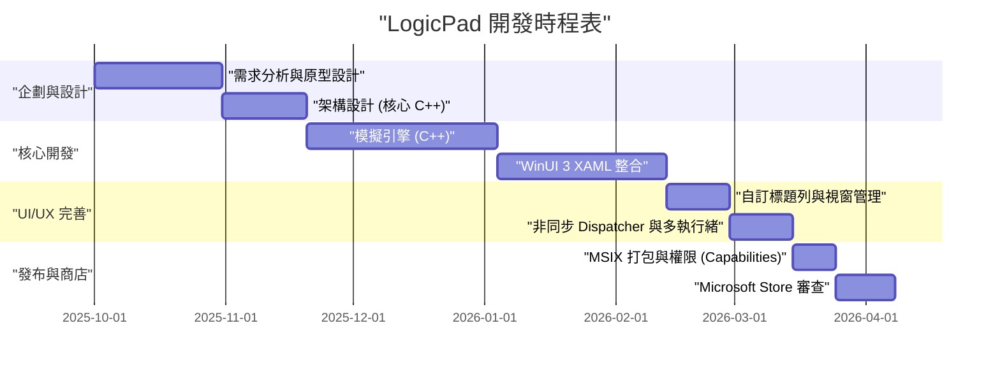
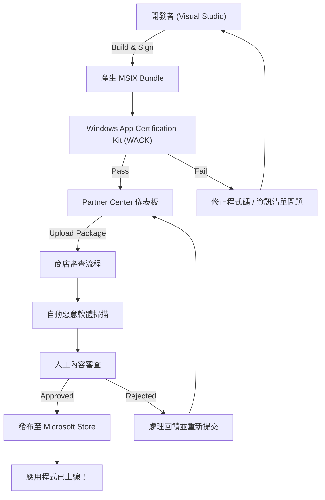

## 1. 前言：為什麼現在還要特地開發 Windows 原生應用程式？

在現代應用程式開發中，Electron、Tauri、React Native 等跨平台技術無疑已經成為主流。使用網頁技術「寫一次，到處執行 (Write Once, Run Anywhere)」的方法，從開發速度和可維護性的角度來看非常合理。然而，我卻選擇了另一條路，將「LogicPad」這個應用程式，開發成完全針對 Windows 最佳化的原生應用程式。

LogicPad 是一款針對硬體工程師和邏輯電路學習者的數位邏輯電路模擬器兼文字編輯器。它需要即時模擬數萬個邏輯閘，並同時無延遲地渲染複雜的波形資料。在這種要求極限效能的領域中，垃圾回收 (Garbage Collection) 所造成的數毫秒暫停 (Micro-stutter) 以及 Web View 的渲染開銷，都會導致使用者體驗受到致命的影響。

在本文中，我將以非常詳細的技術解說，回顧 LogicPad 從開發構想，到使用 C++ 和 WinUI 3 (Windows App SDK) 進行實作、突破特有的技術瓶頸、MSIX 打包，最後透過 Microsoft Store 向全世界發布的整個軌跡。希望透過分享個人開發者如何打造出企業級品質的原生 Windows 應用程式的過程，能為同樣挑戰原生開發的人們提供指引。

## 2. 專案時程表

LogicPad 的開發是利用週末和夜間時間進行的個人專案。整體時程約長達半年 (6個月)。以下是顯示該專案進度的 Gantt 圖。



如您所見，大部分的開發時間都花在核心引擎的最佳化，以及 WinUI 3 與 C++ 之間的非同步處理整合。雖然原生開發與跨平台開發相比，初期的設定和學習成本較高，但這項投資最終確實能以效能的形式回收。

## 3. 技術選型：C++ / WinUI 3 / Windows App SDK 的深淵

在開發 LogicPad 時，技術堆疊的選擇是最重要的決定之一。歷史上，Windows 平台的原生 UI 框架有 Win32 API (User32/GDI)、MFC、Windows Forms、WPF、UWP 等各種選項。目前，Microsoft 推薦用於現代 Windows 桌面應用程式開發的，是包含在 **Windows App SDK** 中的 **WinUI 3**。

### 3.1. Windows App SDK 與 WinUI 3 的架構
Windows App SDK 是一組函式庫，旨在提供不依賴於作業系統版本的最新 Windows API。傳統的 UWP (Universal Windows Platform) 與作業系統更新緊密結合，而 Windows App SDK 則是與應用程式一起發布，因此可以保證從 Windows 10 (版本 1809 起) 到 Windows 11 的運作一致性。

WinUI 3 是在此 Windows App SDK 上執行的原生 UI 框架，完全支援 Fluent Design System。WinUI 3 的內部是由 C++ 和 DirectX 建構的，運作速度非常快。

### 3.2. 為什麼不選 C#，而特地選擇 C++ (C++/WinRT)？
WinUI 3 的開發語言支援 C# 和 C++。如果使用 C# 和 .NET，開發效率會呈飛躍性提升，但在 LogicPad 中，由於以下原因，我採用了 **C++/WinRT**。

1. **確定性記憶體管理**：因為沒有垃圾回收器 (GC)，所以能完全控制記憶體配置和釋放的時機。這可以防止在模擬迴圈中發生 GC 暫停。
2. **SIMD 與快取最佳化**：在 C++ 中可以嚴格定義記憶體的實體佈局 (如 Struct of Arrays 等)，從而將 CPU 快取的命中率最大化。
3. **原生 ABI 邊界**：C++/WinRT 是 COM (Component Object Model) 的現代 C++ 投影 (Projection)。可以直接呼叫作業系統的原生 API，而沒有像 C# P/Invoke 那樣的開銷。

C++/WinRT 的底層存在著 COM。所有的 WinRT 物件本質上都是實作了 `IUnknown` 介面的 COM 物件，C++/WinRT 的 `winrt::com_ptr` 等智慧指標會自動管理參考計數 (`AddRef` / `Release`)。

## 4. WinUI 3 開發中最大的障礙與突破口

使用 C++/WinRT 開發 WinUI 3 雖然強大，但同時也伴隨著特有的複雜性。在此，我將詳細解說在開發 LogicPad 時，特別令人苦惱的 2 個重大技術挑戰及其解決方案。

### 4.1. C++ 中非同步 UI 更新的恐懼與協程 (Coroutines)

現代 UI 應用程式的鐵律是「絕對不能阻塞 UI 執行緒」。在 LogicPad 中，必須在背景執行緒中執行龐大電路的模擬計算，並將結果反映在 UI 執行緒上。

如果是 C#，可以使用 `async/await` 和 `DispatcherQueue` 相對容易地撰寫，但在 C++ 中，則是結合 C++20 的協程 (Coroutines) 與 `winrt::apartment_context` 來實現。理解 COM 的 Apartment 模型 (STA: Single-Threaded Apartment 與 MTA: Multi-Threaded Apartment) 是不可或缺的。

以下程式碼是從 LogicPad 實際的程式碼庫中擷取的模式，示範如何無縫地在背景進行計算並返回 UI 執行緒。

```cpp
#include <winrt/Windows.Foundation.h>
#include <winrt/Microsoft.UI.Dispatching.h>
#include <winrt/Microsoft.UI.Xaml.h>

using namespace winrt;
using namespace Microsoft::UI::Xaml;
using namespace Microsoft::UI::Dispatching;

// 按鈕點擊的事件處理常式
winrt::fire_and_forget MainWindow::OnRunSimulationClicked(
    IInspectable const& /* sender */, 
    RoutedEventArgs const& /* args */)
{
    // 捕捉目前 UI 執行緒的 Apartment 上下文 (STA)
    winrt::apartment_context ui_thread;

    try 
    {
        // 更新 UI 狀態 (這裡在 UI 執行緒中執行)
        StatusTextBlock().Text(L"模擬執行中...");
        ProgressBar().IsIndeterminate(true);

        // 將上下文轉移至執行緒池 (MTA)
        co_await winrt::resume_background();

        // 非常繁重的模擬處理 (在背景執行緒中執行)
        // 在這期間，UI 執行緒被釋放，可防止應用程式凍結
        std::vector<LogicResult> results = CoreEngine::RunMassiveSimulation();
        
        // 將模擬結果格式化為字串 (繼續在背景執行)
        winrt::hstring outputText = FormatResults(results);

        // 將上下文返回 UI 執行緒
        co_await ui_thread;

        // 之後都在 UI 執行緒中執行，因此可以安全地存取 XAML 的控制項
        ResultTextBlock().Text(outputText);
        ProgressBar().IsIndeterminate(false);
        StatusTextBlock().Text(L"已完成");
    }
    catch (winrt::hresult_error const& ex)
    {
        // 發生例外時也返回 UI 執行緒以顯示錯誤訊息
        co_await ui_thread;
        StatusTextBlock().Text(L"錯誤: " + ex.message());
        ProgressBar().IsIndeterminate(false);
    }
}
```

這個 `winrt::apartment_context` 的行為看起來像魔法一樣，但在內部，它利用 `IContextCallback` 介面記住原始的執行緒上下文，並在 `co_await` 時對該上下文進行處理的派發 (Enqueue)，這運用了進階的 C++ 機制。因此，即使是非同步處理，也能以看似程序性 (Procedural) 的程式碼來撰寫，而不會陷入回呼地獄 (Callback Hell)。

### 4.2. 完全實作自訂標題列

在 Windows 11 時代的應用程式中，將索引標籤或搜尋方塊配置在視窗標題列 (Caption 區域) 的「自訂標題列」，是現代 UX 的必備要求。然而，在 WinUI 3 中自訂標題列，如果只是改變顏色那很簡單，但如果要滿足「將用戶端區域擴展至標題列，同時維持視窗的拖曳移動和 Snap Layouts (將視窗靠向螢幕邊緣時的自動調整大小)」這項要求，難度就會瞬間飆升。

在 LogicPad 中，我使用了 `ExtendsContentIntoTitleBar` API，以自家的 XAML 元素建構了標題列。以下程式碼是利用 Windows App SDK 的 `AppWindow` 類別來自訂標題列的步驟。

```cpp
#include <winrt/Microsoft.UI.Windowing.h>
#include <winrt/Microsoft.UI.Interop.h>
#include <microsoft.ui.interop.h> // 為了使用 GetWindowIdFromWindow

void MainWindow::InitializeCustomTitleBar()
{
    // 取得目前視窗的 HWND (視窗控制代碼)
    auto windowNative = this->try_as<::IWindowNative>();
    HWND hwnd{ nullptr };
    windowNative->get_WindowHandle(&hwnd);

    // 將 HWND 轉換為 WindowId，並取得 AppWindow 實例
    winrt::Microsoft::UI::WindowId windowId = 
        winrt::Microsoft::UI::GetWindowIdFromWindow(hwnd);
    auto appWindow = winrt::Microsoft::UI::Windowing::AppWindow::GetFromWindowId(windowId);

    // 檢查作業系統版本是否支援自訂
    if (winrt::Microsoft::UI::Windowing::AppWindowTitleBar::IsCustomizationSupported())
    {
        auto titleBar = appWindow.TitleBar();
        
        // 將用戶端區域 (內容) 擴展至標題列
        titleBar.ExtendsContentIntoTitleBar(true);

        // 將預設標題列按鈕 (最小化、最大化、關閉) 的背景設為透明
        titleBar.ButtonBackgroundColor(winrt::Microsoft::UI::Colors::Transparent());
        titleBar.ButtonInactiveBackgroundColor(winrt::Microsoft::UI::Colors::Transparent());
        
        // 將在 XAML 端定義的 UI 元素 (AppTitleBar) 設定為拖曳區域
        // ※這部分的細節需要用 UI 執行緒的 Dispatcher 監聽 XAML 端的 UIElement，
        // 並呼叫 SetDragRectangles() 將可拖曳區域告訴作業系統。
    }
}
```

這個實作中最大的陷阱是，每次 XAML 端的 UI 元素大小改變時 (例如調整視窗大小時)，都必須使用 `InputNonClientPointerSource` 或 `SetDragRectangles` 向作業系統重新計算並通知「這裡是可拖曳的區域」的命中測試 (Hit-test) 區域。如果忽略這點，就會產生拖曳標題列但視窗不會移動，或者明明想點擊按鈕卻被判定為拖曳視窗的 Bug。

## 5. MSIX 打包的深淵與 AppXManifest

為了發布開發完成的 LogicPad，必須建立安裝程式。我沒有採用傳統的 MSI 或 EXE 安裝程式，而是採用了現代的 **MSIX** 格式。MSIX 的安裝和解除安裝非常乾淨 (不會弄髒登錄檔)，而且具備自動更新功能，對使用者來說非常安全且舒適。

然而，在將使用 C++ 撰寫的原生應用程式以 MSIX 打包時，最需要注意的是 `Package.appxmanifest` (資訊清清單檔案) 的設定。

LogicPad 需要讀寫儲存在本機檔案系統 (如使用者的文件資料夾等) 中的巨大專案檔案。在標準的 UWP 沙箱環境中，只能存取應用程式本身被隔離的資料資料夾 (AppContainer)。為了獲得作為原生桌面應用程式的完整存取權限，必須在資訊清單中宣告 `runFullTrust` 功能。

```xml
<?xml version="1.0" encoding="utf-8"?>
<Package
  xmlns="http://schemas.microsoft.com/appx/manifest/foundation/windows10"
  xmlns:uap="http://schemas.microsoft.com/appx/manifest/uap/windows10"
  xmlns:rescap="http://schemas.microsoft.com/appx/manifest/foundation/windows10/restrictedcapabilities"
  IgnorableNamespaces="uap rescap">

  <Identity
    Name="LogicPad.Studio"
    Publisher="CN=Kenji"
    Version="1.0.0.0" />

  <Properties>
    <DisplayName>LogicPad</DisplayName>
    <PublisherDisplayName>Kenji</PublisherDisplayName>
    <Logo>Assets\StoreLogo.png</Logo>
  </Properties>

  <Dependencies>
    <TargetDeviceFamily Name="Windows.Desktop" MinVersion="10.0.17763.0" MaxVersionTested="10.0.22621.0" />
  </Dependencies>

  <Capabilities>
    <!-- 一般的功能限制 -->
    <Capability Name="internetClient" />
    <!-- 作為原生桌面應用程式執行的受限功能 -->
    <rescap:Capability Name="runFullTrust" />
  </Capabilities>
</Package>
```

這個 `<rescap:Capability Name="runFullTrust" />` 被稱為「受限功能 (Restricted Capability)」，在向 Microsoft Store 提交時，必須提交理由書，向審查人員證明為何需要這個權限。我說明「本應用程式是為專業人士設計的工具，需要讀寫和匯出使用者本機磁碟上的任何邏輯電路專案檔案」，並順利獲得了批准。

## 6. 前往 Microsoft Store 的道路與審查流程

應用程式完成和 MSIX 套件建置結束後，終於要提交到 Microsoft Store 了。對於個人開發者來說，透過商店發布具有無法估量的優勢，包括自動派送更新、確保可靠性，以及可以使用支付系統。

向 Microsoft Store 提交的流程是透過 Partner Center (合作夥伴中心) 進行的。以下的流程圖顯示了從建置到發布的全貌。



### 6.1. WACK (Windows App Certification Kit) 的考驗
在上傳到 Partner Center 之前，務必在本地端執行 **WACK (Windows App Certification Kit)** 並通過事前測試。WACK 是一款自動測試工具，用於檢查應用程式是否會崩潰、是否呼叫了無效的 API，以及是否滿足效能要求。

對於 C++ 原生應用程式，特別需要注意的是「使用未支援的 API」錯誤。如果靜態連結了第三方的舊版 C++ 函式庫，其內部可能使用了已被棄用的 Win32 API，在 WACK 審查時就會被退回。為了避免這個問題，我將依賴的函式庫更新到最新版本，並將部分函式改寫為 Windows App SDK 提供的替代 API。

### 6.2. 審查與發布
在 Partner Center 的設定包含應用程式的定價、年齡分級 (IARC 評級)，以及輸入商店用的螢幕截圖和說明文字。因為 LogicPad 是技術工具，所以我立刻就取得了適合所有年齡的評級。

從提交套件到審查完成，大約花了 3 個工作天。在自動的惡意軟體掃描和功能檢查之後，Microsoft 的審查團隊會進行人工的動作確認。`runFullTrust` 的權限要求也順利通過，當狀態終於變成「已發布 (In the Store)」的那一刻，所獲得的成就感是無可取代的。

## 7. 作為商業的個人開發：效能與收益的數學模型

與其只是做個應用程式自我滿足，為了能持續更新 LogicPad 並將其作為一項事業來經營，必須同時定量地評估技術指標和商業指標。

### 7.1. C++ 帶來的記憶體使用量最佳化模型
LogicPad 最大的優勢在於，與基於 Electron 的編輯器 (例如：VSCode 等) 相比，它極其輕量。應用程式的記憶體佔用 (Memory Footprint) $M_{total}$ 可以模型化如下。

$$
M_{total} = M_{UI} + M_{engine} + M_{cache}
$$

在此，由 WinUI 3 原生渲染所產生的 $M_{UI}$，比起需要載入瀏覽器引擎的 Electron 要小得多 (大約在 50MB 左右)。
此外，C++ 引擎部分的記憶體 $M_{engine}$，相對於邏輯閘的數量 $N$，藉由最佳化結構體和排除指標，實現了線性擴展 (Linear Scaling)。

$$
M_{engine} = N \times \text{sizeof(LogicNode)}
$$

透過使用 C++ 的 `#pragma pack` 來最佳化結構體的對齊方式 (Alignment)，我們將每個節點的記憶體削減到了極限。

```cpp
#pragma pack(push, 1)
// 不持有虛擬函式表 (vtable)，透過打包將記憶體最小化
struct LogicNode {
    uint32_t id;         // 4 bytes
    uint16_t type;       // 2 bytes
    bool isActive;       // 1 byte
    // 結構體大小為 7 bytes (無對齊的填充 Padding)
};
#pragma pack(pop)
```

快取層的記憶體 $M_{cache}$ 因為要保留模擬的歷史紀錄，會與 $\mathcal{O}(N \log N)$ 成正比增加，但由於基礎的佔用量很小，即使是數萬個節點的電路，系統整體的 RAM 使用量也控制在 200MB 以下。

### 7.2. LTV 與 CAC：行銷的盤算
在個人開發的營利策略中，顧客終身價值 (LTV: Lifetime Value) 與顧客獲取成本 (CAC: Customer Acquisition Cost) 的平衡就是一切。LogicPad 沒有採用訂閱制，而是採用了買斷式的授權模型 (Freemium)。

LTV 的計算方式是，將未來購買升級版的機率，以折現率 $d$ 折現後的現在價值總和。若期間為 $T$，則可用以下公式表示。

$$
LTV = \sum_{t=1}^{T} \frac{ARPU_t \times Margin}{(1+d)^t}
$$

另一方面，CAC 則是將在 Twitter (現 X) 廣告或從部落格文章導入等所需的行銷總費用，除以新使用者數量。

$$
CAC = \frac{Total\ Marketing\ Spend}{Number\ of\ New\ Users}
$$

個人開發的優勢在於，可以將開發所需的人事費用視為「興趣時間」的沉沒成本 (Sunk Cost)，因此可以純粹只計算行銷成本來得出 CAC。目前，主要透過小眾技術社群的口碑帶來自然流量，在接近 $CAC \approx 0$ 的狀態下，實現了 $LTV > CAC$ 的健全單位經濟效益 (Unit Economics)。

## 8. 結語：樸實卻美麗的原生應用程式開發世界

回顧從 LogicPad 開發到在 Microsoft Store 發布的軌跡，與 C++/WinRT 艱澀的編譯錯誤搏鬥、追蹤 COM 參考計數 Bug 導致的記憶體洩漏，以及調查 MSIX 資訊清單的 XML 規格等，這絕非一條平坦的道路。

正因為網頁技術的進步讓我們來到了「什麼都可以用瀏覽器做」的時代，直接呼叫作業系統的 API，對記憶體的每個位元組、CPU 的每個時脈都錙銖必較的原生開發經驗，能夠壓倒性地提升身為工程師的基礎實力。

WinUI 3 和 Windows App SDK 目前仍在活躍開發中，是打造能最大限度發揮 Windows 11 UI 典範之美麗應用程式的最佳工具。衷心希望這篇部落格文章能對即將挑戰 Windows 原生應用程式開發的開發者有所幫助，並期望能在 Store 看到更多出色的應用程式上架。

開發還沒有結束。在 LogicPad 的下一個版本中，預定將整合利用 Direct2D 的自訂波形渲染引擎。在下一篇文章中，我計畫深入探討 DirectX 與 WinUI 3 的互操作性 (Interop) (活用 SwapChainPanel)。敬請期待。
