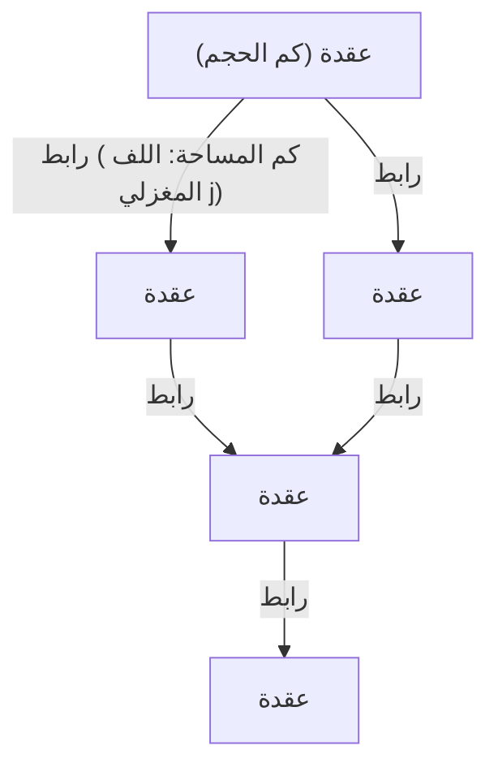
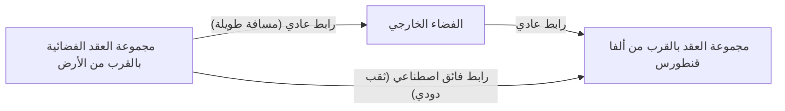

# مقدمة: نهاية وهم المتصل و"الفضاء المكمم"

في سعي البشرية لفهم بنية الكون، كنا دائمًا ننظر إلى "الفضاء" كمسرح لوجود المادة، أي كخلفية متصلة قابلة للتقسيم إلى ما لا نهاية. حتى بعد التحول النموذجي من المكان المطلق في ميكانيكا نيوتن إلى الزمكان الديناميكي والمنحني في النظرية النسبية العامة لأينشتاين، ظل الافتراض الضمني بأن "الزمكان متصل" قائمًا. ومع ذلك، في طليعة الفيزياء الحديثة، أصبح من الصعب الحفاظ على مفهوم المتصل هذا.

من بين المحاولات لتوحيد ميكانيكا الكم، التي تصف العالم المجهري، والنظرية النسبية العامة، التي تصف الجاذبية العيانية، ظهرت **نظرية الجاذبية الكمية الحلقية (Loop Quantum Gravity: LQG)** كأحد المرشحين البارزين. إن النظرة للعالم التي تقدمها هذه النظرية تقلب حدسنا رأسًا على عقب. فهي تقترح أن "الفضاء نفسه مكمم ويتكون من وحدات صغرى لا يمكن تقسيمها أكثر من ذلك".

إذا كان للفضاء بنية منفصلة مثل مكعبات الليغو، ألا يمكننا إعادة ترتيب هذه المكعبات و"تصميم" بنية جديدة؟ من هذا السؤال ينشأ الموضوع الرئيسي لهذا المقال: المفهوم الجديد كليًا لـ **"هندسة الحلقات (Loop Engineering)"**. في هذه المقالة، سنقوم بفك رموز المفاهيم الأساسية لنظرية الجاذبية الكمية الحلقية، وندرس بعمق من خلال قيود الفيزياء الحالية والفرضيات النظرية، الاختراقات التكنولوجية التي ستجلبها للبشرية إذا أصبح من الممكن مستقبلاً التلاعب ببنية الزمكان على مستوى مقياس بلانك.

---

# 1. البنية المعمارية الأساسية لنظرية الجاذبية الكمية الحلقية (LQG)

## 1.1 الصراع بين النظرية النسبية العامة وميكانيكا الكم، واستقلال الخلفية

من بين التفاعلات الأساسية الأربعة في الطبيعة، يتم وصف ثلاثة بالكامل في إطار ميكانيكا الكم وتم إكمالها في النموذج القياسي: القوة الكهرومغناطيسية، والقوة النووية القوية، والقوة النووية الضعيفة. ومع ذلك، استمرت الجاذبية وحدها في مقاومة التكميم بعناد. السبب الأساسي لذلك ينبع من حقيقة أن النظرية النسبية العامة هي نظرية "مستقلة عن الخلفية (Background Independent)".

تتكشف نظرية المجال الكمي الحالية على "زمكان خلفي ثابت" مثل زمكان مينكوفسكي المسطح. ولكن، في النظرية النسبية العامة، الزمكان نفسه هو متغير ديناميكي ينحني وفقًا لتوزيع المادة. بعبارة أخرى، تكميم الجاذبية يعني **تكميم الزمكان نفسه**. في حين تفترض نظرية الأوتار (String Theory) زمكانًا خلفيًا محددًا وتصف الجرافيتون كوتر ينتشر عليه، فإن الجاذبية الكمية الحلقية (LQG) تلتزم بصرامة باستقلالية الخلفية لأينشتاين وتتخذ نهج تكميم هندسة الزمكان ذاتها.

## 1.2 شبكة اللف المغزلي: "ذرات" الفضاء

في الجاذبية الكمية الحلقية، الأداة الرياضية لوصف بنية الفضاء هي **شبكة اللف المغزلي (Spin Network)**. وهو مفهوم ابتكره روجر بنروز في الأصل، ولكن تمت صياغته كحالة دقيقة في الجاذبية الكمية الحلقية بواسطة كارلو روفيلي ولي سمولين وآخرين.

يتم تصور شبكات اللف المغزلي على أنها بنية رسم بياني تتكون من عقد (نقاط) وروابط (خطوط).

- **العقدة (Node)**: تمثل العقد كم "حجم" الفضاء. تتوافق كل عقدة مع كتلة فضائية دقيقة بحجم مقياس بلانك (حوالي $10^{-99} \text{cm}^3$).
- **الرابط (Link)**: تمثل الروابط التي تصل العقد ببعضها البعض كم "المساحة" التي تتقاطع فيها كتل الفضاء المتجاورة. يتم تخصيص رقم نصف صحيح $j$ (اللف المغزلي) للرابط، والذي يحدد حجم المساحة. تُعطى القيمة الذاتية للمساحة بواسطة المعادلة $A \propto \ell_P^2 \sqrt{j(j+1)}$ (حيث $\ell_P$ هو طول بلانك).

وبالتالي، فإن الفضاء المتصل الذي ندركه، عند التكبير إلى مقاييس متناهية الصغر، يظهر كبنية شبكية معقدة تتشابك فيها عقد وروابط شبكة اللف المغزلي هذه. يُعاد تصور الفضاء على أنه ليس شيئًا "موجودًا"، بل شيئًا "ينبثق" من العلاقات (الروابط) بين العقد.

## 1.3 رغوة اللف المغزلي: تاريخ وتطور الزمكان

في حين أن شبكة اللف المغزلي تمثل بنية "الفضاء في لحظة معينة"، فإن ما يصف كيف تتغير هذه البنية بمرور الوقت يسمى **رغوة اللف المغزلي (Spin Foam)**.

على غرار تكامل المسار لفاينمان في ميكانيكا الكم، يتم حساب احتمال الانتقال من حالة شبكة لف مغزلي ابتدائية معينة إلى حالة نهائية كمجموع كل رغوات اللف المغزلي الممكنة. تُتصور رغوة اللف المغزلي على أنها بنية شبكية عالية الأبعاد تشبه الرغوة، حيث ترسم العقد مسارًا عبر الزمن لتصبح "حواف"، وتصبح الروابط "وجوهًا". الزمكان هو ظاهرة تنبثق بشكل عياني كتراكب لهذه التفاعلات المعقدة لرغوة اللف المغزلي.

---

# 2. هندسة الحلقات: تصميم الفضاء والتلاعب به

إذا افترضنا أن الجاذبية الكمية الحلقية تصف الطبيعة بشكل صحيح، ففي المستقبل حيث يتقدم التكنولوجيا إلى أقصى حد، قد نكون قادرين على معالجة بنية شبكة اللف المغزلي هذه بشكل مصطنع. هذا هو ما يسمى "هندسة الحلقات".

بعد تقنية النانو التي تتلاعب بالذرات، والهندسة النووية التي تتلاعب بالنوى الذرية، ستكون هذه ولادة **هندسة الهندسة (Geometry Engineering)**، التي تتلاعب مباشرة بـ "هندسة مقياس بلانك" التي تمثل أصغر وحدة في الفضاء.

## 2.1 التحرير المباشر لطوبولوجيا الفضاء

تقتصر التكنولوجيا الحديثة على تحريك المادة والطاقة وتشويشها داخل الفضاء. ولكن في هندسة الحلقات، ستصبح عمليات قطع روابط شبكة اللف المغزلي وإعادة توصيلها بعقد أخرى ممكنة. رياضياً، هذا يعني تغيير طوبولوجيا (البنية الطوبولوجية) للفضاء محلياً.

### البناء الاصطناعي للثقوب الدودية
الثقب الدودي، الذي يعد من الكلاسيكيات في الخيال العلمي، يمكن أن يوجد كحل (جسر أينشتاين-روزين) في النظرية النسبية العامة، ولكن للحفاظ عليه يُعتقد أنه يحتاج إلى مادة غريبة ذات "طاقة سلبية"، مما يجعل إمكانية تحقيقه منخفضة للغاية.

ولكن، إذا أصبح التلاعب بمقياس بلانك ممكنًا، فقد نكون قادرين على توليد ثقوب دودية دقيقة من خلال إعادة كتابة بنية شبكة اللف المغزلي مباشرة دون الاعتماد على طاقة سلبية عيانية. إذا تم ربط عقد في منطقتين متباعدتين مباشرة بواسطة روابط، ستنشأ علاقة جوار جديدة هناك. إذا تمكنا من تنمية حزمة الروابط الدقيقة هذه إلى نطاق عياني (إحداث انتقال طوري ضخم في شبكة اللف المغزلي)، فقد نتمكن من بناء ثقب دودي قابل للعبور.

## 2.2 الاتصالات أسرع من الضوء (FTL) والتشابك الهندسي

إن المبدأ الأساسي في ميكانيكا الكم هو أنه لا يمكن استخدام التشابك الكمي لنقل المعلومات (لا يمكن تجاوز سرعة الضوء). ولكن، في سياق نظرية الجاذبية الكمية الحلقية والمبدأ الهولوغرافي، تم اقتراح حدسية ER=EPR (تكافؤ الثقوب الدودية والتشابك)، والتي تنص على أن "روابط الفضاء نفسها تنشأ بسبب التشابك الكمي".

إذا تمكنا من خلال هندسة الحلقات من بناء حالة تشابك قوية جدًا بشكل اصطناعي بين عقد معينة وتثبيتها، فقد يصبح من الممكن النقل المباشر للمعلومات متجاهلين مسافة الفضاء. هذا يعادل إنشاء "مسار مختصر" على شبكة اللف المغزلي، مما قد يحقق اتصالات ظاهرية أسرع من الضوء.

## 2.3 التحكم في الجاذبية و"كثافة" شبكة اللف المغزلي

تعلمنا النسبية أن وجود الكتلة يسبب انحناء الفضاء ويولد الجاذبية. ولكن من منظور الجاذبية الكمية الحلقية، تتفاعل الكتلة (مجال المادة) مع شبكة اللف المغزلي وتعمل كعامل يغير توزيع الروابط وكثافة العقد.

إذا كان من الممكن الإثارة المباشرة للحالة المحلية لشبكة اللف المغزلي واستقطاب كثافة العقد وطوبولوجيا الروابط باستخدام مجال كهرومغناطيسي أو نوع من مجال الطاقة العالية دون وسيط من المادة، فسيصبح من الممكن **توليد مجال جاذبية اصطناعي في مكان لا توجد فيه كتلة**.

- **مضاد الجاذبية (حجب الجاذبية)**: حجب تأثير الجاذبية بالكامل من خلال محاذاة روابط شبكة اللف المغزلي ونشر درع طوبولوجي متغير يمنع انتشار التشوه الهندسي من الخارج.
- **التنفيذ الحلقي لمحرك ألكوبيير**: تحقيق الدفع الالتوائي من خلال الانقباض المستمر للفضاء عبر زيادة كثافة عقد شبكة اللف المغزلي أمام سفينة الفضاء، وتقليل الكثافة لتوسيعه في الخلف.

---

# 3. الحدود الفيزيائية وشروط الاختراق

بالطبع، هناك عقبات هائلة تقف في طريق تحقيق هندسة الحلقات.

## 3.1 حاجز طاقة بلانك

أكبر عائق هو مقياس الطاقة. من أجل استكشاف ومعالجة بنية طول بلانك ($\sim 10^{-35}$ متر)، يتطلب مبدأ عدم اليقين طاقة بلانك ($\sim 10^{19}$ جيجا إلكترون فولت). هذا يعادل حوالي ألف تريليون ضعف أقصى طاقة لمصادم الهادرونات الكبير (LHC) الحالي في سيرن، وهي كمية من الطاقة لا يمكن الوصول إليها إلا من قبل حضارات من النوع الثاني إلى الثالث على مقياس كارداشيف.

ولكن، هناك أمل واحد يتمثل في الفرضية النظرية لـ **"التأثيرات الكمية العيانية للجاذبية"**.

## 3.2 استخدام التأثيرات الكمية العيانية للجاذبية

هذا هو نهج يستخدم الإثارة الجماعية للنظام بأكمله بدلاً من التلاعب الفردي بالتفاصيل الدقيقة لشبكة اللف المغزلي، تمامًا كما يمكننا التحكم في الأمواج من خلال ديناميكا الموائع دون معرفة سلوك جزيئات الماء الفردية.

على سبيل المثال، يمكن تصور تقنيات تستخدم حالات التماسك الكمي مثل تكاثف بوز-أينشتاين (BEC) في بيئات شديدة البرودة وعالية الكثافة لصدى تقلبات الزمكان على نطاق عياني. إذا كان هناك تأثير رنين غير خطي بين نمط نبضي كهرومغناطيسي معين ووضع إثارة شبكة اللف المغزلي، فقد يتبقى مجال لإنشاء "أنماط تداخل" في بنية الزمكان والتحكم في الطوبولوجيا بطاقة منخفضة نسبيًا دون الوصول إلى طاقة بلانك.

---

# الخاتمة: دليل لمهندسي المستقبل

إن "الفضاء المكمم" الذي تقدمه نظرية الجاذبية الكمية الحلقية لا يقتصر على كونه مجرد أداة نظرية لتوضيح أصل الكون أو تفردات الثقوب السوداء. إنه يحمل في طياته إمكانية أن يصبح "مواصفة" نهائية للبشرية في المستقبل البعيد لنشر التكنولوجيا بحرية متخذة من بنية الكون ذاتها لوحة رسم.

التحول النموذجي من هندسة المواد إلى هندسة الهندسة. إن ولادة "مهندسي الحلقات" الذين سينسجون عقد الفضاء، ويشكلون الزمن، ويبنون بنية تحتية جديدة تربط النجوم، سيمثل اللحظة التي تصبح فيها البشرية مشاركًا إبداعيًا في الكون بالمعنى الحقيقي. نحن نشهد الآن بناء النظرية الأساسية، وهي الخطوة الأولى في هذا المقياس اللامتناهي العظمة.
