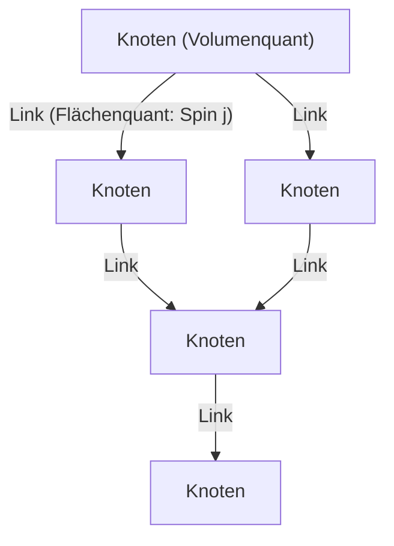
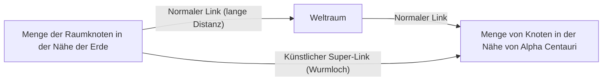

# Einleitung: Das Ende der Kontinuums-Illusion und der "quantisierte Raum"

In den Versuchen der Menschheit, die Struktur des Universums zu verstehen, haben wir den "Raum" stets als eine Bühne für die Existenz der Materie betrachtet – als einen unendlich teilbaren, kontinuierlichen Hintergrund. Selbst nach dem Paradigmenwechsel vom absoluten Raum der klassischen Newtonschen Mechanik zur dynamischen, gekrümmten Raumzeit von Einsteins allgemeiner Relativitätstheorie blieb die unausgesprochene Prämisse erhalten, dass "die Raumzeit kontinuierlich ist". An der vordersten Front der modernen Physik lässt sich dieses Konzept des Kontinuums jedoch nicht mehr aufrechterhalten.

Einer der führenden Kandidaten im Versuch, die Quantenmechanik, die die mikroskopische Welt beschreibt, und die allgemeine Relativitätstheorie, die die makroskopische Gravitation beschreibt, zu vereinen, ist die **Schleifenquantengravitation (Loop Quantum Gravity: LQG)**. Das Weltbild, das die LQG präsentiert, stellt unsere Intuition grundlegend auf den Kopf. Sie besagt, dass "der Raum selbst quantisiert ist und aus kleinsten, nicht weiter teilbaren Einheiten besteht".

Wenn der Raum wie Legobausteine eine diskrete Struktur hat, können wir diese Bausteine dann neu anordnen und neue Strukturen "entwerfen"? Aus dieser Frage entsteht das Hauptthema dieses Artikels: das völlig neue Konzept des **"Loop-Engineerings" (Schleifentechnik)**. In diesem Artikel werden wir die grundlegenden Konzepte der LQG aufschlüsseln und tiefgreifend untersuchen – unter Einbeziehung der aktuellen Grenzen der Physik und theoretischer Hypothesen –, welche Durchbrüche für die menschliche Technologie entstehen könnten, falls in Zukunft eine Manipulation der Raumzeitstruktur auf der Skala der Planck-Länge möglich werden sollte.

---

# 1. Die grundlegende Architektur der Schleifenquantengravitation (LQG)

## 1.1 Der Konflikt zwischen allgemeiner Relativitätstheorie und Quantenmechanik und die Hintergrundunabhängigkeit

Von den vier fundamentalen Wechselwirkungen in der Natur werden drei – die elektromagnetische Kraft, die starke Kernkraft und die schwache Kernkraft – vollständig im Rahmen der Quantenmechanik beschrieben und sind im Standardmodell zusammengefasst. Die Gravitation weigerte sich jedoch beharrlich, sich quantisieren zu lassen. Der grundlegende Grund dafür liegt in der Tatsache, dass die allgemeine Relativitätstheorie eine "hintergrundunabhängige" (Background Independent) Theorie ist.

Die bestehende Quantenfeldtheorie entfaltet sich auf einer "festen Hintergrundraumzeit", wie der flachen Minkowski-Raumzeit. In der allgemeinen Relativitätstheorie ist jedoch die Raumzeit selbst eine dynamische Variable und wird durch die Verteilung der Materie gekrümmt. Die Quantisierung der Gravitation bedeutet also, **die Raumzeit selbst zu quantisieren**. Während die Stringtheorie (String Theory) eine bestimmte Hintergrundraumzeit annimmt und das Graviton als einen String beschreibt, der sich darauf ausbreitet, hält sich die LQG strikt an Einsteins Hintergrundunabhängigkeit und verfolgt den Ansatz, die Geometrie der Raumzeit selbst zu quantisieren.

## 1.2 Spin-Netzwerke: Die "Atome" des Raumes

Das mathematische Werkzeug, das die Struktur des Raumes in der LQG beschreibt, ist das **Spin-Netzwerk (Spin Network)**. Ursprünglich von Roger Penrose erdacht, wurde es von Carlo Rovelli und Lee Smolin als strenger Zustand der LQG formuliert.

Ein Spin-Netzwerk wird als Graphenstruktur aus Knoten (Punkten) und Links (Linien) visualisiert.

- **Knoten (Node)**: Ein Knoten repräsentiert ein "Volumen"-Quant des Raumes. Jeder Knoten entspricht einem winzigen Raumblock auf der Skala des Planck-Volumens (etwa $10^{-99} \text{cm}^3$).
- **Link (Link)**: Die Links, die Knoten verbinden, repräsentieren ein Quant der "Fläche", wo sich benachbarte Raumblöcke schneiden. Jedem Link wird ein halbzahliger Wert $j$ (Spin) zugeordnet, der die Größe der Fläche bestimmt. Der Eigenwert der Fläche ist durch $A \propto \ell_P^2 \sqrt{j(j+1)}$ gegeben ($\ell_P$ ist die Planck-Länge).

Das bedeutet, dass der kontinuierliche Raum, wie wir ihn wahrnehmen, beim Hineinzoomen auf eine mikroskopische Skala als eine komplexe Netzwerkstruktur aus Knoten und Links dieses Spin-Netzwerks erscheint. Der Raum wird nicht länger als etwas betrachtet, das einfach "existiert", sondern als etwas, das durch die Beziehungen (Links) zwischen den Knoten "emergiert".

## 1.3 Spin-Schaum: Die Geschichte und Entwicklung der Raumzeit

Während das Spin-Netzwerk die Struktur des "Raumes in einem bestimmten Moment" darstellt, beschreibt der **Spin-Schaum (Spin Foam)**, wie sich dieser im Laufe der Zeit verändert.

Ähnlich wie bei Feynmans Pfadintegral in der Quantenmechanik wird die Übergangswahrscheinlichkeit von einem anfänglichen Spin-Netzwerk-Zustand zu einem Endzustand als Summe aller möglichen Spin-Schäume berechnet. Ein Spin-Schaum lässt sich als schaumartige, höherdimensionale Netzwerkstruktur vorstellen, in der Knoten Pfade in der Zeitrichtung zeichnen und zu "Kanten" werden, während Links zu "Flächen" werden. Die Raumzeit ist ein Phänomen, das makroskopisch als Überlagerung komplexer Wechselwirkungen dieser Spin-Schäume emergiert.

---

# 2. Loop-Engineering: Das Entwerfen und Manipulieren des Raumes

Nimmt man an, dass die LQG die Natur korrekt beschreibt, so könnte es in einer Zukunft, in der die Technologie bis an ihre Grenzen fortgeschritten ist, möglich werden, die Struktur dieses Spin-Netzwerks künstlich zu manipulieren. Das ist das "Loop-Engineering".

Nach der Nanotechnologie, die Atome manipuliert, und der Kerntechnik, die Atomkerne manipuliert, wäre dies die Geburtsstunde des **Geometry Engineerings (Geometrietechnik)**, das die "Geometrie der Planck-Skala", die kleinste Einheit des Raumes, direkt manipuliert.

## 2.1 Direkte Bearbeitung der Raumtopologie

Moderne Technologien sind darauf beschränkt, Materie und Energie im Raum zu bewegen und zu transformieren. Beim Loop-Engineering wird es jedoch möglich, Links des Spin-Netzwerks zu durchtrennen und mit anderen Knoten neu zu verbinden. Mathematisch bedeutet dies, die Topologie (topologische Struktur) des Raumes lokal zu verändern.

### Künstliche Erschaffung von Wurmlöchern
Wurmlöcher, ein Grundnahrungsmittel der Science-Fiction, könnten als Lösungen der allgemeinen Relativitätstheorie (Einstein-Rosen-Brücken) existieren. Um sie aufrechtzuerhalten, wäre jedoch exotische Materie mit "negativer Energie" erforderlich, weshalb ihre Realisierbarkeit als äußerst gering eingeschätzt wurde.

Wenn jedoch Manipulationen auf der Planck-Skala möglich werden, könnten winzige Wurmlöcher erzeugt werden, indem man die Struktur des Spin-Netzwerks direkt umschreibt, ohne auf makroskopische negative Energie angewiesen zu sein. Wenn Knoten in zwei weit entfernten Regionen direkt durch einen Link verbunden werden, entsteht dort eine neue Nachbarschaftsbeziehung. Wenn dieses Bündel winziger Links auf eine makroskopische Skala anwachsen kann (was einen gigantischen Phasenübergang des Spin-Netzwerks auslösen würde), könnte vielleicht ein passierbares (durchquerbares) Wurmloch konstruiert werden.

## 2.2 Überlichtschnelle Kommunikation (FTL) und geometrische Verschränkung

Ein Grundprinzip der Quantenmechanik ist, dass Quantenverschränkung (Quantum Entanglement) nicht zur Informationsübertragung genutzt werden kann (sie kann die Lichtgeschwindigkeit nicht überschreiten). Im Kontext der Schleifenquantengravitation und des holografischen Prinzips wurde jedoch die ER=EPR-Vermutung (Äquivalenz von Wurmlöchern und Verschränkung) vorgeschlagen, die besagt, dass "die räumlichen Verbindungen (Links) selbst durch Quantenverschränkung entstehen".

Wenn das Loop-Engineering extrem starke Verschränkungszustände zwischen bestimmten Knoten künstlich erzeugen und stabilisieren kann, könnte die direkte Übertragung von Informationen unter Missachtung räumlicher Entfernungen möglich werden. Dies entspräche der Erstellung einer "Abkürzung" auf dem Spin-Netzwerk und könnte scheinbar überlichtschnelle Kommunikation (Faster-Than-Light Communication) ermöglichen.

## 2.3 Gravitationskontrolle und die "Dichte" des Spin-Netzwerks

Die Lehre der Relativitätstheorie besagt, dass die Anwesenheit von Masse den Raum krümmt und Gravitation erzeugt. Aus der Perspektive der LQG interagiert Masse (Materiefelder) mit dem Spin-Netzwerk und fungiert als Faktor, der die Verteilung seiner Links und die Dichte seiner Knoten verändert.

Wenn es gelingt, lokale Zustände des Spin-Netzwerks direkt anzuregen und die Knotendichte oder Linktopologie mittels elektromagnetischer Felder oder irgendeines Hochenergiefeldes zu verzerren, ohne Materie als Vermittler zu nutzen, wird es möglich, **ein künstliches Gravitationsfeld an Orten zu erzeugen, an denen keine Masse existiert**.

- **Antigravitation (Gravitationsabschirmung)**: Das Ausrichten von Links des Spin-Netzwerks und das Entfalten eines variablen topologischen Schildes, das die Ausbreitung von geometrischen Verzerrungen von außen verhindert und so die Auswirkungen der Schwerkraft vollständig blockiert.
- **Schleifenbasierte Realisierung des Alcubierre-Antriebs**: Den Warp-Antrieb zu realisieren, indem man die Dichte der Knoten des Spin-Netzwerks vor einem Raumschiff kontinuierlich erhöht, um den Raum zu kontrahieren, und die Dichte dahinter verringert, um ihn zu expandieren.

---

# 3. Physikalische Grenzen und Bedingungen für einen Durchbruch

Natürlich stehen der Realisierung des Loop-Engineerings gewaltige Hindernisse im Weg.

## 3.1 Die Mauer der Planck-Energie

Das größte Hindernis ist die Energieskala. Um Strukturen auf der Planck-Länge ($\sim 10^{-35}$ Meter) zu erforschen und zu manipulieren, sind aufgrund der Unschärferelation Planck-Energien ($\sim 10^{19}$ GeV) erforderlich. Dies ist etwa eine Billiarde mal die maximale Energie des heutigen Large Hadron Collider (LHC) am CERN – eine Energiemenge, die nur für Zivilisationen vom Typ II bis III auf der Kardaschow-Skala erreichbar ist.

Ein Hoffnungsschimmer ist jedoch die theoretische Hypothese des **"makroskopischen Quantengravitationseffekts"**.

## 3.2 Nutzung des makroskopischen Quantengravitationseffekts

Ähnlich wie man Wellen mithilfe der Fluiddynamik kontrollieren kann, ohne das Verhalten einzelner Wassermoleküle zu kennen, nutzt dieser Ansatz kollektive Anregungen (Collective Excitations) des gesamten Systems anstelle der individuellen Manipulation mikroskopischer Details des Spin-Netzwerks.

Denkbar wäre beispielsweise eine Technologie, die quantenkohärente Zustände wie das Bose-Einstein-Kondensat (BEC) in extrem kalten, hochdichten Umgebungen nutzt, um Raumzeitfluktuationen auf makroskopischer Ebene in Resonanz zu bringen. Sollten nichtlineare Resonanzeffekte zwischen bestimmten elektromagnetischen Pulsmustern und den Anregungsmoden des Spin-Netzwerks existieren, bestünde die Möglichkeit, Raumzeitstrukturen bei relativ geringen Energien zu "interferieren" und die Topologie zu kontrollieren, auch ohne die Planck-Energie zu erreichen.

---

# Fazit: Ein Wegweiser für die Ingenieure der Zukunft

Der "quantisierte Raum", den die Schleifenquantengravitationstheorie vorschlägt, ist nicht nur ein theoretisches Werkzeug, um den Ursprung des Universums oder die Singularitäten von Schwarzen Löchern zu entschlüsseln. Er birgt das Potenzial, zur ultimativen "Spezifikation" zu werden, damit die Menschheit in ferner Zukunft die Struktur des Universums selbst als Leinwand für technologische Entfaltungen nutzen kann.

Ein Paradigmenwechsel von der Materialtechnik zur Geometrietechnik. Die Geburt von "Loop-Ingenieuren", die die Knoten des Raumes verweben, die Zeit formen und eine neue Infrastruktur bauen, die die Sterne verbindet, markiert den Moment, in dem die Menschheit im wahrsten Sinne des Wortes zu einem kreativen Teilnehmer des Universums wird. Wir sind heute Zeugen des ersten, unvorstellbar gewaltigen Schrittes: der Konstruktion der grundlegenden Theorie.
