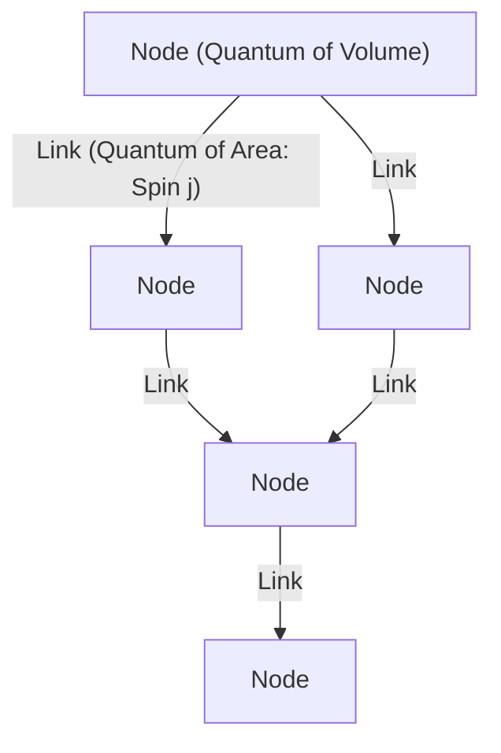
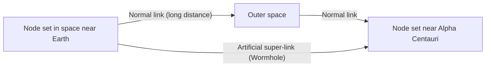

# Introduction: The End of the Continuum Illusion and "Quantized Space"

In humanity's attempt to understand the structure of the universe, we have always viewed "space" as a stage for matter to exist, that is, as an infinitely divisible continuous background. Even after the paradigm shift from absolute space in Newtonian mechanics to a dynamic and curved spacetime in Einstein's general theory of relativity, the implicit assumption that "spacetime is continuous" was maintained. However, at the forefront of modern physics, this concept of a continuum can no longer be maintained.

One of the leading candidates born out of the attempt to integrate quantum mechanics, which describes the microscopic world, and general relativity, which describes macroscopic gravity, is **Loop Quantum Gravity (LQG)**. The worldview presented by LQG fundamentally overturns our intuition. It posits that "space itself is quantized and consists of minimum units that cannot be further divided."

If space has a discrete structure like Lego blocks, could we rearrange those blocks and "design" new structures? The subject of this article, a completely new concept called **"Loop Engineering"**, is born from this question. In this article, while unraveling the basic concepts of LQG, we will deeply consider what breakthroughs will be brought to human technology if the manipulation of spacetime structure at the Planck length scale becomes possible in the future, interspersed with the limits of current physics and theoretical hypotheses.

---

# 1. Basic Architecture of Loop Quantum Gravity (LQG)

## 1.1 The Conflict between General Relativity and Quantum Mechanics, and Background Independence

Of the four fundamental interactions in nature, three—electromagnetic force, strong force, and weak force—are fully described within the framework of quantum mechanics and completed as the Standard Model. However, gravity alone has stubbornly resisted quantization. The fundamental reason is that general relativity is a "Background Independent" theory.

Existing quantum field theories are developed on a "fixed background spacetime" such as a flat Minkowski spacetime. However, in general relativity, spacetime itself is a dynamical variable that curves depending on the distribution of matter. In other words, quantizing gravity means **quantizing spacetime itself**. While String Theory assumes a specific background spacetime and takes the approach of describing gravitons as strings propagating on it, LQG strictly adheres to Einstein's background independence and takes the approach of quantizing the geometry of spacetime itself.

## 1.2 Spin Networks: "Atoms" of Space

The mathematical tool that describes the structure of space in LQG is the **Spin Network**. Originally a concept devised by Roger Penrose, it was formulated as a rigorous state of LQG by Carlo Rovelli, Lee Smolin, and others.

A spin network is visualized as a graph structure consisting of nodes (points) and links (lines).

- **Node**: A node represents a quantum of "volume" of space. Each node corresponds to a microscopic chunk of space at the Planck volume scale (about $10^{-99} \text{cm}^3$).
- **Link**: A link connecting nodes represents a quantum of "area" where adjacent chunks of space intersect. A half-integer $j$ (spin) is assigned to the link, and this determines the size of the area. The eigenvalue of the area is given by $A \propto \ell_P^2 \sqrt{j(j+1)}$ (where $\ell_P$ is the Planck length).

In other words, the continuous space we perceive, when zoomed in to the microscopic scale, appears as a network structure where nodes and links of this spin network are intricately intertwined. Space is re-understood not as something that "exists", but as something that "emerges" through the relationships (links) between nodes.

## 1.3 Spin Foams: History and Evolution of Spacetime

While a spin network represents the structure of "space at a certain moment", a **Spin Foam** describes how it changes over time.

Like Feynman's path integral in quantum mechanics, the transition probability from a certain initial spin network state to a final state is calculated as the sum of all possible spin foams. A spin foam is imagined as a higher-dimensional network structure like foam, where nodes draw trajectories in the time direction to become "edges", and links become "faces". Spacetime is a phenomenon that macroscopically emerges as a superposition of these complex spin foam interactions.

---

# 2. Loop Engineering: Design and Manipulation of Space

Assuming LQG correctly describes nature, in a future where technology has advanced to its limits, we may be able to artificially manipulate the structure of this spin network. This is "Loop Engineering".

Following nanotechnology, which manipulates atoms, and nuclear engineering, which manipulates atomic nuclei, this is the birth of **Geometry Engineering**, which directly manipulates "Planck-scale geometry", the smallest unit of space.

## 2.1 Direct Editing of Spatial Topology

Modern technology is limited to moving and deforming matter and energy within space. However, in loop engineering, it becomes possible to cut the links of a spin network and reconnect them to other nodes. Mathematically, this means locally changing the topology of space.

### Artificial Construction of Wormholes
Wormholes, a staple of sci-fi, can exist as solutions to general relativity (Einstein-Rosen bridges), but maintaining them has been thought to require exotic matter with "negative energy", making their feasibility extremely low.

However, if Planck-scale manipulation becomes possible, it may be possible to generate microscopic wormholes by directly rewriting the structure of the spin network without relying on macroscopic negative energy. If nodes in two distant regions are directly connected by a link, a new proximity relationship is created there. If this bundle of microscopic links can be grown to a macroscopic scale (inducing a giant phase transition of the spin network), it might be possible to construct traversable wormholes.

## 2.2 Faster-Than-Light (FTL) Communication and Geometric Entanglement

It is a fundamental principle of quantum mechanics that quantum entanglement cannot be used for information transfer (cannot exceed the speed of light). However, in the context of loop quantum gravity and the holographic principle, the ER=EPR conjecture (the equivalence of wormholes and entanglement), which suggests that "spatial connections (links) themselves are generated by quantum entanglement," has been proposed.

If loop engineering could artificially construct extremely strong entanglement states between specific nodes and stabilize them, it might be possible to directly transcribe information ignoring spatial distance. This is equivalent to creating a "shortcut path" on the spin network, potentially realizing apparent Faster-Than-Light communication.

## 2.3 Gravity Control and Spin Network "Density"

According to relativity, the presence of mass curves space and generates gravity. From the perspective of LQG, however, mass (matter fields) interacts with the spin network and acts as a factor that changes the distribution of its links and the density of its nodes.

If it were possible to directly excite the local state of the spin network using electromagnetic fields or some kind of high-energy field without the mediation of matter, biasing the density of nodes and the topology of links, it would become possible to **generate artificial gravitational fields in places where no mass exists**.

- **Anti-gravity (Gravity Shielding)**: Completely shielding the influence of gravity by aligning the links of the spin network and deploying a variable topology shield that prevents the propagation of geometric distortion from the outside.
- **Loop Realization of the Alcubierre Drive**: Realizing warp navigation by continuously performing operations that increase the node density of the spin network in front of a spaceship to contract space, and decrease the density behind to expand it.

---

# 3. Physical Limits and Conditions for Breakthroughs

Of course, tremendous walls stand in the way of realizing loop engineering.

## 3.1 The Planck Energy Barrier

The biggest barrier is the energy scale. In order to probe and manipulate structures at the Planck length ($\sim 10^{-35}$ meters), the uncertainty principle dictates that Planck energy ($\sim 10^{19}$ GeV) is required. This is about one quadrillion times the maximum energy of the current Large Hadron Collider (LHC) at CERN, an amount of energy unreachable unless by a Type II to III civilization on the Kardashev scale.

However, a ray of hope here is the theoretical hypothesis of **"Macroscopic Quantum Gravity Effects"**.

## 3.2 Utilizing Macroscopic Quantum Gravity Effects

Just as fluid dynamics allows us to control waves without knowing the behavior of individual water molecules, this is an approach that utilizes the collective excitation of the entire system rather than individually manipulating the microscopic details of the spin network.

For example, a technology that resonates spacetime fluctuations on a macroscopic scale using a quantum coherent state like a Bose-Einstein Condensate (BEC) in an ultra-low temperature, high-density environment could be considered. If there is a nonlinear resonance effect between the pulse pattern of specific electromagnetic waves and the excitation modes of the spin network, there is room left to control the topology by creating "interference fringes" in the structure of spacetime at relatively low energy, even without reaching Planck energy.

---

# Conclusion: A Guidepost for Future Engineers

The "quantized space" presented by Loop Quantum Gravity is not just a theoretical tool to elucidate the origin of the universe or the singularities of black holes. It holds the potential to become the ultimate "specification document" for humanity to freely develop technology using the structure of the universe itself as a canvas in the distant future.

The paradigm shift from materials engineering to geometry engineering. The birth of "loop engineers" who build a new infrastructure that weaves spatial nodes, shapes time, and connects stars signifies the moment when humanity truly becomes a creative participant in the universe. We are now witnessing the construction of fundamental theories, the first step on a scale that is endlessly magnificent.
