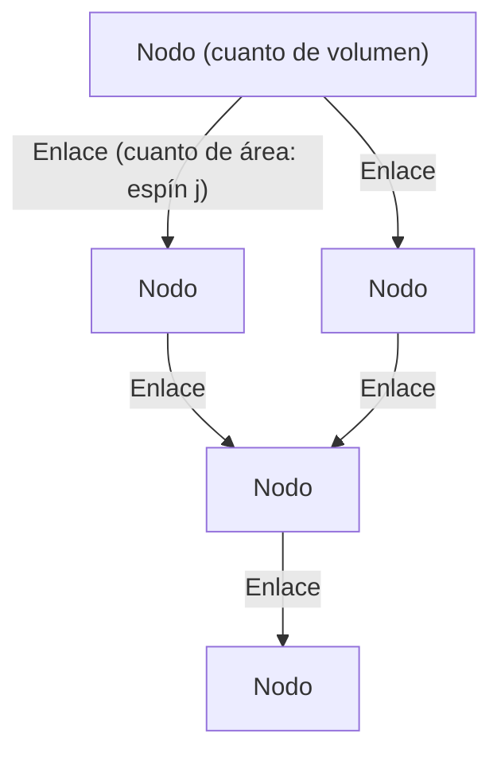
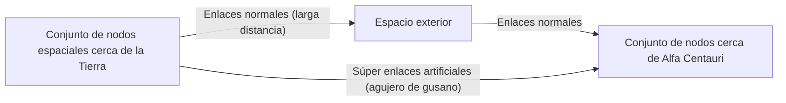

# Introducción: El fin de la ilusión del continuo y el "espacio cuantizado"

En el intento de la humanidad por comprender la estructura del universo, siempre hemos concebido el "espacio" como un escenario para que exista la materia, es decir, como un fondo continuo infinitamente divisible. Incluso después del cambio de paradigma desde el espacio absoluto en la mecánica newtoniana hacia el espacio-tiempo dinámico y curvo de la teoría de la relatividad general de Einstein, se mantuvo la premisa implícita de que "el espacio-tiempo es continuo". Sin embargo, en la vanguardia de la física moderna, este concepto del continuo se está volviendo insostenible.

Uno de los principales candidatos surgidos del intento de unificar la mecánica cuántica, que describe el mundo microscópico, y la relatividad general, que describe la gravedad macroscópica, es la **gravedad cuántica de bucles (Loop Quantum Gravity: LQG)**. La visión del mundo que presenta la LQG subvierte fundamentalmente nuestra intuición. Sostiene que "el espacio mismo está cuantizado y consta de unidades mínimas indivisibles".

Si el espacio tiene una estructura discreta como los bloques de Lego, ¿no podríamos reorganizar esos bloques y "diseñar" nuevas estructuras? De esta pregunta surge el tema principal de este artículo: el concepto completamente nuevo de **"ingeniería de bucles" (Loop Engineering)**. En este artículo, desentrañaremos los conceptos básicos de la LQG y exploraremos en profundidad, combinando los límites de la física actual con hipótesis teóricas, los avances que podrían producirse en la tecnología humana si en el futuro fuera posible manipular la estructura del espacio-tiempo a la escala de la longitud de Planck.

---

# 1. Arquitectura básica de la Gravedad Cuántica de Bucles (LQG)

## 1.1 El conflicto entre la relatividad general y la mecánica cuántica, y la independencia de fondo

De las cuatro interacciones fundamentales de la naturaleza, tres —la fuerza electromagnética, la fuerza fuerte y la fuerza débil— están completamente descritas en el marco de la mecánica cuántica y perfeccionadas en el Modelo Estándar. Sin embargo, la gravedad se ha resistido tenazmente a ser cuantizada. La razón fundamental de esto radica en que la relatividad general es una teoría "independiente de fondo" (Background Independent).

La teoría cuántica de campos existente se desarrolla sobre un "espacio-tiempo de fondo fijo", como el espacio-tiempo plano de Minkowski. Pero en la relatividad general, el espacio-tiempo en sí mismo es una variable dinámica que se curva por la distribución de la materia. Es decir, cuantizar la gravedad significa **cuantizar el propio espacio-tiempo**. Mientras que la teoría de cuerdas (String Theory) asume un espacio-tiempo de fondo específico y describe el gravitón como una cuerda que se propaga a través de él, la LQG defiende estrictamente la independencia de fondo de Einstein y adopta un enfoque que cuantiza la geometría misma del espacio-tiempo.

## 1.2 Redes de espín: Los "átomos" del espacio

La herramienta matemática para describir la estructura del espacio en la LQG es la **red de espín (Spin Network)**. Concepto concebido originalmente por Roger Penrose, fue formalizado como estados rigurosos de la LQG por Carlo Rovelli, Lee Smolin y otros.

Una red de espín se visualiza como una estructura de grafo compuesta por nodos (puntos) y enlaces (líneas).

- **Nodo (Node)**: Los nodos representan los cuantos de "volumen" del espacio. Cada nodo corresponde a una minúscula porción de espacio a la escala del volumen de Planck (aproximadamente $10^{-99} \text{cm}^3$).
- **Enlace (Link)**: Los enlaces que conectan los nodos representan los cuantos de "área" donde se intersecan los fragmentos de espacio adyacentes. A los enlaces se les asigna un número semientero $j$ (espín), que determina el tamaño del área. El valor propio del área está dado por $A \propto \ell_P^2 \sqrt{j(j+1)}$ (donde $\ell_P$ es la longitud de Planck).

En resumen, el espacio continuo que percibimos, al hacer zoom a una escala microscópica, se revela como una intrincada estructura de red de nodos y enlaces de espín entrelazados. El espacio no es algo que "existe", sino que se redefine como algo que "emerge" a través de las relaciones (enlaces) entre los nodos.

## 1.3 Espuma de espín: La historia y evolución del espacio-tiempo

Mientras que una red de espín representa la estructura del espacio "en un momento dado", su evolución a lo largo del tiempo se describe mediante la **espuma de espín (Spin Foam)**.

De forma análoga a la integral de caminos de Feynman en la mecánica cuántica, la probabilidad de transición desde un estado inicial de la red de espín hacia un estado final se calcula como la suma de todas las espumas de espín posibles. Una espuma de espín se visualiza como una estructura de red de mayor dimensión, similar a una espuma, donde los nodos trazan trayectorias en la dirección del tiempo para convertirse en "aristas" (bordes) y los enlaces se convierten en "caras". El espacio-tiempo es un fenómeno que emerge macroscópicamente como la superposición de estas complejas interacciones de espumas de espín.

---

# 2. Ingeniería de bucles: Diseño y manipulación del espacio

Si asumimos que la LQG describe la naturaleza correctamente, en un futuro donde la tecnología avance hasta sus límites, podríamos ser capaces de manipular artificialmente la estructura de estas redes de espín. A esto le llamamos "ingeniería de bucles".

Tras la nanotecnología que manipula átomos, y la ingeniería nuclear que manipula núcleos atómicos, llega el nacimiento de la **ingeniería geométrica (Geometry Engineering)**, que manipula directamente la "geometría a escala de Planck", la unidad mínima del espacio.

## 2.1 Edición directa de la topología espacial

La tecnología moderna se limita a mover y transformar materia y energía dentro del espacio. Sin embargo, con la ingeniería de bucles, sería posible cortar los enlaces de una red de espín y volver a conectarlos a otros nodos. Matemáticamente, esto significa modificar localmente la topología (estructura topológica) del espacio.

### Construcción artificial de agujeros de gusano
El agujero de gusano, un elemento clásico de la ciencia ficción, puede existir como una solución a la relatividad general (el puente de Einstein-Rosen), pero mantenerlo requiere materia exótica con "energía negativa", lo que se ha considerado extremadamente improbable de realizar.

Sin embargo, si se hace posible la manipulación a escala de Planck, podríamos generar agujeros de gusano microscópicos reescribiendo directamente la estructura de la red de espín sin depender de energía negativa macroscópica. Al conectar directamente con enlaces nodos de dos regiones distantes, se crea una nueva relación de proximidad allí. Si este pequeño haz de enlaces puede crecer hasta una escala macroscópica (provocando una transición de fase masiva de la red de espín), se podría construir un agujero de gusano transitable (traversable).

## 2.2 Comunicación superlumínica (FTL) y entrelazamiento geométrico

Un principio fundamental de la mecánica cuántica es que el entrelazamiento cuántico (entrelazamiento) no se puede utilizar para transmitir información (no puede superar la velocidad de la luz). No obstante, en el contexto de la gravedad cuántica de bucles y el principio holográfico, se ha propuesto la conjetura ER=EPR (la equivalencia entre agujeros de gusano y entrelazamiento), que sugiere que "la conexión misma del espacio (enlaces) es generada por el entrelazamiento cuántico".

Si a través de la ingeniería de bucles pudiéramos construir y estabilizar artificialmente un estado de entrelazamiento extremadamente fuerte entre nodos específicos, podría ser posible la transferencia directa de información ignorando la distancia espacial. Esto equivaldría a crear un "atajo" en la red de espín y podría realizar una aparente comunicación más rápida que la luz (Faster-Than-Light communication).

## 2.3 Control gravitatorio y la "densidad" de la red de espín

La enseñanza de la relatividad es que la presencia de masa curva el espacio y genera gravedad, pero desde la perspectiva de la LQG, la masa (campos de materia) interactúa con la red de espín y actúa como un factor que altera la distribución de sus enlaces y la densidad de sus nodos.

Si, sin intervención de la materia, mediante el uso de campos electromagnéticos u otros campos de alta energía pudiéramos excitar directamente el estado local de la red de espín y sesgar la densidad de los nodos o la topología de los enlaces, sería posible **generar un campo gravitatorio artificial donde no exista masa**.

- **Antigravedad (Bloqueo gravitatorio)**: Alinear los enlaces de la red de espín y desplegar un escudo de topología variable (ajustable) que prevenga la propagación de distorsiones geométricas externas, bloqueando completamente los efectos de la gravedad.
- **Realización de bucle del motor de Alcubierre**: Realizar operaciones continuas que aumenten la densidad de nodos de la red de espín frente a la nave espacial para contraer el espacio, y disminuyan la densidad detrás para expandirlo, logrando así un motor warp.

---

# 3. Límites físicos y condiciones para avances disruptivos

Por supuesto, existen obstáculos formidables para la realización de la ingeniería de bucles.

## 3.1 El muro de la energía de Planck

La mayor barrera es la escala de energía. Para sondear y manipular estructuras del tamaño de la longitud de Planck ($\sim 10^{-35}$ metros), se requiere la energía de Planck ($\sim 10^{19}$ GeV) debido al principio de incertidumbre. Esto equivale a unos mil billones de veces la energía máxima del actual Gran Colisionador de Hadrones (LHC) del CERN, una cantidad inalcanzable a menos que se trate de una civilización de Tipo II o III en la escala de Kardashov.

Pero una esperanza radica en la hipótesis teórica de los **"efectos de gravedad cuántica macroscópica"**.

## 3.2 Utilización de efectos de gravedad cuántica macroscópica

Al igual que podemos controlar las olas mediante la dinámica de fluidos sin conocer el comportamiento de las moléculas de agua individuales, este enfoque no manipularía individualmente los detalles microscópicos de la red de espín, sino que utilizaría las excitaciones colectivas (excitaciones en conjunto) de todo el sistema.

Por ejemplo, podría concebirse una tecnología que resuene las fluctuaciones del espacio-tiempo a escala macroscópica utilizando estados cuánticos coherentes, como el condensado de Bose-Einstein (BEC) en ambientes de temperaturas ultrabajas y alta densidad. Si existiera un efecto de resonancia no lineal entre ciertos patrones de pulsos electromagnéticos y los modos de excitación de la red de espín, podría quedar un margen para crear "patrones de interferencia" en la estructura del espacio-tiempo con energías relativamente bajas, permitiendo controlar la topología sin alcanzar la energía de Planck.

---

# Conclusión: Una guía para los ingenieros del futuro

El "espacio cuantizado" que presenta la teoría de la gravedad cuántica de bucles no es solo una herramienta teórica para desentrañar los orígenes del universo o las singularidades de los agujeros negros. Alberga el potencial de convertirse, en un futuro lejano, en la "especificación" definitiva para que la humanidad despliegue libremente su tecnología, utilizando la estructura misma del universo como lienzo.

Un cambio de paradigma de la ingeniería de materiales a la ingeniería geométrica. El nacimiento de los "ingenieros de bucles", que tejerán los nodos del espacio, darán forma al tiempo y construirán una nueva infraestructura que conecte las estrellas, marcará el momento en que la humanidad se convierta verdaderamente en participante creadora del universo. Hoy somos testigos del primer paso en esta escala inmensamente épica: la construcción de la teoría fundamental.
