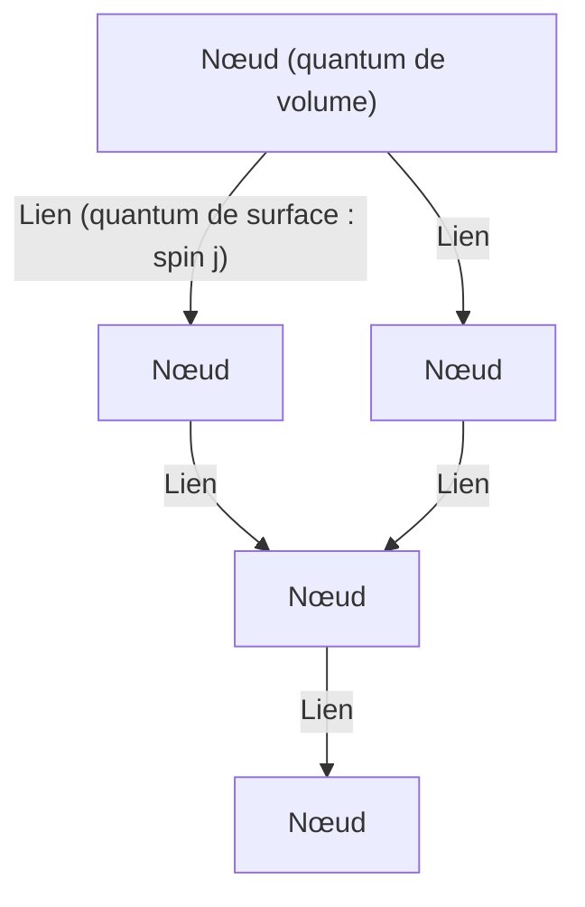
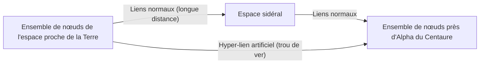

# Introduction : La fin de l'illusion du continuum et "l'espace quantifié"

Dans les tentatives de l'humanité pour comprendre la structure de l'univers, nous avons toujours considéré "l'espace" comme la scène où la matière existe, c'est-à-dire une toile de fond continue et divisible à l'infini. Même après le changement de paradigme, de l'espace absolu de la mécanique newtonienne à l'espace-temps dynamique et courbé de la relativité générale d'Einstein, l'hypothèse implicite que "l'espace-temps est continu" a été maintenue. Cependant, à la pointe de la physique moderne, ce concept de continuum devient de moins en moins tenable.

L'un des candidats les plus prometteurs né de la tentative d'unifier la mécanique quantique (qui décrit le monde microscopique) et la relativité générale (qui décrit la gravité macroscopique) est la **théorie de la gravité quantique à boucles (Loop Quantum Gravity : LQG)**. La vision du monde présentée par la LQG bouleverse fondamentalement notre intuition. Elle postule que "l'espace lui-même est quantifié et composé d'unités minimales indivisibles".

Si l'espace possède une structure discrète semblable à des briques Lego, ne pourrions-nous pas réarranger ces briques et "concevoir" de nouvelles structures ? De cette question naît le tout nouveau concept d'"**ingénierie des boucles (Loop Engineering)**", qui est le sujet principal de cet article. Dans cet essai, tout en décortiquant les concepts de base de la LQG, nous examinerons en profondeur quelles avancées majeures pourraient être apportées à la technologie humaine si la manipulation de la structure de l'espace-temps à l'échelle de Planck devenait possible à l'avenir, en mêlant les limites de la physique actuelle et des hypothèses théoriques.

---

# 1. Architecture de base de la théorie de la gravité quantique à boucles (LQG)

## 1.1 Le conflit entre la relativité générale et la mécanique quantique, et l'indépendance de fond

Parmi les quatre interactions fondamentales de la nature, trois (la force électromagnétique, l'interaction forte et l'interaction faible) sont parfaitement décrites dans le cadre de la mécanique quantique et sont achevées en tant que modèle standard. Cependant, seule la gravité a obstinément refusé d'être quantifiée. La raison fondamentale en est que la relativité générale est une théorie "indépendante du fond (Background Independent)".

La théorie quantique des champs existante se déploie sur un "espace-temps de fond fixe", tel que l'espace-temps plat de Minkowski. Cependant, dans la relativité générale, l'espace-temps lui-même est une variable dynamique et se courbe selon la distribution de la matière. En d'autres termes, quantifier la gravité signifie **quantifier l'espace-temps lui-même**. Alors que la théorie des cordes (String Theory) suppose un espace-temps de fond spécifique et décrit les gravitons comme des cordes s'y propageant, la LQG préserve strictement l'indépendance de fond d'Einstein et adopte une approche quantifiant la géométrie de l'espace-temps elle-même.

## 1.2 Réseaux de spin : Les "atomes" de l'espace

Dans la LQG, l'outil mathématique pour décrire la structure de l'espace est le **réseau de spin (Spin Network)**. Bien que ce concept ait été initialement inventé par Roger Penrose, il a été formulé comme un état rigoureux de la LQG par Carlo Rovelli et Lee Smolin.

Les réseaux de spin sont visualisés comme une structure de graphe composée de nœuds (points) et de liens (lignes).

- **Nœud (Node)** : Les nœuds représentent les quanta de "volume" de l'espace. Chaque nœud correspond à un minuscule bloc d'espace à l'échelle du volume de Planck (environ $10^{-99} \text{cm}^3$).
- **Lien (Link)** : Les liens reliant les nœuds représentent les quanta de "surface" où les blocs d'espace adjacents se croisent. Un demi-entier $j$ (spin) est attribué à chaque lien, ce qui détermine la taille de la surface. La valeur propre de la surface est donnée par $A \propto \ell_P^2 \sqrt{j(j+1)}$ ($\ell_P$ étant la longueur de Planck).

En d'autres termes, l'espace continu tel que nous le percevons, lorsqu'on zoome à une échelle infime, apparaît comme une structure de réseau complexe où les nœuds et les liens de ce réseau de spin sont entrelacés. L'espace n'est plus considéré comme quelque chose qui "existe", mais comme quelque chose qui "émerge" des relations (liens) entre les nœuds.

## 1.3 Mousse de spin : Histoire et évolution de l'espace-temps

Alors que le réseau de spin représente la structure de "l'espace à un instant donné", la façon dont il évolue au fil du temps est décrite par la **mousse de spin (Spin Foam)**.

Semblable à l'intégrale de chemin de Feynman en mécanique quantique, la probabilité de transition d'un état initial du réseau de spin à un état final est calculée comme la somme de toutes les mousses de spin possibles. La mousse de spin est imaginée comme une structure de réseau multidimensionnelle en forme de mousse, où les nœuds tracent des trajectoires dans le temps pour devenir des "arêtes", et les liens deviennent des "faces". L'espace-temps est un phénomène qui émerge macroscopiquement de la superposition d'interactions complexes de ces mousses de spin.

---

# 2. Ingénierie des boucles : Conception et manipulation de l'espace

En supposant que la LQG décrive correctement la nature, dans un avenir où la technologie aura progressé à l'extrême, nous pourrions être en mesure de manipuler artificiellement la structure de ces réseaux de spin. C'est ce qu'on appelle "l'ingénierie des boucles".

Après la nanotechnologie qui manipule les atomes et l'ingénierie nucléaire qui manipule les noyaux, ce serait la naissance de l'**ingénierie de la géométrie (Geometry Engineering)**, qui manipulerait directement la "géométrie à l'échelle de Planck", la plus petite unité de l'espace.

## 2.1 Édition directe de la topologie de l'espace

La technologie moderne est limitée au déplacement et à la déformation de la matière et de l'énergie dans l'espace. Cependant, dans l'ingénierie des boucles, il deviendrait possible de couper les liens d'un réseau de spin et de les reconnecter à d'autres nœuds. Mathématiquement, cela signifie modifier localement la topologie de l'espace.

### Construction artificielle de trous de ver
Le trou de ver, un classique de la science-fiction, peut exister en tant que solution de la théorie de la relativité générale (pont d'Einstein-Rosen), mais pour le maintenir, une matière exotique avec une "énergie négative" est requise, ce qui rend sa faisabilité extrêmement faible.

Cependant, si la manipulation à l'échelle de Planck devient possible, sans dépendre d'une énergie négative macroscopique, il pourrait être possible de générer des trous de ver microscopiques en réécrivant directement la structure du réseau de spin. Si des nœuds de deux régions éloignées sont directement connectés par des liens, une nouvelle relation de proximité y naîtra. Si ce minuscule faisceau de liens peut croître à une échelle macroscopique (déclenchant une transition de phase géante du réseau de spin), des trous de ver traversables pourraient être construits.

## 2.2 Communication supraluminique (FTL) et intriquement géométrique

L'un des grands principes de la mécanique quantique est que l'intrication quantique ne peut pas être utilisée pour la transmission d'informations (elle ne peut pas dépasser la vitesse de la lumière). Cependant, dans le contexte de la théorie de la gravité quantique à boucles et du principe holographique, la conjecture ER=EPR (équivalence entre trous de ver et intrication) propose que "les connexions (liens) de l'espace elles-mêmes sont générées par l'intrication quantique".

Grâce à l'ingénierie des boucles, s'il était possible de construire artificiellement et de stabiliser des états d'intrication extrêmement forts entre des nœuds spécifiques, une transcription directe de l'information ignorant la distance spatiale pourrait devenir possible. Cela équivaudrait à créer un "raccourci" sur le réseau de spin, permettant potentiellement une communication supraluminique apparente (Faster-Than-Light communication).

## 2.3 Contrôle de la gravité et "densité" des réseaux de spin

La théorie de la relativité nous enseigne que la présence de masse courbe l'espace et génère la gravité. Du point de vue de la LQG, la masse (champ de matière) interagit avec le réseau de spin et agit comme un facteur modifiant la distribution de ses liens et la densité de ses nœuds.

Si nous pouvions exciter directement l'état local du réseau de spin à l'aide de champs électromagnétiques ou d'un champ à haute énergie sans l'intermédiaire de la matière, en biaisant la densité des nœuds et la topologie des liens, il deviendrait possible de **générer un champ gravitationnel artificiel là où aucune masse n'existe**.

- **Antigravité (bouclier gravitationnel)** : Aligner les liens du réseau de spin et déployer un bouclier topologique variable pour empêcher la propagation des distorsions géométriques externes, bloquant ainsi complètement les effets de la gravité.
- **Réalisation en boucle du moteur d'Alcubierre** : En augmentant continuellement la densité des nœuds du réseau de spin à l'avant d'un vaisseau spatial pour contracter l'espace, et en diminuant la densité à l'arrière pour l'étendre, réaliser un voyage par distorsion spatiale (warp drive).

---

# 3. Limites physiques et conditions pour des percées

Bien sûr, des obstacles colossaux se dressent devant la réalisation de l'ingénierie des boucles.

## 3.1 Le mur de l'énergie de Planck

La plus grande barrière est l'échelle d'énergie. Pour sonder et manipuler des structures à la longueur de Planck ($\sim 10^{-35}$ mètres), le principe d'incertitude exige l'énergie de Planck ($\sim 10^{19}$ GeV). Cela représente environ un million de milliards de fois l'énergie maximale du Grand collisionneur de hadrons (LHC) du CERN actuel, une quantité d'énergie inatteignable à moins d'être une civilisation de type II ou III sur l'échelle de Kardachev.

Cependant, un espoir réside dans l'hypothèse théorique des "**effets macroscopiques de la gravité quantique**".

## 3.2 Utilisation des effets macroscopiques de la gravité quantique

Tout comme il est possible de contrôler les vagues par la dynamique des fluides sans connaître le comportement individuel de chaque molécule d'eau, cette approche utilise les excitations collectives (collective excitations) du système entier au lieu de manipuler individuellement les détails microscopiques du réseau de spin.

Par exemple, on pourrait envisager des technologies qui résonnent avec les fluctuations de l'espace-temps à l'échelle macroscopique en utilisant des états quantiquement cohérents, comme le condensat de Bose-Einstein (BEC) dans des environnements cryogéniques et à haute densité. S'il existe un effet de résonance non linéaire entre un motif d'impulsions d'ondes électromagnétiques spécifiques et les modes d'excitation du réseau de spin, il reste une marge pour créer des "franges d'interférence" dans la structure de l'espace-temps et contrôler la topologie avec des énergies relativement basses, sans atteindre l'énergie de Planck.

---

# Conclusion : Un guide pour les ingénieurs du futur

L'"espace quantifié" présenté par la théorie de la gravité quantique à boucles ne se limite pas à un outil théorique pour élucider l'origine de l'univers ou les singularités des trous noirs. Il recèle le potentiel de devenir les "spécifications" ultimes dans un futur lointain, permettant à l'humanité de déployer librement ses technologies en utilisant la structure même de l'univers comme une toile.

Le changement de paradigme de l'ingénierie des matériaux à l'ingénierie de la géométrie. La naissance des "ingénieurs de boucles", qui tisseront les nœuds de l'espace, façonneront le temps et construiront de nouvelles infrastructures reliant les étoiles, signifiera le moment où l'humanité deviendra un véritable participant créatif de l'univers. Nous sommes actuellement les témoins de la construction de la théorie fondamentale, qui est le tout premier pas vers cette échelle infiniment grandiose.
