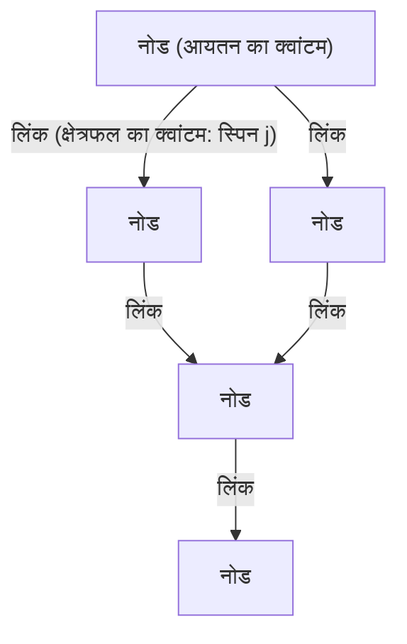
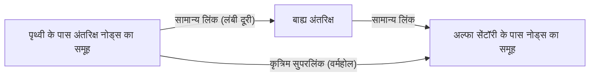

# प्रस्तावना: निरंतरता के भ्रम का अंत और "परिमाणित अंतरिक्ष"

ब्रह्मांड की संरचना को समझने के मानवता के प्रयासों में, हमने हमेशा "अंतरिक्ष" को एक ऐसे मंच के रूप में माना है जहां पदार्थ मौजूद है, अर्थात, एक असीम रूप से विभाज्य निरंतर पृष्ठभूमि। न्यूटोनियन यांत्रिकी में पूर्ण अंतरिक्ष से लेकर आइंस्टीन के सामान्य सापेक्षता के सिद्धांत में गतिशील और घुमावदार स्पेस-टाइम तक प्रतिमान बदलाव के बाद भी, "स्पेस-टाइम निरंतर है" की अंतर्निहित धारणा बनी रही। हालांकि, आधुनिक भौतिकी में सबसे आगे, इस निरंतरता (continuum) की अवधारणा को बनाए रखना अब संभव नहीं रह गया है।

सूक्ष्म दुनिया का वर्णन करने वाले क्वांटम यांत्रिकी और स्थूल गुरुत्वाकर्षण का वर्णन करने वाले सामान्य सापेक्षता के सिद्धांत को एकीकृत करने के प्रयास में उभरे प्रमुख उम्मीदवारों में से एक **लूप क्वांटम गुरुत्वाकर्षण सिद्धांत (Loop Quantum Gravity: LQG)** है। LQG द्वारा प्रस्तुत विश्वदृष्टि हमारे अंतर्ज्ञान को मौलिक रूप से पलट देती है। यह प्रस्तावित करता है कि "अंतरिक्ष स्वयं परिमाणित (quantized) है और सबसे छोटी, अविभाज्य इकाइयों से बना है।"

यदि अंतरिक्ष में लेगो ब्लॉक जैसी असतत संरचना है, तो क्या हम उन ब्लॉकों को पुनर्व्यवस्थित करके नई संरचनाएं "डिज़ाइन" कर सकते हैं? इस प्रश्न से एक पूरी तरह से नई अवधारणा, **"लूप इंजीनियरिंग (Loop Engineering)"** का जन्म होता है, जो इस लेख का मुख्य विषय है। इस लेख में, हम LQG की मूलभूत अवधारणाओं को उजागर करेंगे और गहराई से विचार करेंगे कि यदि भविष्य में प्लैंक लंबाई के पैमाने पर स्पेस-टाइम संरचनाओं में हेरफेर करना संभव हो जाता है, तो वर्तमान भौतिकी की सीमाओं और सैद्धांतिक परिकल्पनाओं के संदर्भ में मानव प्रौद्योगिकी में क्या सफलताएं लाई जा सकती हैं।

---

# 1. लूप क्वांटम गुरुत्वाकर्षण सिद्धांत (LQG) की मूल वास्तुकला

## 1.1 सामान्य सापेक्षता और क्वांटम यांत्रिकी के बीच संघर्ष और पृष्ठभूमि स्वतंत्रता

प्रकृति में चार मूलभूत अंतःक्रियाओं में से तीन—विद्युत चुम्बकीय बल, मजबूत बल और कमजोर बल—पूरी तरह से क्वांटम यांत्रिकी के ढांचे के भीतर वर्णित हैं और मानक मॉडल (Standard Model) के रूप में पूर्ण हैं। हालांकि, गुरुत्वाकर्षण ने हठपूर्वक परिमाणीकरण (quantization) का विरोध किया है। इसका मूल कारण यह है कि सामान्य सापेक्षता का सिद्धांत एक "पृष्ठभूमि स्वतंत्र (Background Independent)" सिद्धांत है।

विद्यमान क्वांटम क्षेत्र सिद्धांत एक "निश्चित पृष्ठभूमि स्पेस-टाइम", जैसे कि सपाट मिंकोव्स्की स्पेस-टाइम, पर विकसित किए गए हैं। हालांकि, सामान्य सापेक्षता के सिद्धांत में, स्पेस-टाइम स्वयं एक गतिशील चर है और पदार्थ के वितरण के कारण मुड़ता है। दूसरे शब्दों में, गुरुत्वाकर्षण को परिमाणित करने का अर्थ है **स्पेस-टाइम को स्वयं परिमाणित करना**। जबकि स्ट्रिंग सिद्धांत (String Theory) एक विशिष्ट पृष्ठभूमि स्पेस-टाइम को मानता है और गुरुत्वाकर्षण (ग्रेविटॉन) को इसके माध्यम से फैलने वाले तारों (strings) के रूप में वर्णित करता है, LQG आइंस्टीन की पृष्ठभूमि स्वतंत्रता का कड़ाई से पालन करता है और स्पेस-टाइम की ज्यामिति को परिमाणित करने का दृष्टिकोण अपनाता है।

## 1.2 स्पिन नेटवर्क: अंतरिक्ष के "परमाणु"

LQG में अंतरिक्ष की संरचना का वर्णन करने वाला गणितीय उपकरण **स्पिन नेटवर्क (Spin Network)** है। मूल रूप से रोजर पेनरोज़ द्वारा कल्पित, इसे कार्लो रोवेल्ली और ली स्मोलिन द्वारा LQG की एक कठोर अवस्था के रूप में तैयार किया गया था।

स्पिन नेटवर्क को नोड्स (बिंदुओं) और लिंक (रेखाओं) से युक्त ग्राफ़ संरचना के रूप में दर्शाया जाता है।

- **नोड (Node)**: एक नोड अंतरिक्ष की "आयतन" की क्वांटम का प्रतिनिधित्व करता है। प्रत्येक नोड प्लैंक आयतन (लगभग $10^{-99} \text{cm}^3$) के पैमाने पर अंतरिक्ष के एक छोटे से हिस्से से मेल खाता है।
- **लिंक (Link)**: नोड्स को जोड़ने वाले लिंक "क्षेत्रफल" की क्वांटम का प्रतिनिधित्व करते हैं जहां अंतरिक्ष के आसन्न हिस्से प्रतिच्छेद करते हैं। प्रत्येक लिंक को एक आधा-पूर्णांक $j$ (स्पिन) सौंपा गया है, जो क्षेत्रफल का आकार निर्धारित करता है। क्षेत्रफल का आइगेनवैल्यू $A \propto \ell_P^2 \sqrt{j(j+1)}$ द्वारा दिया जाता है ($\ell_P$ प्लैंक लंबाई है)।

संक्षेप में, जो निरंतर अंतरिक्ष हम देखते हैं, यदि हम इसे सूक्ष्म पैमाने पर ज़ूम इन करें, तो यह स्पिन नेटवर्क के नोड्स और लिंक की एक जटिल रूप से उलझी हुई नेटवर्क संरचना के रूप में दिखाई देता है। अंतरिक्ष को कुछ ऐसा नहीं माना जाता जो केवल "अस्तित्व" में है, बल्कि नोड्स के बीच संबंधों (लिंक) के माध्यम से "उभरने" (emerge) वाली चीज के रूप में फिर से समझा जाता है।

## 1.3 स्पिन फ़ोम: स्पेस-टाइम का इतिहास और विकास

जबकि एक स्पिन नेटवर्क "एक निश्चित क्षण में अंतरिक्ष" की संरचना का प्रतिनिधित्व करता है, यह समय के साथ कैसे बदलता है, इसका वर्णन **स्पिन फ़ोम (Spin Foam)** द्वारा किया जाता है।

क्वांटम यांत्रिकी में फेनमैन के पथ अभिन्न (path integral) की तरह, प्रारंभिक स्पिन नेटवर्क अवस्था से अंतिम अवस्था में संक्रमण की संभावना सभी संभावित स्पिन फ़ोम के योग के रूप में गणना की जाती है। स्पिन फ़ोम की कल्पना एक उच्च-आयामी, फोम-जैसी नेटवर्क संरचना के रूप में की जा सकती है, जहां नोड्स समय के साथ "किनारे (edges)" बनाने के लिए प्रक्षेपवक्र बनाते हैं, और लिंक "चेहरे (faces)" बन जाते हैं। स्पेस-टाइम एक ऐसी घटना है जो इन स्पिन फ़ोम के जटिल इंटरैक्शन के सुपरपोजिशन के रूप में मैक्रोस्कोपिक रूप से उभरती है।

---

# 2. लूप इंजीनियरिंग: अंतरिक्ष का डिज़ाइन और हेरफेर

यह मानते हुए कि LQG प्रकृति का सही वर्णन करता है, ऐसे भविष्य में जहां तकनीक अपनी चरम सीमा तक पहुंच गई है, हम कृत्रिम रूप से इस स्पिन नेटवर्क की संरचना में हेरफेर करने में सक्षम हो सकते हैं। इसे ही "लूप इंजीनियरिंग" कहा जाता है।

परमाणुओं में हेरफेर करने वाली नैनो-प्रौद्योगिकी और परमाणु नाभिक में हेरफेर करने वाली परमाणु इंजीनियरिंग के बाद, यह **ज्यामिति इंजीनियरिंग (Geometry Engineering)** का जन्म है, जो अंतरिक्ष की सबसे छोटी इकाई, "प्लैंक-स्केल ज्यामिति" में सीधे हेरफेर करती है।

## 2.1 अंतरिक्ष टोपोलॉजी का प्रत्यक्ष संपादन

आधुनिक तकनीक अंतरिक्ष के भीतर पदार्थ और ऊर्जा को स्थानांतरित करने और विकृत करने तक सीमित है। हालांकि, लूप इंजीनियरिंग के साथ, स्पिन नेटवर्क के लिंक को काटना और उन्हें अन्य नोड्स से फिर से जोड़ना संभव हो जाता है। गणितीय रूप से, इसका अर्थ है स्थानीय रूप से अंतरिक्ष की टोपोलॉजी (टोपोलॉजिकल संरचना) को बदलना।

### कृत्रिम वर्महोल का निर्माण
वर्महोल, जो विज्ञान कथाओं में एक प्रधान हैं, सामान्य सापेक्षता के समाधान (आइंस्टीन-रोसेन ब्रिज) के रूप में संभव हैं। हालांकि, उन्हें बनाए रखने के लिए "नकारात्मक ऊर्जा" वाले विदेशी (exotic) पदार्थ की आवश्यकता होती है, और उनकी व्यवहार्यता अत्यंत कम मानी गई है।

लेकिन अगर प्लैंक स्केल पर हेरफेर संभव हो जाता है, तो मैक्रोस्कोपिक नकारात्मक ऊर्जा पर भरोसा किए बिना सीधे स्पिन नेटवर्क संरचना को फिर से लिखकर सूक्ष्म वर्महोल बनाना संभव हो सकता है। यदि दूर के दो क्षेत्रों में नोड्स सीधे लिंक द्वारा जुड़े हुए हैं, तो एक नया निकटता संबंध बनता है। यदि सूक्ष्म लिंक के इस बंडल को मैक्रोस्कोपिक पैमाने पर (स्पिन नेटवर्क में एक विशाल चरण संक्रमण का कारण बनकर) बढ़ाया जा सकता है, तो एक पारगम्य (traversable) वर्महोल का निर्माण किया जा सकता है।

## 2.2 सुपरलूमिनल संचार (FTL) और ज्यामितीय उलझाव

क्वांटम यांत्रिकी का एक प्रमुख सिद्धांत यह है कि क्वांटम उलझाव (Quantum Entanglement) का उपयोग सूचना प्रसारित करने के लिए नहीं किया जा सकता (प्रकाश की गति को पार नहीं किया जा सकता)। हालांकि, लूप क्वांटम गुरुत्वाकर्षण और होलोग्राफिक सिद्धांत के संदर्भ में, ER=EPR अनुमान (वर्महोल और उलझाव की तुल्यता) प्रस्तावित किया गया है, जो बताता है कि "अंतरिक्ष के कनेक्शन (लिंक) स्वयं क्वांटम उलझाव से उत्पन्न होते हैं।"

लूप इंजीनियरिंग के माध्यम से, यदि विशिष्ट नोड्स के बीच एक अत्यंत मजबूत उलझाव अवस्था को कृत्रिम रूप से बनाया और स्थिर किया जा सकता है, तो अंतरिक्ष की दूरी को अनदेखा करते हुए जानकारी का प्रत्यक्ष स्थानांतरण संभव हो सकता है। यह स्पिन नेटवर्क पर एक "शॉर्टकट पथ" बनाने के बराबर है, जो स्पष्ट रूप से प्रकाश से तेज संचार (Faster-Than-Light communication) को साकार कर सकता है।

## 2.3 गुरुत्वाकर्षण नियंत्रण और स्पिन नेटवर्क का "घनत्व"

सापेक्षता सिखाती है कि द्रव्यमान की उपस्थिति अंतरिक्ष को मोड़ती है और गुरुत्वाकर्षण पैदा करती है। लेकिन LQG के दृष्टिकोण से, द्रव्यमान (पदार्थ क्षेत्र) स्पिन नेटवर्क के साथ इंटरैक्ट करता है और इसके लिंक के वितरण और नोड्स के घनत्व को बदलने वाले कारक के रूप में कार्य करता है।

यदि हम पदार्थ के बिना विद्युत चुम्बकीय क्षेत्रों या कुछ उच्च-ऊर्जा क्षेत्रों का उपयोग करके स्पिन नेटवर्क की स्थानीय अवस्था को सीधे उत्तेजित कर सकते हैं, जिससे नोड घनत्व और लिंक टोपोलॉजी बदल जाती है, तो **उन स्थानों पर कृत्रिम गुरुत्वाकर्षण क्षेत्र उत्पन्न करना संभव हो जाएगा जहां कोई द्रव्यमान मौजूद नहीं है**।

- **एंटी-ग्रेविटी (गुरुत्वाकर्षण परिरक्षण)**: स्पिन नेटवर्क के लिंक को संरेखित करके और एक परिवर्तनशील (variable) टोपोलॉजी ढाल को तैनात करके जो बाहर से ज्यामितीय विरूपण के प्रसार को रोकता है, गुरुत्वाकर्षण के प्रभाव को पूरी तरह से अवरुद्ध किया जा सकता है।
- **अल्कुबिएरे ड्राइव का लूप कार्यान्वयन**: अंतरिक्ष यान के सामने स्पिन नेटवर्क के नोड घनत्व को बढ़ाकर अंतरिक्ष को अनुबंधित (contract) करना और पीछे के घनत्व को कम करके इसका विस्तार (expand) करना, वार्प ड्राइव (warp drive) को साकार कर सकता है।

---

# 3. भौतिक सीमाएँ और सफलताओं के लिए शर्तें

बेशक, लूप इंजीनियरिंग की प्राप्ति में जबरदस्त बाधाएं हैं।

## 3.1 प्लैंक ऊर्जा की दीवार

सबसे बड़ी बाधा ऊर्जा का पैमाना है। अनिश्चितता के सिद्धांत के कारण, प्लैंक लंबाई ($\sim 10^{-35}$ मीटर) पर संरचनाओं का पता लगाने और हेरफेर करने के लिए प्लैंक ऊर्जा ($\sim 10^{19}$ GeV) की आवश्यकता होती है। यह CERN के लार्ज हैड्रॉन कोलाइडर (LHC) की अधिकतम ऊर्जा का लगभग एक हजार ट्रिलियन गुना है, और यह ऊर्जा की एक ऐसी मात्रा है जिसे केवल कार्दशेव पैमाने पर टाइप II से III सभ्यता द्वारा ही प्राप्त किया जा सकता है।

हालांकि, यहां आशा की एक किरण **"मैक्रोस्कोपिक क्वांटम गुरुत्वाकर्षण प्रभाव (Macroscopic Quantum Gravity Effects)"** की सैद्धांतिक परिकल्पना है।

## 3.2 मैक्रोस्कोपिक क्वांटम गुरुत्वाकर्षण प्रभाव का उपयोग

जिस तरह हम अलग-अलग पानी के अणुओं के व्यवहार को जाने बिना द्रव यांत्रिकी का उपयोग करके लहरों को नियंत्रित कर सकते हैं, यह दृष्टिकोण स्पिन नेटवर्क के सूक्ष्म विवरणों में व्यक्तिगत रूप से हेरफेर करने के बजाय पूरे सिस्टम के सामूहिक उत्तेजना (collective excitation) का उपयोग करता है।

उदाहरण के लिए, क्रायोजेनिक, उच्च-घनत्व वाले वातावरण के तहत बोस-आइंस्टीन कंडेनसेट (BEC) जैसी क्वांटम सुसंगत (coherent) अवस्थाओं का उपयोग करते हुए, एक ऐसी तकनीक की कल्पना की जा सकती है जो मैक्रोस्कोपिक पैमाने पर स्पेस-टाइम के उतार-चढ़ाव को प्रतिध्वनित (resonate) करती है। यदि विशिष्ट विद्युत चुम्बकीय तरंग पल्स पैटर्न और स्पिन नेटवर्क के उत्तेजना मोड के बीच एक गैर-रैखिक अनुनाद प्रभाव मौजूद है, तो प्लैंक ऊर्जा तक पहुंचे बिना, अपेक्षाकृत कम ऊर्जा पर स्पेस-टाइम की संरचना में "हस्तक्षेप फ्रिंज (interference fringes)" बनाकर टोपोलॉजी को नियंत्रित करने की गुंजाइश बनी हुई है।

---

# निष्कर्ष: भविष्य के इंजीनियरों के लिए एक मार्गदर्शिका

लूप क्वांटम गुरुत्वाकर्षण सिद्धांत द्वारा प्रस्तुत "परिमाणित अंतरिक्ष" ब्रह्मांड की उत्पत्ति या ब्लैक होल की विलक्षणता (singularity) को उजागर करने के लिए सिर्फ एक सैद्धांतिक उपकरण नहीं है। सुदूर भविष्य में, इसमें मानवता के लिए अंतरिक्ष की संरचना को एक कैनवास के रूप में उपयोग करके स्वतंत्र रूप से प्रौद्योगिकी विकसित करने के लिए अंतिम "विशिष्टता (specification)" बनने की क्षमता है।

पदार्थ इंजीनियरिंग से ज्यामिति इंजीनियरिंग में प्रतिमान बदलाव। अंतरिक्ष के नोड्स को बुनने, समय को आकार देने और सितारों को जोड़ने वाले नए बुनियादी ढांचे का निर्माण करने वाले "लूप इंजीनियरों" का जन्म उस क्षण को चिह्नित करेगा जब मानवता सच्चे अर्थों में ब्रह्मांड की एक रचनात्मक भागीदार बन जाएगी। हम वर्तमान में इस अंतहीन भव्य पैमाने के पहले कदम के गवाह हैं: मूलभूत सिद्धांत का निर्माण।
