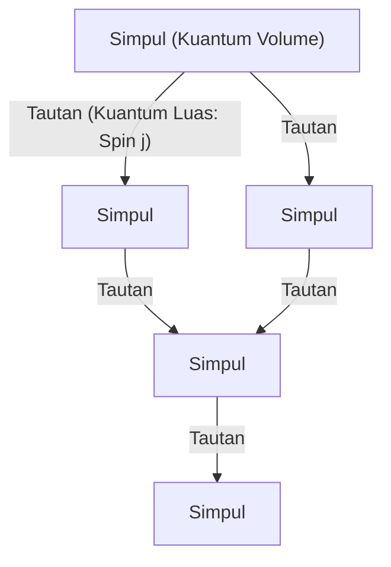
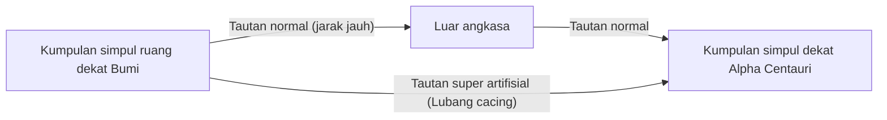

# Pendahuluan: Akhir dari Ilusi Kontinum dan "Ruang yang Dikuantisasi"

Dalam upaya umat manusia untuk memahami struktur alam semesta, kita selalu menganggap "ruang" sebagai panggung bagi materi untuk ada, yaitu latar belakang kontinu yang dapat dibagi tak terhingga. Bahkan setelah pergeseran paradigma dari ruang absolut dalam mekanika Newton ke ruang-waktu dinamis dan melengkung dalam teori relativitas umum Einstein, asumsi implisit bahwa "ruang-waktu adalah kontinu" tetap dipertahankan. Namun, di garis depan fisika modern, konsep kontinum ini mulai tidak dapat dipertahankan.

Salah satu kandidat kuat yang lahir dari upaya untuk menyatukan mekanika kuantum, yang menggambarkan dunia mikro, dan relativitas umum, yang menggambarkan gravitasi makro, adalah **Teori Gravitasi Kuantum Loop (Loop Quantum Gravity: LQG)**. Pandangan dunia yang disajikan oleh LQG secara fundamental menjungkirbalikkan intuisi kita. Teorinya adalah bahwa "ruang itu sendiri dikuantisasi dan terdiri dari unit-unit terkecil yang tidak dapat dibagi lagi".

Jika ruang memiliki struktur diskrit seperti balok Lego, tidak bisakah kita mengatur ulang balok-balok tersebut dan "merancang" struktur baru? Dari pertanyaan ini lahirlah konsep yang sama sekali baru yaitu **"Rekayasa Loop (Loop Engineering)"**, yang merupakan tema utama artikel ini. Dalam tulisan ini, sambil mengungkap konsep-konsep dasar LQG, kita akan mengeksplorasi secara mendalam dengan menggabungkan batasan fisika saat ini dan hipotesis teoritis tentang terobosan apa yang akan dibawa pada teknologi manusia jika manipulasi struktur ruang-waktu pada skala panjang Planck menjadi mungkin di masa depan.

---

# 1. Arsitektur Dasar Teori Gravitasi Kuantum Loop (LQG)

## 1.1 Konflik antara Relativitas Umum dan Mekanika Kuantum serta Independensi Latar Belakang

Di antara empat interaksi fundamental di alam, gaya elektromagnetik, gaya nuklir kuat, dan gaya nuklir lemah dijelaskan sepenuhnya dalam kerangka mekanika kuantum dan telah diselesaikan sebagai Model Standar. Namun, gravitasi dengan keras kepala menolak untuk dikuantisasi. Alasan mendasarnya berasal dari fakta bahwa relativitas umum adalah teori yang "Independen Latar Belakang (Background Independent)".

Teori medan kuantum yang ada dikembangkan di atas "ruang-waktu latar belakang yang tetap" seperti ruang-waktu Minkowski yang datar. Namun, dalam relativitas umum, ruang-waktu itu sendiri adalah variabel dinamis yang melengkung oleh distribusi materi. Dengan kata lain, mengkuantisasi gravitasi berarti **mengkuantisasi ruang-waktu itu sendiri**. Sementara Teori Dawai (String Theory) mengasumsikan ruang-waktu latar belakang tertentu dan mengambil pendekatan yang mendeskripsikan graviton sebagai dawai yang merambat di atasnya, LQG secara ketat mematuhi independensi latar belakang Einstein dan mengambil pendekatan yang mengkuantisasi geometri ruang-waktu itu sendiri.

## 1.2 Jaringan Spin: "Atom" dari Ruang

Alat matematika yang mendeskripsikan struktur ruang dalam LQG adalah **Jaringan Spin (Spin Network)**. Konsep ini awalnya dirancang oleh Roger Penrose, namun kemudian diformulasikan sebagai keadaan yang ketat dari LQG oleh Carlo Rovelli, Lee Smolin, dan lain-lain.

Jaringan spin divisualisasikan sebagai struktur graf yang terdiri dari simpul (titik) dan tautan (garis).

- **Simpul (Node)**: Simpul merepresentasikan kuantum "volume" ruang. Setiap simpul bersesuaian dengan bongkahan ruang yang sangat kecil pada skala volume Planck (sekitar $10^{-99} \text{cm}^3$).
- **Tautan (Link)**: Tautan yang menghubungkan simpul-simpul merepresentasikan kuantum "luas" di mana bongkahan ruang yang berdekatan saling berpotongan. Tautan memiliki bilangan setengah bulat $j$ (spin) yang menentukan ukuran luas. Nilai eigen luas diberikan oleh $A \propto \ell_P^2 \sqrt{j(j+1)}$ (di mana $\ell_P$ adalah panjang Planck).

Dengan kata lain, ruang kontinu yang kita kenal, bila diperbesar hingga skala mikroskopis, akan muncul sebagai struktur jaringan kompleks di mana simpul dan tautan dari jaringan spin ini saling terjalin. Ruang didefinisikan ulang bukan sebagai sesuatu yang sekadar "ada", melainkan sesuatu yang "muncul (emergent)" karena hubungan (tautan) antar simpul.

## 1.3 Busa Spin: Sejarah dan Perkembangan Ruang-Waktu

Sementara jaringan spin merepresentasikan struktur ruang pada "satu momen", **Busa Spin (Spin Foam)** mendeskripsikan bagaimana ia berubah seiring waktu.

Seperti integral lintasan Feynman dalam mekanika kuantum, probabilitas transisi dari keadaan jaringan spin awal tertentu ke keadaan akhir dihitung sebagai penjumlahan dari semua busa spin yang mungkin. Busa spin diimajinasikan sebagai struktur jaringan dimensi tinggi mirip busa, di mana simpul-simpul menelusuri lintasan dalam waktu untuk menjadi "tepi (edge)", dan tautan menjadi "permukaan (face)". Ruang-waktu adalah fenomena yang muncul secara makroskopis sebagai superposisi dari interaksi kompleks busa spin ini.

---

# 2. Rekayasa Loop: Desain dan Manipulasi Ruang

Bila kita berasumsi bahwa LQG mendeskripsikan alam dengan benar, di masa depan di mana teknologi telah berkembang mencapai puncaknya, kita mungkin dapat memanipulasi struktur jaringan spin ini secara artifisial. Inilah yang disebut "Rekayasa Loop".

Menyusul nanoteknologi yang memanipulasi atom dan rekayasa nuklir yang memanipulasi inti atom, lahirlah **Rekayasa Geometri (Geometry Engineering)**, yang secara langsung memanipulasi unit terkecil dari ruang, yaitu "geometri skala Planck".

## 2.1 Pengeditan Langsung Topologi Ruang

Teknologi modern terbatas pada pemindahan dan transformasi materi serta energi di dalam ruang. Namun, dalam rekayasa loop, operasi pemutusan tautan jaringan spin dan penyambungannya kembali ke simpul lain menjadi mungkin. Secara matematis, ini berarti mengubah topologi (struktur topologi) ruang secara lokal.

### Konstruksi Artifisial Lubang Cacing
Lubang cacing, yang menjadi langganan fiksi ilmiah, secara prinsip dapat ada sebagai solusi dari relativitas umum (jembatan Einstein-Rosen). Akan tetapi, untuk mempertahankannya diperlukan materi eksotis yang memiliki "energi negatif", sehingga kelayakannya dianggap sangat rendah.

Namun, bila manipulasi skala Planck menjadi mungkin, kita mungkin bisa menghasilkan lubang cacing mikroskopis dengan menulis ulang struktur jaringan spin secara langsung tanpa bergantung pada energi negatif makroskopis. Jika simpul-simpul di dua area yang jauh dihubungkan secara langsung dengan tautan, hubungan kedekatan (proksimitas) baru akan tercipta di sana. Jika bundel tautan mikroskopis ini dapat ditumbuhkan ke skala makroskopis (memicu transisi fase masif dalam jaringan spin), lubang cacing yang dapat dilalui (traversable) mungkin saja dibangun.

## 2.2 Komunikasi Superluminal (FTL) dan Entanglement Geometris

Bahwa keterikatan kuantum (quantum entanglement) tidak dapat digunakan untuk transmisi informasi (tidak bisa melebihi kecepatan cahaya) adalah prinsip utama mekanika kuantum. Namun, dalam konteks gravitasi kuantum loop dan prinsip holografik, konjektur ER=EPR (kesetaraan antara lubang cacing dan entanglement) diajukan, yang menyatakan bahwa "hubungan ruang (tautan) itu sendiri dihasilkan oleh entanglement kuantum".

Jika kita dapat membangun keadaan entanglement yang sangat kuat secara artifisial antara simpul-simpul tertentu dan menstabilkannya melalui rekayasa loop, transfer informasi langsung dengan mengabaikan jarak ruang mungkin saja terwujud. Hal ini setara dengan membuat "jalur pintas" di jaringan spin, dan mungkin bisa mewujudkan komunikasi superluminal yang terlihat (Faster-Than-Light communication).

## 2.3 Kontrol Gravitasi dan "Kepadatan" Jaringan Spin

Teori relativitas mengajarkan bahwa kehadiran massa membengkokkan ruang dan menghasilkan gravitasi. Namun, dari sudut pandang LQG, massa (medan materi) berinteraksi dengan jaringan spin dan bertindak sebagai faktor yang mengubah distribusi tautan dan kepadatan simpul.

Jika kita dapat secara langsung mengeksitasi keadaan lokal dari jaringan spin menggunakan medan elektromagnetik atau medan energi tinggi lainnya tanpa melalui materi, dan menggeser kepadatan simpul atau topologi tautan, akan memungkinkan untuk **menghasilkan medan gravitasi buatan di tempat yang tidak ada massanya**.

- **Antigravitasi (Pemblokiran Gravitasi)**: Menyeleraskan tautan jaringan spin dan menggelar perisai topologi variabel yang mencegah penjalaran distorsi geometris dari luar, sehingga sepenuhnya memblokir pengaruh gravitasi.
- **Realisasi Loop untuk Alcubierre Drive**: Mewujudkan navigasi warp dengan melakukan operasi secara berkesinambungan yang meningkatkan kepadatan simpul jaringan spin di depan pesawat luar angkasa untuk menyusutkan ruang, sekaligus mengurangi kepadatan di bagian belakang untuk mengembangkannya.

---

# 3. Batasan Fisika dan Kondisi untuk Terobosan

Tentu saja, ada dinding rintangan yang luar biasa besar dalam merealisasikan rekayasa loop.

## 3.1 Dinding Energi Planck

Rintangan terbesar adalah skala energi. Untuk menyelidiki dan memanipulasi struktur pada panjang Planck ($\sim 10^{-35}$ meter), karena prinsip ketidakpastian, energi Planck ($\sim 10^{19}$ GeV) diperlukan. Ini setara dengan sekitar seribu triliun kali lipat dari energi maksimum akselerator Large Hadron Collider (LHC) di CERN saat ini, sebuah jumlah energi yang tidak dapat dicapai kecuali oleh peradaban Tipe II atau III dalam Skala Kardashev.

Namun, salah satu harapan di sini terletak pada hipotesis teoritis tentang **"Efek Gravitasi Kuantum Makroskopis"**.

## 3.2 Pemanfaatan Efek Gravitasi Kuantum Makroskopis

Sama seperti gelombang yang dapat dikendalikan melalui mekanika fluida tanpa harus mengetahui perilaku masing-masing molekul air, ini adalah pendekatan yang memanfaatkan eksitasi kolektif dari keseluruhan sistem daripada memanipulasi detail mikroskopis jaringan spin satu per satu.

Sebagai contoh, teknologi yang menggunakan keadaan koheren kuantum seperti Kondensat Bose-Einstein (BEC) dalam lingkungan bersuhu sangat rendah dan berkepadatan tinggi untuk meresonansikan fluktuasi ruang-waktu pada skala makroskopis dapat dibayangkan. Jika ada efek resonansi non-linear antara pola pulsa gelombang elektromagnetik tertentu dan mode eksitasi jaringan spin, masih ada ruang untuk menciptakan "pola interferensi" pada struktur ruang-waktu dan mengontrol topologinya dengan energi yang relatif rendah, tanpa harus mencapai energi Planck.

---

# Kesimpulan: Penunjuk Jalan bagi Insinyur Masa Depan

"Ruang yang dikuantisasi" yang disajikan oleh teori gravitasi kuantum loop bukan hanya sekadar alat teoritis untuk mengungkap asal-usul alam semesta atau singularitas lubang hitam. Ia berpotensi menjadi "spesifikasi teknis" pamungkas di masa depan yang jauh, di mana umat manusia dapat mengembangkan teknologi dengan bebas menggunakan struktur alam semesta itu sendiri sebagai kanvasnya.

Pergeseran paradigma dari rekayasa material ke rekayasa geometri. Kelahiran "insinyur loop" yang akan menenun simpul-simpul ruang, membentuk waktu, dan membangun infrastruktur baru yang menghubungkan bintang-bintang akan menandai momen ketika umat manusia benar-benar menjadi partisipan kreatif di alam semesta. Saat ini, kita sedang menjadi saksi penyusunan teori fundamental, yang merupakan langkah pertama pada skala yang tak terhingga megahnya.
