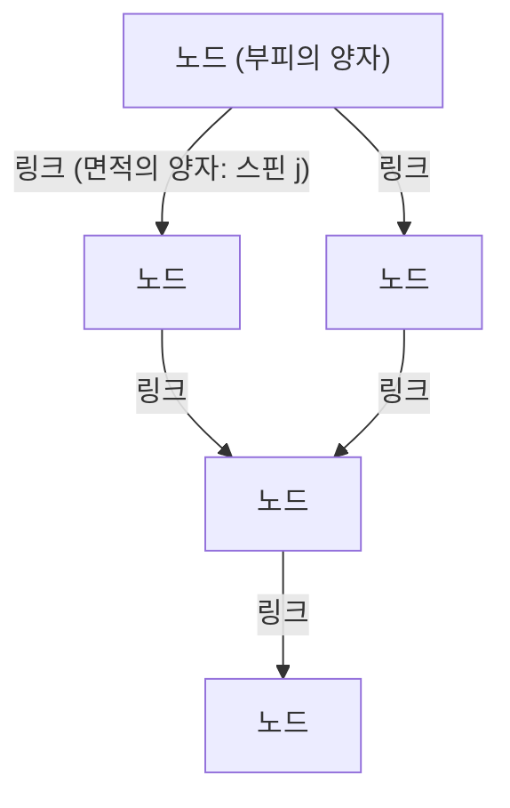

# 서론: 연속체 환상의 종언과 '양자화된 공간'

인류가 우주의 구조를 이해하려는 시도 속에서, 우리는 항상 '공간'이라는 것을 물질이 존재하기 위한 무대, 즉 무한히 분할 가능한 연속적인 배경으로 인식해 왔습니다. 뉴턴 역학의 절대 공간에서 아인슈타인의 일반 상대성 이론에 따른 역동적으로 휘어지는 시공간으로 패러다임 전환이 일어난 후에도, '시공간은 연속적이다'라는 암묵적인 전제는 유지되었습니다. 하지만 현대 물리학의 최전선에서 이 연속체라는 개념은 더 이상 유지되기 어려워지고 있습니다.

미시 세계를 설명하는 양자역학과 거시적인 중력을 설명하는 일반 상대성 이론을 통합하려는 시도 속에서 탄생한 유력한 후보 중 하나가 **루프 양자 중력 이론(Loop Quantum Gravity: LQG)**입니다. LQG가 제시하는 세계관은 우리의 직관을 근본부터 뒤집습니다. 그것은 '공간 자체가 양자화되어 있으며, 더 이상 분할할 수 없는 최소 단위로 이루어져 있다'는 것입니다.

만약 공간이 레고 블록처럼 불연속적인 구조를 갖는다면, 우리는 그 블록을 재조립하여 새로운 구조를 '설계'할 수 있지 않을까? 이 질문에서 출발하는 것이 본 기사의 주제인 **'루프 엔지니어링(Loop Engineering)'**이라는 전혀 새로운 개념입니다. 본고에서는 LQG의 기초 개념을 풀어가며, 미래에 플랑크 길이 규모에서 시공간 구조를 조작할 수 있게 된다면 인류의 기술에 어떠한 혁신이 일어날지 현재 물리학의 한계와 이론적 가설을 교차하며 깊이 고찰해 봅니다.

---

# 1. 루프 양자 중력 이론(LQG)의 기초 아키텍처

## 1.1 일반 상대성 이론과 양자역학의 상극과 배경 독립성

자연계의 4가지 기본 상호작용 중 전자기력, 강한 핵력, 약한 핵력의 세 가지는 양자역학의 틀 안에서 완벽하게 설명되며 표준 모형으로 완성되었습니다. 하지만 중력만은 끝내 양자화를 거부해 왔습니다. 그 근본적인 이유는 일반 상대성 이론이 '배경 독립적인(Background Independent)' 이론이라는 데 기인합니다.

기존의 양자장론은 평탄한 민코프스키 시공간 등 '고정된 배경 시공간' 위에서 전개됩니다. 반면 일반 상대성 이론에서는 시공간 자체가 역학적 변수이며 물질의 분포에 따라 휘어집니다. 즉, 중력을 양자화한다는 것은 **시공간 자체를 양자화한다**는 것을 의미합니다. 끈 이론(String Theory)이 특정한 배경 시공간을 가정하고 그 위를 전파하는 끈으로서 중력자(그라비톤)를 설명하는 접근법을 취하는 반면, LQG는 아인슈타인의 배경 독립성을 엄격하게 지키며 시공간의 기하학 자체를 양자화하는 접근법을 취합니다.

## 1.2 스핀 네트워크: 공간의 '원자'

LQG에서 공간의 구조를 설명하는 수학적 도구가 바로 **스핀 네트워크(Spin Network)**입니다. 원래는 로저 펜로즈(Roger Penrose)가 고안한 개념이지만, 카를로 로벨리(Carlo Rovelli)와 리 스몰린(Lee Smolin) 등에 의해 LQG의 엄밀한 상태로 정식화되었습니다.

스핀 네트워크는 노드(점)와 링크(선)로 이루어진 그래프 구조로 시각화됩니다.

- **노드(Node)**: 노드는 공간의 '부피' 양자를 나타냅니다. 각 노드는 플랑크 부피(약 $10^{-99} \text{cm}^3$) 규모의 미세한 공간 덩어리에 해당합니다.
- **링크(Link)**: 노드들을 연결하는 링크는 인접한 공간 덩어리가 교차하는 '면적'의 양자를 나타냅니다. 링크에는 반정수 $j$(스핀)가 할당되어 있으며, 이것이 면적의 크기를 결정합니다. 면적의 고윳값은 $A \propto \ell_P^2 \sqrt{j(j+1)}$ 로 주어집니다($\ell_P$는 플랑크 길이).

즉, 우리가 인식하는 연속적인 공간은 극미의 규모로 확대해 보면, 이 스핀 네트워크의 노드와 링크가 복잡하게 얽힌 네트워크 구조로 나타나는 것입니다. 공간은 '존재하는' 것이 아니라 노드 간의 관계성(링크)에 의해 '창발하는' 것으로 재해석됩니다.

## 1.3 스핀 폼: 시공간의 이력과 발전

스핀 네트워크가 '어느 한 순간의 공간' 구조를 나타낸다면, 그것이 시간에 따라 어떻게 변화해 가는지를 설명하는 것이 **스핀 폼(Spin Foam)**입니다.

양자역학에서 파인만의 경로 적분처럼, 특정 초기 스핀 네트워크 상태에서 최종 상태로의 전이 확률은 가능한 모든 스핀 폼의 합산으로 계산됩니다. 스핀 폼은 노드가 시간 방향으로 궤적을 그려 '모서리(Edge)'가 되고 링크가 '면(Face)'이 되는, 거품(폼)과 같은 고차원 네트워크 구조로 상상할 수 있습니다. 시공간이란 이 스핀 폼의 복잡한 상호작용의 중첩으로서 거시적으로 창발하는 현상인 것입니다.

---

# 2. 루프 엔지니어링: 공간의 설계와 조작

LQG가 자연을 올바르게 설명하고 있다고 가정했을 때, 기술이 극한까지 진보한 미래에는 우리가 이 스핀 네트워크의 구조를 인공적으로 조작할 수 있게 될 가능성이 있습니다. 이것이 '루프 엔지니어링'입니다.

원자를 조작하는 나노 기술, 원자핵을 조작하는 핵공학에 이어, 공간의 최소 단위인 '플랑크 규모의 기하학'을 직접 조작하는 **지오메트리 엔지니어링(기하학 공학)**의 탄생입니다.

## 2.1 공간 위상의 직접 편집

현대의 기술은 물질과 에너지를 공간 내에서 이동시키고 변형하는 데 국한되어 있습니다. 하지만 루프 엔지니어링에서는 스핀 네트워크의 링크를 끊고 다른 노드에 다시 연결하는 조작이 가능해집니다. 이는 수학적으로 공간의 위상(토폴로지) 구조를 국소적으로 변경한다는 것을 의미합니다.

### 웜홀의 인공 구축
SF의 단골 소재인 웜홀은 일반 상대성 이론의 해(아인슈타인-로젠 다리)로서 존재할 수 있지만, 이를 유지하기 위해서는 '음의 에너지'를 가진 엑조틱 물질(Exotic matter)이 필요하며 그 실현 가능성은 극히 낮다고 여겨져 왔습니다.

하지만 플랑크 규모의 조작이 가능해진다면 거시적인 음의 에너지에 의존하지 않고도 스핀 네트워크의 구조를 직접 다시 씀으로써 미세한 웜홀을 생성할 수 있을지 모릅니다. 멀리 떨어진 두 영역에 있는 노드들을 직접 링크로 연결하면, 그곳에는 새로운 인접 관계가 생겨납니다. 이 미세한 링크 다발을 거시적인 규모까지 성장시킬(스핀 네트워크의 거대한 상전이를 일으킬) 수 있다면, 횡단 가능한(Traversable) 웜홀을 구축할 수 있을지도 모릅니다.

## 2.2 초광속 통신(FTL)과 기하학적 얽힘

양자 얽힘(Quantum Entanglement)은 정보 전달에 사용할 수 없다(광속을 초과할 수 없다)는 것이 양자역학의 대원칙입니다. 하지만 루프 양자 중력 이론이나 홀로그래피 원리의 맥락에서, '공간의 연결(링크) 자체가 양자 얽힘에 의해 생겨난다'는 ER=EPR 추측(웜홀과 얽힘의 등가성)이 제안되고 있습니다.

루프 엔지니어링을 통해 특정 노드 사이에 인공적으로 극도로 강한 얽힘 상태를 구축하고 이를 안정화시킬 수 있다면, 공간의 거리를 무시한 정보의 직접 전사가 가능해질지 모릅니다. 이는 스핀 네트워크 상에서 '단축 경로(Shortcut path)'를 생성하는 것과 같으며, 겉보기상의 초광속 통신(Faster-Than-Light communication)을 실현할 가능성이 있습니다.

## 2.3 중력 제어와 스핀 네트워크의 '밀도'

질량이 존재하면 공간이 휘어져 중력이 발생한다는 것이 상대성이론의 가르침이지만, LQG의 관점에서는 질량(물질장)이 스핀 네트워크와 상호작용하여 그 링크의 분포나 노드의 밀도를 변화시키는 요인으로 작용합니다.

만약 물질을 매개하지 않고 전자기장이나 모종의 고에너지 장을 이용해 스핀 네트워크의 국소적인 상태를 직접 들뜨게 하여 노드의 밀도나 링크의 위상을 편향시킬 수 있다면, **질량이 존재하지 않는 곳에 인공적인 중력장을 생성하는** 것이 가능해집니다.

- **반중력(중력 차단)**: 스핀 네트워크의 링크를 정렬시켜 외부로부터의 기하학적 왜곡 전파를 막는 가변 위상 실드(Variable topology shield)를 전개함으로써 중력의 영향을 완전히 차단합니다.
- **알큐비에르 드라이브의 루프적 실현**: 우주선 전방의 스핀 네트워크 노드 밀도를 높여 공간을 수축시키고, 후방의 밀도를 줄여 팽창시키는 조작을 연속적으로 수행하여 워프 항법을 실현합니다.

---

# 3. 물리학적 한계와 돌파구를 위한 조건

물론 루프 엔지니어링의 실현에는 엄청난 장벽이 가로막고 있습니다.

## 3.1 플랑크 에너지의 벽

가장 큰 장벽은 에너지 규모입니다. 플랑크 길이($\sim 10^{-35}$ 미터)의 구조를 탐구하고 조작하기 위해서는 불확정성 원리에 의해 플랑크 에너지($\sim 10^{19}$ GeV)가 필요합니다. 이는 현재 CERN의 대형 강입자 충돌기(LHC) 최대 에너지의 약 1천조 배에 달하며, 카르다쇼프 척도(Kardashev scale)에서 제II~III유형 문명이 되어야 도달할 수 있는 에너지양입니다.

하지만 여기서 하나의 희망이 되는 것이 **'거시적 양자 중력 효과'**라는 이론적 가설입니다.

## 3.2 거시적 양자 중력 효과의 이용

개별 물 분자의 움직임을 알지 못해도 유체역학을 통해 파도를 제어할 수 있듯이, 스핀 네트워크의 미시적인 세부 사항을 개별적으로 조작하는 대신 시스템 전체의 집단적 들뜸(Collective excitation)을 이용하는 접근법입니다.

예를 들어 극저온·고밀도 환경에서의 보스-아인슈타인 응축(BEC)과 같은 양자 결맞음(Quantum coherent) 상태를 활용하여, 거시적인 규모에서 시공간의 요동을 공명시키는 기술을 생각해 볼 수 있습니다. 만약 특정 전자기파의 펄스 패턴과 스핀 네트워크의 들뜸 모드 사이에 비선형적인 공명 효과가 존재한다면, 플랑크 에너지에 도달하지 않더라도 비교적 낮은 에너지로 시공간 구조에 '간섭 무늬'를 만들어 위상을 제어할 수 있는 여지가 남아있습니다.

---

# 결론: 미래의 엔지니어를 위한 이정표

루프 양자 중력 이론이 제시하는 '양자화된 공간'은 단순히 우주의 기원이나 블랙홀의 특이점을 규명하기 위한 이론적 도구에 머무르지 않습니다. 그것은 먼 미래에 인류가 우주의 구조 자체를 캔버스로 삼아 자유롭게 기술을 전개하기 위한 궁극적인 '사양서'가 될 잠재력을 품고 있습니다.

물질 공학에서 기하학 공학으로의 패러다임 전환. 공간의 노드를 엮고, 시간을 형성하며, 별들을 연결하는 새로운 인프라를 구축할 '루프 엔지니어'들의 탄생은 인류가 진정한 의미에서 우주의 창조적 참여자가 되는 순간을 의미합니다. 우리는 지금 그 끝없이 장대한 규모의 첫걸음인 기초 이론 구축의 목격자가 되고 있는 것입니다.
