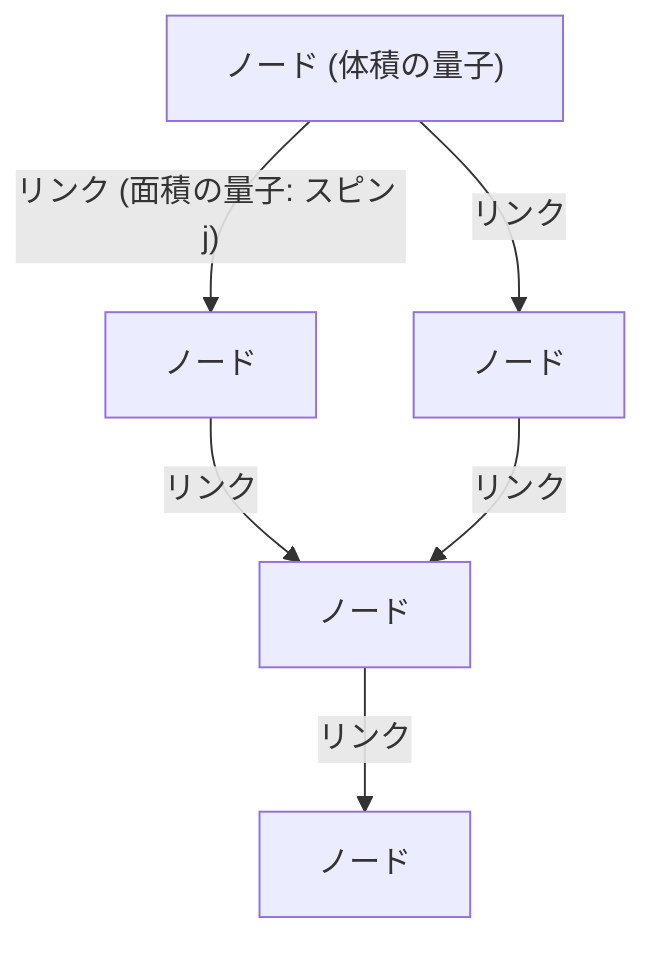
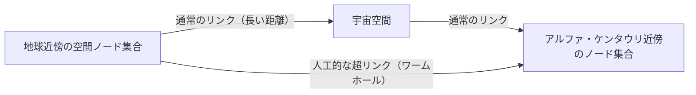

# 序論：連続体幻想の終焉と「量子化された空間」

人類が宇宙の構造を理解しようとする試みの中で、我々は常に「空間」というものを、物質が存在するための舞台、すなわち無限に分割可能な連続的な背景として捉えてきました。ニュートン力学における絶対空間から、アインシュタインの一般相対性理論における動的で曲がる時空へとパラダイムシフトが起きた後も、「時空は連続である」という暗黙の前提は保たれていました。しかし、現代物理学の最前線において、この連続体という概念はもはや維持できなくなりつつあります。

ミクロな世界を記述する量子力学と、マクロな重力を記述する一般相対性理論を統合しようとする試みの中で生まれた有力な候補の一つが**ループ量子重力理論（Loop Quantum Gravity: LQG）**です。LQGが提示する世界観は、我々の直感を根底から覆すものです。それは「空間そのものが量子化されており、それ以上分割できない最小単位から成り立っている」というものです。

もし、空間がレゴブロックのように離散的な構造を持つのだとしたら、我々はそのブロックを組み替え、新たな構造を「設計」できるのではないか？ この問いから生まれるのが、本記事の主題である**「ループエンジニアリング（Loop Engineering）」**という全く新しい概念です。本稿では、LQGの基礎概念を紐解きながら、将来的にプランク長スケールでの時空構造の操作が可能になった場合、人類の技術にどのようなブレイクスルーがもたらされるかを、現在の物理学の限界と理論的仮説を交えて深く考察します。

---

# 1. ループ量子重力理論（LQG）の基礎アーキテクチャ

## 1.1 一般相対性理論と量子力学の相克と背景独立性

自然界の四つの基本相互作用のうち、電磁気力、強い力、弱い力の三つは量子力学の枠組みで完全に記述され、標準模型として完成しています。しかし、重力だけは量子化を頑なに拒み続けてきました。その根本的な理由は、一般相対性理論が「背景独立（Background Independent）」な理論であることに起因します。

既存の場の量子論は、平坦なミンコフスキー時空などの「固定された背景時空」の上で展開されます。しかし、一般相対性理論では時空そのものが力学変数であり、物質の分布によって曲がります。つまり、重力を量子化するということは、**時空そのものを量子化する**ということを意味します。弦理論（String Theory）が特定の背景時空を仮定し、その上を伝播する弦として重力子（グラビトン）を記述するアプローチをとるのに対し、LQGはアインシュタインの背景独立性を厳密に守り、時空の幾何学そのものを量子化するアプローチをとります。

## 1.2 スピンネットワーク：空間の「原子」

LQGにおいて空間の構造を記述する数学的ツールが**スピンネットワーク（Spin Network）**です。元々はロジャー・ペンローズによって考案された概念ですが、カルロ・ロヴェッリとリー・スモーリンらによってLQGの厳密な状態として定式化されました。

スピンネットワークは、ノード（点）とリンク（線）からなるグラフ構造として視覚化されます。

- **ノード（Node）**: ノードは空間の「体積」の量子を表します。各ノードはプランク体積（約 $10^{-99} \text{cm}^3$）スケールの微小な空間の塊に対応します。
- **リンク（Link）**: ノード同士を結ぶリンクは、隣接する空間の塊が交わる「面積」の量子を表します。リンクには半整数 $j$ （スピン）が割り当てられており、これが面積の大きさを決定します。面積の固有値は $A \propto \ell_P^2 \sqrt{j(j+1)}$ で与えられます（$\ell_P$ はプランク長）。

つまり、我々が認識している連続的な空間は、極微のスケールにズームインすると、このスピンネットワークのノードとリンクが複雑に絡み合ったネットワーク構造として現れるのです。空間は「存在する」ものではなく、ノード間の関係性（リンク）によって「創発する」ものとして捉え直されます。

## 1.3 スピンフォーム：時空の履歴と発展

スピンネットワークが「ある瞬間の空間」の構造を表すのに対し、それが時間とともにどのように変化していくかを記述するのが**スピンフォーム（Spin Foam）**です。

量子力学におけるファインマンの経路積分のように、ある初期のスピンネットワーク状態から終状態への遷移確率は、可能なすべてのスピンフォームの足し合わせとして計算されます。スピンフォームは、ノードが時間方向に軌跡を描いて「エッジ（辺）」となり、リンクが「面」となるような、泡（フォーム）のような高次元のネットワーク構造としてイメージされます。時空とは、このスピンフォームの複雑な相互作用の重ね合わせとして巨視的に創発する現象なのです。

---

# 2. ループエンジニアリング：空間の設計と操作

LQGが正しく自然を記述していると仮定した場合、技術が極限まで進歩した未来において、我々はこのスピンネットワークの構造を人工的に操作できるようになる可能性があります。これが「ループエンジニアリング」です。

原子を操作するナノテクノロジー、原子核を操作する核工学に続き、空間の最小単位である「プランクスケールの幾何学」を直接操作する**ジオメトリー・エンジニアリング（幾何学工学）**の誕生です。

## 2.1 空間トポロジーの直接編集

現代の技術は物質とエネルギーを空間内で移動させ、変形させることに限定されています。しかし、ループエンジニアリングでは、スピンネットワークのリンクを切断し、別のノードに繋ぎ直すという操作が可能になります。これは数学的には、空間のトポロジー（位相構造）を局所的に変更することを意味します。

### ワームホールの人工構築
SFの定番であるワームホールは、一般相対性理論の解（アインシュタイン＝ローゼン橋）として存在可能ですが、それを維持するためには「負のエネルギー」を持つエキゾチック物質が必要とされ、その実現可能性は極めて低いと考えられてきました。

しかし、プランクスケールの操作が可能になれば、マクロな負のエネルギーに頼ることなく、スピンネットワークの構造を直接書き換えることで微小なワームホールを生成できる可能性があります。離れた二つの領域にあるノード同士を直接リンクで結びつければ、そこには新しい近接関係が生じます。この微小なリンクの束を巨視的なスケールまで成長させる（スピンネットワークの巨大な相転移を引き起こす）ことができれば、トラバーサブル（通過可能）なワームホールが構築できるかもしれません。

## 2.2 超光速通信（FTL）と幾何学的エンタングルメント

量子エンタングルメント（量子もつれ）は情報伝達に使うことはできない（光速を超えられない）というのが量子力学の大原則です。しかし、ループ量子重力理論やホログラフィック原理の文脈において、「空間のつながり（リンク）そのものが、量子エンタングルメントによって生じている」というER=EPR予想（ワームホールとエンタングルメントの等価性）が提唱されています。

ループエンジニアリングによって、特定のノード間に人工的に極めて強いエンタングルメント状態を構築し、それを安定化させることができれば、空間の距離を無視した情報の直接転写が可能になるかもしれません。これはスピンネットワーク上での「ショートカットパス」を作成することに等しく、見かけ上の超光速通信（Faster-Than-Light communication）を実現する可能性があります。

## 2.3 重力制御とスピンネットワークの「密度」

質量が存在すると空間が曲がり重力が発生する、というのが相対論の教えですが、LQGの視点では、質量（物質場）はスピンネットワークと相互作用し、そのリンクの分布やノードの密度を変化させる要因として働きます。

もし、物質を介さずに電磁場や何らかの高エネルギー場を用いて、スピンネットワークの局所的な状態を直接励起し、ノードの密度やリンクのトポロジーを偏らせることができれば、**質量が存在しない場所に人工的な重力場を生成する**ことが可能になります。

- **反重力（重力遮断）**: スピンネットワークのリンクを整列させ、外部からの幾何学的歪みの伝播を防ぐバリアブル（可変）トポロジーシールドを展開することで、重力の影響を完全に遮断する。
- **アルクビエレ・ドライブのループ的実現**: 宇宙船の前方のスピンネットワークのノード密度を高めて空間を収縮させ、後方の密度を減らして膨張させる操作を連続的に行うことで、ワープ航法を実現する。

---

# 3. 物理学的限界とブレイクスルーへの条件

もちろん、ループエンジニアリングの実現には途方もない壁が立ちはだかっています。

## 3.1 プランクエネルギーの壁

最大の障壁はエネルギースケールです。プランク長（$\sim 10^{-35}$ メートル）の構造を探り、操作するためには、不確定性原理によりプランクエネルギー（$\sim 10^{19}$ GeV）が必要です。これは現在のCERNの大型ハドロン衝突型加速器（LHC）の最大エネルギーの約一千兆倍にあたり、カルダシェフ・スケールにおけるタイプII〜IIIの文明でなければ到達不可能なエネルギー量です。

しかし、ここで一つの希望となるのが**「巨視的量子重力効果」**の理論的仮説です。

## 3.2 巨視的量子重力効果の利用

個々の水分子の挙動を知らなくても流体力学によって波を制御できるように、スピンネットワークのミクロな詳細を個別に操作するのではなく、系全体の集団的励起（コレクティブ・エキサイテーション）を利用するアプローチです。

例えば、極低温・高密度環境下のボース・アインシュタイン凝縮（BEC）のような量子コヒーレントな状態を利用し、巨視的なスケールで時空のゆらぎを共鳴させる技術が考えられます。もし、特定の電磁波のパルスパターンとスピンネットワークの励起モードに非線形な共鳴効果が存在すれば、プランクエネルギーに達せずとも、比較的低エネルギーで時空の構造に「干渉縞」を作り出し、トポロジーを制御できる余地が残されています。

---

# 結論：未来のエンジニアへの道標

ループ量子重力理論が提示する「量子化された空間」は、単に宇宙の起源やブラックホールの特異点を解明するための理論的道具にとどまりません。それは遠い未来、人類が宇宙の構造そのものをキャンバスとして自由に技術を展開するための、究極の「仕様書」となる可能性を秘めています。

物質工学から幾何学工学へのパラダイムシフト。空間のノードを編み込み、時間を形作り、星々を繋ぐ新しいインフラストラクチャーを構築する「ループエンジニア」たちの誕生は、人類が真の意味で宇宙の創造的参加者となる瞬間を意味します。我々は今、その果てしなく壮大なスケールの第一歩である、基礎理論の構築の目撃者となっているのです。
