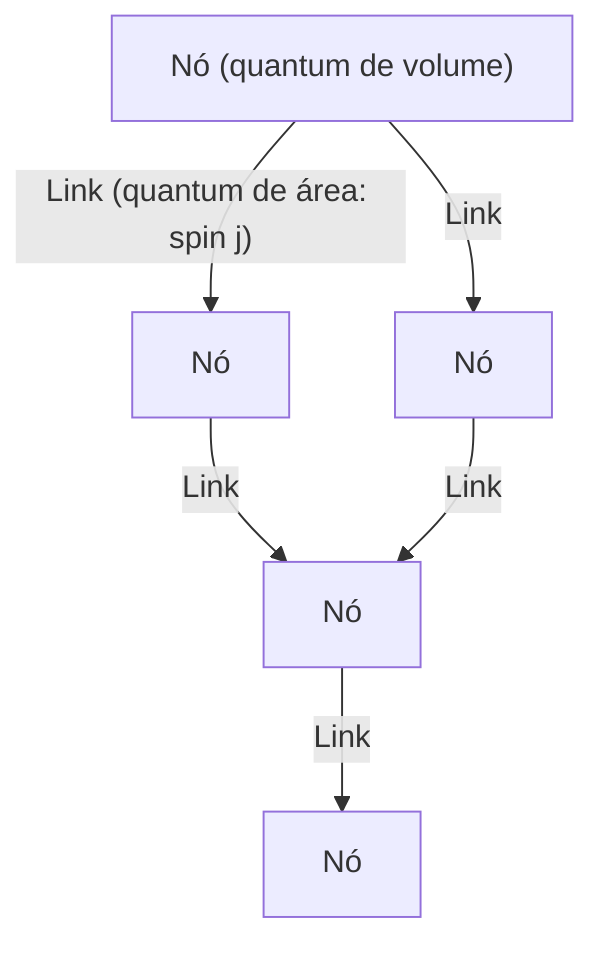
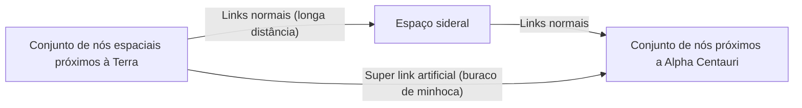

# Introdução: O Fim da Ilusão do Contínuo e o 'Espaço Quantizado'

Nas tentativas da humanidade de compreender a estrutura do universo, sempre consideramos o 'espaço' como um palco para a existência da matéria, isto é, um plano de fundo contínuo infinitamente divisível. Mesmo após a mudança de paradigma do espaço absoluto na mecânica newtoniana para o espaço-tempo dinâmico e curvo da relatividade geral de Einstein, a premissa implícita de que 'o espaço-tempo é contínuo' foi mantida. No entanto, na vanguarda da física moderna, esse conceito de contínuo não pode mais ser sustentado.

Um dos principais candidatos que surgiram da tentativa de unificar a mecânica quântica, que descreve o mundo micro, e a relatividade geral, que descreve a gravidade macro, é a **Teoria da Gravidade Quântica em Loop (Loop Quantum Gravity: LQG)**. A visão de mundo apresentada pela LQG subverte nossa intuição desde os fundamentos. É a ideia de que 'o próprio espaço é quantizado, composto de unidades mínimas que não podem ser mais divididas'.

Se o espaço tem uma estrutura discreta como blocos de Lego, poderíamos reorganizar esses blocos e 'projetar' novas estruturas? Dessa questão surge o tema central deste artigo, um conceito totalmente novo chamado **'Engenharia de Loops (Loop Engineering)'**. Neste artigo, ao desvendar os conceitos básicos da LQG, consideraremos profundamente quais avanços tecnológicos seriam trazidos para a humanidade se no futuro for possível manipular a estrutura do espaço-tempo na escala do comprimento de Planck, mesclando as limitações da física atual e hipóteses teóricas.

---

# 1. Arquitetura Básica da Teoria da Gravidade Quântica em Loop (LQG)

## 1.1 O Conflito entre a Relatividade Geral e a Mecânica Quântica, e a Independência de Fundo

Das quatro interações fundamentais da natureza, três - força eletromagnética, força forte e força fraca - são perfeitamente descritas pela estrutura da mecânica quântica e completas como o Modelo Padrão. No entanto, a gravidade se recusou obstinadamente a ser quantizada. A razão fundamental decorre do fato de que a relatividade geral é uma teoria de 'Independência de Fundo (Background Independent)'.

A teoria quântica de campos existente se desenvolve em um 'espaço-tempo de fundo fixo', como o espaço-tempo plano de Minkowski. No entanto, na relatividade geral, o próprio espaço-tempo é uma variável dinâmica e é curvado pela distribuição da matéria. Em outras palavras, quantizar a gravidade significa **quantizar o próprio espaço-tempo**. Enquanto a Teoria das Cordas (String Theory) assume um espaço-tempo de fundo específico e descreve o gráviton como uma corda propagando-se sobre ele, a LQG protege estritamente a independência de fundo de Einstein e adota uma abordagem de quantizar a própria geometria do espaço-tempo.

## 1.2 Redes de Spin: Os 'Átomos' do Espaço

A ferramenta matemática que descreve a estrutura do espaço na LQG é a **Rede de Spin (Spin Network)**. Embora tenha sido originalmente concebida por Roger Penrose, foi formulada como um estado rigoroso na LQG por Carlo Rovelli, Lee Smolin e outros.

Uma rede de spin é visualizada como uma estrutura de grafo consistindo em nós (pontos) e links (linhas).

- **Nó (Node)**: Os nós representam quanta de 'volume' do espaço. Cada nó corresponde a um minúsculo pedaço de espaço na escala do volume de Planck (aproximadamente $10^{-99} \text{cm}^3$).
- **Link (Link)**: Os links que conectam os nós representam quanta da 'área' onde se cruzam pedaços adjacentes de espaço. Um meio inteiro $j$ (spin) é atribuído ao link, o que determina o tamanho da área. O autovalor da área é dado por $A \propto \ell_P^2 \sqrt{j(j+1)}$ (onde $\ell_P$ é o comprimento de Planck).

Em outras palavras, quando ampliamos o espaço contínuo que percebemos para uma escala minúscula, ele aparece como uma complexa rede de nós e links interconectados de redes de spin. O espaço é reconceitualizado não como algo que 'existe', mas sim como algo que 'emerge' através das relações (links) entre os nós.

## 1.3 Espumas de Spin: História e Evolução do Espaço-Tempo

Enquanto as redes de spin representam a estrutura do 'espaço em um dado momento', a **Espuma de Spin (Spin Foam)** descreve como ele evolui ao longo do tempo.

Como a integral de caminho de Feynman na mecânica quântica, a probabilidade de transição de um estado inicial de rede de spin para um estado final é calculada como a soma de todas as espumas de spin possíveis. A espuma de spin é imaginada como uma estrutura de rede multidimensional parecida com espuma, onde os nós traçam uma trajetória na direção do tempo para se tornarem 'arestas (bordas)' e os links se tornam 'faces (superfícies)'. O espaço-tempo é o fenômeno que emerge macroscopicamente como uma superposição dessas interações complexas de espuma de spin.

---

# 2. Engenharia de Loops: Projeto e Manipulação do Espaço

Se assumirmos que a LQG descreve corretamente a natureza, em um futuro onde a tecnologia tenha avançado ao extremo, há a possibilidade de que seremos capazes de manipular artificialmente a estrutura das redes de spin. Isso é a 'Engenharia de Loops'.

Seguindo a nanotecnologia, que manipula átomos, e a engenharia nuclear, que manipula núcleos, é o nascimento da **Engenharia Geométrica (Geometry Engineering)**, que manipula diretamente a 'geometria da escala de Planck', a menor unidade do espaço.

## 2.1 Edição Direta da Topologia Espacial

A tecnologia moderna é limitada a mover e transformar matéria e energia dentro do espaço. No entanto, na engenharia de loops, torna-se possível cortar links na rede de spin e reconectá-los a outros nós. Matematicamente, isso significa alterar a topologia do espaço localmente.

### Construção Artificial de Buracos de Minhoca
O buraco de minhoca, um elemento básico da ficção científica, é possível como uma solução na relatividade geral (Ponte de Einstein-Rosen), mas mantê-lo requer matéria exótica com 'energia negativa', e sua viabilidade tem sido considerada extremamente baixa.

No entanto, se a manipulação na escala de Planck se tornar possível, em vez de depender de energia negativa macroscópica, poderíamos gerar buracos de minhoca microscópicos reescrevendo diretamente a estrutura da rede de spin. Ao conectar diretamente nós em duas regiões distantes com um link, uma nova relação de adjacência é criada lá. Se esse feixe de links minúsculos puder ser desenvolvido para uma escala macroscópica (desencadeando uma transição de fase gigante na rede de spin), buracos de minhoca atravessáveis podem ser construídos.

## 2.2 Comunicação Mais Rápida que a Luz (FTL) e Emaranhamento Geométrico

É um princípio fundamental da mecânica quântica que o emaranhamento quântico não pode ser usado para transmissão de informações (não pode exceder a velocidade da luz). No entanto, no contexto da gravidade quântica em loop e do princípio holográfico, foi proposta a conjectura ER=EPR (a equivalência entre buracos de minhoca e emaranhamento), que sugere que 'a própria conexão (link) do espaço é criada pelo emaranhamento quântico'.

Através da engenharia de loops, se estados de emaranhamento extremamente fortes puderem ser construídos e estabilizados artificialmente entre nós específicos, poderá ser possível transferir informações diretamente, ignorando distâncias espaciais. Isso é equivalente a criar um 'caminho de atalho' na rede de spin e poderia potencialmente realizar a comunicação aparente mais rápida que a luz (Faster-Than-Light communication).

## 2.3 Controle da Gravidade e 'Densidade' da Rede de Spin

A relatividade ensina que a presença de massa curva o espaço e gera gravidade, mas na visão da LQG, a massa (campo material) interage com a rede de spin, agindo como um fator que altera a distribuição dos seus links e a densidade dos nós.

Se usarmos campos eletromagnéticos ou algum tipo de campo de alta energia sem o intermédio da matéria para excitar diretamente estados locais da rede de spin e polarizar a densidade dos nós ou a topologia dos links, será possível **gerar campos gravitacionais artificiais em locais onde não há massa**.

- **Antigravidade (Bloqueio Gravitacional)**: Ao alinhar os links da rede de spin e implantar um escudo de topologia variável que impede a propagação de distorções geométricas externas, bloquearia completamente os efeitos da gravidade.
- **Realização em Loop do Motor de Alcubierre**: Ao realizar uma operação contínua de aumentar a densidade dos nós da rede de spin na frente da espaçonave para contrair o espaço e reduzir a densidade atrás para expandi-lo, realizaríamos a viagem de dobra (warp).

---

# 3. Limites Físicos e Condições para um Avanço

Obviamente, há obstáculos tremendos que dificultam a realização da engenharia de loops.

## 3.1 A Barreira da Energia de Planck

A maior barreira é a escala de energia. Para explorar e manipular estruturas no comprimento de Planck ($\sim 10^{-35}$ metros), a energia de Planck ($\sim 10^{19}$ GeV) é necessária devido ao princípio da incerteza. Isso é cerca de um quatrilhão de vezes a energia máxima do atual Grande Colisor de Hádrons (LHC) do CERN, e é uma quantidade de energia inatingível a menos que seja uma civilização do Tipo II a III na escala de Kardashev.

No entanto, uma esperança aqui é a hipótese teórica dos **'efeitos macroscópicos da gravidade quântica'**.

## 3.2 Utilização dos Efeitos Macroscópicos da Gravidade Quântica

Assim como as ondas podem ser controladas pela dinâmica de fluidos sem conhecer o comportamento das moléculas individuais de água, essa é uma abordagem que utiliza excitações coletivas de todo o sistema, em vez de manipular individualmente os detalhes microscópicos da rede de spin.

Por exemplo, uma tecnologia concebível usaria estados quânticos coerentes, como condensados de Bose-Einstein (BEC) em ambientes de temperatura ultrabaixa e alta densidade, para ressoar flutuações do espaço-tempo em uma escala macroscópica. Se houver um efeito de ressonância não linear entre um padrão de pulso eletromagnético específico e o modo de excitação da rede de spin, restará espaço para criar 'franjas de interferência' na estrutura do espaço-tempo com energia relativamente baixa, mesmo sem atingir a energia de Planck, e assim controlar a topologia.

---

# Conclusão: Um Guia para os Engenheiros do Futuro

O 'espaço quantizado' apresentado pela teoria da gravidade quântica em loop não é apenas uma ferramenta teórica para elucidar a origem do universo e as singularidades dos buracos negros. Tem o potencial de se tornar a 'especificação' definitiva em um futuro distante, onde a humanidade poderá desenvolver tecnologia livremente usando a própria estrutura do universo como tela.

A mudança de paradigma da engenharia de materiais para a engenharia geométrica. O nascimento de 'engenheiros de loops' que tecem nós espaciais, moldam o tempo e constroem novas infraestruturas conectando estrelas significará o momento em que a humanidade se torna, no verdadeiro sentido, um participante criativo do universo. Somos hoje testemunhas do primeiro passo dessa escala infinitamente grandiosa: a construção da teoria fundamental.
