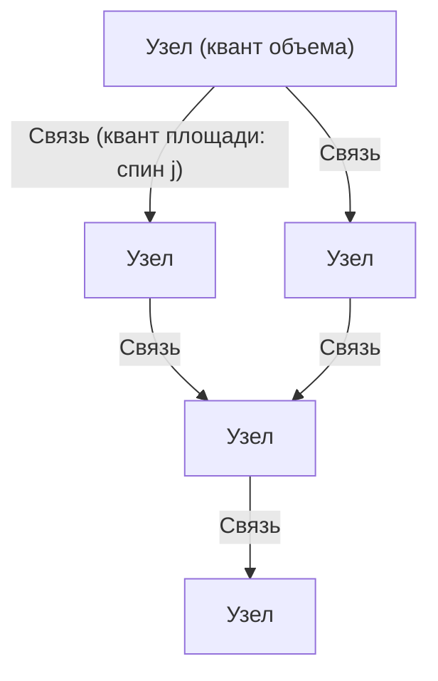
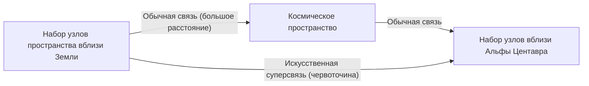

# Введение: Конец иллюзии континуума и «Квантованное пространство»

В попытках человечества понять структуру Вселенной мы всегда воспринимали «пространство» как сцену для существования материи, то есть как бесконечно делимый непрерывный фон. Даже после смены парадигмы от абсолютного пространства в ньютоновской механике к динамичному, искривленному пространству-времени в общей теории относительности Эйнштейна, неявное предположение о том, что «пространство-время непрерывно», сохранялось. Однако на переднем крае современной физики эта концепция континуума становится всё менее состоятельной.

Одним из ведущих кандидатов, родившихся в результате попыток объединить квантовую механику, описывающую микромир, и общую теорию относительности, описывающую макроскопическую гравитацию, является **петлевая квантовая гравитация (Loop Quantum Gravity: LQG)**. Картина мира, предлагаемая LQG, в корне переворачивает нашу интуицию. Она утверждает, что «само пространство квантуется и состоит из минимальных неделимых единиц».

Если пространство имеет дискретную структуру, подобно кубикам Lego, то не можем ли мы переставлять эти блоки и «проектировать» новые структуры? Из этого вопроса рождается **«Инженерия петель» (Loop Engineering)** — совершенно новая концепция, являющаяся главной темой этой статьи. В этой статье мы раскроем фундаментальные концепции LQG и глубоко исследуем, опираясь на пределы современной физики и теоретические гипотезы, какие технологические прорывы могут произойти для человечества в будущем, если станет возможным манипулировать структурой пространства-времени в масштабе планковской длины.

---

# 1. Базовая архитектура петлевой квантовой гравитации (LQG)

## 1.1 Конфликт между общей теорией относительности и квантовой механикой и независимость от фона

Из четырех фундаментальных взаимодействий в природе три — электромагнитное, сильное и слабое — полностью описываются в рамках квантовой механики и завершены в виде Стандартной модели. Однако гравитация упорно сопротивляется квантованию. Основная причина этого заключается в том, что общая теория относительности является «независимой от фона» (Background Independent).

Существующая квантовая теория поля разворачивается на «фиксированном фоновом пространстве-времени», таком как плоское пространство-время Минковского. Однако в общей теории относительности само пространство-время является динамической переменной и искривляется под влиянием распределения материи. Иными словами, квантование гравитации означает **квантование самого пространства-времени**. В то время как теория струн (String Theory) предполагает определенное фоновое пространство-время и описывает гравитоны как струны, распространяющиеся по нему, LQG строго придерживается эйнштейновской независимости от фона и применяет подход, квантующий саму геометрию пространства-времени.

## 1.2 Спиновая сеть: «Атомы» пространства

Математическим инструментом для описания структуры пространства в LQG является **спиновая сеть (Spin Network)**. Первоначально эта концепция была предложена Роджером Пенроузом, а затем строго сформулирована как состояние в LQG Карло Ровелли, Ли Смолиным и другими.

Спиновая сеть визуализируется как графовая структура, состоящая из узлов (точек) и связей (линий).

- **Узел (Node)**: Узлы представляют собой кванты «объема» пространства. Каждый узел соответствует крошечному фрагменту пространства в масштабе планковского объема (около $10^{-99} \text{см}^3$).
- **Связь (Link)**: Связи, соединяющие узлы, представляют собой кванты «площади», где пересекаются соседние фрагменты пространства. Каждой связи присваивается полуцелое число $j$ (спин), которое определяет размер площади. Собственное значение площади задается формулой $A \propto \ell_P^2 \sqrt{j(j+1)}$ (где $\ell_P$ — планковская длина).

Другими словами, непрерывное пространство, которое мы воспринимаем, при увеличении до микроскопических масштабов проявляется как сложная сетевая структура, в которой переплетены узлы и связи спиновой сети. Пространство переосмысливается не как нечто «существующее», а как нечто, что «возникает» через взаимоотношения (связи) между узлами.

## 1.3 Спиновая пена: История и эволюция пространства-времени

В то время как спиновая сеть представляет структуру пространства «в данный момент», то, как она изменяется со временем, описывается **спиновой пеной (Spin Foam)**.

Подобно фейнмановским интегралам по траекториям в квантовой механике, вероятность перехода от некоторого начального состояния спиновой сети к конечному рассчитывается как сумма всех возможных спиновых пен. Спиновую пену можно представить как высокоразмерную сетевую структуру, похожую на пену, где узлы, двигаясь во времени, рисуют траектории и становятся «ребрами», а связи — «гранями». Пространство-время — это явление, которое макроскопически возникает как суперпозиция сложных взаимодействий этой спиновой пены.

---

# 2. Инженерия петель: Проектирование и манипулирование пространством

Предполагая, что LQG правильно описывает природу, в будущем, когда технологии достигнут своего предела, мы, возможно, сможем искусственно манипулировать структурой этой спиновой сети. Это и есть «инженерия петель».

Вслед за нанотехнологиями, манипулирующими атомами, и ядерной инженерией, манипулирующей атомными ядрами, наступит рождение **геометрической инженерии (Geometry Engineering)**, напрямую манипулирующей минимальной единицей пространства — «геометрией в планковском масштабе».

## 2.1 Прямое редактирование топологии пространства

Современные технологии ограничены перемещением и деформацией материи и энергии в пространстве. Однако в инженерии петель станет возможной операция разрыва связей спиновой сети и их переподключения к другим узлам. Математически это означает локальное изменение топологии (фазовой структуры) пространства.

### Искусственное создание червоточин
Червоточины, классика научной фантастики, могут существовать как решения общей теории относительности (мосты Эйнштейна — Розена), но для их поддержания требуется экзотическая материя с «отрицательной энергией», и их осуществимость считается крайне низкой.

Однако, если станут возможными манипуляции в планковском масштабе, мы сможем генерировать микроскопические червоточины, напрямую переписывая структуру спиновой сети, не полагаясь на макроскопическую отрицательную энергию. Если напрямую связать узлы в двух удаленных областях пространства, там возникнет новое отношение близости. Если пучок этих крошечных связей удастся вырастить до макроскопических масштабов (вызвав гигантский фазовый переход спиновой сети), возможно, удастся построить проходимую (traversable) червоточину.

## 2.2 Сверхсветовая связь (FTL) и геометрическая запутанность

Один из главных принципов квантовой механики гласит, что квантовая запутанность не может использоваться для передачи информации (превышения скорости света). Однако в контексте петлевой квантовой гравитации и голографического принципа была предложена гипотеза ER=EPR (эквивалентность червоточин и запутанности), согласно которой «сама пространственная связь возникает из-за квантовой запутанности».

Если с помощью инженерии петель мы сможем искусственно создать чрезвычайно сильное состояние запутанности между определенными узлами и стабилизировать его, может стать возможной прямая передача информации в обход пространственных расстояний. Это равносильно созданию «короткого пути» в спиновой сети и может позволить реализовать кажущуюся сверхсветовую связь (Faster-Than-Light communication).

## 2.3 Управление гравитацией и «плотность» спиновой сети

Теория относительности учит, что гравитация возникает при искривлении пространства из-за присутствия массы. Однако с точки зрения LQG масса (поле материи) взаимодействует со спиновой сетью и действует как фактор, изменяющий распределение ее связей и плотность узлов.

Если мы сможем напрямую возбуждать локальные состояния спиновой сети, используя электромагнитные поля или некоторые высокоэнергетические поля без посредства материи, и тем самым смещать плотность узлов и топологию связей, станет возможным **генерировать искусственные гравитационные поля в местах, где нет массы**.

- **Антигравитация (блокирование гравитации)**: Выравнивание связей спиновой сети для развертывания щита с переменной топологией, который предотвращает распространение геометрических искажений извне, тем самым полностью блокируя воздействие гравитации.
- **Реализация двигателя Алькубьерре на основе петель**: Непрерывное увеличение плотности узлов спиновой сети перед космическим кораблем для сжатия пространства и уменьшение плотности позади для его расширения позволит реализовать варп-двигатель.

---

# 3. Физические пределы и условия для прорыва

Безусловно, на пути к реализации инженерии петель стоят невообразимые препятствия.

## 3.1 Барьер планковской энергии

Самым большим препятствием является масштаб энергии. Чтобы исследовать структуру на планковской длине ($\sim 10^{-35}$ метров) и манипулировать ею, из-за принципа неопределенности требуется планковская энергия ($\sim 10^{19}$ ГэВ). Это примерно в квадриллион раз больше максимальной энергии нынешнего Большого адронного коллайдера (БАК) в ЦЕРН, и это количество энергии, которое недостижимо, если цивилизация не достигнет типа II–III по шкале Кардашева.

Однако одна надежда кроется в теоретической гипотезе о **«макроскопических квантово-гравитационных эффектах»**.

## 3.2 Использование макроскопических квантово-гравитационных эффектов

Подобно тому, как гидродинамика позволяет нам управлять волнами, не зная поведения отдельных молекул воды, этот подход использует коллективное возбуждение всей системы, а не индивидуальные манипуляции микроскопическими деталями спиновой сети.

Например, можно представить технологии, использующие квантово-когерентные состояния, такие как конденсат Бозе-Эйнштейна (БЭК) в криогенных средах с высокой плотностью, для резонанса флуктуаций пространства-времени в макроскопическом масштабе. Если существует нелинейный резонансный эффект между определенными импульсными структурами электромагнитных волн и модами возбуждения спиновой сети, остается возможность создавать «интерференционные картины» в структуре пространства-времени и управлять топологией при относительно низких энергиях, не достигая планковской энергии.

---

# Заключение: Путеводная звезда для инженеров будущего

«Квантованное пространство», предлагаемое петлевой квантовой гравитацией, — это не просто теоретический инструмент для разгадки происхождения Вселенной или сингулярностей черных дыр. Оно скрывает в себе потенциал стать окончательной «спецификацией» для человечества, позволяющей свободно развивать технологии, используя саму структуру Вселенной в качестве холста в далеком будущем.

Смена парадигмы от материальной инженерии к геометрической инженерии. Появление «инженеров петель», которые сплетают узлы пространства, формируют время и строят новую инфраструктуру, соединяющую звезды, ознаменует момент, когда человечество станет по-настоящему творческим участником во Вселенной. Прямо сейчас мы являемся свидетелями создания фундаментальной теории, что является первым шагом в этом бесконечно грандиозном масштабе.
